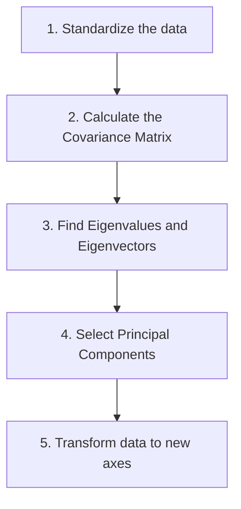
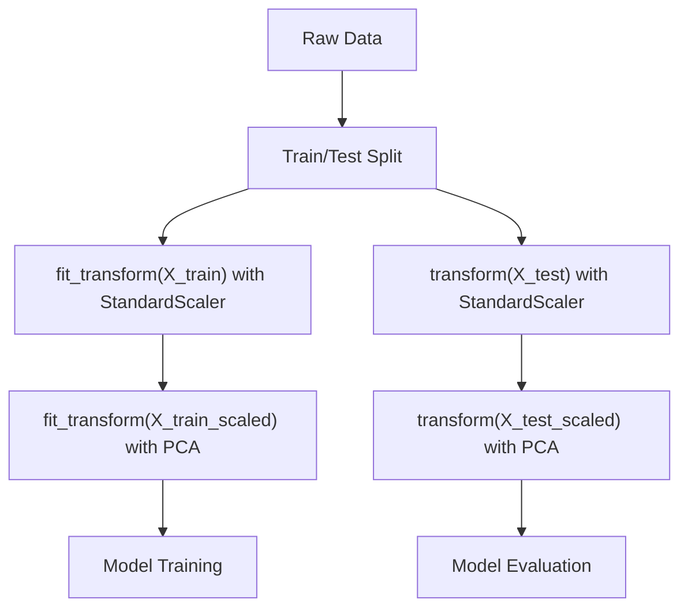

# Lecture 1: Review of ML Fundamentals and Dimensionality Reduction

## CRISP-DM Methodology Review

**CRISP-DM (Cross-Industry Standard Process for Data Mining)**: the standard methodology for any machine learning project. The steps are:

1. **Business Understanding**: understand the problem domain
2. **Data Understanding**: explore and understand the data
3. **Data Preparation**: clean, transform, and prepare data for modeling
4. **Modeling**: build and train models
5. **Evaluation**: evaluate the model to ensure it works correctly
6. **Deployment**: deploy the model into production


*(reconstructed diagram)*

### CRISP-DM Sub-Tasks

| Business Understanding | Data Understanding | Data Preparation | Modeling | Evaluation | Deployment |
|---|---|---|---|---|---|
| Determine Business Objectives | Collect Initial Data | Select Data | Select Modeling Technique | Evaluate Results | Plan Deployment |
| Assess Situation | Describe Data | Clean Data | Generate Test Design | Review Process | Plan Monitoring & Maintenance |
| Determine Data Mining Goals | Explore Data | Construct Data | Build Model | Determine Next Steps | Produce Final Report |
| Produce Project Plan | Verify Data Quality | Integrate Data | Assess Model | | Review Project |
| | | Format Data | | | |

### Exception: Image Data

When working with images, you do **not** need the understanding or data preparation phases. Only **scaling** is required. The input values for images are **pixels**, so there is no need for encoding, creating new columns, or constructing new features.

---

## Supervised vs. Unsupervised Learning Review

| Type | Techniques Covered Last Term |
|---|---|
| **Supervised: Classification** | kNN, Decision Tree, Random Forest, Logistic Regression |
| **Supervised: Regression** | Simple, Multiple, Multivariate |
| **Unsupervised: Clustering** | K-Means, Agglomerative, DBSCAN |
| **Unsupervised: Outlier Detection** | Local Outlier Factor, Isolation Forest |

---

## Data Preprocessing Review

### Preprocessing Categories

- **Data cleaning** - handling missing & duplicate data, handling noise etc.
- **Data integration** - combine data from multiple sources
- **Data transformation** - normalization, standardization, binning
- **Data reduction** - dimensionality reduction

### Key Preprocessing Steps

1. **Handle missing data**
2. **Handle duplicates**: determine whether they are actual duplicates or artifacts of data preparation

### Why Duplicates Appear (Real-World Insight)

When working with government or institutional data (e.g., crash data), you might see 30% duplicates. This is often **not** because the data has true duplicates. The explanation:

- You start with ~80 columns and narrow down to 15 or 20 columns
- By removing unique identifiers (variables that distinguish records), multiple rows that were originally distinct now appear identical
- They are **not actual duplicates**, they just look like duplicates after column removal

True duplicates are very unlikely in government data. Possible exceptions:
- Two officers entered the same case independently
- A sensor transmits data with the same timestamp (up to millisecond/microsecond precision)

Additionally, data can be **integrated from multiple sources** as part of the data cleaning and preparation process.

### Data Transformation

#### Normalization
**Normalization (Min-Max Scaling)**: rescaling values so that every value falls between 0 and 1.

$$X_{norm} = \frac{X - X_{min}}{X_{max} - X_{min}}$$
*(reconstructed formula)*

**Range Normalization**: rescaling values to a custom range (e.g., 1 to 10). You specify the desired min and max.

$$X_{range} = \frac{(X - X_{min})}{(X_{max} - X_{min})} \times (new_{max} - new_{min}) + new_{min}$$
*(reconstructed formula)*

#### Standardization
**Standardization (Z-score)**: transforming values so they are centred around the origin (mean = 0, standard deviation = 1).

$$Z = \frac{X - \mu}{\sigma}$$
*(reconstructed formula)*

#### Binning
**Binning**: grouping continuous values into discrete bins.

| Type | Description | Example |
|---|---|---|
| **Equal Width Binning** | Splits the range into b bins each of size `range / b` | Age 0-10 → Bin 1, Age 10-20 → Bin 2 |
| **Equal Frequency Binning** | Sorts values in ascending order, then places an equal number of instances into each bin | First 20 instances → Bin 1, Next 20 → Bin 2 |

### Sampling

Sampling types include **top sampling**, **random sampling**, and **stratified sampling**.

**Stratified Sampling**: divide the population into subgroups (strata), then sample a percentage from each stratum.

- **Example by age**: strata could be child, adult, senior, elder. Take a fixed percentage from each group.
- **Example by month**: each month is a stratum. Take 10,000 instances from January, 10,000 from February, etc.

> **Course note**: All of the above preprocessing topics were covered last term. Students are expected to already know them and should refresh their knowledge if needed.

---

## Dimensionality Reduction

### Why Reduce Dimensions?

When you have a very large number of features (e.g., 100,000 or 1,000,000), it becomes difficult to manage. Consider the **Euclidean distance** between two instances:

$$d = \sqrt{\sum_{i=1}^{n}(x_i - y_i)^2}$$

If you have 10,000 features, there are 10,000 terms inside the formula. Reducing the number of features reduces computational complexity.

> The goal: reduce the number of features **while retaining essential information**, and solve the problem in **lower dimensions**.

### The Tradeoff

You can specify how much information you want to keep:
- 90% of information retained
- 80% of information retained
- The more you reduce, the more information you may lose

### Drawbacks of High Dimensionality

- **Time consuming**
- **High memory consumption**
- **Complex models**
- **Hard to create visualizations**: we can visualize at most 3 dimensions. Beyond that, there is no way to visualize.

### Curse of Dimensionality

With 10,000 features, every instance is a point in a 10,000-dimensional space. As the number of dimensions grows:
- Every point becomes **sparse** (far apart from other points)
- It becomes **very hard to find patterns**
- Distance values lose meaningful information
- You need **massive amounts of data** to find patterns in high-dimensional space

> That is why it's better to reduce the number of dimensions, but without losing too much information.

### Feature Selection vs. Feature Extraction

| Approach | Description | When Covered |
|---|---|---|
| **Feature Selection** | Select relevant features, ignore redundant/irrelevant ones (keeps a subset of the original features) | Last term |
| **Feature Extraction** | Create **new synthetic features** that represent the original data meaningfully (transforms data onto a new feature space) | This class |

Feature extraction can construct new features by combining existing features, reducing dimensionality to d < k, where k is the total number of dimensions (features).

Two main feature extraction techniques:
1. **Principal Component Analysis (PCA)**
2. **Linear Discriminant Analysis (LDA)**

---

## Principal Component Analysis (PCA)

### Core Concept

Given data with multiple features (e.g., length and width), PCA finds a **new axis** (or set of axes) that represents the data meaningfully in **fewer dimensions**.

**The question**: instead of keeping length and width as two separate features, can we find **one synthetic axis** that represents these points meaningfully in one dimension?

### How PCA Works (Intuitive Explanation)

1. You can draw an **infinite number of lines** passing through the origin in the feature space
2. For each line, **project all data points** onto that line
3. Measure the **distance** from each projected point to the origin ($d_1, d_2, \ldots, d_n$)
4. The line where the **sum of all distances is maximized** is the best axis
5. Maximum sum of distances = maximum **variance** = maximum **spread**

> **Key insight**: we are looking for the line (axis) onto which, when points are projected, the projected points are **spread out the most**. That axis captures the most information.

### Example with Six Points

Given six data points projected onto a candidate line, you get distances $d_1$ through $d_6$.

- **Line L1**: sum of distances = 2.8
- **Line L2**: sum of distances = 5.6
- L2 has points spread more than L1, so **L2 is the better axis**

You can create an infinite number of candidate lines, but the one that **maximizes the spread** of projected points is the principal component.

### Animation Reference

The lecture slides contain an animation showing various lines through the data. For every line, the points are projected and the variance is measured on a scale from -3 to +3. The line parallel to the purple segment is the best line that maximizes the variance.

> **Course note**: the slides contain a simulation/animation created by external contributors. The lecturer credited them and recommends reading the associated page for deeper understanding.

### Standardization Requirement

Before performing PCA, data **must be standardized**. Otherwise, if variables are on different scales (e.g., age vs. salary), the results are meaningless. When data is standardized, it is centred about the origin, so the lines pass through the origin.

> There are different variations of PCA in the literature. Some use **mean-centered data** (subtracting the mean only), while this lecture works with **fully standardized data** (mean = 0, SD = 1).

### Mathematical Steps of PCA


*(reconstructed diagram)*

1. **Standardize the data**: ensure all features are on the same scale
2. **Calculate the covariance matrix**: captures the relationships between attributes
3. **Find eigenvalues and eigenvectors**: using linear algebra to find the directions of maximum variance
4. **Select principal components**: choose how many new axes (components) to keep
5. **Transform the data**: project original standardized data onto the new axes

> **Key distinction**: finding principal components means finding **new axes**, not new points. The original standardized data must then be **transformed** (projected) onto these new axes to get the new point values.

> **Course note**: an Excel sheet with step-by-step calculations is provided for hands-on practice.

### Covariance Matrix of Iris Standardized Dataset

| Attributes | SL | SW | PL | PW |
|---|---|---|---|---|
| **SL** | 1.000 | -0.109 | 0.872 | 0.818 |
| **SW** | -0.109 | 1.000 | -0.421 | -0.357 |
| **PL** | 0.872 | -0.421 | 1.000 | 0.963 |
| **PW** | 0.818 | -0.357 | 0.963 | 1.000 |

*(SL = Sepal Length, SW = Sepal Width, PL = Petal Length, PW = Petal Width)*

### Eigenvalues and Eigenvectors

- **Eigenvectors:** direction of the axes where there is the most variance (principal components)
- **Eigenvalues:** coefficients attached to eigenvectors, which give the amount of variance carried in each principal component
- By ranking the eigenvectors in order of their eigenvalues, highest to lowest, we get the principal components in order of significance

#### Iris Dataset Eigenvalues and Eigenvectors

- **Eigenvalues:** [2.94, 0.92, 0.15, 0.02]
- **Eigenvectors:**

```
[[ 0.52  -0.38  -0.72   0.26]
 [-0.27  -0.92   0.24  -0.12]
 [ 0.58  -0.02   0.14  -0.80]
 [ 0.56  -0.07   0.63   0.52]]
```

- **Variance explained by each component:** [0.73, 0.23, 0.04, 0.005]
  - 2.94 / (2.94 + 0.92 + 0.15 + 0.02) = **0.73**
  - 0.92 / (2.94 + 0.92 + 0.15 + 0.02) = **0.23**

> Based on the variances, 96% (73 + 23) of information is compressed in the first two principal components.

### Correlation Review (Needed for Covariance Matrix)

| Correlation Value | Meaning |
|---|---|
| Positive (+) | Both attributes increase or decrease together (e.g., height and weight) |
| Negative (-) | One increases while the other decreases |
| 1 | Perfect positive correlation |
| 0 | No correlation |

> **Important**: correlated features are NOT removed during PCA (that would be feature selection). The correlations are reflected in the final calculation. Once you get the new axes, the resulting principal components will be **uncorrelated**.

### Linear Combinations and Naming

The new axes created by PCA are **linear combinations** of the original features. They are named:
- **PC1** (Principal Component 1): captures the most information
- **PC2**: captures the next most
- **PC3**, **PC4**, etc.

**Example**: if the original features are height (X axis) and weight (Y axis), the new single axis might represent something like "size" of the person. But in general, principal components are just named PC1, PC2, etc., without a specific interpretive name.

### How Many Components to Keep?

#### Using the Iris Dataset as an Example

The Iris dataset has **4 attributes**: sepal length, sepal width, petal length, petal width. So in theory, PCA can produce **4 principal components**. But keeping all 4 defeats the purpose.

#### Scree Plot

A **scree plot** shows the variance explained by each component. The **elbow point** indicates the best number of components to keep.

#### Two Ways to Decide

| Method | Description |
|---|---|
| **Specify % of information** | Set a threshold like 80%, 90%, or 0.83 (83%). PCA keeps enough components to meet that threshold. |
| **Specify number of components** | Set `n_components` to a fixed number (e.g., 2). |

#### How Information Accumulates

Each principal component captures a portion of the total variance, and they **do not overlap** (because they are orthogonal):

| Component | Variance Captured | Cumulative |
|---|---|---|
| PC1 | 65% | 65% |
| PC2 | 20% | 85% |
| PC3 | 10% | 95% |
| PC4 | 5% | 100% |
*(illustrative example)*

If you need 80% of information, you only need PC1 and PC2 (85% cumulative). You can skip PC3 and PC4.

#### PC1 Structure (for 4 attributes)

PC1 has **4 coefficients** (one for each original attribute). It is a linear combination:

$$PC1 = a_1 \cdot x_1 + a_2 \cdot x_2 + a_3 \cdot x_3 + a_4 \cdot x_4$$
*(reconstructed formula)*

Where $x_1, x_2, x_3, x_4$ are the original standardized features and $a_1, a_2, a_3, a_4$ are the coefficients (from the eigenvector).

### Orthogonality of Components

- PC2 is **orthogonal** (perpendicular) to PC1
- PC3 is orthogonal to both PC1 and PC2
- PC4 is orthogonal to all three

This is why the components **do not overlap** in information. One component taking 65% and another 20% means they capture **different** 65% and 20%, not overlapping portions.

### PCA Results on Iris Dataset

#### With TWO Principal Components

- Sum of variance: 0.958
- Confusion Matrix before PCA:

```
[[50  0  0]
 [ 0 47  3]
 [ 0  4 46]]
```

- Confusion Matrix after PCA:

```
[[50  0  0]
 [ 0 44  2]
 [ 0  6 48]]
```

- Accuracy before PCA: **95.33%**
- Accuracy after PCA: **94.67%**

#### With THREE Principal Components

- Sum of variance: 0.995
- Confusion Matrix before PCA:

```
[[50  0  0]
 [ 0 47  3]
 [ 0  4 46]]
```

- Confusion Matrix after PCA:

```
[[50  0  0]
 [ 0 48  2]
 [ 0  2 48]]
```

- Accuracy before PCA: **95.33%**
- Accuracy after PCA: **97.33%**

### Accuracy vs. Complexity Tradeoff

- In the **Iris dataset**, accuracy may slightly increase with PCA because the synthetic values are more robust. But accuracy changes are very subtle since Iris is already well separated (Setosa is far from the other two classes).
- In **other datasets** (like lab datasets), accuracy may decrease noticeably (e.g., from 75% to 69-71%).
- For **medical datasets**, you don't want to lose much information, so you may keep 90% of information.
- For **other datasets**, even 70% retained information can be acceptable.

### PCA is Unsupervised

PCA does **not** consider class labels at all. It takes all the points and finds the axis that maximizes the overall spread. This makes PCA an **unsupervised technique**.

---

## Linear Discriminant Analysis (LDA)

### Core Concept

LDA is similar to PCA but with one crucial difference: it **considers class information** in the calculation. This makes LDA a **supervised technique**.

### LDA Objectives (Two Simultaneous Goals)

1. **Maximize the distance between class means** (between-class separability)
2. **Minimize the distance between points within the same class** (within-class compactness)

### How LDA Works

1. Calculate the **mean** of each class
2. Find the axis where:
   - The distance between class means is **maximized**
   - The spread of points within each class is **minimized**
3. The axis that best satisfies both conditions simultaneously is chosen

### LDA Algorithm Steps

1. Find the d-dimensional mean vectors for the various classes of the dataset
2. Calculate the scatter matrices (between-class and within-class scatter matrix)
3. Calculate the eigenvectors and the corresponding eigenvalues for the scatter matrix
4. Sort eigenvectors by their corresponding eigenvalues in decreasing order and then select the top k eigenvectors to form a d x k matrix
5. Use this d x k matrix to transform the samples onto the new subspace

### Visual Example

Given two classes projected onto two candidate axes:

| | Axis 1 | Axis 2 |
|---|---|---|
| Within-class spread | Smaller | Larger |
| Between-class distance (D) | D1 (larger) | D2 (smaller) |
| **Better?** | **Yes** | No |

Axis 1 is better because class points are closer to each other AND the distance between classes is bigger.

### PCA vs. LDA Comparison

| | PCA | LDA |
|---|---|---|
| **Type** | Unsupervised | Supervised |
| **Class labels** | Not considered | Considered |
| **Objective** | Maximize overall variance (spread of all points) | Maximize between-class distance AND minimize within-class distance |
| **n_components** | n_components <= min(n_samples, n_features) | n_components <= min(n_classes - 1, n_features) |
| **Use case** | General dimensionality reduction | Dimensionality reduction with class preservation |

**Similarities**: Both rank the new axes in the order of importance:
- PC1 accounts for the most variation in the data, PC2 holds the maximum of the remaining info, and so on
- LD1 accounts for the most variation between the categories, then LD2, and so on

> PCA preserves the overall spread of the data. LDA preserves the separability between classes and the cohesion of points within each class.

### Can LDA Be Used for Regression?

A student asked whether LDA can be used when the target is a continuous number (regression) instead of a class label. The lecturer noted that LDA requires class labels to compute class means and separability. For regression problems where there are no discrete classes, using LDA is questionable. The lecturer acknowledged needing to think more about this edge case.

> If you only want to reduce dimensions without considering classes, use PCA. LDA specifically requires class labels.

> **Course note**: the lecturer emphasized that LDA (and PCA) are not easy concepts and that additional reading is required to fully understand them.

---

## Fit, Transform, and Fit_Transform in Python (scikit-learn)

### General Pattern

Both standardization and PCA follow the same `fit` / `transform` / `fit_transform` pattern in scikit-learn.

### Standardization Example

| Method | What It Does |
|---|---|
| `fit(X_train)` | Calculates the **mean** and **standard deviation** from the training set |
| `transform(X)` | Applies the stored mean and SD to produce new standardized values |
| `fit_transform(X_train)` | Combines `fit` + `transform` in one step (used on training data) |

```python
from sklearn.preprocessing import StandardScaler

scaler = StandardScaler()

# For training data: fit AND transform (find mean/SD, then apply)
X_train_scaled = scaler.fit_transform(X_train)

# For test data: ONLY transform (use the SAME mean/SD from training)
X_test_scaled = scaler.transform(X_test)
```
*(reconstructed example)*

> **Critical rule**: for the test set, you must use **only `transform()`**, applying the same mean and standard deviation calculated from the training set. Never fit on the test set. Doing it differently is **wrong**.

After standardization:
- Mean of the transformed values = **0**
- Standard deviation of the transformed values = **1**

### PCA Example

| Method | What It Does |
|---|---|
| `fit(X_train)` | Finds the **new axes** (principal components) |
| `transform(X)` | Projects the original standardized values onto the new axes |
| `fit_transform(X_train)` | Finds axes and transforms in one step |

```python
from sklearn.decomposition import PCA

# First standardize, then apply PCA
pca = PCA(n_components=2)  # or PCA(n_components=0.90) for 90% variance

# For training data
X_train_pca = pca.fit_transform(X_train_scaled)

# For test data
X_test_pca = pca.transform(X_test_scaled)
```
*(reconstructed example)*

### Full Pipeline Summary


*(reconstructed diagram)*

> **Key understanding**: `fit` = learn the parameters. `transform` = apply those parameters to produce new values. Always fit on training data only, then transform both train and test.
