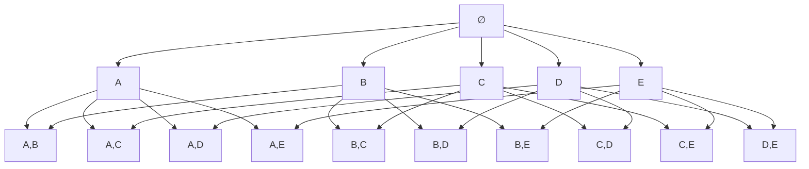

# Lecture 12: Association Rule Mining, Frequent Itemset Generation, and the Apriori Algorithm

## Counting Possible Itemsets and Rules

### Number of Possible Itemsets

Given $d$ distinct items, we can count the possible subsets of these items.

- **Total possible itemsets**: $2^d$
- **Non-empty itemsets**: $2^d - 1$ (excluding the empty set)

### Number of Possible Association Rules

The total number of possible association rules can be computed using the formula:

$$R = 3^d - 2^{d+1} + 1$$

**Worked example**: For $d = 6$, the number of possible candidate association rules is:

$$3^6 - 2^7 + 1 = 729 - 128 + 1 = 602$$

> **Key takeaway**: If you increase $d$, think about Walmart or other hypermarkets. They have more than 1,000 items, so the number of possible rules would be in the millions. This means brute-force search does not make sense, so we need another approach.

---

## Rules From the Same Itemset Share the Same Support

Based on a small transactions table (containing items such as Milk, Diaper, Beer, Bread, Eggs, Coke), we can form example rules such as:

- $\{\text{Milk}, \text{Diaper}\} \Rightarrow \{\text{Beer}\}$
- $\{\text{Milk}, \text{Beer}\} \Rightarrow \{\text{Diaper}\}$
- $\{\text{Diaper}, \text{Beer}\} \Rightarrow \{\text{Milk}\}$
- $\{\text{Beer}\} \Rightarrow \{\text{Milk}, \text{Diaper}\}$ *(additional example)*
- $\{\text{Milk}\} \Rightarrow \{\text{Diaper}, \text{Beer}\}$ *(additional example)*
- $\{\text{Diaper}\} \Rightarrow \{\text{Milk}, \text{Beer}\}$ *(additional example)*

All these rules use the same three items (Milk, Diaper, Beer) arranged in different positions on the left and right hand sides. These are called **binary partitions** of the same itemset.

### Support vs. Confidence for Partition Rules

If we compute the support and confidence for these rules:

- **Support is identical** across all rules. This is because the support formula computes the fraction of transactions containing the union of the left and right sides, and that union is the same set $\{\text{Milk}, \text{Diaper}, \text{Beer}\}$ for every rule. The order of items in the set does not matter.
- **Confidence differs** across the rules. The numerator (the support of the full itemset) is the same, but the denominators differ because the left hand side changes.

*(reconstructed example)* Assume:

- $\text{support}(\{\text{Milk}, \text{Diaper}, \text{Beer}\}) = 2/5$
- $\text{support}(\{\text{Milk}, \text{Diaper}\}) = 3/5$
- $\text{support}(\{\text{Milk}, \text{Beer}\}) = 2/5$
- $\text{support}(\{\text{Diaper}, \text{Beer}\}) = 3/5$

Then:

| Rule | Support | Confidence |
|------|---------|------------|
| $\{\text{Milk},\text{Diaper}\} \Rightarrow \{\text{Beer}\}$ | $2/5$ | $2/3$ |
| $\{\text{Milk},\text{Beer}\} \Rightarrow \{\text{Diaper}\}$ | $2/5$ | $2/2 = 1$ |
| $\{\text{Diaper},\text{Beer}\} \Rightarrow \{\text{Milk}\}$ | $2/5$ | $2/3$ |

> **Key takeaway**: Rules originating from the same itemset have identical support but can have different confidence. Because rules extracted from the same itemset share the same support, we can **decouple the confidence and support requirements** during mining.

---

## The Two-Step Approach to Association Rule Mining

To extract association rules, we define a two-step approach:

1. **Frequent itemset generation**: find all itemsets whose support is greater than or equal to the minimum support. These are the frequent itemsets.
2. **Rule generation**: from the frequent itemsets, generate rules that satisfy the minimum confidence.

| Step | Criterion Used |
|------|----------------|
| Frequent itemset generation | Support only |
| Rule generation | Confidence of candidate rules extracted from frequent itemsets |

> **Note**: Finding the frequent itemsets is still computationally expensive, which is what the rest of this lecture addresses.

---

## What Is a Frequent Itemset?

From a transactions table (with items such as Bread, Milk, Diaper, Eggs, etc.), some subsets are repeated frequently across transactions. That kind of itemset we call a **frequent itemset**.

**Definition**: **Frequent itemset**: an itemset whose support is greater than or equal to the minimum support threshold.

**Example**: If the minimum support is 3, then $\{\text{Bread}, \text{Milk}\}$ is a frequent itemset if it co-occurs in at least 3 transactions. With a small transaction set and a small number of items, we can find these by inspection. With many transactions and a huge number of items, finding frequent itemsets is not that easy.

---

## The Itemset Lattice

### Structure

Given $d$ items, the total number of possible itemsets is $2^d$.

**Example with 5 items** $\{A, B, C, D, E\}$:

- **1-itemsets**: $\{A\}, \{B\}, \{C\}, \{D\}, \{E\}$
- **2-itemsets**: $\{A,B\}, \{A,C\}, \{A,D\}, \{A,E\}, \{B,C\}, \{B,D\}, \{B,E\}, \{C,D\}, \{C,E\}, \{D,E\}$
- **3-itemsets**: all 3-element subsets
- **4-itemsets**: all 4-element subsets
- **5-itemset**: $\{A,B,C,D,E\}$

These can be arranged in a lattice where each node is an itemset, and edges connect a set to its immediate supersets.


*(reconstructed diagram, showing only the first two levels for readability)*

### Usage of the Lattice

Each node represents an itemset, and some of them are frequent itemsets. Our job is to find the frequent itemsets within the lattice.

### Naive Identification

**Basic approach**: compute the support for each node in the lattice, then compare it with the minimum support. If the support is at least the minimum, label that node as a frequent itemset.

**Problem**: Even with only 5 items, we need to compute support for many itemsets. Most candidates are not actually frequent, so this wastes computation. We need to reduce the cost.

---

## Reducing the Cost of Finding Frequent Itemsets

There are three main levers for reducing the cost:

1. **Reduce the number of candidates $M$**: use pruning to avoid evaluating itemsets that cannot be frequent.
2. **Reduce the number of transactions $N$**: at first glance this sounds strange because it means neglecting some transactions. In general that is not good, but sometimes it is acceptable. For example, if a transaction contains only one item, that item is not popular, so we can neglect that transaction.
3. **Reduce the number of comparisons $N \times M$**: computing the support of each candidate requires checking every transaction. Reducing comparisons is an advanced technique. For simplicity, you can use a **hashing method** or a **hash tree approach** to compress the number of transactions and candidates.

---

## The Apriori Principle

### Statement

> **Apriori principle**: If an itemset is frequent, then all of its subsets must also be frequent.

### The Underlying Property (Anti-Monotonicity of Support)

The principle holds due to the following property:

$$\forall X, Y: \; X \subseteq Y \;\Rightarrow\; \text{support}(X) \geq \text{support}(Y)$$

**Why this is true**: Suppose a triple $\{\alpha, \beta, \gamma\}$ has support $s$ (the three items co-occur $s$ times across transactions). Then any transaction containing all three also contains any pair among them. So the support of $\{\alpha, \beta\}$ is at least $s$. The support of an itemset never exceeds the support of any of its subsets. This is called the **anti-monotone property of support**.

### Contrapositive Form (Used for Pruning)

> If an itemset is **infrequent**, then all of its **supersets** are also infrequent.

**How we use it**: We can prune the supersets of any infrequent itemset. There is no need to consider those candidates or compute their supports.

---

## Tools for Association Rule Mining

If you want to use tools for association rule mining, you **cannot** use scikit-learn (it does not implement association rule mining). Alternatives:

- **Weka**: a GUI-based data mining tool.
- **mlxtend** (Python library): provides association rule algorithms including Apriori and FP-Growth.

You give the tool:

- The transactions
- The number of items
- The minimum support
- The minimum confidence

Then you choose the approach for reducing the number of transactions or comparisons. For example, if you want to use a hash tree, you define the hash function, and the tool takes care of the rest.

### Minimal mlxtend Example *(added)*

```python
import pandas as pd
from mlxtend.preprocessing import TransactionEncoder
from mlxtend.frequent_patterns import apriori, association_rules

transactions = [
    ['Bread', 'Milk'],
    ['Bread', 'Diaper', 'Beer', 'Eggs'],
    ['Milk', 'Diaper', 'Beer', 'Coke'],
    ['Bread', 'Milk', 'Diaper', 'Beer'],
    ['Bread', 'Milk', 'Diaper', 'Coke'],
]

te = TransactionEncoder()
te_array = te.fit(transactions).transform(transactions)
df = pd.DataFrame(te_array, columns=te.columns_)

frequent = apriori(df, min_support=0.6, use_colnames=True)
rules = association_rules(frequent, metric="confidence", min_threshold=0.7)
print(rules)
```

---

## Worked Example of Apriori Candidate Reduction

Consider a transaction database with 6 items. Assume the minimum support is 3, and we are looking for itemsets with at most 3 items.

### Without Pruning

If we considered all possible subsets of size 1, 2, or 3:

$$\binom{6}{1} + \binom{6}{2} + \binom{6}{3} = 6 + 15 + 20 = 41$$

Recall that $\binom{n}{k} = \dfrac{n!}{k!(n-k)!}$.

### Step 1: Frequent 1-Itemsets

Each individual item is a candidate frequent 1-itemset: Bread, Coke, Milk, Beer, Diaper, Eggs.

| Item | Support Count |
|------|---------------|
| Bread | 4 |
| Coke | 2 |
| Milk | 4 |
| Beer | 3 |
| Diaper | 4 |
| Eggs | 1 |

Minimum support is 3, so **Coke** and **Eggs** are eliminated. The frequent 1-itemsets are:

$$F_1 = \{\text{Bread}, \text{Milk}, \text{Beer}, \text{Diaper}\}$$

### Step 2: Frequent 2-Itemsets

There is no need to generate candidates involving Coke or Eggs. Candidate 2-itemsets:

| Candidate | Support |
|-----------|---------|
| $\{\text{Bread}, \text{Milk}\}$ | 3 |
| $\{\text{Bread}, \text{Beer}\}$ | 2 |
| $\{\text{Bread}, \text{Diaper}\}$ | 3 |
| $\{\text{Beer}, \text{Milk}\}$ | 2 |
| $\{\text{Diaper}, \text{Milk}\}$ | 3 |
| $\{\text{Beer}, \text{Diaper}\}$ | 3 |

Looking at the counts, $\{\text{Bread}, \text{Beer}\}$ and $\{\text{Beer}, \text{Milk}\}$ have support 2, below the minimum support, so we eliminate those two. The frequent 2-itemsets are:

$$F_2 = \{\{\text{Bread},\text{Milk}\}, \{\text{Bread},\text{Diaper}\}, \{\text{Diaper},\text{Milk}\}, \{\text{Beer},\text{Diaper}\}\}$$

### Step 3: Frequent 3-Itemsets

Candidate 3-itemsets generated from $F_2$:

- $\{\text{Bread}, \text{Diaper}, \text{Milk}\}$
- $\{\text{Beer}, \text{Diaper}, \text{Milk}\}$
- $\{\text{Beer}, \text{Bread}, \text{Diaper}\}$
- $\{\text{Beer}, \text{Bread}, \text{Milk}\}$

When we compute the support counts for all of these candidates, every count is below the minimum support, so there are **no frequent 3-itemsets** in this example.

---

## The Apriori Algorithm

### Notation

- $F_k$: frequent $k$-itemsets
- $L_k$: candidate $k$-itemsets (sometimes called $C_k$ in other textbooks, but we use $L_k$ here)

Not every candidate $k$-itemset is frequent, so $F_k \subseteq L_k$.

### Algorithm Outline

1. Start with $k = 1$. Generate $F_1$, the frequent 1-itemsets, by counting singleton supports.
2. For each $k \geq 1$:
   1. **Candidate generation**: generate candidate $(k+1)$-itemsets $L_{k+1}$ from $F_k$.
   2. **Candidate pruning**: prune any candidate in $L_{k+1}$ that contains a subset of length $k$ that is infrequent. If any $k$-subset of a candidate is not in $F_k$, remove the candidate.
   3. **Support counting**: count the support of each surviving candidate in $L_{k+1}$ by scanning the database.
   4. **Candidate elimination**: remove candidates in $L_{k+1}$ whose support is below the minimum support, leaving $F_{k+1}$.
3. Repeat until $F_{k+1}$ is empty.

### Pseudocode *(reconstructed)*

```text
F_1 = {frequent 1-itemsets}
k = 1
while F_k is not empty:
    L_{k+1} = generate_candidates(F_k)       # candidate generation
    L_{k+1} = prune(L_{k+1}, F_k)            # Apriori pruning
    for each transaction t in database:
        for each candidate c in L_{k+1}:
            if c is a subset of t:
                c.count += 1                 # support counting
    F_{k+1} = { c in L_{k+1} : c.count >= min_support }   # elimination
    k = k + 1
return union of all F_k
```

### Inputs and Outputs

- **Input**: the transaction table.
- **Output**: a set of subsets of the items, namely the frequent itemsets.

---

## Pruning Step in Detail

Assume we have generated candidate 3-itemsets:

$$L_3 = \{\{\text{Beer},\text{Bread},\text{Diaper}\}, \{\text{Beer},\text{Diaper},\text{Milk}\}, \{\text{Bread},\text{Diaper},\text{Milk}\}, \{\text{Beer},\text{Bread},\text{Milk}\}\}$$

Not all of these are necessarily frequent, so we prune.

**Rule**: If a candidate contains a $k$-subset that is not in the frequent $k$-itemsets, we remove it.

**Example of pruning logic**: Consider a candidate 3-itemset containing the pair $\{\text{Diaper}, \text{Eggs}\}$. By the Apriori property, if the candidate is frequent then $\{\text{Diaper}, \text{Eggs}\}$ must also be frequent. But $\{\text{Diaper}, \text{Eggs}\}$ is not in our frequent 2-itemsets, so the candidate must be pruned.

> **Student question**: Can you use parameters other than minimum support to generate the frequent itemsets?
>
> **Answer**: For now, we are using only minimum support to generate the frequent itemsets. Once we have the frequent itemsets, we can generate the candidate rules from them. At this step, we find the frequent itemsets based on minimum support alone.

> **Student question**: Is the result of pruning the final result? It seems the pruned set should still contain more items than what is shown.
>
> **Answer**: Yes, it is possible to have more. What is shown is what remains after pruning in this particular example.

### Why Do Pruning?

> **Key takeaway**: Pruning reduces the workload. After generating the candidate 3-itemsets, to prune them we only look at the frequent 2-itemsets and frequent 1-itemsets, not the full lattice. Without calculating support, we remove infeasible candidates. That is why we use the Apriori algorithm to find frequent itemsets.

Also note: frequent 2-itemsets are different from frequent 3-itemsets. We generate candidate 3-itemsets based on frequent 2-itemsets. If you find any 2-subset of a candidate 3-itemset that is not in the frequent 2-itemsets, you throw the candidate out.

---

## Candidate Generation: The $F_{k-1} \times F_{k-1}$ Method

For candidate generation, we can use the $F_{k-1} \times F_{k-1}$ method. There are two common variants.

### Variant 1: Shared Prefix Merge

**Rule**: Merge two frequent $(k-1)$-itemsets if their first $(k-2)$ items are identical.

**Example**: Assume the frequent 3-itemsets are:

$$F_3 = \{ABC, ABD, ABE, ACD, BCD, BDE, CDE\}$$

(Here items are sorted alphabetically inside each itemset.)

To create candidate 4-itemsets:

- Merge $ABC$ and $ABD$ (shared prefix $AB$) to get $ABCD$.
- Merge $ABC$ and $ABE$ (shared prefix $AB$) to get $ABCE$.
- Merge $ABD$ and $ABE$ (shared prefix $AB$) to get $ABDE$.

You **cannot** merge $ABD$ and $ACD$ because they share only a prefix of length 1 ($A$), not length 2.

So the candidate 4-itemsets are:

$$L_4 = \{ABCD, ABCE, ABDE\}$$

**Pruning**:

- Prune $ABCE$: its 3-subsets include $ACE$ and $BCE$, which are **not** in $F_3$.
- Prune $ABDE$: its 3-subset $ADE$ is **not** in $F_3$.

After pruning: $L_4 = \{ABCD\}$.

### Variant 2: Prefix-Suffix Merge

**Rule**: Merge two frequent $(k-1)$-itemsets if the **last $(k-2)$ items** of the first are identical to the **first $(k-2)$ items** of the second.

**Example** with the same $F_3 = \{ABC, ABD, ABE, ACD, BCD, BDE, CDE\}$:

- Merge $ABC$ and $BCD$: last two of first ($BC$) match first two of second ($BC$), giving $ABCD$.
- Merge $ABD$ and $BDE$: last two ($BD$) match first two ($BD$), giving $ABDE$.
- Merge $ACD$ and $CDE$: last two ($CD$) match first two ($CD$), giving $ACDE$.
- Merge $BCD$ and $CDE$: last two ($CD$) match first two ($CD$), giving $BCDE$.

So the candidates are:

$$L_4 = \{ABCD, ABDE, ACDE, BCDE\}$$

**Pruning**:

- Prune $ABDE$ because $ADE$ is not in $F_3$.
- Prune $ACDE$ because $ACE$ and $ADE$ are not in $F_3$.
- Prune $BCDE$ because $BCE$ is not in $F_3$.

After pruning: $L_4 = \{ABCD\}$.

### Comparison of the Two Variants

| Aspect | Variant 1 (shared prefix) | Variant 2 (prefix-suffix) |
|--------|---------------------------|----------------------------|
| Merge condition | First $k-2$ items equal | Last $k-2$ of first equal first $k-2$ of second |
| Candidates generated in example | 3 | 4 |
| After pruning | $\{ABCD\}$ | $\{ABCD\}$ |

Both variants produce the same final set after pruning, but the intermediate candidate set sizes can differ.

---

## End of Step 1: We Have the Frequent Itemsets

Now we have generated all the frequent itemsets. This is the **first step** of the association rule mining algorithm. Recall that association rule mining has a two-step approach: first generate the frequent itemsets, then extract the rules. We are done with the first step.

---

## Step 2: Rule Generation From Frequent Itemsets

After finding the frequent itemsets and their supports, we find the non-empty subsets of each frequent itemset and form candidate rules.

**Procedure**: Given a frequent itemset $L$, we find all non-empty subsets $f$ of $L$ such that the rule

$$f \rightarrow L - f$$

satisfies the minimum confidence.

### Counting the Candidate Rules

If $|L| = k$, there are

$$2^k - 2$$

candidate association rules, ignoring the degenerate rules $L \rightarrow \emptyset$ and $\emptyset \rightarrow L$.

*(reconstructed example)* If $L = \{A, B, C\}$ so $k = 3$, the $2^3 - 2 = 6$ candidate rules are:

1. $\{A\} \rightarrow \{B, C\}$
2. $\{B\} \rightarrow \{A, C\}$
3. $\{C\} \rightarrow \{A, B\}$
4. $\{A, B\} \rightarrow \{C\}$
5. $\{A, C\} \rightarrow \{B\}$
6. $\{B, C\} \rightarrow \{A\}$

### Applying the Confidence Threshold

After generating these rules, we look at the confidence scores. The rules whose confidence score is above the minimum confidence threshold become our **final association rules**.

### Can We Prune Rules Too?

> **Student question**: Is there a way to prune these rules?
>
> **Answer**: There are techniques to find more promising subsets. Strictly pruning the rules would require computing the confidence score, which means we would have to compute everything anyway. However, there are techniques to limit which subsets $f$ we consider, so we do not have to enumerate all $2^k - 2$ subsets.

*(added for context)* A standard observation used for rule pruning: if a rule $X \rightarrow Y$ has confidence below the threshold, then any rule $X' \rightarrow Y'$ where $X' \subset X$ (and correspondingly $Y' \supset Y$) also has confidence below the threshold. This lets you prune rules without recomputing confidence from scratch for every subset.

---

## Summary Pipeline of Association Rule Mining

```mermaid
flowchart TD
  A[Transaction Database] --> B[Generate Frequent 1-itemsets F_1]
  B --> C{F_k empty?}
  C -- No --> D[Generate candidates L_{k+1} from F_k]
  D --> E[Prune candidates using Apriori property]
  E --> F[Scan database to count supports]
  F --> G[Keep only candidates with support ≥ min_sup → F_{k+1}]
  G --> C
  C -- Yes --> H[Union of all F_k = All Frequent Itemsets]
  H --> I[For each frequent itemset L, enumerate non-empty subsets f]
  I --> J[Compute confidence of f → L − f]
  J --> K[Keep rules with confidence ≥ min_conf → Final Association Rules]
```

> **Overall takeaway**: The Apriori algorithm exploits the anti-monotone property of support to prune huge portions of the itemset lattice, turning an otherwise intractable search (millions of candidate rules for realistic product catalogs) into something we can actually run. The two-step decomposition, first find frequent itemsets using support, then extract rules using confidence, is what makes this decoupling possible.
