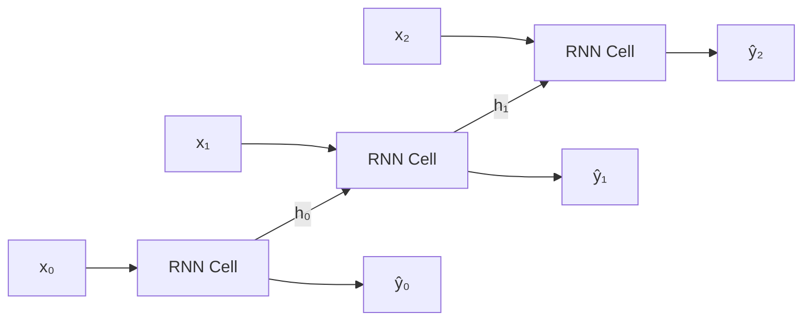
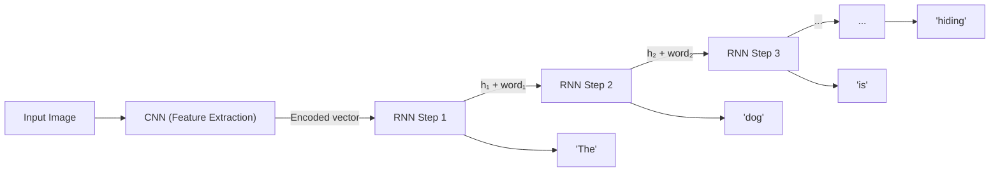
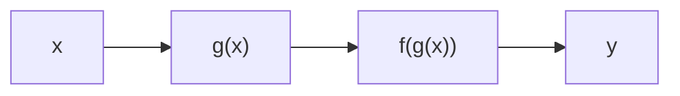
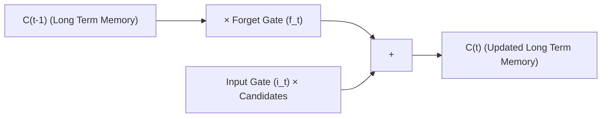

# Lecture 4: Recurrent Neural Networks, Time Series, and Loss Functions

## Why We Need Sequential Models

Many real world tasks involve **sequential data**, data where the order matters and past information is critical for understanding the present:

- **Machine translation**: Translating text from one language to another (e.g., English to French) is not a word by word translation. The model must understand context and word order.
- **Speech assistants**: Siri, Google Assistant convert spoken words into text (speech to text), or understand text and produce speech (text to speech).
- **AI music composition**: AI generating or composing background music.
- **Stock price prediction**: Predicting future prices based on historical trends (time series).

The problem with **MLPs (feed forward neural networks)** is that they are **not able to handle sequential data**. They process each input independently, with no notion of order or memory. To handle sequences, a model must:

1. Consider the **current input** and also the **previously received inputs**.
2. Be able to **memorize history** in its internal memory.

> To predict the next word when speaking, you need to know what you just said and what you said before that. A feed forward network has no mechanism for this.

### When to Use Feed Forward Networks vs. RNNs

| Scenario | Model | Why |
|---|---|---|
| Predicting house prices | MLP / Feed Forward | Features are static, no temporal relationship between them |
| Predicting gender from features | MLP / Feed Forward | Static classification, no sequential dependency |
| Translating English to French | RNN | Input and output are sequences with ordering |
| Predicting the next word | RNN | Requires context from all previous words |

---

## Applications of Sequential Data

- **Speech recognition**: Audio to text, or text to speech
- **Sentiment analysis**: A sequence of text mapped to a rating (number of stars) or classification (positive, negative, neutral)
- **DNA sequence analysis**: Finding patterns in genetic sequences
- **Machine translation**: Converting text from one language to another
- **Video analysis**: Processing sequences of frames
- **Time series forecasting**: Predicting the next value based on previous values

> **Example**: During the past week, Monday we had snow, Tuesday we had snow, Wednesday we didn't have snow. What would be the prediction for Thursday?

---

## Time Series

> **Course note**: The time series content was included because it is part of the course session information (CSI).

### Definition

**Time series**: A sequence of data points collected or recorded at specific time intervals (e.g., every week, every day, every hour, every minute, every year).

Unlike static data, time series focuses on **one or more variables over a duration**:
- Univariate example: Whether it snowed each day over the past week (one variable).
- Multivariate example: Snow, temperature, and wind speed each day (multiple variables).

### Plotting Time Series

- **X axis**: Almost always represents **time** (days, weeks, years, etc.)
- **Y axis**: The variable being measured (price, temperature, population, etc.)

### Goal of Time Series Analysis

Understand the **past** (what happened before) and **predict the future** (forecast values at the next step or interval).

**Example**: Airline passenger data collected every two years from 1949 to 1996, showing the number of passengers over time.

### Four Components of Time Series

Every time series can be decomposed into four components:

| Component | Definition | Interval | Predictive Value |
|---|---|---|---|
| **Trend** | Long term direction (going up, down, or staying flat) | Entire series | Yes, very important |
| **Seasonality** | Pattern that repeats over fixed, short periods | Short (e.g., every 2 years) | Yes, very important |
| **Cycle** | Similar to seasonality but over longer intervals | Long (e.g., every 10 years) | Sometimes useful |
| **Noise** (Residuals) | Random fluctuations that can't be explained by the other three | N/A | Not useful to predict |

#### Trend
The **general direction** of the time series over the long term. For example, an overall upward movement in airline passengers over decades.

#### Seasonality
A **repeating pattern** at fixed intervals. For example, airline passengers peaking every summer and dipping every winter, with this cycle repeating every year.

#### Cycle
Similar to seasonality, but the interval is **much longer**. For example, economic boom and bust cycles that repeat every 10 years.

#### Noise (Variation / Residuals)
**Random fluctuations** in the data that are not under control and cannot be explained by trend, seasonality, or cycles.

### What Matters for Forecasting

For prediction, we primarily care about:
1. **Seasonality**: Find the repeating patterns.
2. **Trend**: Find the long term direction.

We do **not** try to predict noise, because there is no meaningful pattern in it. Cycles can sometimes be useful, but they are not always the primary focus.

> In a decomposition plot, the original time series is broken into: trend (e.g., the green line), seasonal component, and noise/residual variations.

---

## Recurrent Neural Networks (RNNs)

### Definition

**Recurrent Neural Network (RNN)**: A type of neural network that takes the **previous output or hidden states as input**, allowing it to carry historical information forward through the sequence. The input at time $t$ contains some historical information about the happenings at all times before time $t$.

RNNs are useful because their **hidden states** can store information about the past for a variable period of time (the duration is not fixed).

### Folded vs. Unfolded View

In the **folded (compact) view**, an RNN looks like a simple feed forward network but with a **loop** (cycle) that feeds the output back into itself. If you neglect this loop, you see just a simple feed forward network. The loop means it can keep previous information.

When you **unfold** this architecture across time steps, you see a separate copy of the network for each time step, connected by the hidden states.

### RNN vs. Feed Forward: Visual Comparison

A simple **feed forward neural network** has an input layer, hidden layer(s), and output layer. Data flows in one direction. We learn weight matrices for each layer.

An **RNN** repeats the same feed forward architecture for each part of the input (each token or word vector). Each copy gets an **extra input**: the output (hidden state) from the previous time step.

### Word Vectors

**Word vector**: The numerical representation of a word. Because computers only understand numbers, you cannot feed text directly into a neural network. Words must be converted into vectors (numerical representations). Word vectors are fed into the network **one at a time**, not all at once.

### Weight Sharing in RNNs

In an RNN, the same weight matrices are used at every time step:
- $W_x$: Weights for the input
- $W_h$: Weights for the hidden state from the previous step
- $W_y$: Weights for the output

> All $W_x$ matrices across all time steps are **identical** (shared). The same applies to $W_y$ and $W_h$. This is a fundamental property of RNNs.

### RNN Architecture Details

Each **RNN cell** (or block) can have any internal architecture (simple MLP, deep network, etc.), but the final hidden state is what gets passed to the next step.

When the RNN is **unfolded**, you see separate copies of the cell for each time step, each receiving:
1. The input $x_t$ (with weights $W_x$)
2. The hidden state from the previous step $h_{t-1}$ (with weights $W_h$)
3. Producing an output $\hat{y}_t$ (with weights $W_y$)

### Hidden State Formula

$$h_t = f(W_x \cdot x_t + W_h \cdot h_{t-1} + \theta)$$

Where:
- $f$ is the **activation function**
- $W_x$ is the weight matrix for the current input $x_t$
- $W_h$ is the weight matrix for the previous hidden state $h_{t-1}$
- $\theta$ is the **bias** term
- The weight matrices control how past and present inputs contribute to the current hidden state

### First Time Step

At the first time step, there is no previous hidden state. We assume the initial hidden state $h_0 = 0$ (a zero vector). The first cell only receives the input $x_0$.

### Information Accumulation in Hidden States

Each hidden state $h_t$ carries information from **all** previous time steps, not just the immediately preceding one. For example, $h_9$ carries information accumulated from steps 0 through 8, because:
- $h_1$ carries info from step 0
- $h_2$ carries info from steps 0 and 1
- $h_9$ carries info from steps 0 through 8

---

## Image Captioning: A Practical RNN Example

**Image captioning**: Given an image as input, the model generates a text description (caption). The input is a single image, the output is a sequence of words (sentence, paragraph, or description).

> Image captioning is **not** data annotation. Data annotation is done by humans. In image captioning, the **model** generates the description automatically.

### The Problem: Images Are Not Numbers

Neural networks only accept float numbers as input. Raw pixel RGB intensities could be used, but the input size would be enormous.

### The Solution: CNN + RNN Pipeline

1. Feed the image into a **CNN** (used for image classification).
2. At the CNN's last dense layer, the output is a vector of any size, any dimension. This is the **encoded representation** of the image.
3. Pass this encoded vector to the **first RNN cell** as input.
4. The first RNN generates the first word.
5. For subsequent steps, the input is the **word vector of the previously generated word** plus the **hidden state from the previous step**.
6. Repeat until the stopping condition is met.

### Training Image Captioning

Training requires **pairs of images with corresponding captions**. Both images and captions must be converted to numerical representations.

---

## Input/Output Scenarios for Deep Learning Models

| Scenario | Input | Output | Example | Network Type |
|---|---|---|---|---|
| Single to Single | One input (set of features) | One output | House price prediction | Feed Forward |
| Single to Multiple | One input (image) | Sequence of outputs | Image captioning | RNN |
| Multiple to Single | Sequence of inputs | One output | Text classification, Sentiment analysis | RNN |
| Multiple to Multiple | Sequence of inputs | Sequence of outputs | Machine translation | RNN |
| Synced Multiple to Multiple | Synchronized input-output at each step | Synchronized output at each step | Video captioning | RNN |

> **Video captioning** is multiple to multiple because a video is a sequence of images (multiple input) and the caption is a sequence of words (multiple output).

---

## Loss Functions

### What Is a Loss Function?

**Loss function**: A metric used to evaluate how well an algorithm models the given data. It measures the **gap** (or distance) between the **expected output** (ground truth label) and the **predicted output** (what the model produces).

- The **expected output** is what you labeled. The **real (predicted) output** is what you get from your model.
- Also known as: **cost function** or **error function**
- The gap between expected and predicted output is called the **error**: always the gap between what you wanted it to be and what it is right now.

> The most important thing in training ANY model is the loss function. It is the metric that tells us how well or poorly the model is performing.

### Why Loss Functions Are for Training, Not Testing

The loss function is used **during training only**, not during testing. The reasoning:
1. As developers/ML engineers, we train a model using a loss function to guide learning.
2. Once training is complete, we give the model to the end user.
3. The customer/user should not need to worry about loss functions, hidden states, batch iterations, learning rates, or training details.
4. That is why we separate training concerns from testing/inference.

### Categories of Loss Functions

There are three main categories of loss functions:

#### 1. Regression Losses

Used when predicting **continuous real values**.

| Loss Function | Also Known As | Formula | Description |
|---|---|---|---|
| **Mean Squared Error (MSE)** | L2 Loss | $\text{MSE} = \frac{1}{n}\sum_{i=1}^{n}(y_i - \hat{y}_i)^2$ | Average of the sum of **squared** differences between actual and predicted values |
| **Mean Absolute Error (MAE)** | L1 Loss, Lasso | $\text{MAE} = \frac{1}{n}\sum_{i=1}^{n}|y_i - \hat{y}_i|$ | Average of the sum of **absolute** differences between actual and predicted values |
| **Mean Bias Error** | | $\text{MBE} = \frac{1}{n}\sum_{i=1}^{n}(y_i - \hat{y}_i)$ | Average of the sum of the differences (not absolute, not squared) between actual and predicted values. Positive and negative values may cancel out, making it less accurate in practice. Useful for detecting whether a model has positive or negative bias |

#### 2. Probabilistic Losses

Used when the model's output is a **probability distribution**.

**Cross Entropy** (also known as log loss): A measure of the difference between two probability distributions (predicted vs actual).

| Loss Function | Use Case | Label Format |
|---|---|---|
| **Binary Cross Entropy** | Binary classification (2 classes) | 0 or 1 |
| **Categorical Cross Entropy** | Multi class classification | One hot encoded |
| **Sparse Categorical Cross Entropy** | Multi class classification | Integer labels (not one hot) |

> Most of the time, for training neural networks, we use **cross entropy loss functions**.

#### 3. Hinge Losses

Primarily used for **traditional machine learning models** like SVMs.

| Loss Function | Use Case | Label Format |
|---|---|---|
| **Hinge Loss** | Binary classification (SVM) | $-1$ and $+1$ |
| **Categorical Hinge** | Multi class classification | Categorical |

Hinge loss helps maximize the **margin** between different classes. Loss is 0 when the correct class is confidently predicted, but penalizes predictions that are too close to the decision boundary. Hinge loss can also be used with neural networks, but cross entropy is more common in practice.

---

## Gradient Descent and Weight Updates

### The Gradient Descent Formula

To update the weights during training, we use **gradient descent**:

$$W_{\text{new}} = W_{\text{current}} - \alpha \cdot \frac{\partial L}{\partial W}$$

Where:
- $W_{\text{new}}$: Updated weight
- $W_{\text{current}}$: Current weight
- $\alpha$: **Learning rate** (a hyperparameter)
- $\frac{\partial L}{\partial W}$: Derivative of the loss function with respect to $W$

### The Chain Rule

To compute $\frac{\partial L}{\partial W}$, we use the **chain rule** from calculus:

$$\frac{\partial L}{\partial W} = \frac{\partial L}{\partial \hat{y}} \cdot \frac{\partial \hat{y}}{\partial W}$$

**General chain rule**: If $y = f(g(x))$, then:

$$\frac{dy}{dx} = \frac{dy}{df} \cdot \frac{df}{dg} \cdot \frac{dg}{dx}$$

### Multi Layer Example

For a two layer network:
- Layer 1: $\hat{y}_1 = f_1(x, W_1)$
- Layer 2: $\hat{y}_2 = f_2(\hat{y}_1, W_2)$

Where $f_1$ and $f_2$ can be the same or different activation functions.

To update both weights:

$$W_{1,\text{new}} = W_{1,\text{current}} - \alpha \cdot \frac{\partial L}{\partial W_1}$$

$$W_{2,\text{new}} = W_{2,\text{current}} - \alpha \cdot \frac{\partial L}{\partial W_2}$$

The chain rule is applied to compute each derivative.

---

## Backpropagation Through Time (BPTT)

### Why RNNs Need BPTT

In a regular neural network, backpropagation updates weights layer by layer. In an RNN, the network is **unrolled across time**, so backpropagation must travel through all time steps. This is called **Backpropagation Through Time (BPTT)**.

Because weights ($W_x$, $W_h$, $W_y$) are **shared** across all time steps, we must compute gradients across all steps and then combine them.

### BPTT Depends on the Task

#### Text Classification (Single Output)

If the task produces a **single output** at the end (e.g., a class label for the whole sequence), you only need **one backpropagation** from the final output all the way back to the first step.

#### Part of Speech Tagging / Named Entity Recognition (Output at Every Step)

If the task produces an **output at every time step** (e.g., a POS tag for each word), then:
1. Compute the loss at each individual step.
2. Backpropagate from each step back to the beginning.
3. **Average or sum** all the weight updates from each backpropagation.
4. Apply the combined update to the shared weights.

### BPTT Gradient Computation

The derivative of the loss at time $T$ with respect to the first hidden state $h_1$:

$$\frac{\partial L_T}{\partial h_1} = \frac{\partial L_T}{\partial \hat{y}_T} \cdot \frac{\partial \hat{y}_T}{\partial h_T} \cdot \frac{\partial h_T}{\partial h_{T-1}} \cdot \ldots \cdot \frac{\partial h_2}{\partial h_1}$$

This is a **product of many terms**, one for each time step. The length of this chain equals the number of time steps in the sequence.

---

## Problems with Vanilla RNNs

### The Vanishing Gradient Problem

When we use the chain rule to compute gradients through many time steps, we end up multiplying many values together. The key problem:

- The derivatives of the **sigmoid** activation function have a **maximum value of 0.25**.
- Multiplying many small values ($< 1$) together causes the product to **approach zero**.
- When the gradient becomes zero, the weight update formula gives: $W_{\text{new}} = W_{\text{current}} - \alpha \cdot 0 = W_{\text{current}}$
- **No learning occurs**. The early layers receive no meaningful updates.

> If we have 100 time steps, we multiply at least 100 small values together. The result approaches zero, and the gradient vanishes.

**Practical example**:
- **Short sentence**: "I live in France, and I speak ___." The model can easily predict "French" because the relevant information ("France") is close.
- **Long sentence**: "I live in France. [many paragraphs of story] Now, I speak ___." The model becomes **confused** because the gradient from "France" has vanished by the time it reaches the prediction point.

### The Exploding Gradient Problem

The **reverse** of vanishing gradients. If the values in the gradient chain are **large** (greater than 1), multiplying many large values together produces an extremely large number. Again, the model cannot learn effectively.

> In summary, the product of several numbers in the gradient chain can either **shrink to zero** (vanishing) or **explode to infinity** (exploding), causing the backpropagation to break down.

### Vanishing vs. Exploding Gradients Summary

| Problem | Cause | Effect |
|---|---|---|
| **Vanishing Gradient** | Product of small values ($< 1$) approaches 0 | Early layers receive almost no updates, network fails to learn long term dependencies |
| **Exploding Gradient** | Product of large values ($> 1$) approaches infinity | Gradient becomes unstable, weights diverge |

### Solutions to Gradient Problems

| Solution | Description |
|---|---|
| **Gated RNNs (LSTM, GRU)** | Use gating mechanisms to control information flow, avoiding the vanishing gradient problem |
| **Gradient Clipping** | When the gradient exceeds a threshold, clip it to stay within a certain range |
| **ReLU Activation** | Replace sigmoid with ReLU, which has a derivative of 1 for positive values, preventing the gradient from shrinking |
| **Layer / Batch Normalization** | Normalize the output of each layer for each batch before passing it to the next layer |
| **Shorter Sequences** | Use shorter input sequences (not a general solution, because sometimes long sequences are required) |
| **Transformers** | The most popular solution. Transformers handle very long sequences without vanishing gradients |

> **Course note**: You will see transformers in your NLP course. As evidence of their effectiveness, GPT models and LLMs can process very long documents without forgetting information at the beginning of the text. That is because of their ability to handle very long sentences without suffering from vanishing gradients.

**Batch normalization explained**: When training batch by batch over the training set, in each batch, we normalize the output of each layer for that batch and then pass it to the next layer. This stabilizes training and helps prevent gradient issues.

---

## Long Short Term Memory (LSTM)

### Overview

**LSTM (Long Short Term Memory)**: A variation of the RNN that addresses the vanishing gradient problem by using **two types of memory**:

1. **Long term memory** ($C_t$, the cell state): Stores information from far back in the sequence.
2. **Short term memory** ($h_t$, the hidden state): Stores information from recent steps.

### LSTM Architecture Symbols

| Symbol | Meaning |
|---|---|
| $\sigma$ (yellow box) | Sigmoid activation function (any neural network layer can be here) |
| $\tanh$ | Hyperbolic tangent activation function |
| $\otimes$ (circle with X) | Element wise multiplication |
| $\oplus$ (plus sign) | Element wise addition |
| Horizontal line | Concatenation |
| Arrow split | Copying |

### Inputs to an LSTM Cell

Each LSTM cell receives three inputs:
1. $C_{t-1}$: Long term memory (cell state from the previous step)
2. $h_{t-1}$: Short term memory (hidden state from the previous time step, the recent past)
3. $x_t$: The current input

### How Gates Work: Controlling Information Flow

The LSTM has the ability to **remove or add** information to the cell state using **gates**. Gates are composed of a **sigmoid neural layer** and **element wise multiplication**.

The sigmoid layer outputs values between 0 and 1 for each element:
- **0** means "completely forget this information"
- **1** means "completely keep this information"
- Values in between mean "partially keep"

**Example of gate operation** *(illustrating element wise multiplication)*:

| Input Vector | Gate Vector | Result | Interpretation |
|---|---|---|---|
| 1 | 0 | 0 | Remove completely |
| 2 | 0.1 | 0.2 | Mostly remove, keep a little |
| 3 | 0.8 | 2.4 | Keep most of it (emphasize) |
| 4 | 0 | 0 | Remove completely |
| 5 | 0.8 | 4.0 | Keep most of it (emphasize) |

> The gate learns **which parts of information to forget and which to emphasize**. The weights for the gates must also be learned during training.

### Step 1: The Forget Gate

The **forget gate** decides what information to **throw away** from the cell state.

$$f_t = \sigma(W_f \cdot [h_{t-1}, x_t] + b_f)$$

Where:
- $[h_{t-1}, x_t]$ is the concatenation of the previous hidden state and the current input
- $W_f$ is the weight matrix for the forget gate
- $b_f$ is the bias
- $\sigma$ is the sigmoid function

Output interpretation:
- Gate value = **1**: Keep that part of the cell state completely
- Gate value = **0**: Forget that part of the cell state entirely

### Step 2: The Input Gate (Update Gate)

The **input gate** decides what **new information** to add to the long term memory (cell state).

Given $h_{t-1}$ (recent history) and $C_t$ (long term memory), we must decide what new information should be added to the long term history.

The input gate has two parts:
1. **Which values to update** (sigmoid layer decides how much to update each element)
2. **New candidate values** (a vector of new candidate values created by a tanh layer)

**Example**: If the text says "I grew up in France" followed by a long passage, the LSTM keeps the information about France in its long term memory ($C_t$) and later uses it to predict relevant outputs (like the language spoken).

### Step 3: Updating the Cell State

$$C_t = f_t \odot C_{t-1} + i_t \odot \tilde{C}_t$$

Where:
- $f_t \odot C_{t-1}$: Determines which information from the **previous cell state** must be **removed** (forget gate applied to old cell state)
- $i_t \odot \tilde{C}_t$: Determines which **new information** must be **added** (input gate output times new candidate values)

> The cell state update formula is the core of the LSTM. It selectively forgets old information and adds new information, solving the vanishing gradient problem by maintaining a direct path for gradients to flow through the cell state.

### Step 4: The Output Gate

The **output gate** decides what to output based on the cell state.

$$o_t = \sigma(W_o \cdot [h_{t-1}, x_t] + b_o)$$

$$h_t = o_t \odot \tanh(C_t)$$

Where:
- $[h_{t-1}, x_t]$ is the concatenation of the previous hidden state and the current input
- $W_o$ is the weight matrix for the output gate
- $b_o$ is the bias
- $\sigma$ is the sigmoid function, deciding which parts of the cell state to output
- $\tanh(C_t)$ squashes the cell state values to be between $-1$ and $1$
- The element wise multiplication filters the cell state to produce the final hidden state $h_t$

**Example**: If the text says "I grew up in France... I speak fluent ___", the output gate would focus on the information relevant to predicting a language. Since "France" was stored in the cell state, the output would be filtered to produce "French".
