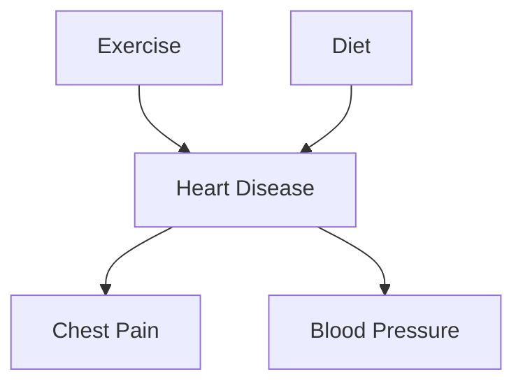

# Lecture 5: Naive Bayes Classification and Bayesian Belief Networks

## Overview

Among the many algorithms available for classification and regression, this lecture focuses on one of the basic traditional classification algorithms: the **Naive Bayes classifier**. The lecture also introduces the **Bayesian Belief Network (BBN)** for cases where the independence assumption of Naive Bayes does not hold.

---

## Conditional Probability

**Conditional Probability**: the probability of something occurring given that you already know some other event happened before. It is "conditioned" on prior knowledge.

### Key Formulas

$$P(X \mid Y) = \frac{P(X \cap Y)}{P(Y)}$$

The joint probability can also be expressed as:

$$P(X \cap Y) = P(X, Y) = P(X \mid Y) \cdot P(Y)$$

From these, we derive **Bayes' Theorem**:

$$P(Y \mid X) = \frac{P(X \mid Y) \cdot P(Y)}{P(X)}$$

> **Key insight**: You can rewrite $P(X, Y)$ as $P(Y) \cdot P(X \mid Y)$ and substitute into the conditional probability formula to arrive at Bayes' theorem.

### Example: Conditional Probability with Dice

When rolling 2 dice, find $P(A \mid B)$ for the following events:

- **A**: the sum of the two dice is 8
- **B**: first die shows a 5
- $n(S) = 36$ (total outcomes)

**Possible outcomes for A**: $\{(2,6), (3,5), (4,4), (5,3), (6,2)\}$

**Possible outcomes for B**: $\{(5,1), (5,2), (5,3), (5,4), (5,5), (5,6)\}$

- $P(A) = \frac{5}{36}$, $P(B) = \frac{6}{36}$, $P(A \cap B) = \frac{1}{36}$

Given that the first die shows 5, out of 6 possible cases only one gives a sum of 8: $(5,3)$.

$$P(A \mid B) = \frac{P(A \cap B)}{P(B)} = \frac{1/36}{6/36} = \frac{1}{6}$$

---

## Naive Bayes Classifier

**Naive Bayes Classifier**: a probabilistic framework for solving classification problems, based on conditional probabilities.

### Problem Setup

- Each **attribute** (feature) in the data set is treated as a **random variable** that can take any value (discrete or continuous).
- Given a record with features $X_1, X_2, \dots, X_D$ (where $D$ is the feature dimension), the goal is to predict the class label $Y$.
- We want to find the value of $Y$ that **maximizes** $P(Y \mid X_1, X_2, \dots, X_D)$.

### Why We Cannot Compute $P(Y \mid X)$ Directly

- Computing $P(Y \mid X_1, X_2, \dots, X_D)$ directly from data is infeasible.
- While $P(X_1)$ alone is easy to find, and $P(Y \mid X_1)$ is also manageable, computing the **joint probability** of all features simultaneously is very hard.
- We need a different approach.

### Applying Bayes' Theorem

We rewrite the posterior probability using Bayes' theorem:

$$P(Y \mid X_1, X_2, \dots, X_D) = \frac{P(X_1, X_2, \dots, X_D \mid Y) \cdot P(Y)}{P(X_1, X_2, \dots, X_D)}$$

### Maximum A Posteriori (MAP) Classification

- We want to choose the class $Y$ that **maximizes** the posterior probability.
- Since $P(X_1, X_2, \dots, X_D)$ is the same for all classes, we only need to maximize the **numerator**:

$$\hat{Y} = \arg\max_{Y} \; P(X_1, X_2, \dots, X_D \mid Y) \cdot P(Y)$$

- If there are $K$ classes ($C_1, C_2, \dots, C_K$), compute the posterior for each class and pick the one with the highest value.

### Why $P(X)$ Can Be Ignored

When comparing $P(\text{yes} \mid X)$ vs. $P(\text{no} \mid X)$, both share the same denominator $P(X)$, so it cancels out. We only need to compare:

$$P(X \mid \text{yes}) \cdot P(\text{yes}) \quad \text{vs.} \quad P(X \mid \text{no}) \cdot P(\text{no})$$

---

## Conditional Independence

**Conditional Independence**: Two random variables $X$ and $Y$ are conditionally independent given $Z$ if:

$$P(X \mid Y, Z) = P(X \mid Z)$$

### Example: Arm Length and Reading Skill

- A young child has shorter arms and may also need help with reading.
- If we **ignore age**, there seems to be no relation between arm length and reading skill.
- But if we **consider age**, both are related through age (younger children have shorter arms AND lower reading skills).
- Therefore, arm length and reading skill are **conditionally independent given age**.

---

## The "Naive" Assumption

Why is it called "naive"? Because we **assume independence between all features**:

- No relation between $X_1$ and $X_2$
- No relation between $X_2$ and $X_3$
- No relation between $X_1$ and $X_D$
- All features are assumed independent of each other

This allows us to decompose the likelihood:

$$P(X_1, X_2, \dots, X_D \mid Y_j) = \prod_{i=1}^{D} P(X_i \mid Y_j)$$

> **Important**: In reality, it is almost never possible to find cases where features are completely independent of each other. We are making a wrong assumption, but interestingly, **it works well in practice despite this wrong assumption**.

Each individual $P(X_i \mid Y_j)$ can be estimated simply by looking at the training data.

---

## Worked Example: Tax Evasion Classification

### Data Set

The training data has the following features and a binary class label (Evade: Yes/No):

| Feature | Type |
|---|---|
| Refund | Categorical (Yes, No) |
| Marital Status | Categorical (Single, Married, Divorced) |
| Taxable Income | Numerical (continuous) |
| **Class (Evade)** | **Yes / No** |

### Training Data

| Tid | Refund | Marital Status | Taxable Income | Evade |
|-----|--------|---------------|----------------|-------|
| 1   | Yes    | Single        | 125K           | No    |
| 2   | No     | Married       | 100K           | No    |
| 3   | No     | Single        | 70K            | No    |
| 4   | Yes    | Married       | 120K           | No    |
| 5   | No     | Divorced      | 95K            | Yes   |
| 6   | No     | Married       | 60K            | No    |
| 7   | Yes    | Divorced      | 220K           | No    |
| 8   | No     | Single        | 85K            | Yes   |
| 9   | No     | Married       | 75K            | No    |
| 10  | No     | Single        | 90K            | Yes   |

### Test Record

| Refund | Marital Status | Taxable Income |
|---|---|---|
| No | Divorced | 120K |

### Step 1: Compute Class Priors

From 10 total training samples:
- $P(\text{yes}) = \frac{3}{10} = 0.3$
- $P(\text{no}) = \frac{7}{10} = 0.7$

### Step 2: Estimate Individual Conditional Probabilities

Using the Naive Bayes independence assumption, decompose the likelihood into individual feature probabilities.

**Concrete counting walkthrough**:
- To find $P(\text{Refund}=\text{No} \mid \text{yes})$: Filter to only samples where class = yes. There are 3 such samples. Among those 3, how many have Refund = No? All 3. So: $P(\text{Refund}=\text{No} \mid \text{yes}) = \frac{3}{3}$
- To find $P(\text{Refund}=\text{Yes} \mid \text{yes})$: Same 3 "yes" class samples. For 1 of them, Refund = Yes. So: $P(\text{Refund}=\text{Yes} \mid \text{yes}) = \frac{1}{3}$
- Repeat for each feature and each class.

### Complete Conditional Probability Table

| Probability | Value |
|---|---|
| $P(\text{Refund}=\text{Yes} \mid \text{No})$ | 3/7 |
| $P(\text{Refund}=\text{No} \mid \text{No})$ | 4/7 |
| $P(\text{Refund}=\text{Yes} \mid \text{Yes})$ | 0 |
| $P(\text{Refund}=\text{No} \mid \text{Yes})$ | 1 |
| $P(\text{Status}=\text{Single} \mid \text{No})$ | 2/7 |
| $P(\text{Status}=\text{Divorced} \mid \text{No})$ | 1/7 |
| $P(\text{Status}=\text{Married} \mid \text{No})$ | 4/7 |
| $P(\text{Status}=\text{Single} \mid \text{Yes})$ | 2/3 |
| $P(\text{Status}=\text{Divorced} \mid \text{Yes})$ | 1/3 |
| $P(\text{Status}=\text{Married} \mid \text{Yes})$ | 0 |

**Taxable Income (Gaussian parameters):**
- Class = No: sample mean = 110, sample variance = 2975
- Class = Yes: sample mean = 90, sample variance = 25

### Step 3: Combine Likelihoods

$$P(X \mid \text{yes}) = P(\text{Refund}=\text{No} \mid \text{yes}) \times P(\text{Status}=\text{Divorced} \mid \text{yes}) \times P(\text{Income}=120K \mid \text{yes})$$

$$P(X \mid \text{no}) = P(\text{Refund}=\text{No} \mid \text{no}) \times P(\text{Status}=\text{Divorced} \mid \text{no}) \times P(\text{Income}=120K \mid \text{no})$$

### Step 4: Compute Final Score and Compare

$$\text{Score}_{\text{yes}} = P(X \mid \text{yes}) \cdot P(\text{yes})$$
$$\text{Score}_{\text{no}} = P(X \mid \text{no}) \cdot P(\text{no})$$

Classify as whichever score is higher.

### Numerical Result

$$P(X \mid \text{No}) = \frac{4}{7} \times \frac{1}{7} \times 0.0072 = 0.0006$$

$$P(X \mid \text{Yes}) = 1 \times \frac{1}{3} \times 1.2 \times 10^{-9} = 4 \times 10^{-10}$$

Since $P(X \mid \text{No}) \cdot P(\text{No}) > P(X \mid \text{Yes}) \cdot P(\text{Yes})$, the test record is classified as **No** (does not evade).

> If you have $K$ classes (even 100 classes), you must compute the score for **each class** and pick the one with the highest probability.

> **Course note**: The lecturer asked students to do this computation themselves for a sample data set as a 3-minute in-class exercise.

---

## Handling Different Feature Types

### Categorical Features

For categorical features, the probability is computed by simple counting:

$$P(X_i = c \mid Y = y_j) = \frac{N_{c}}{N}$$

Where:
- $N_c$ = number of instances where $X_i = c$ **and** the class is $y_j$
- $N$ = total number of instances in class $y_j$

**Example**: $P(\text{Marital Status} = \text{Married} \mid \text{class} = \text{No})$:
- Total samples in "No" class: 7
- Among those, count how many have Marital Status = Married
- Divide to get the probability

### Numerical (Continuous) Features

For continuous features, we assume the values follow a **normal (Gaussian) distribution** and use the probability density function:

$$P(X_i \mid Y = y_j) = \frac{1}{\sqrt{2\pi}\,\sigma_{ij}} \exp\!\left(-\frac{(X_i - \mu_{ij})^2}{2\,\sigma_{ij}^2}\right)$$

Where:
- $\mu_{ij}$ = mean of feature $X_i$ for class $y_j$
- $\sigma_{ij}$ = standard deviation of feature $X_i$ for class $y_j$

**Example**: To find $P(\text{Income} = 120K \mid \text{class} = \text{No})$:
1. Compute the **mean** and **standard deviation** of income for all samples where class = No
2. Plug $X_i = 120K$, $\mu$, and $\sigma$ into the Gaussian formula

Repeat for class = Yes and compare.

### Discretization (Alternative for Numerical Features)

Another approach is to **discretize** numerical features by converting continuous values into categorical bins (e.g., income ranges), then treat them the same as categorical features.

---

## Robustness to Outliers

A student asked whether outliers (e.g., one sample with an unusually high value) would be a big issue for Naive Bayes. The answer is **not really**, since the algorithm works with probabilities and does not give heavy weight to individual extreme values. It takes the overall probability distribution. This can be considered a form of **robustness to noise**.

---

## Naive Bayes for Image Classification

Can Naive Bayes be applied to image classification? **Technically yes**, but it is **not practical**:

- Image features (pixel values) are **not independent**. Neighboring pixels are dependent on each other.
- For a $28 \times 28$ image, you have $784$ features, making the computation very intensive.
- The independence assumption is strongly violated.

> You can apply Naive Bayes to **any classification task where features can be defined**, but the independence assumption should be at least approximately valid for good results.

---

## Classification with Partial Information (Missing Values)

One of the interesting properties of Naive Bayes is that it can classify even with **partial information**. It is not necessary to have all feature values:

- With only 1 feature, you can still classify (though less reliably)
- With 2 or 3 features, results improve
- Full features give the most reliable results

> **In the absence of any feature information**, we can fall back to the **prior probabilities** of the classes alone.

**Example with one feature**: If you only have marital status:
$$P(\text{yes} \mid \text{divorced}) = P(\text{divorced} \mid \text{yes}) \cdot P(\text{yes})$$
$$P(\text{no} \mid \text{divorced}) = P(\text{divorced} \mid \text{no}) \cdot P(\text{no})$$

**Example with two features**: If you only have refund and marital status, you compute the product of just those two conditional probabilities times the prior.

### Feature Engineering

A student asked why certain features like "name" are ignored. The answer: for some tasks, some features are not important, but for other tasks, the same features can be critical. For example, "name" is not useful for tax evasion classification, but it could be very important for predicting gender.

> **Feature engineering** (selecting, transforming, and working with features) is the most important part of traditional machine learning.

### Handling Ties

What happens when $P(\text{yes} \mid X) = P(\text{no} \mid X)$? In the case of a **tie**, for most classifiers, you simply **choose one of them randomly**.

---

## The Zero Probability Problem

### The Problem

If you have many features (e.g., 1,000 or 100,000), you must compute:

$$\prod_{i=1}^{D} P(X_i \mid Y)$$

If **even one** of these probabilities is zero, the **entire product becomes zero**, regardless of all other probabilities. This does not make sense because:

- One single feature with a zero probability has decided the entire classification
- That zero could be due to a mistake or simply insufficient training data
- A zero probability is fundamentally different from a very small probability

**Example**: If no training samples in the "yes" class have marital status = divorced, then $P(\text{divorced} \mid \text{yes}) = 0$. This zero propagates through the entire product and makes $P(X \mid \text{yes}) = 0$. If both classes get a zero for different reasons, the classifier **cannot classify the sample at all**.

### Concrete Failure Example

Consider the training data with Tid = 7 **deleted** (9 records remain):

| Tid | Refund | Marital Status | Taxable Income | Evade |
|-----|--------|---------------|----------------|-------|
| 1   | Yes    | Single        | 125K           | No    |
| 2   | No     | Married       | 100K           | No    |
| 3   | No     | Single        | 70K            | No    |
| 4   | Yes    | Married       | 120K           | No    |
| 5   | No     | Divorced      | 95K            | Yes   |
| 6   | No     | Married       | 60K            | No    |
| 8   | No     | Single        | 85K            | Yes   |
| 9   | No     | Married       | 75K            | No    |
| 10  | No     | Single        | 90K            | Yes   |

Updated conditional probabilities (note the zeros):

| Probability | Value |
|---|---|
| $P(\text{Refund}=\text{Yes} \mid \text{No})$ | 2/6 |
| $P(\text{Refund}=\text{No} \mid \text{No})$ | 4/6 |
| $P(\text{Refund}=\text{Yes} \mid \text{Yes})$ | **0** |
| $P(\text{Refund}=\text{No} \mid \text{Yes})$ | 1 |
| $P(\text{Status}=\text{Divorced} \mid \text{No})$ | **0** |
| $P(\text{Status}=\text{Divorced} \mid \text{Yes})$ | 1/3 |

**Taxable Income**: Class = No: mean = 91, variance = 685; Class = Yes: mean = 90, variance = 25

Given $X = (\text{Refund}=\text{Yes}, \text{Divorced}, 120K)$:

$$P(X \mid \text{No}) = \frac{2}{6} \times 0 \times 0.0083 = 0$$

$$P(X \mid \text{Yes}) = 0 \times \frac{1}{3} \times 1.2 \times 10^{-9} = 0$$

Both posteriors are zero — **Naive Bayes cannot classify this record as Yes or No**.

### Solution 1: Laplace Smoothing

Instead of the original formula:

$$P(X_i = c \mid Y) = \frac{N_c}{N}$$

Add a small count to prevent zeros (this is specifically for **categorical features**):

$$P(X_i = c \mid Y) = \frac{N_c + 1}{N + V}$$

Where $V$ = number of possible values that $X_i$ can take.

**Example**: If $P(\text{Refund} = \text{Yes} \mid \text{Yes})$ was $\frac{0}{3}$, with Laplace smoothing it becomes:

$$\frac{0 + 1}{3 + 2} = \frac{1}{5}$$

where $2$ is the number of possible values for Refund (Yes or No). Instead of a zero, we now have a small non-zero value.

### Solution 2: m-Estimate Smoothing

$$P(X_i = c \mid Y) = \frac{N_c + \varepsilon \cdot p}{N + \varepsilon}$$

Where:
- $N_c$ = count of $X_i = c$ in class $Y$
- $N$ = total samples in class $Y$
- $p$ = initial (prior) estimate of the probability
- $\varepsilon$ = hyperparameter controlling the strength of smoothing

---

## Worked Example: Animal Classification

### Training Data

| Name | Give Birth | Can Fly | Live in Water | Have Legs | Class |
|------|-----------|---------|--------------|-----------|-------|
| human | yes | no | no | yes | mammals |
| python | no | no | no | no | non-mammals |
| salmon | no | no | yes | no | non-mammals |
| whale | yes | no | yes | no | mammals |
| frog | no | no | sometimes | yes | non-mammals |
| komodo | no | no | no | yes | non-mammals |
| bat | yes | yes | no | yes | mammals |
| pigeon | no | yes | no | yes | non-mammals |
| cat | yes | no | no | yes | mammals |
| leopard shark | yes | no | yes | no | non-mammals |
| turtle | no | no | sometimes | yes | non-mammals |
| penguin | no | no | sometimes | yes | non-mammals |
| porcupine | yes | no | no | yes | mammals |
| eel | no | no | yes | no | non-mammals |
| salamander | no | no | sometimes | yes | non-mammals |
| gila monster | no | no | no | yes | non-mammals |
| platypus | no | no | no | yes | mammals |
| owl | no | yes | no | yes | non-mammals |
| dolphin | yes | no | yes | no | mammals |
| eagle | no | yes | no | yes | non-mammals |

### Test Record

| Give Birth | Can Fly | Live in Water | Have Legs | Class |
|-----------|---------|--------------|-----------|-------|
| yes | no | yes | no | ? |

### Classification

Let **A** = attributes of the test record, **M** = mammals (7 samples), **N** = non-mammals (13 samples).

$$P(A \mid M) = \frac{6}{7} \times \frac{6}{7} \times \frac{2}{7} \times \frac{2}{7} = 0.06$$

$$P(A \mid N) = \frac{1}{13} \times \frac{10}{13} \times \frac{3}{13} \times \frac{4}{13} = 0.0042$$

$$P(A \mid M) \cdot P(M) = 0.06 \times \frac{7}{20} = 0.021$$

$$P(A \mid N) \cdot P(N) = 0.0042 \times \frac{13}{20} = 0.0027$$

Since $P(A \mid M) \cdot P(M) > P(A \mid N) \cdot P(N)$, the test record is classified as **Mammals**.

---

## Parameters vs. Hyperparameters

| | Parameters | Hyperparameters |
|---|---|---|
| **Who sets them?** | The model learns them automatically during training | The designer/engineer sets them before training |
| **Examples** | Weights and biases in neural networks | See list below |

### Examples of Hyperparameters in Neural Networks

- Number of epochs
- Learning rate
- Activation function
- Size of filters
- Number of filters
- Dropout probability
- Loss function type
- Early stopping criteria
- Batch size
- Validation split
- Number of layers
- Number of neurons in each layer

> **Metrics** (e.g., accuracy, F1 score) are **not** hyperparameters. For a specific task, you must use specific metrics. They are evaluation criteria, not model design choices.

---

## Summary of Naive Bayes Properties

| Property | Details |
|---|---|
| **Robust to noise** | Does not over-weight outliers or single values |
| **Handles missing values** | Can classify with partial feature information |
| **Robust to redundant/correlated features** | Due to the independence assumption |
| **Weakness: Correlated features** | If features are actually correlated, it affects probability estimates |
| **Weakness: Independence assumption** | In practice, features are rarely truly independent |

### When Naive Bayes Fails

If the problem explicitly has **dependent features**, Naive Bayes cannot classify effectively. For example, consider a 2D scatter plot with red and blue classes where all red samples cluster in one region (certain $X_1$ and $X_2$ ranges) and blue samples in another. The features are clearly correlated. In this case:

- You could use **prior probability** or the **ratio of samples** for classification
- Better alternatives include **SVM**, **decision trees**, and other algorithms
- You can still apply Naive Bayes, but **the results would not be good**

For problems with explicit feature dependencies, we use the **Bayesian Belief Network**.

---

## Bayesian Belief Network (BBN)

**Bayesian Belief Network (BBN)**: a graphical representation of probabilistic relationships among a set of random variables.

### Structure

A BBN consists of:
1. **A Directed Acyclic Graph (DAG)**: not a tree, but a directed graph with no cycles
2. **Nodes**: each node represents a random variable
3. **Directed arcs**: each arc represents a dependency relationship between two variables
4. **Probability tables**: each node has an associated probability table that captures the dependencies

### Terminology

- **Parent**: a node that has a directed edge pointing to another node
- **Child**: a node that receives a directed edge from a parent
- **Descendant**: a node reachable by following directed edges from an ancestor
- **Ancestor**: a node from which you can reach a descendant by following directed edges

> **Key property**: In a Bayesian network, a node is **conditionally independent of all its non-descendants given its parents**.

### Probability Tables

| Node Type | Table Contents |
|---|---|
| No parents (root node) | Prior probability $P(X)$, one entry |
| Has parents $Y_1, Y_2, \dots$ | Conditional probability $P(X \mid Y_1, Y_2, \dots)$ |

### Naive Bayes as a Special Case

In the Naive Bayes assumption, all features are independent. No node has any parent. Every table contains only a prior probability $P(X)$ with a single entry.

*(This is a special, degenerate case of a BBN where there are no edges between feature nodes.)*

---

## BBN Worked Example: Heart Disease Prediction

### Network Structure

- **Exercise** and **Diet** are parent nodes of **Heart Disease**
- **Heart Disease** is the parent of both **Chest Pain** and **Blood Pressure**
- Exercise and Diet have **no parents** (root nodes with prior probabilities)

### Prior Probabilities (Root Nodes)

| Exercise | P(Exercise) |
|---|---|
| Yes | 0.70 |
| No | 0.30 |

| Diet | P(Diet) |
|---|---|
| Healthy | 0.25 |
| Unhealthy | 0.75 |

### Conditional Probability: Heart Disease given Diet and Exercise

| Diet | Exercise | P(Heart Disease = Yes) | P(Heart Disease = No) |
|---|---|---|---|
| Healthy | Yes | 0.25 | 0.75 |
| Healthy | No | 0.45 | 0.55 |
| Unhealthy | Yes | 0.55 | 0.45 |
| Unhealthy | No | 0.75 | 0.25 |

### Conditional Probabilities: Chest Pain and Blood Pressure

| Heart Disease | P(Chest Pain = Yes) | P(Chest Pain = No) |
|---|---|---|
| Yes | 0.80 | 0.20 |
| No | 0.01 | 0.99 |

| Heart Disease | P(Blood Pressure = High) | P(Blood Pressure = Low) |
|---|---|---|
| Yes | 0.85 | 0.15 |
| No | 0.20 | 0.80 |

> The child node's probability table is determined based on its parent nodes. The tables come from the **data set**, but the **graph structure** (which variables are connected) is **given as part of the problem** based on domain knowledge. You cannot just construct any arbitrary graph.

A student asked whether we can determine the graph structure automatically. In some cases, if you have two variables, you can test using **covariance** to find the relationship between them. But usually, the structure is given based on **domain expertise**.

### Classification Example

**Test record**: Exercise = No, Diet = Healthy, Chest Pain = Yes, Blood Pressure = High

**Goal**: Find $P(\text{Heart Disease} = \text{Yes} \mid \text{evidence})$

**Computation for Heart Disease = Yes**:

$$P(\text{HD}=\text{Yes} \mid E=\text{No}, D=\text{Healthy}) \times P(\text{CP}=\text{Yes} \mid \text{HD}=\text{Yes}) \times P(\text{BP}=\text{High} \mid \text{HD}=\text{Yes}) \times P(E=\text{No}) \times P(D=\text{Healthy})$$

$$= 0.45 \times 0.80 \times 0.85 \times 0.30 \times 0.25$$

**Computation for Heart Disease = No**:

$$P(\text{HD}=\text{No} \mid E=\text{No}, D=\text{Healthy}) \times P(\text{CP}=\text{Yes} \mid \text{HD}=\text{No}) \times P(\text{BP}=\text{High} \mid \text{HD}=\text{No}) \times P(E=\text{No}) \times P(D=\text{Healthy})$$

$$= 0.55 \times 0.01 \times 0.20 \times 0.30 \times 0.25 = 0.0000825$$

**Comparing**:
- Score(HD=Yes) $\propto$ $0.45 \times 0.80 \times 0.85 = 0.306$
- Score(HD=No) $\propto$ $0.55 \times 0.01 \times 0.20 = 0.0011$

Since Score(HD=Yes) $\gg$ Score(HD=No), the sample is classified as **having heart disease**.

---

## Key Takeaways

1. **Naive Bayes** is simple, fast, and works well in practice despite its unrealistic independence assumption
2. The **zero probability problem** can be solved with **Laplace smoothing** or **m-estimate smoothing**
3. Naive Bayes handles **missing values** gracefully by classifying with available features
4. **Feature engineering** is the most important part of traditional machine learning
5. When features are explicitly **dependent**, the **Bayesian Belief Network** is a better choice
6. BBNs use **directed acyclic graphs** with **conditional probability tables** to model dependencies between variables
7. The **graph structure** in a BBN is given by domain knowledge, not learned from data (in basic BBN)
