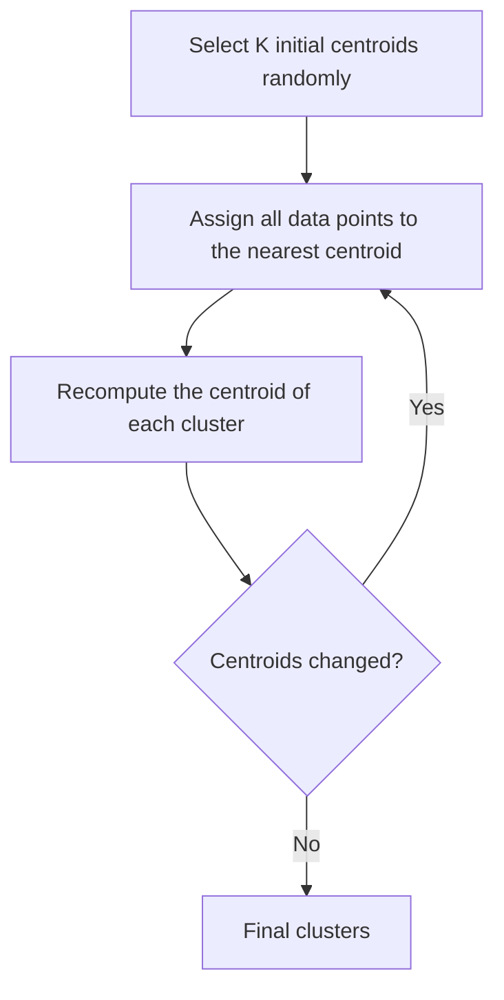
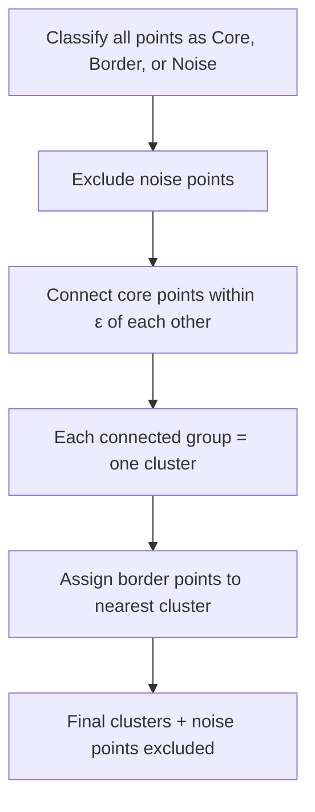
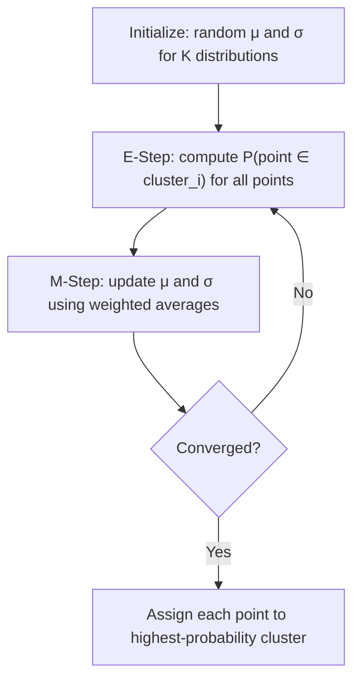

# Lecture 6: Clustering Algorithms

## Overview of Clustering

Clustering is an unsupervised learning technique that organizes data into groups (clusters) based on similarity. It operates at different levels of granularity:

- Data objects can be partitioned into clusters with **no overlap** between them.
- Multiple smaller clusters can be **merged** into larger ones (e.g., P1 and P2 form one cluster, P3 and P4 form another, and those two clusters combine into an even bigger cluster).
- In **hierarchical clustering**, at the lowest level, each sample is its own cluster.
  - **Traditional hierarchical clustering**: every object belongs to exactly one cluster at each level — strict nesting.
  - **Non-traditional hierarchical clustering**: objects may belong to overlapping clusters at different levels.

### Finding Similarity Between a Point and a Cluster

When comparing a single point to an entire cluster (e.g., "Is P4 similar to the cluster {P2, P3}?"), we use a **representative** of the cluster. The similarity is computed between the point and this representative. The representative can be defined in any way:
- The **mean** of all objects inside the cluster
- The **maximum** (largest) point inside the cluster
- The **median** of the objects

### Applications of Cluster Analysis

- **Understanding**: group related documents for browsing, group genes and proteins that have similar functionality, or group stocks with similar price fluctuations.

| Cluster | Discovered Clusters | Industry Group |
|---------|-------------------|----------------|
| **1** | Applied-Matl-DOWN, Bay-Network-Down, 3-COM-DOWN, Cabletron-Sys-DOWN, CISCO-DOWN, HP-DOWN, DSC-Comm-DOWN, INTEL-DOWN, LSI-Logic-DOWN, Micron-Tech-DOWN, Texas-Inst-Down, Tellabs-Inc-Down, Natl-Semiconduct-DOWN, Oracl-DOWN, SGI-DOWN, Sun-DOWN | Technology1-DOWN |
| **2** | Apple-Comp-DOWN, Autodesk-DOWN, DEC-DOWN, ADV-Micro-Device-DOWN, Andrew-Corp-DOWN, Computer-Assoc-DOWN, Circuit-City-DOWN, Compaq-DOWN, EMC-Corp-DOWN, Gen-Inst-DOWN, Motorola-DOWN, Microsoft-DOWN, Scientific-Atl-DOWN | Technology2-DOWN |
| **3** | Fannie-Mae-DOWN, Fed-Home-Loan-DOWN, MBNA-Corp-DOWN, Morgan-Stanley-DOWN | Financial-DOWN |
| **4** | Baker-Hughes-UP, Dresser-Inds-UP, Halliburton-HLD-UP, Louisiana-Land-UP, Phillips-Petro-UP, Unocal-UP, Schlumberger-UP | Oil-UP |

- **Summarization**: reduce the size of large data sets by representing groups of similar objects with a single representative.

### Notion of a Cluster can be Ambiguous

The same set of data points can be interpreted as having different numbers of clusters depending on perspective:
- **Two Clusters** — grouping at a high level
- **Four Clusters** — moderate granularity
- **Six Clusters** — fine-grained grouping

### Clustering Algorithm Taxonomy

Clustering algorithms can be divided into two groups:
1. **Partitional**: flat grouping with no hierarchy between clusters
2. **Hierarchical**: nested clusters organized in a tree structure

---

## Types of Clusters

The clusters themselves can take one of four forms:

### 1. Well-Separated Clusters

**Well-separated cluster**: a set of points such that any point in that cluster is closer to **every other point** in the same cluster than to any point not in the cluster.

> All points within a cluster are closer to each other than to any point outside the cluster.

### 2. Prototype-Based Clusters

**Prototype-based cluster**: a set of objects such that each object in the cluster is closer to the **prototype (centre)** of that cluster than to the centre of any other cluster.

- The prototype/centre is the **representative** of the cluster.
- The representative is typically computed as:
  - **Centroid**: the mean of all objects in the cluster (most common)
  - **Median**: the median of the objects
  - **Maximum/Minimum**: the largest or smallest object in the cluster

### 3. Contiguity-Based Clusters

**Contiguity-based cluster**: a set of points such that a point in the cluster is closer to **one or more other points** in the cluster than to any point not in the cluster.

- The key difference from prototype-based: here we measure **point-to-point** distance within the cluster, **not** point-to-centroid distance.

### 4. Density-Based Clusters

**Density-based cluster**: clusters are defined by regions of **high density** separated from other regions by **low-density** regions.

- This is the foundation of the DBSCAN algorithm.

---

## K-Means Clustering

### Algorithm Overview

**K-Means** is the simplest and most basic clustering algorithm. It is a **partitional** clustering approach, meaning there is no hierarchy between the resulting clusters.

- **K** is a **hyperparameter** that you specify. It is the number of clusters you want at the end.
- Each cluster is associated with a **centroid**.
- Each point is assigned to the cluster with the **closest centroid**.

> **Course note**: The clustering algorithms covered in this lecture (K-Means, hierarchical, DBSCAN, EM) are not the only ones. There are many others ranging from very simple to very advanced. Variants like **K-Means++** and **bisecting K-Means** will not be covered, but these four are the most popular and can be used as baselines.

### The K-Means Algorithm

```
1. Select K initial centroids
2. Form K clusters by assigning all points to the closest centroid
3. Recompute the centroid of each cluster
4. Repeat steps 2-3 until centroids do not change
```

*(reconstructed diagram)*



### Selecting Initial Centroids

Two approaches:
1. **Random selection**: simply pick K data objects at random.
2. **Heuristic algorithms**: use heuristic methods to find optimal data objects as initial centroids.

### Worked Example

Given a data distribution with K = 3:

| Step | Action |
|------|--------|
| Initialization | Select 3 data objects as initial centroids |
| Iteration 1 | Assign all samples to the nearest of the 3 centroids |
| Iteration 2 | Recompute centroids by taking the **average** of all objects in each cluster |
| Iteration 3 | Repeat assignment and recomputation |
| ... | Continue until convergence |

### Dependence on Initialization

The final clustering result **depends on the initial centroids**:
- Different initial centroids can lead to different final clusters.
- If you do not select good initial centroids, the algorithm may not converge to the optimal solution.
- Without any limit on the number of iterations, K-Means will eventually converge. But since we usually have computational limitations, the results are sensitive to initialization.

> This is the same principle as in optimization algorithms: without a limit on computation power or time, any optimization will reach the global optimum. But with resource limitations, the result depends on the initial state.

### Multi-Dimensional K-Means

K-Means works the same way regardless of the number of features:
- **Distance calculation**: use Euclidean distance (or similar) between multi-dimensional vectors.
- **Centroid recomputation**: element-wise addition of all vectors in a cluster, divided by the number of data objects.

$$\text{centroid} = \frac{1}{N} \sum_{i=1}^{N} \mathbf{A}_i$$

*(reconstructed formula)*

> The centroid is recalculated **after** assigning data objects to clusters, not before. The process is: (1) select random centroids, (2) assign points, (3) recompute centroids, (4) reassign, (5) repeat.

### The Curse of Dimensionality in Clustering

At higher dimensions:
- Distances start to **average out**. All points become nearly equidistant from each other because the data becomes sparse.
- It is easy to see separation between individual points, but hard to determine whether points belong to the same cluster or are just distant.
- The term for this is the **curse of dimensionality**: volume expands rapidly and meaningful distance-based patterns become harder to find.

K-Means is not the most efficient algorithm for all scenarios, but it provides a good **baseline** for any kind of data.

### Problems with K-Means

1. **Choosing K**: if you have no prior information about the data, it is difficult to find a good value for K.
2. **Initialization sensitivity**: results depend on the randomly chosen initial centroids. Run by run, you will get different results.

### Properties of K-Means

| Property | Detail |
|----------|--------|
| Type | Centroid-based, partitional |
| Initial centroids | Often chosen randomly |
| Reproducibility | Clusters vary from run to run |
| Centroid definition | Mean of the points in the cluster |
| Convergence | Guaranteed for common distance measures (given enough iterations) |
| Convergence speed | Most convergence happens in the **first few iterations** |
| Stopping condition | Often changed to "until relatively few points change clusters" instead of waiting for full convergence |
| Complexity | $O(n \cdot K \cdot I \cdot d)$ |

Where:
- $n$ = number of data objects
- $K$ = number of clusters
- $I$ = number of iterations
- $d$ = number of attributes

> The complexity is **linear** in all four factors.

---

## Sum of Squared Error (SSE)

### Purpose

When different people apply K-Means with different values of K or different initial centroids, they get different results. **SSE** is the metric used to compare clustering results and determine which is better.

### Definition

For each point, the "error" is the distance to its nearest cluster centre. We square each distance and sum them:

$$\text{SSE} = \sum_{i=1}^{K} \sum_{x \in C_i} \| x - M_i \|^2$$

Where:
- $x$ = a data point
- $C_i$ = cluster $i$
- $M_i$ = the centroid of cluster $i$

> It is called "error," but it is not truly an error in the supervised sense. For actual errors, we need gold labels. Here we have no true labels.

### Interpreting SSE

- Each **individual** distance is squared (not the sum of distances).
- **Smaller SSE is better**: it means the points are closer to their centroids.
- SSE is used purely for **comparison** between different clustering results.

---

## Hierarchical Clustering

### Overview

**Hierarchical clustering** algorithms produce a set of **nested clusters** organized in a hierarchy. Unlike K-Means, you **do not need to specify the number of clusters** in advance.

### Dendrograms

A **dendrogram** is a tree-like diagram that records the sequence of merges or splits.

Example:
1. At the lowest level, each sample is its own cluster.
2. Data objects 1 and 3 merge (they have the smallest distance between any pair).
3. Data objects 2 and 5 merge (next closest pair).
4. Cluster {4} merges with cluster {2, 5}.
5. Cluster {3, 1} merges with cluster {4, 2, 5}.
6. All samples are in one final cluster.

### Cutting the Dendrogram

A desired number of clusters can be obtained by **cutting the dendrogram** at the proper level:

| Cut Level | Result |
|-----------|--------|
| Lowest | 6 clusters (each sample is its own cluster) |
| Mid-low | 4 clusters |
| Mid-high | 3 clusters |
| Highest | 1 cluster (all samples together) |

> **Advantage**: no need to assume the number of clusters beforehand. You decide by choosing where to cut.

### Applications

Hierarchical clustering is especially popular in domains with natural taxonomies:
- Biology and bioscience
- Health science
- DNA analysis and pattern finding

In these domains, hierarchical clustering is **much more popular** than partitional clustering.

### Two Types of Hierarchical Clustering

| Approach | Direction | Description |
|----------|-----------|-------------|
| **Agglomerative** | Bottom-up | Start with individual points as clusters. Merge the closest pair repeatedly until one cluster remains. |
| **Divisive** | Top-down | Start with one big cluster containing all samples. Split repeatedly until each cluster has one point. |

Both approaches use **similarity or distance metrics** for merging/splitting.

### Post-Processing

Sometimes after agglomerative clustering, we perform **post-processing** to improve results:
- **Combining** similar clusters with each other
- **Splitting** large clusters into multiple smaller clusters

One of the uses of agglomerative algorithms is for post-processing on other clustering results.

### Agglomerative Algorithm

```
1. Compute the distance (proximity) matrix
2. Each data point is its own cluster
3. Repeat:
   a. Merge the two closest clusters
   b. Update the distance matrix
4. Continue until only a single cluster remains
```

> The **key operation** is determining the distance between two clusters.

### Inter-Cluster Distance Methods

When two clusters are merged, we need to recalculate distances between the new cluster and all other clusters. For example, if C2 and C5 are merged, instead of having C2 and C5 separately, you now have C2 ∪ C5, and you must recompute distances from this merged cluster to all remaining clusters. There are several approaches:

| Method | Description |
|--------|-------------|
| **Minimum (Single Linkage)** | Distance between the **closest samples** from different clusters |
| **Maximum (Complete Linkage)** | Distance between the **farthest samples** from different clusters |
| **Group Average** | Average distance between all pairs of samples from the two clusters |
| **Centroid Distance** | Distance between the **centroids** of the clusters (most popular) |
| **Objective Function** | Distance defined by some objective function |
| **Ward's Method** | Uses the squared error (SSE) |

> Different distance methods produce **different clustering results**, even on the same data.

### Group Average Example

Points {1, 2, 3, 4, 5, 6} are clustered using group average linkage. The dendrogram shows merge order:

1. Points 3 and 6 merge first (~0.04)
2. Points 2 and 5 merge (~0.1)
3. Point 4 joins {3, 6} (~0.13)
4. Point 1 joins {3, 6, 4} (~0.15)
5. {1, 3, 4, 6} merges with {2, 5} (~0.25)

### Linkage Method Comparison

Different linkage methods produce different cluster structures for the same data:

| Method | Merge Order | Characteristics |
|--------|------------|-----------------|
| **MIN** (Single Linkage) | {3,6} → {2,5} → {2,3,5,6} → {2,3,4,5,6} → all | Tends to create elongated, chain-like clusters |
| **MAX** (Complete Linkage) | {3,6} → {2,5} → {3,4,6} → {1,2,5} → all | Tends to create compact, spherical clusters |
| **Group Average** | {3,6} → {2,5} → {3,4,6} → {1,3,4,6} → all | Compromise between MIN and MAX |

### Agglomerative vs. Divisive

If you use the **same distance matrix** and the **same data points**, the agglomerative (bottom-up) and divisive (top-down) approaches will most probably give the **same results**.

### Applications of Clustering

- **Dimensionality reduction**: represent a set of samples by one representative sample, allowing high-dimensional data to be represented in lower dimensions.
- **Outlier detection**: points that do not belong to any cluster.
- **Data compression**: represent many points by their cluster centroids.

---

## DBSCAN (Density-Based Spatial Clustering of Applications with Noise)

### Core Idea

DBSCAN is a **density-based** clustering algorithm. Clusters are regions of **high density** separated from other regions by **low density**. The key question is: how do we define density?

**Density**: the number of points within a specified radius, called **epsilon ($\varepsilon$)**.

### Three Types of Points

| Type | Definition |
|------|------------|
| **Core point** | Has at least **min_points** neighbours within its $\varepsilon$ radius (counts the point itself). Located at the **interior** of a cluster. |
| **Border point** | Not a core point, but lies in the $\varepsilon$ neighbourhood of a core point. |
| **Noise point** | Neither a core point nor a border point. |

### Example: Identifying Point Types

Given: min_points = 7, $\varepsilon$ = specified radius.

- **Point A** is a core point because drawing a circle of radius $\varepsilon$ around A captures at least 7 points: 1, 2, 3, 4, 5, 6, 7.
- **Point B** is **not** a core point. It is a **border point** because it lies within the $\varepsilon$ neighbourhood of at least one core point.
- Are there any other core points? Yes. If you draw a circle with radius $\varepsilon$ around another point, it captures 1, 2, 3, 4, 5, 6, 7, 8 points, so that point is also a core point.
- Every data sample is independently checked and classified as core, border, or noise.
- Two nearby core points do **not** cancel each other out. Each point is classified independently.
- You must check **every** data sample individually. The core point classification is not limited to just one point.

### Second Example

Given: $\varepsilon$ = 10, min_points = 4.

- Points with at least 4 neighbours within radius 10 are **core points**.
- Points in the neighbourhood of a core point (but not core themselves) are **border points**.
- All remaining points are **noise points**.

### The DBSCAN Algorithm

```
1. Label all points as core, border, or noise
2. Exclude noise points
3. Put an edge between all core points within ε distance of each other
4. Each group of connected core points forms a separate cluster
5. Assign each border point to the cluster of its associated core point
```

*(reconstructed diagram)*



> **Core points** determine the clusters. **Border points** are only assigned to existing clusters. Every border point is inside the neighbourhood of some core point. **Noise points** are excluded entirely.

> This process is **computationally expensive**.

### Properties of DBSCAN

- Can handle clusters of **different shapes and sizes** (unlike K-Means, which tends to find spherical clusters).
- **Resistant to noise**: noise points are excluded at the first step.
- Requires two parameters: **$\varepsilon$** (radius) and **min_points** (minimum density).

> You can experiment with DBSCAN in **scikit-learn**. Try different values for min_points and epsilon to see how the clusters change.

*(reconstructed code example)*

```python
from sklearn.cluster import DBSCAN
import numpy as np

# Sample data
X = np.array([[1, 2], [2, 2], [2, 3], [8, 7], [8, 8], [25, 80]])

# Apply DBSCAN
clustering = DBSCAN(eps=3, min_samples=2).fit(X)

# Labels: -1 means noise
print(clustering.labels_)  # e.g., [0, 0, 0, 1, 1, -1]
```
*(added)*

---

## Distribution-Based Clustering (Gaussian Mixture Models / Expectation Maximization)

### Core Idea

Distribution-based clustering assumes that data objects come from a **mixture of probability distributions**, but we do not know the parameters of those distributions. It is more like **modelling the process that generates the data**. The goal is to:

1. **Estimate** the parameters (mean and variance) of each distribution.
2. **Assign** data samples to the distribution (cluster) they most likely belong to.

For Gaussian (normal) distributions, the parameters are:
- **Mean** ($\mu$)
- **Variance** ($\sigma^2$) or standard deviation ($\sigma$)

### The Key Problem

| Scenario | Difficulty |
|----------|------------|
| You know the source of data | Easy to estimate parameters (mean, variance) |
| You know the parameters | Easy to assign points to the highest-probability distribution |
| You know **neither** the source **nor** the parameters | Use the **Expectation Maximization (EM)** algorithm |

### Expectation Maximization (EM) Algorithm

EM is an **iterative** algorithm that alternates between two steps:

**Setup**: Assume K distributions (e.g., K = 2). Randomly initialize the mean and standard deviation for each distribution.

**E-Step (Expectation)**: For each data point, compute the probability (weight) of belonging to each distribution.
- This weight is between 0 and 1.
- For example, with two clusters ("blue" and "orange"): a weight of 1 means the sample completely belongs to the blue group, and a weight of 0.5 means it is equally likely to belong to blue or orange.
- This is **soft clustering**: each sample can partially belong to multiple clusters (unlike K-Means, which is hard clustering).

**M-Step (Maximization)**: Using the computed weights, update the mean and standard deviation for each distribution.

**Repeat**: Compute new probabilities using the updated parameters. Check which probability is higher (e.g., probability of belonging to the blue group vs. the orange group) and assign accordingly. Continue iterating.

*(reconstructed diagram)*



### Mathematical Detail

The probability of a point $x_i$ belonging to cluster $j$ can be written using **Bayes' theorem**:

$$P(H_j | x_i) = \frac{P(x_i | H_j) \cdot P(H_j)}{P(x_i)}$$

*(reconstructed formula)*

Where:
- $P(H_j | x_i)$ is the posterior probability that point $x_i$ belongs to cluster $j$
- $P(x_i | H_j)$ is the likelihood of $x_i$ given distribution $j$
- $P(H_j)$ is the prior probability of cluster $j$

### Updating Parameters

After computing weights for all samples:
- **New mean**: weighted average of all data points

$$\mu_j^{\text{new}} = \frac{\sum_{i=1}^{N} w_{ij} \cdot x_i}{\sum_{i=1}^{N} w_{ij}}$$

*(reconstructed formula)*

- **New standard deviation**: weighted standard deviation using the new mean

### Detailed EM Formulas

**E-step** — Compute the likelihood of point $x_i$ under distribution $b$:

$$P(x_i | b) = \frac{1}{\sqrt{2\pi} \; \sigma_b} \; e^{-\frac{(x_i - \mu_b)^2}{2\sigma_b^2}}$$

Then compute the posterior probability (weight) using Bayes' rule:

$$b_i = P(b | x_i) = \frac{P(x_i | b) \, P(b)}{P(x_i | b) \, P(b) + P(x_i | a) \, P(a)}$$

**M-step** — Update the mean and variance using the computed weights:

$$\mu_b = \frac{b_1 x_1 + b_2 x_2 + \ldots + b_n x_n}{b_1 + b_2 + \ldots + b_n}$$

$$\sigma_b^2 = \frac{b_1(x_1 - \mu_b)^2 + b_2(x_2 - \mu_b)^2 + \ldots + b_n(x_n - \mu_b)^2}{b_1 + b_2 + \ldots + b_n}$$

### Summary of EM

| Step | Action |
|------|--------|
| 1. Define | Number of distributions (K) and initial values for mean and standard deviation |
| 2. E-Step | For each sample, compute the weight (probability of belonging to each distribution) |
| 3. M-Step | Using the weights, update the mean and standard deviation |
| 4. Check | Which distribution has higher probability for each sample |
| 5. Repeat | Until convergence |

### Hard vs. Soft Clustering

| Type | Algorithm | Description |
|------|-----------|-------------|
| **Hard clustering** | K-Means | Each point belongs to exactly **one** cluster |
| **Soft clustering** | EM/GMM | Each point has a **probability** of belonging to each cluster |

---

## Cluster Validity and Evaluation

### The Problem

After clustering, how do we evaluate the quality of our results? Numerical measures that are applied to judge various aspects of cluster validity are referred to as **cluster validity measures**.

### Two Evaluation Approaches

| Approach | Label Requirement | Method |
|----------|-------------------|--------|
| **Supervised** | Requires some labelled data | Label part of the data yourself (or by an expert), then treat clustering as classification. Use accuracy, precision, recall, etc. |
| **Unsupervised** | No labels needed | Measure the goodness of clustering without respect to external information (labels). Use internal metrics (e.g., SSE). |

> In clustering, we do not have true/false labels. But we can **convert** by saying: if samples are in the same group, that is "true," and if not, that is "false." Then use classification metrics.

### When to Use Each Approach

- **Sensitive tasks**: apply **both** approaches to ensure reliable results.
- **Most of the time**: the unsupervised approach is enough, because the supervised approach is time-consuming and expensive.

---

### Unsupervised Evaluation: Cohesion and Separation

For the unsupervised approach, we measure two aspects:

| Aspect | Measures | Metric | What it captures |
|--------|----------|--------|------------------|
| **Cohesion** | Intra-cluster distance | **SSE** (Sum of Squared Error) | How closely related the objects in a cluster are |
| **Separation** | Inter-cluster distance | **SSB** (Sum of Squares Between) | How distinct a cluster is from other clusters |

### SSE Formula (Cohesion)

$$\text{SSE} = \sum_{i=1}^{K} \sum_{x \in C_i} \| x - M_i \|^2$$

Where:
- $M_i$ = centroid of cluster $i$
- $x$ = data sample inside the cluster

### SSB Formula (Separation)

$$\text{SSB} = \sum_{i=1}^{K} N_i \cdot \| M_i - M \|^2$$

Where:
- $N_i$ = number of samples in cluster $i$
- $M_i$ = centroid of cluster $i$
- $M$ = **global mean** of all samples

### Worked Example

Data points: {1, 2, 4, 5}. Global mean: $M = \frac{1 + 2 + 4 + 5}{4} = 3$.

#### Case 1: K = 1 (one cluster containing all points)

Centroid = 3.

$$\text{SSE} = (1-3)^2 + (2-3)^2 + (4-3)^2 + (5-3)^2 = 4 + 1 + 1 + 4 = 10$$

$$\text{SSB} = 4 \times (3 - 3)^2 = 0$$

**Total = SSE + SSB = 10**

#### Case 2: K = 2 (cluster 1: {1, 2}, cluster 2: {4, 5})

$M_1 = 1.5$, $M_2 = 4.5$.

$$\text{SSE} = (1-1.5)^2 + (2-1.5)^2 + (4-4.5)^2 + (5-4.5)^2 = 0.25 + 0.25 + 0.25 + 0.25 = 1$$

$$\text{SSB} = 2 \times (1.5 - 3)^2 + 2 \times (4.5 - 3)^2 = 2(2.25) + 2(2.25) = 4.5 + 4.5 = 9$$

**Total = SSE + SSB = 10**

#### Comparison

| Metric | K = 1 | K = 2 | Better |
|--------|-------|-------|--------|
| SSE | 10 | 1 | K = 2 (smaller SSE is better) |
| SSB | 0 | 9 | K = 2 (larger SSB is better) |
| Total | 10 | 10 | Always the same |

### Key Takeaways

- **Minimize SSE** (intra-cluster distance should be small).
- **Maximize SSB** (inter-cluster distance should be large).
- The **total (SSE + SSB)** is always the same, regardless of clustering.
- If you need **compact clusters**, give more weight to SSE.
- If **cluster separation** is more important, give more weight to SSB.

### Graph-Based View

Clustering quality can also be viewed as a graph:
- **Cluster cohesion**: sum of the weights of edges **within** clusters (intra-cluster distance).
- **Cluster separation**: sum of the weights of edges **between** clusters (inter-cluster distance).

---

### Silhouette Coefficient

The **silhouette coefficient** evaluates the quality of the placement of individual samples inside their clusters. It combines the ideas of **cohesion** (how close a point is to its own cluster) and **separation** (how far it is from other clusters), but measured **for each individual point**.

*(reconstructed formula)*

For a data point $i$:

$$s(i) = \frac{b(i) - a(i)}{\max(a(i), b(i))}$$

*(added)*

Where:
- $a(i)$ = average distance from point $i$ to all other points in the **same cluster** (cohesion)
- $b(i)$ = average distance from point $i$ to all points in the **nearest other cluster** (separation)

Interpretation:
- $s(i) \approx 1$: the point is well placed in its cluster
- $s(i) \approx 0$: the point is on the boundary between two clusters
- $s(i) \approx -1$: the point is likely in the wrong cluster

---

## Summary

| Algorithm Family | Algorithm | Key Properties |
|-----------------|-----------|----------------|
| **Partition-based** | K-Means | Requires K, uses centroids, minimizes SSE |
| **Density-based** | DBSCAN | Uses Eps & MinPts, finds arbitrary shapes, handles noise |
| **Distribution-based** | EM | Gaussian mixture, soft clustering, E-step & M-step |
| **Hierarchical** | Agglomerative | Bottom-up merging, dendrogram, MIN/MAX/Avg linkage |
