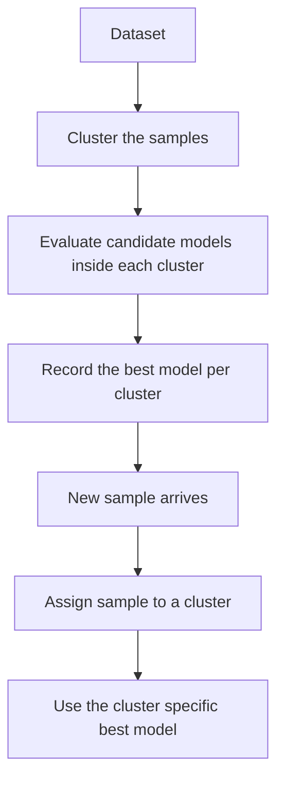
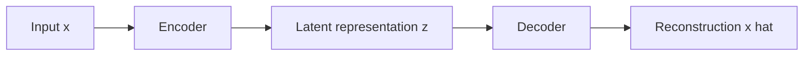
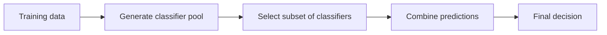
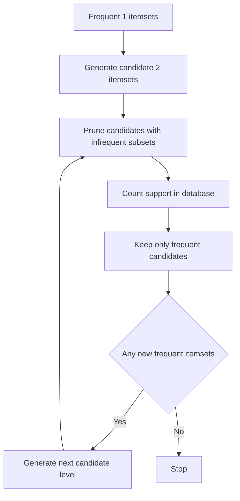
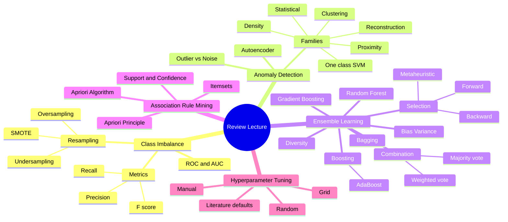

# Review of Class Imbalance, Anomaly Detection, Ensemble Learning, Association Rule Mining, and Hyperparameter Tuning

## 1. Class Imbalance

### What class imbalance means

**Class imbalance**: a classification setting where one class has far more samples than another.

Typical examples from the lecture:

* Credit card fraud detection
* Intrusion detection
* Defective product detection in manufacturing
* Disease detection

### Why accuracy is misleading

If a dataset has 1,000 samples, with 10 positive cases and 990 negative cases, a classifier that predicts every sample as negative achieves:

$$
\text{Accuracy} = \frac{990}{1000} = 99\%
$$

That model is still useless for the actual task, because it detects none of the minority class.

> **Key idea**: In imbalanced classification, correctly detecting the minority class is often much more important than correctly detecting the majority class.

*(additional example)* In airport baggage screening, truly dangerous bags are rare. A system that labels every bag as safe could still have very high accuracy, but it would fail at the task that actually matters.

### Metrics that matter more than accuracy

**Precision**: among all samples predicted as positive, how many are actually positive.

$$
\text{Precision} = \frac{TP}{TP + FP}
$$

**Recall**: among all truly positive samples, how many are predicted correctly.

$$
\text{Recall} = \frac{TP}{TP + FN}
$$

**F score**: the harmonic mean of precision and recall.

$$
F_1 = \frac{2PR}{P + R}
$$

Confusion matrix based terminology reviewed in class:

* **Precision** is also called **positive predictive value**
* **Recall** is also called **sensitivity** or **true positive rate**
* **Specificity** is the **true negative rate**
* **False positive rate** is $1 - \text{specificity}$
* **False negative rate** is $1 - \text{sensitivity}$

Quick reference:

| Metric | Alternate Names | Formula |
| --- | --- | --- |
| Precision | Positive Predictive Value (PPV) | $TP / (TP + FP)$ |
| Recall | Sensitivity, True Positive Rate (TPR) | $TP / (TP + FN)$ |
| Specificity | True Negative Rate (TNR) | $TN / (TN + FP)$ |
| False Positive Rate | $1 - \text{specificity}$ | $FP / (FP + TN)$ |
| False Negative Rate | $1 - \text{sensitivity}$ | $FN / (FN + TP)$ |

### Worked example, precision, recall, and F score

Suppose a fraud detector predicts 12 transactions as fraud.

* 8 are truly fraud, so $TP = 8$
* 4 are actually normal, so $FP = 4$
* 2 fraud cases were missed, so $FN = 2$

Then:

$$
\text{Precision} = \frac{8}{8 + 4} = \frac{8}{12} \approx 0.667
$$

$$
\text{Recall} = \frac{8}{8 + 2} = \frac{8}{10} = 0.8
$$

$$
F_1 = \frac{2 \times 0.667 \times 0.8}{0.667 + 0.8} \approx 0.727
$$

Interpretation:

* Precision is not perfect, because some predicted fraud cases were false alarms
* Recall is higher, because most actual fraud cases were detected
* F score summarizes the tradeoff between the two

### Precision and recall also matter outside classification

The lecture connected these ideas to **information retrieval**.

When searching in Google or another retrieval system:

* Sometimes precision matters more, if you want only highly relevant results
* Sometimes recall matters more, if missing relevant results is costly

*(additional example)* In medical screening, recall is often critical because missing a true disease case is costly. In a document search for a legal brief, precision may matter more if the user wants a small set of highly relevant cases.

### Relationship between precision and recall under imbalance

In an ideal case, precision and recall should be close to each other.

In imbalanced problems, there is often a gap between them. The lecturer emphasized that, in many such settings, precision is often higher than recall.

## 2. ROC Analysis and AUC

**ROC**: Receiver Operating Characteristic.

An ROC curve shows the relationship between:

* **True positive rate**
* **False positive rate**

**AUC**: area under the ROC curve.

General interpretation:

* Larger AUC usually indicates a better model
* Smaller AUC usually indicates a weaker model

Reference values *(from slides)*:

* **Ideal classifier**: AUC $= 1$
* **Random guessing**: AUC $= 0.5$
* **Below 0.5**: predictions are opposite of the true class

Key points on the ROC plane (slide convention plots TPR against FPR):

* Origin, TPR $= 0$ and FPR $= 0$: declare everything negative
* Top right, TPR $= 1$ and FPR $= 1$: declare everything positive
* Top left, TPR $= 1$ and FPR $= 0$: ideal classifier
* Diagonal: random guessing

Historical note: ROC was developed in the 1950s for signal detection theory to analyze noisy signals.

### Threshold example for ROC intuition *(additional example)*

Suppose a classifier outputs risk scores from 0 to 1.

* If we classify every case above 0.9 as positive, we may get very few false positives, but also miss many true positives
* If we lower the threshold to 0.4, we may catch more true positives, but also create more false positives

The ROC curve summarizes this tradeoff across thresholds instead of focusing on only one cutoff.

*(additional example)* Think about a weather app that sends storm alerts. A very strict threshold sends alerts only on the most certain storm days, so false alarms are low but some real storms are missed. A lower threshold catches more real storms, but also sends more annoying false alarms.

### Worked ROC point example *(additional example)*

Suppose a dataset has:

* 20 actual positive cases
* 80 actual negative cases

At threshold 0.7, suppose the classifier produces:

* $TP = 12$
* $FN = 8$
* $FP = 4$
* $TN = 76$

Then:

$$
\text{True Positive Rate} = \frac{12}{20} = 0.6
$$

$$
\text{False Positive Rate} = \frac{4}{80} = 0.05
$$

So one ROC point is:

$$
(0.05,\ 0.6)
$$

Now lower the threshold to 0.4. Suppose the classifier produces:

* $TP = 17$
* $FN = 3$
* $FP = 16$
* $TN = 64$

Then:

$$
\text{True Positive Rate} = \frac{17}{20} = 0.85
$$

$$
\text{False Positive Rate} = \frac{16}{80} = 0.2
$$

So another ROC point is:

$$
(0.2,\ 0.85)
$$

This shows what happens when the threshold is lowered. The classifier catches more true positives, but it also creates more false positives.

### Procedure for constructing an ROC curve *(from slides)*

To construct a full ROC curve from a classifier:

1. Use a classifier that produces a **continuous valued score** for each instance. Higher score means more likely positive.
2. Sort the instances in **decreasing order** by score.
3. Apply a threshold at each unique value of the score.
4. At each threshold, count TP, FP, TN, FN.
5. Compute TPR and FPR at each threshold.
6. Plot TPR against FPR to obtain the ROC curve.

Classifiers that only produce discrete outputs can still be used for ROC analysis by generating a continuous score. For decision trees, that score is the probability of the positive class assigned to each leaf. Other classifiers that can emit continuous scores include rule based classifiers, neural networks, Bayesian classifiers, k nearest neighbors, and SVM.

### Important nuance about AUC

The model with the best overall AUC is not always the best model for every kind of sample.

The lecture described a more complex strategy:

1. Cluster the samples
2. Evaluate which model performs best inside each cluster
3. For a new sample, assign it to a cluster first
4. Use the model that previously worked best for that cluster

> **Key idea**: Different models may be better for different regions of the data space.

The lecturer also noted that this kind of cluster specific model selection is more complicated in practice than simply choosing one global model.



## 3. Resampling for Imbalanced Data

### Basic directions

**Resampling**: changing the class distribution of the training data to reduce imbalance.

Two main directions:

* **Undersampling**, reduce the number of majority class samples
* **Oversampling**, increase the number of minority class samples

The simplest versions are:

* Random undersampling
* Random oversampling

### Multiclass resampling

For multiclass problems, deciding which classes to oversample or undersample is usually a **hyperparameter choice**.

Possible strategies mentioned in the lecture:

* Pick one class as a reference and adjust the others relative to it
* Choose target class sizes heuristically
* Evaluate whether the resulting class balance improves model performance

### Resampling example *(additional example)*

Suppose a three class dataset has:

* Class A, 1,000 samples
* Class B, 200 samples
* Class C, 50 samples

One possible strategy is to keep Class B as the reference size:

* Undersample Class A from 1,000 to 200
* Oversample Class C from 50 to 200

Then train a classifier and compare whether the new balance improves minority class performance.

## 4. SMOTE

**SMOTE**: Synthetic Minority Oversampling Technique.

### How SMOTE works

For each minority class sample:

1. Find its $k$ nearest neighbors from the **minority** class
2. Pick one of those neighbors
3. Compute the difference vector between the original sample and that neighbor
4. Multiply that difference by a random number between 0 and 1
5. Add the result back to the original sample

This creates a synthetic point on the line segment between two minority class samples.

The process repeats until enough synthetic samples are generated.

### Mathematical form *(reconstructed)*

If $x_i$ is a minority sample and $x_{zi}$ is one of its minority nearest neighbors, a synthetic sample can be generated as:

$$
x_{\text{new}} = x_i + \lambda (x_{zi} - x_i), \quad \lambda \in [0,1]
$$

### Worked SMOTE example

Suppose a minority class sample is:

$$
x_i = (2, 4)
$$

and one of its minority nearest neighbors is:

$$
x_{zi} = (6, 8)
$$

If $\lambda = 0.25$, then:

$$
x_{\text{new}} = (2,4) + 0.25 \big((6,8) - (2,4)\big)
$$

$$
= (2,4) + 0.25(4,4)
$$

$$
= (2,4) + (1,1)
$$

$$
= (3,5)
$$

So the synthetic point lies on the line segment between the two minority samples.

### When SMOTE fits well

The review emphasized that SMOTE works naturally for **numeric vector data**.

The interpolation logic assumes a vector space representation where intermediate points make sense.

*(additional example)* If a rare flower species is represented by numeric measurements such as petal length and petal width, a synthetic point between two similar flowers can still represent a plausible flower sample.

### Limitation of naive SMOTE

For raw images or other highly structured objects, applying SMOTE directly in pixel space is usually not meaningful unless the data have already been embedded into a representation where interpolation is sensible.

*(additional example)* Interpolating directly between two face images pixel by pixel may create an unrealistic blurry image. Interpolating between learned embeddings from an encoder can be more meaningful.

*(reconstructed library usage)*

```python
from imblearn.over_sampling import SMOTE

smote = SMOTE(k_neighbors=5, random_state=42)
X_resampled, y_resampled = smote.fit_resample(X_train, y_train)
```

## 5. Anomaly Detection

### What anomalies are

**Anomaly** or **outlier**: a sample that is considerably different from normal data.

Outliers are usually rare.

### Outliers versus noise

The lecture stressed that **outlier** and **noise** are not the same thing.

**Outlier**: unusual data that may still be valid.

**Noise**: invalid, corrupted, or improperly recorded data.

Examples from class:

* If employee salaries are usually between 100K and 120K, a salary of 900K might be an outlier. It may still be valid.
* If a birth date is invalid, the currency field is wrong, or the data format is incorrect, that is noise.

> **Key idea**: Noise is invalid data. Outliers can still be valid data points.

### Why anomaly detection matters

Outliers can damage data analysis when the goal is to understand the general pattern of a dataset.

Depending on the goal, we may want to detect them and exclude them from analysis.

### Why anomalies appear

The lecturer gave several reasons:

* Samples from different classes may be mixed together
* Natural variation may produce unusual but valid cases
* Context determines whether something is really anomalous

Examples:

* If we are analyzing orange weights and a few grapefruits are mixed in, those points may appear anomalous
* A very tall person may look anomalous in one population, but not in a basketball player dataset

### Main anomaly detection approaches

The review listed:

* Statistical methods (example, Grubbs' Test)
* Proximity based methods
* Density based methods (example, Local Outlier Factor or LOF)
* Clustering based methods
* Reconstruction based methods
* One class SVM

The lecture also noted that **similarity** can be viewed as one expression of proximity.

### Density based detail, the LOF approach *(from slides)*

**Local Outlier Factor (LOF)**: for each point, compute the density of its local neighborhood, and compare it with the density of its nearest neighbors.

* A point is an outlier **not just because it is far from others**, but because it is **much less dense than its neighbors**.
* If the data contains regions of different density, proximity based methods can miss outliers that LOF catches.

Relative density formulas:

$$\text{density}(x, k) = \frac{1}{\text{dist}(x, y_k)}$$

$$\text{relative density}(x, k) = \frac{\text{dist}(x, k)}{\frac{1}{k} \sum_{i=1}^{k} \text{dist}(y_i, k)}$$

Interpretation:

* If relative density$(x, k) \gg 1$, then $x$ is a strong outlier.
* If relative density$(x, k) < 1$, then $x$ is not an outlier.

### Example, outlier versus noise

Consider an online store dataset:

* A customer who spends 20,000 dollars in one order may be an outlier, but still a valid customer
* A customer age recorded as negative 8 is noise, because the value is invalid

This illustrates why anomaly detection and data cleaning are related, but not identical.

*(additional example)* In a household electricity record, monthly bills of 90, 95, 100, and then 900 dollars could indicate an outlier. A bill recorded as the word "blue" would be noise, because the entry is invalid rather than merely unusual.

## 6. Autoencoders for Compression, Denoising, and Anomaly Detection

### What an autoencoder is

**Autoencoder**: a neural model trained to reconstruct its input at the output.

Possible architectures mentioned:

* MLP
* CNN

Core structure:

* **Encoder** compresses the input into a lower dimensional hidden representation
* **Decoder** reconstructs the original sample from that hidden representation

> **Broader context from the slides**: Reconstruction based anomaly detection is not limited to autoencoders. It relies on the assumption that normal class data can be captured by a lower dimensional representation. Two main tools are **Principal Components Analysis (PCA)** and autoencoders. Both measure reconstruction error, and objects with large reconstruction error are flagged as anomalies.



*(reconstructed minimal PyTorch autoencoder)*

```python
import torch.nn as nn

class Autoencoder(nn.Module):
    def __init__(self, input_dim, hidden_dim):
        super().__init__()
        self.encoder = nn.Sequential(
            nn.Linear(input_dim, 128), nn.ReLU(),
            nn.Linear(128, hidden_dim),
        )
        self.decoder = nn.Sequential(
            nn.Linear(hidden_dim, 128), nn.ReLU(),
            nn.Linear(128, input_dim),
        )

    def forward(self, x):
        z = self.encoder(x)
        return self.decoder(z)

# Anomaly score at inference time
# reconstruction_error = ((x - model(x)) ** 2).mean(dim=1)
```

### Autoencoders for compression

If the original input is high dimensional and the hidden representation is much smaller, we can:

1. Store the encoded representation instead of the full sample
2. Decode it later when needed

This gives a form of learned compression.

*(additional example)* A 1,024 dimensional image feature vector might be compressed into a 64 dimensional latent vector, stored in that smaller form, and reconstructed later when needed.

*(additional example)* A phone photo app could store a shorter internal representation of an image while still keeping enough information to reconstruct the important visual content later.

### Autoencoders for denoising

If we have noisy inputs and know the desired clean outputs, we can train the model with:

* Noisy sample as input
* Clean sample as target

This forces the model to learn how to remove noise.

*(additional example)* If a clean handwritten digit image is corrupted with random pixel noise, the autoencoder can be trained to map the noisy image back to the clean digit.

*(additional example)* If an old scanned document has speckle noise and faint marks, the model can learn to reconstruct a cleaner version of the same page.

### Autoencoders for anomaly detection

The same reconstruction idea supports anomaly detection:

* If the input is normal, reconstruction should be close to the input
* If the input is contaminated or anomalous, reconstruction error should be larger

**Reconstruction error** becomes the anomaly signal.

*(reconstructed example)* A common reconstruction error is mean squared error:

$$
\text{Reconstruction Error}(x) = \lVert x - \hat{x} \rVert_2^2
$$

Large reconstruction error can indicate that the sample does not fit the normal pattern the autoencoder has learned.

### Worked anomaly detection example with reconstruction error *(additional example)*

Suppose an autoencoder is trained only on normal network traffic.

* A normal packet record gives reconstruction error 0.02
* Another normal packet gives reconstruction error 0.05
* A suspicious packet gives reconstruction error 1.40

If the chosen anomaly threshold is 0.3, the suspicious packet is flagged as anomalous because its reconstruction error is far outside the normal range.

## 7. One Class SVM

### Why we need it

In ordinary supervised classification, we need labeled data from multiple classes.

In anomaly detection, labels are often unavailable.

**One class SVM** tries to learn the region of space occupied by normal data.

Samples outside that learned region are treated as outliers.

### Geometric intuition

The lecture described the **origin trick**:

* In feature space, the origin is treated as the opposing reference
* The model learns a hyperplane that separates normal data from the origin
* The margin is made as large as possible while allowing some slack for outliers

With a Gaussian kernel, the data are mapped into a high dimensional feature space, making it possible to carve out a flexible region around dense normal samples.

### Gaussian kernel properties *(from slides)*

The Gaussian kernel is:

$$\kappa(x, y) = \exp\left(-\frac{\|x - y\|^2}{2\sigma^2}\right)$$

Two useful consequences in the mapped feature space:

* Every point maps to a **unit hypersphere**, because $\kappa(x, x) = \|\phi(x)\|^2 = 1$.
* Every pair of points lies in the **same orthant**, because $\kappa(x, y) \geq 0$.

These two properties make the idea of maximizing the distance of the separating plane from the origin geometrically well defined.

### Full optimization problem *(from slides)*

The weight vector is a linear combination of mapped training points:

$$w = \sum_{i=1}^{n} \alpha_i \phi(x_i)$$

Training solves:

$$\min_{w, \rho, \xi} \frac{1}{2} \|w\|^2 - \rho + \frac{1}{n\nu} \sum_{i=1}^{n} \xi_i$$

subject to $\langle w, \phi(x_i) \rangle \geq \rho - \xi_i$ and $\xi_i \geq 0$.

### Decision function

The decision function discussed in the review is:

$$
f(x) = w \cdot \phi(x) - \rho
$$

Interpretation:

* If $f(x) \geq 0$, treat the sample as normal
* If $f(x) < 0$, treat the sample as an outlier

### Role of $\nu$

**$\nu$**: a hyperparameter that controls the expected fraction of outliers and therefore how tight or loose the learned normal region becomes.

Higher $\nu$ usually allows more points to be treated as outliers.

### One class SVM intuition example *(additional example)*

Suppose we train on 1,000 normal machine vibration records and set $\nu = 0.05$.

This tells the model to allow a relatively small fraction of training points to fall outside the learned normal region. If we increase $\nu$ to 0.15, the boundary becomes less tolerant, and more points may be treated as outliers.

*(additional example)* Suppose an office trains a one class SVM on normal badge swipe patterns during regular work hours. A late night access pattern from a rarely used entrance may fall outside the learned normal region and be flagged for review.

### Worked one class SVM decision example *(additional example)*

Suppose the decision function is:

$$
f(x) = w \cdot \phi(x) - \rho
$$

and for three samples we obtain:

* Sample A, $f(x) = 1.2$
* Sample B, $f(x) = 0.0$
* Sample C, $f(x) = -0.4$

Using the lecture rule:

* If $f(x) \geq 0$, classify as normal
* If $f(x) < 0$, classify as outlier

we get:

* Sample A is normal
* Sample B is on the boundary and still treated as normal
* Sample C is an outlier

*(reconstructed example)* Minimal `scikit-learn` usage:

```python
from sklearn.svm import OneClassSVM

model = OneClassSVM(kernel="rbf", nu=0.05, gamma="scale")
model.fit(X_train_normal)

pred = model.predict(X_test)
# +1 means normal, -1 means outlier
```

## 8. Classifier Fusion and Ensemble Learning

### Core idea

**Classifier fusion** or **ensemble learning**: build several classifiers and combine their predictions into one final decision.

The lecture used the analogy of asking several experts instead of relying on one expert.

### Why ensembles work, numerical intuition *(from slides)*

Suppose we have 25 base classifiers, each with error rate $\epsilon = 0.35$, combined by majority vote.

* **If all classifiers are identical**: the ensemble error rate equals the individual error, so $e_{\text{ensemble}} = 0.35$.
* **If all classifiers are independent**: the ensemble is wrong only when more than half of the classifiers are wrong, so:

$$e_{\text{ensemble}} = \sum_{i=13}^{25} \binom{25}{i} \epsilon^i (1 - \epsilon)^{25 - i} \approx 0.06$$

The ensemble error drops from 35 percent to about 6 percent simply by making the classifiers independent.

### Necessary conditions for ensemble methods *(from slides)*

Ensemble methods beat a single base classifier when:

1. All base classifiers are **independent** of each other, or at least reasonably diverse.
2. All base classifiers perform **better than random guessing**, which for binary classification means error rate below 0.5.

If either condition fails, aggregation may not help, and can even make things worse.

### Why diversity matters

For ensemble learning to work well, the classifiers should be **diverse**. They should not all behave in exactly the same way.

Ways to create diversity:

* Use different training sets with the same learning algorithm
* Use the same training set and the same classifier type, but different hyperparameters
* Use the same training set with different types of classifiers
* Combine these strategies

**Alternative taxonomy from the slides**, organized by what is manipulated:

| Manipulation target | Example methods |
| --- | --- |
| Training set | Bagging, boosting, random forests |
| Input features | Random forests (random feature subsets at each split) |
| Class labels | Error correcting output coding |
| Learning algorithm | Injecting randomness into the initial weights of a neural network |

The review also noted that **classifier diversity itself can be measured**.

### Combination strategies

The simplest combination strategy is **majority voting**.

However, majority voting assumes all classifiers are equally reliable.

If some classifiers perform better than others, **weighted majority voting** is usually a better idea.

### Worked voting example

Suppose three classifiers predict the same sample:

* Classifier 1 predicts positive, weight 0.9
* Classifier 2 predicts negative, weight 0.3
* Classifier 3 predicts negative, weight 0.2

Then the positive side gets total weight:

$$
0.9
$$

The negative side gets:

$$
0.3 + 0.2 = 0.5
$$

So the final prediction is positive.

This example shows why weighted voting can be better than treating all classifiers equally. Under simple majority voting, the result would be negative because two classifiers voted negative. Under weighted voting, the stronger classifier has more influence, so the result becomes positive.

*(additional example)* Imagine three movie reviewers. Two casual reviewers dislike a film, but a highly reliable reviewer strongly recommends it. A weighted vote can reflect that the trusted reviewer has historically been more accurate.

### Ensemble pipeline

The lecturer framed ensemble learning as a three stage process:

1. **Classifier generation**
2. **Classifier selection**
3. **Classifier combination**



### Classifier selection methods

**Forward selection**:

1. Sort classifiers by performance
2. Start with the best classifier
3. Add one classifier at a time
4. Combine the current set
5. Keep a new classifier only if it improves validation performance

**Backward elimination**:

1. Start with the full classifier pool
2. Combine all classifiers
3. Remove the lowest performing classifier
4. Re evaluate
5. Keep it removed only if performance improves

Other options mentioned:

* Random selection
* Heuristics
* Metaheuristic optimization

### Mapping between classifier selection and feature selection

The same forward and backward strategies are used for feature selection, with some differences worth remembering.

| Feature Selection | Classifier Selection |
| --- | --- |
| No majority vote step, train one model on the current feature subset | Each intermediate evaluation requires combining classifiers via voting |
| Features usually cannot be sorted by individual performance | Classifiers can be sorted by individual accuracy |
| Backward elimination typically removes in a fixed order | Backward elimination removes the worst classifier first |
| Low **correlation** between features is desirable | Low **correlation** between classifiers is desirable, which is called high **diversity** |

> **Key analogy**: correlation between features in feature selection corresponds to diversity between classifiers in classifier selection. Low feature correlation is good, and low classifier correlation, which is high diversity, is also good, for the same underlying reason.

### Forward selection example *(additional example)*

Suppose five classifiers have validation accuracies of 82 percent, 80 percent, 78 percent, 75 percent, and 70 percent.

Forward selection could proceed like this:

1. Start with the 82 percent classifier
2. Add the 80 percent classifier, if the combined ensemble improves validation performance
3. Try adding the 78 percent classifier
4. Stop adding classifiers once the ensemble no longer improves

The best subset is not always the set of top individual classifiers, because classifiers can overlap in their errors.

### Why selection becomes hard

If the pool is large, subset selection becomes a combinatorial problem.

If there are 500 classifiers, the number of possible non empty subsets is:

$$
2^{500} - 1
$$

That is why methods such as these may be useful:

* Genetic algorithms
* Particle swarm optimization
* Simulated annealing
* Other metaheuristics

### Combination happens sample by sample

The review explicitly noted that classifiers are combined **sample by sample**, by aggregating the predicted labels for the same input sample.

## 9. Bias, Variance, and Why Ensembles Work

### Which base classifiers benefit most

Ensemble methods tend to work especially well with **unstable base classifiers**.

**Unstable classifier**: a model whose behavior changes noticeably when the training data or hyperparameters change slightly.

Examples from the lecture:

* Decision trees
* Neural networks

These models often have:

* Low bias
* High variance

Combining them can reduce variance.

### Bias and variance review

**Overfitting** corresponds to:

* Low bias
* High variance

**Underfitting** corresponds to:

* High bias
* Low variance

Quick reference:

| Condition | Bias | Variance |
| --- | --- | --- |
| Overfitting | Low | High |
| Underfitting | High | Low |

Possible causes of overfitting:

* Excessive model complexity
* Small datasets
* Training that allows memorization of details

Possible causes of underfitting:

* Model too simple
* Insufficient training
* Poor data quality
* Not enough useful signal in the features

### What model complexity means

The lecture treated **model complexity** as something often reflected by:

* Architecture
* Number of parameters

### Text processing example for model capacity

The same text can support many tasks, including:

* Sentiment analysis
* Named entity recognition
* Part of speech tagging
* Summarization
* Topic modeling
* Dependency analysis

The lecturer also noted that one model can sometimes be trained for several tasks at once. This is **multi task learning**.

### More data and regularization

Increasing the amount of data can help with both underfitting and overfitting, but the reason matters.

If the model is extremely complex and the dataset is very small, it may memorize training samples and overfit.

Regularization methods such as:

* Weight penalties
* Dropout

can reduce effective complexity and help generalization.

> **Key idea**: Model complexity is a central factor in overfitting.

### Example, overfitting versus underfitting *(additional example)*

Suppose we fit two models to the same small dataset:

* A linear model gives 68 percent training accuracy and 66 percent test accuracy. This may indicate underfitting.
* A very deep neural network gives 100 percent training accuracy and 71 percent test accuracy. This may indicate overfitting.

The first model is too simple for the pattern. The second model may be memorizing the training set.

## 10. Bagging

**Bagging**: bootstrap aggregating.

### Procedure

1. Create multiple bootstrap samples from the training set by sampling with replacement
2. Train one classifier on each bootstrap sample
3. Combine their predictions, usually by majority voting

### Properties of bootstrap samples

A bootstrap sample can:

* Contain duplicates
* Omit some original samples entirely

That variation is what creates diversity, even when the same learning algorithm is used each time.

*(additional example)* If the original training records are A, B, C, and D, one bootstrap sample might be {A, B, B, D}. Record C is missing in that sample, and record B appears twice.

### Bootstrap selection probability *(from slides)*

The probability that a specific training instance is selected at least once in a bootstrap sample of size $n$ is:

$$P(\text{selected}) = 1 - \left(1 - \frac{1}{n}\right)^n \approx 0.632 \quad \text{for large } n$$

So on average, each bootstrap sample contains roughly 63.2 percent of the unique original instances. The remaining instances either appear as duplicates or are omitted entirely. Instances omitted from a given bootstrap sample form the **out of bag** set, which can be used for validation.

### Bagging is not limited to one classifier family

The review explicitly noted that bagging is not tied to one classifier type.

Possible base learners include:

* SVM
* Decision tree
* Neural model
* Other classifiers

### Decision stump example from class

The lecturer walked through a one dimensional example with **decision stumps**.

A decision stump classifies based on a threshold on $x$.

Different bootstrap samples produced different split points, such as:

* 0.35
* 0.7
* 0.75

For a new sample:

1. Each stump predicts a label
2. We sum the signed outputs, or equivalently take a majority vote
3. The aggregate prediction becomes the final decision

### Worked bagging example

Suppose three decision stumps make predictions for one sample:

* Stump 1 says positive
* Stump 2 says negative
* Stump 3 says positive

Majority voting gives the final prediction as positive, because two of the three stumps vote positive.

### Explainability weakness

The lecture emphasized a practical problem:

A single decision stump is easy to explain. For example, we can say the model predicted a label because $x < 0.35$.

An ensemble is much harder to explain in a useful way. Saying that many classifiers voted and the majority won is not a satisfying explanation for an end user.

> **Key takeaway**: Ensemble methods may improve performance, but transparency becomes weaker.

> **From the slides**: Bagging can also **increase the representation capacity** of simple classifiers. A single decision stump can only split on one threshold, but a bagged ensemble of stumps trained on different bootstrap samples carves the input space into multiple regions. Bagging is therefore useful not only for reducing variance but for expanding the hypothesis space of weak learners.

## 11. Boosting

### Main idea

Boosting is based on the fact that not all samples are equally difficult.

Instead of treating every sample equally in every round, boosting focuses more on the samples that previous classifiers handled incorrectly.

### Study analogy from the lecture

The lecturer used a study analogy:

* If you already understand some topics well, reviewing them uniformly is wasteful
* You should spend more time on weak areas
* As weak areas improve, attention should shift again

This mirrors how boosting changes the effective distribution of training examples over rounds.

### How sample weights change

At the start:

* All samples have equal weights

After training a classifier:

* Increase the weights of misclassified samples
* Decrease the weights of correctly classified samples

In the next round, training samples are drawn according to these updated weights, so difficult samples are more likely to reappear.

*(additional example)* In handwritten digit recognition, if the first weak classifier keeps confusing 3 and 8, those confusing examples receive more weight in the next round so the next classifier pays more attention to them.

### Weight update example *(additional example)*

Suppose four training samples initially have equal weight:

$$
[0.25, 0.25, 0.25, 0.25]
$$

If the first classifier misclassifies sample 4 and correctly classifies the others, then after reweighting, sample 4 should receive the largest weight in the next round. For example, the distribution might become:

$$
[0.20, 0.20, 0.20, 0.40]
$$

This means the next learner is more likely to focus on the difficult sample.

## 12. AdaBoost

### High level procedure

The review described AdaBoost as:

1. Create a weighted bootstrap sample
2. Train a base classifier
3. Apply it to the original training set
4. Compute its weighted error
5. Assign it a classifier weight $\alpha$
6. Update the sample weights
7. Repeat
8. Combine classifiers by weighted majority voting

### Weighted error

For round $t$, the weighted error can be written as:

$$
\epsilon_t = \sum_{i=1}^{N} w_i \, \mathbf{1}\big(h_t(x_i) \neq y_i\big)
$$

### Classifier importance

The classifier importance weight is:

$$
\alpha_t = \frac{1}{2}\ln\left(\frac{1 - \epsilon_t}{\epsilon_t}\right)
$$

Interpretation:

* Lower error gives larger positive $\alpha_t$
* Error near 0.5 gives a small $\alpha_t$

### Worked AdaBoost example

Suppose a base classifier has weighted error:

$$
\epsilon_t = 0.2
$$

Then:

$$
\alpha_t = \frac{1}{2}\ln\left(\frac{1 - 0.2}{0.2}\right)
= \frac{1}{2}\ln(4)
\approx 0.693
$$

Because the error is low, the classifier receives a strong positive vote in the final ensemble.

### Weight update rule

One common form of the update is:

$$
w_i \leftarrow w_i \exp\big(-\alpha_t y_i h_t(x_i)\big)
$$

followed by normalization.

Equivalent interpretation from the lecture:

* If a sample is classified correctly, reduce its weight
* If a sample is classified incorrectly, increase its weight

### Worked AdaBoost weight update example *(additional example)*

Suppose the current sample weights are:

$$
[0.25,\ 0.25,\ 0.25,\ 0.25]
$$

and suppose:

* $\alpha_t = 0.7$
* Samples 1, 2, and 3 are classified correctly
* Sample 4 is classified incorrectly

Before normalization:

$$
w_1 = w_2 = w_3 = 0.25e^{-0.7} \approx 0.124
$$

$$
w_4 = 0.25e^{0.7} \approx 0.503
$$

The total is approximately:

$$
0.124 + 0.124 + 0.124 + 0.503 = 0.875
$$

After normalization, the weights are approximately:

$$
[0.142,\ 0.142,\ 0.142,\ 0.575]
$$

This is easy to interpret. The misclassified sample now carries most of the weight, so the next round focuses heavily on it.

### Important safeguard

If a classifier performs worse than random guessing, its error is too high to trust.

The review explicitly stated that in this case:

* The weights are reset
* Resampling is repeated

> **Key idea**: A classifier worse than random should not be allowed to control the next round of weight updates.

*(additional example)* If a weak classifier gets most of the weighted cases wrong, trusting it would push the algorithm to emphasize the wrong samples for the wrong reason. Resetting prevents that bad direction from steering the ensemble.

### Final decision rule *(reconstructed)*

AdaBoost predicts by the sign of a weighted sum:

$$
H(x) = \text{sign}\left(\sum_{t=1}^{T} \alpha_t h_t(x)\right)
$$

*(reconstructed example)* Minimal conceptual implementation:

```python
weights = initialize_uniform_weights(n_samples)

for t in range(T):
    sample = weighted_resample(X, y, weights)
    clf = train_base_classifier(sample)
    err = weighted_error(clf, X, y, weights)

    if err > 0.5:
        weights = initialize_uniform_weights(n_samples)
        continue

    alpha = 0.5 * log((1 - err) / err)
    weights = update_weights(weights, clf, X, y, alpha)
```

### Bagging versus boosting

Bagging:

* Uses independent bootstrap samples
* Is easier to parallelize
* Treats all samples uniformly

Boosting:

* Changes the sampling distribution over rounds
* Focuses on difficult samples
* Is harder to parallelize because each round depends on the previous one

Side by side comparison:

| Aspect | Bagging | Boosting |
| --- | --- | --- |
| Parallelization | Easy, classifiers trained independently | Hard, each round depends on previous weights |
| Data sampling | Uniform bootstrap sampling | Weighted sampling biased toward hard samples |
| Combination | Usually plain majority voting | Weighted majority voting using $\alpha$ |
| Main benefit | Variance reduction | Bias reduction by focusing on hard samples |

The lecturer also noted that boosting often performs very well, but it is not guaranteed to outperform bagging on every problem.

## 13. Random Forests and Gradient Boosting

### Random forests

**Random forest**: a bagging style ensemble where the base classifiers are decision trees.

In addition to bootstrap sampling of training examples, random forests also randomize the features by selecting a subset of features at each split.

This helps:

* Decorrelate the trees
* Reduce variance

*(additional example)* If a dataset has 100 features, one split in a tree might consider only 10 randomly chosen features instead of all 100. Another tree will likely see a different subset, which increases diversity across trees.

### Worked random forest split example *(additional example)*

Suppose a customer dataset has four features:

* age
* income
* visits per month
* previous purchases

If the random forest allows only two features to be considered at a split, then:

* Tree 1 might receive {age, visits per month} and split on visits per month
* Tree 2 might receive {income, previous purchases} and split on previous purchases

Both trees are built from the same original problem, but they do not examine the exact same feature choices at the split. That difference helps create a more diverse forest.

### Characteristics and hyperparameter $p$ *(from slides)*

The hyperparameter $p$ controls how many features are considered at each split.

* Small $p$ ensures **lack of correlation** between trees, which helps diversity.
* Large $p$ allows **stronger base classifiers** individually, but with more correlation between trees.
* Common default choices for $p$:
  * $\sqrt{d}$
  * $\log_2(d + 1)$

Random forests reduce the variance of unstable classifiers without negatively impacting the bias. The base trees are unstable because they are fully grown, meaning unpruned.

*(reconstructed library usage)*

```python
from sklearn.ensemble import RandomForestClassifier

rf = RandomForestClassifier(
    n_estimators=200,
    max_features="sqrt",
    random_state=42,
)
rf.fit(X_train, y_train)
```

### Gradient boosting

Expanded from the slides:

* Constructs a series of models iteratively.
* The base model can be any predictive model with a **differentiable loss function**, though trees are the most common choice.
* Boosting can be viewed as optimizing the loss function by **iterative functional gradient descent**.
* **XGBoost** (extreme gradient boosting) is a popular implementation known for strong empirical performance.
* Implementations are available in Python, R, Matlab, and other languages.

## 14. Association Rule Mining

The lecturer noted that this topic comes more from **data mining** than from machine learning, but it is still useful for this course.

### Goal

**Association rule mining**: given a set of transactions, discover rules describing which items tend to occur together.

Classic example:

* Market basket analysis

> **Important caveat from the slides**: Implication in an association rule means **co occurrence, not causality**. The rule $\{\text{Diaper}\} \Rightarrow \{\text{Beer}\}$ only says that transactions containing diapers often also contain beer. It does not say diapers cause beer purchases.

*(additional example)* A cafe owner might want to know whether customers who buy espresso beans also tend to buy paper filters or mugs. That is an association rule question, not a classification problem.

### Core definitions

**Itemset**: a collection of one or more items.

**$k$ itemset**: an itemset containing $k$ items.

**Support count**: the number of transactions containing an itemset.

**Support**:

$$
\text{support}(X) = \frac{\text{count}(X)}{N}
$$

**Frequent itemset**: an itemset whose support is at least the minimum support threshold.

### Association rules

An association rule has the form:

$$
X \Rightarrow Y
$$

where $X$ and $Y$ are itemsets.

Two main evaluation measures:

**Support of a rule**: the fraction of transactions containing both $X$ and $Y$.

$$
\text{support}(X \Rightarrow Y) = \text{support}(X \cup Y)
$$

**Confidence**: how often $Y$ appears among transactions that contain $X$.

$$
\text{confidence}(X \Rightarrow Y) = \frac{\text{support}(X \cup Y)}{\text{support}(X)}
$$

The lecture stressed that:

* Minimum support threshold is a user chosen hyperparameter
* Minimum confidence threshold is a user chosen hyperparameter

### Why brute force is expensive

If there are $d$ unique items, there are:

$$
2^d
$$

possible itemsets.

The total number of possible association rules is given by *(from slides)*:

$$
R = \sum_{k=1}^{d-1} \left[ \binom{d}{k} \times \sum_{j=1}^{d-k} \binom{d-k}{j} \right] = 3^d - 2^{d+1} + 1
$$

For example, $d = 6$ gives $R = 602$ candidate rules.

Even with only a small number of unique items, the number of candidate rules grows quickly.

The review also noted that rules derived from the same frequent itemset have the same support, though their confidence values may differ.

### Two stage view of association rule mining

The lecturer framed the task in two major steps:

1. Generate frequent itemsets
2. Generate high confidence rules from those frequent itemsets

The frequent itemset generation step is the expensive part.

### Cost of brute force frequent itemset generation

If:

* $N$ is the number of transactions
* $M$ is the number of candidate itemsets
* $w$ is the transaction width

then the cost is on the order of:

$$
O(NMw)
$$

When $M = 2^d$, this becomes very expensive.

## 15. Apriori Principle and Apriori Algorithm

### Apriori principle

**Apriori principle**:

* If an itemset is frequent, then all of its subsets must also be frequent
* Equivalently, if an itemset is infrequent, then all of its supersets must also be infrequent

This comes from the anti monotone property of support. Adding items to a set cannot increase its support.

### Apriori algorithm

The lecture described the process as:

1. Start from frequent one itemsets
2. Generate candidate $k + 1$ itemsets from frequent $k$ itemsets
3. Prune any candidate whose subsets are not all frequent
4. Scan the database to count support
5. Keep only candidates whose support meets the minimum support threshold
6. Repeat until no new frequent itemsets remain



### Candidate generation detail

One candidate generation strategy mentioned in the lecture:

* Merge frequent $k - 1$ itemsets when their first $k - 2$ items are identical

After candidate generation, prune any candidate containing an infrequent subset before support counting.

### Rule generation cost

If a frequent itemset $L$ has $k$ items, then the number of non empty proper subsets that can generate candidate rules is:

$$
2^k - 2
$$

A brute force approach is expensive, so pruning based on confidence is commonly used.

### Limitation of minimum support

One question raised in class was important:

What if two items are always sold together, but still do not meet the minimum support threshold overall?

Then the frequent itemset stage removes them, and the rule is never discovered.

> **Key limitation**: Strong co occurrence can still be missed if the absolute support is too low.

*(additional example)* Suppose a specialty tool and its required accessory are always purchased together, but only five customers buy them in a year. Their confidence may be perfect, but if support is below the threshold, Apriori will remove them before rule generation.

### Worked association rule example

Suppose we have 5 transactions:

1. {bread, milk}
2. {bread, diaper, milk}
3. {milk, diaper}
4. {bread, milk, diaper}
5. {bread}

For the itemset {bread, milk}:

* Support count is 3, because it appears in transactions 1, 2, and 4
* Support is:

$$
\frac{3}{5} = 0.6
$$

For the rule bread $\Rightarrow$ milk:

* bread appears in 4 transactions
* bread and milk together appear in 3 transactions

So confidence is:

$$
\frac{3/5}{4/5} = \frac{3}{4} = 0.75
$$

This means 75 percent of bread transactions also contain milk.

### Worked Apriori pruning example *(additional example)*

Suppose {bread, milk} is infrequent.

Then every larger itemset containing both bread and milk, such as:

* {bread, milk, diaper}
* {bread, milk, butter}

can be pruned immediately without support counting, because an infrequent subset cannot lead to a frequent superset.

## 16. Hyperparameter Tuning Preview

### Parameters versus hyperparameters

**Hyperparameters**: values chosen before training.

**Parameters**: values learned during training.

Example from the lecture:

* In K means, the number of clusters is a hyperparameter
* The final centroids are learned parameters

### Methods mentioned in the review

Ways to tune hyperparameters:

* Manual search
* Grid search
* Random search
* Choosing values based on prior literature
* Choosing values based on common best practices

The purpose of tuning is to find settings that give strong model performance.

*(additional example)* In k nearest neighbors, choosing $k = 1$ can make the model very sensitive to noise, while choosing $k = 25$ can smooth too much. Trying several values helps find a better tradeoff.

### Why hyperparameter justification matters

The lecturer noted that in academic work, reviewers often ask why specific hyperparameter values were chosen.

A reasonable answer may be that the chosen values follow common practice in the literature.

Example given:

* Batch sizes such as 32 or 64 are often used because they are widely adopted and empirically reasonable defaults

### Hyperparameter tuning example *(additional example)*

Suppose we are training K means on customer data. We might compare:

* $k = 2$
* $k = 3$
* $k = 4$
* $k = 5$

Here, $k$ is a hyperparameter chosen before training. After training, the cluster centroids are parameters learned from the data.

### Worked hyperparameter selection example *(additional example)*

Suppose we try three values of $k$ for a model and measure validation accuracy:

* $k = 1$, accuracy 72 percent
* $k = 5$, accuracy 81 percent
* $k = 11$, accuracy 78 percent

In this case, $k = 5$ is the best choice among the tested values because it gives the strongest validation performance.

*(reconstructed grid search usage)*

```python
from sklearn.model_selection import GridSearchCV
from sklearn.svm import SVC

param_grid = {
    "C": [0.1, 1, 10],
    "kernel": ["rbf", "linear"],
}

grid = GridSearchCV(SVC(), param_grid, cv=5, scoring="f1")
grid.fit(X_train, y_train)
print(grid.best_params_)
```

> **Course note**: Hyperparameter tuning was introduced here as a preview of a topic to be covered more fully later.

## 17. Visual Summary of Topics



## 18. Final Takeaways

Key points that tie this review together:

* Accuracy is often inadequate for imbalanced problems, so precision, recall, F score, ROC, and AUC become central
* Resampling and SMOTE address skewed class distributions, but the data representation matters
* Anomaly detection separates rare but valid outliers from invalid noise, and methods range from statistical rules to one class SVM and autoencoders
* Ensemble learning depends on diversity, selection, and combination, and often improves unstable learners by reducing variance
* Bagging and boosting both combine models, but boosting adapts to difficult samples through weight updates
* Association rule mining is combinatorially expensive, so Apriori relies on anti monotonicity to prune the search space
* Hyperparameters are chosen before training, and their selection must be justified
