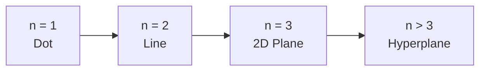
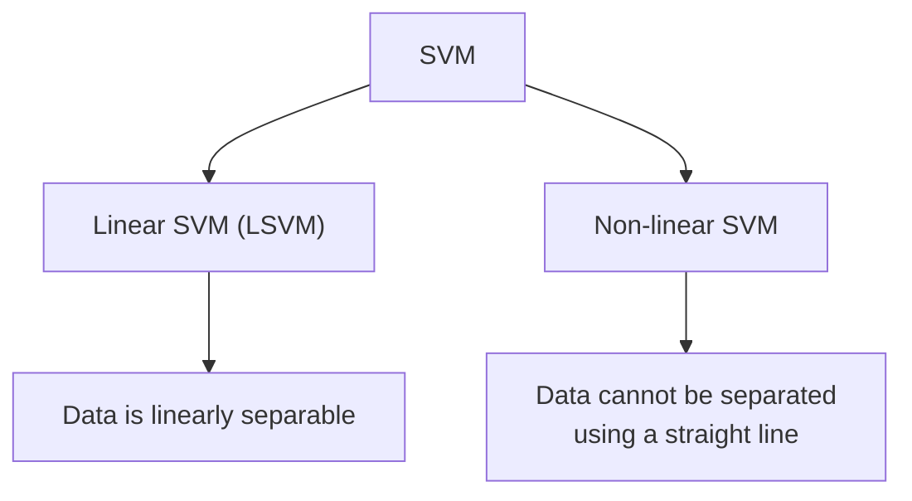
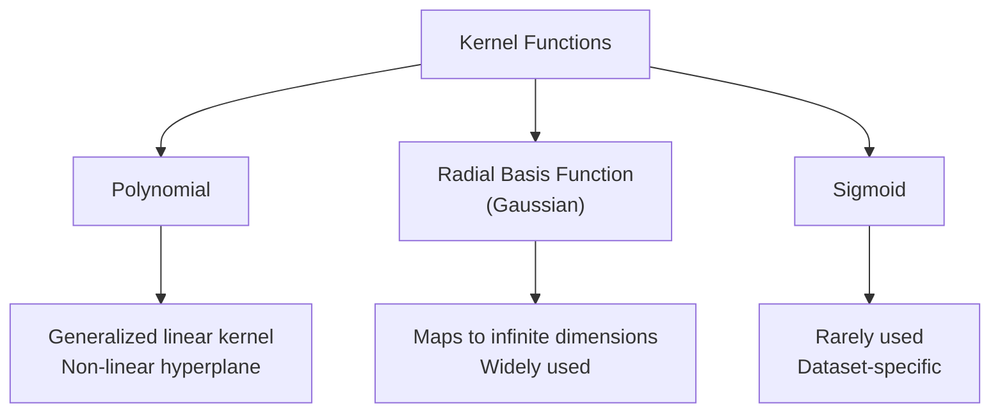
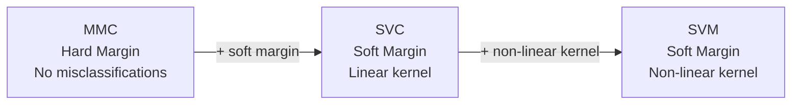
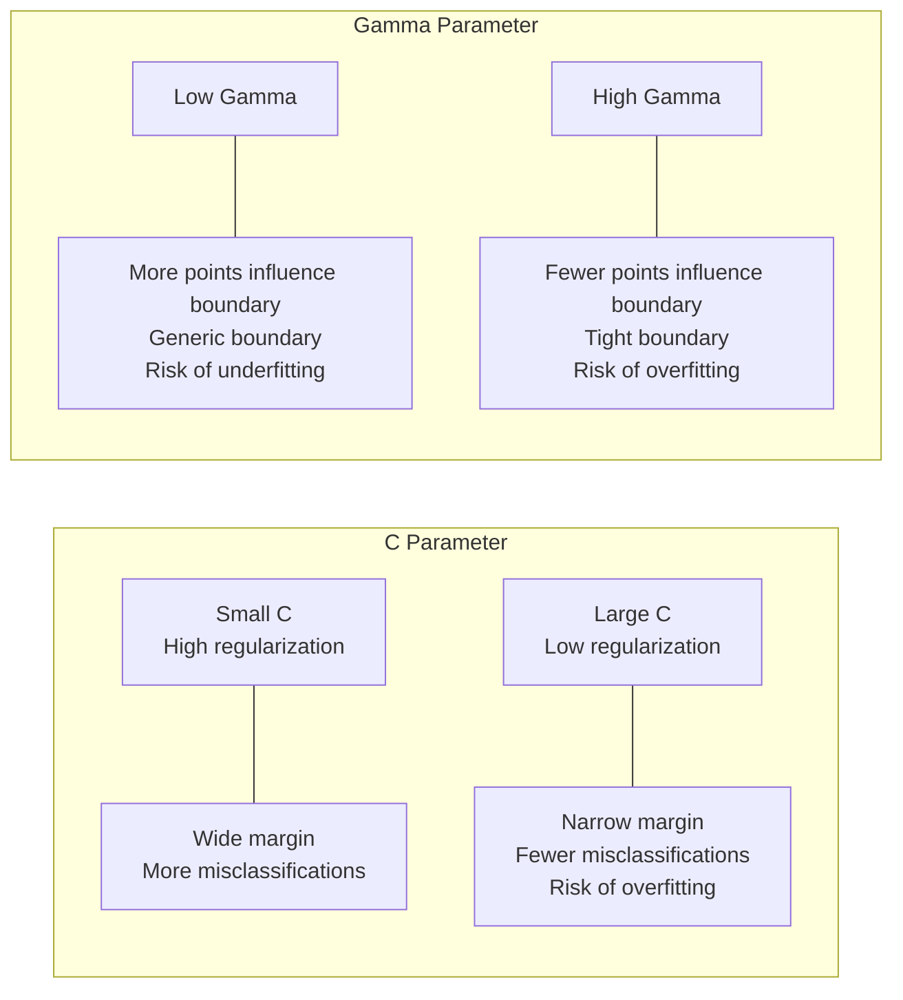

# CST8506 Advanced Machine Learning

## Week 2: Support Vector Machines

Professor: Dr. Anu Thomas
Email: thomasa@algonquincollege.com
Office: T315

---

## Linear Separators

Given a dataset with two classes (e.g., red and blue points on a 2D plane), a linear separator is a line (or hyperplane) that divides the data into two classes.

## Linear Separators -- which one is optimal?

Multiple linear separators can correctly classify the data, but the question is: which one is optimal?

## Classification Margin

The **classification margin** is the distance between the hyperplane and the vectors closest to the hyperplane (called **support vectors**).

The optimal separator is the one that **maximizes** the classification margin.

## Support Vectors

Vectors (data points) that:

- Are closer to the hyperplane
- Can influence the position and the orientation of the hyperplane

Using the support vectors, we maximize the classification margin.

---

## Support Vector Machine (SVM)

**Objective:** Find a hyperplane in an n-dimensional space (n is the number of features) that has the maximum margin (that can distinctly classify the instances).

- If n is 1, classifier will be a dot
- If n is 2, classifier will be a line
- If n is 3, classifier will be a 2D plane
- If n > 3, classifier will be a hyperplane in the n-dimensional space

SVM is a supervised algorithm that works best on small complex datasets.

SVM can be used for classification and regression tasks but generally used more for classification.

---

## Example -- How to predict for a new point?

Vector **w** is perpendicular to the green line (decision boundary).

The projection of any vector on another vector is called the **dot product**.

Vector **x** is projected on vector **w**:

- If **x** · **w** = c, then the point x lies *on* the line
- If **x** · **w** > c, then the point x lies on the *right* side of the line
- If **x** · **w** < c, then the point x lies on the *left* side of the line

For **positive samples**, **x** · **w** > c, so **x** · **w** - c > 0.

Set b = -c, then **x** · **w** + b > 0.

$$
y = \begin{cases} +1 & \text{if } w \cdot x + b \geq 0 \\ -1 & \text{if } w \cdot x + b < 0 \end{cases}
$$

---

## Optimization Function and its Constraints

We need to find a **w** and **b** for the hyperplane $w \cdot x + b = 0$ such that the margin *d* is maximum.

$$
y = \begin{cases} +1 & \text{if } w \cdot x + b \geq 0 \\ -1 & \text{if } w \cdot x + b < 0 \end{cases}
$$

Let $L_1$ be $w \cdot x + b = -1$

Let $L_2$ be $w \cdot x + b = 1$

Let's consider blue points as +1 and red points as -1.

- For red points: $w \cdot x + b \geq 1$
- For blue points: $w \cdot x + b \leq -1$

Combined constraint:

$$y_i(w \cdot x + b) \geq 1$$

where $y_i = 1$ for red and $-1$ for blue.

---

## Distance between two hyperplanes

Distance between two parallel hyperplanes $w \cdot x + b = c$ and $w \cdot x + b = -c$ is:

$$d = \frac{|c_2 - c_1|}{\|w\|}$$

where $\|w\|$ is the Euclidean norm of the weight vector w.

Euclidean norm measures the "length" or "magnitude" of a vector in Euclidean space:

$$\|w\| = \sqrt{w_1^2 + w_2^2 + w_3^2 + \cdots + w_n^2}$$

Distance between $w \cdot x + b = 1$ and $w \cdot x + b = -1$ is $\frac{2}{\|w\|}$.

---

## Optimization Function and its Constraints (Contd.)

The goal when training an SVM is:

- **Maximize** $\frac{2}{\|w\|}$
- **Subject to the constraint** $y_i(w \cdot x + b) \geq 1$

Maximize $\frac{2}{\|w\|}$ means **minimize** $\|w\|$.

In this, we are not allowing any misclassifications -- **hard margin**. This method is called **Maximum Margin Classifier (MMC)**.

---

## Types of SVM

- **Linear SVM (LSVM)** -- when the data is linearly separable
- **Non-linear SVM** -- data cannot be separated into 2 classes using a straight line

---

## Non-linear & Inseparable Classes

When the data is not separable, we cannot separate them with linear classifiers.

We need to use **soft-margin** instead of hard margin -- by allowing a few misclassifications. This method is called **Support Vector Classifier (SVC)**.

When the data is not separable in the original space (e.g., one class surrounds the other), we need to transform the low-dimensional data into a higher dimensional space, but this is computationally expensive. We can achieve similar results using **kernels**.

---

## Kernel

A **kernel** is a function that quantifies the similarities between observations by summarizing the relationship between every instance in the dataset. This will transform data into higher dimensions without going into higher dimensions by computing dot products in a high-dimensional feature space without explicitly mapping the data to that space.

Types of kernels:

1. **Polynomial**: generalized form of linear kernel. Useful for non-linear hyperplane.
2. **Radial Basis Function (Gaussian)**: can map an input space to infinite dimensional space (widely used).
3. **Sigmoid**: rarely used, sometimes works for specific datasets.

---

## Example: Linear kernel vs RBF kernel

Comparison of train sets with support vectors using LDA-Linear vs LDA-RBF shows that RBF kernel can capture more complex, non-linear decision boundaries compared to the linear kernel.

## Example: Linear vs Polynomial kernel

Comparison of train sets with support vectors using LDA-Linear vs LDA-Polynomial vs LDA-RBF shows that polynomial and RBF kernels produce different support vector distributions and decision boundaries compared to linear.

---

## MMC vs SVC vs SVM

- **Maximum Margin Classifier (MMC)** -- with hard margin
- **Support Vector Classifier (SVC)** -- with soft margin and linear kernel
- **Support Vector Machine (SVM)** -- SVC + non-linear kernel

---

## Other Important Parameters for SVM

### C (Regularization Parameter)

C is inversely proportional to the regularization parameter. It represents the acceptable amount of misclassification or error.

- A **smaller C value** (high regularization) creates a wider margin hyperplane, allows more misclassifications (large margin - high misclassifications)
- A **larger C value** creates a small-margin hyperplane (forcing the algorithm to classify every training point correctly). Larger value of C can cause **overfitting**.

### Gamma

Gamma is a factor that controls how the model fits on the training data.

- **Lower value**: loosely fits the train data, more data points will influence the decision boundary. So, decision boundary will be more generic (may cause **underfitting**).
- **Higher value**: fewer data points will influence the decision boundary. So, this may cause **overfitting**.

---

## Advantages & Disadvantages

### Advantages

- High accuracy, faster prediction
- Memory efficient
- Works well if the dataset is small, separable
- Effective in high-dimensional space
- Effective when number of dimensions greater than the number of instances
- Variety of kernel functions

### Disadvantages

- Not suitable for larger datasets
- Poor performance on overlapping classes
- Highly sensitive to the type of kernel

---

## References

- https://towardsdatascience.com/support-vector-machine-introduction-to-machine-learning-algorithms-934a444fca47
- https://www.analyticsvidhya.com/blog/2021/10/support-vector-machinesvm-a-complete-guide-for-beginners/
- https://towardsdatascience.com/hyperparameter-tuning-for-support-vector-machines-c-and-gamma-parameters-6a5097416167/
- https://www.geeksforgeeks.org/machine-learning/gamma-parameter-in-svm/
