```mermaid
flowchart LR
    A["6×6 Image"] -- "✱ convolve" --> B["3×3 Filter"]
    B --> C["4×4 Output"]
```

```mermaid
flowchart LR
    IN["4×4 Input"] --> MAX["Max-Pooling\nf=2, s=2"]
    IN --> AVG["Avg-Pooling\nf=2, s=2"]
    MAX --> MO["2×2 Output\n(max values)"]
    AVG --> AO["2×2 Output\n(avg values)"]
```

# CST8506 Advanced Machine Learning

## Week 3 - Neural Networks

**Professor:** Dr. Anu Thomas
**Email:** thomasa@algonquincollege.com
**Office:** T315

---

## Agenda

- Recap on
  - ANN
  - Perceptron, MLP
- CNN

---

## Single-layer Perceptron Network

A single-layer perceptron takes multiple inputs (x₁, x₂, x₃, ..., xₘ), each multiplied by a corresponding weight (w₁, w₂, w₃, ..., wₘ), and computes a weighted sum plus bias:

$$\sum_{i=1}^{m}(w_i x_i) + bias$$

The result is passed through an activation function:

$$f(x) = \begin{cases} 1 & \text{if } \sum w_i x_i + b \geq 0 \\ 0 & \text{if } \sum w_i x_i + b < 0 \end{cases}$$

This produces the output ŷ.

**Components:** Inputs → Weights → Summation and Bias → Activation → Output

```mermaid
flowchart LR
    x1["x₁"] -- "w₁" --> S["Σ(wᵢxᵢ) + bias"]
    x2["x₂"] -- "w₂" --> S
    x3["x₃"] -- "w₃" --> S
    xm["xₘ"] -- "wₘ" --> S
    S --> F["f(x)\nActivation"]
    F --> Y["ŷ\nOutput"]
```



---

## Activation Functions

Sometimes, activation function is as simple as:

$$Output = \begin{cases} 1 & \text{if } \sum w_i x_i + b \geq 0 \\ 0 & \text{if } \sum w_i x_i + b < 0 \end{cases}$$

Most commonly used activation function is the **Sigmoid function**:

$$\sigma(z) = \frac{1}{1 + e^{-z}}$$

where z = Σwᵢxᵢ + bias

The sigmoid function produces an S-shaped curve mapping values between 0 and 1, with σ(0) = 0.5.

---

## Activation Functions (continued)

- **Sigmoid**
  - f(x) = 1 / (1 + e⁻ˣ)
  - Maps values between 0 and 1, often used in binary classification

- **Tanh**
  - f(x) = (eˣ - e⁻ˣ) / (eˣ + e⁻ˣ)
  - Maps values between -1 and 1, often used in hidden layers

- **ReLU (Rectified Linear Unit)**
  - f(x) = max(0, x)
  - Only outputs positive values

- **Softmax**
  - Used in multi-class classification, it outputs probabilities summing up to 1

---

## Multi-layer Perceptron

A deep neural network consists of an **input layer**, **multiple hidden layers**, and an **output layer**, with all nodes fully connected between layers.

```mermaid
flowchart LR
    subgraph Input["Input Layer"]
        i1((x₁))
        i2((x₂))
        i3((x₃))
    end
    subgraph H1["Hidden Layer 1"]
        h1((h₁))
        h2((h₂))
        h3((h₃))
        h4((h₄))
        h5((h₅))
    end
    subgraph H2["Hidden Layer 2"]
        h6((h₆))
        h7((h₇))
        h8((h₈))
    end
    subgraph Output["Output Layer"]
        o1((ŷ))
    end
    i1 --> h1 & h2 & h3 & h4 & h5
    i2 --> h1 & h2 & h3 & h4 & h5
    i3 --> h1 & h2 & h3 & h4 & h5
    h1 --> h6 & h7 & h8
    h2 --> h6 & h7 & h8
    h3 --> h6 & h7 & h8
    h4 --> h6 & h7 & h8
    h5 --> h6 & h7 & h8
    h6 --> o1
    h7 --> o1
    h8 --> o1
```



**Some of the parameters:**

- `hidden_layer_sizes`: specify the number of layers and the number of nodes in each layer.
  - `hidden_layer_sizes=(5,3)` means we have 2 hidden layers, first one with 5 nodes and second one with 3 nodes.
- `activation`: activation function

Check [sklearn.neural_network.MLPClassifier](https://scikit-learn.org/stable/modules/generated/sklearn.neural_network.MLPClassifier.html) to see all parameters.

---

## Types of Neural Networks

- **Perceptron**
  - Single neuron
  - Single layer perceptron can only learn linearly separable problems

- **Multi-layer Perceptron**
  - Input layer, one or more hidden layers, output layer
  - Feed-forward NN
    - Data flows only in one direction, without any feedback loops or recurrent connections.
  - Uses back propagation for training
    - Repeatedly adjust the weights to minimize the difference between actual output and the desired output

- **Convolutional NN**
  - Utilized for computer vision etc.

- **Recurrent NN**
  - For text processing

---

## Convolutional Neural Networks

Why we need it?

---

## Example - Iris vs Rose

Images of irises and roses are fed into a deep neural network (input layer → multiple hidden layers → output layer) to classify the flower as either **Iris** or **Rose**.


---

## Machine Learning vs Deep Learning - Example

**Machine Learning model:**
Image → Feature Extraction → Classification → Output: Cat/Not Cat

**Deep Learning model:**
Image → Deep Neural Network (feature extraction and classification combined) → Output: Cat/Not Cat

The key difference is that in traditional ML, feature extraction is a separate manual step, while deep learning learns features automatically.


---

## Image Classification

High number of inputs (for example, if the picture is 1600 x 1200, then 1600 × 1200 × 3 = 5,760,000 inputs - 5 million inputs)

If we have 1000 nodes in the first layer, then we will have 5 million × 1000 weights, which is 5 billion weights.

High computational and memory requirements.

Can we use MLP for this problem? **NO**

**Solution: Convolutional Neural Network**

---

## Sample Problems to Solve in Vision

- **Image classification**
  - Take an input picture, classify it as a cat or not

- **Object Detection**
  - For self-driving cars, find objects around

---

## Convolutional Neural Network

- Feed forward NN
- Generally used to analyze images
- Done by processing images in the form of arrays of pixel values

Example: A real image of the digit "8" is represented in the form of an array, then converted to a matrix of pixel values (0s and 1s):

```
0 0 1 1 0 0
0 1 0 0 1 0
0 0 1 1 0 0
0 1 0 0 1 0
0 0 1 1 0 0
```


---

## Convolutional Neural Network - Architecture

A CNN architecture for digit recognition (e.g., handwritten digit "2"):

1. **INPUT** (28 x 28 x 1)
2. **Conv_1** - Convolution (5 x 5 kernel, *valid* padding) → n1 channels (24 x 24 x n1)
3. **Max-Pooling** (2 x 2) → (12 x 12 x n1)
4. **Conv_2** - Convolution (5 x 5 kernel, *valid* padding) → n2 channels (8 x 8 x n2)
5. **Max-Pooling** (2 x 2) → (4 x 4 x n2)
6. **Flattened** → n3 units
7. **fc_3** - Fully-Connected Neural Network (ReLU activation)
8. **fc_4** - Fully-Connected Neural Network (with dropout)
9. **OUTPUT** → digits 0-9


---

## Convolutional Neural Network - Objective

**Objective:** Reduce the images into a form that is easier to process, without losing critical features that helps in prediction.

### Terminologies

- Convolution
- Filter
- Padding (Valid or Same)
- Stride
- Pooling (Max-pooling or average-pooling)

---

## Edge Detection

Edge filters can be applied to images to detect edges:

- **Original picture** of a cat
- **Basic edge filters applied to the greyscale image** of cat (highlights edges in white on black)
- **Basic edge filters applied to the RGB image** of cat (highlights edges with color information preserved)

Based on the variation in light intensity at different parts of the image, we should be able to find:
- Vertical edges
- Horizontal edges
- Edges at different angles

These edges give us important information!

---

## Convolution

Convolve the image matrix with a filter, which is another matrix.

**Example:** 6x6 image convolved with a 3x3 filter:

6x6 image:

```
0  3  4  4  3  0
0  4  5  5  3  0
0  0  2  2  0  0
0  3  5  5  4  0
1  4  5  5  4  1
2  4  4  5  5  0
```

3x3 filter:

```
 1  0  -1
 1  0  -1
 1  0  -1
```

The convolution operation slides the filter across the image. For the first position (top-left 3x3 region):

(0×1) + (3×0) + (4×-1) + (0×1) + (4×0) + (5×-1) + (0×1) + (0×0) + (2×-1) = **-11**

For the second position (shifted one column right):

(3×1) + (4×0) + (4×-1) + (4×1) + (5×0) + (5×-1) + (0×1) + (2×0) + (2×-1) = **-4**

Output image is reduced to **4x4**:

```
-11  -4  ...  ...
...  ...  ...  ...
...  ...  ...  ...
...  ...  ...  ...
```



---

## Edge Detection Filters

| Vertical | Horizontal | Sobel | Scharr |
|----------|-----------|-------|--------|
| `1  0 -1` | ` 1  1  1` | `1  0 -1` | ` 3  0  -3` |
| `1  0 -1` | ` 0  0  0` | `2  0 -2` | `10  0 -10` |
| `1  0 -1` | `-1 -1 -1` | `1  0 -1` | ` 3  0  -3` |

Can we have our own filters?

Yes, we can consider this filter as a parameter and learn them!

---

## Output of Convolution with Filters

An **n x n** image convolved with an **f x f** filter produces an output of size:

**(n - f + 1) x (n - f + 1)**

f is conventionally an odd number.

```mermaid
flowchart LR
    A["n × n\nImage"] -- "✱ convolve" --> B["f × f\nFilter"]
    B --> C["(n-f+1) × (n-f+1)\nOutput"]
```



---

## Padding

- Refers to the number of pixels added to an image
- Padding is added to the frame of the image to give more space for the filter to cover the image. Once padding is added, previous end pixels will be part of multiple 3x3 matrices.
- This is a process to make sure the size of the output is not less than that of the input (if we have a 6x6 image convoluted with a 3x3 filter, output will be 4x4. If we add one layer of padding around the picture, output for a 6x6 image will be another 6x6 image).

### Padding - Example

An 8x8 image (6x6 original + 1 pixel padding on each side) convolved with a 3x3 filter produces a 6x6 output.

**Output size with padding:** (n + 2p - f + 1) x (n + 2p - f + 1)

```mermaid
flowchart LR
    A["6×6 Image\n+ 1px padding\n= 8×8"] -- "✱ convolve" --> B["3×3\nFilter"]
    B --> C["6×6\nOutput"]
```



---

## Valid vs Same Padding

- **Valid**: No padding
  - n x n image filtered with f x f filter gives (n - f + 1) x (n - f + 1) image

- **Same**: Add padding such that output size should be the same as input size
  - n + 2p - f + 1 = n
  - p = (f - 1) / 2

---

## Strided Convolution

**Example with stride = 2:**

7x7 image:

```
4  3  5  7  6  5  3
7  7  8  9  8  7  6
4  3  7  8  6  4  3
6  7  8  5  6  2  3
2  3  4  7  5  4  1
0  2  3  1  5  7  2
0  0  2  4  3  1  0
```

3x3 filter:

```
 2  3  3
 1  0  1
-1  0  2
```

First position (top-left):
(4×2)+(3×3)+(5×3)+(7×1)+(7×0)+(8×1)+(4×-1)+(3×0)+(7×2) = **57**

Second position (stride 2 to the right):
(5×2)+(7×3)+(6×3)+(8×1)+(9×0)+(8×1)+(7×-1)+(8×0)+(6×2) = **70**

Third position:
(6×2)+(5×3)+(3×3)+(8×1)+(7×0)+(6×1)+(6×-1)+(4×0)+(3×2) = **50**

Output (3x3):

```
57  70  50
...  ...  ...
...  ...  ...
```

**General formula:** An n x n image convolved with an f x f filter, with padding p and stride s, output will be:

$$\left\lfloor \frac{n + 2p - f}{s} + 1 \right\rfloor \times \left\lfloor \frac{n + 2p - f}{s} + 1 \right\rfloor$$

---

## Convolutions on RGB Images

For an RGB image, the input has 3 channels (R, G, B).

- Input: **6 x 6 x 3** (height x width x #channels)
- Filter: **3 x 3 x 3** (filter must match the number of channels)
- Output: **4 x 4** (single channel)

Note: Can have one or more filters.

```mermaid
flowchart LR
    A["6×6×3\nRGB Image"] -- "✱ convolve" --> B["3×3×3\nFilter"]
    B --> C["4×4\nOutput"]
```



---

## One Layer of a CNN

For a 6x6x3 input image with 2 filters:

1. **Filter 1** (3x3x3) convolves with input → 4x4 output (C₁), then apply activation: A(C₁ + b₁) → 4x4
2. **Filter 2** (3x3x3) convolves with input → 4x4 output (C₂), then apply activation: A(C₂ + b₂) → 4x4
3. Stack the two 4x4 outputs → **4 x 4 x 2**

In this example, we have 2 filters. We can have more!

```mermaid
flowchart LR
    IN["6×6×3\nInput"] --> F1["Filter 1\n3×3×3"]
    IN --> F2["Filter 2\n3×3×3"]
    F1 --> C1["C₁ + b₁"] --> A1["A(C₁+b₁)\n4×4"]
    F2 --> C2["C₂ + b₂"] --> A2["A(C₂+b₂)\n4×4"]
    A1 --> S["Stack\n4×4×2"]
    A2 --> S
```



---

## Example - Full CNN Pipeline

Input: 24 x 24 x 3 cat image

| Layer | Filter | Stride | Padding | #Filters | Output |
|-------|--------|--------|---------|----------|--------|
| Conv1 | 3x3 | 1 | 0 | 10 | 22 x 22 x 10 |
| Conv2 | 5x5 | 2 | 0 | 20 | 9 x 9 x 20 |
| Conv3 | 5x5 | 2 | 0 | 40 | 3 x 3 x 40 |

Then flatten → MLP → Output: Cat (Y/N)

24 × 24 × 3 = **1728** inputs reduced to 3 × 3 × 40 = **360**

```mermaid
flowchart LR
    IN["Cat Image\n24×24×3"] --> C1["Conv1\n3×3, s=1\n22×22×10"]
    C1 --> C2["Conv2\n5×5, s=2\n9×9×20"]
    C2 --> C3["Conv3\n5×5, s=2\n3×3×40"]
    C3 --> FL["Flatten\n360"]
    FL --> MLP["MLP"]
    MLP --> OUT["Output:\nCat Y/N"]
```



---

## Types of Layers in a CNN

- Convolution
- Pooling
- Fully Connected

---

## Pooling Layers

**Example** (4x4 input, f=2, stride=2):

Input:

```
9  3  1  2
4  8  5  8
3  2  4  2
1  2  1  5
```

**Max-pooling:** Take the maximum value from each 2x2 region:

```
9  8
3  5
```

**Average-pooling:** Take the average value from each 2x2 region:

```
6  4
2  3
```



---

## Benefits of Pooling

- Reduces dimensions and computation
- Reduces overfitting as there are less parameters
- Makes the model tolerant towards small variations and distortions
- Filters all important features and filters out noise

---

## Example with Convolution, Pooling, and Fully-Connected Layers

Input: 32 x 32 x 3 (image of digit "7")

| Stage | Operation | Parameters | Output |
|-------|-----------|-----------|--------|
| Conv1 | Convolution | f=5, s=1, #f=6 | 28 x 28 x 6 |
| Pool1 | MaxPool | f=2, s=2 | 14 x 14 x 6 |
| Conv2 | Convolution | f=5, s=1, #f=16 | 10 x 10 x 16 |
| Pool2 | MaxPool | f=2, s=2 | 5 x 5 x 16 |
| Flatten | - | - | 400 x 1 |
| FC3 | Fully Connected | - | 120 |
| FC4 | Fully Connected | - | 84 |
| Output | MLP etc. | - | 10 outputs (0,1,...,9) |

```mermaid
flowchart LR
    IN["Input\n32×32×3"] --> C1["Conv1\nf=5, s=1\n28×28×6"]
    C1 --> P1["Pool1\nf=2, s=2\n14×14×6"]
    P1 --> C2["Conv2\nf=5, s=1\n10×10×16"]
    C2 --> P2["Pool2\nf=2, s=2\n5×5×16"]
    P2 --> FL["Flatten\n400×1"]
    FL --> FC3["FC3\n120"]
    FC3 --> FC4["FC4\n84"]
    FC4 --> OUT["Output\n10 (0-9)"]
```



---

## Convolution Operation - Summary

- Objective is to extract high-level features like edges from the input image
- Can have multiple convolution layers
- Conventionally, first ConvLayer captures low level features like edges, color, gradient orientation etc.
- Reduce the size without losing relevant information
- Once it is reduced, the output matrix will be flattened and feed it to some classifiers like MLP

---

## References

- https://towardsdatascience.com/a-comprehensive-guide-to-convolutional-neural-networks-the-eli5-way-3bd2b1164a53
- https://medium.com/swlh/convolutional-neural-networks-22764af1c42a
- https://austingwalters.com/edge-detection-in-computer-vision/
- https://www.geeksforgeeks.org/machine-learning/activation-functions-neural-networks/
