# CST8506 -- Advanced Machine Learning

## Week 4: Recurrent Neural Networks (RNNs)

**Dr. Abbas Akkasi**
**Winter 2025**

---

## Today's Agenda

- FNN -- Review
- Motivation
- Usages of Sequential Data
- Time Series
- Time Series -- Components
- Recurrent Neural Networks (RNNs)
- Backpropagation Refresher
- Backpropagation Through Time (BTT)
- Vanishing Gradient Problem
- Long-Short Term Memory

---

## Review on Feed Forward Network

- Information flows only in the **forward direction**. No **cycles or Loops**.
- Decisions are based on current input, **no memory** about the past
- Doesn't know how to handle **sequential data**

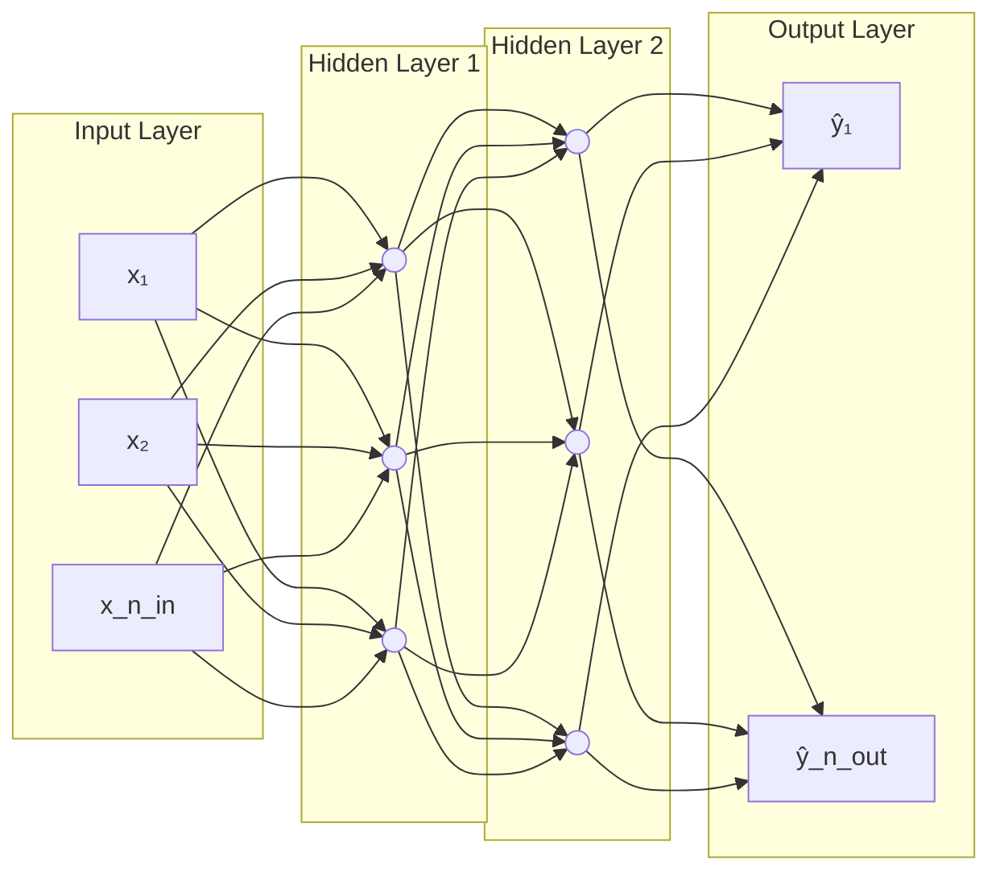

> Data flows strictly left to right with no feedback connections.

---

## Motivation

**Questions:**

- How Google's autocomplete feature predicts the next word when a user is typing?
- How Translators converting sentences from English to French?
- How Siri or Google Assistant converting spoken words into text?
- How AI composes melodies or generates background music?
- How it is possible to predict the future prices based on historical trends?
- Etc.

---

## Motivation ...

We need a model:

- To handle sequential data.
- Able to consider the **current input** also the **previously received** inputs.
- Able to memorize history in its internal memory.

FFNs cannot process the sequential data!

What is the solution?

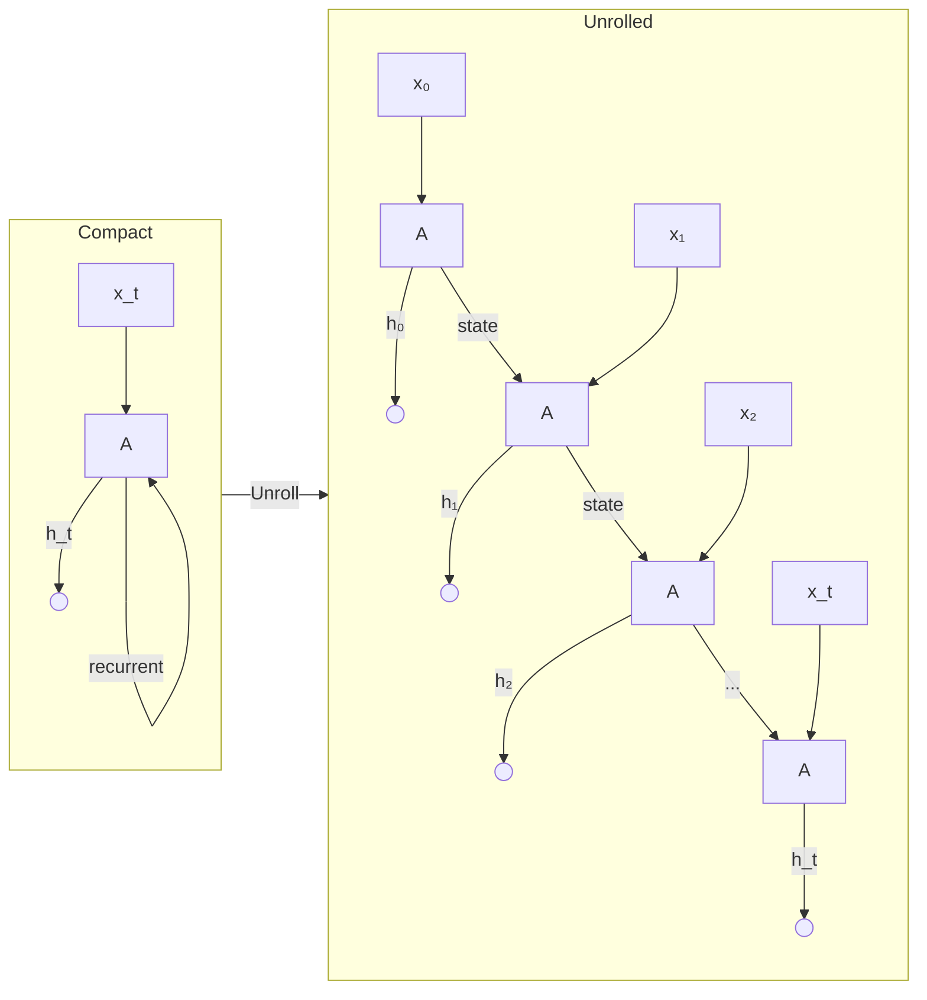

---

## Usages of Sequence Data - Examples

- Speech recognition (audio clip to text)
- Sentiment analysis (sequence of text to number of stars)
- DNA Sequence analysis
- Machine translation (sequence of text in one language translated to another)
- Video activity recognition (detect the activity from a sequence of video frames)
- **Time Series Forecasting**

---

## Time Series

- A **Time Series** is a sequence of data points collected or recorded at specific time intervals.
- Unlike standard "cross-sectional" data (where you look at a snapshot of many things at once), time series focuses on **one(more) thing over a duration.**
  - **The X-Axis:** Almost always represents time (seconds, days, years).
  - **The Y-Axis:** The variable you are measuring (Price, Temperature, Population).
  - **The Goal:** To understand the past and, ideally, peer into the future (Forecasting).

---

## Time Series - Example

- Air Passengers
- Non-stationary data
  - Mean & sd changes with time
- Seasonal data
- Data from Jan 1949-Dec 1960

> **Chart:** A line chart showing monthly airline passenger counts from 1949 to 1960. The data exhibits a clear upward trend (from ~100 to ~600 passengers) and strong seasonal patterns with regular peaks and troughs repeating each year, with increasing amplitude over time.

Source: https://www.kaggle.com/datasets/rakannimer/air-passengers

---

## Time Series -- Components

1. **Trend:** The long-term "direction." Is it generally going up, down, or staying flat?
2. **Seasonal:** Patterns that repeat over a fixed period (e.g., retail sales spiking every December).
3. **Cycle:** A cycle is a long-term fluctuation in a time series that repeats, but NOT at a fixed, regular interval.
4. **Noise (Residuals):** The random "hiccups" in the data that can't be explained by the other three.

---

## Time Series -- Components (Visualized)

> **Charts:** The Air Passengers time series decomposed into four sub-plots:
>
> 1. **Original plot** -- the raw data showing the full signal with trend, seasonality, and noise combined (1950-1960).
> 2. **Trend** -- a smooth, steadily increasing curve from ~100 to ~400, showing the long-term upward direction.
> 3. **Seasonal** -- a repeating wave pattern oscillating between roughly -50 and +50, capturing the yearly cyclical pattern.
> 4. **Residual** -- irregular fluctuations around zero representing the random noise left after removing trend and seasonality.

---

## Recurrent Neural Networks (RNNs)

- RNNs are kind of DL models that takes the **previous output or hidden states** as inputs. i.e. the **composite input** at time *t* has some historical information about the happenings at time T < *t*.
- RNNs are useful as their **intermediate states** can store information about **past inputs** for a time that is not fixed.
- In RNNs, each input vector (e.g. word vector) is typically fed into the network **one at a time**, not all at once.

---

## RNNs -- FFNs vs RNNs

**FFN:**

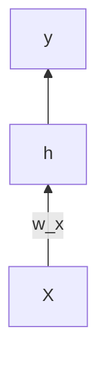

**RNN (unrolled across 3 time steps):**

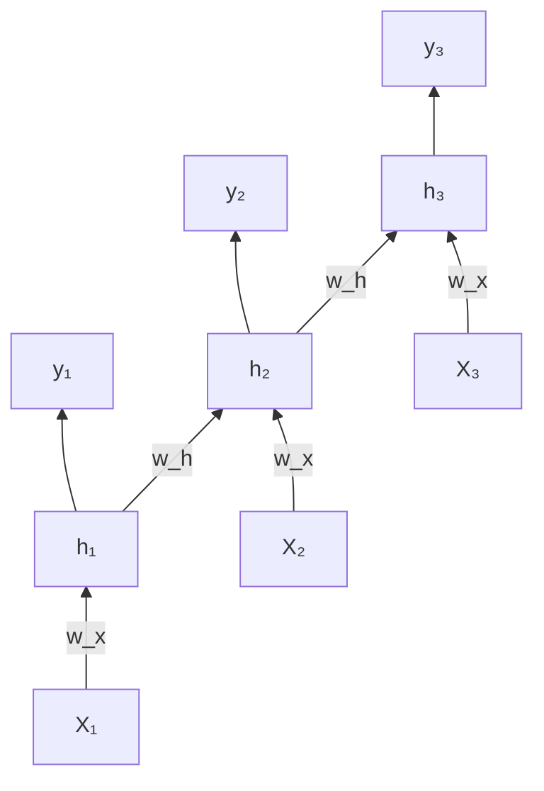

> Each hidden state h_t is passed (via weight w_h) to the next time step. This recurrent connection allows information to flow across time.

---

## RNNs -- Formulation

**h_t = f(W_x * x_t + W_y * h_{t-1})**

- *h_t*: hidden state at time step t
- *x_t*: input at time step t
- *W_x* and *W_y*: Weight matrices. Filters that determine the importance of the present input and past information.

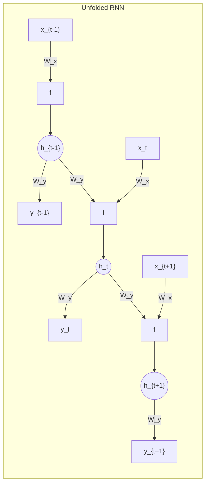

> The weights W_x and W_y are **shared over time copies**.

- Note that the weights are **shared over time copies**

---

## Example (Image Captioning)

**Problem:** Given an image, produce a sentence describing its contents

- **Inputs:** Image feature (from a CNN)
- **Outputs:** Multiple words

> **Image:** A photo of a golden retriever dog lying on the floor, peeking out from under a piece of furniture with a sad/cute expression. An arrow points to the generated caption: "The dog is hiding"

---

## Example (Image Captioning) -- Architecture

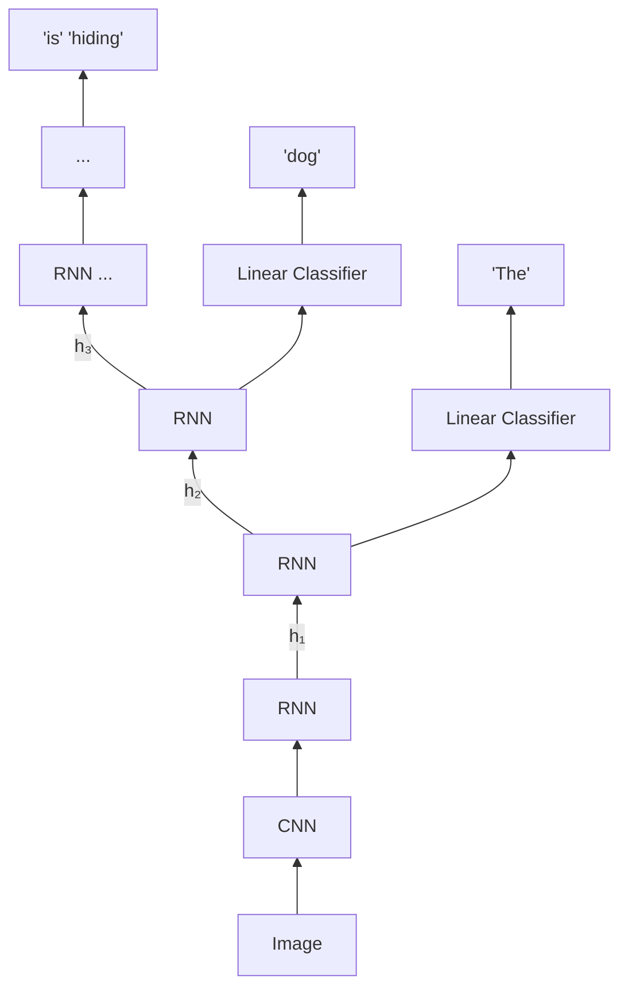

> The CNN extracts image features, which are fed into the first RNN cell. At each subsequent time step, the RNN produces a hidden state that is both (1) passed forward to the next step, and (2) fed through a Linear Classifier to output the next word. This generates the caption one word at a time: "The", "dog", "is", "hiding".

---

## Input-output Scenarios

| Scenario | Architecture | Example |
|---|---|---|
| Single - Single | One input, one output (standard box) | Feed-forward Network |
| Single - Multiple | One input, sequence of outputs | Image Captioning |
| Multiple - Single | Sequence of inputs, one output | Sentiment Classification |
| Multiple - Multiple | Sequence of inputs, sequence of outputs | Translation |
| (Synced) Multiple - Multiple | Synchronized input-output at each step | Video Captioning |

---

## Loss Functions

- Method to evaluate how well an algorithm models the given data
- Quantifies the error between the output and the target
- Also known as cost function or error function
  - Regression Losses
  - Probabilistic Losses
  - Hinge Losses for maximum-margin classification
- Reference: https://keras.io/api/losses/

---

## Regression Loss Functions

- **Mean Square Error (MSE) / Quadratic Loss / L2 Loss**
  - Average of the sum of the squared differences between actual value and the predicted value

- **Mean Absolute Error (MAE) / L1 Loss**
  - Average of the sum of the absolute differences between actual value and the predicted value
  - Robust to outliers since it does not make use of square

- **Mean Bias Error**
  - Average of the sum of the differences between actual value and the predicted value
  - Positive and negative values may cancel out -- less accurate in practice
  - Can be used to see whether model has positive or negative bias

---

## MSE & MAE -- Worked Example

> **Table:** A worked example using the linear model w = -266.5344 + 6.1376h, showing 10 data points with columns for x, y_i (actual), y_i' (predicted), prediction error (y_i - y_i'), and squared error (y_i - y_i')^2. The table also shows:
>
> | Metric | Value |
> |---|---|
> | Mean Absolute Error (MAE) | 5.92384 |
> | Root Mean Squared Error (RMSE) | 7.729077 |
> | Mean Square Error (MSE) | 59.73863 |
> | Total Squared Error | 597.38627 |

---

## Probabilistic Loss Functions

Used when a model predicts probabilities for different classes instead of class labels.

- **Cross Entropy** (also known as log loss): measure of the difference between two probability distributions (predicted vs actual).
  - Binary Cross Entropy (two classes -- 0 and 1 as class labels)
  - Categorical Cross Entropy (one-hot encoded class labels)
  - Sparse Categorical Cross Entropy (integers as class labels)

---

## Hinge Loss

- Primarily for classification tasks, especially with SVMs
- Helps maximizes the margin between different classes
- Loss is 0 when the correct class is confidently predicted, but penalizes predictions that are too close to the decision boundary
- Requires labels to be -1 and +1 (instead of 0 and 1)
- For multi-class classification: Categorical Hinge Loss
- Can be used in NN

---

## Backpropagation Refresher

**Single Layer:**

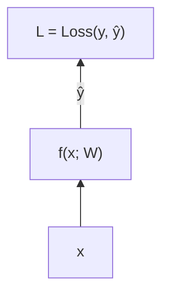

- ŷ = f(x; W)
- L = Loss(y, ŷ)
- **Gradient Descent:** W = W - alpha * (dL/dW)
- Chain rule: dL/dW = (dL/dŷ) * (dŷ/dW)

**Two Layers:**

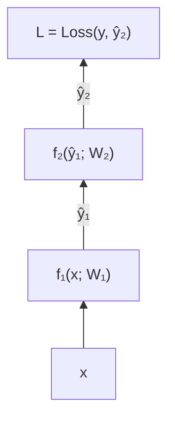

- ŷ₁ = f₁(x; W₁), ŷ₂ = f₂(ŷ₁; W₂), L = Loss(y, ŷ₂)
- **Gradient Descent:**
  - W₁ = W₁ - alpha * (dL/dW₁)
  - W₂ = W₂ - alpha * (dL/dW₂)
- For W₂: dL/dW₂ = (dL/dŷ₂) * (dŷ₂/dW₂)
- For W₁: dL/dW₁ = (dL/dŷ₂) * (dŷ₂/dŷ₁) * (dŷ₁/dW₁)

---

## Backpropagation Through Time (BPTT)

- In a normal neural network, we use **backpropagation** to update weights by calculating gradients layer by layer.
- In an RNN, the same weights are used at every time step, and the network is "unrolled" across time steps.
- **BPTT means we compute gradients across all these time steps and update the shared weights.**
- The **weight updates** are computed for **each copy** in the **unfolded network**, then **summed** (or averaged) and then applied to the RNN weights.

---

## BPTT -- Unfolded RNN - Forward

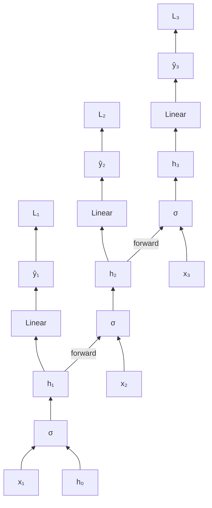

> At each time step, inputs x_t and previous hidden state h_{t-1} feed into an activation function, producing h_t. The hidden state passes through a linear layer to produce ŷ_t, from which loss L_t is computed. Hidden states flow forward: h₀ → h₁ → h₂ → h₃.

---

## BPTT -- Unfolded RNN - Backward

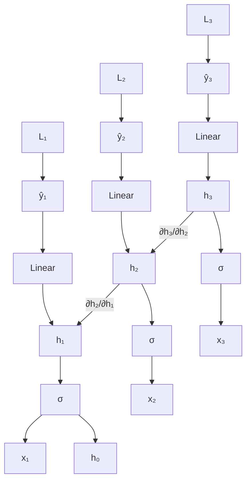

**Key equations:**

∂L_t / ∂h₁ = (∂L_t / ∂ŷ_t) * (∂ŷ_t / ∂h₁)

= (∂L_t / ∂ŷ_t) * (∂ŷ_t / ∂h_t) * (∂h_t / ∂h_{t-1}) * ... * (∂h₂ / ∂h₁)

> This chain of multiplications through time steps is what leads to the vanishing/exploding gradient problem.

---

## Problems with the Vanilla RNN

- In the same way a product of k real numbers can shrink to zero or explode to infinity, so can a product of matrices

- **Vanishing gradient causes:**
  - Gradients become extremely small as they propagate backward.
  - The first layers (or earliest time steps in RNN) receive almost no updates.
  - The network fails to learn long-term dependencies.

---

## Solutions to Avoid Vanishing Gradient Problem

1. **Use Gated Architectures (LSTM / GRU)**
2. **Gradient Clipping** - Prevents gradients from becoming too small or too large.
3. **Use Activation Functions Carefully** - functions like **ReLU** (instead of tanh or sigmoid) do not squash values as much
4. **Layer Normalization / Batch Normalization** - Normalizes activations to keep values in a stable range.
5. **Use Shorter Sequences** - Backpropagating through fewer time steps reduces gradient decay.

---

## Long Short Term Memory (LSTM)

- **Long Short Term Memory networks** -- usually just called "**LSTMs**" -- are a special kind of RNN, capable of learning **long-term dependencies**. *Hochreiter & Schmidhuber (1997)*

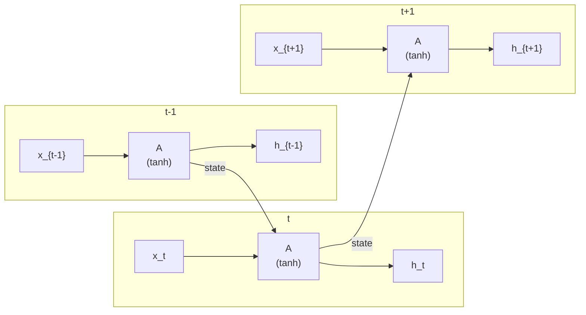

> A standard (vanilla) RNN: each module contains a single tanh layer. This is the simpler architecture that LSTMs improve upon.

---

## Long Short-Term Memory (LSTM) -- Architecture

The repeating module in a standard LSTM contains a single layer.

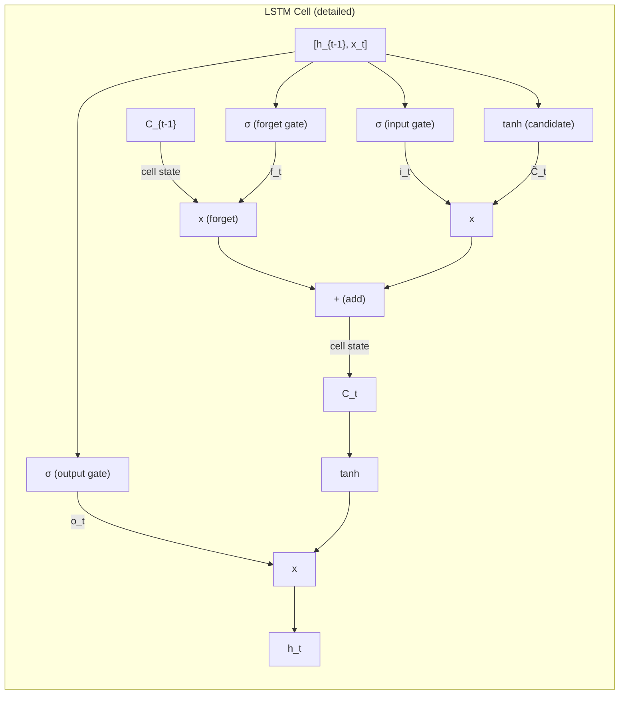

Unlike the simple RNN (single tanh), each LSTM module contains:
- **Four neural network layers:** three sigmoid (sigma) gates and one tanh layer
- **Two state lines:** the cell state C (horizontal line across the top) and the hidden state h
- **Pointwise operations:** multiplication (x) and addition (+) nodes

---

## Long Short-Term Memory (LSTM) -- Cell State & Gates

- The core idea behind LSTMs is the **cell state**.

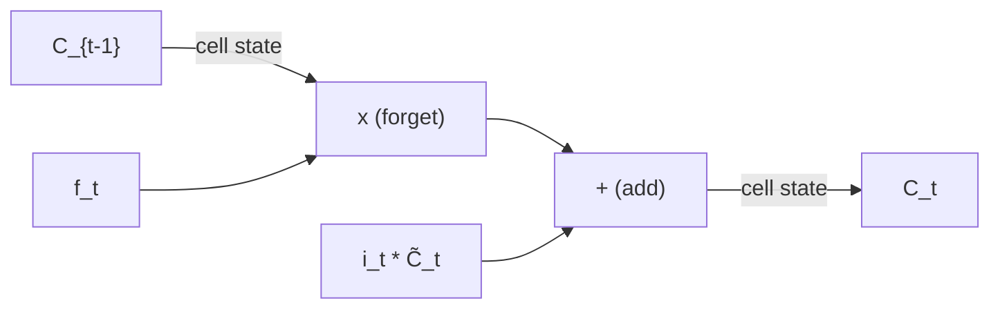

- The LSTM has the ability to **remove** or **add** information to the cell state: thanks to **gates**

**Gate structure:**

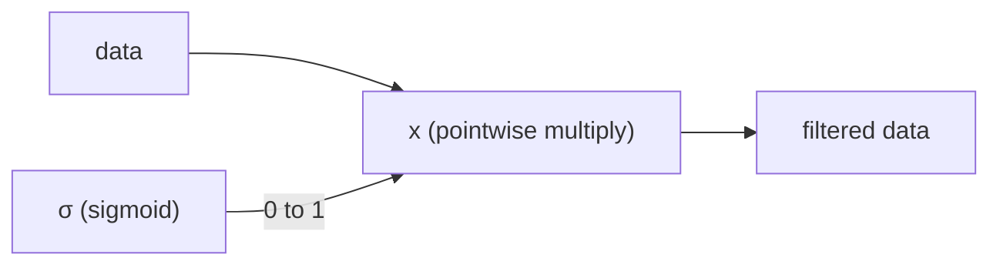

> The sigmoid outputs a value between 0 and 1, controlling how much information passes through.

- Gates are composed out of a sigmoid neural net layer and a pointwise multiplication operation

---

## LSTM Step-by-Step Walk Through

### Step 1: Forget Gate

Decide what information to **throw away** from the cell state, **forget layer**.

**f_t = sigma(W_f * [h_{t-1}, x_t] + b_f)**

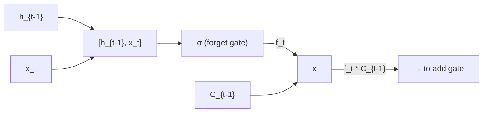

- **1** represents "completely keep this"
- **0** represents "completely get rid of this."

---

### Step 2: Input Gate

Decide what new information we're going to store in the cell state.

**i_t = sigma(W_i * [h_{t-1}, x_t] + b_i)**

**C_tilde_t = tanh(W_C * [h_{t-1}, x_t] + b_C)**

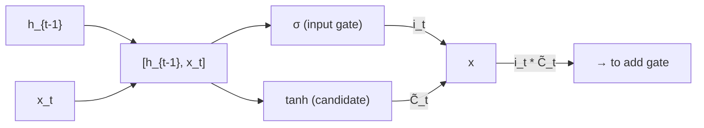

- **Input gate layer**: decides which values we will update
- **Tanh layer**: creates a vector of new candidate values

**Example**: "I grew up in France... I speak fluent *French*."

---

### Step 3: Update Cell State

**C_t = f_t * C_{t-1} + i_t * C_tilde_t**

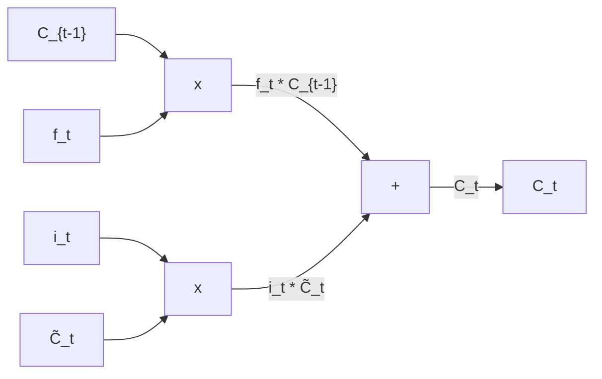

**Example**: "I grew up in France... I speak fluent *French*."

---

### Step 4: Output Gate

Decide what is the output.

**o_t = sigma(W_o * [h_{t-1}, x_t] + b_o)**

**h_t = o_t * tanh(C_t)**

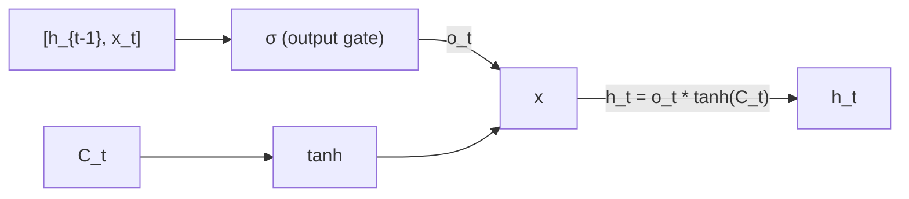

**Example**: "I grew up in France... I speak fluent *French*."

---

## Summary

- FNN -- Review
- Motivation
- Usages of Sequential Data
- Time Series
- Time Series -- Components
- Recurrent Neural Networks (RNNs)
- Backpropagation Refresher
- Backpropagation Through Time (BTT)
- Vanishing Gradient Problem
- Long-Short Term Memory

---

## Questions?
