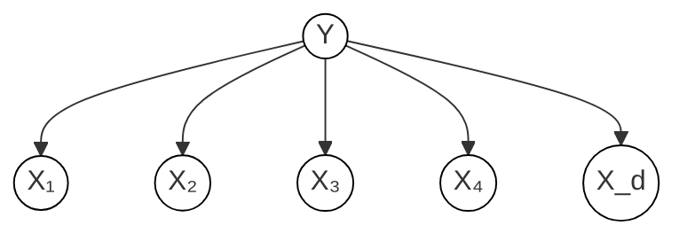
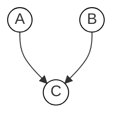
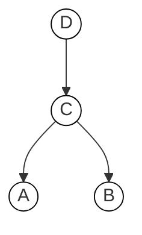
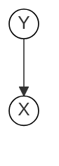
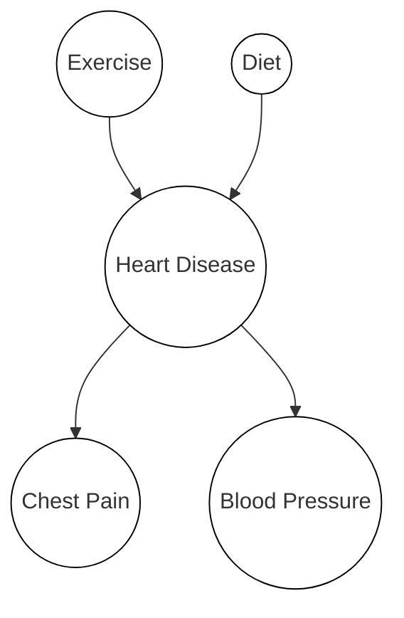

# CST8506 - Advanced Machine Learning

## Week 5: Bayesian Classifier - Naive Bayes

**Dr. Abbas Akkasi** | Winter 2026

> These slides are adapted from materials originally developed by Pang-Ning Tan on his Data Mining Course.

---

## Today's Agenda

- Naive Bayes Model
- Bayesian Belief Network

---

## Bayes Classifier

- A probabilistic framework for solving classification problems

### Conditional Probability

$$P(Y|X) = \frac{P(X, Y)}{P(X)}$$

$$P(X|Y) = \frac{P(X, Y)}{P(Y)}$$

### Bayes Theorem

$$P(Y \mid X) = \frac{P(X \mid Y) \cdot P(Y)}{P(X)}$$

Where:
- **P(Y|X)** = **Posterior** - probability of Y given X
- **P(Y)** = **Prior** - prior probability of Y
- **P(X|Y)** = Likelihood of X given Y
- **P(X)** = **Evidence** - total probability of X

---

## Example: Conditional Probability with Dice

When rolling 2 dice, for the given events A & B, find P(A|B).

- **A**: the sum of the two dice is 8
- **B**: first die shows a 5
- n(S) = 36

**Possible outcomes for A:** {(2,6), (3,5), (4,4), (5,3), (6,2)}

**Possible outcomes for B:** {(5,1), (5,2), (5,3), (5,4), (5,5), (5,6)}

- P(A) = 5/36
- P(B) = 6/36
- P(A $\cap$ B) = 1/36

A|B = first die shows 5, then out of 6 cases, only one possible case for the sum as 8: (5,3)

$$P(A|B) = \frac{P(A,B)}{P(B)} = \frac{P(A \cap B)}{P(B)} = \frac{1/36}{6/36} = \frac{1}{6}$$

---

## Using Bayes Theorem for Classification

- Consider each attribute and class label as random variables
- Given a record with attributes (X₁, X₂, ..., X_d), the **goal is to predict class Y**
  - Specifically, we want to find the value of Y that maximizes P(Y | X₁, X₂, ..., X_d)
- Can we estimate P(Y | X₁, X₂, ..., X_d) directly from data?

### Training Data (Tax Evasion Example)

| Tid | Refund | Marital Status | Taxable Income | Evade |
|-----|--------|---------------|----------------|-------|
| 1   | Yes    | Single        | 125K           | **No**    |
| 2   | No     | Married       | 100K           | **No**    |
| 3   | No     | Single        | 70K            | **No**    |
| 4   | Yes    | Married       | 120K           | **No**    |
| 5   | No     | Divorced      | 95K            | **Yes**   |
| 6   | No     | Married       | 60K            | **No**    |
| 7   | Yes    | Divorced      | 220K           | **No**    |
| 8   | No     | Single        | 85K            | **Yes**   |
| 9   | No     | Married       | 75K            | **No**    |
| 10  | No     | Single        | 90K            | **Yes**   |

---

## Using Bayes Theorem for Classification (cont.)

### Approach

Compute posterior probability P(Y | X₁, X₂, ..., X_d) using **Bayes theorem**:

$$P(Y \mid X_1 X_2 \ldots X_n) = \frac{P(X_1 X_2 \ldots X_d \mid Y) \cdot P(Y)}{P(X_1 X_2 \ldots X_d)}$$

- **Maximum a-posteriori**: Choose Y that **maximizes** P(Y | X₁, X₂, ..., X_d)
- Equivalent to choosing value of Y that **maximizes** P(X₁, X₂, ..., X_d | Y) P(Y)
- How to estimate P(X₁, X₂, ..., X_d | Y)?

---

## Example Data

**Given a Test Record:**

$$X = (\text{Refund} = \text{No},\ \text{Divorced},\ \text{Income} = 120\text{K})$$

We need to estimate:
- P(Evade = Yes | X) and P(Evade = No | X)

In the following we will replace:
- Evade = Yes by **Yes**
- Evade = No by **No**

### Using Bayes Theorem

$$P(\text{Yes} \mid X) = \frac{P(X \mid \text{Yes}) \cdot P(\text{Yes})}{P(X)}$$

$$P(\text{No} \mid X) = \frac{P(X \mid \text{No}) \cdot P(\text{No})}{P(X)}$$

How to estimate P(X | Yes) and P(X | No)?

---

## Conditional Independence

- **X** and **Y** are **conditionally independent** given **Z** if P(**X**|**YZ**) = P(**X**|**Z**)

- Example: **Arm length** and **reading skills**
  - Young child has shorter arm length and limited reading skills, compared to adults
  - If **age** is fixed, no apparent relationship between arm length and reading skills
  - Arm length and reading skills are conditionally independent given age

---

## Naive Bayes Classifier

Assume independence among attributes X_i when class is given:

$$P(X_1, X_2, \ldots, X_d \mid Y_j) = P(X_1 \mid Y_j) \cdot P(X_2 \mid Y_j) \cdots P(X_d \mid Y_j)$$

- Now we can estimate P(X_i | Y_j) for all X_i and Y_j combinations from the training data
- New point is classified to Y_j if P(Y_j) $\prod$ P(X_i | Y_j) is maximal

---

## Naive Bayes on Example Data

**Given a Test Record:**

$$X = (\text{Refund} = \text{No},\ \text{Divorced},\ \text{Income} = 120\text{K})$$

**P(X | Yes)** =
- P(Refund = No | Yes) x
- P(Divorced | Yes) x
- P(Income = 120K | Yes)

**P(X | No)** =
- P(Refund = No | No) x
- P(Divorced | No) x
- P(Income = 120K | No)

---

## Estimate Probabilities from Data

### Prior Probabilities

**P(y)** = fraction of instances of class y

- P(No) = 7/10
- P(Yes) = 3/10

### For Categorical Attributes

$$P(X_i = c \mid y) = \frac{n_c}{n}$$

Where:
- n_c = |X_i = c| is number of instances having attribute value X_i = c and belonging to class y
- n = total instances of class y

**Examples:**
- P(Status = Married | No) = 4/7
- P(Refund = Yes | Yes) = 0

### For Continuous Attributes (Normal Distribution)

$$P(X_i \mid Y_j) = \frac{1}{\sqrt{2\pi\sigma_{ij}^2}} \cdot e^{-\frac{(X_i - \mu_{ij})^2}{2\sigma_{ij}^2}}$$

- One for each (X_i, Y_j) pair

**For (Income, Class=No):**
- Sample mean = 110
- Sample variance = 2975

$$P(\text{Income} = 120 \mid \text{No}) = \frac{1}{\sqrt{2\pi}(54.54)} \cdot e^{-\frac{(120-110)^2}{2(2975)}} = 0.0072$$

---

## Example of Naive Bayes Classifier

**Given a Test Record:**

$$X = (\text{Refund} = \text{No},\ \text{Divorced},\ \text{Income} = 120\text{K})$$

### Naive Bayes Classifier Probabilities

| Probability | Value |
|---|---|
| P(Refund = Yes \| No) | 3/7 |
| P(Refund = No \| No) | 4/7 |
| P(Refund = Yes \| Yes) | 0 |
| P(Refund = No \| Yes) | 1 |
| P(Marital Status = Single \| No) | 2/7 |
| P(Marital Status = Divorced \| No) | 1/7 |
| P(Marital Status = Married \| No) | 4/7 |
| P(Marital Status = Single \| Yes) | 2/3 |
| P(Marital Status = Divorced \| Yes) | 1/3 |
| P(Marital Status = Married \| Yes) | 0 |

**For Taxable Income:**
- If class = No: sample mean = 110, sample variance = 2975
- If class = Yes: sample mean = 90, sample variance = 25

### Computing Posteriors

**P(X | No)** = P(Refund=No | No) x P(Divorced | No) x P(Income=120K | No)
= 4/7 x 1/7 x 0.0072 = **0.0006**

**P(X | Yes)** = P(Refund=No | Yes) x P(Divorced | Yes) x P(Income=120K | Yes)
= 1 x 1/3 x 1.2 x 10⁻⁹ = **4 x 10⁻¹⁰**

Since P(X|No)P(No) > P(X|Yes)P(Yes)

Therefore P(No|X) > P(Yes|X) => **Class = No**

---

## Naive Bayes with Partial Information

Even in absence of information about any attributes, we can use **Apriori Probabilities of Class Variable**.

- P(Yes) = 3/10
- P(No) = 7/10

**If we only know that marital status is Divorced, then:**

- P(Yes | Divorced) = 1/3 x 3/10 / P(Divorced)
- P(No | Divorced) = 1/7 x 7/10 / P(Divorced)

**If we also know that Refund = No, then:**

- P(Yes | Refund = No, Divorced) = 1 x 1/3 x 3/10 / P(Divorced, Refund = No)
- P(No | Refund = No, Divorced) = 4/7 x 1/7 x 7/10 / P(Divorced, Refund = No)

**If we also know that Taxable Income = 120, then:**

- P(Yes | Refund = No, Divorced, Income = 120) = 1.2 x 10⁻⁹ x 1 x 1/3 x 3/10 / P(Divorced, Refund = No, Income = 120)
- P(No | Refund = No, Divorced, Income = 120) = 0.0072 x 4/7 x 1/7 x 7/10 / P(Divorced, Refund = No, Income = 120)

---

## Issues with Naive Bayes Classifier

### The Zero-Probability Problem

**Given a Test Record:** X = (Married)

- P(Marital Status = Married | Yes) = **0**

This causes:
- P(Yes | Married) = 0 x 3/10 / P(Married)
- P(No | Married) = 4/7 x 7/10 / P(Married)

### When a Zero Probability Causes Failure

Consider the table with Tid = 7 **deleted**:

| Tid | Refund | Marital Status | Taxable Income | Evade |
|-----|--------|---------------|----------------|-------|
| 1   | Yes    | Single        | 125K           | **No**    |
| 2   | No     | Married       | 100K           | **No**    |
| 3   | No     | Single        | 70K            | **No**    |
| 4   | Yes    | Married       | 120K           | **No**    |
| 5   | No     | Divorced      | 95K            | **Yes**   |
| 6   | No     | Married       | 60K            | **No**    |
| 8   | No     | Single        | 85K            | **Yes**   |
| 9   | No     | Married       | 75K            | **No**    |
| 10  | No     | Single        | 90K            | **Yes**   |

Naive Bayes Classifier (updated):

| Probability | Value |
|---|---|
| P(Refund = Yes \| No) | 2/6 |
| P(Refund = No \| No) | 4/6 |
| P(Refund = Yes \| Yes) | **0** |
| P(Refund = No \| Yes) | 1 |
| P(Marital Status = Single \| No) | 2/6 |
| P(Marital Status = Divorced \| No) | **0** |
| P(Marital Status = Married \| No) | 4/6 |
| P(Marital Status = Single \| Yes) | 2/3 |
| P(Marital Status = Divorced \| Yes) | 1/3 |
| P(Marital Status = Married \| Yes) | 0/3 |

**For Taxable Income:**
- If class = No: sample mean = 91, sample variance = 685
- If class = Yes: sample mean = 90, sample variance = 25

Given X = (Refund = Yes, Divorced, 120K):
- P(X | No) = 2/6 x 0 x 0.0083 = **0**
- P(X | Yes) = 0 x 1/3 x 1.2 x 10⁻⁹ = **0**

**Naive Bayes will not be able to classify X as Yes or No!**

---

## Solution: Smoothing Techniques

If **one of the conditional probabilities is zero**, then the **entire expression becomes zero**.

Need to use other estimates of conditional probabilities than simple fractions.

### Probability Estimation Methods

**Original:**

$$P(X_i = c \mid y) = \frac{n_c}{n}$$

**Laplace Estimate:**

$$P(X_i = c \mid y) = \frac{n_c + 1}{n + v}$$

**m-Estimate:**

$$P(X_i = c \mid y) = \frac{n_c + m \cdot p}{n + m}$$

Where:
- *n*: number of training instances belonging to class *y*
- *n_c*: number of instances with X_i = c and Y = y
- *v*: total number of attribute values that X_i can take
- *p*: initial estimate of P(X_i = c | y) known apriori
- *m*: hyper-parameter for our confidence in *p*

---

## Example: Naive Bayes Classifier (Animals)

### Training Data

| Name | Give Birth | Can Fly | Live in Water | Have Legs | Class |
|------|-----------|---------|--------------|-----------|-------|
| human | yes | no | no | yes | mammals |
| python | no | no | no | no | non-mammals |
| salmon | no | no | yes | no | non-mammals |
| whale | yes | no | yes | no | mammals |
| frog | no | no | sometimes | yes | non-mammals |
| komodo | no | no | no | yes | non-mammals |
| bat | yes | yes | no | yes | mammals |
| pigeon | no | yes | no | yes | non-mammals |
| cat | yes | no | no | yes | mammals |
| leopard shark | yes | no | yes | no | non-mammals |
| turtle | no | no | sometimes | yes | non-mammals |
| penguin | no | no | sometimes | yes | non-mammals |
| porcupine | yes | no | no | yes | mammals |
| eel | no | no | yes | no | non-mammals |
| salamander | no | no | sometimes | yes | non-mammals |
| gila monster | no | no | no | yes | non-mammals |
| platypus | no | no | no | yes | mammals |
| owl | no | yes | no | yes | non-mammals |
| dolphin | yes | no | yes | no | mammals |
| eagle | no | yes | no | yes | non-mammals |

### Test Record

| Give Birth | Can Fly | Live in Water | Have Legs | Class |
|-----------|---------|--------------|-----------|-------|
| yes | no | yes | no | ? |

### Classification

**A**: attributes, **M**: mammals, **N**: non-mammals

$$P(A \mid M) = \frac{6}{7} \times \frac{6}{7} \times \frac{2}{7} \times \frac{2}{7} = 0.06$$

$$P(A \mid N) = \frac{1}{13} \times \frac{10}{13} \times \frac{3}{13} \times \frac{4}{13} = 0.0042$$

$$P(A \mid M) \cdot P(M) = 0.06 \times \frac{7}{20} = 0.021$$

$$P(A \mid N) \cdot P(N) = 0.004 \times \frac{13}{20} = 0.0027$$

P(A|M)P(M) > P(A|N)P(N) => **Mammals**

---

## Naive Bayes (Summary)

- Robust to isolated noise points
- Handle missing values by ignoring the instance during probability estimate calculations
- Robust to irrelevant attributes
- Redundant and correlated attributes will violate class conditional assumption
  - Use other techniques such as Bayesian Belief Networks (BBN)

---

## Naive Bayes: Performance with Correlated Attributes

How does Naive Bayes perform on the following dataset?

> A scatter plot showing 4 clusters of two classes (blue + and red circles). The two classes overlap in a pattern where conditional independence of attributes is violated — each class forms two clusters arranged diagonally, making the attributes correlated within each class.

**Conditional independence of attributes is violated.**

---

## Bayesian Belief Networks

Provides graphical representation of probabilistic relationships **among a set of random variables**.

Consists of:
- A **directed acyclic graph** (DAG)
  - Node corresponds to a variable
  - Arc corresponds to dependence relationship between a pair of variables
- A **probability table** associating each node to its immediate parent

---

## Conditional Independence in BBN

- **D** is parent of **C**
- **A** is child of **C**
- **B** is descendant of **D**
- **D** is ancestor of **A**

A node in a Bayesian network is **conditionally independent of all of its non-descendants**, if its parents are known.

### Naive Bayes Assumption as a BBN

---

## Probability Tables

- If X does not have any parents, table contains **prior probability P(X)**
- If X has only one parent (Y), table contains **conditional probability P(X|Y)**
- If X has multiple parents (Y₁, Y₂, ..., Y_k), table contains **conditional probability P(X|Y₁, Y₂, ..., Y_k)**

---

## Example of Bayesian Belief Network

### Prior Probability Tables

| Exercise | P |
|----------|------|
| Yes | 0.7 |
| No | 0.3 |

| Diet | P |
|------|------|
| Healthy | 0.25 |
| Unhealthy | 0.75 |

### Conditional Probability Table: Heart Disease

| | D=Healthy, E=Yes | D=Healthy, E=No | D=Unhealthy, E=Yes | D=Unhealthy, E=No |
|-------|---|---|---|---|
| HD=Yes | 0.25 | 0.45 | 0.55 | 0.75 |
| HD=No | 0.75 | 0.55 | 0.45 | 0.25 |

### Conditional Probability Table: Chest Pain

| | HD=Yes | HD=No |
|--------|--------|-------|
| CP=Yes | 0.8 | 0.01 |
| CP=No | 0.2 | 0.99 |

### Conditional Probability Table: Blood Pressure

| | HD=Yes | HD=No |
|---------|--------|-------|
| BP=High | 0.85 | 0.2 |
| BP=Low | 0.15 | 0.8 |

---

## Example of Inferencing using BBN

**Given:** X = (E=Yes, D=No, CP=Yes, BP=High)

> **Note:** The original slide states "E=No, D=Yes", but the computed values (0.55 and 0.45) only match the CPT column for **D=Unhealthy, E=Yes**. Using the natural encoding (D=Yes means Healthy, D=No means Unhealthy), the corrected given should be **E=Yes, D=No**. Both values appear to be swapped in the original slide.

Compute P(HD | E, D, CP, BP)?

### Case: HD = Yes

- P(HD=Yes | E=Yes, D=No) = 0.55
- P(CP=Yes | HD=Yes) = 0.8
- P(BP=High | HD=Yes) = 0.85
- P(HD=Yes | E=Yes, D=No, CP=Yes, BP=High) $\propto$ 0.55 x 0.8 x 0.85 = **0.374**

### Case: HD = No

- P(HD=No | E=Yes, D=No) = 0.45
- P(CP=Yes | HD=No) = 0.01
- P(BP=High | HD=No) = 0.2
- P(HD=No | E=Yes, D=No, CP=Yes, BP=High) $\propto$ 0.45 x 0.01 x 0.2 = **0.0009**

**=> Classify X as Yes** (Heart Disease)

---

## Questions?
