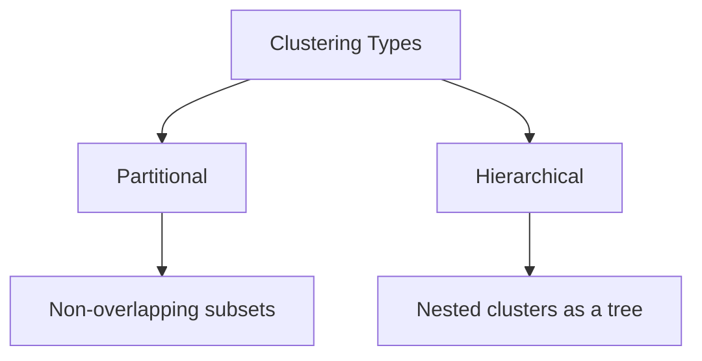
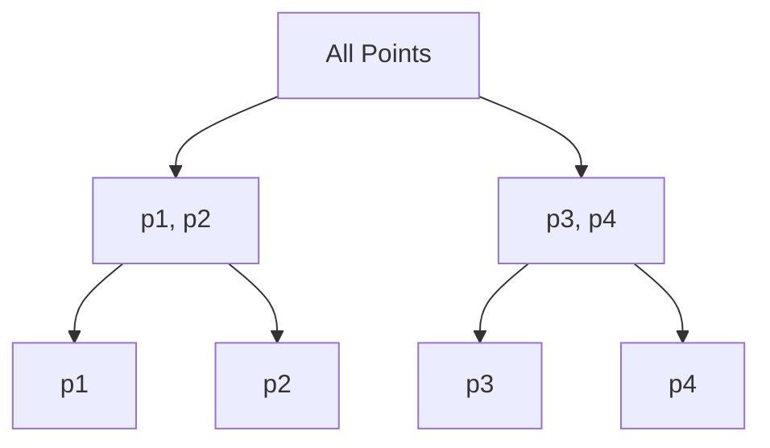
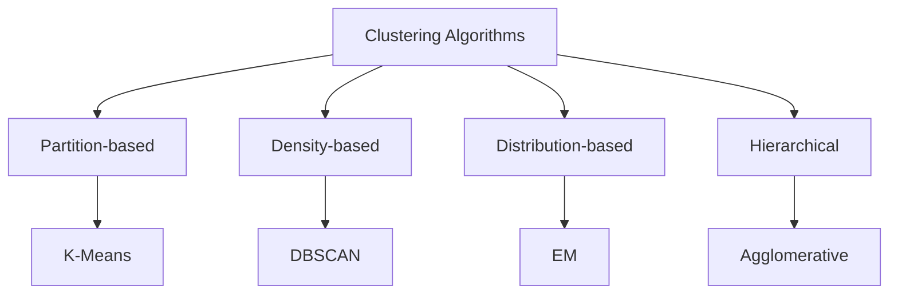
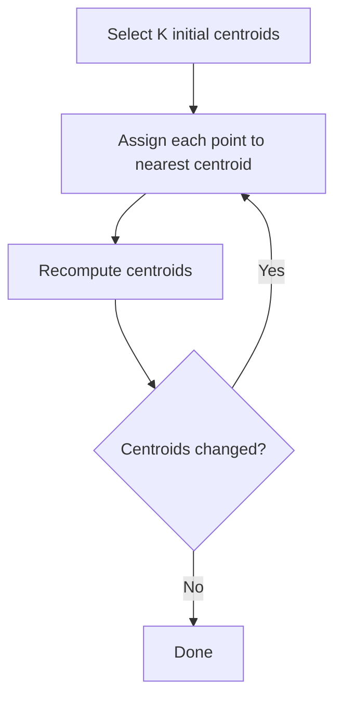
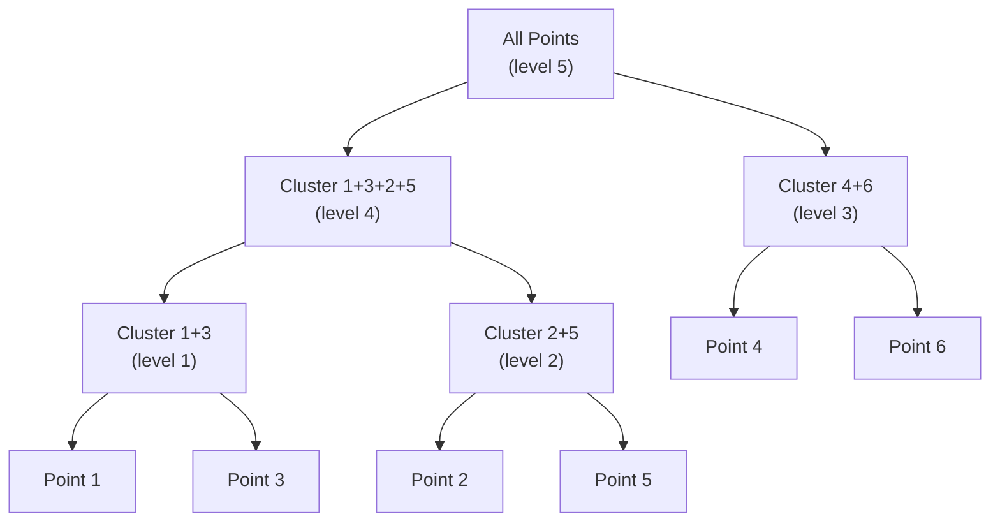
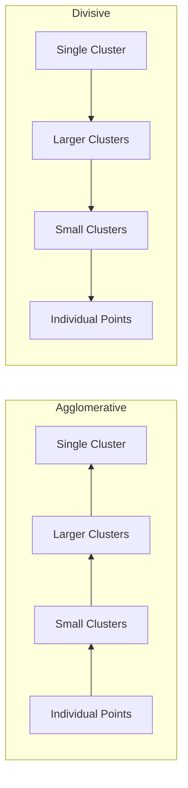
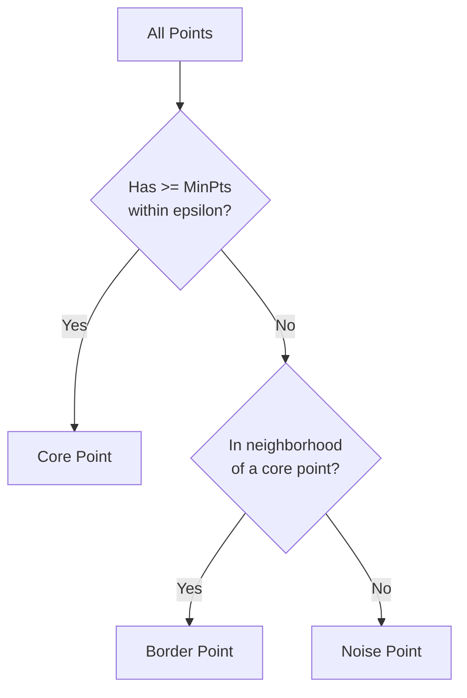
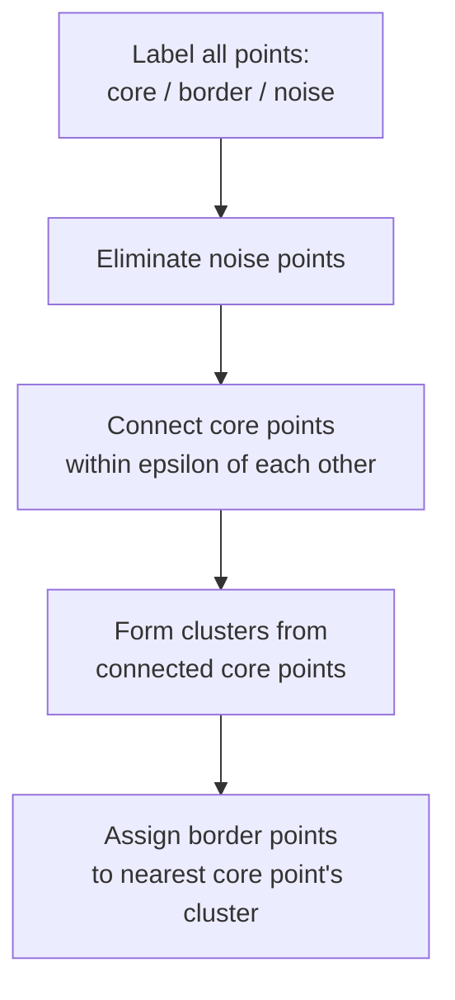
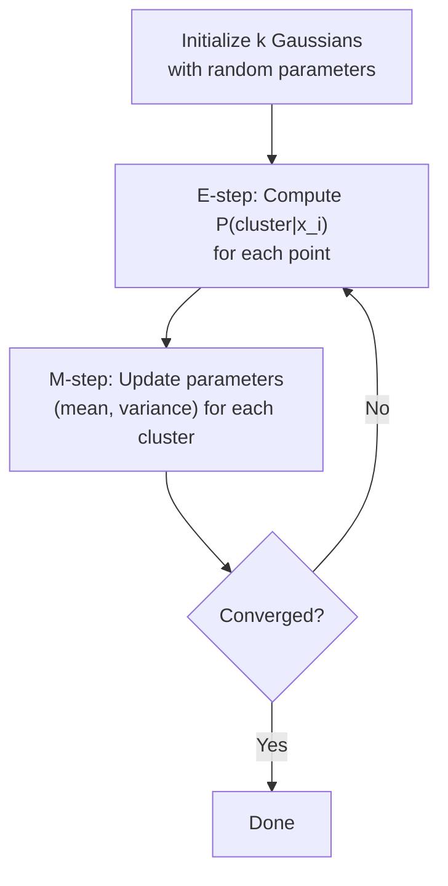
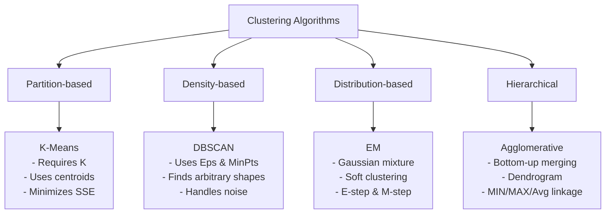

# CST8506 -- Advanced Machine Learning

## Week 6: Clustering

**Dr. Abbas Akkasi -- Winter 2026**

> *These slides are adapted from materials originally developed by Pang-Ning Tan on his Data Mining Course.*

---

## Today's Agenda

- Clustering
- Types of Clustering
- Types of Clusters
- K-Means
- Hierarchical Clustering
- DBSCAN
- EM
- Cluster Validity

---

## What is Cluster Analysis?

Given a **set of objects**, place them in **groups** such that the objects in a group are similar (or related) to one another and different from (or unrelated to) the objects in other groups.

- **Intra-cluster** distances are **minimized**
- **Inter-cluster** distances are **maximized**

---

## Applications of Cluster Analysis

### Understanding

- Group related documents for browsing, group genes and proteins that have similar functionality, or group stocks with similar price fluctuations

| Cluster | Discovered Clusters | Industry Group |
|---------|-------------------|----------------|
| **1** | Applied-Matl-DOWN, Bay-Network-Down, 3-COM-DOWN, Cabletron-Sys-DOWN, CISCO-DOWN, HP-DOWN, DSC-Comm-DOWN, INTEL-DOWN, LSI-Logic-DOWN, Micron-Tech-DOWN, Texas-Inst-Down, Tellabs-Inc-Down, Natl-Semiconduct-DOWN, Oracl-DOWN, SGI-DOWN, Sun-DOWN | Technology1-DOWN |
| **2** | Apple-Comp-DOWN, Autodesk-DOWN, DEC-DOWN, ADV-Micro-Device-DOWN, Andrew-Corp-DOWN, Computer-Assoc-DOWN, Circuit-City-DOWN, Compaq-DOWN, EMC-Corp-DOWN, Gen-Inst-DOWN, Motorola-DOWN, Microsoft-DOWN, Scientific-Atl-DOWN | Technology2-DOWN |
| **3** | Fannie-Mae-DOWN, Fed-Home-Loan-DOWN, MBNA-Corp-DOWN, Morgan-Stanley-DOWN | Financial-DOWN |
| **4** | Baker-Hughes-UP, Dresser-Inds-UP, Halliburton-HLD-UP, Louisiana-Land-UP, Phillips-Petro-UP, Unocal-UP, Schlumberger-UP | Oil-UP |

### Summarization

- Reduce the size of large data sets

---

## Notion of a Cluster can be Ambiguous

The same set of data points can be interpreted as having different numbers of clusters depending on perspective:

- **Two Clusters** -- grouping at a high level
- **Four Clusters** -- moderate granularity
- **Six Clusters** -- fine-grained grouping

---

## Types of Clusterings

A **clustering** is a set of clusters.

Important distinction between **hierarchical** and **partitional** sets of clusters:

- **Partitional Clustering** -- A division of data objects into non-overlapping subsets (clusters)
- **Hierarchical Clustering** -- A set of nested clusters organized as a hierarchical tree



---

## Partitional Clustering

Original data points are divided into distinct, non-overlapping groups. Each point belongs to exactly one cluster.

---

## Hierarchical Clustering

Clusters are nested within each other, forming a tree structure. Can be visualized as a **dendrogram**.

**Traditional Hierarchical Clustering:** Every object belongs to exactly one cluster at each level -- strict nesting.

**Non-traditional Hierarchical Clustering:** Objects may belong to overlapping clusters at different levels.



---

## Types of Clusters

- Well-separated clusters
- Prototype-based clusters
- Contiguity-based clusters
- Density-based clusters

### Well-Separated Clusters

A cluster is a set of points such that any point in a cluster is closer (or more similar) to every other point in the cluster than to any point not in the cluster.

### Prototype-Based Clusters

- A cluster is a set of objects such that an object in a cluster is closer (more similar) to the prototype or "center" of a cluster, than to the center of any other cluster
- The center of a cluster is often a **centroid** (the average of all points in the cluster) or a **medoid** (the most "representative" point of a cluster)

### Contiguity-Based Clusters

- Also called **Nearest neighbor** or **Transitive** clusters
- A cluster is a set of points such that a point in a cluster is closer (or more similar) to one or more other points in the cluster than to any point **not** in the cluster

### Density-Based Clusters

- A cluster is a dense region of points, which is separated by low-density regions, from other regions of high density
- Used when the clusters are irregular or intertwined, and when noise and outliers are present

---

## Clustering Algorithms



---

## K-means Clustering

- Partitional clustering approach
- Number of clusters, K, must be specified
- Each cluster is associated with a **centroid** (center point)
- Each point is assigned to the cluster with the closest centroid
- The basic algorithm is very simple

### Algorithm

```
1: Select K points as the initial centroids.
2: repeat
3:     Form K clusters by assigning all points to the closest centroid.
4:     Recompute the centroid of each cluster.
5: until The centroids don't change
```



### Example of K-means Clustering

Over multiple iterations (1 through 6), points are reassigned and centroids shift until convergence. After iteration 6, three well-separated clusters emerge (e.g., red diamonds, green circles, blue squares) with centroids stabilized at their final positions.

---

## K-means Clustering -- Details

- **Simple iterative algorithm:**
  - Choose initial centroids
  - Repeat: assign each point to a nearest centroid; recompute cluster centroids
  - Until centroids stop changing

- **Initial centroids are often chosen randomly**
  - Clusters produced can vary from one run to another

- The centroid is (typically) the mean of the points in the cluster, but other definitions are possible

- K-means will converge for common distance measures with appropriately defined centroid

- **Most of the convergence happens in the first few iterations**
  - Often the stopping condition is changed to "Until relatively few points change clusters"

- **Complexity:** O(n \* K \* I \* d)
  - n = number of points, K = number of clusters, I = number of iterations, d = number of attributes

---

## K-means Objective Function

A common objective function (used with Euclidean distance measure) is **Sum of Squared Error (SSE)**:

$$SSE = \sum_{i=1}^{K} \sum_{x \in C_i} dist^2(m_i, x)$$

- *x* is a data point in cluster *C_i* and *m_i* is the centroid (mean) for cluster *C_i*
- For each point, the error is the distance to the nearest cluster center
- To get SSE, we square these errors and sum them
- SSE improves in each iteration of K-means until it reaches a local or global minimum

---

## Hierarchical Clustering

- Produces a set of **nested clusters** organized as a **hierarchical tree**
- Can be visualized as a **dendrogram**
  - A tree-like diagram that records the sequences of merges or splits



### Strengths of Hierarchical Clustering

- Do not have to assume any particular number of clusters
  - Any desired number of clusters can be obtained by "cutting" the dendrogram at the proper level
- They may correspond to meaningful taxonomies
  - Example in biological sciences (e.g., animal kingdom, phylogeny reconstruction, ...)

---

## Hierarchical Clustering: Two Main Types

### Agglomerative (Bottom-Up)

- Start with the points as individual clusters
- At each step, merge the closest pair of clusters until only one cluster (or k clusters) left

### Divisive (Top-Down)

- Start with one, all-inclusive cluster
- At each step, split a cluster until each cluster contains an individual point (or there are k clusters)

Traditional hierarchical algorithms use a similarity or distance matrix -- merge or split one cluster at a time.



---

## Agglomerative Clustering Algorithm

**Key Idea: Successively merge closest clusters**

### Basic Algorithm

1. Compute the distance matrix
2. Let each data point be a cluster
3. **Repeat**
4. Merge the two closest clusters
5. Update the distance matrix
6. **Until** only a single cluster remains

**Key operation** is the computation of the distance of two clusters -- different approaches to defining the distance between clusters distinguish the different algorithms.

### Step-by-Step Walkthrough

**Steps 1 & 2:** Start with clusters of individual points and a proximity matrix.

**Intermediate Situation:** After some merging steps, we have some clusters (C1, C2, C3, C4, C5) with an updated distance matrix and a partially built dendrogram.

**Step 4:** Merge the two closest clusters (e.g., C2 and C5) and update the distance matrix.

**Step 5:** The question is "How do we update the distance matrix?" -- The new merged cluster (C2 U C5) needs new distance values computed to all remaining clusters (C1, C3, C4).

---

## How to Define Inter-Cluster Distance

Several methods to measure the distance (or similarity) between two clusters:

| Method | Description |
|--------|-------------|
| **MIN** (Single Link) | Distance between the two **closest** points in different clusters |
| **MAX** (Complete Link) | Distance between the two **farthest** points in different clusters |
| **Group Average** | Average distance of **all pairs** of points across two clusters |
| **Distance Between Centroids** | Distance between the **centroids** (means) of two clusters |
| **Ward's Method** | Based on minimizing the increase in total squared error |

### MIN (Single Linkage)

Uses the **minimum** distance between any point in one cluster and any point in the other cluster. Can produce elongated, chain-like clusters.

### MAX (Complete Linkage)

Uses the **maximum** distance between any point in one cluster and any point in the other cluster. Tends to produce compact, spherical clusters.

### Group Average

Uses the **average** of all pairwise distances between points in the two clusters. A compromise between MIN and MAX.

### Distance Between Centroids

Uses the distance between the **centroid** (mean point) of each cluster.

---

## Hierarchical Clustering: Group Average Example

Points {1, 2, 3, 4, 5, 6} are clustered. The dendrogram shows merge order:

1. Points 3 and 6 merge first (~0.04)
2. Points 2 and 5 merge (~0.1)
3. Point 4 joins {3, 6} (~0.13)
4. Point 1 joins {3, 6, 4} (~0.15)
5. {1, 3, 4, 6} merges with {2, 5} (~0.25)

---

## Hierarchical Clustering: Comparison

Different linkage methods produce different cluster structures for the same data:

| Method | Merge Order | Characteristics |
|--------|------------|-----------------|
| **MIN** | {3,6} -> {2,5} -> {2,3,5,6} -> {2,3,4,5,6} -> all | Tends to create elongated chains |
| **MAX** | {3,6} -> {2,5} -> {3,4,6} -> {1,2,5} -> all | Tends to create compact clusters |
| **Group Average** | {3,6} -> {2,5} -> {3,4,6} -> {1,3,4,6} -> all | Compromise between MIN and MAX |

---

## Density-Based Clustering

Clusters are **regions of high density** that are separated from one another by **regions of low density**.

---

## DBSCAN -- Density-Based Spatial Clustering of Applications with Noise

DBSCAN is a density-based algorithm.

- **Density** = number of points within a specified radius (epsilon)

### Point Classification

- **Core point:** Has **at least** a specified number of points (MinPts) within epsilon
  - These are points that are at the interior of a cluster
  - Counts the point itself
- **Border point:** Is not a core point, but is in the neighborhood of a core point
- **Noise point:** Is any point that is not a core point or a border point



### DBSCAN: Core, Border, and Noise Points -- Example

With **MinPts = 7**:
- **Point A** (core point): Has >= 7 points within its Eps neighborhood
- **Point B** (border point): Has < 7 points within Eps, but is within the Eps neighborhood of core point A
- **Point C** (noise point): Has < 7 points within Eps and is not in any core point's neighborhood

---

## DBSCAN Algorithm

Form clusters using core points, and assign border points to one of its neighboring clusters.

```
1: Label all points as core, border, or noise points.
2: Eliminate noise points.
3: Put an edge between all core points within a distance epsilon of each other.
4: Make each group of connected core points into a separate cluster.
5: Assign each border point to one of the clusters of its associated core points.
```



### When DBSCAN Works Well

- Can handle clusters of **different shapes and sizes**
- **Resistant to noise**

---

## Distribution-based Clustering

- Idea is to model the set of data points as arising from a **mixture of distributions**
  - Typically, normal (Gaussian) distribution is used
  - But other distributions have been very profitably used

- Clusters are found by estimating the parameters of the statistical distributions using the **Expectation-Maximization (EM)** algorithm

### Distribution-based Clustering: Example

Consider modeling points that generate a bimodal histogram:
- Looks like a combination of **two normal (Gaussian) distributions**
- If we can estimate the mean and standard deviation of each normal distribution:
  - This completely describes the two clusters
  - We can compute the probabilities with which each point belongs to each cluster
  - Can assign each point to the cluster (distribution) for which it is most probable

$$prob(x_i | \Theta) = \frac{1}{\sqrt{2\pi}\sigma} \; e^{-\frac{(x - \mu)^2}{2\sigma^2}}$$

---

## EM (Expectation-Maximization) Algorithm

If we know the source of data, it is easy to estimate parameters.
If we know the parameters, we could easily assign each point to the closest distribution.
If we do not know the source and the parameters, then we use **EM**.

### EM Algorithm Steps

- Starts with k randomly placed Gaussians (e.g., k = 2): parameters are the mean and variance for each
- **E-step:** For each point x_i, compute P(b|x_i) -- the probability it belongs to each cluster (soft clustering)
- **M-step:** Calculate new parameters (mean, variance) to fit points assigned to them
- Repeat until convergence



### More Detailed EM Algorithm

**Assumption:** k = 2 (2 Gaussians)

**E-step** -- Compute probability of belonging to cluster b:

$$P(x_i | b) = \frac{1}{\sqrt{2\pi} \; \sigma_b} \; e^{-\frac{(x_i - \mu_b)^2}{2\sigma_b^2}}$$

$$b_i = P(b | x_i) = \frac{P(x_i | b) P(b)}{P(x_i | b) P(b) + P(x_i | a) P(a)}$$

**M-step** -- Update parameters:

$$\mu_b = \frac{b_1 x_1 + b_2 x_2 + \ldots + b_n x_n}{b_1 + b_2 + \ldots + b_n}$$

$$\sigma_b^2 = \frac{b_1(x_1 - \mu_b)^2 + b_2(x_2 - \mu_b)^2 + \ldots + b_n(x_n - \mu_b)^2}{b_1 + b_2 + \ldots + b_n}$$

---

## Measures of Cluster Validity

Numerical measures that are applied to judge various aspects of cluster validity are classified into two types:

### Supervised (External Indices)

- Used to measure the extent to which cluster labels match externally supplied class labels
- Often called *external indices* because they use information external to the data

### Unsupervised (Internal Indices)

- Used to measure the goodness of a clustering structure *without* respect to external information
- Sum of Squared Error (SSE)
- Often called *internal indices* because they only use information in the data

You can use supervised or unsupervised measures to compare clustering methods.

---

## Unsupervised Measures: Cohesion and Separation

- **Cluster Cohesion:** Measures how closely related are objects in a cluster
  - Example: SSE
- **Cluster Separation:** Measures how distinct or well-separated a cluster is from other clusters

### Example: Squared Error

**Cohesion** is measured by the within-cluster sum of squares (SSE):

$$SSE = \sum_{i} \sum_{x \in C_i} (x - m_i)^2$$

**Separation** is measured by the between-cluster sum of squares (SSB):

$$SSB = \sum_{i} |C_i| (m - m_i)^2$$

Where |C_i| is the size of cluster *i*, and *m* is the **global (grand) mean** of all data points.

### Example: SSE + SSB = Constant

**SSB + SSE = constant** (Total Sum of Squares)

**K=1 cluster:** (points at 1, 2, 4, 5; mean m = 3)
- SSE = (1-3)^2 + (2-3)^2 + (4-3)^2 + (5-3)^2 = 10
- SSB = 4 x (3-3)^2 = 0
- Total = 10 + 0 = 10

**K=2 clusters:** ({1,2} with m1=1.5 and {4,5} with m2=4.5)
- SSE = (1-1.5)^2 + (2-1.5)^2 + (4-4.5)^2 + (5-4.5)^2 = 1
- SSB = 2 x (1.5-3)^2 + 2 x (4.5-3)^2 = 9
- Total = 1 + 9 = 10

### Graph-based Cohesion and Separation

A distance graph-based approach can also be used:
- **Cluster cohesion** is the sum of the weight of all links *within* a cluster
- **Cluster separation** is the sum of the weights *between* nodes in the cluster and nodes outside the cluster

---

## Unsupervised Measures: Silhouette Coefficient

The **Silhouette coefficient** combines ideas of both cohesion and separation, for individual points as well as clusters.

For an individual point *i*:

1. Calculate **a** = average distance of *i* to the points in its cluster
2. Calculate **b** = min (average distance of *i* to points in another cluster)
3. The silhouette coefficient for a point is:

$$s = \frac{b - a}{\max(a, b)}$$

- Value ranges between **-1 and 1**
- Typically ranges between 0 and 1
- **The closer to 1 the better**

The **silhouette coefficient** tells you **how well each point fits in its cluster**.

---

## Summary


