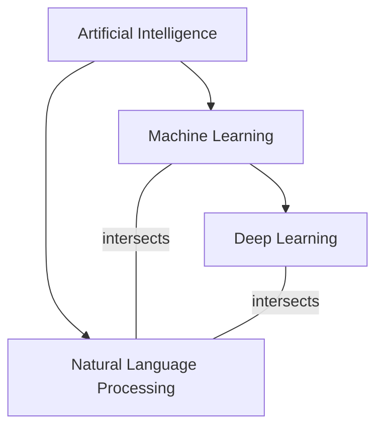
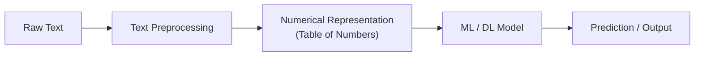
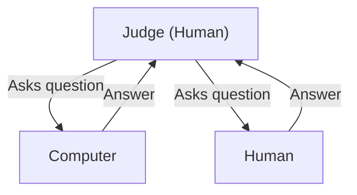
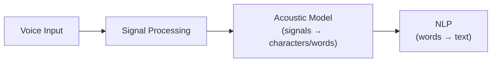

# Lecture 1: Introduction to Natural Language Processing

## Documents and Knowledge

### Documents

**Document**: any source of NLP text, including books, articles, news, and websites.

Key characteristics of documents:
- Can have **structured** or **unstructured** representation
- The main challenge: text is inherently **unstructured**
- Natural languages are **ambiguous** (true for English, French, Arabic, Chinese, and all others)
- Exist in **massive volume**

### Knowledge Representation

**Knowledge Representation**: representing any data in a form that a computer can understand and work with.

- A set of rules that a machine interprets in order to act in the world
- Can take the form of logic, networks, or other formal structures

Key characteristics of knowledge:
- **Structured**
- **Precise**
- **Actionable** (many applications can be built from it)
- **Domain-specific**

### The Role of NLP

NLP aims to convert **unstructured information** from documents into **structured knowledge** that can be used to build applications.

| Aspect         | Documents                     | Knowledge                          |
|----------------|-------------------------------|------------------------------------|
| Readability    | Humans can read, but slowly   | Computers can use quickly          |
| Memory         | Can't remember all            | Memory is not a problem            |
| Questions      | Can't answer questions        | Can quickly answer questions       |
| Fatigue        | Humans get tired              | Computers don't get tired          |
| Structure      | Unstructured, ambiguous       | Structured, precise, actionable    |
| Volume         | Lots and lots of it           | Specific to the task               |

> **Key Takeaway**: NLP is about collecting data from different resources, restructuring it into something usable, and then building applications on top of that.

---

## Formal Definition of NLP

**Natural Language Processing (NLP)**: a subfield of **linguistics**, **computer science**, and **artificial intelligence** concerned with analyzing and understanding human language. It focuses on how to program a computer to process and analyze large amounts of natural language data.

---

## Motivation for NLP

1. **Understanding and processing human language** enables building powerful applications:
   - Translation
   - Summarization
   - Sentiment analysis
   - And many more

2. **Industry adoption**: businesses use NLP to analyze customer feedback and improve sales.

3. **Accessibility**: people with disabilities can interact with devices through voice (speech is closely related to NLP).

4. **Information extraction**: computers can access information, extract insights, and make sense of data.

5. **Social media analysis**: sentiment analysis is used to find trends on platforms like X (formerly Twitter), Facebook, and others. This became especially visible during elections.

6. **Career opportunity**: high demand exists for professionals who understand NLP, especially with the increased use of large language models.

7. **Research growth**: since 2017, the number of published NLP papers per year has been among the highest across all fields.

---

## AI, Machine Learning, Deep Learning, and NLP

### AI vs. Machine Learning

**Artificial Intelligence (AI)**: the umbrella term that includes machine learning and many other fields (NLP, speech recognition, computer vision, etc.). The general definition of AI is making a computer act like a human, imitating or simulating human behavior and intelligence.

> **Example**: When you ask a very small child to get something from the fridge, that is intelligence. That is human intelligence. AI is about making the computer mimic this kind of behavior.

**Machine Learning (ML)**: a subfield of AI where the computer learns from data itself, rather than being given explicit instructions. The computer identifies patterns and performs tasks such as:
- Classification
- Clustering
- Forecasting
- Association
- Outlier/Anomaly detection

> **Example of Association**: supermarkets learn from purchase data that certain items sell well together, so they bundle them in offers. *(This is also known as market basket analysis.)*

### Relationship Between AI, ML, DL, and NLP



- **Deep Learning (DL)** is a subset of ML that uses deep neural networks instead of traditional ML techniques, but performs the same types of tasks.
- **NLP intersects with both ML and DL**, since NLP uses techniques from both.

### From Text to Numbers

In machine learning, data is organized as a table:

| Instance | Feature 1 | Feature 2 | ... | Class |
|----------|-----------|-----------|-----|-------|
| Row 1    | value     | value     | ... | label |
| Row 2    | value     | value     | ... | label |

- Rows = **instances**
- Columns = **attributes/features**
- Final column = **class/decision**
- Data is typically **numeric** (categorical data must be converted to numbers, because the computer only understands numbers)

**In NLP, the same principle applies**: text must be converted to a numerical format before any ML or DL technique can be applied. There are many techniques to do this conversion, and it is the major preprocessing step in NLP.


*(added)*

---

## Brief History of NLP

| Year/Era | Milestone |
|----------|-----------|
| **1950s** | First simple, limited translation machines |
| **1960s** | First chatbot: **ELIZA**, a rule-based chatbot |
| **1970s** | Introduction of **statistical models** for language, a major advance |
| **1980s-2000s** | Growth of machine learning techniques applied to NLP |
| **2013** | **Word2Vec** released, significantly enhancing NLP applications |
| **2017** | Publication of **"Attention Is All You Need"**, introducing the **Transformer** architecture |
| **Post-2017** | Era of **large language models** (e.g., GPT), all built on top of the Transformer |

### The Transformer Architecture

- The **Transformer** is the building block for all modern NLP applications.
- It has been implemented in different forms:
  - **Encoder only** (e.g., BERT)  *(added)*
  - **Decoder only** (e.g., GPT)  *(added)*
  - **Encoder-Decoder** (e.g., T5)  *(added)*
- All large language models are built on top of this architecture.

---

## The Turing Test

**Turing Test**: devised in 1950 by British scientist **Alan Turing**, it remains a benchmark for AI applications.

> **Key insight from the slides**: The ability to understand and generate language is approximately equivalent to intelligence.

**Setup** (three components):
1. A **judge/evaluator** (human)
2. A **computer system**
3. Another **human**

**Procedure**:
1. The judge asks a question (without seeing who is the computer and who is the human).
2. Both the computer and the human answer.
3. If the judge **can** differentiate which answer came from the computer: the system **fails** the Turing test.
4. If the judge **cannot** differentiate: the system **passes** the Turing test.


*(added)*

---

## Applications of NLP

Examples of NLP applications include: forensics and detection, spam detection (spam or not spam), and autocorrect on your iPhone (when you write something and it corrects a name, that is natural language processing).

### NLU vs. NLG

NLP applications are divided into two main categories:

**Natural Language Understanding (NLU)**: the system comprehends input text.

**Natural Language Generation (NLG)**: the system produces output text.

Some applications use only NLU, some only NLG, and many combine both.

| Category | Examples |
|----------|----------|
| **NLU only** | Sentiment analysis, text classification (spam detection, language detection, document/topic classification) |
| **NLG only** | Text-to-speech, automatic report generation (e.g., medical reports from patient data) |
| **NLU + NLG** | Translation, summarization, question answering, chatbots |

**Text-to-speech pipeline**: the system processes signals, converts them to words, then combines the words to generate text. There is no deep semantic understanding involved, making it a primarily generative task.

**Automatic report generation**: for example, an automatic medical report takes patient features, measurements, and analysis, then automatically generates a report based on this information. Any automatic report generation from data is natural language generation.

### Speech Recognition Systems

Speech recognition is not purely NLP, but NLP plays an important role:


*(reconstructed example)*

**Applications involving speech:**
- Real-time auto-translation
- Conversation agents and chatbots (e.g., Alexa, Siri, Amazon customer service bots)
  - Used in **customer service and technical support** (e.g., when you try to make a conversation with Amazon or similar services, a bot will reply to you)
  - Combine speech recognition, language understanding, dialogue management, response generation, and text-to-speech
  - The system works **bidirectionally**: speech recognition converts speech to text (input), then after processing, the system does the opposite, converting the generated text back into speech (output)

**Dialogue management**: tracks the state of the conversation and controls the flow between question and answer. It is a very complicated system, but NLP is an important part involved in all of these systems.

### Text Classification

- **Sentiment analysis**
- **Spam detection** (spam or not spam)
- **Priority level classification** (e.g., email priority) *(from slides)*
- **Category classification** (e.g., email: primary / social / promotions / updates) *(from slides)*
- **Language detection** (predict the language of input text)
- **Document/topic classification** (news, sports, business, etc.)

### Sentiment Analysis vs. Text Classification

| Aspect | Text Classification | Sentiment Analysis |
|--------|--------------------|--------------------|
| Understanding depth | Shallow (keyword-based) | Deep (semantic understanding) |
| Goal | Categorize text by topic | Extract emotion, attitude, trends |
| Example | Spam or not spam | Positive, negative, or neutral opinion |

> **Key Difference**: Sentiment analysis requires a much deeper understanding of semantics than simple text classification.

### Text Summarization

Takes input text and produces a shorter summary. It is one of the **hardest** NLP applications.

**Challenges:**
- Identifying important information
- Maintaining **coherence** (words and phrases must connect logically)
- Handling different source types (articles vs. research papers vs. books)
- Dealing with **redundancy** (repeated content)
- Managing **complexity** (texts with many layered ideas)
- **Language specificity**: a summarization system built for English cannot simply be applied to French or another language. There is no one-to-one correspondence between natural languages, so the system must be largely rebuilt.

### Question Answering

> **Course note**: Question answering will most probably be the topic of the course project, and it will be covered in more depth later in the course.

Two main techniques:

1. **Extractive QA**: given a text and a question, the system extracts the answer directly from the text (finding where the answer starts and ends).
2. **Generative QA**: the system generates the answer using various techniques rather than extracting it verbatim.

### Large Language Models (e.g., ChatGPT)

- ChatGPT is an NLP application for **text generation**.
- Its architecture also incorporates **reinforcement learning**.
- You ask a question, and the model generates an answer based on your input.

---

## Challenges in NLP

All challenges stem from the nature of natural language itself.

### 1. Ambiguity

All natural languages are ambiguous. A word can have different meanings **depending on the context**. This is true not only in English but in all languages. There are several forms of ambiguity:

#### Lexical Ambiguity (Words with Multiple Meanings)
- **"bass"**: a type of fish OR low-frequency sound in music
- **"bank"**: the side of a river OR a financial institution

#### Attachment Ambiguity
Which phrase or word attaches to a specific modifier in a sentence.

> **Example**: "She saw the man with a telescope."
> - Interpretation 1: She used a telescope to see the man.
> - Interpretation 2: She saw a man who was holding a telescope.

#### Coreference Ambiguity
It is unclear which entity a pronoun refers to.

> **Example**: "My girlfriend and I met my lawyer for a drink, but she became ill and had to leave."
> - Does "she" refer to the girlfriend or the lawyer?

### 2. Sparsity (Zipf's Law)

**Zipf's Law**: in any text, word frequency is inversely proportional to word rank.

$$f(w) \propto \frac{1}{r}$$

where $f(w)$ is the frequency of word $w$ and $r$ is its rank. *(reconstructed)*

- Take any text and sort the words by frequency, then rank them. The most frequent word gets rank 1, the next gets rank 2, and so on. When rank increases, frequency decreases.
- Some words appear very frequently, many appear very rarely.
- This pattern holds across all types of text (books, articles, news, research papers).
- **The ML problem**: in machine learning, you make the machine understand patterns. When something repeats many times, the machine learns that with this feature, this decision happens. But if something appeared only one time, there is no pattern. How are you going to learn from it? In ML, such a value is typically treated as an **outlier** (something not habitual).
- **However, in NLP, rare words can be critically important.** A term like "fuzzy logic" may appear only once but carry significant meaning. These rare words may be essential to identify the type of data, to identify important information, or for tasks like summarization.
- More than one-third of words occur only once. The high-frequency words are few (e.g., "the," "of," "to," "and"), and the rare words form a very long tail.

**Examples of rare words from the long tail** *(from slides)*: cornflakes, mathematicians, fuzziness, jumbling, pseudo-rapporteur, lobby-ridden, perfunctorily, Lycketoft, UNCITRAL.

### 3. Variation

Variation exists **within** the same language, not just between different languages:

| Type of Variation | Description | Example |
|-------------------|-------------|---------|
| **Lexical** | The same meaning can be expressed with different sentence structures *(from slides)* | "She gave the book to Tom" vs. "She gave Tom the book" |
| **Geographical** | Vocabulary, grammar, and speech patterns differ by region | Canadian English varies by province |
| **Social** | Language differs by education level and social context | Speaking to a professor vs. a friend |
| **Stylistic** | Formal vs. informal language use different terminology | A formal letter vs. a text message |
| **Generational** | Older and younger generations use different vocabulary | New technology creates new expressions |
| **Cross-linguistic** | An NLP system built for one language cannot simply be applied to another | An English NLP app requires substantial rework for French |

### 4. Common Knowledge

Humans share common knowledge that is difficult to transfer to computers.

> **Example**: "a man with a dog" vs. "a dog with a man."
> Both are grammatically valid, but humans naturally prefer the first phrasing. A computer does not inherently know which is more natural.

Other examples: "the Earth is round," "the sun is hot." These are obvious to humans but must be explicitly encoded for machines.

### 5. Additional Challenges

- **Volume of data**: massive amounts of text to process
- **Accents and slang**: variation in spoken and written forms
- **Text complexity**: texts with many layered ideas
- **Evolving techniques**: translation quality has improved dramatically over the past decade
- **Computation resources**: training models requires enormous time, power, and human effort
- **Security and privacy**: conversations with tools like ChatGPT can become part of training data

---

## Approaches to NLP

The evolution of NLP techniques:

| Approach | Description | Era |
|----------|-------------|-----|
| **Heuristic/Rule-based** | Pattern matching using regular expressions | Early NLP |
| **Machine Learning** | Supervised and unsupervised models that learn from data | 1990s onward |
| **Deep Learning** | Recurrent Neural Networks (RNN) and Long Short-Term Memory (LSTM) | 2010s |
| **Transformers** | State-of-the-art architecture ("Attention Is All You Need") | 2017 onward |

> **Important**: Old techniques are NOT obsolete. In industry, even when a system uses state-of-the-art models, small rule-based systems are often plugged in to handle specific edge cases where the main model fails. Not every application needs a Transformer. Some applications succeed with simpler ML techniques, depending on the use case and available resources.

---

## Key NLP Tools and Libraries

| Tool | Description |
|------|-------------|
| **NLTK** | Comprehensive NLP library for Python, good for learning and prototyping |
| **spaCy** | Industrial-strength NLP library for Python |
| **Hugging Face** | Platform and library for pre-trained models and Transformers (important resource for the course) |
| **scikit-learn** | ML library for preprocessing, text cleaning, vectorization, and applying ML models |

```python
# Example: Basic text preprocessing pipeline using NLTK (added)
import nltk
from nltk.tokenize import word_tokenize
from nltk.corpus import stopwords

nltk.download('punkt')
nltk.download('stopwords')

text = "Natural language processing is a subfield of artificial intelligence."
tokens = word_tokenize(text)
stop_words = set(stopwords.words('english'))
filtered = [word for word in tokens if word.lower() not in stop_words]

print("Original tokens:", tokens)
print("Filtered tokens:", filtered)
```
*(added)*

```python
# Example: Basic text vectorization with scikit-learn (added)
from sklearn.feature_extraction.text import CountVectorizer

documents = [
    "NLP is a subfield of AI",
    "Machine learning is part of AI",
    "Deep learning uses neural networks"
]

vectorizer = CountVectorizer()
X = vectorizer.fit_transform(documents)

print("Feature names:", vectorizer.get_feature_names_out())
print("Document-term matrix:\n", X.toarray())
```
*(added)*

---

## What's Next (Lecture 2 Preview)

The next lecture covers **text preprocessing and exploratory analysis** *(from slides)*:
- Regular expressions
- Tokenization
- Stemming
- Removing stop words
- Part of Speech tagging (POS)
