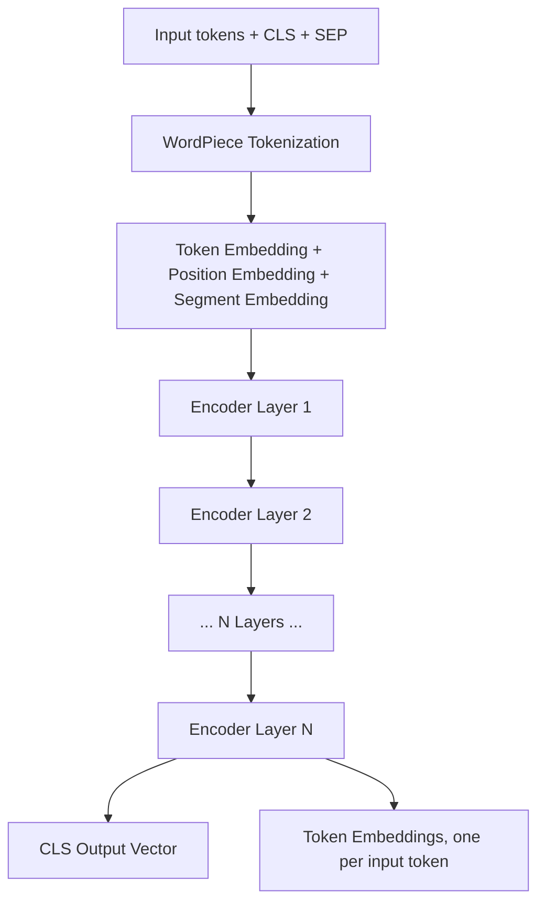
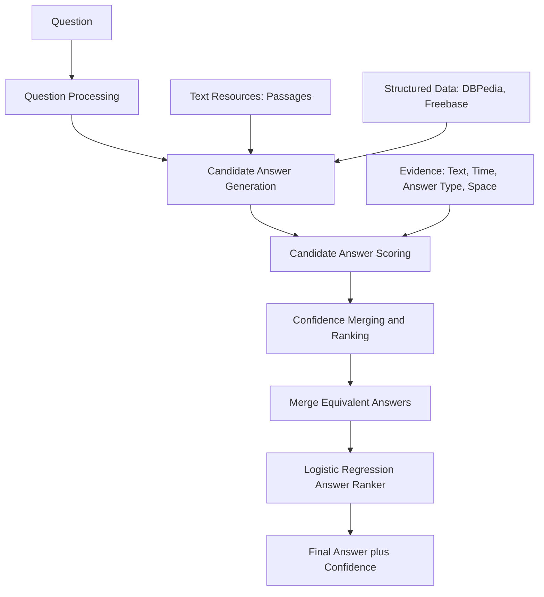
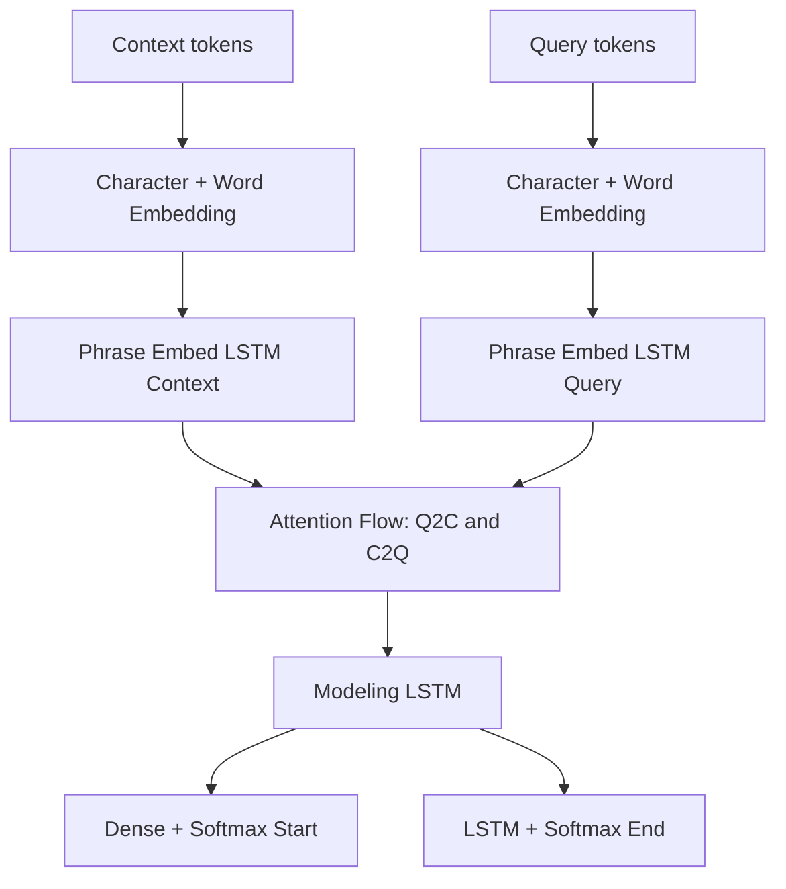
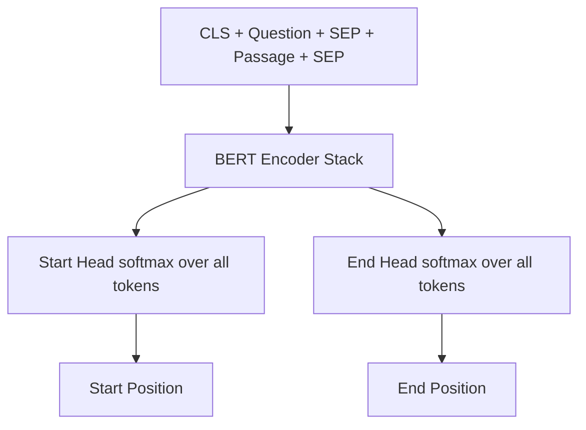
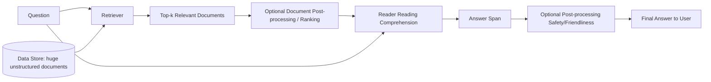
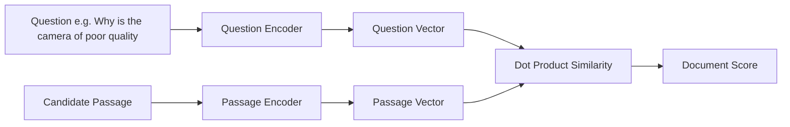

# Lecture 10: BERT and Question Answering Systems

## Overview

Today's lecture covers BERT (Bidirectional Encoder Representations from Transformers), its architecture, its variants, how to use BERT for text classification, and an introduction to question answering systems. The question answering portion covers extractive question answering (also called reading comprehension), open domain, closed domain, and generative question answering.

---

## 1. The Big Picture: Transformer Family Tree

The transformer has two parts, an encoder and a decoder. From this, three main branches have grown in the field.

### Three Main Branches

1. **Encoder-only (BERT family)**
   - BERT
   - DistilBERT
   - RoBERTa
   - XLM and XLM-R
   - ALBERT
   - ELECTRA
   - DeBERTa

2. **Encoder-decoder**
   - T5
   - BART
   - M2M-100
   - BigBird

3. **Decoder-only (GPT family)**
   - GPT
   - GPT-2
   - CTRL
   - GPT-3
   - GPT-Neo
   - GPT-J

> **Focus of this lecture**: the encoder-only branch (BERT).

### Timeline of Key Models

Showing how fast this field is moving:

| Date | Model |
|------|-------|
| June 2017 | Transformer |
| June 2018 | GPT |
| October 2018 | BERT |
| February 2019 | GPT-2 |
| October 2019 | T5 |
| May 2020 | GPT-3 |
| September 2021 | FLAN |
| March 2022 | GPT-3.5 and InstructGPT |
| November 2022 | ChatGPT |
| February 2023 | LLaMA |
| March 2023 | GPT-4 |
| March 2024 | GPT-4o |
| April 2024 | LLaMA-3.1 (405 billion parameters) |
| December 2024 | OpenAI o1, DeepSeek-V3 |
| January 2025 | DeepSeek-R1 |

---

## 2. What Is BERT?

**BERT**: Bidirectional Encoder Representations from Transformers.

### Evolution of NLP Leading to BERT

The evolution of NLP techniques progressed through these stages:

1. RNN and LSTM
2. Encoder-decoder and Bi-LSTM
3. Attention
4. Transformer
5. BERT

### Training Data

BERT was trained on a huge amount of data:

- **English Wikipedia**: around 2.5 billion words
- **Book Corpus**: about 11,000 books, 800 million words

---

## 3. Why BERT Was a Big Deal: Contextual Embeddings

Consider these two sentences:

1. "We went to the river bank."
2. "I need to go to the bank to make a deposit."

The word "bank" is the same word, but the meaning is completely different.

Before BERT, with embeddings like Word2Vec, "bank" would have **one fixed representation** regardless of context. BERT changed this because it produces a **contextual embedding**, so the same word has different representations based on its context.

### Google Search Application

Google applied BERT to search. Two famous examples:

**Example 1: Query** "2019 brazil traveler to usa need a visa"

- **Before BERT**: top result was about US citizens traveling to Brazil without a visa, because the model did not pay attention to the word "to."
- **After BERT**: top result was about tourists from Brazil needing a B-2 visa to travel to the United States, which is what the user actually wanted.

**Example 2: Query** "parking on a hill with no curb"

- **Before BERT**: the result explained how to park on a hill with a curb, because the system ignored the word "no."
- **After BERT**: the result correctly explained how to park on a hill where there is no curb.

> **Key insight**: Before BERT, models didn't pay attention to the new words. After BERT, every word has a value and every word is encoded in the context, so the answer is precise.

### Real-World Impact (Instructor's Anecdote)

The instructor shared a story about a PhD colleague working on disinformation analysis with social media data. She struggled to get good results with pre-BERT methods, to the point where she nearly abandoned her PhD and found a job in a government sector. After she tried BERT on her data, she got very good results, published a paper, and is now a graduating PhD professor in LA.

> **Takeaway**: BERT introduced a huge improvement in performance across different NLP tasks.

---

## 4. BERT Architecture

BERT comes in two architectures: **BERT base** and **BERT large**.

### BERT Base vs BERT Large

| Feature | BERT Base | BERT Large |
|---------|-----------|------------|
| Number of encoder layers (N) | 12 | 24 |
| Hidden size (embedding dimension) | 768 | 1024 |
| Attention heads | 12 | 16 |
| Total parameters | 110 million | 340 million |

Both architectures are stacks of encoders. The output of each encoder is the input for the next encoder.

### Comparison with the Original Transformer

| Feature | Original Transformer | BERT Base |
|---------|---------------------|-----------|
| Number of encoders (N) | 6 | 12 |
| Embedding dimension | 512 | 768 |
| Attention heads | 8 | 12 |

> **Note**: Remember the hidden size 768 for BERT base because we will need it. Every token can be represented in a vector of this specific size.

> **Note on Word2Vec vs BERT embedding size**: With Word2Vec, we could choose between sizes like 1500 or 300. BERT has a **fixed** embedding length.

### General Principle

For a large language model, **more is better**. The performance of BERT large should be higher than the performance of BERT base.

---

## 5. BERT's Internal Architecture

BERT is similar to the encoder in the transformer. The main block of the encoder is the same:

- Multi-head attention (with a different number of heads)
- Add and norm
- Feed forward
- Add and norm
- Scaled dot-product attention (same reasoning as in the transformer for why we need scaling)

### What Changes in BERT vs Transformer

Only the **input** and the **output** change. The main encoder block is unchanged.


*(reconstructed diagram)*

---

## 6. BERT Input

### Input Constraints

- **Maximum input size**: 512 tokens. You cannot input any sequence greater than 512.
- Inputs are measured in **tokens**, not words.
- If your sequence is greater than 512, there is another way to deal with it, but this is one of BERT's limitations.
- BERT feeds all tokens at the same time. There is no sequential ordering, same as the transformer.

### Special Tokens Added Automatically

BERT automatically adds special tokens during preprocessing:

1. **CLS**: added at the beginning. This token plays a very important role in many NLP tasks.
2. **SEP**: a separation token to separate sentences if we insert different sentences at the same time.
3. **MASK**: used for a specific rule during training.

### Preprocessing Steps

1. **Tokenization** using WordPiece.
2. **Add special tokens** (CLS, SEP, and MASK where relevant).
3. **Map tokens to IDs** using the WordPiece vocabulary.
4. **Apply positional encoding and segment encoding**.

---

## 7. WordPiece Tokenization

BERT uses a specific tokenization algorithm called **WordPiece**.

### Why WordPiece?

WordPiece tries to:

1. Optimize the tokenization process (minimize the number of tokens).
2. Overcome the problem of **out-of-vocabulary** words.

### How It Works

WordPiece is **not fixed**. It is **learned** through a training process. The total vocabulary size in WordPiece is exactly **30,522**, which covers all of English.

When WordPiece encounters a word not in its vocabulary, it **cuts the word** into sub-pieces.

**Example**: "playing" is divided into two tokens:

- `play`
- `##ing`

The `##` at the beginning of the second piece identifies that it is part of the same word. When reconstructing the original word, we know to combine these pieces.

> **Why the hash prefix?** When we train the model, we need to be able to reconstruct the word. For example, in a question-answering system, we input the question and need the answer as the token, not just the IDs. The `##` means there is a cut here and we combine these two pieces.

*(additional example)*: the word "unbelievable" might be tokenized as `un`, `##believe`, `##able`.

### Special Token IDs

| Token | ID | Purpose |
|-------|----|---------|
| `[PAD]` | 0 | Padding for short sequences |
| `[UNK]` | 100 | Unknown token |
| `[CLS]` | 101 | Classification token, added at start |
| `[SEP]` | 102 | Separator between sentences or end of single sentence |
| `[MASK]` | 103 | Masked token used during MLM training |

---

## 8. BERT Tokenization Example (From Slides)

Using `DistilBertTokenizer` on the sentence **"a visually stunning rumination on love"**:

**Step 1**: Break words into tokens.

```
a | visually | stunning | rum | ##ination | on | love
```

Notice that "rumination" gets split into `rum` and `##ination` (out of vocabulary word). "Stunning" happens to be in vocabulary, so it is not split in this example.

**Step 2**: Add `[CLS]` and `[SEP]` tokens.

```
[CLS] | a | visually | stunning | rum | ##ination | on | love | [SEP]
```

**Step 3**: Substitute tokens with their IDs from the WordPiece vocabulary.

```
101 | 1037 | 17453 | 14726 | 19379 | 12758 | 2006 | 2293 | 102
```

### Student Question: What About "Stunning"?

**Student**: I noticed "stunning" should be cut into other parts. This is not a minimization.

**Instructor**: Yeah, you are right. There is something incorrect in that specific slide example. But this is the general idea.

> **Note**: the tokenization decisions come from the learned WordPiece vocabulary, so sometimes the splits might not match your intuition.

---

## 9. Adding Special Tokens During Preprocessing

After tokenization, we add special tokens:

- **Single sentence**: `[CLS]` at the beginning, `[SEP]` at the end.
- **Two sentences**: `[CLS]` at the beginning, `[SEP]` between sentences, and `[SEP]` at the end.

The total number of tokens (including specials) **must not exceed 512**.

**Example** *(reconstructed)*:

Input sentence: "I love NLP."

After tokenization and special tokens:

```
[CLS] I love NL ##P . [SEP]
```

With input IDs (illustrative):

```
[101, 1045, 2293, 17953, 2361, 1012, 102]
```

---

## 10. Positional and Segment Encoding

### Position Encoding

**In the original transformer**: position encoding uses sine and cosine. It is a **fixed vector** calculated once and added to each word embedding.

**In BERT**: position encoding is still added to each embedding vector, but it is **not fixed**. It comes from the learning process. There are weights, and the model learns during backpropagation the position of each token in the input.

> **Key difference**: position encoding in BERT is part of the learning process, not a pre-computed formula.

### Segment Encoding

Segment encoding is added to differentiate sentences, for tasks like question answering where we feed the model with the question and the answer/passage at the same time.

- **0**: sentence number one (or question)
- **1**: sentence number two (or answer)

### Combining Inputs for the First Encoder Layer

The input to the first encoder layer is the sum of three vectors:

$$\text{Input} = \text{Token Embedding} + \text{Position Encoding} + \text{Segment Encoding}$$

All three are combined by element-wise addition, still producing a 512-position sequence of vectors (one per token), each of dimension 768 (for BERT base).

### Worked Example (From Slides)

Input: `[CLS] my dog is cute [SEP] he likes play ##ing [SEP]`

Each input position is the sum of three embeddings:

| Position | Token | Token Embedding | Segment Embedding | Position Embedding |
|----------|-------|-----------------|-------------------|--------------------|
| 0 | `[CLS]` | E_[CLS] | E_A | E_0 |
| 1 | my | E_my | E_A | E_1 |
| 2 | dog | E_dog | E_A | E_2 |
| 3 | is | E_is | E_A | E_3 |
| 4 | cute | E_cute | E_A | E_4 |
| 5 | `[SEP]` | E_[SEP] | E_A | E_5 |
| 6 | he | E_he | E_B | E_6 |
| 7 | likes | E_likes | E_B | E_7 |
| 8 | play | E_play | E_B | E_8 |
| 9 | ##ing | E_##ing | E_B | E_9 |
| 10 | `[SEP]` | E_[SEP] | E_B | E_10 |

Segment A covers the first sentence and its closing `[SEP]`. Segment B covers the second sentence and its closing `[SEP]`.

*(Image adapted from Jacob Devlin, Stanford CS224N)*

---

## 11. BERT Output

BERT has **two outputs**:

### Output 1: Final Hidden Layer (Per-Token Embeddings)

For each input token, we get an embedding of size 768 (for BERT base). This is a **contextual embedding**, meaning it has a deep understanding of each token based on:

1. The nature of the training data.
2. The multi-head attention architecture (every word attends to all surrounding words).

### Output 2: CLS Embedding Vector

The embedding vector of the special CLS token. This is proved in the BERT paper to be a **summary of all information from the input sentence**. CLS is a good representation of the whole sentence.

### Why CLS Works So Well

CLS works because the architecture is **bidirectional multi-head attention**. Bidirectional means we scan the sentence from right to left and from left to right. With multi-head attention, every word attends to all the other words from the left and right. At the end of all these layers, CLS logically holds important information about the whole sentence.

### Comparison with Assignment 1 Approach

> **Course note**: In assignment 1, you performed a classification task where you entered a sentence as a set of words. To get a sentence embedding, you took the **average** of all word embeddings. This gives every word the same priority or importance, while in real life this is usually not the case. With BERT, CLS gives you a much better representation that preserves contextual importance.

---

## 12. Two Benefits from BERT

1. **Per-token embedding** (same principle as Word2Vec): the final hidden state is the embedding vector for each token. Word2Vec trained in an unsupervised way by predicting a word from surrounding words. BERT does something similar with tokens, ending up with contextual embeddings.

2. **Classification head using CLS**: before BERT, transformers weren't suitable for classification. Now we can put a softmax on top of CLS to get class probabilities. This extends BERT beyond translation to many other NLP tasks.

---

## 13. How BERT Is Trained

### The Pre-training + Fine-tuning Paradigm

BERT follows two phases:

1. **Pre-training**: train on two self-supervised tasks to learn language. Produces the CLS and per-token embedding capabilities.
2. **Fine-tuning**: add a task-specific layer (classification layer, QA layer, etc.) and train on your task data.

### The Two Pre-training Tasks (Trained Simultaneously)

1. **Masked Language Model (MLM)**
2. **Next Sentence Prediction (NSP)**

---

## 14. Masked Language Model (MLM)

### Background: Word2Vec's Self-Supervision

Word2Vec used two techniques:

- **Skip-gram**: predict surrounding words from the middle word.
- **CBOW**: predict the middle word from surrounding words (e.g., take positions 1, 2, 3, 4, 5 and predict the middle).

### BERT's Approach

Same idea of self-supervision, but with a different technique.

Given a sentence with tokens $X_1, X_2, X_3, X_4, X_5, X_6$, BERT randomly selects some tokens to mask, then tries to predict each masked token based on the surrounding tokens.

### The 15% Masking Rule

Based on the BERT paper, **15% of tokens are randomly selected as "masked tokens"**. This 15% is further divided as:

| Treatment | Percentage | Purpose | Example |
|-----------|-----------|---------|---------|
| Replace with `[MASK]` | 80% | Standard masked language modeling | `went to the store → went to the [MASK]` |
| Replace with a random token | 10% | Force the model to learn even when input may be noisy | `went to the store → went to the running` |
| Keep the same token | 10% | Prevent the model from only learning to handle `[MASK]` | `went to the store → went to the store` |

### Why This 80/10/10 Split?

By giving the model all possible combinations, we ensure it can predict the correct word across many scenarios:

1. Sometimes we give it the correct word and compute the loss to update weights.
2. Sometimes we give it a random, unrelated word, and update parameters.
3. Sometimes we give it the actual word and ask it to predict itself.

If the model sees all possible combinations, we end up with an embedding vector that has a very deep understanding of the language. **This is the objective of BERT.**

### MLM Training Flow

1. Preprocess the input (tokenize, add CLS and SEP, apply masking).
2. Feed through all encoder layers.
3. A prediction head at the end tries to predict each masked word.
4. The prediction happens repeatedly in training, updating the model.

### Example 1 (From Slides)

- **Input**: `[CLS] Deep [MASK] is very Power [SEP]`
- **Model must predict**: `[CLS] Deep Learning is very Power [SEP]`

The masked position is predicted as "Learning".

### Example 2 (From Slides)

- **Input**: `So [mask] and [mask] for all apricot fish`
- **Target**: `So long and thanks for all the fish`

### The LM Head and Loss Computation

For each masked position, an **LM Head with Softmax over the full vocabulary** predicts the original token. The prediction flow:

1. Token + Positional Embeddings enter the Bidirectional Transformer Encoder.
2. Hidden states $z_1, z_2, \ldots, z_8$ come out of the encoder stack.
3. The LM Head applies softmax over the vocabulary for each masked position.
4. **Cross-Entropy Loss** is computed **only at masked positions**.

Example CE loss terms for a specific training example:

$$\mathcal{L}_{\text{MLM}} = -\log y_{\text{long}} - \log y_{\text{thanks}} - \log y_{\text{the}}$$

where $y_{\text{word}}$ is the predicted probability the model assigns to the correct word at that masked position.

### Encoder Block Internals (From Slides)

Each encoder block in BERT consists of:

- Layer Norm → Multi-Head Self-Attention (Q, K, V) → Add (residual)
- Layer Norm → Feed-Forward → Add (residual)

Positional encoding is added to token embeddings **before** entering the first encoder block.

---

## 15. Next Sentence Prediction (NSP)

### Motivation

In natural language, there is usually a relation between adjacent sentences. When you have a text, there is a contextual relation between a sentence and the next sentence.

### Training Approach

BERT is trained on the objective: **is sentence B really the next sentence of sentence A, or not?**

- Feed the model with sentence A and sentence B.
- Label as "is next" (true pair) or "not next" (random pair).
- Sometimes feed a true pair, sometimes a not-next pair, to let the model differentiate.

### NSP Examples (From Slides)

- **Sentence A**: "The man went to the store."
  **Sentence B**: "He bought a gallon of milk."
  **Label**: `IsNextSentence`

- **Sentence A**: "The man went to the store."
  **Sentence B**: "Penguins are flightless."
  **Label**: `NotNextSentence`

A concrete input sequence with both masking and NSP:

```
[CLS] the man [MASK] to the store [SEP] penguin [MASK] are flightless birds [SEP]
```

Example prediction head output: **1% IsNext, 99% NotNext**.

### The NSP Head and Loss Formulation

- Each token in the concatenated input receives Token + Segment + Positional embeddings.
- The output of the `[CLS]` token, denoted $h_{\text{CLS}}$, passes through an **NSP Head** with weights $W_{\text{NSP}}$.
- A softmax over two classes (`IsNext` / `NotNext`) produces the prediction.
- Cross-entropy loss against the true label:

$$\mathcal{L}_{\text{NSP}} = -\log y_1$$

where $y_1$ is the predicted probability of the correct label.

### Combining MLM and NSP

Both tasks happen in the same architecture simultaneously:

1. Feed the model with the same preprocessing and input.
2. The first sentence can contain masked tokens, and the second sentence can also contain masked tokens.
3. Train the model so the output has **two heads**:
   - One head to identify if sentence B is the next sentence.
   - One head to predict the masked words.
4. Both losses combine during training.

### Joint Pre-training (From Slides)

During pre-training, BERT jointly predicts:

- **NSP** from the `[CLS]` output representation $C$.
- **Masked LM** from the masked token outputs $T_1, \ldots, T_N, T_1', \ldots, T_M'$.

**Flow**: Unlabeled Sentence A and B pair, embeddings $E_{\text{[CLS]}}, E_1, \ldots, E_N, E_{\text{[SEP]}}, E_1', \ldots, E_M'$ fed through BERT, producing $C, T_1, \ldots, T_N, T_{\text{[SEP]}}, T_1', \ldots, T_M'$.

### Total Loss

$$\mathcal{L}_{\text{Total}} = \mathcal{L}_{\text{MLM}} + \mathcal{L}_{\text{NSP}}$$

Both objectives contribute to the gradient updates during pre-training.

---

## 16. Pre-training + Fine-tuning in Practice

### Flow of the Paradigm

1. Start with a model with random parameters.
2. Pre-train on a huge amount of data using MLM and NSP.
3. The hidden layers now have a very good understanding of the language.
4. Freeze the hidden layers.
5. Add a task-specific head.
6. Fine-tune on task-specific data.

### Tasks Enabled by This Paradigm

- **Classification** (the main new capability unlocked by BERT beyond translation).
- **Sentiment analysis**.
- **Question answering**.
- Many other NLP tasks.

### Classification with BERT

To use BERT for classification:

1. Feed the sentence through BERT.
2. Take the CLS output.
3. Add a softmax layer on top to predict the class probabilities.
4. Ignore the per-token outputs. Only CLS is needed.

### Worked Example (From Slides)

Input: `[CLS] I like to draw [SEP] [PAD] [PAD]` with attention mask `1 1 1 1 1 1 0 0`.

- Pad each sentence to `MAX_LEN` so a batch fits a single tensor.
- Use the **attention mask** to tell the model to ignore pad positions.
- Pass through the stack of Transformer Layers 1 to 12.
- Only the `[CLS]` output vector is passed to the classifier, which produces the final prediction. All other per-token outputs are discarded.

### Transfer Learning View (From Slides)

The BERT workflow follows the standard transfer learning pipeline:

1. **Model architecture with random weights**: no knowledge of language.
2. **Training (pre-training)**: produces a **Pretrained Model** with a very good understanding of language.
3. **Fine-Tune**: produces a **Fine-tuned Model** for different NLP Tasks (Classification, Named Entity Recognition, Paraphrase Identification, and so on).

Pretraining uses large data to build the base model. Fine-tuning uses small task-specific data to adapt it.

---

## 17. Code Walkthrough: BERT with PyTorch

> **Note**: There are two main implementations of BERT, **PyTorch** and **TensorFlow**. You can use either, but you have to understand which function goes with which. The code below uses PyTorch.

### Step 1: Load the Tokenizer and Model

Once you choose a model, you **must** choose its equivalent tokenizer. You cannot mix a model with a different tokenizer.

```python
import torch
from transformers import BertTokenizer, BertModel

tokenizer = BertTokenizer.from_pretrained('bert-base-uncased')
model = BertModel.from_pretrained('bert-base-uncased')
```

> **Important**: we are not training BERT from scratch. We use a pre-trained model from Hugging Face, then fine-tune it.

### Step 2: Apply Tokenization

```python
sentence = "I love natural language processing."

inputs = tokenizer(
    sentence,
    padding=True,
    truncation=True,
    return_tensors="pt"
)
```

**Key parameters**:

- **`padding=True`**: if the sentence is smaller than the batch maximum, pad it. In batch processing, all sentences must have the same size.
- **`truncation=True`**: ensure the sentence does not exceed the maximum size.

> **Maximum size warning**: The maximum size is 512. Your maximum should be **less than 512**, because BERT automatically adds CLS and SEP. Just in case, make sure the input is smaller to allow for these extra tokens.

### Step 3: Inspect the Components

```python
print("Tokens:", tokenizer.convert_ids_to_tokens(inputs['input_ids'][0]))
print("Input IDs:", inputs['input_ids'])
print("Attention Mask:", inputs['attention_mask'])
print("Token Type IDs:", inputs['token_type_ids'])
```

**What each output means**:

1. **Tokens**: the tokenized version with CLS at the start and SEP at the end (added automatically).
2. **Input IDs**: each token mapped to its ID using the WordPiece vocabulary (around 30,522 entries). CLS is always 101. SEP is always 102.
3. **Attention mask**: tells the model which tokens to attend to. `1` means attend, `0` means don't bother. If there is no padding, it is all ones.
4. **Token type IDs**: the segment IDs. For one sentence, all zeros. For two sentences, `0` for the first segment and `1` for the second.

### Why the Attention Mask Matters

The attention mask tells the model what matters:

- **1**: attend to this token (it is important).
- **0**: don't waste attention on it (it is padding).

This is important during training: attending to padding tokens would teach the model from meaningless content.

### Step 4: Get the Model Output

```python
with torch.no_grad():
    outputs = model(**inputs)

last_hidden_state = outputs.last_hidden_state
pooler_output = outputs.pooler_output
```

> **Why `no_grad`?** `no_grad` means no updating of parameters. We keep the embedding layer frozen, so we're not updating the embedding.

### Step 5: Understand the Outputs

BERT's two outputs:

1. **`last_hidden_state`**: the per-token contextual embeddings. Shape `(batch_size, sequence_length, 768)`.
2. **`pooler_output`**: the CLS embedding vector, shape `(batch_size, 768)`.

```python
print("CLS embedding shape:", pooler_output.shape)  # (1, 768)
print("Last hidden state shape:", last_hidden_state.shape)  # e.g., (1, 12, 768)
```

In the shape `(1, 12, 768)`:

- `1`: batch size (one vector, one sentence).
- `12`: number of tokens in the sequence.
- `768`: embedding dimension per token.

### Decoding Back to Tokens

```python
decoded = tokenizer.decode(inputs['input_ids'][0])
print(decoded)
```

This maps back from IDs to tokens to verify the process.

---

## 18. Proving BERT Gives Contextual Embeddings

The famous "bank" example in code:

```python
from torch.nn.functional import cosine_similarity

sentence1 = "I went to the bank to withdraw some money."
sentence2 = "The boat in the bank of the river."

inputs1 = tokenizer(sentence1, return_tensors="pt")
inputs2 = tokenizer(sentence2, return_tensors="pt")

with torch.no_grad():
    out1 = model(**inputs1).last_hidden_state
    out2 = model(**inputs2).last_hidden_state

# Find the index of "bank" in each tokenized sentence
tokens1 = tokenizer.convert_ids_to_tokens(inputs1['input_ids'][0])
tokens2 = tokenizer.convert_ids_to_tokens(inputs2['input_ids'][0])

idx1 = tokens1.index("bank")
idx2 = tokens2.index("bank")

bank1 = out1[0, idx1]
bank2 = out2[0, idx2]

sim = cosine_similarity(bank1.unsqueeze(0), bank2.unsqueeze(0))
print("Cosine similarity:", sim.item())  # Around 0.4
```

**Result**: cosine similarity is approximately **0.4**.

> **Interpretation**: the same word "bank" in different contexts has **different representations** in BERT. If the representations were identical, cosine similarity would be 1. The value of 0.4 proves BERT has contextual information about all the words in the language. This is the main problem Word2Vec had, and it is solved by BERT.

---

## 19. Exploring Hidden States Across Layers

```python
outputs = model(**inputs, output_hidden_states=True)
all_hidden_states = outputs.hidden_states

print("Number of layers:", len(all_hidden_states))  # 13
print("Last hidden state shape:", outputs.last_hidden_state.shape)  # (1, 12, 768)

# Confirm last_hidden_state equals the last layer from hidden_states
last_layer = all_hidden_states[-1]
same = torch.equal(last_layer, outputs.last_hidden_state)
print("Same?", same)  # True
```

> **Why 13 hidden states and not 12?** BERT base has 12 encoder layers, but the **input embedding layer** is also included in the stack, bringing the count to 13.

A cosine similarity check between `last_hidden_state` and the last layer of `hidden_states` returns 1, confirming they are identical.

---

## 20. Student Question: Vocabulary IDs

**Student**: For the vocabulary number you mentioned, what do you do about IDs greater than that?

**Instructor**: 512 is not the ID. 512 is the maximum **dimension (number) of the input tokens**. You cannot enter more than 512 tokens. The IDs come from WordPiece. WordPiece is a trainable tokenization technique, trained on a huge amount of data. They have a vocabulary size where each English token has its ID. The total tokens from WordPiece for English is **30,522**, so the ID should be within this range.

### Verifying Vocabulary Size

```python
print("Vocabulary size:", tokenizer.vocab_size)  # 30522
```

---

## 21. Handling Two Sentences and Padding

When feeding BERT with multiple sentences, we can control parameters like max length:

```python
sentences = ["I love NLP.", "Deep learning is powerful."]

inputs = tokenizer(
    sentences,
    padding='max_length',
    max_length=12,
    truncation=True,
    return_tensors="pt"
)
```

**What happens**:

- All sentences are padded to length 12.
- Shorter sentences get `[PAD]` tokens appended.
- The **attention mask** differs for each sentence based on its actual length.

**Attention mask behavior**: the model attends to all real tokens but not to padding tokens, because we don't want the model to learn from padding.

### Token Type IDs with Two Sentences

If we input two sentences together:

- Token type IDs for the first sentence's tokens: all zeros.
- Token type IDs for the second sentence's tokens: all ones.

This is important for the training process.

---

## 22. Student Question: Hash Tokens

**Student**: If a token has a hash at the end of a word?

**Instructor**: Whenever a token has `##`, it means we need to be able to return each word to its original form. When we train the model, we need to reconstruct the word, for example for a question-answering system. The output will not be the IDs, but the token itself. The `##` means there is a cut here, and the double hash means we combine these two pieces with the previous token.

---

## 23. BERT Variants

### Released Pre-trained BERT Models (From Slides)

Google released six official pre-trained BERT checkpoints:

| Model | Details |
|-------|---------|
| BERT-Base, Uncased | 12-layer, 768-hidden, 12-heads, 110M parameters |
| BERT-Large, Uncased | 24-layer, 1024-hidden, 16-heads, 340M parameters |
| BERT-Base, Cased | 12-layer, 768-hidden, 12-heads, 110M parameters |
| BERT-Large, Cased | 24-layer, 1024-hidden, 16-heads, 340M parameters |
| BERT-Base, Multilingual Cased (New) | 104 languages, 12-layer, 768-hidden, 12-heads, 110M parameters |
| BERT-Base, Multilingual Cased (Old) | 102 languages, 12-layer, 768-hidden, 12-heads, 110M parameters |

**Cased vs Uncased**: uncased lowercases all text before tokenization. Cased preserves casing, which matters for named entities.

### Exploring Variants of BERT (From Slides)

- **ALBERT**: a lite version of BERT that uses parameter sharing across layers.
- **RoBERTa**: trained on a **larger amount of text** than BERT. More text resources are used during training.
- **ELECTRA**: uses a replaced-token-detection pre-training objective instead of MLM.
- **DistilBERT**: achieves **97% of BERT's performance** while using **40% less memory** and being **60% faster**.
- **SpanBERT**: improves on BERT by masking contiguous spans instead of random tokens.
- **TinyBERT**: a very small variant useful when you lack GPU resources and need to run on a local machine.

### DistilBERT: Most Important Variant for Labs

> **Course note**: In your lab, you have to use **DistilBERT**. It gives 97% of BERT's performance at 40% smaller size and 60% faster inference.

### Domain-Specific Variants

Some variants are trained on specific types of text:

- Scientific text
- Medical text
- Other specialized domains

> **Important practice**: Read the **information card** of any pre-trained model. Check how it was trained and what the source of the data is. Based on your domain, choose the best model for your task.

### BERT Is Open Source

> **A key advantage**: BERT is open source. The Google team made it open. This is unlike GPT, where we don't know the basic architecture in detail.

*(additional examples of Hugging Face identifiers)*:

- `bert-base-uncased`, `bert-large-uncased`
- `bert-base-multilingual-cased`
- `distilbert-base-uncased`
- `roberta-base`, `roberta-large`
- `albert-base-v2`
- `deberta-v3-base`
- `SciBERT`, `BioBERT`, `ClinicalBERT`

---

## 24. Question Answering Systems

> **Course note**: Question answering is the task of **assignment 2**. Specifically, you will build a **closed-domain question-answer system**.

A question-answer system is an NLP system where you enter a question and get the answer.

### Classification Dimensions of QA Systems

When building a QA system, you have to ask three key questions. Each makes a huge difference in which model and approach work best:

1. **What is the information source?**
2. **What is the question type?**
3. **What is the answer type?**

---

## 25. Information Source Types

Different sources lead to very different system designs. The slides break these down in detail:

### Structured Data Sources

- **Databases**: SQL and NoSQL systems.

### Unstructured Text Sources

- **Web Documents and Articles**: Wikipedia, news websites.
- **Research Papers and Scientific Literature**: arXiv, PubMed. Critical for academic and medical QA systems.
- **Product Manuals and Documentation**.
- **Books and Digital Libraries**: Project Gutenberg, Google Books.

### Conversational Data Sources

- **Customer Support Logs and Chat Transcripts**: for example, chatting with Rogers customer service.
- **Community Forums and Q/A Sites**: Stack Overflow, Quora.
- **Social Media Feeds**: platforms like X (Twitter), for real-time QA on trends, events, and opinions.

> **Takeaway**: Understanding your data source makes a huge difference in which model you use.

---

## 26. Question Types

The slides categorize question types as follows:

1. **Factoid Questions** (also called factual): direct factual queries with concrete short answers.
   - Example: "Who is the president of the USA now?"
   - Example: "What is the population of Canada now?"

2. **Open domain Questions**: questions across any field (what you might ask ChatGPT).
   - Fields: Wikipedia, scientific, social, educational.

3. **Closed domain Questions**: questions within a specific domain.
   - > **Course note**: Your task in assignment 2 is a **closed-domain** question-answer system based on a specific domain you propose.

4. **Complex (narrative) Questions**: questions that need deep understanding.
   - You cannot find the answer directly, you have to find it between the lines.
   - Examples include questions like "discuss..." that require synthesis and reasoning.

---

## 27. Answer Types

The slides list three primary answer categories, which the lecture expanded with additional types:

- **Extractive Answers (Span-Based)**
- **Abstractive (Generative) Answers**
- **Factoid Answers (Knowledge-based)**: short factual answers such as names, dates, numbers, or locations.

### Extractive Answers

> **Grade school analogy**: when we started to learn English in grade school, one of the tasks was reading comprehension. Is there a difference between reading comprehension in grade 2 and grade 10?

**Student**: In the lower grades the answers are straightforward, specific.

**Instructor**: Yes, in grade 1 or 2, the answer must be extracted from the text directly, with no thinking or reasoning. In grade 10 or 12, the student has to understand what is between the lines to answer.

**Extractive answers = grade 1 style**: the answer is extracted directly from the text. You have a passage, and the answer spans from one position to another, exactly as it appears, with no changes.

### Generative Answers

The answer is generated, like ChatGPT. It's based on generation.

### Knowledge-based Answers

Based on information structured in a database.

### Named Entity Recognition (NER) Answers

The answer is a specific named entity:

- This is a location.
- This is a place.
- This is the name of a person.
- This is the name of a city.

### Yes/No Answers

Very simple, so this type is not covered in depth in the lecture.

### Summary of Answer Types

| Type | Description | Example |
|------|-------------|---------|
| Extractive | Extracted directly from text | Span in a passage |
| Generative | Generated word by word | ChatGPT output |
| Knowledge-based | Retrieved from a database | SQL-backed answer |
| NER-based | A named entity | "Paris", "Barack Obama" |
| Yes/No | Boolean | "Yes" / "No" |

---

## 28. Paradigms for Building QA Systems

1. **Extractive question answering**: the famous dataset is **SQuAD** from Stanford University.
2. **Knowledge-based question answering**: based on a database. Query matches entries.
3. **Hybrid approach**: combines extractive, knowledge-based, and generative. Example: **IBM Watson**.
4. **Generative question answering**: uses large language models.
5. **RAG (Retrieval-Augmented Generation)**: state-of-the-art. Combines the strengths of generating an answer with the strengths of retrieving the answer from another input resource.

> **Course note**: You should use RAG in your project.

---

## 29. IBM Watson: A Hybrid System

### The Jeopardy Story

IBM Watson was introduced in 2011. There's a very famous TV show, Jeopardy, where players answer questions to progress through levels and win up to $1 million. IBM competed against two famous human players and **won**.

> **From slides**: Watson won Jeopardy on **February 16, 2011**. The final scoreboard showed three contestants with totals of **$24,000, $77,147, and $21,600**. All three Final Jeopardy responses were "Who is (Bram) Stoker?".

### Watson's Architecture

Watson is a huge, complicated, modularized system with four basic modules. The slide version of the pipeline (credit: Dan Jurafsky) details each module:

#### Module 1: Question Processing

A combination of different NLP tasks. Main objective is to identify and classify what the question is asking. Sub-components:

- **Focus Detection**
- **Lexical Answer Type Detection**
- **Question Classification**
- **Parsing**
- **Named Entity Tagging**
- **Relation Extraction**
- **Coreference**

#### Module 2: Candidate Answer Generation

Combines two data streams:

- **From Text Resources**: Document and Passage Retrieval produces passages, then Answer Extraction (using document titles and anchor text) yields candidate answers.
- **From Structured Data**: Relation Retrieval from **DBPedia** and **Freebase** yields additional candidate answers.

#### Module 3: Candidate Answer Scoring

Evidence Retrieval and scoring using multiple signals:

- Text Evidence Sources
- Time from DBPedia
- Answer Type information
- Space from Facebook

Output is a Candidate Answer plus a confidence score.

#### Module 4: Confidence Merging and Ranking

- **Merge Equivalent Answers**
- **Logistic Regression Answer Ranker**
- Output: Final Answer and Confidence.


*(reconstructed diagram)*

> At that time, IBM Watson was a very impressive QA system, but as you can see, very complicated.

---

## 30. Extractive Question Answering (Reading Comprehension)

### Definition

Reading comprehension means comprehending a passage of text and answering questions about its content, formally written as $(P, Q) \rightarrow A$.

You feed the model with:

- A **passage** (text)
- A **question** related to the passage

The model outputs:

- The **start** and **end** position of the answer in the passage.

This is what we call **reading comprehension** or **extractive question answering**.

### Worked Example (From Slides, Credit: Dan Jurafsky)

**Passage**:

> Tesla was the fourth of five children. He had an older brother named Dane and three sisters, Milka, Angelina and Marica. Dane was killed in a horse-riding accident when Nikola was five. In 1861, Tesla attended the "Lower" or "Primary" School in Smiljan where he studied German, arithmetic, and religion. In 1862, the Tesla family moved to Gospić, Austrian Empire, where Tesla's father worked as a pastor. Nikola completed "Lower" or "Primary" School, followed by the "Lower Real Gymnasium" or "Normal School."

**Q**: What language did Tesla study while in school?
**A**: German

### Formal Representation

- Input: $C = (c_1, c_2, \ldots, c_N)$ for the passage and $Q = (q_1, q_2, \ldots, q_M)$ for the question, where $c_i, q_i \in V$ (vocabulary).
- Output: $1 \le \text{start} \le \text{end} \le N$.
- Constraint: $M < N$. The answer is a span in the passage.

### Two Eras of Models

- A family of **LSTM-based models** with attention dominated from 2016 to 2018.
- Fine-tuning **BERT-like models** for reading comprehension took over from 2019 onward.

---

## 31. The SQuAD Dataset

**SQuAD**: Stanford Question Answering Dataset. A well-known benchmark for extractive QA, created at Stanford University in 2016.

### Key Facts

- **100,000 annotated triples**: (passage, question, answer).
- Passages selected from **English Wikipedia**, usually **100 to 150 words** in length.
- Questions are **crowd-sourced**, annotated by humans.
- Each answer is a **short segment of text** (a span) inside the passage.
- SQuAD remains the most popular reading comprehension dataset.

### How It Was Built

It was a huge project:

1. They collected different passages.
2. They created different questions manually for each passage.
3. They labeled the correct answer for each question.
4. All of this was prepared manually by humans.

### Worked Example (From Slides, Meteorology Passage)

**Passage**:

> In meteorology, precipitation is any product of the condensation of atmospheric water vapor that falls under **gravity**. The main forms of precipitation include drizzle, rain, sleet, snow, **graupel** and hail… Precipitation forms as smaller droplets coalesce via collision with other rain drops or ice crystals **within a cloud**. Short, intense periods of rain in scattered locations are called "showers".

| Question | Answer (span from passage) |
|----------|----------------------------|
| What causes precipitation to fall? | **gravity** |
| What is another main form of precipitation besides drizzle, rain, snow, sleet and hail? | **graupel** |
| Where do water droplets collide with ice crystals to form precipitation? | **within a cloud** |

### Result

SQuAD is very popular and available now. Training on this dataset gave very good results on reading comprehension. After training, we can use the pre-trained model: ask a question with a passage, and the model extracts the answer.

---

## 32. Performance Metrics: Exact Match vs F1 (Partial Match)

SQuAD uses two performance measures:

### Exact Match (EM)

Produces 0 or 1 per example. The prediction must exactly match one of the gold answers.

### F1 Score (Partial Credit)

Word-level token overlap (harmonic mean of precision and recall) between the prediction and each gold answer.

### How Scoring Works

- For the **development and testing sets**, **3 gold answers are collected** per question.
- Compare the predicted answer to each gold answer and take the **max score** across the three.
- Take the **average** of these max scores over all examples, for both Exact Match and F1.

### Worked Example (From Slides, Tesla)

- **Question**: What did Tesla do in December 1878?
- **Gold answers**: `{"left Graz", "left Graz ans", "left Graz and severed all relations with his family"}`
- **Prediction**: `"left Graz and severed"`

Per gold answer:

| Comparison | Exact Match | F1 |
|-----------|-------------|------|
| vs "left Graz" | 0 | 0.67 |
| vs "left Graz ans" | 0 | 0.67 |
| vs "left Graz and severed all relations with his family" | 0 | 0.61 |

Final per-example scores:

- **Exact Match** = max{0, 0, 0} = **0**
- **F1** = max{0.67, 0.67, 0.61} = **0.67**

---

## 33. History of Models on SQuAD

### Pre-BERT (2016, LSTM Era): BiDAF

The model is called **BiDAF**, the **Bidirectional Attention Flow** model. It is an LSTM-based model with attention. Architecture components (bottom to top):

#### Encoding Layers

1. **Character Embed Layer**
2. **Word Embed Layer**
3. **Phrase Embed Layer**: LSTM over context tokens $x_1, \ldots, x_T$ and query tokens $q_1, \ldots, q_J$.

#### Attention Layer

**Attention Flow Layer**: performs both **Query2Context** and **Context2Query** attention, outputting $g_1, g_2, \ldots, g_T$.

#### Modeling and Output Layers

- **Modeling Layer**: an LSTM over the attention outputs produces $m_1, m_2, \ldots, m_T$.
- **Output Layer**: Dense + Softmax predicts the **Start**, and a separate LSTM + Softmax predicts the **End**.


*(reconstructed diagram)*

**BiDAF Results on SQuAD 1**: Exact Match **71.3%**, F1 **81.2%**.

### Post-BERT (2019, SQuAD 2.0)

SQuAD 2.0 was trained using BERT. All models use bidirectional attention.

**Setup (From Slides)**:

- **Question** = Segment A.
- **Passage** = Segment B.
- **Answer** = predicting two endpoints inside Segment B.

**Input format**:

```
[CLS] Question tokens [SEP] Reference tokens
```

with Segment Embeddings A for the question and B for the reference passage.

**Worked Example (From Slides)**:

- **Question**: How many parameters does BERT-large have?
- **Reference Text**: "BERT-large is really big… it has 24 layers and an embedding size of 1,024, for a total of 340M parameters! Altogether it is 1.34GB, so expect it to take a couple minutes to download to your Colab instance."
- **Expected Answer Span**: "340M parameters"

### The Two Heads and Loss Formula

On top of BERT, we put **two heads**:

- Head 1: predicts which token is the **start** of the answer.
- Head 2: predicts which token is the **end** of the answer.

Let $H = [h_1, h_2, \ldots, h_N]$ be the hidden vectors of the paragraph returned by BERT. The probability of token $i$ being the start or end is:

$$p_{\text{start}}(i) = \text{softmax}_i(w_{\text{start}}^T \cdot H)$$

$$p_{\text{end}}(i) = \text{softmax}_i(w_{\text{end}}^T \cdot H)$$

A single **start** weight vector (length 768) is dot-producted with every token's hidden vector. Softmax over all positions gives a distribution over possible start indices. The **end** weight vector works the same way, using its own parameters.

The overall loss is:

$$\mathcal{L} = -\log p_{\text{start}}(s^*) - \log p_{\text{end}}(e^*)$$

where $s^*$ and $e^*$ are the true start and end indices in the passage.


*(reconstructed diagram)*

### Model Comparison on SQuAD 2.0 (From Slides)

| Model | F1 | EM |
|-------|------|------|
| BiDAF | 77.3 | 67.7 |
| BERT-base | 88.5 | 80.8 |
| BERT-large | 90.9 | 84.1 |
| XLNet | 94.5 | 89.0 |
| RoBERTa | 94.6 | 88.9 |
| ALBERT | 94.8 | 89.3 |

*(Source: https://rajpurkar.github.io/SQuAD-explorer/)*

> **Observation**: BERT-large jumps F1 by roughly 14 points over BiDAF, and successor models like XLNet, RoBERTa, and ALBERT crest above 94 F1, crossing human-level parity on many questions.

### Dealing With Long Passages

**Example question**: *"Why is the camera of poor quality?"*
**Passage**: *"Item like the picture, fast deliver 3 days well packed, good quality for the price. The camera is decent (as phone cameras go). There is no flash though…"*

The standard input format is `[CLS] question [SEP] passage [SEP]`, but what if the passage does not fit within 512 tokens?

**Solution**: apply a **stride** to generate multiple overlapping windows. Each window still contains the full question plus a chunk of the passage, with overlap between adjacent windows so answers that straddle a boundary are not lost.

### Stride-Based Tokenization Code (From Slides)

```python
inputs = tokenizer(
    examples["question"],
    examples["context"],
    max_length=500,
    truncation="only_second",
    stride=25,
    return_overflowing_tokens=True,
    return_offsets_mapping=True,
    padding="max_length",
    return_tensors="pt",
    return_attention_mask=True,
    add_special_tokens=True,
)
```

Key parameters:

- **`truncation="only_second"`**: only truncate the context, never the question.
- **`stride=25`**: overlap between consecutive windows.
- **`return_overflowing_tokens=True`**: returns the additional windows created when the passage exceeds `max_length`.
- **`return_offsets_mapping=True`**: preserves character-level offsets so the predicted span can be mapped back to the original text.

---

## 34. Code Walkthrough: Extractive QA with Pre-trained SQuAD 2 Model

```python
from transformers import AutoTokenizer, AutoModelForQuestionAnswering
import torch

model_name = "deepset/roberta-base-squad2"
tokenizer = AutoTokenizer.from_pretrained(model_name)
model = AutoModelForQuestionAnswering.from_pretrained(model_name)

question = "What is the capital of France?"
context = "France is a country in Europe. Its capital is Paris, which is known for the Eiffel Tower."

inputs = tokenizer(question, context, return_tensors="pt")

with torch.no_grad():
    outputs = model(**inputs)

start_logits = outputs.start_logits
end_logits = outputs.end_logits

start_idx = torch.argmax(start_logits)
end_idx = torch.argmax(end_logits)

answer_tokens = inputs['input_ids'][0][start_idx : end_idx + 1]
answer = tokenizer.decode(answer_tokens)
print("Answer:", answer)
```

### Why `AutoTokenizer` and `AutoModelForQuestionAnswering`?

> `AutoTokenizer` automatically chooses the correct tokenizer for whichever model you specify. Once you specify the model and tokenizer, you have input and output ready to go.

### What the Output Looks Like

The model returns:

- **`start_logits`**: probability scores across all tokens for being the start.
- **`end_logits`**: probability scores across all tokens for being the end.

Apply `argmax` (softmax) to pick the token with the highest probability for start and end. Decode the span to get the answer.

> **Key practice**: make sure to read information about the model to ensure it is the correct one. Not every model works with your specific task.

> **Why `no_grad`?** We freeze the parameters and use the model to fine-tune with our data, not to update the parameters during inference.

---

## 35. Open Datasets Available for Question Answering

Besides SQuAD, there are other common open-source datasets for QA. The slides list the main ones:

- **S**tanford **Qu**estion **A**nswering **D**ataset (**SQuAD**)
- **WikiQA** dataset
- **TREC-QA** dataset
- **NewsQA** dataset
- **Google NQ** (Natural Questions) dataset

You can use these as benchmark data to test a new architecture if you create one. They are available online.

*(additional datasets beyond the slide list)*: **TriviaQA**, **HotpotQA**, and **MS MARCO** are also commonly used for evaluating retrieval and QA systems.

---

## 36. Moving Beyond Reading Comprehension: Retriever-Reader Architecture

### The Problem with Pure Reading Comprehension

In reading comprehension, we feed the model with both the question AND the context. Then the model finds the answer inside the context.

**But in reality**, we don't want to provide the context. We just ask the question and let the model give us the answer.

### The Solution: Retriever-Reader Architecture

This architecture handles the case where we only give the model the **question**, and it extracts the answer on its own by first finding the relevant context.

### Two Main Components

1. **Retriever**: takes a huge amount of data and the question, returns the most relevant documents.
2. **Reader**: takes the question and the retrieved documents, does standard reading comprehension to find the answer.

### Flow


*(reconstructed diagram)*

### End-to-End Example (From Slides)

1. **User question**: "When did Marie Curie win her first Nobel Prize?"
2. **Retriever** pulls relevant documents from unstructured sources (Wikipedia, internet, and so on).
3. **Document postprocessing** filters and ranks to keep the most relevant documents.
4. **Reader** extracts the answer span from those documents.
5. **Answer postprocessing** polishes the result.
6. **Output to user**: "A: 1903"

### Role of Each Component

- **Retriever**: receives a question, has stored a huge amount of domain-specific data. Returns the most relevant documents. **It does not answer the question.**
- **Reader**: performs normal reading comprehension on the retrieved documents with the question. Finds the start and end of the answer.

### Optional Post-processing

- **Between retriever and reader**: rank document importance, limit to top 3, 5, or 10 documents.
- **After the reader**: check answer quality, filter harmful content, format in a friendly way.

### Example Use Case *(lecture example)*

Suppose we want to build a QA system for grade 12 biology:

1. Feed the retriever with many biology textbooks (unstructured documents).
2. When a user asks a question, the retriever finds the most related passages.
3. The reader processes those passages with the question to extract the specific answer.

---

## 37. How the Retriever Stores Data

### The Core Problem

The retriever has to save a huge amount of unstructured data in a way that lets us retrieve it quickly.

### Information Retrieval Techniques

We can save and index data using different methods:

1. **Statistical techniques**:
   - **TF-IDF** (Term Frequency, Inverse Document Frequency)
   - **BM25**
2. **Embedding techniques**:
   - Dense vector embeddings
   - **DPR** (Dense Passage Retrieval)
3. **Libraries and document stores**:
   - In-memory stores
   - **Elasticsearch**
   - **FAISS** (from Facebook)
   - **Milvus**

### Retriever Compatibility with Document Stores (From Slides)

| Retriever | In memory | Elasticsearch | FAISS | Milvus |
|-----------|-----------|---------------|-------|--------|
| TF-IDF | Yes | Yes | No | No |
| BM25 | No | Yes | No | No |
| Embedding | Yes | Yes | Yes | Yes |
| DPR | Yes | Yes | Yes | Yes |

> **How to read the table**: statistical retrievers (TF-IDF, BM25) only pair with a subset of document stores, while embedding-based retrievers (Embedding and DPR) work with all four. Choose your retriever based on which store you plan to deploy on.

### Embeddings in Information Retrieval (From Slides)

For the embedding-based retrieval approach, common embedding backbones are:

- **Word2Vec**
- **GloVe**
- **BERT**

### DPR (Dense Passage Retrieval) In Detail

DPR uses a **dual-encoder architecture**. Two separate encoders are trained with **end-to-end training** to optimize their embeddings for retrieval tasks.

- **Question Encoder**: converts the query (e.g., "Why is the camera of poor quality?") into a Question vector.
- **Passage Encoder**: converts each candidate passage (e.g., "Item like the picture… there is no flash…") into a Passage vector.
- **Dot Product Similarity** between the two vectors produces the Document Score.

These are trained **end-to-end with one loss function**, designed so the model aligns each question with its correct content.


*(reconstructed diagram)*

### How DPR Works at Inference Time

1. During training, the model learns to make similar question-passage pairs have similar vectors.
2. At inference (testing), we feed the question through the question encoder.
3. Find the most similar passage vectors from the stored data.
4. Return these as top retrieved documents.

---

## 38. Haystack Framework

### Overview

An open-source framework for retriever-reader QA, from **deepset** (a German company).

**Key properties (From Slides)**:

- Developed by **deepset**.
- Based on the retriever-reader architecture.
- **Abstracts much of the complexity** so you don't hand-wire each step.
- Integrates tightly with **Transformers**.
- Provides two key abstractions:
  - **Document store** (where your indexed data lives).
  - **Pipeline** (how components connect).

### Example Tutorial Walkthrough

The Haystack tutorial is available online and is very simple. You can play with different methods and more data, but the steps are the same.

### Setup

```python
# Install
# pip install farm-haystack[inmemorygraph,inference]
```

### Steps Summarized

1. **Configuration**: install everything.
2. **Document store**: choose which technique to use to store data.
3. **Download data**: prepare the documents.
4. **Index documents**: go through files, convert to text.
5. **Initialize retriever**: choose retrieval technique.
6. **Initialize reader**: a reading comprehension model, e.g., pre-trained on SQuAD 2.
7. **Build pipeline**: combines reader and retriever.
8. **Ask questions**: query the pipeline.

### Simplified Code *(reconstructed)*:

```python
from haystack.document_stores import InMemoryDocumentStore
from haystack.nodes import BM25Retriever, FARMReader
from haystack.pipelines import ExtractiveQAPipeline

# Step 1: Create document store with BM25
document_store = InMemoryDocumentStore(use_bm25=True)

# Step 2: Index documents (assuming 'docs' is a list of dicts with 'content')
document_store.write_documents(docs)

# Step 3: Initialize BM25 retriever
retriever = BM25Retriever(document_store=document_store)

# Step 4: Initialize reader (SQuAD 2 pre-trained model)
reader = FARMReader(model_name_or_path="deepset/roberta-base-squad2", use_gpu=False)

# Step 5: Build the pipeline
pipe = ExtractiveQAPipeline(reader, retriever)

# Step 6: Ask a question
prediction = pipe.run(
    query="What did Einstein discover?",
    params={"Retriever": {"top_k": 10}, "Reader": {"top_k": 5}}
)

# Step 7: Print results nicely
from haystack.utils import print_answers
print_answers(prediction, details="minimum")
```

### Why Haystack?

Haystack **hides a lot of details** in the pipeline. You can swap:

- The document store.
- The retriever technique.
- The reader model.

The point is you have the reader and retriever, and then you can ask questions. Each prediction comes with:

- The answer.
- A reference to the context of the answer.
- A confidence score.

> **You can measure the performance of this model** using the standard QA metrics like Exact Match and F1.

### Other Frameworks Similar to Haystack (From Slides)

- **DeepPavlov**
- **DrQA**

### Evaluating the Reader (From Slides)

The reader component is evaluated the same way as a standalone SQuAD system:

- **Exact Match (EM)**
- **F1-score**

---

## 39. Connection to RAG

> **Reader-retriever is the same idea as RAG**. RAG uses the same idea but in a different way. We have a reader and a retriever, as you will see in a few slides.

### Going Beyond Extractive QA (From Slides)

- **Retrieval-Augmented Generation (RAG)**
  - Based on an **LLM** instead of an extractive reader.
  - The retriever still finds relevant documents, but the LLM **generates** a fluent answer rather than extracting a literal span.

> **Course note**: This marks where the lecture ended. RAG will be covered in more detail in the next lecture.

---

## 40. Key Takeaways

1. **BERT is bidirectional**. Unlike GPT, BERT attends to tokens on both the left and right of each word, producing richer contextual embeddings.
2. **Contextual embeddings**: the same word has different vectors in different contexts. Proved by the "bank" example (cosine similarity around 0.4 across two contexts).
3. **CLS token** is the magic behind classification with BERT. It summarizes the entire input, trained via bidirectional multi-head attention.
4. **Pre-training + fine-tuning** is the paradigm. Pre-train once on MLM + NSP, fine-tune many times on specific tasks.
5. **WordPiece tokenization** with a 30,522 vocabulary handles out-of-vocabulary words by splitting them.
6. **Maximum input length is 512 tokens**, including special tokens (CLS, SEP).
7. **DistilBERT** offers 97% of BERT's performance at 40% smaller and 60% faster.
8. **Question answering systems** are classified by information source, question type, and answer type.
9. **Extractive QA** (SQuAD-style) uses two heads on top of BERT to predict answer start and end positions.
10. **Retriever-Reader architecture** removes the need to pass context with every question by first finding relevant documents (retriever), then extracting the answer (reader).
11. **DPR** uses two encoders (question and document) trained end-to-end with one loss for efficient dense retrieval.
12. **Haystack** is a practical open-source framework for building retriever-reader systems.
13. **RAG** extends the retriever-reader idea with generative answers, and is recommended for your course project.

---

## 41. Course Notes Summary

> **Course note**: Assignment 2 is a closed-domain question-answer system based on a specific domain you propose.

> **Course note**: In your lab, you have to use **DistilBERT**.

> **Course note**: For your project, you should use **RAG**, which combines retrieval with generation.

> **Course note**: Reducing model size will be covered in the last lecture, including techniques for using models on your local machine without a GPU.
