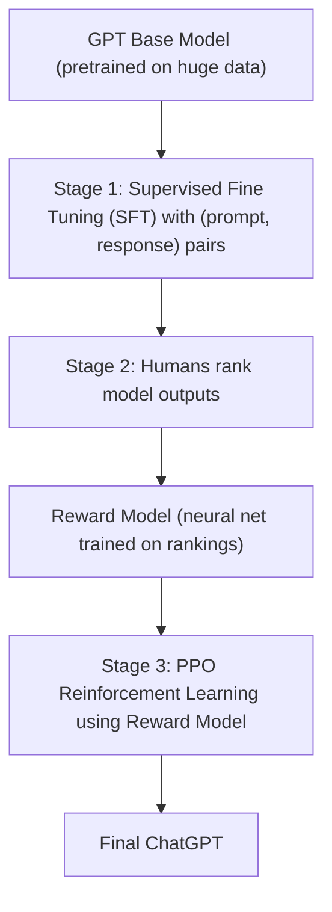
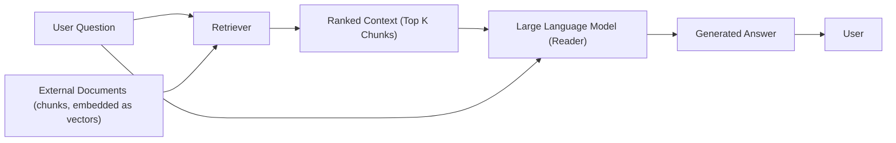

# Lecture 12: Large Language Models and Retrieval Augmented Generation (RAG)

**Course**: CST8507 Natural Language Processing
**Topic**: LLMs, their characteristics, limitations, and RAG-based question answering
**Developed by**: Hala Own, Ph.D.

> **Course note**: RAG is the technique used in your assignment. This lecture first establishes what a large language model is and the characteristics of different large language models, then shows how RAG works in a question answer system.

---

## 1. Language Model (LM) vs Large Language Model (LLM)

### Role of a Language Model

**Language Model (LM)**: a model whose role is to **generate text**, that is, to predict the next word or the completion of your text.

### What Changes with "Large"

A **Large Language Model (LLM)** also predicts what comes next, but it does so at massive scale.

- **Massive training data**: trained on huge amounts of text.
- **Massive generation capacity**: can generate a paragraph, a book, or huge amounts of data.
- **Different architecture**: LLMs are built on **transformers**, not RNNs or smaller networks.
- **Huge number of parameters** (in the billions).
- **Different objective**: a plain LM just predicts the next word. An LLM is used to perform **different NLP tasks** (classification, summarization, question answering, translation, and so on), not just text generation.

> **Key insight**: An LLM is a language model, but trained on a huge amount of data, using a different architecture (the transformer), with the aim of performing multiple NLP tasks rather than only generating text.

### Comparison Table *(added for clarity)*

| Aspect | Language Model | Large Language Model |
|---|---|---|
| Training data | Modest | Massive |
| Architecture | Often RNN/LSTM, n-gram, smaller networks | Transformer based |
| Parameters | Thousands to millions | Billions |
| Objective | Predict next word | Perform many NLP tasks |
| Generation scale | Sentence or short text | Paragraph, book, huge outputs |

---

## 2. Evolution of LLMs

The development of large language models starting from 2019 is huge. Improvement is measured not in years but **in months**, and within a single month there can be different versions of the same model. This chart of model development also reflects the amount of investment pouring into the field.

### Timeline of Publicly Available LLMs

| Year | Models |
|---|---|
| **2019** | T5, GPT-3 |
| **2020** | GShard, mT5, Codex |
| **2021** | PanGu-α, PLUG, Ernie 3.0, Jurassic-1, CPM-2, T0, HyperCLOVA, FLAN, Yuan 1.0, LaMDA, AlphaCode, Chinchilla, Anthropic, WebGPT, Ernie 3.0 Titan, Gopher, InstructGPT, CodeGen, GLaM, MT-NLG |
| **2022** | OPT, CodeGeeX, GPT-NeoX-20B, Tk-Instruct, GLM, Cohere, AlexaTM, WeLM, BLOOM, mT0, BLOOMZ, Galactica, OPT-IML, UL2, PaLM, YaLM, Sparrow, Flan-T5, Flan-PaLM, Luminous, NLLB, **ChatGPT** |
| **2023** | Pythia, Vicuna, PaLM2, Falcon, MOSS, PanGu-Σ, Bard, LLaMA, **GPT-4**, LLaMA2, InternLM, Qwen, Mistral, Deepseek, Mixtral |
| **2024** | Baichuan-4, Baichuan-3, InternLM2, Qwen2, DeepSeek-V2, LLaMA3, MiniCPM, Gemma, YuLan-Chat, StarCoder, CodeGen2, ChatGLM, DeepSeek-V3, Qwen2.5, Gemma-2, YuLan-Mini |

*Source: marktechpost.com (Wayne Xin Zhao et al.)*

Well known examples of recent LLMs include **ChatGPT** (OpenAI), **Llama** (Meta), **DeepSeek**, **Claude** (Anthropic), and **Gemini** (Google).

> **Course note**: The lecturer updates this chart every semester. The best chart found was from 2024. The rapid release cadence (every few months, sometimes new versions within a single month) reflects the huge investment in this field.

---

## 3. Components That Identify an LLM

Any large language model can be identified by specific components:

1. **Tokenization technique**
2. **Parameters** (the weights)
3. **Context length (context window)**
4. **Architecture** (transformer, as of the time of this lecture)

### 3.1 Architecture

Current LLMs (ChatGPT, Claude, Gemini, Llama, DeepSeek, and others) are all based on the **transformer architecture**.

> **Emerging research**: A recent paper discusses a different architecture called **Mamba**. It is not yet used on a large scale, but some research explores a **hybrid technique** between the transformer and Mamba. This is an open topic of research. For now, all well known LLMs still work on the transformer. In a few months, a different architecture may rise.

### 3.2 Parameters

**Parameter**: a **weight** inside the model. It is initialized at the beginning of training and then **adjusted during the learning process** according to the task.

#### Counting Parameters in a Small Neural Network *(reconstructed example)*

Imagine a simple fully connected neural network:

- 3 inputs
- 2 hidden layers of 4 neurons each
- 1 output neuron

The parameter count is built from weights + biases per layer:

| Layer | Weights | Biases | Total |
|---|---|---|---|
| Input to Hidden 1 | $3 \times 4 = 12$ | 4 | 16 |
| Hidden 1 to Hidden 2 | $4 \times 4 = 16$ | 4 | 20 |
| Hidden 2 to Output | $4 \times 1 = 4$ | 1 | 5 |
| **Total** | | | **41** |

> About 40 parameters for a tiny network. For a large language model, this number is in the **billions**. This is how many parameters have to be adjusted during training.

#### What More Parameters Means

> **Key idea**: With an increased number of parameters, the model has **more power to understand the problem**. That is why every new LLM tends to have an increased number of parameters.

#### Parameters and Resource Usage

Comparisons between common LLMs include:

- Number of parameters.
- Size on disk.
- Memory usage.
- Training resource cost.

> **Course advice**: When you decide to use an LLM, do **not** just look at the size of the model file on disk. You must also consider:
>
> 1. **Training data size**, because generation (inference) needs more space than the bare weights.
> 2. **Fine tuning overhead**, because fine tuning the model on your data needs additional space based on the size of your data.

#### Comparison Table of Popular LLMs

| Model | Parameters | Size on Disk | Memory Usage (Inference) | Learning Data Size |
|---|---|---|---|---|
| **BERT (Large)** | 340M | ~1.3 GB (FP32) | ~1.5 to 2 GB (FP16) | 3.3B words (~16 GB) |
| GPT-4o | ~200B | ~350 GB (FP32) | ~400 GB (FP16, single GPU) | 570 GB (~300B tokens) |
| LLaMA (13B) | 13B | ~26 GB (FP32) | ~26 GB (FP16) | ~1T tokens |
| LLaMA (70B) | 70B | ~140 GB (FP32) | ~140 GB (FP16) | ~1T tokens |
| **BLOOM (176B)** | 176B | ~352 GB (FP32) | ~352 GB (FP16) | 1.6T tokens |
| Mistral 7B | 7B | ~14 GB (FP32) | ~14 GB (FP16) | ~1T tokens |
| **Mixtral 8x7B** | 56B | ~112 GB (FP32) | ~112 GB (FP16) | Unknown (large corpus) |
| Grok (xAI) | Unknown (est. ~70B) | Est. ~140 GB (FP32) | Est. ~140 GB (FP16) | Unknown (large) |
| **PaLM (540B)** | 540B | ~1 TB (FP32) | ~1 TB (FP16) | 780B tokens |

*Source: Recent survey on large language models.*

> **Observation**: Model size can span from 340M (BERT Large) to 540B (PaLM). Memory usage closely tracks parameter count, and disk size depends on precision (FP32 vs FP16). PaLM at 540B requires about **1 TB** just to load the weights.

### 3.3 Example: A Multilingual, Multimodal Model

One LLM highlighted by the lecturer was interesting because it is trained on:

- **100 different natural languages**
- **20 different programming languages**
- Scientific papers
- Mathematical expressions

It serves as the base for another model called **Med-PaLM**, which is then fine tuned with enhanced medical data. Med-PaLM was tested on one of the US medical licensing tests. A particularly interesting capability is that you can feed the model with an **X-ray image** and it outputs an analysis report based on the findings in the X-ray, with very interesting results.

> **Key takeaway**: One of the most important things when choosing your model is to check **what the model was trained on**. If you have specialized data, find a model already trained on that type of data and use it as a fine tuning base.

### 3.4 Tokenizer

**Tokenizer**: how the LLM splits input text into tokens.

- Every LLM has a **different tokenization technique**.
- When you choose a model, you must also choose its equivalent tokenizer. That is why demos pair a model with a matching tokenizer.
- Different tokenizers produce **different numbers of tokens** for the same text. One model may produce 43 tokens, another may produce 48 for the identical input.

> **Interactive tool referenced in class**: [tiktokenizer.vercel.app](https://tiktokenizer.vercel.app/). You paste text, pick the model, and see how many tokens each tokenizer produces.

#### Why the Token Count Matters

1. **Price**: API providers charge per token. Different tokenization means different costs.
2. **Context**: fewer tokens for the same information means a **more contextual answer** because you fit more meaning into the context window. This leads directly into the next criterion, the context window.

#### Minimal Example of Loading a Matched Tokenizer *(added)*

```python
from transformers import AutoTokenizer, AutoModelForCausalLM

model_name = "gpt2"
tokenizer = AutoTokenizer.from_pretrained(model_name)
model = AutoModelForCausalLM.from_pretrained(model_name)

tokens = tokenizer("Large language models predict the next word.", return_tensors="pt")
print(tokens.input_ids.shape)
```

### 3.5 Prompts

You communicate with any LLM through a **prompt**.

> **How you interact with an LLM**: you feed the model with a prompt, and the model returns an answer. That is the complete interface for all LLMs.

### 3.6 Context Window

**Context window**: another parameter that identifies an LLM. It is defined as the **maximum number of tokens the LLM can process at once**, including:

- the **prompt**
- the **conversation history**
- the **generated answer**

Formally:

> **Context = number of tokens of the current prompt + tokens of any previous conversation + generated tokens**.

A larger context window means:

- You can have a **long conversation** on a specific topic.
- The model can perform **continuous reasoning** over the same topic for a huge number of tokens.

#### Comparison of Context Windows

| Model | Context Length |
|---|---|
| Gemma 2 | 32K tokens |
| Mistral | 32K tokens |
| LLaMA 3.1 | 128K tokens |
| Claude 3.5 | 200K tokens |
| GPT-4.1 | 1M tokens |
| **Gemini 1.5 Pro** | **1 to 2M tokens** |

*Source: Recent survey on LLMs.*

> **Example value**: **Gemini** has a context window of about **2 million tokens**. Approximately, 2 million tokens is about **3,000 pages**, which is very huge.

> **Key takeaway**: A larger context window generally means a more powerful LLM. It is one of the most important criteria.

---

## 4. Types of LLMs by Training Data

LLMs can be grouped based on the type of data they were trained on.

### 4.1 General Purpose LLMs

- Trained on mixed, general data (web text, multimedia content from the internet, and more).
- Example: the **GPT series**, including ChatGPT.
- Good for answering any kind of question on many topics.

### 4.2 Instructional / Instruction Tuned LLMs

- Trained on **instructional data** such as tutorials, manuals, and guidelines.
- Example: **AllenNLP's** instruction tuned models.
- Good for producing **step by step guides**.
- If you ask this kind of model for a step by step procedure, it performs well.

> Many models exhibit this ability, but you should always look at the training data. When you expect a specific type of output, verify that the training data supports it.

### 4.3 Conversational / Dialogue Tuned LLMs

- Trained on **conversational dialogue**, chit chat dialogue, customer service dialogue.
- Example: **Microsoft's DialoGPT**.
- Good for back and forth conversation tasks and customer support bots.

### 4.4 Domain Specific LLMs

- Trained only on data from a specific domain, such as the medical, health, education, or legal domain.
- **Example**: **BioBERT** (Bidirectional Encoder Representations from Transformers for Biomedical Text Mining), trained on biomedical literature.
- If your task involves medical data, look for a model trained on medical data. If you are working on legal data, look for a model trained in the matching way.

> **Course note**: The **assignment task model is a domain specific model**. Choose a model whose training data matches your target domain.

---

## 5. ChatGPT: What It Is and How It Was Trained

### 5.1 ChatGPT Is Not a Large Language Model

> **Clarification**: ChatGPT is **not** itself a large language model. ChatGPT is built on **GPT-4**, which is the LLM. ChatGPT is a **fine tuning of GPT-4** (the latest at this time), fine tuned specifically to conduct a conversation. You send a prompt, and the model returns an answer in a conversational style.

Starting from GPT-3, GPT is **not open source**, so the exact code is not available. Some other LLMs are open source and you can download the code, reproduce the training, and modify or retrain them (though reproducing requires huge computational resources and time). With GPT, training details are known only at a high level.

### 5.2 The High Level Training Pipeline of ChatGPT

The pipeline can be described in three stages on top of the pretrained base.

#### Stage 0: Pretraining

- The starting point is the **GPT base model**, a **pretrained** LLM trained on a huge amount of text.
- Once pretrained, the base model has broad knowledge of language.

#### Stage 1: Supervised Fine Tuning (SFT)

**"Collect demonstration data, and train a supervised policy."**

- A **prompt is sampled** from the prompt dataset. Example: *"Explain the moon landing to a 6 year old."*
- A **labeler demonstrates the desired output behavior**. Example: *"Some people went to the moon..."*
- This data is used to **fine tune GPT-3** with supervised learning (**SFT**).
- Humans prepare huge numbers of (prompt, response) pairs as labeled data.
- Result: a first fine tuned model that can respond to prompts.

#### Stage 2: Reward Model Training

**"Collect comparison data, and train a reward model."**

- A prompt and **several model outputs** are sampled.
- A **labeler ranks the outputs from best to worst**, for example $D > C > A = B$.
- This data is used to train the **reward model (RM)**.
- The reward model's job is to predict which response would receive the highest human rank for any given prompt.

#### Stage 3: Reinforcement Learning (RLHF)

**"Optimize a policy against the reward model using reinforcement learning."**

- A **new prompt** is sampled from the dataset, for example *"Write a story about frogs."*
- The policy generates an output using **PPO** (Proximal Policy Optimization).
- The **reward model calculates a reward** for that output.
- The reward is used to **update the policy using PPO** (the parameter update step often denoted $r_k$).
- Reinforcement learning involves an **agent deployed in an environment that collects rewards**. Here, the reward comes from the reward model.
- The result is called **Reinforcement Learning with Human Feedback (RLHF)**.

#### Putting the Stages Together *(added diagram)*



> **Lecturer note**: The lecturer noted that students may know reinforcement learning better than she does. The objective of PPO here is to optimize the policy (how the SFT model generates answers) based on the reward from the reward model.

### 5.3 Modern Training Lab Techniques

Modern training goes beyond the original pipeline.

#### Multimodal Inputs in ChatGPT-4

ChatGPT-4 accepts **multimodal inputs**: text, images, and audio. This is one of the important features of GPT-4.

#### Claude and Constitutional AI (CAI)

**Constitutional AI (CAI)** is the concept behind Claude's training. It is used by modern labs such as Anthropic for Claude, and by OpenAI for GPT-4o.

Guided by constitutional principles: **helpful, harmless, ethical, virtuous**.

##### 1. Supervised Learning (SL) Stage

Revises harmful AI responses through iterative self critique and fine tuning.

Steps:

1. **Generate responses** to harmfulness prompts.
2. **Critique and revise** the response.
3. **Fine tune with SL** on the final revised responses.

##### 2. Reinforcement Learning (RL) Stage

Uses AI evaluations of responses according to constitutional principles to generate preference data for harmlessness. This trains a new model via **Reinforcement Learning from AI Feedback (RLAIF)**.

Steps:

4. **AI generates a dataset of preferences** for harmlessness, asking "Which is better according to constitutional principles?"
5. **Train a preference model** on that dataset.
6. **Fine tune the original SL model with RL** using the new preference model (this is **RLAIF**).

> **Motivation**: The previous pipeline has a lot of human work, which is **expensive and slow**. Constitutional AI removes the human work by letting AI evaluate itself against declared principles. After the model generates an output, the evaluator (AI) ranks it based on the same constitutional principles.

Similar models now follow this approach of getting rid of core human labor during training, using the AI to self evaluate against declared principles.

*Image source*: https://www.anthropic.com/news/claudes-constitution

#### Comparison of Training Pipelines *(added)*

| Aspect | Classic RLHF (early GPT) | Constitutional AI (Claude, GPT-4o) |
|---|---|---|
| Human ranking | Required for every output | Only for initial principles |
| Self critique | No | Yes |
| Preference feedback source | Humans (RLHF) | AI (RLAIF) |
| Cost and speed | High cost, slow | Lower cost, faster |
| Guiding framework | Human judgment | Declared principles ("constitution") |

---

## 6. Limitations of LLMs

LLMs still have limitations. Several of them are listed below.

### 6.1 Training Cutoff

- The model is trained on data up to a **cutoff date**. The model itself is **static**.
- In 2023 this was a huge problem, you got "I am afraid to tell specific facts" for anything recent.
- **Mitigation (workaround, not a fix)**: the model can now **connect to the internet**, search, and return current information. Still, the underlying model has a cutoff.

> **New limitation introduced by the mitigation**: once the model searches the internet it can pull in **unreliable information**, **noise**, and must **integrate** results coming from different resources. This is still an open research topic.

#### Real World Example: GPT-5 Model Card

Screenshot taken **Nov 9, 2025**:

| Attribute | Value |
|---|---|
| Reasoning | Higher |
| Speed | Medium |
| Price | **$1.25 input, $10 output** (per million tokens) |
| Input | Text, image |
| Output | Text |
| Context window | **400,000 tokens** |
| Max output tokens | 128,000 |
| **Knowledge cutoff** | **Sep 30, 2024** |
| Reasoning token support | Yes |

GPT-5 is OpenAI's flagship model for coding, reasoning, and agentic tasks across domains.

> **Key observations**: even the flagship model has an explicit knowledge cutoff (Sep 30, 2024), a finite context window (400K), and a per token price split between input and output tokens.

### 6.2 Limited Context Size

Even with 2 million tokens (roughly 3,000 pages, about 4 or 5 books), context size is still a limitation, but for subtler reasons.

- Recent research shows LLMs are **good at the beginning** and **end** of the context, but perform poorly at the **middle**. This is sometimes called the "lost in the middle" problem.
- In long conversations the model correctly remembers the opening and closing but the middle performance is weaker.
- Searching for **finite, specific pieces of information** in a very long context is hard for LLMs.
- Extremely long contexts can actually **degrade output quality**.

> **Summary**: Context was a hard limit in 2023 (small context windows). Now with 2 million tokens, huge conversations are possible and the model can stay on topic, but the mid context recall problem remains an open research topic.

### 6.3 Consistency and Hallucination

You may still get **inconsistent feedback** from an LLM for the same or similar prompts. This has improved hugely over the early days, but sometimes you still see an output and wonder "what is this answer?"

**Hallucination**: a related challenge where the model produces confident sounding content that is factually wrong. A well known cautionary example is **Galactica**, a science focused LLM that was pulled from public demo after it generated convincing but incorrect scientific claims.

### 6.4 Lack of a Specialized Domain at Scale

Most of the big, well funded LLMs are **general purpose**. Specialized (domain specific) LLMs are **not huge**, because:

- The audience for a specialized model is limited.
- Not everyone can use it.
- Companies therefore invest more in general purpose models.

### 6.5 Lack of Transparency

LLMs have a **huge number of parameters** and are **very deep neural networks**. Their internal reasoning is **hard to understand or interpret**.

### 6.6 Privacy and Security

> **Anecdote from the lecturer**: one colleague asked ChatGPT, "What do you know about me?", and it returned a whole profile. There is no safe information, privacy is no longer right.

Concerns include:

- Personal data being accessible through the model.
- **Copyright** issues, especially with generated images.
- Data fed by users potentially being retained.

### 6.7 Environmental Impact

Training huge models consumes **huge energy**. For example, training for 24 days with high electrical consumption has a significant environmental impact. This is a real challenge of using LLMs.

### 6.8 High Computational Cost

Running an LLM requires a **high computational power** computer, because:

- The model is huge.
- The size on disk is huge.
- The number of parameters is huge.
- **Inference itself needs extra space** beyond just storing the weights.

This is why workaround solutions (such as fine tuning smaller models or using hosted APIs) are often used.

---

## 7. Retrieval Augmented Generation (RAG)

### 7.1 Motivation

One workaround to mitigate the cutoff limitation of an LLM is to **augment the model with extra documentation**. This is the idea of **Retrieval Augmented Generation (RAG)**.

RAG combines:

1. The power of **information retrieval**, which can easily extract information from huge numbers of documents.
2. The power of **text generation** from an LLM, which can generate a coherent answer.

#### Why RAG (Motivations Summary)

- **Domain specific accurate answering**: answers grounded in your documents, not the LLM's general memory.
- **Frequent updates of data**: swap or re index your document store without retraining the LLM.
- **Traceability and explainability**: you can trace a generated answer back to the source chunks.
- **Controllable cost**: you do not retrain a huge model, you only update the document store.
- **Privacy protection of data**: sensitive documents stay in your own store, the LLM uses them only as context.

### 7.2 What Is RAG

**RAG**: a combination of two techniques. An LLM provides the powerful capacity to generate text, and extra documents are fed to the model to make sure the answer comes from this specific documentation.

Components:

- **Retriever**: external, retrieves relevant content from the document store.
- **Reader**: the LLM, which reads the retrieved content and generates an answer.

> **Core idea**: feed the LLM with a retriever plus a reader. The retriever pulls external documentation so that the answer to your question comes from those specific documents.

### 7.3 How RAG Works, Step by Step

#### Prerequisite: Create the Knowledge Base

A three step preprocessing pipeline prepares the documents before any user question is asked:

1. **Collect**: gather documents (Document 1, Document 2, and so on).
2. **Divide**: split each document into chunks.
3. **Embed**: turn each chunk into a vector, for example $[0.48, 0.33, \ldots, -0.51]$.

#### High Level Pipeline

1. **Collect documents** based on your domain (medical, education, legal, and so on).
2. **Divide documents into chunks** using a chunking technique.
3. **Embed each chunk** into a vector using an embedding technique.
4. Store the vectors in a **vector database**.
5. **User asks a question** (the query).
6. The query is embedded and compared with chunk vectors in the vector database.
7. **Top ranked chunks are returned** as context.
8. The **LLM generates an answer** using the retrieved context.
9. The answer goes back to the user.

> **Key point**: you keep the strength of the LLM, which is its knowledge of language structure, while forcing the output to be grounded in your external documents.

#### Detailed Flow *(reconstructed diagram)*



#### Classic Retriever plus Reader Diagram (from the slides)

```
Input Text (Question)
        |
        v
   Retriever (BM25, dense vector, etc.)  <->  External Knowledge
        |
        v Ranked Context
    Reader (LM: BERT, GPT, etc.)
        |
        v
   Output Text (Answer)
```

**Retriever tools mentioned**: TF-IDF, Chroma, Weaviate, Milvus, Qdrant, Elasticsearch, FAISS.

*Source: Hands-On Large Language Models, O'Reilly, 2024.*

#### More Detail on the Retrieval Step

- You feed the model with the **question**.
- The retriever has access to the **external knowledge**, which is your documentation already prepared as a vector representation.
- Inside the retriever, you can **encode or embed documents in different ways**. You compute a high dimensional embedding vector per chunk.
- **Similarity metrics**: many options are available, including **Euclidean distance**, **cosine similarity**, **KNN (k nearest neighbors)**, and **inner product**. Any such metric can be chosen.
- Information is **indexed** using the retriever.
- The retriever returns a **ranked context**, which is fed to the LLM.
- The LLM generates the answer **based on this context**, using its knowledge of language **structure**.

> **Key idea**: use the LLM's strengths (high linguistic knowledge, understanding of language structure) but let it **generate output grounded in your external documents**.

#### Named Pipeline Stages *(from the slides)*

1. **Parsing**: Document Corpus to Chunked Documents.
   - Example corpus text: *"LLMs are first pre-trained, then they undergo alignment via SFT and RLHF. After this, applying them in practice requires a combination of fine-tuning and in-context learning."*
   - Split into chunks.
2. **Indexing**: Chunks go through an **Embedding Model** to produce **Chunk Embeddings**, which are stored in a **Vector DB**.
3. **Semantic search**: the user prompt (e.g., *"What are the three primary training techniques for an LLM?"*) is sent to a search engine that queries the Vector DB for the most similar chunks, returning **Retrieved Chunks**.
4. **Add Data to the Prompt**: the retrieved chunks (for example *"LLMs are first pre-trained, then they undergo"* and *"alignment via SFT and RLHF. After this,"*) augment the prompt given to the LLM.

*Source*: https://cameronrwolfe.substack.com/p/a-practitioners-guide-to-retrieval

### 7.4 Architecture as a Question Answer System

This is another architecture for a question answer system. We take an LLM, combine it with a document store based on information retrieval (an NLP discipline), and produce answers grounded in the store.

The two main components are:

- **Retriever**
- **Reader** (the LLM)

This is the same idea as earlier question answer architectures, but the reader is now an LLM rather than a smaller model.

### 7.5 Full RAG Life Cycle

1. **Document corpus**: huge collection of source documents.
2. **Chunking**: divide documents into chunks. You decide the size of each chunk (more on this below).
3. **Embedding**: each chunk is converted into a **high dimensional vector**.
4. **Vector database**: the critical storage and indexing layer.
5. **Query**: the user sends a prompt.
6. **Optimization search**: search the vector database with the prompt, pick the best matching vectors (chunks).
7. **Return**: retrieved chunks go back to the prompt.
8. **Answer generation**: the LLM uses the prompt plus retrieved chunks to produce the answer.

> **Course note**: Each cycle uses the same steps. You do not change the cycle, you only choose which technique (chunking, embedding, similarity metric, vector database, LLM) you use at each step. These techniques are already available in libraries. You do not write code from scratch, but you **must really understand what is going on at each step**.

---

## 8. Vector Databases

### 8.1 What Is a Vector Database

A **vector database** stores **vectors (embedding vectors)** instead of structured rows.

> **Key difference from a normal database**: a classical database holds **structured data** and you query for **exact matches**. A vector database holds **embedded vectors** and you query for **similarity**.

It is the first time, after the rise of AI, that we hear the word "database" used in a non traditional sense.

### 8.2 Why Vector Databases Matter

The power of a vector database lies in:

1. **How it indexes the vectors**, so that similar chunks are located near each other.
2. **How quickly it retrieves vectors** given a query.

> When the user asks a question, the retrieval must be **very, very fast**. Optimization is critical.

> **Key idea**: You do not search for an **exact match** like in a classic database, you search for a **similarity** between the query vector and stored chunk vectors.

### 8.3 Criteria That Differentiate Vector Databases

- **Indexing techniques** (the main differentiator).
- Retrieval speed.
- Similarity metric support (Euclidean, cosine, inner product, KNN, and so on).

### 8.4 Examples of Vector Databases

Some are **open source**, some are **closed source**. Some are **dedicated vector databases**. Others are **traditional databases that have added vector search support**.

#### Dedicated Vector Databases

- **Open source (Apache 2.0 or MIT license)**: Chroma, Marqo, Vespa, Qdrant, LanceDB, Milvus.
- **Source available or commercial**: Weaviate, Pinecone.

#### Databases That Support Vector Search

- **Open source**: OpenSearch, ClickHouse, PostgreSQL (with `pgvector`), Cassandra.
- **Source available or commercial**: Elasticsearch, Redis, Rockset, SingleStore.

*Source*: https://blog.det.life/why-you-shouldnt-invest-in-vector-databases-c0cd3f59d23c

#### Quick Comparison Table

| Vector Database | Type | Notes |
|---|---|---|
| **Chroma** | Open source, dedicated | One of the top open source vector databases and a common choice |
| **Pinecone** | Commercial, managed | Popular managed service |
| **Weaviate** | Source available, dedicated | Rich feature set |
| **Milvus / Qdrant / LanceDB** | Open source, dedicated | Production grade options |
| **FAISS** | Open source library | Library more than service |
| **pgvector (Postgres extension)** | Open source, extension | Postgres recognized the importance of vector bases and now includes vector support |
| **Elasticsearch / Redis** | Commercial, DB with vector search | Extension of a well known DB |

> **Course recommendation**: Chroma is one of the top open source vector databases at this time and a good default choice for RAG systems.

### 8.5 Minimal Chroma Example *(added)*

```python
import chromadb
from chromadb.utils import embedding_functions

client = chromadb.Client()
embedder = embedding_functions.SentenceTransformerEmbeddingFunction(
    model_name="all-MiniLM-L6-v2"
)

collection = client.create_collection(name="medical_docs", embedding_function=embedder)

collection.add(
    documents=["Aspirin reduces fever.", "Insulin regulates blood sugar."],
    ids=["chunk_1", "chunk_2"]
)

results = collection.query(query_texts=["What controls blood sugar?"], n_results=1)
print(results)
```

---

## 9. Chunking Techniques

How do you split a document into chunks that get embedded?

### 9.1 Fixed Size Chunking

- **Rule**: fix a number of tokens or characters per chunk.
- **Optional variant**: add an **overlap** between adjacent chunks.

**Pros**:

- Fast.
- Easy to implement.

**Cons**:

- The answer might fall on the **border** between two chunks and be cut in half.
- There is **no semantic meaning** behind the chunk boundaries. The splitter ignores sentence and paragraph structure.

#### Worked Example: `Llama 2 was trained on 40% more data than Llama 1`

| Strategy | Chunks |
|---|---|
| **Character split (every 15 characters)** | `Llama 2 was tra` , `ined on 40% mor` , `e data than Lla` , `ma 1` (no overlap) |
| **Token split (every 5 tokens)** | `Llama 2 was trained on` , `40% more data than Llama` , `1` |
| **Token split (every 5 tokens, 1 overlapping token)** | `Llama 2 was trained on` , `on 40% more data than` , `than Llama 1` (overlapping tokens) |

*Source: Hands-On Large Language Models, O'Reilly, 2024.*

### 9.2 Semantic Chunking (Natural Boundaries)

Improves on fixed size by dividing based on **semantic meaning**, which the slides refer to as splitting on **natural boundaries**.

- **Each sentence is a chunk**: Chunk 1 vector, Chunk 2 vector, and so on (potentially many small chunks, for example 15 per paragraph).
- **Each paragraph is a chunk**: Chunk 1, 2, 3 vectors (fewer, larger chunks).
- **Overlapping window of sentences**: Chunk 1, 2, 3 vectors with shared sentences between adjacent chunks.

*Source: Hands-On Large Language Models, O'Reilly, 2024.*

**Pros**:

- More semantically meaningful boundaries.

**Cons**:

- **Variable chunk size** becomes a new problem that the vector database must handle (different lengths, different embedding quality, different retrieval behavior).

### 9.3 Comparison of Chunking Techniques *(added table)*

| Technique | Semantic Meaning | Chunk Size | Border Problem | Implementation |
|---|---|---|---|---|
| Fixed size | No | Uniform | Yes | Easy |
| Fixed size with overlap | No | Uniform, overlapping | Reduced | Easy |
| Semantic (by sentence / paragraph) | Yes | Variable | Possible | Medium |
| Semantic with overlap | Yes | Variable, overlapping | Reduced | Medium |

---

## 10. Prompt Templates for RAG

To communicate with an LLM in a RAG system, you use a **prompt template**. The template contains a fixed structure plus variables for the question and the retrieved context.

### Template Example (from the slides)

```
Prompt_Templet = "answer the question based only the following context:{context}
---
Answer the question based on the above context :{question}"
```

- Anything between **curly brackets** is a variable that gets filled in at query time.
- `{context}` is populated from the top K chunks retrieved from the vector database.
- `{question}` is the user's original query.
- The template is **copy pasted for any of your questions**, only the variables change.

### Reconstructed Python Example *(added)*

```python
from langchain.prompts import PromptTemplate

template = """Answer the question based only on the following context:
{context}

Question: {question}

Answer:"""

prompt = PromptTemplate(
    template=template,
    input_variables=["context", "question"],
)

formatted = prompt.format(
    context="Aspirin reduces fever and pain.",
    question="What does aspirin do?",
)
print(formatted)
```

---

## 11. Measuring the Quality of a RAG System

There are two main criteria for evaluating a RAG system's output, based on the **returned chunks**.

### 11.1 Rank vs Relevance

> **Important distinction**:
>
> - **Rank** is the position assigned by the retrieval model to a chunk. It is the output of the model.
> - **Relevance** is the human judgment of whether the chunk is actually relevant to the question. This is the **user's judgment**.

For your assignment, you get the chunks, inspect them, and assign your own relevance scores. The model's rank and the user's relevance rank may differ.

#### Example

- A document returned at model rank 1 may actually be **not relevant**, so the user gives it a relevance score of 2 or 3.
- Another document at model rank 3 may be the most relevant, so the user gives it a relevance of 1.
- Any RAG quality metric uses this difference between the two rankings.

### 11.2 Top K Cut Off

Because retrieval returns many chunks, you usually **cut off** at a specific top K: top 3, top 4, top 5, top 10, and so on. The choice of K is a parameter of your system.

### 11.3 Normalized Discounted Cumulative Gain at K (NDCG@K)

The main metric introduced in the lecture is **NDCG@K**.

#### Formula

**Discounted Cumulative Gain** at rank K:

$$\text{DCG@K} = \sum_{i=1}^{K} \frac{l_i}{\log_2(i + 1)}$$

Where:

- $l_i$ is the **relevance score** at position $i$.
- $\log_2(i + 1)$ is the **position based penalty**. Documents that appear at lower ranks (higher $i$) are penalized more.

**Ideal DCG (IDCG@K)** is the DCG you would get if the chunks were sorted by relevance in descending order. That is, you sort the relevance scores and recompute DCG as if the ranking were perfect.

**Normalized DCG**:

$$\text{NDCG@K} = \frac{\text{DCG@K}}{\text{IDCG@K}}$$

#### Properties

- Value is **between 0 and 1**.
- If the rank is perfect (rank ordering matches relevance ordering), NDCG@K equals **1**.
- If rank and relevance are the same, the ratio equals 1.

### 11.4 Worked Example (from the slides)

Assume 5 document chunks, K = 5.

| Rank | Chunk | Relevance ($rel_i$) |
|---|---|---|
| 1 | Chunk text 1 | 1 |
| 2 | Chunk text 2 | 3 |
| 3 | Chunk text 3 | 2 |
| 4 | Chunk text 4 | 0 |
| 5 | Chunk text 5 | 1 |

**DCG computation**:

- $1 / \log_2(2) = 1.00$
- $3 / \log_2(3) \approx 1.89$
- $2 / \log_2(4) = 1.00$
- $0 / \log_2(5) = 0.00$
- $1 / \log_2(6) \approx 0.39$
- **Total DCG $\approx$ 4.28**

**Ideal sorted relevance**: $[3, 2, 1, 1, 0]$.

**IDCG computation**:

- $3 / 1 = 3.00$
- $2 / 1.585 \approx 1.26$
- $1 / 2 = 0.50$
- $1 / 2.32 \approx 0.43$
- $0 / 2.585 = 0.00$
- **Total IDCG $\approx$ 5.19**

$$\text{NDCG@5} = \frac{\text{DCG}}{\text{IDCG}} = \frac{4.28}{5.19} \approx 0.82$$

> **Lecturer note**: The lecturer walked through an example step by step, computing DCG for each chunk, summing the total, sorting the relevance in descending order, computing IDCG, and dividing to get the final NDCG@K.

### 11.5 Other Quality Measures Mentioned

#### Reciprocal Rank at K (RR@K)

$$RR = \frac{1}{\text{rank of the first relevant chunk}}$$

Where `rank` is the rank of the first relevant chunk returned by the retriever.

#### Recall at K

$$\text{Recall@}k = \frac{|\text{relevant in top } k|}{|\text{relevant}|}$$

Recall at K is the fraction of all relevant chunks that appear in the top K results.

#### Precision at K

$$\text{Precision@}k = \frac{|\text{relevant in top } k|}{k}$$

Precision at K is the fraction of the top K that are relevant.

| Metric | What It Captures |
|---|---|
| **NDCG@K** | Ranking quality, weighted by relevance and penalized by position |
| **RR@K** | How high the first relevant chunk is ranked |
| **Recall@K** | Coverage of relevant items within the top K |
| **Precision@K** | Purity of the top K, how many are actually relevant |

### 11.6 Assignment Note

> **Course note**: For the project, the lecturer asked students to **test their model**. You extract the retrieved chunks and **manually check** the output for relevance. You can use NDCG@K, RR@K, or Precision@K as the quality measure. Techniques that rely on AI self evaluation exist, but for your project, a manual check is required.

---

## 12. Important LLM Parameters: Temperature and Top P

One important setting is controlling **how deterministic** the model is when generating completions for prompts. Two important parameters to keep in mind are **temperature** and **top_p**.

### 12.1 Temperature

**Temperature**: controls how **deterministic** the model's output is.

- Lower temperature (close to 0): more deterministic, the model picks the most likely next word.
- Higher temperature: more random and creative, the model samples from a wider distribution.

### 12.2 Top P (Nucleus Sampling) and Top K

- **Top P**: sample from the smallest set of words whose cumulative probability exceeds P.
- **Top K**: sample only from the top K highest probability words. *(added for completeness alongside Top P.)*

### 12.3 Practical Guidance

- **Keep temperature and top_p LOW** if you are looking for **exact answers** (for example, RAG question answering where you want grounded, precise responses).
- **Keep them HIGH** if you are looking for **more diverse responses** (creative writing, brainstorming).

> **Key takeaway**: When you create or deal with an LLM, always keep temperature and top P in mind. They directly shape how deterministic or creative the output is.

---

## 13. Frameworks for Building RAG Systems

Many frameworks, most of them open source, are available to solve RAG tasks. Their typical capabilities include:

- Developing and experimenting with prompts.
- Evaluating prompts.
- Versioning and deploying prompts.

Tools shown in class: **Dyno (Prompt Engineering IDE)**, **LangChain**, **Haystack**, **LlamaIndex**, **DUST**, **PROMPTABLE**.

*More tools*: https://github.com/dair-ai/Prompt-Engineering-Guide#tools--libraries

### 13.1 Haystack

**Haystack** is an open source framework for implementing any RAG system. It provides:

- A vector store.
- A document store.
- Document data handling.
- LLM integration (you can choose among models).

### 13.2 LangChain

**LangChain** is extremely popular for RAG, and for good reason: it is an **ecosystem** with a huge number of tools and techniques in one place.

Key LangChain features:

- **Modular architecture** for flexible and adaptable LLM integrations.
- **Chaining together** multiple services beyond just LLMs.
- **Goal driven agent interactions** instead of isolated calls.
- **Memory and persistence** for statefulness across executions.
- **Open source access** and community support.

*Docs*: https://python.langchain.com/docs/get_started/introduction

#### LangChain Integrations Ecosystem

LangChain offers **507 integrations** across categories:

| Category | Count |
|---|---|
| Document Loaders | 157 |
| Vector Stores | 57 |
| Embedding Models | 43 |
| Chat Models | 19 |
| LLMs | 73 |
| Callbacks | 26 |
| Tools | 101 |
| Toolkits | 18 |
| Message Histories | 13 |

**Popular Document Loaders**: AirbyteJSONLoader, ApifyDatasetLoader, UnstructuredHTMLLoader, UnstructuredPDFLoader, UnstructuredCSVLoader, UnstructuredURLLoader, OnlinePDFLoader, UnstructuredMarkdownLoader, UnstructuredFileLoader, UnstructuredExcelLoader, UnstructuredFileIOLoader, UnstructuredODTLoader, UnstructuredAPIFileIOLoader, UnstructuredAPIFileLoader, UnstructuredEPubLoader.

> **Course recommendation**: LangChain is the recommended framework for the RAG assignment because of its ecosystem depth. You are still free to pick a different framework if it fits your problem better.

### 13.3 Minimal LangChain RAG Sketch *(added reconstruction)*

```python
from langchain.document_loaders import TextLoader
from langchain.text_splitter import RecursiveCharacterTextSplitter
from langchain.embeddings import HuggingFaceEmbeddings
from langchain.vectorstores import Chroma
from langchain.llms import Ollama
from langchain.chains import RetrievalQA

docs = TextLoader("medical_corpus.txt").load()
chunks = RecursiveCharacterTextSplitter(chunk_size=500, chunk_overlap=50).split_documents(docs)

embeddings = HuggingFaceEmbeddings(model_name="all-MiniLM-L6-v2")
vector_store = Chroma.from_documents(chunks, embeddings)

llm = Ollama(model="llama3")
qa_chain = RetrievalQA.from_chain_type(llm=llm, retriever=vector_store.as_retriever(search_kwargs={"k": 5}))

answer = qa_chain.run("What controls blood sugar?")
print(answer)
```

---

## 14. Open Source vs Closed Source LLMs

- **Open source LLMs**: you can download them to your computer and work with them locally. Many are available.
- **Closed source LLMs**: you must pay to access the API key, typically charged per token.

> **Course note for the assignment**: there is no need to use a paid model. Work with any open source LLM. Even if performance is not as strong, this is preferred.

### 14.1 Core Open Source General Purpose Models

- **Meta Llama 3**
- **Mistral AI**
- **Qwen**
- **Gemma 3**
- **Deepseek R1**
- **Microsoft Phi-4**
- **Gemma 3N** (powerful and efficient, runs natively on phones, tablets, and laptops)
- **Falcon 3** (redefining AI with lightweight power)

### 14.2 Matching an LLM to Your Computer

Every LLM tends to have **different versions** (sizes). Pick the version that fits the RAM you have available.

#### 8 GB RAM (Laptop or Low End PC)

| Model | Size on Disk | Ollama Command |
|---|---|---|
| **Llama 3.3 8B** | 4.9 GB | `ollama pull llama3.3:8b` |
| **Mistral 7B** | 4.1 GB | `ollama pull mistral:7b` |
| **DeepSeek R1 7B** | ~5 GB | `ollama pull deepseek-r1:7b` |
| **Phi-4** | ~4 GB | `ollama pull phi4` |

*Source*: https://wp.astera.com/type/blog/open-source-vs-closed-source-llms/

#### 16 GB RAM (Mid Range Workstation)

| Model | Size on Disk | Ollama Command | Q&A Strength |
|---|---|---|---|
| DeepSeek R1 14B | ~9 GB | `ollama pull deepseek-r1:14b` | Chain of thought Q&A |
| Qwen 2.5 14B | ~9 GB | `ollama pull qwen2.5:14b` | Multilingual Q&A |
| Phi-4 14B | ~8 GB | `ollama pull phi4:14b` | Analytical reasoning |

### 14.3 Ollama

All the locally runnable models discussed in class work on **Ollama**.

**Ollama**: lets you download and run an LLM **locally** on your computer.

#### Typical Ollama Command

```bash
ollama pull llama3
ollama run llama3
```

**Model libraries to browse**:

- https://ollama.com/library
- https://lmstudio.ai/models

> **Course note**: Students already have experience using Ollama from earlier assignments.

---

## 15. Environments for Running LLMs

There are different environment systems (tools) to run and host open source LLMs:

- **Ollama**
- **vLLM**
- **Hugging Face**
- **LM Studio**

### 15.1 Local Environments

- **Ollama**: local, open source, most popular for local LLMs.
- **LM Studio**: local, open source, very similar to Ollama.

Both are **free** and run locally.

### 15.2 Cloud Environments

- **vLLM**: cloud or on premise, optimized for large scale throughput.
- **Hugging Face**: cloud based (also offers local usage, but the hosted API is cloud).

### 15.3 How to Choose: Local vs Cloud

The choice depends on **the business logic** of your application.

**Choose local** if:

- You want **full control** over the model.
- You do **not need internet access** to run the application.
- Your use case is on premise.

**Choose cloud** if:

- You work as or with a **service provider**.
- You want to access your application **from anywhere**.
- You want **automatic scaling up and down** based on the number of users. Cloud providers scale automatically: more users means more resources allocated automatically.
- Users can come and go at any scale.

> **Contrast**: Running locally requires **extra storage and extra resources** on your computer to scale up (you handle scaling yourself). Running on the cloud offloads scaling to the provider but requires internet access.

### 15.4 Comparison Table: Ollama vs vLLM vs Hugging Face

| Factor | Ollama | vLLM | Hugging Face |
|---|---|---|---|
| **Ease of use** | Very user friendly | Requires more technical setup | User friendly with extensive docs |
| **Performance** | Optimized for smaller models | Highly optimized for large scale models | Good performance with scaling options |
| **Scalability** | Limited | High | Scalable with managed services |
| **Integration and flexibility** | Limited flexibility | High flexibility for advanced users | High flexibility, integration into multiple tools |
| **Model support** | Popular open source models | Popular open source models | Extensive (Transformers, etc.) |
| **Deployment** | Local | Cloud or on premise | Cloud or on premise |
| **Use case** | Ideal for small to medium scale | Best for high throughput, enterprise level use | Great for research, fine tuning, both small and large scale |

> **Course note**: LM Studio is omitted from the above comparison because it is essentially the same as Ollama for the local use case. Both are open source and local.

---

## 16. LangChain and Open Source Summary

LangChain is **open source**, which is one reason it is recommended. You do not need to adjust to the licensing terms of a commercial framework.

The slides explicitly group LangChain with "Open Source" tooling, meaning students can use it freely without licensing concerns.

---

## 17. Choosing an LLM: Benchmarks and Leaderboards

Every single day new LLMs are introduced. How do you choose among them? There are **two main benchmark comparison sources**.

### 17.1 Community Driven Leaderboard

- **Community driven ranking**, updated daily based on community feedback and voting.
- Not based on standardized benchmark metrics, but on **user votes** across tasks.
- Example: Claude might appear at the top for a given task because many users voted for it.
- Rankings are **category specific**. The top model for **math** may be different from the top model for **instruction following**, which may be different from the top model for **coding**.

#### Sample Leaderboard Snapshot

| Model | Overall | Expert | Hard Prompts | Coding | Math | Creative Writing | Instruction Following | Longer Query |
|---|---|---|---|---|---|---|---|---|
| claude-opus-4-6-thinking | 1 | 2 | 1 | 1 | 2 | 1 | 1 | 1 |
| claude-opus-4-6 | 2 | 1 | 2 | 2 | 3 | 5 | 2 | 2 |
| gemini-3.1-pro-preview | 3 | 4 | 3 | 3 | 4 | 4 | 3 | 3 |
| grok-4.20-beta1 | 4 | 22 | 5 | 6 | 17 | 2 | 10 | 13 |
| gemini-3-pro | 5 | 10 | 7 | 11 | 5 | 3 | 8 | 6 |
| gpt-5.4-high | 6 | 3 | 4 | 4 | 1 | 10 | 4 | 7 |
| grok-4.20-beta-0309 | 7 | 12 | 6 | 7 | 16 | 7 | 16 | 18 |
| gpt-5.2-chat-latest | 8 | 16 | 8 | 8 | 12 | 15 | 11 | 15 |
| gemini-3-flash | 9 | 14 | 12 | 19 | 7 | 9 | 15 | 14 |
| claude-opus-4-5 | 10 | 7 | 9 | 5 | 8 | 6 | 5 | 4 |
| grok-4.1-thinking | 11 | 25 | 18 | 25 | 28 | 22 | 33 | 30 |

*Source*: https://huggingface.co/spaces/lmarena-ai/chatbot-arena-leaderboard

> **Observation**: rankings shift dramatically across categories. For example, `grok-4.20-beta1` is 4th overall but 22nd on the Expert category. Choose by task, not by overall rank alone.

> **Key idea**: The best model **depends on your task**. ChatGPT-4 is the highest overall ranked, but may not be the best for your specific task. Invest time in this leaderboard to find the best model for the task you care about.

### 17.2 HELM (Holistic Evaluation of Language Models)

**HELM** is the more standardized benchmark.

- Run by **Stanford University**.
- Tests models against **benchmark datasets**, not community votes.
- Applies the **same model** to **different benchmark datasets** and ranks based on those results.
- Pipeline: **Scenarios + Models** go into HELM, which produces a **ranked evaluation output**.

#### HELM Evaluation Dimensions (from the slides)

- **Accuracy**
- **Calibration**
- **Robustness**
- **Fairness**
- **Bias**
- **Efficiency**

Additional dimensions discussed in class:

- **Safety** (which model is safest)
- **Power in specific fields**
- **Ethics**
- **Privacy preservation** (which model preserves privacy)

> **Course recommendation**: HELM is the **standard and more professional source** for looking at LLM rankings. It shows scenario specific results (for example, book scenarios or course description scenarios, each with its own ranking). The community leaderboard is also acceptable.

### 17.3 Practical Advice

> **Key takeaway**: **Do not use an LLM just because it is famous or new.** Look at the benchmark numbers, and choose the model that best fits your task and your constraints (accuracy, fairness, bias, efficiency, privacy, safety).

---

## 18. Q&A Closing

> *"The smartest people are those who ask questions."* (Einstein)

The lecture ended with an invitation to ask questions.

---

## 19. Key Takeaways

*(added synthesis section for review)*

> **LLM vs LM**: An LLM is a language model trained on massive data, on a transformer architecture, with billions of parameters, designed to perform many NLP tasks, not just next word prediction.

> **Identification of an LLM**: tokenization, parameters, context window, and architecture.

> **Context window**: number of prompt tokens plus any previous conversation tokens. A larger window enables long, topic consistent conversations.

> **Types of LLMs**: general purpose, instructional, conversational, domain specific. Match the LLM's training data to your task.

> **ChatGPT training**: pretrain GPT, do supervised fine tuning on (prompt, response) pairs, train a reward model on human rankings, then use PPO reinforcement learning (RLHF) to optimize.

> **Modern training**: Claude's Constitutional AI reduces human labor by having AI evaluate itself against declared principles. GPT-4 supports multimodal input (text, images, audio).

> **LLM limitations**: training cutoff, limited context (plus the lost in the middle problem), consistency, lack of specialized LLMs at scale, opacity, privacy, environmental cost, computational cost.

> **RAG**: combines retrieval over your documents with LLM generation so that the answer is grounded in your documents rather than the LLM's pretrained knowledge.

> **Vector database**: stores vector embeddings and indexes them for fast similarity search. Chroma is a popular open source choice.

> **Chunking**: fixed size, fixed size with overlap, semantic, or semantic with overlap. Trade off between simplicity and semantic integrity.

> **Prompt templates**: "Answer the question based only on the following context" with `{context}` and `{question}` variables.

> **Quality metrics**: NDCG@K (main one introduced), RR@K, Precision@K. Rank is from the model, relevance is from the user.

> **Parameters**: temperature controls determinism, top P controls sampling diversity.

> **Frameworks**: Haystack, LangChain. LangChain is recommended for RAG.

> **Environments**: Ollama and LM Studio for local, vLLM and Hugging Face for cloud. Choose based on control, internet needs, and scaling requirements.

> **Benchmarks**: community leaderboards (per task voting) and HELM (Stanford, standardized, multi criteria). Never pick a model just because it is popular.
