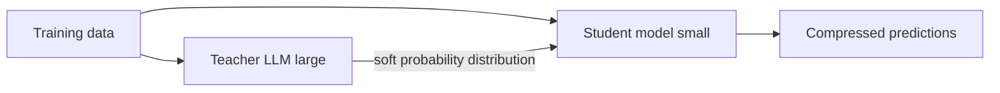

# Lecture 13: Model Compression, Fine-Tuning, and Prompt Engineering

This final lecture covers how to take very large language models and make them usable on memory-constrained and latency-sensitive systems. It walks through three compression techniques (quantization, pruning, knowledge distillation), the distinction between transfer learning and fine-tuning, parameter-efficient fine-tuning with LoRA and QLoRA, and ends with prompt engineering patterns.

> **Lesson agenda**: Final exam logistics, then model compression techniques, then an introduction to prompt engineering covering why it is important, its benefits, its types, and best practices.

---

## 0. Final Exam Logistics

> **Course note**: The material of the final exam is up to the end of this lecture. No other information will be added. It is a comprehensive exam starting from week 1 through week 13.

**Exam details:**

- **Duration**: 120 minutes.
- **When**: Monday, 20 April 2026.
- **Start**: 12:30 pm.
- **Where**: WB 384A.
- **Format**: Closed book. A one-page, double-sided cheat sheet is allowed. **Leave a 5 cm by 5 cm blank space in the top-left corner of each side of the cheat sheet for the proctor's signature.**
- **Structure**:
  - **40 questions** of multiple choice and true/false, **1 point each**.
  - **6 long-answer questions**, **5 points each**.
- **Grade release**: Final exam marks will not be posted on Brightspace directly. Final letter grades become available on ACSIS once approved by the Chair. After that approval, the final exam mark is released on Brightspace.

### How to Prepare

- **Lecture summary slides** are a good place to start. They do not contain every detail, so make sure you understand the details that underlie the main points on each slide.
- **Do the labs.** Make sure you understand the answers you produced.
- **Review the code examples** demonstrated during lecture (see the lecture materials folder on Brightspace).
- **Review the hybrid work** and **in-class activities** you completed during the term.

---

## 1. Why Accuracy Alone Is Not Enough: The Netflix Story

### The 2009 Netflix Prize

In 2009, Netflix ran a well-known competition on improving their recommendation system. A developer team won the competition (and took a $1 million prize) by increasing the accuracy of the recommendation engine by about 10%, which is a huge improvement. They took the prize, but Netflix never integrated the winning system into their recommendation system. They stayed with the old system.

> *Casey Johnston, Business, Apr 16, 2012:* "Netflix awarded a $1 million prize to a developer team in 2009 for an algorithm that increased the accuracy of the company's recommendation engine by 10 percent. But it doesn't use the million-dollar code, and has no plans to implement it in the future, Netflix announced on its blog Friday." (source: wired.com/2012/04/netflix-prize-costs)

Why would a company reject a 10% accuracy gain?

### Deployment Is More Than Accuracy

A recommendation system is an **online system**. When a model moves from research to development and deployment, other factors matter beyond raw accuracy.

Deployment considerations for any model:

1. **Accuracy**: the research metric.
2. **Run-time (latency, response time)**: very important, especially for real-time or streaming applications.
3. **Resource utilization (memory, compute, power)**: related to hardware requirements and operating cost.
4. **Users and scalability**: is the model flexible? Does it scale as the number of users grows? Netflix has a continuously growing user base, so any production model must keep up.

The 2009 winning model was very complex and would not satisfy the latency and scalability constraints once it hit production scale. That is why the old, simpler model stayed in place. This is one of the most famous real-world examples of why deployment considerations can override pure accuracy.

> **Key takeaway**: In a deployment, you have to think about different considerations based on your task and the nature of your task. A better research score does not automatically mean a better production system.

### Worked Example: Model A vs Model B

Suppose we must choose between two models for an online system.

| Property | Model A | Model B |
| --- | --- | --- |
| Accuracy | 99% | 97% |
| Run-time (latency) | 2 seconds | 0.1 seconds |
| Size | 125 MB | 10 MB |

**Which one do we use?** We use **Model B**.

Why:

1. The gap in accuracy (2 percentage points) is not very significant.
2. Model B has far better latency, which is highly recommended for any online system.
3. Model B has a much smaller memory footprint. Small memory is not just memory. If the model has a small memory footprint, all computation costs are reduced, all power costs are reduced, and many other factors are reduced as a consequence.

> **Rule of thumb**: Prefer a smaller, faster model when the accuracy drop is small. The downstream savings in compute, power, and deployment flexibility usually outweigh the accuracy cost.

### Motivation Question

> What approaches can help us deploy NLP systems in a way that is **cost effective**, **efficient**, and **equitable** without a **significant loss in accuracy**?

**Answer**: Model compression. The pipeline is simply:

**Large Model → Model Compression → Small Model**

---

## 2. How Big Are Modern Large Language Models?

Before compression, it is useful to see just how large current models really are. The lecture referenced a recent survey of popular LLMs.

| Model | Parameters | Size on Disk (FP32) | Memory at Inference (FP16) | Training Data |
| --- | --- | --- | --- | --- |
| **BERT (Large)** | 340M | ~1.3 GB | ~1.5 to 2 GB | 3.3B words (~16 GB) |
| GPT-4o | ~200B | ~350 GB | ~400 GB (single GPU) | 570 GB (~300B tokens) |
| LLaMA (13B) | 13B | ~26 GB | ~26 GB | ~1T tokens |
| LLaMA (70B) | 70B | ~140 GB | ~140 GB | ~1T tokens |
| **BLOOM (176B)** | 176B | ~352 GB | ~352 GB | 1.6T tokens |
| Mistral 7B | 7B | ~14 GB | ~14 GB | ~1T tokens |
| **Mixtral 8x7B** | 56B | ~112 GB | ~112 GB | Large corpus (not disclosed) |
| Grok (xAI) | Estimated ~70B | Estimated ~140 GB | Estimated ~140 GB | Not disclosed |
| **PaLM (540B)** | 540B | ~1 TB | ~1 TB | 780B tokens |

These sizes explain why compression matters. A 540B-parameter model at FP32 simply cannot run on a consumer device. Even at FP16, a 70B model needs ~140 GB of GPU memory.

### The Growth of Transformers and the Compression Problem

After 2017, there was a huge growth in the use of transformers, with more complicated architectures, more layers, and an ever-increasing number of parameters.

As models grew, researchers started to think: we need something else. We need to improve these models so that:

- They can run on a user's device, where memory is limited.
- They can be used as an embedded system, as part of a larger system with tight resource budgets.
- The compressed model is still cost-effective in memory, computational power, and everything else.
- The compressed model is efficient enough to provide value, because we are not putting a useless application or useless model into production.

The goal is a **customized or acceptable level of accuracy** that still runs where we need it to run.

### The Big Question

After all the improvement in large language models, producing a very complex LLM requires GPUs and high computation power even just to run it (inference), let alone to train it. The solution direction is **model compression**.

> **Model compression (conjecture)**: Start from a large language model (the original model) and compress it into a smaller model, while keeping the three important parameters under control (memory, computation, performance). The goal is to predict outcomes with an acceptable level of performance drop.

### The Three Common Techniques

There are three common techniques used to compress a model today:

1. **Quantization**
2. **Pruning**
3. **Knowledge distillation**

These are not yet "the" standard technique. Every single technique here is being improved every week and every month. They are well-known techniques and already used in some systems, but the field has not settled.

---

## 3. Quantization

### Background: Floating Point Representation

To understand quantization, we need to understand how real numbers are stored in a computer. A real number in floating point form has three parts.

| Part | What it does | Illustration |
| --- | --- | --- |
| **Sign** | Controls whether the number is positive or negative. Uses 1 bit. | `0` means $+1$, `1` means $-1$ |
| **Exponent** | Controls the magnitude of the number. Also called *range*. | For 8-bit exponent ($N_e = 8$): `01111010` represents $2^{122} / 2^{127}$ |
| **Mantissa** | Controls the granularity (what is after the decimal point). Also called *significand* or *fraction*. | `11000...` represents $1.75$ |

The number of bits allocated to the exponent and mantissa depends on the chosen representation.

| Name | Sign | Exponent | Mantissa (fraction) | Typical use |
| --- | --- | --- | --- | --- |
| **FP16** (half precision) | 1 | 5 | 10 | Deep learning, reduced precision |
| **FP32** (single precision, standard) | 1 | 8 | 23 | Standard ML, general computing |
| **FP64** (double precision) | 1 | 11 | 52 | Numerical computing, aerospace simulation, high-precision scientific computing |

When you download an application and it asks "is your system 32 or 64 bit?", this is the underlying distinction. 64-bit is typically used where precision is very sensitive, such as aerospace simulation.

**FP32 layout visualized** *(from slide)*:

```
 sign    exponent                     mantissa
┌─────┬──────────┬─────────────────────────────────┐
│  0  │ 10000110 │ 11010100000000000000000         │
└─────┴──────────┴─────────────────────────────────┘
 1 bit   8 bits            23 bits
└──────────────────── 32 bits ────────────────────┘
```

### Precision by Example *(from slide)*

Consider a list of numbers at full precision:

- 1.2015432...
- 2.7015402...
- 2.4024402...
- -0.7055120...
- -1.7067140...
- 0.2741131...
- -1.5312410...
- 0.4025222...

At lower precision, keeping only the first two decimal digits:

- **1.20**15432...
- **2.70**15402...
- **2.40**24402...
- **-0.70**55120...
- **-1.70**67140...
- **0.27**41131...
- **-1.53**12410...
- **0.40**25222...

Each stored number is now shorter, so each number fits in fewer bits. That is the whole motivation for quantization, applied to every weight in the model.

### The Core Idea of Quantization

Model weights live in matrices, and each entry of each matrix is a number representing a parameter. By default, each of these numbers is stored in 32 bits.

**Quantization** converts model weights from **32-bit floating point (FP32) to lower precision** such as **INT8** or **FP16**.

**Effect of reducing precision**:

- **Less memory, less space.**
- **Faster communication**, because we are moving fewer bits around.
- A huge benefit overall in memory and speed.
- The **cost is accuracy**. This is the balance we are trying to manage.

> **Quantization**: Play with the floating point representation of the model weights (the parameters) so that the model occupies less space and runs faster, while keeping the performance at a reasonable level. The model architecture does not change. We just change how each weight is stored.

### Example: 65 Billion Parameter Model at Different Precisions

| Bits per weight | Bytes per weight | Total size for 65B parameters |
| --- | --- | --- |
| 32 bits (FP32) | 4 bytes | 260 GB |
| 16 bits (FP16) | 2 bytes | 130 GB |
| 8 bits (INT8) | 1 byte | 65 GB |
| 1 bit (binary quantization) | 1/8 byte | 8.1 GB |

The most aggressive form is **1-bit representation** per parameter (binary quantization). The reduction is enormous, and as a consequence computation cost and power draw also drop, while we try to keep performance at an acceptable level.

### Quantization and Computation Speed

There is a direct relationship: **lower precision means faster processing**. This is a natural consequence of reducing the number of bits.

Why? At the lowest level, the computer deals with bits. If the number of bits is smaller, then the time to complete a single arithmetic operation is shorter, because fewer bits need to be moved and manipulated. So lower precision means faster operations, which means more operations per second.

This is usually quantified as **TFLOPS** (Tera Floating Point Operations Per Second). The following table shows the performance of a modern GPU at different numerical precisions.

| Precision | Performance |
| --- | --- |
| FP64 | 9.7 TFLOPS |
| **FP64 Tensor Core** | **19.5 TFLOPS** |
| FP32 | 19.5 TFLOPS |
| TF32 (Tensor Float 32) | 156 TFLOPS or 312 TFLOPS (sparse) |
| BFLOAT16 Tensor Core | 312 TFLOPS or 624 TFLOPS (sparse) |
| **FP16 Tensor Core** | **312 TFLOPS or 624 TFLOPS (sparse)** |

The jump from FP64 to FP16 is huge. At lower precision you can perform many more operations per second on the same hardware.

> **Lower precision → Faster processing.**

### Quantization in PyTorch

PyTorch offers a very simple API for dynamic quantization. The quantized model is a new model with a smaller size. The original model is not modified.

```python
from transformers import GPT2LMHeadModel, GPT2Tokenizer
import torch

model = GPT2LMHeadModel.from_pretrained("gpt2")
tokenizer = GPT2Tokenizer.from_pretrained("gpt2")

# Convert to a quantized version
model.eval()
quantized_model = torch.quantization.quantize_dynamic(
    model,
    {torch.nn.Linear},   # which layer types to quantize
    dtype=torch.qint8    # target precision (here: 8-bit integer)
)

# Save the quantized model
torch.save(quantized_model.state_dict(), "quantized_gpt2.pth")

with torch.no_grad():
    output = quantized_model.generate(**inputs, max_length=50)
```

### What Can and Cannot Be Quantized

The first parameter above (`{torch.nn.Linear}`) is very important. We cannot quantize all model parameters, because some layers are sensitive to precision loss and quantizing them would seriously degrade performance.

Guidance:

- **Quantize linear layers (`nn.Linear`)**. For example, the Q, K, V matrices inside a transformer are huge linear matrices and are good candidates for quantization.
- **Do not quantize activation functions**. Activation functions already operate on small numbers, so reducing their precision breaks them. Do not touch the weights of these functions.
- **Do not quantize the embedding layer**. The embedding layer holds what we learn from the language, and we need the precision here.

> **Takeaway**: Some layers will be quantized, some will not. Usually we quantize the linear layers only. Choosing which layers to quantize is how we balance model performance against compression gains.

### Binarization: The Extreme Case (Binarized Neural Networks)

**Binary Quantization in Neural Networks (BNN)** stores each weight in just one bit. The question is: how can we save a parameter in one bit and still have the model work?

The intelligent technique works as follows. Given a floating point weight value, apply a threshold at 0:

- If the weight is $\geq 0$, convert it to **$+1$**.
- If the weight is $< 0$, convert it to **$-1$**.

$$ W_{\text{binary}}(i) = \begin{cases} +1 & \text{if } W(i) \geq 0 \\ -1 & \text{if } W(i) < 0 \end{cases} $$

**Example: binarizing a 4 by 4 weight matrix** *(from slide)*

Full-precision weights (FP32):

```
| 0.23  | -1.87 |  0.91 |  0.05 |
| 2.14  | -0.33 |  0.76 | -2.08 |
| 1.52  |  0.01 | -0.67 |  0.42 |
| -1.10 |  0.89 | -0.24 |  1.95 |
```

After applying the zero-threshold rule:

```
| +1 | -1 | +1 | +1 |
| +1 | -1 | +1 | -1 |
| +1 | +1 | -1 | +1 |
| -1 | +1 | -1 | +1 |
```

**Benefits of binary quantization**:

- **32 times less memory** (1 bit vs 32 bits per weight).
- **Faster computations**, because multiply-accumulate reduces to **XNOR + bitcount** at the bit level.
- **Lower energy consumption**.
- Enables efficient **Binary Neural Networks (BNNs)**.

**How a neuron's computation changes**:

Before (FP32):
$$ y = \sum_i w_i x_i $$

For example $0.23 \times 0.5 + (-1.87) \times 0.2 + 0.91 \times 0.8 + \dots \approx 0.23$.

After (Binary):
$$ y = \sum_i \text{sign}(w_i)\, x_i $$

For the same inputs $x = (0.5, 0.2, 0.8, \dots)$ the result becomes $+1 \times 0.5 + (-1) \times 0.2 + (+1) \times 0.8 + \dots \approx 0.26$.

The two sums (0.23 vs 0.26) are close. With binary weights we can run the model on limited-memory devices such as mobile phones or embedded systems with a small loss of fidelity.

### Microsoft's BitNet: Binarization with a Scaling Factor

> *"The Era of 1-bit LLMs: All Large Language Models are in 1.58 Bits"*, Shuming Ma, Hongyu Wang, Lingxiao Ma, Lei Wang, Wenhui Wang, Shaohan Huang, Lifeng Dong, Ruiping Wang, Jilong Xue, Furu Wei. *arXiv*, February 2024. Work in progress.

Microsoft (2023 to 2024) refined binarization by adding a **scaling factor** that recovers most of the original weight magnitudes. Every year there is a new version of this model family.

**The procedure**:

1. Start with the original weights (FP32). Example: $0.92, -0.45, 0.78, -0.31$.
2. **Binarize** with the zero threshold: $+1, -1, +1, -1$. At this point the magnitude is lost (all bars look equal).
3. Multiply each binarized value by a scaling factor $\alpha$. With $\alpha = 0.615$, the scaled result is $+0.615, -0.615, +0.615, -0.615$. Magnitude is restored, using only one scalar multiplied by the binary matrix.

**How is the scaling factor computed?** The scaling factor for a given matrix is the **mean of the absolute values** of all weights in that matrix:

$$ \alpha = \text{mean}(|W|) = \frac{1}{n} \sum_{i=1}^{n} |W_i| $$

For the example above:

$$ \alpha = \frac{0.92 + 0.45 + 0.78 + 0.31}{4} = \frac{2.46}{4} = 0.615 $$

**Key approximation formula**:

$$ W \approx \alpha \cdot B $$

where $W$ is the original FP32 weight matrix, $B$ is the binarized matrix (entries $\pm 1$), and $\alpha$ is a single FP32 scalar (the mean of absolute weights).

**How it is used at inference**:

- In memory, keep only the binarized matrix ($+1$ / $-1$) and the single scalar $\alpha$.
- At runtime (what the paper calls **on-the-fly computation**), multiply the binary values by $\alpha$ to reconstruct an approximation of the original weights.

> **Course note**: Binarization plus scaling factor is an active research area. This is not yet the final or standard technique. Every research team is working on a new variant.

---

## 4. Knowledge Distillation

**Knowledge distillation** transfers knowledge from a **large, complex model** (the **teacher model**) to a **smaller, more efficient model** (the **student model**), so the smaller version can be used on small-size machines. Both models share the same training data.

### Teacher and Student Models

There are two models involved:

- **Teacher model**: the original, large, trained LLM.
- **Student model**: a much smaller model (fewer parameters, different architecture) that we train to mimic the teacher.

Flow:

**Teacher Model → Distill → Knowledge → Transfer → Student Model**

### Student Q&A From Class

> "For training, we have some inputs, we have some outputs. Are the outputs going to the student model, and at the same time the student model has access to the data, the original data?"

**Answer**: Yes. The student model receives two inputs during training:

1. The **same data** that was fed to the larger (teacher) model.
2. The **output probability distribution** that the teacher produced over all the classes.

Using these two signals together, the student learns to imitate or mimic the behavior of the larger model, while being a much smaller model itself.

### The Distillation Loss Function

Training uses a weighted combination of two losses:

$$ L = \alpha \cdot L_{\text{soft}} + \beta \cdot L_{\text{hard}} $$

- **Student loss ($L_{\text{hard}}$)**: **cross-entropy loss** between the **true labels** and the student model's predictions. This is the normal supervised-learning term.
- **Distillation loss ($L_{\text{soft}}$)**: **KL divergence** between the **teacher's soft predictions** (the full probability distribution) and the **student's predictions**. This pushes the student to mimic the teacher's full output distribution, not just the top label.
- $\alpha$ and $\beta$ are hyperparameters that balance the two terms.

*(Reconstructed diagram of distillation)*



### Examples of Distilled Models

| Model | Teacher | Student | Model Size Reduction | Inference Speed Improvement | Performance Retained | Use Case |
| --- | --- | --- | --- | --- | --- | --- |
| **DistilBERT** | BERT | DistilBERT | **60%** | 2x | **97%** | Real-time, mobile applications |
| **DistilGPT-2** | GPT-2 | DistilGPT-2 | **60%** | 2x | **97%** | Text generation, chatbots |
| **Distilled T5** | T5 | Distilled T5 | **60%** | Faster than T5 | **96%** | Translation, summarization, Q&A |

These real distilled models retain 96 to 97 percent of the teacher's performance at 40 percent of the size and roughly 2x the inference speed.

---

## 5. Pruning

**Pruning** removes parameters from the model after training.

### Magnitude-Based Weight Pruning

A trained model relies heavily on matrix multiplication. Inside each weight matrix:

- Some weights have a **significant magnitude**. We consider these important values.
- Some weights are **very, very small**, so we can neglect them without hurting performance much.

The procedure (magnitude pruning):

1. For every weight $W$ in the matrix, compute its **importance score** $S = |W|$.
2. Pick a threshold (or a pruning rate).
3. All weights below the threshold are **set to zero**. They are effectively removed from the computation.
4. The surviving weights keep their original values.

### Worked Pruning Example *(from slide)*

Start with a weight matrix $W$:

```
|  4 |  0 |  1 | -1 |
|  3 | -2 | -1 | -3 |
| -3 |  1 |  0 |  2 |
```

Compute the importance (absolute value) of each entry:

```
|  4 |  0 |  1 |  1 |
|  3 |  2 |  1 |  3 |
|  3 |  1 |  0 |  2 |
```

Zero out the smallest-magnitude entries (for example, those with absolute value $\leq 1$) to get the pruned matrix:

```
|  4 |  0 |  0 |  0 |
|  3 | -2 |  0 | -3 |
| -3 |  0 |  0 |  2 |
```

The original large weights ($\pm 3, \pm 4, -2, 2$) are kept. The smallest-magnitude entries are replaced by zero.

### Empirical Effect on Model Size and Accuracy

Empirical evidence (from Datature's blog, mostly on machine-vision models such as YOLOv8n-cls, YOLOv8n-pose, DeepLabV3 MobileNetV3, YOLOv8s-seg, UNet ResNet50, YOLOX Large, YOLOv8x):

- **Compressed model size** decreases roughly **linearly** with the pruning ratio.
- **Inference performance** is retained well up to about **50% pruning**, then **degrades sharply at 70% to 90% pruning**.

**Safe zone**: the empirically safe zone for pruning is usually **30% to 50%**. Inside this range the model performance typically does not degrade much. Above 50% the degradation is risky.

> **Guideline**: Do not go higher than 30% to 50% pruning for most models. And note that some models (for example, one of the models in the empirical chart shown in class, referred to as model 8 or 8X) degrade much earlier. You have to think about which model you apply pruning to and what the effect of pruning is on that specific model.

---

## 6. Comparing the Three Compression Techniques

| Technique | What changes in the model | What stays the same |
| --- | --- | --- |
| **Quantization** | The precision used to store the weights (up to $k$ bits). | The number of parameters. Parameter values conceptually stay, only their precision is reduced. |
| **Pruning** | Some parameters are set to zero based on a pruning rate. | The remaining (surviving) parameters keep their original values. |
| **Knowledge distillation** | All parameters change. The student model is a brand new model with a different (smaller) architecture and fresh weights. | Only the knowledge (learned behavior) is transferred from the teacher. |

> **Summary**: Quantization changes how values are stored. Pruning changes which values survive. Distillation changes the model itself.

---

## 7. Transfer Learning vs Fine-Tuning

These are two important concepts that often get confused.

### Visual Distinction

- **Transfer learning**: Pre-trained model → produces **features / predictions** → we train a **new model** on top of those features for a new task. The original model is used as a fixed source of representations.
- **Fine-tuning**: Pre-trained model → is itself further trained on our downstream task so all parameters shift to the new domain.

### Classroom Discussion

A student offered a first definition:

> "Fine tuning, you're training the original model, so you're essentially training the original model with data that we worked on in a specific area. Whereas transfer learning is essentially you're training an entirely new model using some original model with the original training data that we've created."

The lecturer refined this. Transfer learning does not really "train from scratch in the same way as the original model". What really happens is that we reuse a representation and add something on top, or we modify specific layers. One common pattern is to add an **FC unit** (an extra fully connected layer) at the end, or to change only the final parameters.

### Transfer Learning: Freeze and Reuse

**Transfer learning**: Take a pre-trained model, **freeze** its parameters, and reuse it as a fixed feature extractor for a new task.

**Canonical example: GloVe embeddings (from Assignment 2)**

- We did not train GloVe from scratch.
- The GloVe embedding file contains all the vocabulary in English, and for each vocabulary entry there is a vector representing that token.
- For our own data we **look up** the vector for each token, then build a feature matrix.
- For a sentence, we get the vector for each word or token, and we can average them if we want one vector per sentence.
- We do not touch the GloVe parameters at all.

**Another example: BERT as embedding layer**

- BERT generates contextual embedding vectors for English tokens.
- We **freeze** this layer.
- We build another layer (for example, a classification head) on top of BERT.
- BERT's parameters do not change. We only train the new head.

> **Transfer learning**: Freeze the pre-trained model. Take a "picture" of the representation it already learned. Build your own task on top of that frozen representation.

### Fine-Tuning: Train the Whole Thing Again

**Fine-tuning**: Start from a pre-trained model and **update all of its parameters** using our own labeled data. This is what Assignment 2 asked you to do with your domain-specific data on top of a large language model.

Key points:

- The huge model already has a huge number of parameters encoding general language understanding.
- We do **not** start from scratch. We get the benefit of the LLM's existing knowledge.
- We feed our own labeled data and let the model adjust its parameters to our specific domain.

### Supervised Fine-Tuning (SFT)

This is called **supervised fine-tuning (SFT)**. It is supervised because we have our own **labeled data**. Because we need to train, there is no `torch.no_grad()` and no freezing. All layers are trainable. Training is applied **end to end**.

**Pipeline**:

Pre-trained language model → labelled training data (input / output pairs for a specific task) → supervised training (further training on labelled examples) → task-specific outputs → fine-tuned language model.

**Common SFT tasks**:

- Text classification and labelling.
- Question answering and FAQs.
- Text summarization.
- Code generation.

The result is a model that generates more accurate, more consistent, and more task-specific outputs.

**Typical SFT dataset sizes** *(from slide)*:

| Model | SFT size (number of examples) |
| --- | --- |
| GPT-3 | ~13 thousand |
| LLaMA 3 | ~10 million |

```python
# *(reconstructed code showing fine-tuning, not freezing)*
for param in model.parameters():
    param.requires_grad = True   # all layers trainable, end-to-end fine-tuning

optimizer = torch.optim.AdamW(model.parameters(), lr=2e-5)
for batch in domain_dataloader:
    logits = model(**batch["inputs"])
    loss = loss_fn(logits, batch["labels"])
    loss.backward()
    optimizer.step()
    optimizer.zero_grad()
```

### Comparison Table

| Aspect | Transfer Learning | Fine-Tuning (Supervised) |
| --- | --- | --- |
| Pre-trained parameters | Frozen | All updated |
| New layers added | Often yes (for example, a classifier head) | Optional |
| Data needed | Small target-task dataset | Higher quality, domain-labelled dataset |
| Compute cost | Low | Very high (needs GPUs, large memory) |
| Canonical example | GloVe or BERT as fixed embedding | Fine-tuning an LLM on domain labels |
| PyTorch concept | `requires_grad = False` on frozen layers | All layers trainable |

### Challenges of Full Fine-Tuning

Because a large language model has an enormous number of parameters, trying to change all of them during training on our own data creates real challenges:

1. **Large models have billions of parameters.**
2. **GPU memory constraints** to hold the model plus gradients plus optimizer state.
3. **Computational costs**, typically requiring high-end GPUs.
4. **Very high-quality data** is needed. You have to choose the fine-tuning data carefully so as not to disturb the model's original weights in a harmful way.

Now, think about using this in a real-life application. Full fine-tuning is a real barrier due to all of these challenges.

---

## 8. Parameter-Efficient Fine-Tuning (PEFT)

To deal with the memory, compute, and data-quality challenges of full fine-tuning, researchers introduced **parameter-efficient fine-tuning (PEFT)**. Research on this started around 2018 and has produced many techniques.

> **PEFT philosophy**: Do not tune all of the parameters. Just tune some.

Representative PEFT techniques:

- **Prompt / prefix tuning**
- **Adapters**
- **BitFit**
- **Low-Rank Adaptation technique (LoRA)**

The most recent and famous one is **LoRA**, introduced by Microsoft in 2021.

### LoRA: Low-Rank Adaptation

**LoRA** stands for **Low-Rank Adaptation**, a parameter-efficient fine-tuning technique. The main idea comes from linear algebra.

**Main idea**:

- **Decompose weight updates** into two smaller low-rank matrices ($A$ and $B$).
- **Reduce trainable parameters** while keeping model quality high.

#### Refresher: Rank of a Matrix

Classroom answer from a student:

> "How linearly in a matrix? I don't know."

**The rank of a matrix** is the number of linearly independent rows (equivalently, the number of linearly independent columns) in that matrix. Some rows can be written as linear combinations of other rows. The rows and columns that are "wholly independent" (cannot be represented as a linear combination of other rows or columns) give the rank.

*(additional example)* The matrix
$$ \begin{bmatrix} 1 & 2 & 3 \\ 2 & 4 & 6 \\ 0 & 1 & 1 \end{bmatrix} $$
has rank 2, because the second row is $2 \times$ the first row (not independent), and the third row is linearly independent from the first.

#### The LoRA Idea (Hu et al., 2021)

Freeze the pre-trained weights $W \in \mathbb{R}^{d \times d}$. Train a low-rank approximation of the **difference** from the pre-trained weights.

- Introduce two small matrices $A$ and $B$.
- $A$ has shape $d \times r$, initialized from a Gaussian: $A \sim \mathcal{N}(0, \sigma^2)$.
- $B$ has shape $r \times d$, initialized to **zero** so that at the start of training $A B = 0$ and the model behaves identically to the base model.
- $r$ is the **rank**, much smaller than $d$. For example, $r = 3$ or $r = 8$.

The effective forward pass becomes

$$ h = W x + A B x $$

Only $A$ and $B$ contain trainable parameters. $W$ is frozen.

$$ \Delta W = A \cdot B, \qquad W_{\text{effective}} = W + \Delta W $$

**Advantage**: After training, we just add $A B$ back into $W$. There are no new components in the final model. The updated $W + A B$ replaces $W$ and the runtime model has no architectural overhead.

*(Reconstructed diagram)*

```
  Input x
    |
    v
  [ W (d x d, FROZEN) ] -----+
    |                        |
    v                        |
  [ A (d x r, trainable,     |
       init ~ N(0, sigma^2)) ]
    |                        |
    v                        |
  [ B (r x d, trainable,     |
       init = 0) ]           |
    |                        |
    +------- add ------------+
                |
                v
         output h = W x + A B x
```

#### Why LoRA Helps

- **Fewer parameters to train**: instead of $d^2$ parameters, we train $2 \cdot d \cdot r$, which is far smaller when $r \ll d$.
- **Less memory required**.
- **Less computation power**.
- **Higher speed**.
- At the end, we just add $A B$ to the original matrix, so the runtime model has no architectural overhead.

This was very helpful when introduced. Computations and parameter counts dropped dramatically, and the efficiency of fine-tuning was very high with this intelligent idea.

#### Where to Apply LoRA

LoRA cannot be applied to any layer. In a transformer, LoRA is typically inserted into:

- **Masked Multi-Head Attention blocks**, particularly the **Q**, **K**, and **V** projection matrices (the lecture emphasized **value $V$** and **query $Q$**).
- **Feed Forward blocks** inside each transformer layer.

Other components (Output Probabilities, Softmax, Linear head, Add and Norm, Positional Encoding, Output Embedding) are typically left alone to keep the model's performance as close to the original as possible.

#### Empirical Notes on LoRA

> *"LoRA Without Regret"*, Schulman et al., 2025.

Two facts to keep in mind when you use LoRA:

1. **LoRA needs a higher learning rate** than full fine-tuning. When you switch from full FT to LoRA, you should increase the learning rate.
2. **LoRA works poorly on large batch sizes** compared to full fine-tuning.

These two facts came out of empirical results on a large amount of data. This is not the final standard for LoRA, but research in this field continues.

```python
# *(reconstructed code example of using LoRA via the PEFT library)*
from peft import LoraConfig, get_peft_model
from transformers import AutoModelForCausalLM

base_model = AutoModelForCausalLM.from_pretrained("some-llm")

lora_config = LoraConfig(
    r=8,                                        # the rank
    lora_alpha=32,                              # LoRA scaling factor
    target_modules=["q_proj", "v_proj"],        # apply only to Q and V projections
    lora_dropout=0.05,
    bias="none",
)

peft_model = get_peft_model(base_model, lora_config)

# Typical training: higher learning rate, smaller batch size than full FT
```

### QLoRA: Quantized LoRA (Dettmers et al., 2023)

**QLoRA** combines LoRA with quantization. The idea is very intelligent while being very simple. Just combine the two techniques.

- Quantize **all frozen weights** ($W_0$) to relieve the memory bottleneck. Typical choice: **4-bit quantization** of the base model.
- On top of the quantized base, keep the LoRA update $A B$ stored in **full precision**.

Schematically:

```
   W0         +    B     x    A
 (big,              (tall,     (wide,
 stored              stored in  stored in
 quantized)          full       full
                     precision) precision)
```

With QLoRA you can **train a 65B parameter model on a single 48 GB GPU**. Again, this is toward our main objective. How can we use such a huge model in small-sized devices, including mobile and embedded systems.

> **Big picture**: All of this (quantization, pruning, distillation, LoRA, QLoRA) shares one goal. Reduce the size, reduce the computation cost, reduce the memory, while keeping performance at a reasonable level. This is an active research area. Every day brings a new technique.

---

## 9. Prompt Engineering

Prompt engineering is the other side of working with large language models in practice. All of you already know how to communicate with a large language model. The **prompt** is the language of communication between a user and any LLM.

- You ask the LLM a question.
- That question is called a **prompt**.
- The LLM answers.

**Definition**: **Prompt engineering** is the art of asking the right question to get the best output from an LLM. It enables direct interaction with the LLM using only plain language prompts. Prompts involve **instructions** and **context** passed to a language model to achieve a desired task.

It is very important to take care about how you form, how you write your prompt, because the prompt guides the LLM toward a correct answer.

> **Garbage in, garbage out.** Ask the right question to get the right answer. If you ask the wrong question, you will not get a right answer.

### Example: An LLM Explains Prompt Engineering

> **Q**: What is prompt engineering?
>
> **A**: Prompt engineering is a process of creating a set of prompts, or questions, that are used to guide the user toward a desired outcome. It is an effective tool for designers to create user experiences that are easy to use and intuitive. This method is often used in interactive design and software development, as it allows users to easily understand how to interact with a system or product.

### Elements of a Prompt

A well-formed prompt has four components:

1. **Context**: background information the model needs to make sense of the request.
2. **Instructions**: what you want the model to do.
3. **Input data**: the specific question, text, or data to be processed.
4. **Output indicator**: the format in which you expect the output.

This is applied in Assignment 2.

**Example from slide**:

```text
You are a data scientist working on a sentiment analysis,    <- Context
classify the text into pos, neg and neu                      <- Instructions
Text: I think the food was ok                                <- Input data
Sentiment:                                                   <- Output indicator
```

Clearly write your instruction, then you can get a correct response from your LLM.

### Benefits of Prompt Engineering

Writing prompts well can:

- **Improve task performance** of the model.
- **Control the output** (shape, length, format).
- **Improve response quality**.
- **Enhance interpretability** of the model's reasoning.
- Help with **bias mitigation**. Based on the other input and during the final action, you can try to mitigate bias by how you frame the prompt.

All of these are reasons to invest in writing correct prompts for your LLM.

### Full Catalogue of Prompting Techniques *(reference list)*

There is a huge list of prompting techniques. The prompting guide enumerates many:

- Zero-shot Prompting
- Few-shot Prompting
- Chain-of-Thought Prompting
- Meta Prompting
- Self-Consistency
- Generate Knowledge Prompting
- Prompt Chaining
- Tree of Thoughts
- Retrieval Augmented Generation
- Automatic Reasoning and Tool-use
- Automatic Prompt Engineer
- Active-Prompt
- Directional Stimulus Prompting
- Program-Aided Language Models
- ReAct
- Reflexion
- Multimodal CoT
- Graph Prompting

*(source: promptingguide.ai)*

### Common Categories Covered in This Course

The lecturer organized the common techniques into five categories:

1. **Example-based prompts**: zero-shot, one-shot, few-shot.
2. **Instruction-based prompts**.
3. **Chain-of-thought prompts (CoT)**.
4. **Role-based prompts**.
5. **Persona-guided prompts**.

This is not all the categories, but these are famous examples.

---

### 9.1 Example-Based Prompts: Zero / One / Few Shot

#### Zero-Shot

**Zero-shot**: write a prompt without giving the model any example. Just ask a question.

```text
Classify the text into neutral, negative, or positive.

Text: I think the food was okay.
Sentiment:
```

That is it. No example. This is zero-shot.

#### One-Shot

**One-shot**: feed the model with one example of the task.

```text
Classify the text into neutral, negative, or positive.

Text: I think the food was alright.
Sentiment: Neutral

Text: I think the food was okay.
Sentiment:
```

#### Few-Shot

**Few-shot**: feed the model with more than one example. This makes a huge difference in performance.

```text
Classify the text into neutral, negative, or positive.

Text: I think the food was alright.
Sentiment: Neutral.

Text: I think the food was great!
Sentiment: Positive.

Text: I think the food was horrible...
Sentiment: Negative.

Text: I think the food was okay.
Sentiment:
```

#### Empirical Evidence: GPT-3 Across Shot Counts

From *"Language Models are Few-Shot Learners"*:

Accuracy (%) on an in-context learning benchmark, plotted against the number of examples in context ($K$), across zero-shot, one-shot, and few-shot regimes:

| Model size | Accuracy with prompt |
| --- | --- |
| **175B parameters** | Reaches ~60 to 65% accuracy. Benefits significantly from few-shot examples. Higher accuracy with a natural language prompt than with "no prompt" baseline. |
| **13B parameters** | Tops out near ~25%. |
| **1.3B parameters** | Stays near ~5%. |

**Larger models benefit far more from in-context examples than smaller ones.** Simply adding examples to your prompt becomes a much bigger lever as model capacity grows.

---

### 9.2 Chain-of-Thought Prompting

**Chain of thought (CoT)**: if you want to ask the model a complicated question, guide it by breaking the question into a chain of steps instead of asking it all at once.

A modern large language model can often answer a multi-step arithmetic question directly. But the general idea is still very useful. **Divide your question into steps**. Build the answer step by step. Especially for complicated questions, this is a very good practice.

**One-shot prompt without CoT** *(from slide)*:

```text
Q: Roger has 5 tennis balls. He buys 2 more cans of tennis balls.
   Each can has 3 tennis balls. How many tennis balls does he have now?
A: The answer is 11.

Q: The cafeteria had 23 apples. If they used 20 to make lunch and bought 6 more,
   how many apples do they have?
A: The answer is 27.    <-- WRONG
```

**Chain-of-thought prompt (with reasoning example)**:

```text
Q: Roger has 5 tennis balls. He buys 2 more cans of tennis balls.
   Each can has 3 tennis balls. How many tennis balls does he have now?   (Example)
A: Roger started with 5 balls. 2 cans of 3 tennis balls each is 6 tennis balls.
   5 + 6 = 11. The answer is 11.                                           (Reasoning thought)

Q: The cafeteria had 23 apples. If they used 20 to make lunch and bought 6 more,
   how many apples do they have?                                           (Instruction)
A: The cafeteria had 23 apples originally. They used 20 to make lunch, so they
   had 23 - 20 = 3. They bought 6 more apples, so they have 3 + 6 = 9.
   The answer is 9.                                                        (Correct, thought)
```

**Standard prompt**: "If you have 5 apples and you give away 2, how many do you have left?"

**Chain of thought prompt**: "You start with 5 apples. If you give away 2 apples, you subtract 2 from 5 to find out how many apples you have left. So, 5 minus 2 equals 3. Therefore, you have 3 apples left."

**Benefit**: CoT leads the AI through a **logical sequence of steps** to solve a problem, making it easier to follow and to verify the solution. This is a very good practice when you write code that queries an LLM.

### 9.2.1 Related Technique: Chain Prompts (Prompt Chaining)

A closely related technique is **prompt chaining**, where each step's **output feeds the next**. This is a pipeline rather than a single prompt.

*(Example from slide: product marketing pipeline)*

1. **Generate product name**
   - Input: `<features>`
   - LLM → `<name>`
2. **Generate product slogan**
   - Input: `<features>`, `<name>`
   - LLM → `<slogan>`
3. **Generate sales pitch**
   - Input: `<features>`, `<name>`, `<slogan>`
   - LLM → `<sales_pitch>`

---

### 9.3 Role-Based Prompts

**Role-based prompts**: put a role in the prompt so that the model answers from that perspective. The lecturer personally tries this with ChatGPT.

- "As a natural language processing professor, explain..." yields an explanation at a professor level.
- "As a student, explain..." gives a more student-level answer.

The role is very important to control the output or the response. When you query any LLM, try to put your role at the start of the prompt, just like you would provide context.

**Example** *(from slide)*:

```text
You are a hiring manager at a top tech company.
Conduct a mock interview for a software developer
position. Ask one question at a time and wait for my
response before continuing.
```

**Response**:

> Great! Let's get started with the interview.
>
> **Question 1:**
> "Can you please tell me about yourself and your background in software development?"

---

### 9.4 Persona-Guided Prompts

**Persona prompts**: go beyond a generic role and give the model a specific persona to inhabit.

**Example** *(from slide)*:

```text
You are William Shakespeare. Write a poem about the
beauty of the night.
```

**Response**:

> **Ode to the Night**
>
> Oh, velvet sky with silver'd glow,
> Where quiet winds of midnight blow,
> Thy stars like lanterns gently gleam,
> Soft whisper'd light in slumber's dream.
> The moon, a queen in pale embrace,
> Doth kiss the earth with tender grace,
> She walks 'tween clouds in silent flight,
> A beacon fair to lovers' sight.

If you want the model to generate a story or similar creative content, give it a specific persona so it can generate the content in that voice. This is very good practice.

---

### 9.5 Prompt Templates

Classroom aside. The lecturer asked how many projects use a large language model. Most students do. It depends on the client, but the communication with the LLM always happens through a prompt.

A **prompt template** is a reusable skeleton where you fill in the actual input at call time.

**Example** *(from slide, customer support bot for a cleaning robot)*:

```python
# 1. Use a prompt_template instead of a one-off prompt.
prompt_template = """Act as support staff.
Help the owners of the HHCR3000 operate their cleaning
robot by giving answers to questions on features and step-
by-step instructions when they ask for help.

User: {query}
Assistant:"""

# 2. `{query}` is a variable placeholder in the template.

# 3. For each conversation turn, replace the placeholder with the
#    current user query to get the actual prompt.
prompt = prompt_template.format(query=actual_user_query)
```

*(Reconstructed minimal template with all four prompt elements)*

```python
PROMPT_TEMPLATE = """You are a helpful NLP assistant.

Context:
{context}

Instruction:
{instruction}

Input:
{user_input}

Respond in the following format:
{output_format}
"""

def build_prompt(context, instruction, user_input, output_format):
    return PROMPT_TEMPLATE.format(
        context=context,
        instruction=instruction,
        user_input=user_input,
        output_format=output_format,
    )
```

This is how we communicate with any LLM, including question-answering systems. Create a template, then fill that template at query time. It is a general technique.

---

### 9.6 Prompting Best Practices *(from slide)*

The final slide listed ten practical guidelines.

1. **Be specific and clear.**
2. **Provide relevant context.**
3. **Break down tasks** for complex problems.
4. **Use chain-of-thought** reasoning for problem-solving.
5. **Experiment** with few-shot or zero-shot prompting.
6. **Use role-based or persona-guided** prompts.
7. **Ask for clarification** if the response is unclear.
8. **Be mindful of bias** and ethical considerations.
9. **Request structured responses** when you need them.
10. **Iterate and refine** your prompts based on responses.

> "The smartest people are those who ask questions." *(attributed, meme form)*

---

## 10. Closing Remarks

Closing message from the lecturer (paraphrased so it sits well in notes):

- What was taught in this course is a **foundation**. There is much more in this field, especially because it moves very fast.
- New libraries and techniques appear constantly, particularly in large language models.
- The purpose of this course was to build a solid foundation, and then let students "fly" into independent work.

---

## Appendix A: One-Page Summary Tables

### Compression Techniques

| Technique | What it does | Typical gain | Typical cost |
| --- | --- | --- | --- |
| Quantization | Reduce bits per weight (32 to 16, 8, down to 1) | Memory and speed improved dramatically | Some accuracy drop |
| Pruning | Zero out small-magnitude weights | Memory and speed, up to safe zone 30 to 50% | Accuracy drops fast above 50% |
| Distillation | Train small student to imitate large teacher | 60% smaller model, 97% of teacher accuracy, 2x faster (DistilBERT) | Separate training process, teacher model required |

### Transfer Learning vs Fine-Tuning vs PEFT

| Method | Base parameters | Extra parameters | Typical cost |
| --- | --- | --- | --- |
| Transfer learning | Frozen | New head or layers | Low |
| Full fine-tuning (SFT) | Updated | None required | Very high |
| LoRA | Frozen | Low-rank $A$ and $B$ | Low to medium |
| QLoRA | Frozen and 4-bit quantized | Low-rank $A$ and $B$ | Even lower (65B on 48 GB GPU) |

### Prompt Categories

| Category | Key idea |
| --- | --- |
| Zero-shot | No example, just the instruction |
| One-shot | One example of the task |
| Few-shot | Several examples of the task |
| Instruction-based | Plain instruction, no examples |
| Chain of thought | Break complex problems into steps |
| Prompt chaining | Pipeline where each step's output feeds the next |
| Role-based | Set a role (for example, "as a professor") |
| Persona-guided | Specific persona (for example, "You are Shakespeare") |

### Quick Reference: Model Sizes by Precision (per billion parameters)

| Bits per weight | Size per 1B parameters | Size for 65B model |
| --- | --- | --- |
| 32 (FP32) | 4 GB | 260 GB |
| 16 (FP16) | 2 GB | 130 GB |
| 8 (INT8) | 1 GB | 65 GB |
| 1 (binary) | 0.125 GB | 8.1 GB |
