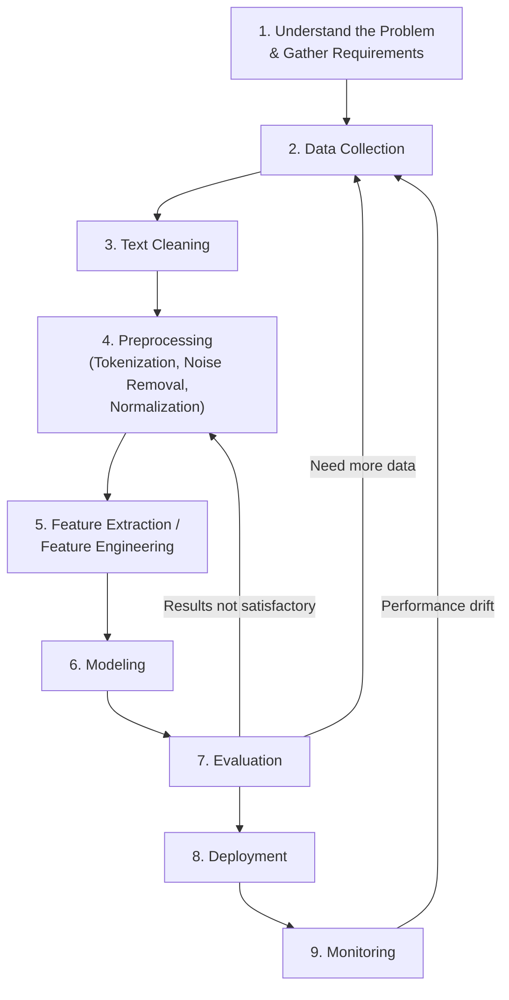
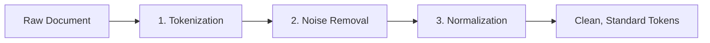

# Lecture 2: Regular Expressions, NLP Development Lifecycle, and Text Preprocessing

## Regular Expressions

### What Are Regular Expressions?

**Regular Expression (regex/regexp)**: a concise and flexible means for matching strings of text, such as particular characters, words, or patterns of characters. A regular expression is written in a formal language that can be interpreted by a regular expression processor. *(from slides)*

Regular expressions are a foundational tool in the **heuristic/rule-based** approach to NLP (one of the four main approaches, alongside machine learning, deep learning, and transformers).

### Metacharacters

The main power of a regular expression comes from its **metacharacters**, special characters that have a specific meaning inside a pattern. The lecturer demonstrated each metacharacter live using an online regex tool with the text `"natural language processing"` as the test string. The following table summarizes every metacharacter covered in the lecture.

| Metacharacter | Name | Meaning | Example |
|:---:|------|---------|---------|
| `.` | Dot | Matches **any single character** | `a.` matches `ab`, `a1`, `a!` |
| `?` | Question mark | Matches **zero or one** of the preceding element | `a?` matches `""` or `a` |
| `+` | Plus | Matches **one or more** of the preceding element | `a+` matches `a`, `aa`, `aaa` |
| `*` | Star | Matches **zero or more** of the preceding element | `a*` matches `""`, `a`, `aa` |
| `[]` | Square brackets | Matches **any one character** listed inside | `[abc]` matches `a`, `b`, or `c` |
| `^` (inside `[]`) | Caret (negation) | Matches any character **not** in the set | `[^abc]` matches `d`, `1`, `!` |
| `^` (outside `[]`) | Caret (anchor) | Matches the **beginning** of the string | `^Hello` matches `Hello world` |
| `$` | Dollar sign | Matches the **end** of the string | `world$` matches `Hello world` |
| `{}` | Curly braces | Matches a **specific number of repetitions** | `a{2,3}` matches `aa` or `aaa` |
| `\` | Backslash | **Escape character**: treats the next metacharacter as a literal | `\.` matches a literal dot |
| `\|` | Pipe | **Alternation**: matches pattern on the left **or** the right | `aa\|b` matches `aa` or `b` |
| `()` | Parentheses | **Grouping**: treats enclosed characters as a single unit in order | `(abc)` matches the exact sequence `abc` |

> **Key distinction**: square brackets `[abc]` mean "match **any one** of a, b, or c." Parentheses `(abc)` mean "match the exact sequence a, b, c **together in that order** as a single unit." Switching the order inside parentheses (e.g., `(acb)`) will not match `abc`.

> **Course note**: The textbook covers regular expressions in detail in **Chapter 2** (required reading). Practice the concepts covered here using the examples in the textbook.

### Special Character Classes

Each lowercase shorthand has an uppercase negation:

| Shorthand | Meaning | Uppercase Negation | Negation Meaning |
|:---------:|---------|:------------------:|------------------|
| `\s` | Matches any **whitespace** | `\S` | Matches any **non-whitespace** |
| `\w` | Matches any **alpha character**. Equivalent to `[A-Za-z]` *(from slides)* | `\W` | Matches any **non-alpha character** |
| `\d` | Matches any **numeric character**. Equivalent to `[0-9]` *(from slides)* | `\D` | Matches any **non-numeric character** |

> **Technical note**: In Python's `re` library, `\w` actually matches `[A-Za-z0-9_]` (letters, digits, and underscore), which is broader than the slide's definition of `[A-Za-z]`. Know the slide definition for the exam, but be aware of the real behavior when coding.

### Character Ranges

Instead of listing every character, you can specify ranges inside square brackets:

| Range | Meaning |
|-------|---------|
| `[a-z]` | Any lowercase letter |
| `[A-Z]` | Any uppercase letter |
| `[0-9]` | Any digit from 0 to 9 |

> **Tip**: The lecturer recommends **[regex101.com](https://regex101.com/)** for testing patterns interactively. It highlights matches, shows match count, and provides explanations of why each match occurs. Always test your pattern in such a tool before putting it into your code.

> **Course note**: The lecturer publishes in-class code to Brightspace after each lecture (not before). Look for "in-class code for Week 2" in Brightspace.

### Textbook Examples

The following examples come from the textbook (Chapter 2, required reading) and were shown on the slides:

| Pattern | Meaning | Matches |
|---------|---------|--------|
| `[wW]oodchuck` | Uppercase or lowercase first letter | `Woodchuck`, `woodchuck` |
| `[1234567890]` | Any single digit | `1`, `5`, `9` |
| `colou?r` | Optional previous char (`u`) | `color`, `colour` |
| `oo*h!` | Zero or more of previous char (`o`) | `oh!`, `ooh!`, `oooh!` |
| `o+h!` | One or more of previous char (`o`) | `oh!`, `ooh!`, `oooh!` |
| `beg.n` | Any single char in place of `.` | `begin`, `begun`, `beg3n` |
| `[^A-Z]` | Not an uppercase letter (negation) | `a`, `1`, `!` |
| `^[A-Z]` | Uppercase letter at start of string (anchor) | Matches `Palo Alto` but not `palo` |
| `\.$` | Literal period at end of string | Matches `The end.` but not `The end?` |

*(from slides/textbook)*

---

## Python `re` Library

**`re`**: the built-in Python library for working with regular expressions.

```python
import re
```

### Core Functions

| Function | Description | Returns |
|----------|-------------|---------|
| `re.match(pattern, string)` | Searches for the pattern **only at the beginning** of the string | A match object, or `None` if no match at the start |
| `re.search(pattern, string)` | Searches for the pattern **anywhere** in the string | The **first** match object found, or `None` |
| `re.findall(pattern, string)` | Searches for the pattern **everywhere** in the string | A **list** of all non-overlapping matches |
| `re.sub(pattern, repl, string)` | Replaces occurrences of the pattern with a replacement string | The substituted string |
| `re.compile(pattern)` | Compiles a pattern into a **reusable regex object** | A compiled regex object |
| `re.split(pattern, string)` | Splits the string at every occurrence of the pattern | A list of substrings |
| `re.finditer(pattern, string)` | Like `findall`, but returns an **iterator** of match objects | An iterable of match objects |

### `match` vs. `search` vs. `findall`

```python
import re

text = "The quick brown fox jumps over 123 lazy dogs 123"

print(re.search(r"123", text))   # <re.Match object; span=(31, 34), match='123'>
print(re.match(r"123", text))    # None (no match at the beginning)
print(re.findall(r"123", text))  # ['123', '123']
```
*(reconstructed example)*

- **`search`** finds `"123"` and returns the start and end indices of the first occurrence (e.g., index 31 to 34).
- **`match`** returns `None` because `"123"` does not appear at the beginning of the string.
- **`findall`** returns a list containing every occurrence of `"123"`.

### Match Object Methods

| Method | Description |
|--------|-------------|
| `.group()` | Returns the **matched text** |
| `.span()` | Returns a tuple of the **(start, end) positions** of the match |

Using `finditer`, you can iterate through all matches and call `.group()` and `.span()` on each match object to get both the matched text and its position:

```python
import re

text = "Call 111-222-3333 or 444-555-6666"
pattern = r"\d{3}-\d{3}-\d{4}"

for match in re.finditer(pattern, text):
    print(f"Found: {match.group()} at position {match.span()}")
# Found: 111-222-3333 at position (5, 17)
# Found: 444-555-6666 at position (21, 33)
```
*(reconstructed example)*

### `compile` for Reusable Patterns

When you compile a pattern, the output is a reusable regex object. You can use this object later in your code whenever you need to apply the same pattern, avoiding recompilation:

```python
import re

pattern = re.compile(r"\d+")
result = pattern.findall("There are 12 cats and 5 dogs")
print(result)  # ['12', '5']
```
*(reconstructed example)*

### `split` for Extracting Words

Splitting on whitespace is a simple way to extract the list of words (vocabulary) from a text file:

```python
import re

text = "Natural language processing is fascinating"
words = re.split(r"\s+", text)
print(words)  # ['Natural', 'language', 'processing', 'is', 'fascinating']
```
*(reconstructed example)*

You can also split on other patterns. For example, splitting on digits: *(from slides)*

```python
import re

print(re.split(r"\d", "ab1bc4cd"))  # ['ab', 'bc', 'cd']
```
*(from slides)*

---

## Applications of Regular Expressions in NLP

> **Course note**: In the lab, you will build a simple NLP application using only regular expressions.

1. **Text cleaning**: search for unwanted characters (emoticons, HTML tags, special symbols) and replace or remove them.
2. **Tokenization**: regular expressions can be used as the basis for simple tokenizers that split text at specific delimiters. *(from slides)*
3. **Information retrieval**: extract information matching a specific pattern from a large corpus or document.
4. **Sentiment analysis**: count matches of "good" words vs. "bad" words per sentence to classify sentiment as positive, negative, or neutral. This is a simple, dictionary-based approach: if good words outnumber bad words, the sentiment is positive. If they are equal, it is neutral. Not very accurate, but it is a first attempt at building a sentiment analysis system.
5. **Language detection**: search for patterns unique to a specific language (e.g., character sequences, diacritics) to detect whether a document is in English, French, Arabic, or another language.

### Class Activity: Regex Practice

The lecturer presented two in-class exercises to practice regex:

1. **URL matching**: given a block of text, find all URLs. URLs can start with `http` or `https` (HTTP is the older Hypertext Transfer Protocol, HTTPS is the secure version). A regex pattern using alternation (`http|https`) or an optional `s` (`https?`) can match both.

```python
import re

text = "Visit https://example.com or http://old-site.org for details."
urls = re.findall(r"https?://\S+", text)
print(urls)  # ['https://example.com', 'http://old-site.org']
```
*(reconstructed example)*

2. **Variable name extraction**: given a text string containing a mix of characters, extract all the longest possible substrings that are proper variable names. A proper variable name does not start with a digit and does not contain any special character other than underscore.

**Test string from the slides**: *(from slides)*
```python
import re

text = 'hsdgkjdh;efjewipjrndendrwerji2;;;;8888p9nskdj3905jdkwqld***w3w945{{{{{jwkqs ;weoijrtwioejri'
result = re.findall(r'[a-zA-Z_][a-zA-Z0-9_]*', text)
print(result)
# ['hsdgkjdh', 'efjewipjrndendrwerji2', 'p9nskdj3905jdkwqld', 'w3w945', 'jwkqs', 'weoijrtwioejri']
```
*(reconstructed example)*

> **Note**: the expected output from the slides is `['hsdgkjdh', 'efjewipjrndendrwerji2', 'p9nskdj3905jdkwqld', 'w3w945', 'jwkqs', 'weoijrtwioejri']`. Notice that substrings like `p9nskdj3905jdkwqld` are valid because the rule is that a variable cannot *start* with a digit, but digits are allowed elsewhere. *(from slides)*

---

## NLP Development Lifecycle

NLP development follows a methodology similar to the software engineering development lifecycle (comparable to the waterfall model or Agile).


*(added)*

### Step-by-step Breakdown

1. **Understand the problem and gather requirements** (added by the lecturer based on software engineering experience). Before collecting any data, determine whether NLP is even the right approach. Gather requirements from the user, decide what type of task to perform (classification, clustering, etc.), and consider whether a simpler solution exists.

2. **Data collection**. Two conditions: the data should be **large enough** (more data improves model performance because you give the model more information to learn from) and **relevant to the task**.

3. **Text cleaning**. Remove noise from the data: irrelevant characters, duplicate records, HTML tags, inconsistent casing, etc. Comparable to preprocessing in machine learning (removing duplicates, handling missing data, feature selection, format unification, dimensionality reduction), but with NLP-specific techniques.

> **Key principle**: Garbage in, garbage out. Bad input data leads to bad model performance. Cleaning is time consuming, but it has a huge effect on the performance of your model.

4. **Preprocessing**. Standardize all input into a uniform format. Data often comes from different sources (PDFs, text files, web pages), each in a different format. Preprocessing creates a standard form for all of them.

5. **Feature extraction / feature engineering**. Choose features and create a feature table, similar to machine learning.

6. **Modeling**. Apply the chosen modeling technique.

7. **Evaluation**. Evaluate the model. If results are unsatisfactory, go back to step 2 or step 4.

8. **Deployment**. Put the model into a production environment. This may include integrating the model with other systems.

9. **Monitoring**. Continuously check that performance does not drift. Model drift can introduce bias or degrade performance over time. For example, a sentiment analysis system would not work equally well 10 years later because new terminology, new language patterns, and new ways of expression are constantly introduced.

> **Important**: This is **not a linear process**. You may loop back from evaluation to data collection or preprocessing, and from monitoring back to data collection.

> **Course note**: This lecture focuses on text cleaning and preprocessing (steps 3 and 4). The remaining steps will be covered in upcoming lectures.

---

## Text Preprocessing Motivation

Why do we need text cleaning and preprocessing?

- **Improve model performance**: clean, standard text data produces better results.
- **Reduce dimensionality**: removing noise and irrelevant content reduces computational cost.
- **Standardize input**: data from different sources (PDFs, text files, web pages) needs to be in a uniform format before modeling.

---

## Text Preprocessing Pipeline

> **Note from the lecturer**: This pipeline is his recommended approach. Some textbooks combine normalization with noise removal, or divide it into more steps. The order may also vary based on the task.


*(added)*

1. **Tokenization**: divide text into tokens (the input for any NLP model)
2. **Noise removal**: remove irrelevant content (numbers, punctuation, stop words, URLs, etc.)
3. **Normalization**: convert words to a standard base form (stemming or lemmatization)

---

## Building Blocks of Language

The fundamental units that make up any natural language (English in our case):

| Level | Name | Definition | NLP Applications |
|:-----:|------|-----------|-----------------|
| 1 | **Phonemes** | Small units of **sound** with no meaning on their own. English has **44 phonemes**. When combined, they produce meaning. | Speech recognition, speaker identification, text to speech |
| 2 | **Morphemes / Lexemes** | The smallest units of **language** that carry meaning. E.g., "untangling" can be divided into morphemes: "un" + "tangle" + "ing" *(added)* | Tokenization, embeddings, part of speech tagging |
| 3 | **Syntax** | How morphemes are **arranged according to grammar rules**. Governs sentence structure. | Grammar checking, morphological analysis, machine translation evaluation |
| 4 | **Context** | A group of sentences or a paragraph conveying a specific meaning. | Understanding meaning, resolving ambiguity |

### Corpus and Words

**Corpus**: a collection of documents from various sources. This is the term used to refer to your data in NLP.
- Example: a data set containing news articles *(from slides)*
- Example: the collection of tweets on Twitter *(from slides)*

**Word**: a unit of language that has a specific meaning and is separated by spaces or punctuation. *(from slides)*

---

## Tokenization

**Tokenization**: dividing text into a set of **tokens** (not words). A token is a small unit of language. Tokenization is the first and most fundamental step in any NLP pipeline, even in modern architectures like the Transformer.

### Tokens vs. Words

| Concept | Definition | How Generated |
|---------|-----------|---------------|
| **Word** | A meaningful unit of language | Split on spaces |
| **Token** | A small unit used as input to NLP models | Generated by a tokenizer (may split on punctuation, apostrophes, etc.) |

**Key differences**:
- Semicolons, punctuation, and special characters are considered tokens but not words.
- Whitespace is **not the only criterion** for generating tokens.
- `"can't"` is one **word**, but a tokenizer splits it into two **tokens**: `"can"` and `"'t"`.

### Vocabulary vs. Tokens

**Vocabulary**: the set of **unique words** in a text. It is needed for statistical techniques that convert words to numbers. Vocabulary and tokens are completely different concepts.

### Tokenization in NLTK

NLTK provides multiple tokenizers:

| Tokenizer | Purpose |
|-----------|---------|
| `word_tokenize()` | Splits text into word-level tokens |
| `sent_tokenize()` | Splits text into sentences |
| `regexp_tokenize()` | Splits text based on a custom regex pattern |

```python
import nltk
from nltk.tokenize import word_tokenize, sent_tokenize

nltk.download('punkt_tab')

text = "NLP is fascinating. Tokenization is the first step. Let's explore it!"

sentences = sent_tokenize(text)
print("Sentences:", sentences)
# ['NLP is fascinating.', 'Tokenization is the first step.', "Let's explore it!"]

tokens = word_tokenize(text)
print("Tokens:", tokens)
# ['NLP', 'is', 'fascinating', '.', 'Tokenization', 'is', 'the',
#  'first', 'step', '.', 'Let', "'s", 'explore', 'it', '!']
```
*(reconstructed example)*

> **Note**: For simple cases, tokenizers most probably use rule-based approaches (regular expressions). Some advanced tokenization techniques use neural networks. SpaCy, Hugging Face, and the Transformer all have their own tokenization techniques.

> **Course note**: More advanced tokenization techniques will be covered later when the course reaches Transformers.

> **Tip**: Try different NLTK tokenizers interactively at **[text-processing.com/demo/tokenize](https://text-processing.com/demo/tokenize/)**. *(from slides)*

---

## Noise Removal

The goal of noise removal is twofold:
1. **Feed the model only the most relevant information.**
2. **Reduce dimensionality** to lower computational cost.

> **Important**: Not every noise removal step applies to every task. You need to think about whether a particular element (numbers, punctuation, emojis) is important for your specific application. Preprocessing is both an art and a science.

> **Course note**: In all NLP assignments, the lecturer asks students to justify what type of cleaning they applied.

### Removing Numbers

In many NLP applications, numbers in text do not carry meaningful information and can be replaced with a space using regular expressions.

```python
import re

text = "There are 42 students in room 301"
cleaned = re.sub(r"\d+", " ", text)
print(cleaned)  # "There are  students in room "
```

The slides show an alternative pattern that also removes words containing digits:

```python
clean_text = re.sub(r'\w*\d\w*', ' ', clean_text)
```
*(from slides)*

### Removing Punctuation

Punctuation characters generally do not carry meaning in NLP preprocessing.

```python
import string

text = "Hello, world! How's it going?"
cleaned = text.translate(str.maketrans("", "", string.punctuation))
print(cleaned)  # "Hello world Hows it going"

# View all English punctuation characters:
print(string.punctuation)
# !"#$%&'()*+,-./:;<=>?@[\]^_`{|}~
```
*(reconstructed example)*

### Removing Stop Words

**Stop words**: high-frequency words that do not convey meaningful content (e.g., "the," "and," "is"). This connects to **Zipf's law** from Lecture 1: the frequency of a word is inversely proportional to its rank. The most frequent words carry the least meaning.

- NLTK's English stop word list contains **179 stop words**.
- Removing them reduces dimensionality and ensures the model receives only the most important words.
- For example, if you are classifying documents as news, sports, or fashion, the word "the" does not help with identification.

**Process**: tokenize first, then clean after tokenization.

```python
import nltk
from nltk.tokenize import word_tokenize
from nltk.corpus import stopwords

nltk.download('punkt_tab')
nltk.download('stopwords')

text = "The quick brown fox jumps over the lazy dog and the cat"
tokens = word_tokenize(text.lower())
stop_words = set(stopwords.words('english'))
filtered = [word for word in tokens if word not in stop_words]

print(f"Before: {len(tokens)} tokens")
print(f"After:  {len(filtered)} tokens")
print("Filtered:", filtered)
# Before: 12 tokens
# After:  7 tokens
# Filtered: ['quick', 'brown', 'fox', 'jumps', 'lazy', 'dog', 'cat']
```
*(reconstructed example)*

### Lowercase Conversion

Converting all text to lowercase standardizes input (e.g., "The" and "the" become the same word). Some books classify this as normalization, but the lecturer considers it a type of noise removal.

### Emoticons and Emojis

In some applications (especially sentiment analysis), emoticons and emojis are **very important** and should be kept. In those cases, replace them with their word equivalents rather than removing them.

### Other Types of Noise

| Noise Type | Example | Approach |
|-----------|---------|----------|
| URLs | `https://example.com` | Remove using regex |
| Social media handles | `@username` | Remove using regex |
| Hashtags | `#trending` | Remove or keep (depends on task) |
| HTML tags | `<p>text</p>` | Remove tags, keep text |
| Compound words | "New York," "machine learning" | Keep together as one token using a dictionary |

### General Noise Removal Process

1. **Prepare a dictionary** of the noise items you want to remove (or preserve, in the case of compound words).
2. **Iterate through the text** and remove or keep items based on the dictionary.

> **Key practice**: Before preprocessing, always explore your data first. Read through the text to identify what types of preprocessing you need to apply, just like in machine learning where the first step is exploratory data analysis.

---

## Normalization

**Normalization**: the task of converting words into a **standard base form** by removing inflectional variations.

For example, "love," "loves," "loved," and "running" are variations of their base words. In many applications (text classification, document identification, information retrieval), these variations do not convey additional meaning, so we reduce them to their base form.

However, in some tasks (sentiment analysis, morphological analysis, social media analysis), the variation **does** convey meaning and should be preserved.

### Stemming

**Stemming**: the simplest normalization technique. It applies a **set of rules** to chop off the end of a word to produce its base form.

- "running" → "run" (remove "ing", then clean up doubled consonant) *(added)*
- "loved" → "love" (remove "d") *(added)*
- "loves" → "love" (remove "s") *(added)*

**Advantages**: fast, low computational cost.
**Disadvantages**: may produce words that are **not valid** in the language (e.g., "studies" → "studi").

#### Stemming Algorithms in NLTK

| Stemmer | Description | Language Support |
|---------|-------------|:----------------:|
| **Porter** | Most common, flexible stemmer | English only |
| **Snowball** | Built on top of Porter, same approach | **Multiple languages** |
| **Lancaster** | More **aggressive** technique (cuts more aggressively) | English only |

> In an educational environment, Porter is typically used.

```python
from nltk.stem import PorterStemmer, SnowballStemmer, LancasterStemmer

porter = PorterStemmer()
snowball = SnowballStemmer("english")
lancaster = LancasterStemmer()

words = ["running", "studies", "fairly", "cats", "loving"]

print("Word       | Porter   | Snowball | Lancaster")
print("-----------|----------|----------|----------")
for w in words:
    print(f"{w:10} | {porter.stem(w):8} | {snowball.stem(w):8} | {lancaster.stem(w)}")
```
*(reconstructed example)*

**Where stemming is useful**:
- **Classification tasks**: the base form is sufficient.
- **Clustering**: grouping similar documents does not require inflected forms.
- **Information retrieval / search engines**: the search engine matches the base form and reduces dimensionality when searching its database. Losing the inflectional part of the word does not matter.

### Lemmatization

**Lemmatization**: obtains the root form of a word by making use of **vocabulary** (dictionary of words) and **morphological analysis** (word structure and grammar relations). The output of lemmatization is called the **lemma** (root word). *(from slides)*

**Key difference from stemming**: stemming just cuts the end of the word regardless of whether the result is a valid word. Lemmatization verifies against a dictionary. A lemmatizer uses a knowledge base of word synonyms and word endings to ensure that only words that mean similar things are consolidated into a single token. *(from slides)*

Examples from the slides:
- Am, Are, Is → **Be**
- Running, Ran, Run → **Run**

| Input | Stemming Output | Lemmatization Output |
|-------|:--------------:|:-------------------:|
| "studies" | "studi" (not a valid word) | "study" (valid word) |
| "better" | "better" | "good" |
| "running" | "run" | "run" |

*(added)*

**Advantages**: more accurate, always produces valid words.
**Disadvantages**: slower, requires more computation (dictionary lookup).

```python
# Lemmatization with NLTK
from nltk.stem import WordNetLemmatizer
import nltk

nltk.download('wordnet')

lemmatizer = WordNetLemmatizer()

print(lemmatizer.lemmatize("studies"))   # study
print(lemmatizer.lemmatize("better", pos="a"))  # good
print(lemmatizer.lemmatize("running", pos="v")) # run
```
*(reconstructed example)*

```python
# Lemmatization with SpaCy
import spacy

nlp = spacy.load("en_core_web_sm")
doc = nlp("The children were running and playing happily")

for token in doc:
    print(f"{token.text:12} → {token.lemma_}")
```
*(reconstructed example)*

> **Note**: SpaCy does **not** offer stemming. It only provides lemmatization.

### Stemming vs. Lemmatization Summary

| Aspect | Stemming | Lemmatization |
|--------|----------|---------------|
| **Method** | Rule-based suffix stripping | Dictionary lookup |
| **Speed** | Fast | Slower |
| **Accuracy** | May produce invalid words | Always produces valid words |
| **Computation** | Low cost | Higher cost |
| **NLTK support** | Porter, Snowball, Lancaster | WordNetLemmatizer |
| **SpaCy support** | Not available | Built-in |
| **Context awareness** | No (rule-based only) | Yes (considers word meaning) *(from slides)* |

### Choosing Between Stemming and Lemmatization

This is a **practical decision** based on a trade-off:
- Check the performance of your model with and without normalization.
- Is the additional computational cost worth the improvement?
- If lemmatization significantly improves performance, accept the cost.
- If it does not, there is no reason to overload the system.

### When NOT to Use Normalization

- **Morphological analysis**: variations of a word convey meaning that is essential to the analysis.
- **Social media analysis**: word variations may indicate emotion, behavior, or attitude.
- **Computational trade-off**: if the benefit is not worth the cost.

**Class activity from slides**: For which of the following tasks should you NOT do stemming/lemmatization? *(from slides)*
- A. Poetry Analysis
- B. Text Classification
- C. Sentiment Analysis

> The answer is **A. Poetry Analysis**, because in poetry the specific word forms (tense, plural, rhyme) carry meaning essential to the analysis. *(added)*

### Lemmatization Tools

Beyond the tools discussed in lecture, the slides list several lemmatization options: *(from slides)*

| Tool | Source |
|------|--------|
| **WordNet Lemmatizer** | NLTK |
| **SpaCy Lemmatizer** | SpaCy |
| **TextBlob** | TextBlob |
| **CLiPS Pattern** | Pattern library |
| **Stanford CoreNLP** | Stanford NLP |
| **Gensim Lemmatizer** | Gensim |
| **TreeTagger** | TreeTagger |

---

## Parts of Speech (POS) Tagging

**POS Tagging**: the process of identifying each word in a sentence as a noun, pronoun, verb, adjective, adverb, etc. *(from slides)*

### Why Do We Need POS Tagging?

- **Syntactic and semantic analysis**: understanding the structure and meaning of sentences. *(from slides)*
- **Improves accuracy of other NLP tasks**: many downstream tasks (NER, parsing, translation) depend on knowing the part of speech. *(from slides)*

```python
import nltk
from nltk import pos_tag
from nltk.tokenize import word_tokenize

nltk.download('averaged_perceptron_tagger_eng')
nltk.download('punkt_tab')

text = "The quick brown fox jumps over the lazy dog"
tokens = word_tokenize(text)
tagged = pos_tag(tokens)
print(tagged)
# [('The', 'DT'), ('quick', 'JJ'), ('brown', 'NN'), ('fox', 'NN'),
#  ('jumps', 'VBZ'), ('over', 'IN'), ('the', 'DT'), ('lazy', 'JJ'), ('dog', 'NN')]
```
*(reconstructed example)*

To see all available POS tags and their meanings:

```python
nltk.help.upenn_tagset()
```
*(from slides)*

Common POS tags (Penn Treebank tagset): *(added)*

| Tag | Meaning | Example |
|-----|---------|--------|
| `NN` | Noun, singular | dog, city |
| `NNS` | Noun, plural | dogs, cities |
| `VB` | Verb, base form | run, eat |
| `VBZ` | Verb, 3rd person singular | runs, eats |
| `JJ` | Adjective | quick, lazy |
| `RB` | Adverb | quickly, very |
| `DT` | Determiner | the, a |
| `IN` | Preposition | in, over, of |
| `PRP` | Personal pronoun | he, she, it |

---

## Named Entity Recognition (NER)

**Named Entity Recognition (NER)**: identifies and tags named entities in text, such as **people, places, organizations, phone numbers, and emails**. *(from slides)*

### Why Do We Need NER?

- **Information extraction**: pull structured data from unstructured text. *(from slides)*
- **Searching and indexing**: improve search relevance by recognizing entities. *(from slides)*
- **Sentiment analysis**: identify which entity a sentiment is about. *(from slides)*

```python
import nltk
from nltk import pos_tag
from nltk.tokenize import word_tokenize
from nltk.chunk import ne_chunk

nltk.download('maxent_ne_chunker_tab')
nltk.download('words')
nltk.download('punkt_tab')
nltk.download('averaged_perceptron_tagger_eng')

text = "James Smith lives in the United States."
tokens = pos_tag(word_tokenize(text))
entities = ne_chunk(tokens)
print(entities)
```
*(from slides)*

Sample output: *(added)*
```
(S
  (PERSON James/NNP)
  (PERSON Smith/NNP)
  lives/VBZ
  in/IN
  the/DT
  (GPE United/NNP States/NNPS)
  ./.)
```
