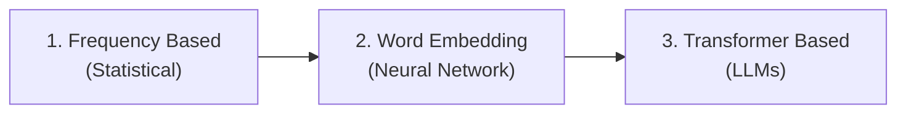

# Lecture 3: Feature Representation and Text Similarity

> **Course note**: This lecture continues from the NLP pipeline covered in Lecture 2. After text cleaning and preprocessing, the next step is **feature engineering**, which is the focus of this lecture and the next.

## Feature Engineering

**Feature Engineering**: the process of deriving new attributes to create and represent your object as a set of features.

- Feature engineering is **equally important** as preprocessing. Both fall under **data preparation**, which prepares data for the most important part: modeling.
- Feature engineering is critical in both machine learning and NLP.

> **Example (Kaggle)**: On Kaggle, where people compete on published datasets to achieve the best results, sometimes a single new feature is enough to win the contest. That is how impactful feature engineering can be.

> **Course note**: This lecture and the next lecture cover how to create features from documents and text.

---

## Why Feature Representation Matters

In machine learning, data is **numerical**, which a computer can understand. But what about **unstructured data**? Images, speech, and text are all unstructured. For the computer to work with them, we need a **mathematical model** to represent each type.

| Data Type | Mathematical Model | Representation |
|-----------|-------------------|----------------|
| **Images** | Matrix | Each value represents pixel **intensity** (e.g., 0 to 255 for grayscale) |
| **Speech** | Waveform | The **amplitude** of the wave represents a feature of the sound. Fourier transforms decompose waveforms into component frequencies. |
| **Text** | Vector space | Each word or document is represented as a **vector** of numbers |

Once we have a mathematical representation (a **feature vector**), we can feed it into any machine learning model to perform predictions, classification, clustering, or other tasks.

---

## Text Representation Techniques Overview

Text representation techniques can be classified into three categories, from earliest to most advanced:


*(added)*

| Category | Techniques | Basis |
|----------|-----------|-------|
| **Frequency based** | One hot encoding, Bag of Words, Bag of N-grams, TF-IDF | How many times a word appears (statistical) |
| **Word embedding** | Word2Vec, GloVe, FastText | Neural networks learn vector representations |
| **Transformer based** | BERT, GPT, and other LLMs | Contextual representations from the Transformer architecture |

> **Course note**: This lecture covers frequency based techniques. The next lecture covers word embedding techniques, where we actually use neural networks.

---

## Frequency Based Representation

### Historical Context

The early techniques in NLP rely on **statistical and mathematical methods**. The early pioneers of computer science came from statistical or mathematical backgrounds, so the first NLP techniques inherited that foundation. For example, regression, one of the earliest machine learning techniques, is fundamentally a statistical technique.

### The Goal

The goal of text representation is to convert text into a **numerical table** that can be fed into any machine learning algorithm:

| Instance | Feature 1 | Feature 2 | ... | Feature n |
|----------|-----------|-----------|-----|-----------|
| Document 1 | value | value | ... | value |
| Document 2 | value | value | ... | value |

Each row is a document (instance), and each column is a feature derived from the text. This is identical to the standard machine learning setup, but the features come from text.

### The Vector Space Model

**Vector Space Model**: the mathematical model used to represent text. Each word or document is represented as a **vector** in a multi-dimensional space.

- **Key idea**: Similar words should have **similar or nearby representations** in the vector space. Words that are related will have vector values close to each other.
- All existing text representation techniques, including those used by transformers, are based on vectors.

### Vectors in Linear Algebra

A **vector** has two properties:
1. **Magnitude** (length), computed using the **norm**
2. **Direction**

This concept originates from physics, where phenomena like velocity and force are represented as vectors with magnitude and direction.

From a computer science perspective, a vector is represented as an **array of numbers**. The number of elements corresponds to the number of **dimensions** in the vector space.

**Key operations on vectors**:

- **Norm (magnitude)**: $\|\vec{v}\| = \sqrt{v_1^2 + v_2^2 + \cdots + v_n^2}$ *(added)*
- **Inner product (dot product)**: $\vec{a} \cdot \vec{b} = \sum_{i=1}^{n} a_i \cdot b_i$ *(added)*

### Vectorization

**Vectorization**: the process of encoding text as integers to create **feature vectors**. *(from slides)*

**Feature Vector**: an n-dimensional vector of numerical features that represent a text object. *(from slides)*

- Each word is converted to a vector with values depending on the dimensions.
- A word in an n-dimensional space is represented as a point $(x_1, x_2, \ldots, x_n)$.
- **How we get these values depends on the technique used.** All text representation techniques produce vector values, but the key difference is **how much those values reflect the semantic meaning** of the word. This is the main way to differentiate between the different methods.

Once we have feature vectors, we can build a table of feature space (document vectors) and feed it into **any** machine learning algorithm. There is no specific model in NLP specific to text. We can use any machine learning algorithm: regression, decision trees, random forest, SVM, or any other algorithm.

---

## Early Attempt: Linguistic Feature Vectors

Before one hot encoding, there was a very early attempt to convert text to numbers. A group of **linguistic experts** came together and tried to create a vector representation for each word by:

1. Listing all unique English words
2. Creating a list of questions (e.g., "Is it male?", "Is it a living thing?", "Can it talk?", "Can we buy it?")
3. Assigning **0 or 1** based on whether each question is true or false for each word

| Word | Male? | Living? | Can talk? | Can buy? |
|------|:-----:|:-------:|:---------:|:--------:|
| man | 1 | 1 | 1 | 0 |
| woman | 0 | 1 | 1 | 0 |
| tree | 0 | 1 | 0 | 0 |

- The number of questions could be very large (300, 3000, or more).
- This approach is **language dependent**, so it cannot be used for other languages.
- It was the **first attempt** at creating a vector space representation for words, but it was not scalable.

---

## One Hot Encoding

**One Hot Encoding**: a binary vector representation where each token gets a **1** if it exists in the text, and a **0** if it does not.

### How It Works

1. **Tokenize** the text
2. Build the **vocabulary** (set of unique tokens)
3. Each vocabulary item gets a **unique ID**
4. For each document, create a binary vector: 1 if the token exists, 0 if not
5. The **dimension of the vector** depends on the number of vocabulary items

### Example (Per-Word One-Hot Vectors)

From the slides, given the sentence `"This is an example"`: *(from slides)*

| Word | Vector |
|------|--------|
| This | [1, 0, 0, 0] |
| is | [0, 1, 0, 0] |
| an | [0, 0, 1, 0] |
| example | [0, 0, 0, 1] |

Each unique word gets a binary vector where only one element is "hot" (set to 1) and all others are "cold" (set to 0).

### Example (Document-Level One-Hot Encoding)

Given vocabulary = {I, like, love, NLP, AI, fun}:

| | I | like | love | NLP | AI | fun |
|-|:-:|:----:|:----:|:---:|:--:|:---:|
| "I like NLP" | 1 | 1 | 0 | 1 | 0 | 0 |

*(reconstructed example)*

> **Implementation note**: In scikit-learn, one hot encoding works at the **token level**, not the word level. Every occurrence of a token creates a separate feature vector, even if that token appeared before. This creates **redundancy** (repeated columns). The feature space may be larger than the vocabulary size.

### Advantages and Disadvantages

| Advantages | Disadvantages |
|-----------|---------------|
| **Reversible**: easy to determine which word a vector represents | **High dimensionality**: vector size equals vocabulary size (English has 300,000+ words) |
| **Preserves position**: each word gets a unique ID, preserving word order | **Sparse representation**: many zeros, especially for short sentences in large vocabularies |
| **Easy to interpret**: each value directly maps to a word | |
| **Computationally manageable** for small vocabularies | |

---

## Bag of Words (BoW)

**Bag of Words**: a representation technique that ignores word order and represents each document as a vector of **word frequencies**.

- No order, no syntax, no positioning. Just the frequency of each word.
- "Throw all the vocabulary into a bag" and count how many times each word appears.
- It is an improved representation over one hot encoding, a step ahead, and it improves performance.

### How It Works

1. Extract all **unique vocabulary** from the corpus
2. Each vocabulary word gets a **unique index (ID)**
3. For each document, count the **frequency** of each vocabulary word
4. The resulting vector contains word counts instead of binary values

### Example

| | the | child | makes | dog | happy |
|-|:---:|:-----:|:-----:|:---:|:-----:|
| "The child makes the dog happy" | 2 | 1 | 1 | 1 | 1 |
| "The dog makes the child happy" | 2 | 1 | 1 | 1 | 1 |

*(reconstructed example)*

> **Critical limitation**: The slides illustrate this with two examples:
> - "The child makes the dog happy" vs. "The dog makes the child happy" have **completely different meanings** but the same BoW representation.
> - "John is quicker than Mary" vs. "Mary is quicker than John" also produce identical vectors. *(from slides)*
>
> This demonstrates that BoW cannot capture word order or meaning.

### Implementation with scikit-learn

The slides show this exact code for creating a document-term matrix with CountVectorizer: *(from slides)*

```python
import pandas as pd
from sklearn.feature_extraction.text import CountVectorizer

corpus = ['This is the first document.',
          'This is the second document.',
          'And the third one. One is fun.']

cv = CountVectorizer()
X = cv.fit_transform(corpus)
pd.DataFrame(X.toarray(), columns=cv.get_feature_names_out())
```

The output is a document-term matrix where rows are documents and columns are vocabulary words, with each cell containing the word count.

### Advantages and Disadvantages

| Advantages | Disadvantages |
|-----------|---------------|
| **Simple and interpretable**: just count frequencies | **Ignores context**: no word order, no syntax |
| **Works for text classification**: topic-based classification using word frequencies | **No semantic meaning**: words are just numbers, no meaning attached |
| **Useful for information retrieval** | **Dimensionality depends on vocabulary size** |
| **Computationally simple** | **Sparse representation**: many zeros |
| **Language independent**: applicable to English, French, or any language | **Out of vocabulary (OOV)**: cannot represent words not seen during training |

### How Research Improves

One of the main disadvantages of bag of words is the lack of semantic information. In the research area, people study the limitations of existing techniques and then start to work on overcoming them. This is how research improves: if you find a research topic, you research all the documentation related to it, study it well, and find how to come up with a new idea to overcome some limitation.

---

## Bag of N-grams

**Bag of N-grams**: divides text into chunks of **n consecutive words** (or tokens), then counts the frequency of each chunk.

- When $n = 1$: **unigram** (equivalent to bag of words)
- When $n = 2$: **bigram** (pairs of consecutive words)
- When $n = 3$: **trigram** (triplets of consecutive words)

### Motivation

N-grams try to **introduce some local context** into the representation. If two words frequently appear together (e.g., "machine learning"), counting that pair captures some semantic meaning that single-word frequencies miss.

### Example

Sentence: `"I love NLP and deep learning"`

| N | N-grams |
|---|---------|
| 1 (unigram) | I, love, NLP, and, deep, learning |
| 2 (bigram) | I love, love NLP, NLP and, and deep, deep learning |
| 3 (trigram) | I love NLP, love NLP and, NLP and deep, and deep learning |

*(reconstructed example)*

From the slides, another example: *(from slides)*

Sentence: `"I am learning NLP"`
- Unigrams: "am", "learning", "NLP"
- Bigrams: "am learning", "learning NLP"
- Trigrams: "am learning NLP"

### Using `ngram_range` in scikit-learn

```python
from sklearn.feature_extraction.text import CountVectorizer

documents = ["I love NLP and deep learning"]

# Extract only bigrams
bigram_vec = CountVectorizer(ngram_range=(2, 2))
X_bigram = bigram_vec.fit_transform(documents)
print("Bigrams:", bigram_vec.get_feature_names_out())

# Extract both unigrams and bigrams
combined_vec = CountVectorizer(ngram_range=(1, 2))
X_combined = combined_vec.fit_transform(documents)
print("Uni+Bigrams:", combined_vec.get_feature_names_out())
```
*(reconstructed example)*

- `ngram_range=(2, 2)` extracts **only bigrams**
- `ngram_range=(1, 2)` extracts **both unigrams and bigrams**

### Advantages and Disadvantages

| Advantages | Disadvantages |
|-----------|---------------|
| **Captures local context** (2 or 3 word windows) | **Computationally expensive**: much larger feature space |
| **Efficient representation** | **High dimensionality** with many zeros |
| **Interpretable and simple** | **Ignores overall sentence structure**: only captures local context |
| | **Choice of n is a challenge**: larger n captures more context but increases feature space dramatically. Chosen through trial and error. |
| | **Out of vocabulary**: unseen n-grams get zero representation |

---

## TF-IDF (Term Frequency, Inverse Document Frequency)

**TF-IDF**: a weighting scheme that measures how important a word is to a document within a corpus. It combines two components: how often a word appears in a document (TF) and how rare that word is across the entire corpus (IDF).

### Origin

TF-IDF was invented **before NLP**, originating from **information retrieval**. It was originally used to rank search results by measuring how well a result matches a user query. Researchers then realized this technique could also be used to represent text.

### The Key Idea

- If a word is repeated many times in a **specific document** and it is not a stop word, it means this word is **important for that document**.
- But if the **same word** is also repeated many times across the **whole corpus**, then it is just a **common word**, not significant to any particular document.
- TF-IDF adds a **weight** based on two factors:
  1. How often the word appears in the document (TF)
  2. How rare the word is across the entire corpus (IDF)
- **Rare words get higher weight.** Common words get lower weight.

### Formulas

$$\text{TF-IDF}(t, d) = \text{TF}(t, d) \times \text{IDF}(t)$$

**Term Frequency (TF)**: the ratio of a word's count in a document to the total number of words in that document.

$$\text{TF}(t, d) = \frac{\text{Number of times term } t \text{ appears in document } d}{\text{Total number of terms in document } d}$$

**Inverse Document Frequency (IDF)**: measures how rare a word is across the entire corpus. The **log** is used to smooth the differences between values, reducing the large gaps between raw frequency counts.

$$\text{IDF}(t) = \log_{10}\left(\frac{\text{Total number of documents}}{\text{Number of documents containing term } t}\right)$$

### Worked Example

Given:
- Total documents in corpus: **1000**
- Document size: **100 words**
- Word "Trump" appears in the document: **5 times**

**Step 1: Compute TF**

$$\text{TF} = \frac{5}{100} = 0.05$$

**Step 2: Compute IDF (Case 1, "Trump" appears in 50 documents)**

$$\text{IDF} = \log_{10}\left(\frac{1000}{50}\right) = \log_{10}(20) = 1.3$$

**Step 3: Compute TF-IDF**

$$\text{TF-IDF} = 0.05 \times 1.3 = 0.065$$

**Step 2b: Compute IDF (Case 2, "Trump" appears in only 5 documents)**

$$\text{IDF} = \log_{10}\left(\frac{1000}{5}\right) = \log_{10}(200) = 2.3$$

**Step 3b: Compute TF-IDF**

$$\text{TF-IDF} = 0.05 \times 2.3 = 0.115$$

> **Key insight**: When "Trump" appeared in only 5 documents (rare), the TF-IDF score was **0.115** (higher weight). When it appeared in 50 documents (common), the score was **0.065** (lower weight). Rare words receive more weight because they are more discriminative.

> **Course note**: You may find questions in your midterm related to TF-IDF. Practice these calculations with your colleagues.

### Step-by-step Example with Four Documents

1. Compute the **frequency** of each word in each document (after removing stop words)
2. Compute **TF** for each word: occurrences / total tokens in the document
3. Compute **IDF** for each word: $\log_{10}(\text{total docs} / \text{docs containing the word})$
4. Multiply **TF × IDF** to get the weighted feature space

### Implementation with scikit-learn

The in-class code demonstrates the full pipeline: cleaning, stop word removal, punctuation removal, then creating the feature space using CountVectorizer, bag of n-grams, and TF-IDF on the same corpus.

```python
from sklearn.feature_extraction.text import TfidfVectorizer

documents = [
    "The sky is blue",
    "The sun is bright",
    "The sun in the sky is bright",
    "We can see the bright sun and the blue sky"
]

tfidf = TfidfVectorizer()
X = tfidf.fit_transform(documents)

print("Vocabulary:", tfidf.get_feature_names_out())
print("TF-IDF matrix:\n", X.toarray().round(3))
```
*(reconstructed example)*

> **Course note**: The in-class code shows how to represent the same corpus using all three techniques (CountVectorizer, n-grams, TF-IDF) so you can compare their feature spaces side by side.

The slides show a direct side-by-side comparison: *(from slides)*

```python
import pandas as pd

corpus = ['This is the first document.',
          'This is the second document.',
          'And the third one. One is fun.']

# Count Vectorizer
from sklearn.feature_extraction.text import CountVectorizer
cv = CountVectorizer()
X = cv.fit_transform(corpus).toarray()
pd.DataFrame(X, columns=cv.get_feature_names_out())

# TF-IDF Vectorizer
from sklearn.feature_extraction.text import TfidfVectorizer
cv_tfidf = TfidfVectorizer()
X_tfidf = cv_tfidf.fit_transform(corpus).toarray()
pd.DataFrame(X_tfidf, columns=cv_tfidf.get_feature_names_out())
```

The Count Vectorizer output contains **whole numbers** (raw counts), while the TF-IDF output contains **real numbers** (weighted scores). This side-by-side comparison shows how TF-IDF introduces weights that differentiate words by importance.

> **Group work from slides**: Compute TF-IDF for the following documents: *(from slides)*
> - D1: "Dog bites man"
> - D2: "Man bites dog"
> - D3: "Dog eats meat"
> - D4: "Man eats food"

### CountVectorizer vs. TF-IDF Comparison

| Aspect | CountVectorizer (BoW) | TfidfVectorizer (TF-IDF) |
|--------|----------------------|--------------------------|
| **Values** | Whole numbers (raw counts) | Real numbers (weighted scores) |
| **Weighting** | None, just raw frequency | Words weighted by importance across corpus |
| **Rare words** | No special treatment | Receive **higher weight** |
| **Common words** | No special treatment | Receive **lower weight** |

### About the Zeros

Even zeros carry information in these feature spaces. A zero means the word does **not exist** in that document, which is itself an important attribute for characterizing the document.

### Limitations of TF-IDF

| Limitation | Explanation |
|-----------|-------------|
| **No relation between words** | Each word is treated as an independent unit, with no consideration of context |
| **Sparsity** | Many zeros in the feature space |
| **No semantic understanding** | The word "bank" (financial institution) and "bank" (river side) get the same representation |
| **Not suited for small corpora** | With few documents, IDF can mislead by over-inflating the importance of words that are not actually significant |
| **Out of vocabulary** | Cannot represent words not seen during training. E.g., if "xyz" is not in the vocabulary, it gets no representation |

---

## Summary of Frequency Based Techniques

| Technique | How It Works | Strengths | Weaknesses |
|-----------|-------------|-----------|------------|
| **One Hot Encoding** | Binary (0/1) for word presence | Reversible, interpretable, preserves position | Very high dimensionality, extremely sparse |
| **Bag of Words** | Count word frequencies | Simple, language independent | Ignores word order, no semantics |
| **Bag of N-grams** | Count n-gram frequencies | Captures local context | Computationally expensive, choice of n |
| **TF-IDF** | Weighted word frequencies | Weights by importance, reduces common word influence | Still no semantics, small corpus issues |

**Common disadvantages across all frequency based methods**:
- No semantic meaning
- Sparse representation
- High dimensionality based on vocabulary size
- Out of vocabulary problem

> **Key takeaway**: These frequency based techniques, coming from statistical roots, were a huge step forward and enabled many NLP tasks. However, they are not ideal representations because they cannot capture semantic meaning. In the next step, **word embedding**, researchers try to overcome all these disadvantages by using neural networks to learn vector representations that capture context.

> **Important**: Frequency based methods are still relevant. They are not obsolete just because they have limitations. For tasks where **frequency matters more than semantics** (e.g., simple text classification, information retrieval), **TF-IDF works very well** and is computationally much cheaper than neural network approaches. Always consider the **trade-off between accuracy and computation cost** when choosing a representation method.

> **Course note**: Text representation is still an open research topic. Even with transformers and large language models, we have not achieved the ideal representation. It remains a hot topic of research.

---

## Text Similarity

**Text Similarity**: a computational method to measure the degree of similarity between words, sentences, or documents.

### Purpose

Text similarity serves as a **benchmark test** to evaluate and compare different text representation techniques. If we have two methods of representing text, we compare them by measuring how well each one captures the similarity between texts that we know are related.

### Applications

From the slides, text similarity is used in: *(from slides)*
- Speech recognition
- Machine translation
- Plagiarism detection
- Information retrieval
- Text classification
- Search engines

### Similarity Metrics

| Metric | Type | What It Measures |
|--------|------|-----------------|
| **Jaccard Similarity** | Set-based | Overlap between two sets of words |
| **Levenshtein Distance** | Edit-based | Minimum edit operations between two strings |
| **Hamming Distance** | Edit-based | Number of differing positions between equal-length strings |
| **Euclidean Distance** | Vector-based | Straight-line distance between two points in vector space |
| **Cosine Similarity** | Vector-based | Angle between two vectors (most used in NLP) |

---

### Levenshtein Distance (Edit Distance)

**Levenshtein Distance**: the minimum number of **single-character operations** (insertions, deletions, substitutions) required to transform one word into another.

#### Example: "kitten" → "sitting"

| Step | Operation | Result |
|------|-----------|--------|
| 1 | Substitute **k** → **s** (mutation) | **s**itten |
| 2 | Substitute **e** → **i** (mutation) | sitt**i**n |
| 3 | Insert **g** at end (insertion) | sittin**g** |

**Levenshtein distance = 3** *(from slides)*

---

### Euclidean Distance

**Euclidean Distance**: the straight-line distance between two points in vector space.

$$d(\vec{a}, \vec{b}) = \sqrt{\sum_{i=1}^{n}(a_i - b_i)^2}$$

If word X is represented as a vector and word Y is represented as a vector, we can easily apply Euclidean distance to get how similar these two words are.

According to the lecturer, Euclidean distance does not take into account the **direction** of the vector. It measures only the **magnitude** (the raw distance between two points).

---

### Cosine Similarity

**Cosine Similarity**: measures the **angle** between two vectors in a multi-dimensional space. It is the most widely used similarity metric in NLP. The difference from Euclidean distance is that cosine similarity considers both the **magnitude and the direction** of the vectors.

$$\text{cosine\_similarity}(\vec{A}, \vec{B}) = \frac{\vec{A} \cdot \vec{B}}{\|\vec{A}\| \times \|\vec{B}\|}$$

#### How It Works

- If two vectors point in the **same direction** (angle = 0°), $\cos(0°) = 1$ → **identical**
- If two vectors are **perpendicular** (angle = 90°), $\cos(90°) = 0$ → **no similarity**
- If two vectors point in **opposite directions** (angle = 180°), $\cos(180°) = -1$ → **opposite**

#### Why Cosine Similarity Works as a Benchmark

1. Represent each text (word, sentence, document) using a representation technique (BoW, TF-IDF, etc.)
2. Compute cosine similarity between texts that we **know** are similar
3. If the similarity score is **high**, the representation technique is doing a **good job** of capturing meaning
4. If the similarity score is **low**, the representation technique is **not capturing the relationship** well

#### Worked Example *(added)*

Given two document vectors:
- $\vec{A} = [1, 2, 1]$
- $\vec{B} = [2, 1, 1]$

$$\vec{A} \cdot \vec{B} = (1)(2) + (2)(1) + (1)(1) = 5$$

$$\|\vec{A}\| = \sqrt{1^2 + 2^2 + 1^2} = \sqrt{6}$$

$$\|\vec{B}\| = \sqrt{2^2 + 1^2 + 1^2} = \sqrt{6}$$

$$\text{cosine\_similarity} = \frac{5}{\sqrt{6} \times \sqrt{6}} = \frac{5}{6} \approx 0.833$$

A score of 0.833 is considered **high**, indicating strong similarity.

#### Cosine Similarity from Slides: "I love NLP" vs. "I love you"

The slides provide this concrete example: *(from slides)*

| | I | love | you | NLP |
|-|:-:|:----:|:---:|:---:|
| Doc 1: "I love NLP" | 1 | 1 | 0 | 1 |
| Doc 2: "I love you" | 1 | 1 | 1 | 0 |

$\vec{a} = [1, 1, 1, 0]$, $\vec{b} = [1, 1, 0, 1]$

$$\text{cosine\_similarity} = \frac{(1)(1)+(1)(1)+(1)(0)+(0)(1)}{\sqrt{1+1+1+0} \times \sqrt{1+1+0+1}} = \frac{2}{\sqrt{3} \times \sqrt{3}} = \frac{2}{3} \approx 0.667$$

A score of 0.667 is considered **high**. The documents are not identical, but there is meaningful similarity. How accurate the similarity measure is depends on how good the vector representation is, which is precisely why cosine similarity serves as a benchmark.

#### Implementation

```python
from sklearn.feature_extraction.text import CountVectorizer, TfidfVectorizer
from sklearn.metrics.pairwise import cosine_similarity

documents = [
    "It is hot outside",
    "The sun is hot",
    "I make my hot chocolate with milk",
    "I will have hot chocolate with milk"
]

# Using CountVectorizer
count_vec = CountVectorizer()
count_matrix = count_vec.fit_transform(documents)
print("Cosine similarity (CountVectorizer):")
print(cosine_similarity(count_matrix).round(3))

# Using TF-IDF
tfidf_vec = TfidfVectorizer()
tfidf_matrix = tfidf_vec.fit_transform(documents)
print("\nCosine similarity (TF-IDF):")
print(cosine_similarity(tfidf_matrix).round(3))
```
*(reconstructed example)*

#### Document Similarity: Slide Example with Actual Output

The slides use the following five documents: *(from slides)*

1. "The weather is hot under the sun"
2. "I make my hot chocolate with milk"
3. "One hot encoding"
4. "I will have a chai latte with milk"
5. "There is a hot sale today"

**Using CountVectorizer**, the top cosine similarity pairs are: *(from slides)*

| Pair | Cosine Similarity |
|------|:-----------------:|
| "The weather is hot under the sun" & "One hot encoding" | 0.408 |
| "One hot encoding" & "There is a hot sale today" | 0.408 |
| "I make my hot chocolate with milk" & "One hot encoding" | 0.354 |
| "The weather is hot under the sun" & "There is a hot sale today" | 0.333 |

The highest similarity is driven by the shared word "hot," which is not a meaningful indicator of document similarity.

**Using TF-IDF**, the top result changes: *(from slides)*

| Pair | Cosine Similarity |
|------|:-----------------:|
| "I make my hot chocolate with milk" & "I will have a chai latte with milk" | **0.232** |
| "The weather is hot under the sun" & "One hot encoding" | 0.182 |
| "One hot encoding" & "There is a hot sale today" | 0.182 |

By weighting "milk" (rare) higher than "hot" (common), TF-IDF produces a smarter similarity score. The milk-related documents are now ranked as most similar, which is more logical.

> This demonstrates how TF-IDF produces a **better representation** than raw counts, as it captures word importance rather than just frequency.

> **Course note**: We will continue with cosine similarity in the next lecture when we cover embedding techniques, where neural networks generate vector representations by learning the context between words.

#### Practice Exercises from Slides

**Exercise 1**: Given the following word-context matrix, compute the cosine similarity between the indicated pairs: *(from slides)*

| | pie | data | computer |
|---|:---:|:----:|:--------:|
| cherry | 442 | 8 | 2 |
| digital | 5 | 1683 | 1670 |
| information | 5 | 3982 | 3325 |

**Exercise 2**: Given three documents, compute pairwise cosine similarity using Count Vectorizer, BOW, and TF-IDF: *(from slides)*
- d1: "ant ant bee"
- d2: "dog bee dog hog dog ant dog"
- d3: "cat gnu dog eel fox"

---

## Ethical Concerns of Frequency Based Techniques

### 1. Context and Meaning Failures

Frequency based methods cannot capture context or meaning. This can lead to **false similarity or false dissimilarity** in applications like plagiarism detection: two texts may look similar in their representation but have completely different meanings, or truly similar texts could be rated as different.

### 2. Term Bias (Common Topic Bias)

Frequency based methods prioritize **high-frequency words and topics**. This creates a bias where popular topics receive more weight and visibility, while **minority or less-discussed topics** (even if scientifically or socially important) are underrepresented. For example, on social media, people talk about trending topics but may ignore deep scientific knowledge. Frequency based methods would treat those important but rare topics as less significant.

### 3. Language Bias

On the internet, most documents are written in **English**. Frequency based methods applied to such data will inherently introduce bias against **minority languages**, giving disproportionate representation to dominant languages.

---

## Choosing the Right Representation

| If your task needs... | Use... | Reason |
|----------------------|--------|--------|
| Simple text classification | TF-IDF | Works well, computationally cheap |
| Information retrieval | TF-IDF | Designed for ranking and relevance |
| Semantic understanding | Word embeddings (next lecture) | Captures meaning and context |
| Deep contextual understanding | Transformer models | State of the art, but computationally expensive |

> **Key principle**: Not because a method has limitations does it mean it will not work for any NLP task. Frequency based methods are still used in practice. Always consider your task requirements and the **trade-off between accuracy and computation cost**.

---

## What's Next (Lecture 4 Preview)

The next lecture covers **word embedding techniques**, where we use neural networks to generate vector representations that capture context and semantic meaning:
- Word2Vec
- GloVe
- FastText
- Cosine similarity applied to embeddings
