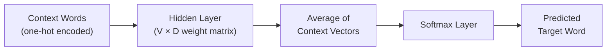
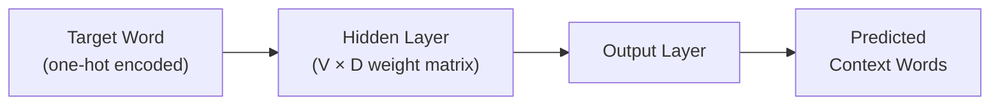

# Lecture 4: Word Embedding

> **Course note**: This lecture is very important. It introduces the core of NLP. The next lecture will move from embedding to modelling, covering deep neural networks and recurrent models, building toward the Transformer.

## Overview

**Word embedding** is a building block for any application in natural language processing. Even all the improvements introduced by the Transformer architecture are based on the idea of word embedding.

This lecture covers the following word embedding techniques:

| Technique | Origin | Year |
|-----------|--------|:----:|
| **Word2Vec** (Skip-gram + CBOW) | Google | 2013 |
| **GloVe** | Stanford University | 2014 |
| **FastText** | Facebook (Meta) | 2016 |

It also covers **WordNet** as an earlier, non-computational attempt to introduce semantic meaning.

### Text Representation Categories

| Category | Approach | Techniques | Covered |
|----------|----------|------------|:-------:|
| **Statistical-based** | Count word frequencies | One-hot encoding, Bag of Words, Bag of N-Grams, TF, TF-IDF | Lecture 3 |
| **Prediction-based** | Learn from context using neural networks | Word2Vec, GloVe, FastText | This lecture |
| **Universal text representations** | Contextualized representations | ELMo, BERT, ULMFiT | Future lecture |

---

## Motivation: Why Move Beyond Count-Based Representations?

### Unstructured Data Representations

Different types of unstructured data already have dense mathematical representations:

- **Images**: represented as a matrix where each entry holds a pixel intensity value. Every point has a specific value.
- **Audio/Speech**: represented using Fourier transforms, wavelet transforms, or other signal processing techniques. Each point in the signal has an amplitude value.
- **Text (count-based)**: represented as a sparse vector, with many zero entries.

The key observation is that images and audio are naturally **dense** (every position has a meaningful value), while count-based text representations are **sparse** (most positions are zero). The goal of this lecture is to find a technique to represent words as dense vectors.

### Limitations of Count-Based Text Representation

| Limitation | Explanation |
|-----------|-------------|
| **High dimensionality** | The vector dimension equals the vocabulary size. A corpus with one million words produces vectors of dimension one million. |
| **Sparse vectors** | Most entries in the vector are zero. |
| **Out-of-vocabulary (OOV)** | New words encountered during testing have no representation. Frequency-based techniques simply ignore them. |
| **Lack of semantic meaning** | Count-based methods only track frequency, not meaning. TF and TF-IDF do not consider what a word means, only how often it appears. |

The lack of semantic meaning is the most critical limitation. A word is not just a string. It has a meaning, and that meaning changes depending on the context in which the word appears. For example, the word "bank" means something different in "river bank" versus "bank account."

In tasks where we do not rely on semantics, the count-based technique is preferred because it is easy to implement. But with some computational considerations, the majority of NLP tasks suffer with a representation based only on frequency.

### Word Semantics and Context

If you hear the word "king," related words come to mind: regent, royal, princess, queen. Each word has a relation to other words in the same field.

> **Semantic field**: a set of words which cover a particular semantic domain. For example, words related to restaurants (waiter, menu, plate, food, chef) or words related to houses (door, roof, kitchen, family, bed) form semantic fields. Cat is not a synonym of dog, but cats and dogs are certainly similar words within the "animals" semantic field. *(from slides)*

Similarly, the word "restaurant" is related to words like "food," "menu," "waiter," and "chef" within that specific domain. Even though these words have completely different meanings individually, when they appear in the same domain, they are semantically related.

The **embedding vector** must capture two features:
1. **Word semantics**: the inherent meaning of the word.
2. **Contextual relations**: the relation of the word to other words when it appears in a specific context.

### Early Approach: Human Expert Annotation

One way of getting word similarity is to ask humans. Early approaches involved assembling a group of experts who would describe each word as a set of binary features (zeros and ones). This manual approach inspired the first structured attempt at encoding word meaning: WordNet.

---

## WordNet: A First Attempt at Semantic Representation

### What is WordNet?

**WordNet**: a lexical database (network of words) created by Princeton University. It is available in NLTK, spaCy, and most text processing packages.

For any word, WordNet provides:

| Feature | Description |
|---------|-------------|
| **Synsets** | Sets of synonyms for the word |
| **Gloss** | A definition of the word |
| **Examples** | Example sentences showing usage |
| **Relations** | Synonymy, antonymy, hypernymy (is-a), meronymy (part-of), and more |

### WordNet Key Concepts *(from slides)*

| Concept | Definition | Example |
|---------|-----------|--------|
| **Synset** | A set of synonyms that share a common meaning | {car, automobile, motorcar} |
| **Hypernym** | A general term that encompasses more specific terms | "animal" is a hypernym of "dog" |
| **Hyponym** | A specific term within a broader category | "dog" is a hyponym of "animal" |
| **Meronym** | A term that denotes a part of something | "wheel" is a meronym of "car" |
| **Holonym** | A term that denotes a whole of which the meronym is a part | "car" is a holonym of "wheel" |
| **Antonym** | Words that have opposite meanings | "hot" and "cold" |
| **Troponym** | A verb that denotes a specific manner of doing something | "run" is a troponym of "move" |
| **Entailment** | A relationship where one verb implies another | "snore" entails "sleep" |

### Using WordNet in Python

```python
from nltk.corpus import wordnet

# Get all synsets for the word "car"
synsets = wordnet.synsets("car")

for syn in synsets:
    print(f"Name: {syn.name()}")
    print(f"POS:  {syn.pos()}")
    print(f"Def:  {syn.definition()}")
    print(f"Ex:   {syn.examples()}")
    print()

# Example output for first synset:
# Name: car.n.01
# POS:  n
# Def:  a motor vehicle with four wheels; usually propelled by an internal combustion engine
# Ex:   ['he needs a car to get to work']
```
*(reconstructed example)*

### WordNet for Query Expansion

WordNet can improve NLP systems through **query expansion**. In a document retrieval or question answering system:

1. The user writes a query (e.g., "car").
2. Extract the keywords from the query.
3. Use WordNet to find all synonyms (e.g., "motor," "automobile," "vehicle").
4. Search the database using both the original keywords and the synonyms.


*(added)*

The benefit is that the search retrieves not only documents mentioning "car" but also documents using any of its synonyms, broadening the range of relevant results.

> WordNet is not used as a standalone technique in modern NLP. It is used as an integration into another NLP system to improve its performance slightly.

### Limitations of WordNet

| Limitation | Explanation |
|-----------|-------------|
| **Not computational** | It is not a mathematical model that produces a vector with semantic meaning. |
| **Static coverage** | Not updated dynamically. New words and evolving language are not reflected. |
| **English only** | No equivalent WordNet exists for other languages at the same level of quality. |
| **Human-built** | Created by language experts, which introduces potential bias. |
| **Domain gaps** | Specialized scientific or technical terminology may not be covered. |

> **Reference**: "Text classification with semantically enriched word embeddings" (Cambridge University Press, 2020) describes an approach where the context of each synset is tokenized, each word is mapped to a vector via a learned embedding matrix, and the synset vector is computed as the centroid (average) of all context word embeddings. *(from slides)*

---

## Foundations of Word Embedding

### Distributional Similarity and the Distributional Hypothesis

When researchers moved beyond WordNet, they built word embedding systems based on two phenomena:

1. **Distributional similarity**: the meaning of a word can be understood from its context.
2. **Distributional hypothesis**: words that appear in similar contexts are similar.

For example, words related to "restaurant" (menu, food, waiter, chef) all appear in similar contexts and therefore have some shared similarity. These two hypotheses became the starting point for word embedding.

### What is Word Embedding?

**Word embedding** (also called **vector semantics**): a computational model that learns the representations of linguistic units (words, phrases, or documents) based on distributional properties of these units in a large corpus. *(from slides)*

Key properties:
- **Representation of linguistic units as vectors** in a multi-dimensional space. *(from slides)*
- **Encoding semantic information** using mathematical vectors. *(from slides)*
- **Standard way** to represent word meaning in NLP. *(from slides)*
- **Prediction, not counting**: models learn from data using neural networks rather than counting frequencies.
- **Self-supervised**: the data itself provides the labels. No human annotation is needed.
- **Dense vectors**: each position in the vector holds a meaningful value (no zeros).
- **Configurable dimensionality**: the vector dimension $D$ is a hyperparameter chosen by the user (e.g., 50, 100, 200, 300). It is not tied to the vocabulary size.

The embedding function maps each word in the vocabulary to a vector of dimension $D$:

$$f: V \rightarrow \mathbb{R}^D$$

*(added)*

where $V$ is the vocabulary and $D$ is the chosen embedding dimension. Higher dimensions capture more features but require more computation.

### Word Analogy

If the embedding representation truly captures semantic meaning, then the distances between semantically related words should be consistent:

$$\vec{\text{king}} - \vec{\text{man}} + \vec{\text{woman}} \approx \vec{\text{queen}}$$

More examples of word analogies:

| Relationship | Analogy |
|-------------|---------|
| Gender | king : man :: queen : woman |
| Verb tense | walk : walking :: swim : swimming |
| Country : Capital | Spain : Madrid :: Italy : Rome |

These analogies work because the embedding places semantically related words in consistent geometric relationships in the vector space.

### Self-Supervision

In a **supervised** setting, a human must annotate labels for the training data. In **self-supervised** learning, the data itself provides the annotation. For word embedding, the text supplies its own labels: the surrounding words serve as context, and the target word becomes the label (or vice versa). No human annotation is required.

---

## Word2Vec

**Word2Vec**: one of the most popular word embedding techniques. Published by Google in 2013. It uses self-supervision and prediction to create dense word vectors. The code is widely available in libraries, you do not have to implement it from scratch, and it is very fast to train.

> The idea of self-supervision for word embedding was introduced by Bengio et al. (2003) and Collobert et al. (2011). *(from slides)*

Word2Vec combines two techniques:
1. **CBOW (Continuous Bag of Words)**: predicts the target (center) word from its context (surrounding words).
2. **Skip-gram**: predicts the context (surrounding words) from the target (center) word.

> This lecture focuses on the intuition behind each technique, not the mathematical details. For the full mathematical derivation, the lecturer provides a reference for further reading.

### Continuous Bag of Words (CBOW)

#### Idea

1. Use a sliding window of size $2K + 1$ (must be odd) over the corpus.
2. The surrounding words are the **context** (input).
3. The middle word is the **target** (output to predict).
4. Slide the window one word at a time through the entire corpus.

#### Example Training Samples

For the sentence: *"The cat sat on the mat"* with window size 5 ($K = 2$): *(added)*

| Context (Input) | Target (Output) |
|-----------------|:--------------:|
| [The, cat, on, the] | sat |
| [cat, sat, the, mat] | on |

#### Architecture


*(added)*

1. **Input layer**: each context word is represented as a one-hot vector (a vector of size $V$ with a single 1 and the rest zeros).
2. **Hidden layer**: a weight matrix $W$ of dimension $V \times D$, where $V$ is the vocabulary size and $D$ is the chosen embedding dimension.
   - Multiplying a one-hot vector by $W$ selects the corresponding row from the weight matrix (the word's embedding).
   - The weight matrix is initialized with random values.
3. **Averaging**: the extracted context word vectors are averaged to produce a single vector.
4. **Softmax layer**: converts the result to a probability distribution over the vocabulary.
5. **Backpropagation**: the difference between the predicted probability and the actual target is computed. The weight matrix is updated to minimize this difference.

After the training process completes, the hidden layer weight matrix $W$ becomes the embedding matrix. Each word's embedding is a row in this $V \times D$ matrix.

> The more corpus you give your model, the more opportunity it has to learn from the text. More data produces better embeddings.

### Skip-gram

#### Idea

Skip-gram is the opposite of CBOW:

1. Use a sliding window over the corpus.
2. The middle word is the **input**.
3. The surrounding words are the **targets** (outputs to predict).
4. The objective is to minimize the sum of prediction errors across all context words.

#### Architecture


*(added)*

- The input is a single one-hot encoded word.
- The training generates pairs: (target word, context word) for each context position.
- **Boundary handling**: when the window is at the beginning or end of the text and not all context positions are filled, padding (zero vectors) is used.

After training, the hidden layer weight matrix serves as the embedding, just like in CBOW.

> The lecturer recommended a resource that provides a step-by-step numerical example of how Skip-gram works mathematically.

#### Skip-gram Prediction Example *(from slides)*

For the sentence *"the cat sat on the mat"* with context size = 2:

| Step | Center Word ($w_t$) | $w_{t-2}$ | $w_{t-1}$ | $w_{t+1}$ | $w_{t+2}$ |
|:----:|:-------------------:|:----:|:----:|:----:|:----:|
| 1 | the | \<start-2\> | \<start-1\> | cat | sat |
| 2 | cat | \<start-1\> | the | sat | on |
| 3 | sat | the | cat | on | the |
| 4 | on | cat | sat | the | mat |
| 5 | the | sat | on | mat | \<end+1\> |
| 6 | mat | on | the | \<end+1\> | \<end+2\> |

At boundaries (steps 1, 2, 5, 6), missing context positions are filled with start/end padding tokens.

### CBOW vs. Skip-gram

| Aspect | CBOW | Skip-gram |
|--------|------|-----------|
| **Input** | Context words | Target word |
| **Output** | Target word | Context words |
| **Speed** | Faster | Slower |
| **Best for** | High-frequency words | Smaller datasets, rare words |
| **Classification** | Easier to use for classification | Harder for classification |

### Skip-gram with Negative Sampling (SGNS)

**SGNS**: an extension of Skip-gram that improves learning by introducing both positive and negative training samples.

- **Positive samples**: actual context words that appear around the target word.
- **Negative samples**: random words that do not appear in the context of the target word.

**Objective**: maximize the similarity between the target word and its positive samples, while minimizing the similarity between the target word and its negative samples.

This forces the model to learn finer distinctions between words and adds more semantic information to the embedding.

#### SGNS Steps *(from slides)*

1. Treat the target word and a neighboring context word as **positive examples**.
2. Randomly sample other words in the lexicon to get **negative examples**.
3. Use **logistic regression** to train a classifier to distinguish the two cases.
4. Use the learned weights as the **embeddings**.

The learning objective is to adjust the word vectors such that the similarity of positive pairs $(w, c_{pos})$ is maximized and the similarity of negative pairs $(w, c_{neg})$ is minimized.

> Google published the Word2Vec model in 2013 using Skip-gram with Negative Sampling.

### Using Pre-trained Word2Vec

Google trained Word2Vec on the Google News dataset: a vocabulary of **3 million words and phrases** from **100 billion words** of Google News text. *(from slides)* They provide pre-trained embeddings in multiple dimensions (50, 100, 300).

> **Pre-trained model URL**: [https://code.google.com/archive/p/word2vec/](https://code.google.com/archive/p/word2vec/) *(from slides)*

**Benefits of using a pre-trained model**:
- No need to train from scratch.
- The weight matrix (embedding) is already computed from a massive corpus.
- Simply look up the embedding vector for any word.

#### Loading Pre-trained Word2Vec with Gensim

```python
import gensim.downloader as api

# Load the 300-dimension pre-trained model
model = api.load("word2vec-google-news-300")

# Get the embedding vector for a word
vector = model["king"]
print(vector.shape)  # (300,)
print(vector[:5])    # First 5 dimensions of the dense vector
```
*(reconstructed example)*

#### Finding Word Similarities

```python
# Cosine similarity between two words
similarity = model.similarity("king", "queen")
print(f"Similarity (king, queen): {similarity:.4f}")

# Find the top 3 most similar words
similar_words = model.most_similar("cup", topn=3)
print(similar_words)
```
*(reconstructed example)*

#### Using Word2Vec as Feature Vectors for NLP Tasks

To use word embeddings for a downstream task like sentiment analysis:

1. Tokenize your input text.
2. Look up the Word2Vec embedding for each token.
3. Average all the token vectors to produce a single feature vector for the text.
4. Use this feature vector as input to your classifier.

### Training Your Own Word2Vec Model

If you want to train on your own corpus instead of using a pre-trained model:

```python
from gensim.models import Word2Vec

# Your tokenized corpus (list of lists of tokens)
corpus = [
    ["natural", "language", "processing", "is", "important"],
    ["word", "embedding", "captures", "semantic", "meaning"],
    # ... more sentences
]

model = Word2Vec(
    sentences=corpus,
    min_count=1,      # Include words appearing at least 1 time
    vector_size=100,   # Embedding dimension D
    window=5,          # Context window size
    sg=1,              # 0 = CBOW, 1 = Skip-gram
    negative=5         # Number of negative samples (0 = no negative sampling)
)

# Access the embedding for a word
vector = model.wv["language"]
print(vector.shape)  # (100,)
```
*(reconstructed example)*

#### Key Parameters

| Parameter | Meaning | Notes |
|-----------|---------|-------|
| `min_count` | Minimum word frequency to include | Set to 1 to include all words. Set higher to exclude rare words. |
| `vector_size` | Embedding dimension $D$ | Common values: 50, 100, 200, 300. More dimensions capture more features. |
| `window` | Context window size | Larger windows capture broader context. |
| `sg` | Algorithm selection | `0` = CBOW, `1` = Skip-gram |
| `negative` | Number of negative samples | `> 0` enables SGNS (only meaningful with Skip-gram). `0` disables it. |

> Choosing the right dimension is a challenge. Based on your computational resources and the criticality of your application, you select the dimension. Higher dimensions capture more features but cost more computation.

### Visualization and Custom Training

The in-class code includes examples of:
- Training Word2Vec on a custom corpus with Gensim (preprocessing, tokenization, punctuation removal, then training).
- Visualizing word embeddings by reducing them to a 2D space and plotting them.
- Computing word similarity on a custom-trained model.
- Loading and using the pre-trained Word2Vec from Google.

> **Key principle**: The code is available in libraries that implement all these techniques. You do not have to implement anything from scratch, but you must understand the idea and how things work behind each technique.

---

## GloVe (Global Vectors for Word Representation)

**GloVe**: an unsupervised learning model invented by researchers at Stanford University (2014). *(from slides: Jeffrey Pennington, Richard Socher, Christopher Manning)*

### Key Idea

GloVe is different from Word2Vec. The Stanford researchers observed that the **global co-occurrence** of words in a corpus contains valuable information. Word2Vec captures local context through sliding windows, but it does not explicitly capture how often words co-occur across the entire corpus.

GloVe combines:
1. **Prediction-based learning** (similar to Word2Vec).
2. **Statistical co-occurrence information** from the entire corpus.

### Co-occurrence Matrix

**Co-occurrence matrix**: a matrix $X$ where entry $X_{ij}$ records how many times words $i$ and $j$ appear together within a specified window size across the entire corpus.

Example from the slides: *"I love Programming. I love Math. I tolerate Biology."* with **window size = 1**: *(from slides)*

|  | I | love | Programming | Math | tolerate | Biology |
|--|:---:|:----:|:-----------:|:----:|:--------:|:-------:|
| **I** | 0 | 3 | 0 | 0 | 1 | 0 |
| **love** | 3 | 0 | 1 | 1 | 0 | 0 |
| **Programming** | 0 | 1 | 0 | 0 | 0 | 0 |
| **Math** | 0 | 1 | 0 | 0 | 0 | 0 |
| **tolerate** | 1 | 0 | 0 | 0 | 0 | 1 |
| **Biology** | 0 | 0 | 0 | 0 | 1 | 0 |

### GloVe Objective

The key insight is:

$$\vec{x_i} \cdot \vec{x_j} \approx \log(X_{ij})$$

The dot product of two word vectors approximately equals the log of their co-occurrence count. If the dot product is high, the words frequently appear together and share some similarity.

**GloVe objective**: minimize the difference between the dot product of the word vectors and the log of the co-occurrence value for each word pair.

$$J = \sum_{i,j=1}^{V} f(X_{ij}) \left( \vec{w_i}^T \vec{w_j} + b_i + b_j - \log X_{ij} \right)^2$$

*(added)*

where $f(X_{ij})$ is a weighting function that prevents very frequent co-occurrences from dominating the objective.

### GloVe Steps

1. Construct the co-occurrence matrix from the corpus.
2. Compute word embeddings by minimizing the GloVe objective function.
3. The resulting word vectors capture both local context and global co-occurrence patterns.

### Pre-trained GloVe Models

GloVe provides pre-trained embeddings trained on different datasets: *(from slides)*

| Training Data | Tokens | Vocab Size | Available Dimensions | Download |
|--------------|:------:|:----------:|---------------------|----------|
| Wikipedia 2014 + Gigaword 5 | 6B | 400K (uncased) | 50D, 100D, 200D, 300D | `glove.6B.zip` (822 MB) |
| Common Crawl | 42B | 1.9M (uncased) | 300D | `glove.42B.300d.zip` (1.75 GB) |
| Common Crawl | 840B | 2.2M (cased) | 300D | `glove.840B.300d.zip` (2.03 GB) |
| Twitter | 27B (2B tweets) | 1.2M (uncased) | 25D, 50D, 100D, 200D | `glove.twitter.27B.zip` (1.42 GB) |

> **Download URL**: [https://nlp.stanford.edu/projects/glove/](https://nlp.stanford.edu/projects/glove/) *(from slides)*
> Pre-trained word vectors are available under the Public Domain Dedication and License v1.0. *(from slides)*

> GloVe embeddings come as a **text file**. Each line contains a word followed by its vector values. When using GloVe in an application, you need to parse this text file to extract word vectors.

```python
import numpy as np

def load_glove(filepath, dim=100):
    """Load GloVe embeddings from a text file."""
    embeddings = {}
    with open(filepath, 'r', encoding='utf-8') as f:
        for line in f:
            values = line.split()
            word = values[0]
            vector = np.array(values[1:], dtype='float32')
            embeddings[word] = vector
    return embeddings

# Usage
glove = load_glove("glove.6B.100d.txt", dim=100)
print(glove["king"].shape)  # (100,)
```
*(reconstructed example)*

> GloVe improves embedding performance over Word2Vec because it adds global co-occurrence information as additional features.

---

## Handling Out-of-Vocabulary (OOV) Words

Pre-trained models (Word2Vec, GloVe) are trained on a fixed vocabulary. If a word does not appear in the training data, it has no vector representation.

### Three Fallback Techniques

| Technique | Description |
|-----------|-------------|
| **Default vector** | Assign a zero vector (or other default) to unknown words. This is what spaCy does. |
| **Synonym fallback** | Use WordNet to find a synonym that exists in the pre-trained vocabulary. |
| **Train from scratch** | Train your own embedding model on your specific corpus to ensure full coverage. |

### spaCy Example

spaCy provides pre-trained word vectors using a CNN (not a Transformer):

```python
import spacy

nlp = spacy.load("en_core_web_lg")

# Known word
doc = nlp("king")
print(doc[0].vector[:5])   # Non-zero dense vector

# Out-of-vocabulary word
doc_oov = nlp("NLPprofessor")
print(doc_oov[0].vector[:5])  # All zeros
print(doc_oov[0].has_vector)  # False
```
*(reconstructed example)*

Out-of-vocabulary words receive a vector of zeros. The pre-trained model simply has no representation for words it has not seen.

### Similarity with spaCy

```python
import spacy

nlp = spacy.load("en_core_web_lg")

doc1 = nlp("I love school")
doc2 = nlp("I hate school")

print(doc1.similarity(doc2))  # High similarity
```
*(reconstructed example)*

"I love school" and "I hate school" produce high similarity because they share similar structure. This highlights a limitation of word embedding: it does not always capture semantic opposition (love vs. hate) at the sentence level.

---

## FastText

**FastText**: a word embedding model invented by Facebook (Meta) in 2016, as an extension to Word2Vec. It is also available through the Gensim package.

> Word2Vec and FastText were actually created by the same researcher (Tomas Mikolov, who was at Google for Word2Vec and later moved to Facebook for FastText). *(added for context)*

### Key Idea: Character N-grams

Instead of representing a word as a single atomic vector, FastText divides each word into **character n-grams** (subword units of 3 to 6 characters). The word's vector is the **sum** of all its character n-gram vectors.

### Character N-gram Example

For the word **"cities"** using trigrams (n=3):

| N-gram | Characters |
|:------:|:----------:|
| 1 | `<ci` (boundary + c + i) |
| 2 | `cit` |
| 3 | `iti` |
| 4 | `tie` |
| 5 | `ies` |
| 6 | `es>` (e + s + boundary) |

$$\vec{\text{cities}} = \vec{<ci} + \vec{cit} + \vec{iti} + \vec{tie} + \vec{ies} + \vec{es>}$$

*(added)*

### How FastText Handles OOV

For a new, unseen word like **"city"**, the trigrams are: `<ci`, `cit`, `ity`, `ty>`.

The trigram `cit` appears in both "cities" and "city." By summing the vectors of the shared and known n-grams, FastText can produce an approximate vector for the unseen word. The resulting vector is not exact, but it is close to the true representation and carries some semantic meaning.

### Advantages of FastText

| Advantage | Explanation |
|-----------|-------------|
| **OOV handling** | Can generate approximate vectors for words not in the training vocabulary. |
| **Morphological detail** | Captures fine-grained morphological information (prefixes, suffixes, root forms). |
| **Multi-language support** | Can handle text data in various languages. *(from slides)* |
| **Open source** | Lightweight, available through Gensim and the official FastText library. Has a simple and intuitive API. |

> **FastText paper**: Bojanowski et al. (2017), "Enriching Word Vectors with Subword Information." *(from slides)*
> **Download English vectors**: [https://dl.fbaipublicfiles.com/fasttext/vectors-crawl/cc.en.300.vec.gz](https://dl.fbaipublicfiles.com/fasttext/vectors-crawl/cc.en.300.vec.gz) *(from slides)*

#### Two-step Vector Representation *(from slides)*

FastText uses a two-step process for computing word vectors:
1. For the **center word**: the embedding is calculated by summing the vectors for all character n-grams plus the whole word vector itself.
2. For the **context words**: the word vector is taken directly from the embedding table without adding character n-grams.

```python
from gensim.models import FastText

# Train FastText on your own corpus
corpus = [
    ["natural", "language", "processing"],
    ["word", "embedding", "captures", "meaning"],
]

model = FastText(
    sentences=corpus,
    vector_size=100,
    window=5,
    min_count=1,
    sg=1       # 0 = CBOW, 1 = Skip-gram
)

# FastText can produce vectors for OOV words
vector = model.wv["naturallanguage"]  # OOV, but FastText handles it
print(vector.shape)  # (100,)
```
*(reconstructed example)*

---

## Summary of Word Embedding Techniques

| Technique | Approach | Handles OOV? | Key Feature |
|-----------|----------|:------------:|-------------|
| **One-hot / TF / TF-IDF** | Count-based, statistical | No (ignores) | Sparse, no semantics |
| **WordNet** | Lexical database | N/A | Network of word relations, not a vector model |
| **Word2Vec (CBOW)** | Predict center from context | No | Fast, good for frequent words |
| **Word2Vec (Skip-gram)** | Predict context from center | No | Good for rare words, smaller data |
| **Word2Vec (SGNS)** | Skip-gram + negative sampling | No | Better semantic learning |
| **GloVe** | Prediction + co-occurrence | No | Captures global corpus statistics |
| **FastText** | Character n-grams | Yes (approximate) | Morphological awareness |

---

## Benefits of Word Embedding

- **Dimensionality reduction**: instead of vocabulary-sized sparse vectors, a condensed dense vector of a chosen dimension.
- **Semantic meaning**: each word has a vector that captures its meaning relative to context, learned through prediction rather than counting.
- **OOV handling**: FastText provides approximate representations for unseen words.
- **Transfer learning**: pre-trained models (Word2Vec, GloVe, FastText) can be reused across different tasks without retraining from scratch.

---

## Remaining Limitations of Word Embedding

| Limitation | Explanation |
|-----------|-------------|
| **Limited context sensitivity** | Context is captured only within the window size. The full context of a word across a document is not captured. |
| **Bias** | Training on internet data introduces societal biases. For example, "doctor" may be closer to "man" than to "woman" in the embedding space. |
| **Limited semantic information** | Lexical, syntactic, and semantic information are not fully captured in a single static vector. |
| **Dimensionality challenge** | Choosing the optimal dimension (50, 100, 200, 300, 500) is a hyperparameter tuning problem. |
| **Resource intensive** | Training from scratch requires large corpora and significant computational resources. |
| **OOV is approximate** | FastText's n-gram approach provides approximations, not exact representations. |

> **Course note**: A later lecture will cover how word embeddings can introduce bias in word similarity, and how this is a problem in real-world systems.

---

## The Next Step: Contextualized Representations

> **Course note**: The solution to the remaining limitations is **contextualized text representation**, based on the Transformer. BERT (based on the Transformer) creates embeddings in a much smarter way that reflects semantics, captures full context, and overcomes the limitations of static word embedding. This will be covered in a future lecture.

### Universal Text Representations *(from slides)*

The next generation of text representations uses:
- **Contextual word representations**: word vectors that change based on the surrounding context.
- **Advanced neural language models**: complex architectures involving multiple passes through the text, reading from both left to right and right to left to model the full context of language.
- Key models: **ELMo**, **BERT**, **ULMFiT**.

---

## Evaluating Word Embeddings

Word embedding quality is measured using two categories:

### Intrinsic Evaluation

Assesses the quality of the embedding based on internal linguistic tasks:
- **Word similarity**: compute cosine similarity between pairs of words and check whether semantically similar words have high similarity scores.
- **Word analogy**: test whether the embedding captures relationships like $\vec{\text{king}} - \vec{\text{man}} + \vec{\text{woman}} \approx \vec{\text{queen}}$.

```python
# Intrinsic evaluation: word analogy
result = model.most_similar(
    positive=["king", "woman"],
    negative=["man"],
    topn=1
)
print(result)  # [('queen', 0.71...)]
```
*(reconstructed example)*

### Extrinsic Evaluation

Assesses quality based on the performance of a **downstream task**:
- Use one embedding technique for a task (e.g., text classification) and measure accuracy.
- Swap to a different embedding technique and compare.

> **Course note**: In the assignment, you work with three different text representations and compare their performance on a classification task. The difference may not be large for simple classification tasks, but for more complex tasks, the difference can be significant.
