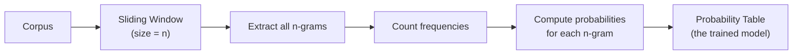
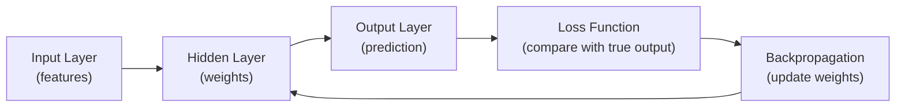
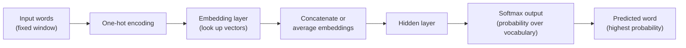
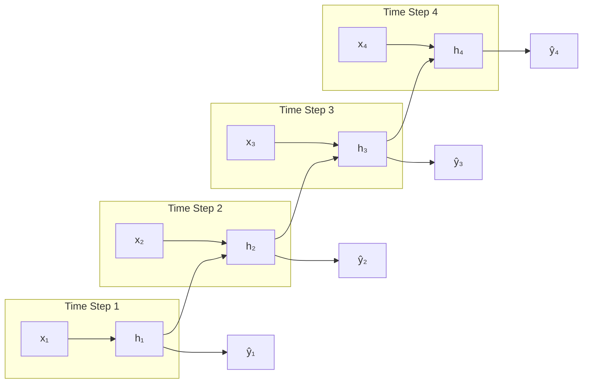
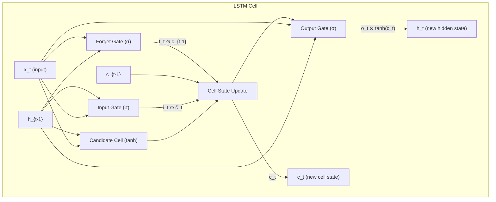
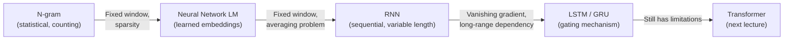

# Lecture 5: Data Collection, Language Models, and the Road to Large Language Models

> **Course note**: Starting from this lecture, we will begin developing our knowledge of how the idea of large language models came about. We start with the early techniques and then step by step see how the idea improved to arrive at modern large language models.

## Overview

This lecture covers:
1. **Data collection** for NLP (not part of the course, but important background knowledge)
2. **Language modeling**, from statistical techniques (n-grams) through neural networks, RNNs, and LSTMs
3. The **advantages and limitations** of each technique, and how each limitation motivated the next technique

---

## Data Collection for NLP

Referring back to the NLP development lifecycle, this section covers the data collection step. There are many sources of data for NLP, and the main source is social media. Social media platforms generate a huge amount of data, and each platform has a **developer portal** that allows people to access this data programmatically.

### Social Media (X / Twitter)

X (formerly Twitter) is one of the most important sources of data for NLP. People collected tweets, and based on these tweets, many applications were built. One example is **sentiment analysis during elections**, where tweets are analyzed to find how people feel about specific candidates.

**Practical experience with the Twitter API**:
- A free account was available with a limit of approximately **11,500 tweets per day**
- A long-term access application was required, stating the purpose of collection
- Currently, X no longer offers a free account. Access requires going through the developer portal, filling out an application, stating the research purpose, providing your organization, and answering many questions

**Real-world application example**: In a previous company, the lecturer worked on finding ethical concerns related to a research paper published by a group in the Royal Academy. The research was related to mental health. The researcher and his group collected about **three million tweets over three years**, and the objective was to predict people who are at risk for suicide. Three million tweets are even difficult to upload on personal devices. This demonstrates how NLP applications depend on a huge amount of data to extract useful insights.

### Web Scraping

The second main source of data is web scraping. The slides list three Python libraries widely used for parsing HTML: *(from slides)*

| Library | Description |
|---------|-------------|
| **BeautifulSoup** | A popular library for parsing HTML and XML documents. Simplifies extracting data from web pages and has an active community with detailed documentation |
| **lxml** | Known for its speed, lxml is one of the fastest parsing libraries available. It receives regular updates |
| **html5lib** | A pure-Python library designed to conform to the WHATWG (Web Hypertext Application Technology Working Group) HTML specification, ensuring compatibility with major web browsers |

BeautifulSoup contains a parser that can parse HTML and extract specific data from it.

**Example: Scraping algonquincollege.com** *(reconstructed from lecture)*

```python
from bs4 import BeautifulSoup
import requests

url = "https://www.algonquincollege.com"
response = requests.get(url)
soup = BeautifulSoup(response.text, "html.parser")

# Find all headers (h1, h2, h3)
headers = soup.find_all(["h1", "h2", "h3"])
print(f"Number of headers: {len(headers)}")  # 20

# Extract all paragraphs
paragraphs = soup.find_all("p")
for p in paragraphs:
    print(p.get_text())
```
*(reconstructed example)*

The process: extract HTML → parse with BeautifulSoup → convert to a data structure → perform tokenization → save for use in your application.

### PDF Files

Another important source is PDF files (papers, books). Python has libraries that can read any PDF file and convert it to a usable data structure.

```python
import PyPDF2

with open("document.pdf", "rb") as f:
    reader = PyPDF2.PdfReader(f)
    for page in reader.pages:
        text = page.extract_text()
        print(text)
```
*(added, reconstructed example)*

### Summary of Data Sources

| Source | Examples | Access Method |
|--------|----------|---------------|
| **Social media** | X (Twitter), Reddit, Facebook | Developer API / portal |
| **Web scraping** | Any website | BeautifulSoup, lxml, html5lib |
| **PDF files** | Research papers, books | Python PDF libraries |

---

## Probability Theory Review

Before discussing language models, a brief review of probability theory.

### Basic Probability

The probability of picking a specific element from a collection is:

$$P(\text{element}) = \frac{\text{count of element}}{\text{total number of elements}}$$

**Example**: If a bag contains shapes and you want the probability of picking a blue square:

$$P(\text{blue square}) = \frac{\text{number of blue squares}}{\text{total number of shapes}}$$

### Joint Probability

The probability of a sequence of independent events is the product of individual probabilities:

$$P(A, B, C) = P(A) \times P(B) \times P(C)$$

### Conditional Probability

The probability of event X given that event Y has occurred:

$$P(X | Y) = \frac{P(X, Y)}{P(Y)}$$

### Chain Rule

The chain rule expresses joint probability as a product of conditional probabilities. For a sequence of events $X_1$ to $X_n$:

$$P(X_1, X_2, \dots, X_n) = P(X_1) \times P(X_2 | X_1) \times P(X_3 | X_1, X_2) \times \dots \times P(X_n | X_1, \dots, X_{n-1})$$

Or more compactly:

$$P(X_1, \dots, X_n) = \prod_{i=1}^{n} P(X_i | X_1, \dots, X_{i-1})$$

*(added)*

---

## Language Models

### What is a Language Model?

A **language model** predicts the next word in a sequence given the previous words. Consider the statement: "The students opened their..." What do you expect? Books, bags, exams, minds, laptops. You are doing what a language model does: predicting which word comes next.

### Mathematical Formulation

Given a sequence of words $w_1, w_2, \dots, w_t$, a language model computes:

$$P(w_{t+1} | w_1, w_2, \dots, w_t)$$

- The model is a **probability model**: it computes a probability distribution over all words in the vocabulary
- The word with the **highest probability** is the predicted word
- The predicted word $w_{t+1}$ must come from the model's vocabulary (the model must have seen the word during training)

### Everyday Examples

Language models are used in daily life:
- **WhatsApp / text messaging**: text completion suggests the next word
- **Google search**: autocomplete suggestions as you type
- **Email**: automatic suggestions while writing

> The goal of a language model is to learn from the patterns in a huge amount of text how to predict the next word, given the previous words in the context.

---

## N-gram Language Model (Statistical Approach)

The first language model was built on **statistical techniques**, specifically frequency-based counting.

### How N-grams Work

1. Define a value for **n** (the window size)
2. Use a **sliding window** to go through all text and divide it into n-grams
3. For each n-gram, use the previous **n-1 tokens** to predict the next word
4. Prediction is based on **counting** how many times word patterns appear together

### N-gram Probability Formula

The probability is computed as a ratio of counts:

$$P(w_n | w_1, \dots, w_{n-1}) = \frac{C(w_1, w_2, \dots, w_n)}{C(w_1, w_2, \dots, w_{n-1})}$$

Where $C(\cdot)$ denotes the count of a sequence in the corpus.

### Applying the Chain Rule

Using the chain rule, the probability of an entire sequence is:

$$P(w_1, \dots, w_T) = \prod_{t=1}^{T} P(w_t | w_{t-n+1}, \dots, w_{t-1})$$

The **Markov assumption** states that word $w_t$ depends only on the previous $n-1$ words, not the entire history.

### Worked Example

**Sentence**: "As the problem starts, the students opened their \_\_\_"

Using a **4-gram model** (n=4), we only look at the last 3 words: "students opened their"

| Sequence | Count in Corpus | Probability |
|----------|:-:|:-:|
| "students opened their" | 1,000 | (denominator) |
| "students opened their **books**" | 400 | $\frac{400}{1000} = 0.4$ |
| "students opened their **exams**" | 100 | $\frac{100}{1000} = 0.1$ |

**Winner**: "books" with probability 0.4

### N-gram Training Process


*(added)*

> The order of words in an n-gram is very important. The sliding window goes from left to right, preserving the sequential order.

### Code Example: Building a Trigram Model

```python
import nltk
from nltk import ngrams
from collections import Counter, defaultdict

# Sample corpus (the lecturer used Shakespeare)
text = "to be or not to be that is the question"
tokens = text.split()

# Compute trigrams
trigrams = list(ngrams(tokens, 3))
trigram_counts = Counter(trigrams)

# Compute bigram counts (n-1 grams)
bigrams = list(ngrams(tokens, 2))
bigram_counts = Counter(bigrams)

# Compute trigram probabilities
for trigram, count in trigram_counts.items():
    bigram = trigram[:2]
    prob = count / bigram_counts[bigram]
    print(f"P({trigram[2]} | {trigram[0]} {trigram[1]}) = {prob:.4f}")
```
*(reconstructed example)*

### Text Generation with N-grams

Given a **seed** (starting words), the model generates text by:
1. Computing the probability distribution over all possible next words
2. Selecting the word with the highest probability
3. Adding that word to the sequence
4. Repeating the process

The generated text may **not be coherent**, because the model only considers a small window of context.

### Limitations of N-gram Models

| Limitation | Explanation |
|------------|-------------|
| **Choosing n** | Larger n captures more context but increases computation dramatically |
| **Sparsity** | If a sequence never appeared in the corpus, its probability is zero. Many n-grams will have zero probability, creating a sparse probability distribution |
| **Computation complexity** | N-gram models are computationally heavy, even on small datasets |
| **Context limitation** | The fixed window discards earlier words that may be important for prediction |

**Backoff technique** to address sparsity: if a 4-gram is not found, fall back to the trigram. If the trigram is not found, fall back to the bigram. This partially addresses the sparsity problem but does not solve it completely.

---

## Neural Network Language Model

### Motivation

The earlier text representation and language models were based on statistical techniques (frequency, bag of words, TF-IDF). The natural transition was to use **neural networks**, which were first introduced around 1940. Instead of counting, we let the model **learn** what word should come next.

### Neural Network Overview


*(added)*

Key components:
- **Input layer**: the features (attributes) of your data
- **Hidden layer**: contains trainable weights
- **Output layer**: the prediction
- **Loss function**: measures the difference between predicted and true output
- **Bias**: a value added to the total weighted sum before the activation function
- **Activation function**: introduces non-linearity
- **Backpropagation**: updates weights to minimize the loss

### Fixed Window Requirement

Even with a neural network, we **still need a fixed window**. Why? In machine learning, each sample must have a fixed number of attributes (features). The input size must be the same for every sample. Therefore, we discard earlier words beyond the window, just like with n-grams.

### How the Neural Network Language Model Works


*(added)*

1. Feed the input words from the fixed window
2. Represent each word as a **one-hot encoding**
3. Look up each word's **embedding vector** from the embedding layer
4. **Concatenate or average** all embedding vectors to form a single context vector
5. Pass through the hidden layer
6. Apply **softmax** to produce a probability distribution over the entire vocabulary
7. The word with the highest probability is the predicted next word

During **training**: a sliding window goes through the text, feeding data at each step and updating parameters to minimize the loss.

During **testing**: the model uses its learned parameters to predict the next word.

### Limitations of Neural Network Language Models

| Limitation | Explanation |
|------------|-------------|
| **Fixed window** | Still requires a fixed input size, discarding earlier context |
| **Averaging problem** | Averaging all word embeddings loses word order |
| **Variable length** | Cannot handle sentences of different lengths |
| **Independence assumption** | Treats words as independent, which is not how language works |

**The averaging problem illustrated**:

| Sentence | Meaning |
|----------|---------|
| "The food was good, not bad at all." | Positive |
| "The food was bad, not good at all." | Negative |

If you average all the token embeddings in both sentences, the resulting vectors are **identical** because they contain the same words. But the meaning is completely different. Averaging does not capture word order or semantics.

### Requirements for a Better Model

Based on the limitations above, a better language model needs to:

1. **Handle variable length input** (not a fixed window)
2. **Treat input as a sequence** where order matters (not independent tokens)
3. **Share weights across time steps** to build cumulative knowledge about the sentence

---

## Deep Neural Networks

### Universal Approximation Theorem

A neural network satisfies the **Universal Approximation Theorem (UAT)**: it can approximate any continuous function. This was proven by **George Cybenko in 1989**. *(from slides)* In classification, this means a neural network can find even very complex decision boundaries. Deep neural networks can do that even more efficiently.

### History

- **~1940**: Neural networks first introduced
- **1980 to early 2000s**: Neural networks fell out of favor. Other techniques like **random forest** and **support vector machines** offered better performance with less complexity and training time
- **1989**: George Cybenko proves the Universal Approximation Theorem *(from slides)*
- **2006**: **Geoffrey Hinton** (University of Toronto) introduced the concept of deep neural networks, reviving the field

### Why Deep Neural Networks?

The key advantage of deep neural networks over standard neural networks and traditional ML is their ability to **utilize big data**:

- Standard machine learning models hit a **performance ceiling** as data increases. Beyond a certain point, adding more data does not improve the model
- Deep neural networks **continue to benefit** from larger datasets. They can handle and utilize massive amounts of data
- This made deep neural networks ideal for the **era of big data**

> **Tip**: Try this in your machine learning course: train a model with increasing amounts of data. At some point, performance will plateau. This is the limitation of traditional ML that deep learning overcomes.

### Types of Deep Neural Networks

| Type | Abbreviation | Primary Use Case |
|------|:---:|----------------|
| **Convolutional Neural Network** | CNN | Computer vision (image data) |
| **Recurrent Neural Network** | RNN | Sequential data (time series, text) |

Time series data (e.g., stock prices) has a key characteristic: **each data point depends on the previous one**. Sentences in natural language share this same characteristic: each word depends on the previous words. This is why RNNs became the natural choice for building language models.

---

## Recurrent Neural Network (RNN) Language Model

### Why RNN for Language?

RNNs are designed for **sequential data** and overcome the key problems of standard neural networks:
- They handle **variable length** input
- They process input as a **sequence** (order matters)
- They **share weights** across time steps (building cumulative knowledge)

### How RNN Works

An RNN is a **stateful computation**. At each time step $t$, the computation combines:
- The **current input** $x_t$
- The **previous hidden state** $h_{t-1}$

$$h_t = f(W_x \cdot x_t + W_h \cdot h_{t-1} + b)$$

Where:
- $W_x$ = weight matrix for input
- $W_h$ = weight matrix for previous hidden state
- $b$ = bias term
- $f$ = activation function

*(added)*

This means information from all previous steps is propagated forward through the hidden state.


*(added)*

### RNN vs. Standard Neural Network

| Aspect | Standard Neural Network | Recurrent Neural Network |
|--------|------------------------|--------------------------|
| **Input** | All words fed at once | Words fed one at a time, sequentially |
| **Hidden layers** | One hidden layer for all input | A hidden state at **each time step** |
| **Information flow** | No propagation between inputs | Hidden state carries information from step 1 to step T |
| **Window** | Fixed window required | Variable length input |
| **Weight sharing** | No sharing across inputs | Weights are shared across time steps |

### Training an RNN

1. Feed tokens **one by one** from left to right
2. At each step: one-hot encode the token → look up the embedding → compute the hidden state → compute the loss
3. The **total loss** is the sum of all individual losses at each step:

$$L_{\text{total}} = \sum_{t=1}^{T} L_t$$

4. **Backpropagation** updates the weights to minimize the total loss

The training is **self-supervised**: when we feed a word, we already know the next word (the target). At each step, the loss is the **negative log probability** of the correct next word. *(from slides)* The loss is computed by comparing the model's prediction to this known target, and the model learns from it.

During **testing**: we feed text and use the learned weights to compute probability distributions and predict the next word.

### RNN Text Generation Example

> There is an interesting website where researchers trained an RNN on a huge number of Shakespeare speeches. When given a prompt, the model generated text in the style of Shakespeare. The result was not very accurate. It generated text, but it was not coherent. The model sometimes predicts unrealistic words, which is what we call **hallucination**. When the model cannot find the correct data, it produces hallucination.

> **Resource**: Another fun example of RNN text generation: [Obama RNN: Machine-Generated Political Speeches](https://medium.com/@samim/obama-rnn-machine-generated-political-speeches-c8abd18a2ea0) *(from slides)*

### Forward and Backward Propagation in RNN

**Forward propagation**: as we read words, the hidden state is updated at each step.

**Backpropagation Through Time (BPTT)**: after the forward pass, we compute the total loss, and then the backpropagation goes **from the last step back to the first step** to update the weights. It is called "through time" because the computation is time dependent. For each time step, the gradient at that step depends on the gradient at the next step.

**Gradient**: the derivative of the loss function with respect to the weights (the model's parameters). The gradient represents the rate of change of the loss function with respect to the parameters.

**Weight update rule**:

$$w_{\text{new}} = w_{\text{old}} - \eta \cdot \nabla L$$

Where $\eta$ is the learning rate and $\nabla L$ is the gradient. *(added)*

---

## The Vanishing Gradient Problem

### How It Occurs

Consider an RNN with four time steps. At the end, we compute the loss and propagate it backward through all steps. Using the **chain rule**, the gradient at step 1 is:

$$\frac{\partial L}{\partial h_1} = \frac{\partial h_2}{\partial h_1} \cdot \frac{\partial h_3}{\partial h_2} \cdot \frac{\partial h_4}{\partial h_3} \cdot \frac{\partial L}{\partial h_4}$$

*(added)*

If these individual derivative values are **small** (less than 1), the gradient becomes **smaller and smaller** as we multiply them together. This is the **vanishing gradient problem**.

### Consequences

- When the gradient becomes very small, the model **stops learning** at those steps
- There is effectively **no dependency** between the first step and the last step according to the gradient
- **Tokens near the end** of the sequence learn more than tokens at the beginning, because the gradient diminishes as it flows backward
- The model **cannot utilize distant context** to predict the next word in long sentences

### Illustrative Example

> "When she tried to print her **ticket**, she found that the printer was out of toner. She went to a stationery store to buy more toner. It was very overpriced. After returning the toner to the printer, she finally printed her \_\_\_"

The expected word is **"ticket."** If the model could remember "ticket" from early in the passage, it could predict correctly. But due to vanishing gradient, the model loses information from the distant past. The dependency between "ticket" at the beginning and the target at the end **cannot be captured** by the model.

> This is a fundamental problem of RNN: the model cannot remember information from early steps or be corrected by later steps. This motivated the development of a new architecture: **LSTM**.

---

## Long Short-Term Memory (LSTM)

### Motivation

LSTM was invented in **1997** by **Hochreiter and Schmidhuber** to overcome the vanishing gradient problem in RNNs. *(from slides)* The key insight is that the model needs a mechanism to **selectively remember and forget** information across long sequences.

At each timestep $t$, the LSTM maintains two key components: *(from slides)*
- **Hidden state** ($h_t$): captures **short-term** dependencies
- **Cell state** ($c_t$): acts as a memory unit, storing **long-term** information

### Applications of Sequential Models

Both RNN and LSTM work with sequential data where order matters:
- **Stock market data**: prices depend on previous prices
- **Sun spots**: the number of sun spots changes year by year, and forecasting this is important because it affects weather and environment
- **Natural language**: each word depends on previous words

### LSTM Architecture Overview

Unlike standard RNNs, LSTMs control the flow of information through three specialized **gates**: *(from slides)*

| Component | Purpose |
|-----------|---------|
| **Forget gate** ($f_t$) | Decides what information to **erase** from the previous cell state |
| **Input gate** ($i_t$) | Determines what **new information** should be stored in the cell state |
| **Output gate** ($o_t$) | Regulates what information is **passed to the next timestep** |
| **Cell state** ($c_t$) | Long-term memory that flows through the network, updated at each step |

Each gate is represented as a **vector of size n** and can take values between 0 (closed) and 1 (open) dynamically, based on the current context. *(from slides)*

> **Gate concept**: A gate is like a switch, on or off. "On" means data passes through. "Off" means data is blocked. In practice, the sigmoid function produces values between 0 and 1, creating a continuous gate that controls how much data flows through.

### LSTM vs. Standard RNN

| Aspect | Standard RNN | LSTM |
|--------|-------------|------|
| **Components per step** | Input $x_t$, hidden state $h_{t-1}$ | Input $x_t$, hidden state $h_{t-1}$, **cell state** $c_{t-1}$ |
| **Output per step** | Output $y_t$, hidden state $h_t$ | Output $y_t$, hidden state $h_t$, **updated cell state** $c_t$ |
| **Long-range memory** | Degrades over time (vanishing gradient) | Preserved through the cell state |
| **Selective memory** | No control over what to remember | Gates control remembering and forgetting |

### Step-by-step LSTM Computation

At time step $t$, the inputs are: current input $x_t$, previous hidden state $h_{t-1}$, and previous cell state $c_{t-1}$.

#### Step 1: Forget Gate

$$f_t = \sigma(W_f \cdot [h_{t-1}, x_t] + b_f)$$

- Uses a **sigmoid function** ($\sigma$), which outputs values between 0 and 1
- Values **near 1**: this information is important, **keep it**
- Values **near 0**: this information is not important, **forget it**
- The forget gate output is multiplied **element-wise** by the previous cell state $c_{t-1}$, filtering out unimportant information

#### Step 2: Input Gate

$$i_t = \sigma(W_i \cdot [h_{t-1}, x_t] + b_i)$$

- Decides what **new data** needs to be added to the cell state
- Also uses a sigmoid function

#### Step 3: Candidate Cell State

$$\tilde{c}_t = \tanh(W_c \cdot [h_{t-1}, x_t] + b_c)$$

- The **tanh function** outputs values from -1 to 1
- Creates a **candidate new state** based on the current input and previous hidden state

#### Step 4: Update Cell State

$$c_t = f_t \odot c_{t-1} + i_t \odot \tilde{c}_t$$

Where $\odot$ denotes element-wise multiplication. *(added)*

This has two parts:
1. **First part** ($f_t \odot c_{t-1}$): the forget gate filters the previous cell state, keeping important information and discarding unimportant information
2. **Second part** ($i_t \odot \tilde{c}_t$): the input gate controls addition of new information from the candidate state

#### Step 5: Output Gate and New Hidden State

$$o_t = \sigma(W_o \cdot [h_{t-1}, x_t] + b_o)$$

$$h_t = o_t \odot \tanh(c_t)$$

The output gate decides which information from the new cell state to include in the new hidden state.

### LSTM Cell Diagram


*(added)*

### Summary of LSTM Gates

| Gate | Activation | Purpose | Formula |
|------|:---:|---------|---------|
| **Forget** | Sigmoid | How much old info to delete | $f_t = \sigma(W_f \cdot [h_{t-1}, x_t] + b_f)$ |
| **Input** | Sigmoid | How much new info to add | $i_t = \sigma(W_i \cdot [h_{t-1}, x_t] + b_i)$ |
| **Candidate** | Tanh | What new info to propose | $\tilde{c}_t = \tanh(W_c \cdot [h_{t-1}, x_t] + b_c)$ |
| **Output** | Sigmoid | What to output from cell | $o_t = \sigma(W_o \cdot [h_{t-1}, x_t] + b_o)$ |

---

## LSTM in Practice

The slides show the following minimal Keras example for building a 1-layer LSTM model with 10 hidden nodes: *(from slides)*

```python
from keras.models import Sequential
from keras.layers import Dense, Activation, LSTM

model = Sequential()
model.add(LSTM(10, input_shape=(TIMESTEPS, FEATURE_LENGTH)))
model.add(Dense(NUMBER_OF_OUTPUT_NODES))
model.add(Activation('softmax'))
```
*(from slides)*

A more complete example with multiple layers: *(reconstructed example)*

```python
from tensorflow.keras.models import Sequential
from tensorflow.keras.layers import LSTM, Dense, Embedding

model = Sequential()
model.add(Embedding(input_dim=vocab_size, output_dim=embedding_dim))
model.add(LSTM(units=128, return_sequences=True))
model.add(LSTM(units=64))
model.add(Dense(vocab_size, activation='softmax'))

model.compile(loss='categorical_crossentropy', optimizer='adam')
```
*(reconstructed example)*

> Keras is a Python package that makes building and training TensorFlow neural networks simple. It uses the "Sequential" model which lets you add layers one at a time. *(from slides)*

You can also use the **GRU (Gated Recurrent Unit)** layer as a variant of LSTM:

```python
from tensorflow.keras.layers import GRU

model = Sequential()
model.add(Embedding(input_dim=vocab_size, output_dim=embedding_dim))
model.add(GRU(units=128))
model.add(Dense(vocab_size, activation='softmax'))
```
*(reconstructed example)*

> **Course note**: The lecturer mentioned he will publish code examples on the practice space showing how to create a language model using LSTM, including how to use GloVe embeddings as the embedding layer. Using pre-trained embeddings like GloVe carries more semantic meaning, and the generated text felt more coherent compared to training embeddings from scratch.

### LSTM Text Generation Example

The lecturer demonstrated creating a small corpus, tokenizing it, and training an LSTM model with a softmax function. LSTM can also be used for **classification** tasks. Given the seed "deep," the model was asked to generate 10 words. The output was "deep learning..." which was not coherent, likely because the corpus was very small.

> **Course note**: The lecturer recommends going to the recommended LSTM resources and reading more about LSTM. At minimum, students should understand the difference between RNN and LSTM, and what improvement LSTM brings to address RNN's limitations.

> **Resource**: [Understanding LSTMs by Christopher Olah](https://colah.github.io/posts/2015-08-Understanding-LSTMs/) is highly recommended in the slides for a detailed visual explanation of LSTM internals. *(from slides)*

> **Course note**: The lecturer emphasized the importance of reviewing lectures regularly and taking notes during class. Weekly quizzes are designed to keep students up to date. Do not rely on ChatGPT for quiz answers, as the quizzes are meant to encourage reviewing the material.

---

## Evaluating Language Models: Perplexity

The slides introduce **perplexity** as the standard evaluation metric for language models. *(from slides)*

**Perplexity (PPL)** measures how confused a language model is when predicting the next word in a sentence.

$$\text{PPL}(W) = P(w_1, w_2, \dots, w_N)^{-1/N}$$

*(added)*

Key properties:
- It is the **inverse probability** of the corpus, according to the language model, **normalized by the number of words**
- **Low perplexity** → the model predicts the text well (the text is expected by the model)
- **High perplexity** → the text is unexpected for the model (the model is "confused")

---

## Gated Recurrent Unit (GRU)

The lecturer described **GRU (Gated Recurrent Unit)** as a more advanced version of LSTM. GRU simplifies the gating mechanism by combining the forget and input gates into a single **update gate** and merging the cell state and hidden state. *(added)* There are still limitations with both LSTM and GRU as language models.

LSTM can also be applied to **sequence-to-sequence modeling** tasks. *(from slides)*

> **Course note**: The limitations of LSTM will be covered in the next lecture, which will then introduce the **transformer architecture**. The transformer tries to overcome all the problems related to using deep neural networks as language models.

---

## Evolution of Language Models


*(added)*

> Modern large language models do not use RNN or LSTM directly. But the idea of the transformer is based on these earlier models. They took RNN and LSTM and built another architecture on top of them. No one started from scratch. It always started by understanding what happened before and then building on top of that. The idea of large language models comes from this evolutionary process.
