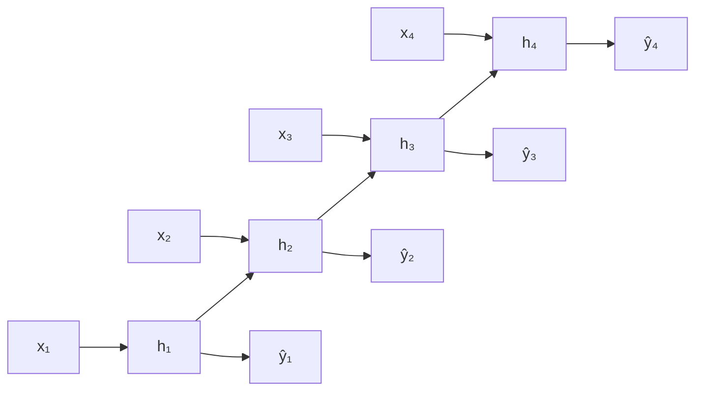
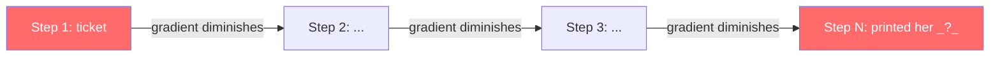
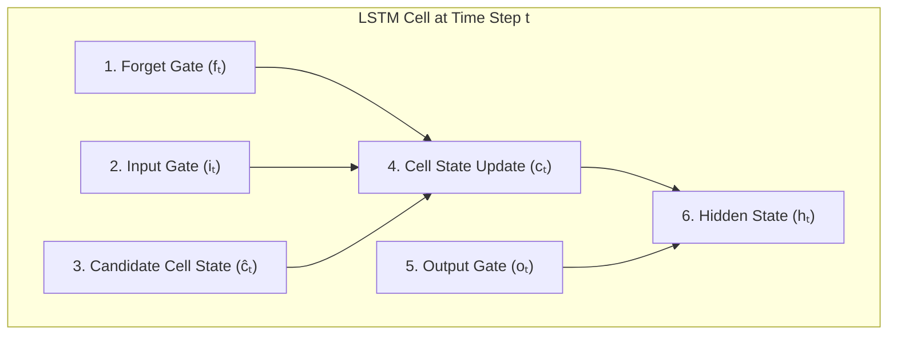
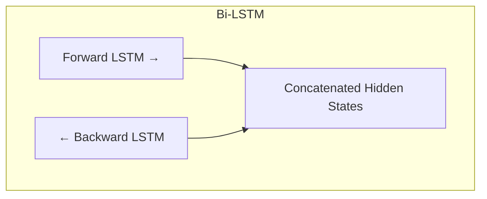
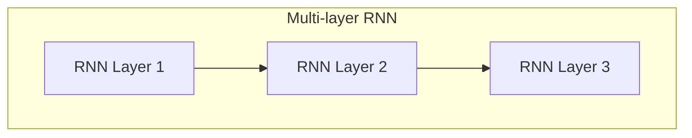
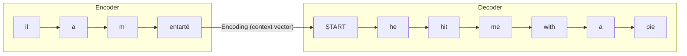
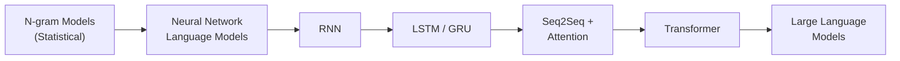

# Lecture 6: Recurrent Neural Networks, Vanishing Gradient, and LSTM

## Deep Neural Networks and Big Data

Standard machine learning models have a limitation on the amount of data they can utilize. After a certain point, increasing the data does not improve performance. This is the nature of standard machine learning models: they are not able to deal with big data.

Deep neural networks, on the other hand, can handle and benefit from huge amounts of data. They came in the era of big data and can continue to improve as you provide more data.

> **Key insight**: In your machine learning course, try taking a specific amount of data and then increasing it. At some point, your standard model will stop improving. Deep neural networks do not have this limitation.

### Types of Deep Neural Networks

| Type | Full Name | Primary Use |
|------|-----------|-------------|
| **CNN** | Convolutional Neural Network | Computer vision |
| **RNN** | Recurrent Neural Network | Time series, sequential data |

Time series data has a specific characteristic: each instance depends on the previous one. Sentences in natural language have the same characteristic. Each word depends on the context of words before it. That is why they decided to use recurrent neural networks to build language models, because RNNs are designed for dealing with sequences of data and they overcome the problems related to standard neural networks (namely the fixed window limitation).

---

## Recurrent Neural Networks (RNN)

### Stateful Computation

Recurrent neural networks are called a **stateful computation** because each time we compute a new step, it is a combination of:
1. The input at the current time step $t$ ($x_t$)
2. The previous hidden state ($h_{t-1}$)

At each time step, we predict the output based on the current input and the previous hidden state, so information propagates from previous steps.

The hidden state at time $t$ is computed as:

$$h_t = f(W_x \cdot x_t + W_h \cdot h_{t-1} + b)$$

Where:
- $W_x$ is the weight matrix for the input
- $W_h$ is the weight matrix for the previous hidden state
- $b$ is the bias term
- $f$ is an activation function (typically tanh)

*(reconstructed formula)*


*(added)*

### RNN vs. Standard Neural Network

| Aspect | Standard Neural Network | RNN |
|--------|------------------------|-----|
| **Input** | All words fed at once | Words fed one by one, step by step |
| **Hidden layer** | One shared hidden layer | Each step has its own hidden state |
| **Information flow** | No information shared between inputs | Hidden state propagates from step 1 to step T |
| **Dependency** | Inputs treated independently | Input at each step depends on the hidden state of the previous step |

### Training an RNN

The training process is **self-supervised learning**:

1. Feed tokens one by one from left to right.
2. At each step, apply one-hot encoding and the embedding layer.
3. Compute the hidden state for each word.
4. Compute the loss at each step (the model already knows the next word from the training data).
5. At the end of the sequence, the **total loss** is the sum of all individual losses at each step.
6. Backpropagation updates the weights to minimize the total loss.

$$L_{total} = \sum_{t=1}^{T} L_t$$

*(reconstructed formula)*

### Testing (Inference) with an RNN

During testing, we feed the text into the model. Based on the learned weights, the model computes a probability distribution over the vocabulary and determines which word should come next. The word with the highest probability is the predicted word.

> **Real-world example**: There is a website where someone trained an RNN on a huge number of speeches by Obama. You give it a prompt, and then the model generates text. The result was not very accurate, but it is interesting to see. Sometimes, like what we call **hallucination** in LLMs, when the model cannot find the correct word, it just puts anything.

---

## Backpropagation Through Time (BPTT)

The backpropagation in an RNN is called **Backpropagation Through Time (BPTT)** because it is time dependent. For each time step, the gradient at that step depends on the gradient at the next step.

### Gradient and Weight Updates

**Gradient**: the derivative of the loss function with respect to the weights. The meaning of the derivative is the **rate of change** of the loss function with respect to the parameters (the weights).

The weight update rule is:

$$W_{new} = W_{old} - \alpha \cdot \nabla L$$

Where:
- $W_{new}$ is the updated weight
- $W_{old}$ is the current weight
- $\alpha$ is the **learning rate** (set before training begins)
- $\nabla L$ is the gradient of the loss function

### Chain Rule in BPTT

Consider an RNN with four steps (a sequence of four tokens). At the end, we compute the loss and propagate it back through all previous steps.

To compute the rate of change of the loss function with respect to the hidden state at step 1 ($h_1$), we apply the **chain rule**:

$$\frac{\partial L}{\partial h_1} = \frac{\partial h_2}{\partial h_1} \cdot \frac{\partial L}{\partial h_2}$$

Expanding further:

$$\frac{\partial L}{\partial h_1} = \frac{\partial h_2}{\partial h_1} \cdot \frac{\partial h_3}{\partial h_2} \cdot \frac{\partial L}{\partial h_3}$$

And again:

$$\frac{\partial L}{\partial h_1} = \frac{\partial h_2}{\partial h_1} \cdot \frac{\partial h_3}{\partial h_2} \cdot \frac{\partial h_4}{\partial h_3} \cdot \frac{\partial L}{\partial h_4}$$

*(reconstructed formulas)*

This is how we compute the rate of change of the loss function at step 1.

---

## The Vanishing Gradient Problem

If the derivative values in the chain rule ($\frac{\partial h_{t+1}}{\partial h_t}$) are small (less than 1), the gradient becomes smaller and smaller as it propagates back through the sequence. This is called the **vanishing gradient problem**.

### Why It Happens

Vanishing gradients occur when the values of a gradient are too small and the model stops learning or takes way too long as a result. Every time we compute the gradient at a step, it is a **product** of all the derivatives from the subsequent steps. When you multiply many small numbers together, the result approaches zero. *(from slides)*

### Consequences

1. The gradient becomes very small, so the model **stops learning** (no weight updates occur).
2. The tokens near the **end** of the sequence learn more than the tokens at the **beginning**, because the gradient diminishes as it propagates back.
3. The model cannot capture **long-range dependencies** between distant tokens.

> **Key takeaway**: This is one of the fundamental drawbacks of using RNN as a language model. We cannot utilize far away information to predict the next word.

### Vanishing Gradient Example

Consider this passage: *"When she tried to print her ticket, she found that the printer was out of toner. She went to the stationery store to buy more toner. It was very overpriced. After returning the toner to the printer, she finally printed her..."*

The expected next word is **ticket**. If the model can remember "ticket" from early in the passage, it can predict the correct word. But due to the vanishing gradient problem, the RNN loses information from far back in the sequence. The dependency between "ticket" at an earlier step and the target word at the end **cannot be captured** by the model. *(from slides)*


*(added)*

> This motivated the development of a new architecture that overcomes the vanishing gradient problem: **LSTM (Long Short Term Memory)**.

---

## Long Short Term Memory (LSTM)

### Motivation

LSTM was invented in **1997** by Hochreiter and Schmidhuber to solve the problem of getting an RNN to remember things for a long time. It works with sequential data and time series data where the order is important. Stock market data is one example. *(from slides)*

> **Real-world application**: The lecturer worked on a research project involving sun spots. Sun spots follow a time series pattern. Every year the number of sun spots changes, and forecasting this number year by year is very important for predicting weather and environmental effects.

### LSTM vs. RNN: Key Difference

At each timestep $t$, the LSTM maintains two key components: *(from slides)*
- **Hidden state** ($h_t$): captures **short-term** dependencies.
- **Cell state** ($c_t$): acts as a memory unit, storing **long-term** information.

LSTM introduces three **gates** and the cell state (also called the memory state). Some sources describe four gates.

| Component | RNN | LSTM |
|-----------|-----|------|
| **Input** | $x_t$, $h_{t-1}$ | $x_t$, $h_{t-1}$, $c_{t-1}$ |
| **Output** | $h_t$, $\hat{y}_t$ | $h_t$, $c_t$, $\hat{y}_t$ |
| **Memory mechanism** | Hidden state only | Hidden state + cell state |
| **Gates** | None | Forget, Input, Output |

### What Is a Gate?

A **gate** means on or off:
- **On**: we allow the data to pass through.
- **Off**: we do not allow the data to pass through.

Each gate is represented as a vector of size $n$ and can take values between 0 (closed) and 1 (open) dynamically, based on the current context. Gates use the **sigmoid function** ($\sigma$) to control how much information passes through. *(from slides)*

### LSTM Architecture: Step by Step

At each time step $t$, the inputs are:
1. The current input $x_t$
2. The previous hidden state $h_{t-1}$
3. The previous cell state $c_{t-1}$ (memory state)


*(added)*

#### Step 1: Forget Gate

The forget gate determines **how much data to forget** from the previous cell state and **how much to keep**. *(from slides: "decide what parts of old state to forget")*

$$f_t = \sigma(W_f \cdot [h_{t-1}, x_t] + b_f)$$

- Uses a **sigmoid function**, outputting values between 0 and 1.
- A value **near 1** means this information is **important** (keep it).
- A value **near 0** means this information is **not important** (forget it).

The forget gate output is then **multiplied element-wise** by the previous cell state $c_{t-1}$:

$$f_t \odot c_{t-1}$$

If you have two vectors and you multiply them element-wise, you **filter** the information. Values near 1 keep the corresponding information, and values near 0 discard it. This is why it is called a gate.

*(reconstructed formulas)*

#### Step 2: Input Gate

The input gate decides **what new data needs to be added** to the cell state, based on the previous hidden state and the current input. *(from slides: "decide how to update the cell state")*

$$i_t = \sigma(W_i \cdot [h_{t-1}, x_t] + b_i)$$

*(reconstructed formula)*

#### Step 3: Candidate Cell State

The candidate cell state creates a **proposed new state** based on the current input and the previous hidden state.

$$\hat{c}_t = \tanh(W_c \cdot [h_{t-1}, x_t] + b_c)$$

- Uses **tanh**, which outputs values from **-1 to 1**.
- This candidate represents what the new information could look like.
- The input gate then decides how much of this candidate to actually add.

*(reconstructed formula)*

#### Step 4: Cell State Update

The new cell state combines two parts:

$$c_t = f_t \odot c_{t-1} + i_t \odot \hat{c}_t$$

| Part | Purpose |
|------|---------|
| $f_t \odot c_{t-1}$ | Use the **forget gate** to decide which information from the previous state to keep or discard |
| $i_t \odot \hat{c}_t$ | Use the **input gate** and **candidate state** to add new information |

*(reconstructed formula)*

This process is repeated at every time step.

#### Step 5: Output Gate

The output gate decides **which information to pass as the new hidden state** to the next step. *(from slides: "decide what to output as hidden state")*

$$o_t = \sigma(W_o \cdot [h_{t-1}, x_t] + b_o)$$

*(reconstructed formula)*

#### Step 6: Hidden State Update

The new hidden state is computed using the output gate and the updated cell state:

$$h_t = o_t \odot \tanh(c_t)$$

*(reconstructed formula)*

### LSTM Summary Table

| Component | Function Used | Purpose |
|-----------|:------------:|---------|
| **Forget gate** ($f_t$) | Sigmoid | Decides what to forget from the previous cell state |
| **Input gate** ($i_t$) | Sigmoid | Decides what new information to add |
| **Candidate cell state** ($\hat{c}_t$) | Tanh | Creates proposed new content |
| **Cell state update** ($c_t$) | Combination | Updates the memory with old and new content |
| **Output gate** ($o_t$) | Sigmoid | Decides what information to output |
| **Hidden state** ($h_t$) | Tanh | Produces the output for the next step |

> **Course note**: The lecturer recommends [Understanding LSTMs by Christopher Olah](https://colah.github.io/posts/2015-08-Understanding-LSTMs/) as an excellent resource for understanding LSTM. *(from slides)*

> **Course note**: LSTM is not a perfect solution. The next lecture will cover the shortcomings and limitations of LSTM in creating a language model.

---

## Types of Sequence Problems in NLP

RNNs and LSTMs can be applied to different types of sequence problems depending on the input-output structure: *(from slides)*

| Type | Input | Output | Example |
|------|-------|--------|---------|
| **One-to-one** | Single | Single | Image classification |
| **One-to-many** | Single | Sequence | Image captioning |
| **Many-to-one** | Sequence | Single | Sentiment analysis |
| **Many-to-one** | Sequence | Single | Stock market prediction |
| **Many-to-many** | Sequence | Sequence | Machine translation |

*(from slides)*

---

## Bidirectional LSTM (Bi-LSTM)

### Motivation

A standard RNN or LSTM only processes the input from left to right (forward direction). This means the hidden state at any time step only contains information about the **past context** (words before it). But some tasks require understanding from **both directions**.

Consider the sentence: *"The movie was terribly exciting!"* *(from slides)*

The word "terribly" could indicate negative sentiment on its own, but in this context it modifies "exciting" to create a positive meaning. A forward-only model processing "terribly" has not yet seen "exciting," so it may misinterpret the sentiment. A bidirectional model captures both the left context ("the movie was") and the right context ("exciting!") for each word.

### Architecture

Bi-LSTM uses **two separate RNN/LSTM layers** that process the input in opposite directions: *(from slides)*

1. **Forward RNN**: processes the sequence from left to right ($\overrightarrow{h_t}$)
2. **Backward RNN**: processes the sequence from right to left ($\overleftarrow{h_t}$)

The two hidden states are **concatenated** at each time step to form the final hidden state:

$$h_t = [\overrightarrow{h_t} ; \overleftarrow{h_t}]$$

*(reconstructed formula)*

> The forward and backward RNNs have **separate weights**. The concatenated hidden state is what gets passed to the next parts of the network. *(from slides)*


*(added)*

### Bi-LSTM for Classification in Keras

```python
from tensorflow.keras.models import Sequential
from tensorflow.keras.layers import Embedding, Bidirectional, LSTM, Dense

model = Sequential([
    Embedding(input_dim=vocab_size,
              output_dim=embedding_dim,
              input_length=max_len),
    Bidirectional(LSTM(n_lstm)),
    Dense(1, activation='sigmoid')
])
```
*(from slides)*

---

## Multi-layer RNN/LSTM

RNN and LSTM layers can be **stacked** on top of each other to create deeper models. In a multi-layer architecture, the hidden states from RNN layer $i$ become the **inputs** to RNN layer $i+1$. *(from slides)*


*(added)*

This allows the model to learn increasingly abstract representations at each layer.

---

## Sequence-to-Sequence (Seq2Seq) Models

### What Is Seq2Seq?

**Seq2Seq** is a type of model used to transform one sequence into another sequence. It is commonly used in tasks where the input and output are sequences of **varying lengths**. *(from slides)*

### The Encoder-Decoder Framework

The solution to the Seq2Seq task is the **Encoder-Decoder** model: *(from slides)*

1. **Encoder RNN**: reads the entire input sequence and compresses it into a single fixed-length vector (the final hidden state), called the **encoding** or **context vector**.
2. **Decoder RNN**: takes the encoding as its initial hidden state and generates the output sequence one token at a time.


*(added, based on slides)*

### Seq2Seq as a Conditional Language Model

The sequence-to-sequence model is an example of a **Conditional Language Model**: *(from slides)*
- **Language Model**: the task is predicting the next word of the target sentence $y$.
- **Conditional**: predictions are also conditioned on the source sentence $x$.

Machine translation directly calculates:

$$P(y_1, ..., y_T | x_1, ..., x_S)$$

This is the probability of the next target word, given the target words generated so far and the source sentence $x$. *(from slides)*

### Training Seq2Seq

During training, the system is optimized as a single end-to-end system. The total loss is the sum of the negative log probabilities at each decoder step: *(from slides)*

$$J = \frac{1}{T} \sum_{t=1}^{T} J_t$$

*(reconstructed formula)*

Backpropagation operates end-to-end through both the encoder and decoder.

### Testing (Inference) Seq2Seq

During testing: *(from slides)*
1. The encoder processes the source sentence and produces an encoding (initial hidden state for the decoder).
2. The decoder generates words one at a time using **argmax** to select the most probable word at each step.
3. Each generated word is fed back as input to the next decoder step.

### The Bottleneck Problem

The encoder must compress the **entire** source sentence into a single fixed-length vector. This creates an **information bottleneck**: the encoding needs to capture all information about the source sentence, which becomes increasingly difficult for longer sequences. *(from slides)*

---

## Attention Mechanism

### Motivation

The attention mechanism was introduced as a **solution to the bottleneck problem**. Instead of relying on a single fixed-length encoding, attention allows the decoder to look directly at all encoder hidden states at each step. *(from slides)*

### What Is Attention?

**Attention** is a weighted average over a set of inputs. *(from slides)*

The process works as follows:
1. **Compute pairwise similarity**: calculate a similarity score between each encoder hidden state and the current decoder hidden state (using dot product).
2. **Convert to probability distribution**: apply **softmax** to the similarity scores to get attention weights (an attention distribution).
3. **Compute weighted average**: use the attention weights to compute a weighted sum of the encoder hidden states. This produces the **attention output**.
4. **Concatenate**: combine the attention output with the decoder hidden state to make the final prediction.

### Benefits of Attention

*(from slides)*

- **Improved handling** of variable-length input sequences.
- **Enhanced modeling** of long-range dependencies.
- **Better performance** in tasks where certain parts of the input sequence are more relevant to specific parts of the output sequence.

> **Core idea**: On each step of the decoder, use a direct connection to the encoder to focus on a **particular part** of the source sequence. *(from slides)*

### Step-by-Step Attention Example (Machine Translation)

The following example shows how attention works for translating "il a m' entarté" to "he hit me with a pie": *(from slides)*

| Decoder Step | Decoder Input | Attention Focus | Output |
|:---:|---|---|---|
| 1 | START | Mostly on "il" (="he") | he |
| 2 | he | Focuses on "entarté" (="hit") | hit |
| 3 | hit | Focuses on "m'" (="me") | me |
| 4 | me | Distributes across source | with |
| 5 | with | Distributes across source | a |
| 6 | a | Focuses on "entarté" (="pie") | pie |

*(reconstructed from slides)*

At each step:
1. Compute **dot product** between current decoder hidden state and all encoder hidden states to get **attention scores**.
2. Apply **softmax** to get the **attention distribution** (probability distribution over encoder states).
3. Use the attention distribution to compute a **weighted sum** of encoder hidden states, producing the **attention output**.
4. **Concatenate** the attention output with the decoder hidden state to compute the final prediction $\hat{y}$.

---

## Beyond LSTM: GRU and the Path to Transformers

### Gated Recurrent Unit (GRU)

**GRU (Gated Recurrent Unit)**: a more advanced version of LSTM. It simplifies the LSTM architecture by combining the forget and input gates into a single **update gate** and merging the cell state and hidden state. *(added)*

| Aspect | LSTM | GRU |
|--------|------|-----|
| **Gates** | 3 (forget, input, output) | 2 (reset, update) |
| **States** | Hidden state + cell state | Hidden state only |
| **Parameters** | More | Fewer |
| **Training speed** | Slower | Faster |

*(added)*

### Limitations of RNN and LSTM

Despite LSTM's improvements over RNN, there are still limitations. These limitations led researchers to develop a new architecture step by step, ultimately arriving at the **transformer**.

> **Key insight**: The transformer architecture, as a language model, tries to overcome all the problems related to using deep neural networks as a language model.

### Introduction to the Transformer (2017)

The **Transformer** is a novel architecture that aims to solve sequence-to-sequence tasks while handling long-range dependencies with ease. It was proposed in the paper *"Attention Is All You Need"* (2017). *(from slides)*

Key characteristics:
- Relies **entirely on self-attention** to compute representations of its input and output.
- Does not use recurrence (no RNN/LSTM components).
- Handles long-range dependencies more effectively than RNN-based models.

> **Course note**: The next lecture will cover the transformer architecture in detail and how it addresses the limitations of RNN and LSTM.

---

## Evaluating Language Models: Perplexity

The standard evaluation metric for Language Models is **perplexity (PPL)**. *(from slides)*

**Perplexity** measures how confused a language model is when predicting the next word in a sentence:
- **Low perplexity**: the model predicts the text well (less confused).
- **High perplexity**: the text is unexpected for the model (more confused).

Perplexity is defined as the inverse probability of the corpus, normalized by the number of words. *(from slides)*

---

## Practical Implementation with Keras

### Building an LSTM Language Model

In Keras, building an LSTM model is straightforward. The model is sequential, and you can add LSTM or GRU layers as needed.

```python
from tensorflow.keras.models import Sequential
from tensorflow.keras.layers import LSTM, GRU, Dense, Embedding

model = Sequential()
model.add(Embedding(input_dim=vocab_size, output_dim=embedding_dim, input_length=max_length))
model.add(LSTM(units=128, return_sequences=True))
model.add(GRU(units=64))
model.add(Dense(units=vocab_size, activation='softmax'))

model.compile(loss='categorical_crossentropy', optimizer='adam', metrics=['accuracy'])
model.summary()
```
*(reconstructed example)*

A simpler example from the slides, building a 1-layer LSTM model with 10 hidden nodes: *(from slides)*

```python
from keras.models import Sequential
from keras.layers import Dense, Activation, LSTM

model = Sequential()
model.add(LSTM(10, input_shape=(TIMESTEPS, FEATURE_LENGTH)))
model.add(Dense(NUMBER_OF_OUTPUT_NODES))
model.add(Activation('softmax'))
```
*(from slides)*

> **Important**: The code is straightforward to use, but you have to **understand how it works internally**. Just calling the functions is not sufficient.

### Example: Text Generation with LSTM

The lecturer demonstrated creating a language model using LSTM. LSTM can also be used for classification.

1. Created a small corpus and tokenized it.
2. Built a sequential model with an LSTM layer and a softmax activation function.
3. Fed the model the seed word "deep" and asked it to generate 10 words after the seed.
4. The result was not very coherent, likely because the corpus was very small.

> **Key observation**: The number of **epochs** plays an important role in improving text generation quality.

### Using Pre-trained Embeddings (GloVe)

The lecturer also demonstrated using **GloVe embeddings** as the embedding layer before the LSTM model:
- The pre-trained embedding model carries more **semantic meaning** compared to training embeddings from scratch.
- The generated text using GloVe embeddings felt a **little more coherent** than the one without pre-trained embeddings.

> **Course note**: These examples will be published on the practice space so students can experiment with using LSTM with GloVe and see how to extract embeddings.

---

## How the Idea Evolved

Modern large language models do **not** use RNN or LSTM. However, the idea of the **transformer** is built on top of the concepts from RNN and LSTM. No one started from scratch. The evolution followed this path:


*(added)*

Each step started by understanding the limitations of the previous approach and then building improvements on top of it.
