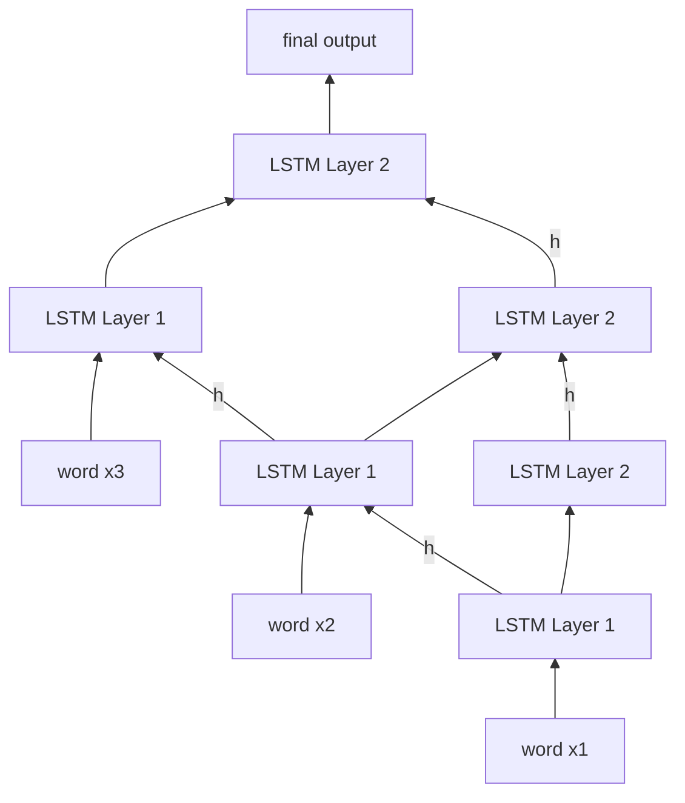
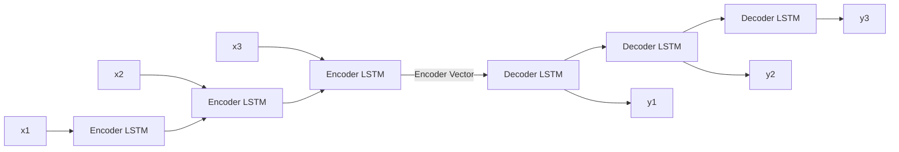

# Lecture 6: Bi-LSTM, Sequence-to-Sequence, and the Road to Transformers

> Week 6 of CST8507 Natural Language Processing. Developed by Hala Own, Ph.D., Algonquin College.

---

## Recap from Previous Lectures

### N-gram Language Model

The n-gram language model is a statistically-based language model that computes the probability of which word will come next in a sequence.

**N-gram**: a contiguous sequence of n words from a text.

The procedure:

1. Divide the text into a sequence of n-grams (you must choose n).
2. For each n-gram, use the (n minus 1) gram to predict the next word.
3. Compute probabilities by counting occurrences in the corpus.

**Bigram probability**:

$$P(w_2 \mid w_1) = \frac{\text{count}(w_1, w_2)}{\text{count}(w_1)}$$

**Trigram probability**:

$$P(w_3 \mid w_1, w_2) = \frac{\text{count}(w_1, w_2, w_3)}{\text{count}(w_1, w_2)}$$

**General form** (all-words normalization reduces to a simple count ratio):

$$P(w_2 \mid w_1) = \frac{C(w_1, w_2)}{\sum_w C(w_1, w)} = \frac{C(w_1, w_2)}{C(w_1)}$$

**Chain rule for whole sequences**:

$$P(w_1, w_2, w_3) = P(w_1) \cdot P(w_2 \mid w_1) \cdot P(w_3 \mid w_2)$$

#### Worked Bigram Example

Given the small corpus:

- *I have a dog whose name is Lucy.*
- *I have two cats.*
- *they like playing with Lucy.*

Apply the conditional probability rule:

$$P(A \mid B) = \frac{P(A, B)}{P(B)}$$

Compute:

$$P(\text{have} \mid \text{I}) = \frac{\text{count}(\text{I have})}{\text{count}(\text{I})} = \frac{2}{2} = 1$$

$$P(\text{two} \mid \text{have}) = \frac{\text{count}(\text{have two})}{\text{count}(\text{have})} = \frac{1}{2} = 0.5$$

$$P(\text{eating} \mid \text{have}) = \frac{\text{count}(\text{have eating})}{\text{count}(\text{have})} = \frac{0}{2} = 0$$

The last case shows the **sparsity problem**: word combinations absent from the corpus receive zero probability.

#### Why Larger N-grams Are Costly

- Large n-grams capture dependencies between distant words.
- They need **a lot of space and RAM**.

---

### RNN as a Language Model

**Definition**: An RNN is designed to handle sequential data by maintaining a **hidden state** that captures information from previous time steps.

**Example**: *"I called her but she did not ___"*

The RNN processes each word sequentially:

$$\text{I} \rightarrow \text{called} \rightarrow \text{her} \rightarrow \text{but} \rightarrow \text{she} \rightarrow \text{did} \rightarrow \text{not} \rightarrow \text{?}$$

It maintains a hidden state that is passed forward through each step. The **weights $W_h$ (for the hidden connection) and $W_x$ (for the input) are shared across all time steps**.

**How RNN processes a sentence**:

1. Scan the sequence from left to right.
2. Feed the network with all words, one by one.
3. At each timestamp, compute the hidden state and output.
4. Pass it forward along with the next word.
5. At the end, the answer depends on all previous information.

This improves performance over n-gram models because the hidden state carries accumulated context.

#### The Specific Limitation of RNN

> **Key takeaway**: The main limitation of RNN is **vanishing gradients**.

This motivated the LSTM architecture.

---

### LSTM (Long Short-Term Memory)

**Definition**: LSTM networks are a type of RNN that can learn **long-term dependencies**. They use gates (input, forget, and output) to **control the flow of information**, making them effective for tasks requiring memory over long sequences.

The three gates:

| Gate | Purpose |
|------|---------|
| **Forget gate** | Filters the state, deciding which information to keep |
| **Input gate** | Updates the state with new information |
| **Output gate** | Generates the output |

#### Architecture Components

- **Previous cell state → new cell state** (top line carrying long-term memory).
- **Previous hidden state → new hidden state** (bottom line carrying short-term memory).
- **Input data** $x_t$ at the current timestep.
- **Gates** use sigmoid ($\sigma$) and tanh activations.
- **Pointwise multiplication** ($\times$) and addition ($+$) operations connect the gates and states inside the cell.

#### RNN vs LSTM Cell

| Aspect | RNN | LSTM |
|--------|-----|------|
| Cell structure | Simple cell with a single `tanh` operation | Complex cell with multiple gates ($\sigma$, $\sigma$, `tanh`, $\sigma$) and pointwise operations |
| State paths | One hidden state | Separate cell state path plus hidden state |
| Cell inputs | Previous hidden state, current input | Previous hidden state, previous cell state, current input |
| Cell outputs | New hidden state | New hidden state and new cell state |

**Key advantage of LSTM**: the extra **previous cell state** holds memory from the previous step. At each step we can decide:

- Which information to **add** and propagate to the next state.
- Which information to **forget** and delete from the current state.

The `tanh` activation outputs values in $[-1, 1]$, which is used to add information to the cell state. *(added: tanh is chosen because its bounded, zero-centered output keeps gradients well-scaled.)*

> **Trade-off**: LSTM is more powerful but comes with higher computational cost. The choice between RNN and LSTM depends on the task.

---

## Types of Sequence Models in NLP

Classification by input/output shape (Karpathy's taxonomy):

| Type | NLP / ML Example |
|------|------------------|
| **One to one** | Image classification |
| **One to many** | Image captioning |
| **Many to one** | Sentiment analysis |
| **Many to many** | Stock market prediction |
| **Many to many** | Translation |

### One-to-One

Input a single element, process it, get one output.

**Example**: Image classification. Enter an image, get one classification label.

### One-to-Many

One input produces a sequence of outputs.

**Example**: Image captioning. Feed an image, generate descriptive text. This is common in machine vision, where an RNN or CNN is fed an image and automatically generates a description.

### Many-to-One

A sequence produces a single output value.

**Examples**:

- **Sentiment analysis**: feed a sentence, output is positive, negative, or neutral.
- **Text classification**: a sequence gives one classification label.

### Many-to-Many

A sequence produces a sequence.

**Examples**:

- **Time series forecasting** (advanced ML): stock market or time series data. Forecasting for a year, a month, or any time span depending on your data.
- **Translation**: input is a sentence in one language, output is the translation in another.
- **Summarization**: input is a long sequence, output is a shorter summary.

The best NLP examples are **translation** and **summarization**.

---

## Many-to-One in NLP

Previously we used RNN as a language model (one word predicts the next). For many-to-one tasks, we use RNN or LSTM differently: we take a sentence and predict a single answer:

- A classification for sentiment analysis.
- A classification for document classification.
- A classification for language detection.

### The Problem with Plain RNN/LSTM for Many-to-One

Consider: **"The movie was terribly exciting!"**

In plain RNN processing, we scan left to right. While processing a word, we have **no information** about future words.

Processing order:

1. `the`
2. `movie`
3. `was`
4. `terribly`
5. `exciting`

When we reach `exciting`, there is no access to any future word. But many-to-one NLP problems require understanding the whole sentence.

**Why this fails**:

- At `The movie was terribly`, the sentiment looks negative.
- After processing `exciting`, the full context reveals positive sentiment.
- A plain forward RNN may classify the sentence as neutral, because `exciting` is balanced against `terribly`.

#### Sentence Encoding via Pooling

One approach for many-to-one classification: produce a hidden state vector at every timestep, then apply **element-wise mean or max pooling** across these hidden states to form a single sentence representation. The pooled vector is then classified.

```
Input tokens:  the  movie  was  terribly  exciting  !
Hidden states: h_0  h_1    h_2  h_3       h_4       h_5

sentence_vector = mean(h_0, h_1, h_2, h_3, h_4, h_5)
# or element-wise max pool
classification = softmax(W · sentence_vector + b)
# e.g., "positive"
```

> **Key insight**: Sentiment analysis and text classification require understanding the full sentence, not just a left-to-right reading.

---

## Bidirectional LSTM (Bi-LSTM)

Researchers improved LSTM to give it access to both past and future information. This architecture is **Bi-LSTM**.

### Architecture

With bidirection, we make two passes:

1. **Forward RNN/LSTM** processes tokens **left to right**.
2. **Backward RNN/LSTM** processes tokens **right to left**.

The two passes use **separate neural networks, separate weights, and separate hidden states**. The **concatenated hidden states** at each time step combine both forward and backward representations.

> This contextual representation of `terribly` has both left and right context.

### Forward and Backward Formulas

On timestep $t$:

**Forward RNN**:

$$\vec{h}^{(t)} = \text{RNN}_{FW}(\vec{h}^{(t-1)}, x^{(t)})$$

**Backward RNN**:

$$\overleftarrow{h}^{(t)} = \text{RNN}_{BW}(\overleftarrow{h}^{(t+1)}, x^{(t)})$$

**Concatenated hidden state**:

$$h^{(t)} = [\vec{h}^{(t)} ; \overleftarrow{h}^{(t)}]$$

> **Important notes**:
>
> - This is a general notation for "compute one forward step of the RNN". It could be a vanilla RNN, LSTM, or GRU computation.
> - Generally, the two RNNs have **separate weights**.
> - We regard $h^{(t)}$ as "the hidden state" of a bidirectional RNN. This is what we pass to the next parts of the network.

### Output Formula

The output at time $t$:

$$\hat{y}^{<t>} = g(W_y \, [\vec{h}^{<t>} ; \overleftarrow{h}^{<t>}] + b_y)$$

where $g$ is an activation, $W_y$ is a weight matrix, and $b_y$ is the bias.

> **Core idea**: Information flows from the past and from the future independently, and the final representation at each position combines both.

### Feeding the Sentence

In English, feed the first word, then the second, and so on. In Arabic (right to left), feed the first word of the sentence first, but proceed in the opposite direction relative to English. What matters is scanning both directions and concatenating.

### Sequential Nature: A Key Limitation

> **Important**: The architecture is fundamentally **sequential**. You cannot feed the model the whole sentence at once. There is **no parallelism**. You cannot process $x_1$ until you process $x_0$. You must wait for all hidden output from $x_0$.

This limitation motivates the Transformer later.

### How Bi-LSTM Reduces Vanishing Gradients

LSTM improved over RNN with the cell state, but it still suffers from vanishing gradients, because they are in the nature of any neural network training.

With Bi-LSTM, the model learns from both directions. On the backward path, the effective learning rate may be small, but learning also comes from the other direction, compensating for it. The final hidden state combines both directions, reducing the vanishing problem.

### Computational Cost

A student asked: **"Isn't it going to take more computational power and make the model slow?"**

**Answer**: As you make the structure more complex, computation cost increases. It depends on the task. If accuracy is critical, computational power is not the primary concern.

### Choosing Between Architectures: Trial and Error

> **Practical advice from the lecturer**: In real research projects, choosing an architecture is ultimately trial and error. Know when to use each architecture, its significance, and its main characteristics. The final choice comes from experimentation.

Workflow:

1. Run your data with one architecture.
2. If performance is low, try another.
3. Tune hyperparameters.
4. When you find the best fit, go back and write your justification.

> **Course note**: Details vary per architecture and data. Experiment with hyperparameters, change architectures. When you get the best result, go back and explain why.

---

## Code Example: Bi-LSTM for Classification (Template)

The core Bi-LSTM classification template:

```python
from tensorflow.keras.models import Sequential
from tensorflow.keras.layers import Embedding, Bidirectional, LSTM, Dense

model = Sequential([
    Embedding(input_dim=vocab_size,
              output_dim=embedding_dim,
              input_length=max_len),
    Bidirectional(LSTM(n_lstm)),
    Dense(1, activation='sigmoid')
])
```

This template is the backbone for the full examples below.

---

## Full Example: Bi-LSTM on a Small Sentiment Dataset

### Step 1: Tokenization and Cleaning

Tokenization, along with cleaning the data, is the full pre-processing step.

```python
# (reconstructed example)
from tensorflow.keras.preprocessing.text import Tokenizer
from tensorflow.keras.preprocessing.sequence import pad_sequences

texts = ["I love this movie", "I hate this movie", "This movie is okay", ...]
labels = [1, 0, 1, ...]

tokenizer = Tokenizer()
tokenizer.fit_on_texts(texts)
sequences = tokenizer.texts_to_sequences(texts)
```

### Step 2: Compute Maximum Sentence Length

Required for LSTM/RNN. Either compute from data or set as a fixed hyperparameter.

- Longer sentences: truncate.
- Shorter sentences: **pad**.

### Step 3: Choose Padding Technique

- **Post padding** (`padding='post'`): fill with zeros at the end.
- **Pre padding** (`padding='pre'`): fill with zeros at the beginning.

```python
# (reconstructed example)
maxlen = 7
padded = pad_sequences(sequences, maxlen=maxlen, padding='post')
```

> **Important**: Compute the max length from your data or set it as a hyperparameter (20, 30, or whatever fits).

### Step 4: Verify Your Data

> **Strong recommendation from the lecturer**: Verify each step. Do not apply the method without verification. Think about what you expect from this step, then verify you are on the right track.

This is especially important for the embedding layer. When you create an embedding using GloVe, word2vec, or similar, **test it**. Extract the vector for a word and run a similarity check against a very similar word to confirm they are distinguishable.

### Step 5: Identify Key Parameters

For this example:

- Maximum length: **7**
- Vocabulary size: **18**
- Embedding dimensionality: **16**

The embedding layer dimension depends on the vocabulary size and chosen output dimension.

> **Note on vocabulary size**: This is a hyperparameter. Do not make it dynamic, or the model will not have a fixed view of the vocabulary.

**GloVe dimension options**: 50, 100, 300. You decide.

In this small example, we do **not** use any pre-trained embedding. The embedding layer is **trainable**, and the model updates it during training.

### Step 6: Build the Model

```python
# (reconstructed example)
from tensorflow.keras.models import Sequential
from tensorflow.keras.layers import Embedding, Bidirectional, LSTM, Dense

vocab_size = 18
embedding_dim = 16
maxlen = 7

model = Sequential([
    Embedding(input_dim=vocab_size, output_dim=embedding_dim, input_length=maxlen),
    Bidirectional(LSTM(64)),
    Dense(1, activation='sigmoid')
])
model.compile(optimizer='adam', loss='binary_crossentropy', metrics=['accuracy'])
model.summary()
```

**Summary breakdown**:

- `7` is the max sentence length.
- `16` is the embedding dimension.
- `64` is the number of Bi-LSTM units.
- The dense layer has one unit for binary classification.

### Step 7: Test the Model

Apply the same preprocessing to test data: tokenize and pad.

### Step 8: Verify Embedding Training

```python
# (reconstructed example)
embedding_layer = model.layers[0]
weights = embedding_layer.get_weights()[0]
print(weights.shape)  # (18, 16)

word_index = tokenizer.word_index
print("love:",  weights[word_index['love']])
print("movie:", weights[word_index['movie']])
print("life:",  weights[word_index['life']])
```

**Expected embedding matrix**: $18 \times 16$, matching vocabulary and dimension.

> **Checkpointing**: Add these kinds of checkpoints to verify everything works as expected.

---

## Full Example: Bi-LSTM on a Larger Sentiment Dataset

### Data Exploration (First Step in ML)

> **Key takeaway**: Always explore your data first. Check for missing data and missing labels. Most importantly, check whether the data is **biased** with respect to the label. A balanced dataset is essential.

```python
# (reconstructed example)
import pandas as pd
df = pd.read_csv('sentiment_data.csv')
print(df.isna().sum())
print(df['label'].value_counts())
```

### Hyperparameters

- **Vocabulary size**: 5,000 (decided, since the actual vocabulary size is unknown).
- **Embedding dimension**: 40.
- **Padding**: pre-padding was applied (zeros precede actual values).

### Model

```python
# (reconstructed example)
model = Sequential([
    Embedding(input_dim=5000, output_dim=40, input_length=maxlen),
    Bidirectional(LSTM(64)),
    Dense(1, activation='sigmoid')
])
model.compile(optimizer='adam', loss='binary_crossentropy', metrics=['accuracy'])
```

### Evaluation

```python
# (reconstructed example)
from sklearn.metrics import confusion_matrix
y_pred = (model.predict(X_test) > 0.5).astype(int)
print(confusion_matrix(y_test, y_pred))
```

> **Summary**: Model is simple but must be built sequentially. Same approach works for any classification or sentiment analysis task.

---

## When to Use Bi-LSTM vs Unidirectional LSTM/RNN

### When Bi-LSTM Fails

> **Critical limitation**: Bi-LSTM requires access to the whole sentence during **testing** (inference), not only training.

Bi-LSTM does **not** work for:

1. **Real-time applications** (live streams): the full sentence is not yet known.
2. **Language modeling**: predicting the next word. During training you have full access, but during testing you do not.
3. **Autocompletion** (for example, phone keyboards): Bi-LSTM cannot model autocompletion.

For these cases, use a **single LSTM or RNN** (forward only).

### Computational Cost of Bi-LSTM

- Two passes instead of one.
- Two hidden states instead of one.
- Concatenation or averaging adds cost.
- Model is more complex, so training and testing both take longer.

### Choosing the Number of Hidden Units

> **Hyperparameter tip**: Too many units causes overfitting. Too few hurts performance. Trial and error.

---

## Multi-Layer (Stacked) LSTM

A single forward pass is insufficient for complex sentences. Stacking layers captures richer structure. This is also called **stacked LSTM**.

### How Stacking Works

- **RNN layer 1** (bottom): takes input embeddings (for example: *the movie was terribly exciting !*).
- **RNN layer 2** (middle): takes **hidden states from layer 1** as input.
- **RNN layer 3** (top): takes **hidden states from layer 2** as input.

> **Key rule**: The hidden states from RNN layer $i$ are the inputs to RNN layer $i+1$.


```mermaid
graph BT
    x1[word x1] --> L1c1[LSTM Layer 1]
    x2[word x2] --> L1c2[LSTM Layer 1]
    x3[word x3] --> L1c3[LSTM Layer 1]
    L1c1 -->|h| L1c2
    L1c2 -->|h| L1c3
    L1c1 --> L2c1[LSTM Layer 2]
    L1c2 --> L2c2[LSTM Layer 2]
    L1c3 --> L2c3[LSTM Layer 2]
    L2c1 -->|h| L2c2
    L2c2 -->|h| L2c3
    L2c3 --> out[final output]
```

### Hidden State Notation

For a two-layer stack processing inputs $x_0, x_1, \dots$:

- **Layer 0**: produces hidden states $h_{00}, h_{01}, \dots$ with initial and final states $h_{0i}$, $h_{0f}$.
- **Layer 1**: takes outputs from layer 0, produces $h_{10}, h_{11}, \dots$ with initial and final states $h_{1i}$, $h_{1f}$.

At the first layer, each cell's input is:

- The current word at the current timestamp.
- The previous hidden state.
- The previous cell state (for LSTM).

### Why Stacking Helps

The multi-layer structure captures richer patterns, improving many-to-one classification and sentiment analysis.

### Trade-offs

- **More parameters**: a huge number of them.
- **More training time**: follows from more parameters.
- **Overfitting risk** with too many layers.
- **Underfitting risk** with too few layers.

> **Choosing the number of layers** is a hyperparameter. It depends on:
>
> - The nature of the task.
> - The criticality of the output.
> - The trade-off between computation cost and accuracy.

> **Core problem**: More computation, and the **sequential nature** remains. $x_2$ cannot be processed until $x_1$ is done. **No parallelism**. High computation cost.

---

## Many-to-Many: Sequence-to-Sequence (Seq2Seq)

### Definition

- **Seq2Seq** is a model used to transform one **sequence into another sequence**.
- Commonly used for tasks where input and output are sequences of **varying lengths**.

### Examples

- **Translation**: a sentence in one language, output is its translation in another.
- **Summarization**: an input text, output is its summary.

### Variable-Length Challenge

Key observation:

- In translation, the number of words in the source does **not** equal the number in the target.
- In summarization, input and output lengths differ.

Seq2Seq handles variable-length input natively. The core architecture is the **encoder-decoder**.

> **Course note**: Sequence-to-sequence is part of the Transformer. The Transformer is built on this concept.

---

## Encoder-Decoder Architecture

### High-Level View

$$\text{INPUT} \rightarrow \text{ENCODER} \rightarrow \text{STATE} \rightarrow \text{DECODER} \rightarrow \text{OUTPUT}$$

### Detailed View

- **Encoder**: an LSTM chain processes input $x_1, x_2, x_3$ producing hidden states $h_1, h_2, h_3$ and a final **Encoder Vector**.
- **Decoder**: an LSTM chain initialized from the Encoder Vector generates output tokens $y_1, y_2, \dots$ one at a time.


```mermaid
graph LR
    X1[x1] --> E1[Encoder LSTM]
    X2[x2] --> E2[Encoder LSTM]
    X3[x3] --> E3[Encoder LSTM]
    E1 --> E2
    E2 --> E3
    E3 -->|Encoder Vector| D1[Decoder LSTM]
    D1 --> D2[Decoder LSTM]
    D2 --> D3[Decoder LSTM]
    D1 --> Y1[y1]
    D2 --> Y2[y2]
    D3 --> Y3[y3]
```

### Inside the Encoder

- Use **LSTM or RNN** depending on the task.
- The key output is a **single fixed-length vector**.
- All input information is encoded into this vector.
- This vector is passed as input to the decoder.

### Inside the Decoder

- Takes the fixed-length vector as initialization.
- At each timestamp, uses the previous hidden state plus the current word to predict the next word.
- Operates like a language model.

---

## Machine Translation as a Conditional Language Model

The sequence-to-sequence model is a **Conditional Language Model**:

- **Language Model**: task is predicting the next word of the target sentence $y$.
- **Conditional**: predictions are conditioned on the source sentence $x$.

MT directly calculates:

$$P(y \mid x) = P(y_1 \mid x) \cdot P(y_2 \mid y_1, x) \cdot P(y_3 \mid y_1, y_2, x) \cdots P(y_T \mid y_1, \dots, y_{T-1}, x)$$

The final term is the probability of the next target word, given target words so far and the source sentence $x$. Here $x$ is the **fixed encoder output**.

---

## Training vs Testing Seq2Seq

### Training (with French → English Example)

During training, we keep **pairs of sentences**.

**Example pair**:

- **Source (French)**: *il a m' entarté*
- **Target (English)**: `<START>` he hit me with a pie `<END>`

**Training procedure**:

1. The **Encoder RNN** processes the source sentence.
2. The **Decoder RNN** produces the target sentence one token at a time, starting from `<START>`.
3. At each step $t$, $\hat{y}^{(t)}$ is the predicted distribution over the target vocabulary.
4. The loss $J^t$ at step $t$ is the **negative log probability** of the correct target word.

**Per-step loss contributions for the example**:

- $J_1$ = negative log prob of `he`
- $J_2$ = negative log prob of `hit`
- $J_3$ = negative log prob of `me`
- $J_4$ = negative log prob of `with`
- $J_5$ = negative log prob of `a`
- $J_6$ = negative log prob of `pie`
- $J_7$ = negative log prob of `<END>`

**Total loss** (average over T steps):

$$J = \frac{1}{T} \sum_{t=1}^{T} J^t = J_1 + J_2 + J_3 + J_4 + J_5 + J_6 + J_7$$

> **Key idea**: Seq2Seq is optimized as a **single system**. Backpropagation operates **end-to-end** across encoder and decoder. This is how the model finds the alignment between source and target languages.

### Testing

At test time, there is no access to the target. Only the source.

1. The **Encoder RNN** produces an encoding of the source (*il a m' entarté*).
2. This encoding provides the **initial hidden state** for the Decoder RNN.
3. The Decoder RNN is a language model generating the target sentence, conditioned on the encoding.
4. At each step, `argmax` selects the next token from the predicted distribution.
5. The chosen output token is fed in as the **next step's input**.

Output: *he hit me with a pie* `<END>`

---

## The Bottleneck Problem

### What Is the Bottleneck?

> The encoding of the source sentence must capture **all information** about the source. This is the **information bottleneck**.

**Problems with this architecture**:

- The **fixed-size encoding** must compress the entire source sequence.
- **Long sequences lose information** in this compression.
- The **decoder has no direct access to source tokens**, only to the final encoder state.

### The Book Analogy

> **Analogy from the lecturer**: It is like reading a book, being asked to summarize it in one paragraph, then being asked to recreate the book from that paragraph. How can we compress all this information into such a small representation?

### Example of Failure

A fixed-size vector can cause translation failures on longer inputs:

- **Source**: *Maria no baba verde .*
- **Garbled output**: *Mary did not ... witch .* `<END>`

The bottleneck drops important content, so the decoder produces a degraded output.

### Second Problem: Sequential Nature

RNN and LSTM are sequential. No parallelization. The decoder must wait for the encoder to finish. Big throughput issue.

---

## Attention Mechanism

The bottleneck problem and the sequential nature of RNN/LSTM led researchers to a new solution: **attention**.

### The Intuition Behind Attention

> **Real-world analogy from the lecturer**: You are away from college for one or two weeks. When you return, you find out tomorrow has a midterm (20%), a quiz (1%), and an assignment (5%). What do you do? You focus on the one with the most weight. You set your priorities. The task with the highest weight is the highest priority. **This is the idea of attention.**

### What Problem Attention Solves

In vanilla seq2seq, **each word is treated as equally important**. In reality, some words carry more meaning.

**Example from class**:

- `"that"` is not very important.
- `"I"` is not very important.
- `"love"` is important.

We need a mechanism to assign different weights to each input based on importance. This is attention.

### Formal Definition

> **Definition**: **Attention** is a **weighted average over a set of inputs**.

**How to compute the weighted average**:

1. **Compute** pairwise similarity between **each encoder hidden state** and the **decoder hidden state**.
2. **Convert** pairwise similarity scores into a **probability distribution** (via softmax).
3. **Compute the weighted average** of encoder hidden states using that distribution.

### Core Idea

> **Core idea**: On **each step** of the decoder, use a **direct connection** to the encoder to focus on a particular part of the source sequence.

### Benefits

- Improved handling of **variable-length input sequences**.
- Enhanced modeling of **long-range dependencies**.
- Better performance when specific parts of the input align to specific parts of the output.

---

## Attention: Step-by-Step Walkthrough (il a m' entarté → he hit me with a pie)

### Step 1: Compute Attention Scores at First Decoder Step

At the first decoder step (`<START>`), compute attention scores as the **dot product** between decoder hidden state $s_1$ and each encoder hidden state $h_i$:

$$e_{1,i} = s_1 \cdot h_i$$

Compute for every encoder position: *il*, *a*, *m'*, *entarté*.

### Step 2: Softmax to Attention Distribution

Apply softmax over the scores to form a probability distribution:

$$\alpha_{1,i} = \frac{\exp(e_{1,i})}{\sum_j \exp(e_{1,j})}$$

> On this decoder timestep, most probability mass lands on the first encoder hidden state (*il*), because the target word is *he*.

### Step 3: Weighted Sum of Encoder Hidden States

Use the attention distribution to compute a **weighted sum** of encoder hidden states. This is the **attention output** or **context vector**:

$$c_1 = \sum_i \alpha_{1,i} \, h_i$$

> The attention output mostly contains information from hidden states that received high attention.

### Step 4: Concatenate and Predict

Concatenate the attention output with the decoder hidden state, then compute $\hat{y}_1$:

$$\hat{y}_1 = \text{softmax}(W \cdot [c_1 ; s_1] + b)$$

**Output at step 1**: *he*.

### Repeating for Each Subsequent Step

The attention distribution changes at each decoder step:

| Step | Decoder Input | Attention Focus | Output $\hat{y}$ |
|------|---------------|-----------------|-----------------|
| 1 | `<START>` | *il* | *he* |
| 2 | *he* | *entarté* | *hit* |
| 3 | *hit* | *m'* | *me* |
| 4 | *me* | *entarté* | *with* |
| 5 | *with* | *entarté* | *a* |
| 6 | *a* | *entarté* | *pie* |

Notice how the French word *entarté* (roughly "pied" in English, as in being hit with a pie) draws attention across multiple decoder steps because it maps to multiple English words.

---

## Class Discussion: Stop Words and Punctuation for Translation

A student asked: **"So far in the labs we have tried to remove stop words and punctuation. For translation, should we keep them?"**

> **Answer**: Yes, for translation, for sure. Stop words are very important in translation. Full stops and commas too. **For translation, we have to keep everything.**

The student continued: **"For example, the word 'was' or 'I' might be important. Translating into a language where 'I' is gender-specific, or where 'was' indicates a past tense, every word is important."**

> **Lecturer's agreement**: Every word has importance. I do not mean we should ignore any word. But every word has a **different weight**. We are not ignoring it, because the translation performance has to reflect your input sentence, with all the grammar and syntax.

### Historical Note

> **Course note**: Compare translators today to 10 years ago. There is a huge difference, driven by improvements in architecture. The big step came in **2017 with the Transformer**. Bidirection, stacking, attention, and then the Transformer led us step by step to today's quality.
>
> The Google researchers did not invent the Transformer in a week. They built on all previous trials and structures. The Transformer builds on top of previous work, not from scratch.

---

## Remaining Challenges After Attention

Attention is brilliant, but it does not solve everything.

### Benefits Recap

1. Handle variable input lengths.
2. Deeper understanding of context.
3. Words carry different weights, no longer treated as equal.
4. Direct connection between decoder and every encoder timestamp, solving the bottleneck.

### Remaining Challenges

1. **Parallelism is not fixed**. Sequential processing remains. Must wait for one word at a time.
2. **Position of the word is not represented**. There is no explicit information about word position.

These two issues motivated the Transformer.

---

## Introduction to the Transformer

### The 2017 Paper

In 2017, Google researchers published **"Attention Is All You Need"**.

**Authors**: Ashish Vaswani, Noam Shazeer, Niki Parmar, Jakob Uszkoreit, Llion Jones, Aidan N. Gomez, Łukasz Kaiser, Illia Polosukhin (Google Brain / Google Research / University of Toronto).

**Paper link**: https://arxiv.org/abs/1706.03762

**Abstract (summary)**: The dominant sequence transduction models are based on complex recurrent or convolutional neural networks that include an encoder and a decoder. The best performing models also connect the encoder and decoder through an attention mechanism. The authors propose a new simple network architecture, the **Transformer**, based solely on attention mechanisms, dispensing with recurrence and convolutions entirely. Experiments on two machine translation tasks show these models to be superior in quality while being more parallelizable and requiring significantly less time to train.

**Experimental results**:

- **28.4 BLEU** on WMT 2014 English-to-German translation, improving over prior best (including ensembles) by **over 2 BLEU**.
- **41.8 BLEU** on WMT 2014 English-to-French, a new single-model state of the art.
- Training time: **3.5 days on eight GPUs**.

### What Is the Transformer

- A novel architecture for **sequence-to-sequence** tasks, handling long-range dependencies with ease.
- Relies **entirely on self-attention** to compute representations of its input and output.

### Two Improvements Over Vanilla Attention

They kept the idea of attention (using a dot product to compute importance), but extended it with:

1. **Self-attention**.
2. **Multi-head attention**.

> **Definition**: The **Transformer** is a sequence-to-sequence model with self-attention.

### Architecture Overview

**High-level view**:

$$\text{INPUT (Je suis étudiant)} \rightarrow \text{THE TRANSFORMER} \rightarrow \text{OUTPUT (I am a student)}$$

**Expanded view**:

$$\text{INPUT} \rightarrow \text{ENCODERS} \rightarrow \text{DECODERS} \rightarrow \text{OUTPUT}$$

The Transformer is an **encoder-decoder** with many improvements:

- The encoder architecture differs from the previous seq2seq encoder.
- The decoder is very similar to the encoder, with a small difference in the last layer.
- The connection between encoder and decoder is retained.
- **Some level of parallelism** is introduced via self-attention and multi-head attention.

### Solving the Position Problem: Positional Encoding

> **Key innovation**: The input to the encoder is not just a word embedding. It is a **vector combining the embedding plus a positional encoding**.

Input vector $=$ embedding vector $+$ positional encoding.

Positional encoding uses **sine and cosine functions**:

$$\text{PE}_{(\text{pos}, 2i)} = \sin\left(\frac{\text{pos}}{10000^{2i/d}}\right)$$

$$\text{PE}_{(\text{pos}, 2i+1)} = \cos\left(\frac{\text{pos}}{10000^{2i/d}}\right)$$

*(reconstructed from Vaswani et al., 2017)*

**Why this matters**: Position is essential in any language. It affects sentence structure and grammar. The Transformer solves the position problem by encoding it explicitly.

### Layer Structure Preview

- The decoder consists of **six layers**.
- The decoder accesses the output from **each layer** of the encoder, not just the final one.

> **Course note**: Next lecture will cover the encoder layer by layer, then the full encoder-decoder. The decoder is nearly identical to the encoder, with a difference only in the last layer.

---

## Code Example: Translator with Encoder (Without Attention)

### Training Data

Translation uses **pairs of sentences** (English and French), with **start and end tokens** to mark boundaries.

```python
# (reconstructed example)
english_sentences = ["<start> I love cats <end>", "<start> she is reading <end>", ...]
french_sentences  = ["<start> j aime les chats <end>", "<start> elle lit <end>", ...]
```

### Tokenization and Embedding

This example uses **GloVe** as the embedding. We do not train embeddings, we just use GloVe.

A common function with GloVe:

1. Creates a dictionary where each word has an index.
2. Uses the index to access the vector.

```python
# (reconstructed example)
import numpy as np

def load_glove_embeddings(path, word_index, embedding_dim=50):
    embeddings_index = {}
    with open(path) as f:
        for line in f:
            values = line.split()
            word = values[0]
            vector = np.asarray(values[1:], dtype='float32')
            embeddings_index[word] = vector

    embedding_matrix = np.zeros((len(word_index) + 1, embedding_dim))
    for word, i in word_index.items():
        if word in embeddings_index:
            embedding_matrix[i] = embeddings_index[word]
    return embedding_matrix
```

### Encoder Parameters

- **Embedding dimension**: 50 (matches GloVe 50-dim vectors).
- **Hidden state size**: 128.

> **LSTM note**: An LSTM has a hidden state and a cell memory (cell state). The dimension of the hidden state is a hyperparameter.

### Trainable Flag for the Embedding Layer

```python
# (reconstructed example)
from tensorflow.keras.layers import Input, Embedding, LSTM

encoder_inputs = Input(shape=(maxlen,))
encoder_embedding = Embedding(
    input_dim=vocab_size + 1,
    output_dim=50,
    weights=[embedding_matrix],
    trainable=False                  # frozen pre-trained GloVe vectors
)(encoder_inputs)
```

**What does `trainable=False` mean?**

- The embedding layer is **not** trained.
- It is a **frozen layer**.
- We do not train it because the pre-trained vectors are already available.

> **Important warning from the lecturer**: If you create an embedding layer from any pre-trained model, set `trainable=False` when you do not want to retrain it. **By default, `trainable` is False**. Be careful. If you want to train the embedding on your data, explicitly specify `trainable=True`.

### LSTM with `return_state=True`

```python
# (reconstructed example)
encoder_lstm = LSTM(128, return_state=True)
encoder_outputs, state_h, state_c = encoder_lstm(encoder_embedding)
encoder_states = [state_h, state_c]
```

**What is `return_state`?**

- We return the LSTM states.
- Why? Because the **decoder** will use them.
- The hidden state and cell state are output so the decoder can start from them.

### Encoder State Output (Without Attention)

> **Course note**: This example is **not** with attention. It is the basic encoder-decoder. The output of the encoder state is the combination of:
>
> - **State H**: the hidden state.
> - **State C**: the cell state.

This gives the decoder the summary vector it needs. With attention, the decoder would instead access all encoder hidden states at each step, as described earlier.

---

## Key Takeaways and Summary

1. **RNN** processes sequences left to right with shared weights $W_h$ and $W_x$, but suffers from vanishing gradients.
2. **LSTM** adds a cell state and three gates (forget, input, output) to mitigate vanishing gradients.
3. **Sequence model types**: one-to-one, one-to-many, many-to-one, many-to-many.
4. **Bi-LSTM** processes both directions and concatenates hidden states: $h^{(t)} = [\vec{h}^{(t)} ; \overleftarrow{h}^{(t)}]$. Excellent for classification and sentiment analysis. Not usable for real-time or language modeling.
5. **Stacked LSTM** adds depth for richer patterns. Trade-off with more parameters and overfitting risk.
6. **Seq2Seq** with encoder-decoder handles variable lengths, but the fixed-size encoder vector creates a bottleneck.
7. **Attention** gives the decoder direct access to every encoder hidden state, weighted by learned similarity. Solves the bottleneck. Does not solve sequentiality.
8. **Transformer** (2017, Vaswani et al.) introduces self-attention, multi-head attention, and positional encoding, addressing both the bottleneck and the sequential/position problems. Achieved 28.4 BLEU on WMT 2014 English-to-German and 41.8 BLEU on English-to-French.
9. **Practical advice**: Architecture choice is trial and error. Explore data for balance, verify each preprocessing step, and choose hyperparameters by balancing accuracy against computational budget.

> **Course note**: Next lecture continues with the Transformer, covering the encoder layer by layer, then the full encoder-decoder. The decoder differs only in its last layer.
