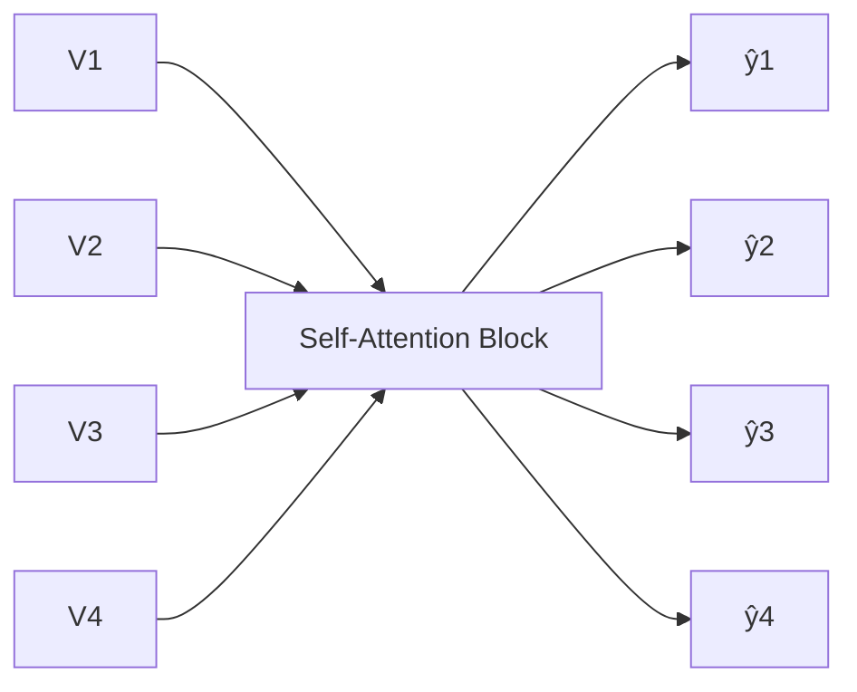
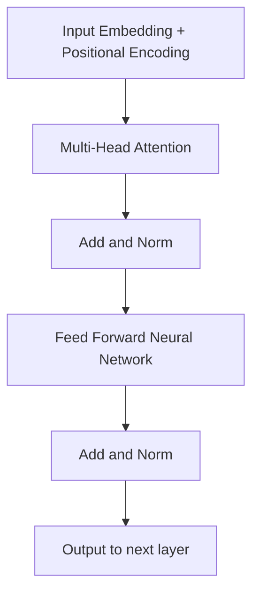
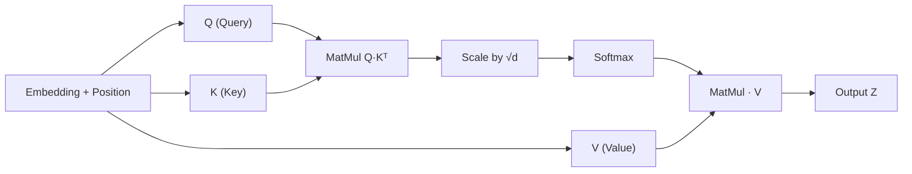
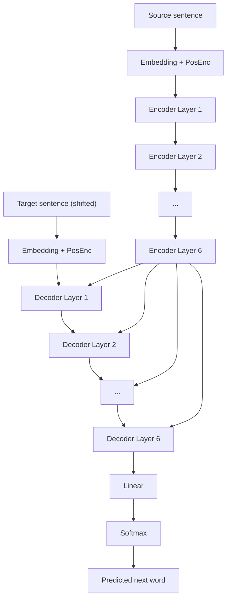

# Lecture 9: Transformers, Self-Attention, and the Encoder-Decoder Architecture

**Course**: CST8507 Natural Language Processing, Week 9
**Topic**: Transformer-Based Language Models
**Developed by**: Hala Own, Ph.D.

---

## Lesson Agenda

- Transformer Architecture
- Self-Attention mechanisms
- Transfer Learning and Fine-Tuning
- Applications of transformer-based language models
- Drawbacks and variants of Transformers

---

## 0. Text Representation Background

Before diving into transformers, recall the three main categories of text representation we have built up over the course:

### 1. Sparse, Frequency-Based (Count-Based Features)

- One-Hot Encoding
- Bag of Words
- Bag of N-Grams
- TF-IDF

### 2. Dense Word Embeddings (Static): Dense Vectors Capture Semantics

- Word2Vec
- GloVe
- FastText

### 3. Deep Contextual and Universal Embeddings (Contextual and LLM-Based)

- BERT, GPT, ELMo
- Sentence-BERT, USE, LaBSE
- LLM-Based Universal Embeddings
- Contrastive Learning and Retrieval Tasks

---

## 0.1 Problem with Static Embeddings (word2vec)

Static embeddings like Word2Vec have several drawbacks:

- **Fixed embeddings**: One word equals one vector, no context. The same word always maps to the same vector no matter where it appears.
- **Fixed at training time**: The vector for "bank" is decided when the model is trained and cannot change at inference.
- **Out-of-vocabulary (OOV) problem**: Any word not seen during training has no vector at all.
- **Morphological blindness**: "run", "running", and "runner" are treated as unrelated words because each has its own embedding.

These issues motivated **contextual embeddings**.

---

## 0.2 Contextual Embeddings

The core claim of contextual embeddings:

> **Key insight**: The representation of the meaning of a word should be different in **different contexts**.

- Each word has a **different vector** depending on its sentence.
- The meanings depend on the **surrounding words**.

A contextual embedding for "bank" near "river" is different from "bank" near "money". The model produces these vectors on the fly, per sentence.

---

## 0.3 Self-Attention Motivations

### The Core Idea

- **Build up the contextual embedding for a word by selectively integrating information from all neighboring words**, not equally but **weighted by relevance**.
- Each **word evaluates the importance** of the other words in the sentence and focuses more on those that provide useful context, while giving **less weight to less relevant** words.

### What Self-Attention Answers

Every word in a sequence asks:

> *"Which other words in this sentence are most relevant to understanding me?"*

**Self-attention** is the mechanism that answers that question for every word, simultaneously.

### Illustrative Example

Consider the sentence:

> *"The animal didn't cross the street because it was too tired."*

Self-attention determines which words the token "it" attends to. The strongest connections are to "The", "animal", and "too". The model learns on its own that "it" refers back to "animal" because the attention mechanism pulls relevant context in.

---

## 1. Self-Attention Review (Board Walkthrough)

We start by revisiting the self-attention mechanism covered previously. Assume we have four input word embeddings:

- $V_1$: embedding for word 1
- $V_2$: embedding for word 2
- $V_3$: embedding for word 3
- $V_4$: embedding for word 4

### Goal

Compute the self-attention of word $V_3$ with respect to the other words in the sentence.

### Step-by-Step Procedure

1. **Dot product**: Multiply $V_3$ with each of the vectors $V_1, V_2, V_3, V_4$.
2. **Scores**: The dot products produce scores $s_1, s_2, s_3, s_4$. These are the raw attention scores.
3. **Normalization**: Normalize the scores so they fall into the same range. The normalized outputs are the attention weights.
   - $w_{3,1}$ is the attention of word 3 with respect to word 1
   - $w_{3,2}$ is the attention of word 3 with respect to word 2
   - $w_{3,3}$ is the attention of word 3 with respect to word 3
   - $w_{3,4}$ is the attention of word 3 with respect to word 4
4. **Weighted sum**: Multiply each weight by its original vector and sum them. The result is the contextual representation of word 3.

$$y_3 = \sum_{j=1}^{4} w_{3,j} \cdot V_j$$

*(reconstructed formula)*

### Summary of the Process

To compute the self-attention of $V_3$ in a four word sentence:

1. Apply the dot product of $V_3$ with each word.
2. Obtain the scores (attention scores).
3. Normalize the scores to obtain weights.
4. Multiply each weight by the corresponding original vector $V_j$.
5. Sum the products to obtain the weighted sum (the attention output).

### Problem with Basic Self-Attention

> **Key question**: Is there any training or neural network here?

No. In this basic form, there is no training at all. It is a pure calculation. To make self-attention useful in deep learning, we must make it trainable.

---

## 2. Making Self-Attention Trainable

To introduce training, we multiply each input vector by a weight matrix. These matrices are learned during the training process. The original authors borrowed an analogy from **database systems**.

### The Database Analogy

| Term | Role in Database | Role in Self-Attention |
|------|------------------|------------------------|
| **Query** | What you are searching for | The word whose representation we compute |
| **Keys** | Indexed identifiers searched against | The words we compare against |
| **Values** | The data retrieved | The vectors used for the weighted sum |

When you have a query and search against it, you search in your keys and then retrieve the values. The transformer authors simply borrowed this analogy.

### The Three Weight Matrices

Three matrices are introduced into the self-attention block. All three are trained during neural network training.

- **$M_Q$**: weight matrix that produces the query vector from an input embedding
- **$M_K$**: weight matrix that produces the key vector from an input embedding
- **$M_V$**: weight matrix that produces the value vector from an input embedding

*(reconstructed formulas for clarity)*

$$Q = M_Q \cdot V, \quad K = M_K \cdot V, \quad V_{out} = M_V \cdot V$$

This transforms self-attention from a pure calculation into a learnable transformer component.

### Self-Attention as a Neural Network Block

We can redraw self-attention as a neural network:

1. **Input**: embedding vectors $V_1, V_2, V_3, V_4$.
2. **Multiplication (dot product with learnable matrices)** produces scores $S_{i,j}$.
3. **Normalization** produces weights $W_{i,j}$.
4. **Multiplication by values** produces outputs $\hat{y}_1, \hat{y}_2, \hat{y}_3, \hat{y}_4$.


*(added diagram)*

**Back propagation** comes into play to update the learnable matrices $M_Q$, $M_K$, and $M_V$. This is the neural network version of the self-attention mechanism with training introduced.

---

## 3. Multi-Head Attention

### Motivation from Computer Vision

The idea of multi-head attention comes from the convolutional neural network course. Why do we stack multiple layers in a CNN?

> **Why layers in CNN?** One layer detects edges. Another detects shapes. Another detects object-level features. This is **layer abstraction**. A single layer cannot capture all the features of an image. Different layers capture different levels of detail.

The same reasoning applies to natural language. A single attention layer cannot access all the complex contextual details for a word. Multiple attention heads can access different or more complex contexts for the same sentence.

### The Problem with Single-Head Attention

A single attention head produces **one weighted blend of all words**. That blend cannot capture multiple kinds of relationships at once.

Take the sentence:

> *"The **animal** didn't cross the street because **it was too tired**."*

The word **"it"** needs to resolve three things simultaneously:

- **Coreference**: Refers to the animal (it → animal).
- **Syntactic**: Acts as the subject (subject of "was").
- **Semantic**: Must mean something alive (it → living thing).

A single attention head cannot capture all three relationships at once. This is why multiple heads are needed.

### Structure of Multi-Head Attention

Instead of a single self-attention layer, we stack multiple self-attention layers (heads) in parallel. Each head has its own set of learnable matrices.

- Heads are numbered $1, 2, \ldots, H$ where $H$ is the total number of heads.
- Each head produces its own scores: $S_{i,j}^{(1)}, \ldots, S_{i,j}^{(H)}$.
- Each head produces its own weights: $W_{i,j}^{(1)}, \ldots, W_{i,j}^{(H)}$.
- Each head produces its own output vector: $\hat{y}_i^{(1)}, \ldots, \hat{y}_i^{(H)}$.

For example, $V_1$ multiplied by $V_1$ gives weight $w_{1,1}$. $V_1$ multiplied by $V_2$ gives weight $w_{1,2}$, and so on. From these weights we compute $\hat{y}_1$ as the weighted sum. This happens independently in each head. $\hat{y}_2$ is the contextual embedding for $V_2$, and so forth.

Each head learns a **different representation subspace**. One head may focus on syntactic relations, another on coreference, another on semantics. This is the idea of multi-head attention used in the transformer.

---

## 4. The Transformer: History and Paper

### Paper Details

| Field | Detail |
|-------|--------|
| **Title** | Attention Is All You Need |
| **Year** | 2017 |
| **Affiliation** | Google Brain, Google Research, University of Toronto |
| **Training objective** | Machine translation |
| **Source** | https://arxiv.org/abs/1706.03762 |

**Authors**: Ashish Vaswani, Noam Shazeer, Niki Parmar, Jakob Uszkoreit, Llion Jones, Aidan N. Gomez, Łukasz Kaiser, Illia Polosukhin.

The title makes a bold claim: you do not need anything other than attention.

### Abstract Summary

> The dominant sequence transduction models are based on complex recurrent or convolutional neural networks that include an encoder and a decoder. The best performing models also connect the encoder and decoder through an attention mechanism. The **Transformer** is a new simple network architecture, based solely on attention mechanisms, dispensing with recurrence and convolutions entirely. Experiments on two machine translation tasks show these models to be superior in quality while being **more parallelizable** and requiring **significantly less time to train**.

### Benchmark Results

| Task | BLEU Score | Notes |
|------|-----------|-------|
| WMT 2014 English to German | **28.4** | Improves over the existing best results, including ensembles, by over 2 BLEU. |
| WMT 2014 English to French | **41.8** | New single-model state-of-the-art after 3.5 days of training on 8 GPUs. |

### Training Data

The paper trained two translation models:

1. **English to German**: approximately 4.5 million pairs of sentences.
2. **English to French**: approximately 36 million pairs of sentences.

The data is in pair form (source sentence, target sentence), which is the standard format for supervised translation training. Recall that translation training feeds the model with a source language and a target language.

### Training Cost

Training takes approximately **3.5 days on 8 GPUs**. This is a huge model by the standards of the time.

---

## 5. What Is a Transformer?

A **transformer** is a novel architecture that aims to solve **sequence-to-sequence** tasks while handling long-range dependencies with ease. It relies entirely on **self-attention** to compute representations of its input and output. It was proposed in the paper *Attention Is All You Need*.

The transformer is built on the **encoder-decoder** paradigm, but it combines the encoder and decoder into one unified unit. The input (source language) is fed into the unit, and the translated target language comes out.

### High-Level Data Flow

```
Input: "Je suis étudiant"  →  THE TRANSFORMER  →  Output: "I am a student"
```

Internally the flow goes through a stack of **ENCODERS** followed by a stack of **DECODERS**.

---

## 6. High-Level Architecture

### Stacked Encoders and Decoders

From a high-level view, the transformer has two major parts:

- **Encoder stack** (left side of the architecture)
- **Decoder stack** (right side of the architecture)

The notation $N \times$ in the diagram means multiple layers are stacked on top of each other, just like the stacking idea in convolutional networks.

| Parameter | Value in Original Paper |
|-----------|-------------------------|
| Number of encoder layers ($N$) | 6 |
| Number of decoder layers ($N$) | 6 |

All encoder layers have the same internal architecture. All decoder layers have the same internal architecture. The value of $N$ is a **hyperparameter**. Other transformer implementations use different values.

### Data Flow

1. Input goes to the first encoder layer.
2. The output of the last encoder layer is the input to every decoder layer (this is very important).
3. The decoder, using the input from the encoder and the tokens it has so far, tries to predict the next word.

### Encoder vs. Decoder Layer Anatomy

The encoder and decoder layers are nearly identical, with one exception.

| Component | Encoder Layer | Decoder Layer |
|-----------|---------------|---------------|
| Multi-head attention | Yes | Yes |
| **Masked multi-head attention** | No | **Yes (extra layer)** |
| Add and Norm | Yes | Yes |
| Feed forward neural network | Yes | Yes |

The only structural difference is that the decoder adds a **masked multi-head attention** layer. Everything else is the same.

### Encoder Layer Breakdown

A single encoder layer contains:

1. Multi-head attention
2. Add and Norm
3. Feed forward neural network
4. Add and Norm


*(added diagram)*

---

## 7. Input Embedding and Tokenization

### Tokenization

The first step of the input pipeline is **tokenization**. The transformer uses a specific technique called **byte pair encoding** (BPE).

> **Course note**: See the provided link on byte pair encoding to understand how the tokenizer works in detail.

### Embedding

After tokenization, an embedding vector of length **512** is created for each token. The embedding vector dimension is therefore $d_{model} = 512$.

### Why Parallelism Matters

A major advantage of the transformer over RNNs and LSTMs is parallelism.

> **Drawback of RNN/LSTM**: We feed the model one token at a time and must wait for the output of the previous step before processing the next. This is sequential and slow.

> **Transformer advantage**: The whole input is fed at once, allowing all tokens to be processed in parallel.

However, feeding everything at once creates a new problem: we lose the positional information that was implicit in the sequential RNN processing. This motivates positional encoding.

---

## 8. Positional Encoding

### Why Position Matters

In an RNN, the order of tokens is preserved because we feed them one by one. In the transformer, all tokens arrive at once. We need to preserve the order of each word because **in contextual information, the order is very important**.

### First Attempt: Raw Position Vector

> **Idea**: Create a 512 dimensional vector where each value is based on position, then add this vector to the embedding.

**Problem**: If the word is in position 100 or 50, adding a vector with large position values will overwhelm the embedding. We will lose the most important information in the embedding, which is the ability to **measure similarity** between words. The data becomes completely changed. This technique is not the one we use.

However, this does give us the right idea: we need something **unique** per position that can be added to the embedding.

### Second Attempt: Sigmoid Function

> **Idea**: Use a sigmoid function. For each position number (for example position 2), project the position onto the sigmoid curve and use that value.

**Problem**: The sigmoid function saturates. At large positions, the values become the same. But positions must be unique and cannot repeat. So sigmoid fails.

### Final Solution: Sine and Cosine Functions

The transformer paper uses a combination of **sine and cosine** functions. Using both together gives more variety in values and avoids the saturation problem.

**Key properties**:

- Generates a vector of the same length as the embedding (512).
- This positional encoding vector is **added once** to the embedding.
- Even indices use sine. Odd indices use cosine.
- The denominator constant is 10,000, which provides a wide range of frequencies.

### Comparing Sigmoid and Sinusoidal Functions

- **Sigmoid Function**: $\sigma(t) = \frac{1}{1 + e^{-t}}$, ranges from 0 to 1. Saturates at large positions, so positions repeat.
- **Sinusoidal Functions**: $y = \sin(x)$ and $y = \cos(x)$, oscillating between -1 and 1, with different wavelengths per dimension.

Sine and cosine waves are used because they allow the model to encode position information that the network can learn to attend to based on **relative positions**.

### The Formulas

Positional encoding uses different frequencies across dimensions. The paper defines:

$$PE(pos, 2i) = \sin\left(\frac{pos}{10000^{2i/d_{model}}}\right)$$

$$PE(pos, 2i+1) = \cos\left(\frac{pos}{10000^{2i/d_{model}}}\right)$$

Where:

- $pos$ is the position of the word in the sentence.
- $i$ is the dimension (pair) index.
- $d_{model}$ is the model dimension.

**Informal rule as stated by the lecturer**: *if the vector index is even, use sine. If it is odd, use cosine.* Consecutive pairs of indices (indices $2i$ and $2i+1$) share the same denominator, which corresponds to one wavelength.

Lower dimensions oscillate quickly, higher dimensions oscillate slowly. This creates a **unique pattern for each position**.

**Why 10,000?** The lecturer tried to ask and search why the constant is 10,000. The answer is that 10,000 gives a different range of the frequency in the sine and cosine. With this constant, the range spans from $2\pi$ up to $2\pi \times 10{,}000$ for any dimension of the vector. Each dimension therefore has its own wavelength.

### Positional Encoding Values (Visualization)

The positional vector is added to the embedding vector of the word. Example values for positions $p_0, p_1, p_2, p_3$ across dimensions $i = 0$ to $i = 3$ (with $d = 50$):

| Dimension | $p_0$ | $p_1$ | $p_2$ | $p_3$ |
|-----------|-------|-------|-------|-------|
| $i = 0$ | 0.000 | 0.841 | 0.909 | 0.141 |
| $i = 1$ | 1.000 | 0.540 | -0.416 | -0.990 |
| $i = 2$ | 0.000 | 0.638 | 0.983 | 0.875 |
| $i = 3$ | 1.000 | 0.770 | 0.186 | -0.484 |

**Settings**: $d = 50$. The value of each positional encoding depends on the position ($pos$) and dimension ($d$). We calculate the result for every index $i$ to get the whole vector.

### Worked Example: "I love NLP" with $d = 4$

To illustrate (the full vector has $d = 512$, but we use $d = 4$ for simplicity). For $d = 4$, the denominators are 1 (indices 0 and 1) and 100 (indices 2 and 3).

| Word | Position | Calculation | Encoding Vector |
|------|----------|-------------|-----------------|
| "I" | 0 | $PE(0, 0) = \sin(0) = 0.0000$, $PE(0, 1) = \cos(0) = 1.0000$, $PE(0, 2) = \sin(0/100) = 0.0000$, $PE(0, 3) = \cos(0/100) = 1.0000$ | $[0, 1, 0, 1]$ |
| "love" | 1 | $PE(1, 0) = \sin(1) \approx 0.8415$, $PE(1, 1) = \cos(1) \approx 0.5403$, $PE(1, 2) = \sin(1/100) \approx 0.0100$, $PE(1, 3) = \cos(1/100) \approx 1.0000$ | $[0.8415, 0.5403, 0.01, 0.9999]$ |
| "NLP" | 2 | $PE(2, 0) = \sin(2) \approx 0.9093$, $PE(2, 1) = \cos(2) \approx -0.4161$, $PE(2, 2) = \sin(2/100) \approx 0.0200$, $PE(2, 3) = \cos(2/100) \approx 1.0000$ | $[0.9093, -0.4161, 0.02, 0.9998]$ |

> **Lecturer note**: "I am not confident about this equation, so to let you understand, I created an Excel sheet to compute it step by step." The Excel sheet first computes the denominator, then applies sine or cosine based on whether the index is even or odd. The lecturer also mentioned using a simplified frequency of 100 in the walk-through.

> **Course note**: For simplification we use $d = 4$ to show the calculation clearly. In the actual transformer, $d = 512$ and the same logic repeats for all 512 dimensions.

### Python Reconstruction

```python
import numpy as np

def positional_encoding(max_pos, d_model):
    pe = np.zeros((max_pos, d_model))
    for pos in range(max_pos):
        for i in range(0, d_model, 2):
            denominator = np.power(10000, (2 * i) / d_model)
            pe[pos, i] = np.sin(pos / denominator)
            if i + 1 < d_model:
                pe[pos, i + 1] = np.cos(pos / denominator)
    return pe

pe_matrix = positional_encoding(max_pos=50, d_model=512)
```
*(added reconstruction, matching the paper and slide convention where $2i$ and $2i+1$ share a denominator)*

### Why the Same Word in Different Positions Gets Different Vectors

> **Question from class**: If a sentence has multiple occurrences of the word "I" in different positions, do they take different vectors?

**Yes**, of course. This is the idea of contextual information. The same word in a different position has a different impact on the meaning. Each position produces a unique positional encoding, so the final embedding (word embedding plus positional encoding) differs for each occurrence.

No two positions produce duplicate positional encoding vectors. This is guaranteed because we use the different frequencies of sine and cosine together, which adds more range compared to using either function alone.

---

## 9. Self-Attention in the Transformer (Matrix Form)

### The Attention Mechanism Workflow

The self-attention pipeline operates in two levels of detail.

**Simplified flow**:

1. $Q$ and $K$ into MatMul.
2. Scale.
3. SoftMax.
4. MatMul with $V$.
5. Output.

**Detailed flow** (step-by-step):

- **1st Step**: A query $q$ is combined with keys $k_1, k_2, k_3, k_4$ to produce similarity scores $s_1, s_2, s_3, s_4$.
- **2nd Step**: Softmax is applied to the similarity scores to produce weights $a_1, a_2, a_3, a_4$.
- **3rd Step**: Multiply the weights with values $V_1, V_2, V_3, V_4$ and sum them to get the attention value.

### Three Copies of the Input

Inside the self-attention block, the input embedding (plus positional encoding) is projected into three different spaces:

- **Q (Query)**
- **K (Key)**
- **V (Value)**

These three are obtained by multiplying the embedding matrix by three learnable matrices $W_Q$, $W_K$, and $W_V$.

Components:

- $W_Q$: Query weights
- $W_K$: Key weights
- $W_V$: Value weights
- $d_k$: attention head size

### Full Matrix Flow

For input embeddings $X$ (with rows for each token, for example "I", "love", "tennis"):

1. Compute $Q = X \times W_Q$, $K = X \times W_K$, $V = X \times W_V$.
2. Compute attention scores: $S = \text{softmax}\left(\frac{Q \times K^T}{\sqrt{d_k}}\right)$.
3. Example attention score matrix:

| From / To | I | love | tennis |
|-----------|------|------|--------|
| I | 0.7 | 0.2 | 0.1 |
| love | 0.05 | 0.8 | 0.05 |
| tennis | 0.05 | 0.2 | 0.75 |

4. Compute attention output $S \times V$, which gives the context-aware embeddings for "I", "love", "tennis".

### The Pipeline Inside a Single Attention Head

1. **Matrix multiplication** between $K$ and $Q$.
2. **Scaling** (explained below).
3. **Masking** (used only in the decoder, skipped for the encoder).
4. **Softmax** to normalize.
5. **Matrix multiplication** of the softmax output with $V$.

The final output is the self-attention block's result $Z$ (or $\hat{y}$).


*(added diagram)*

### Why Matrix Form?

We put the entire input embedding into matrix form so we can benefit from the **GPU**, which performs parallel matrix multiplication very efficiently. This is the key speed advantage of the transformer.

### When Positional Encoding Is Added

Positional encoding is added **only once**, right after the first embedding generation. Then the combined vector (embedding plus positional encoding) is fed into the self-attention layer. In self-attention, the scores and weights are computed to predict $\hat{y}$, which is the contextual representation of the input sentence.

---

## 10. Scaled Dot Product Attention

### Why Scale the Dot Product?

> **Motivation**: The softmax function is an exponential function. It is very sensitive to large input values.

**Small changes in logits can drastically change probabilities due to exponentiation**. The softmax formula is:

$$w_{ij} = \frac{\exp(w'_{ij})}{\sum_j \exp(w'_{ij})}$$

**High weight values kill the gradient and slow down learning**.

### Numerical Demonstration: Softmax Saturation

Consider what happens to softmax as logit magnitudes grow.

| Logits | Softmax Output |
|--------|----------------|
| $[1, 2, 3, 4]$ (small) | $[0.0321, 0.0871, 0.2369, 0.6439]$ |
| $[5, 10, 15, 20]$ (medium) | $[0.0000, 0.0000, 0.0067, 0.9933]$ |
| $[10, 20, 30, 40]$ (large) | $[0.0000, 0.0000, 0.0000, 1.0000]$ |

As the logits get larger, the softmax collapses into a near one-hot distribution. For training, we want gradients to flow through all positions, not concentrate on one. So we must prevent the softmax from saturating.

### The Fix: Scaled Dot Product

Instead of performing a plain dot product, use a **scaled dot product**. The scale is the **square root of $d$**, the dimension of the vector.

> **Lecturer statement**: "The scaling factor is the square root of the dimension of the vector. So square root of 512. So if you divide each value by the square root of the dimension, and we apply softmax, we will have values here rather than zeros."

$$\text{Attention}(Q, K, V) = \text{softmax}\left(\frac{Q \cdot K^T}{\sqrt{d}}\right) \cdot V$$

*(reconstructed formula from paper)*

In multi-head attention, $d$ refers to the per-head dimension, which turns out to be 64 in the original transformer (see below).

### Numerical Demonstration: Scaling Fixes the Saturation

Take logits $[10, 20, 30, 40]$ with $d = 100$ and $\sqrt{d} = 10$.

**Without scaling** (logits $[10, 20, 30, 40]$):

- Softmax: $[0.0000, 0.0000, 0.0000, 1.0000]$

**With scaling** by $\sqrt{d} = 10$ (logits become $[1, 2, 3, 4]$):

- Softmax: $[0.0321, 0.0871, 0.2369, 0.6439]$

Scaling prevents the softmax from becoming too peaked, preserving useful gradients.

### Empirical Proof (Histogram Comparison)

The lecturer also demonstrated this with histograms of real distributions.

- **Original distribution**: values spread roughly over $[-400, 400]$.
- **Scaled distribution**: values compressed to roughly $[-4, 4]$.
- **Softmax of original**: highly peaked, only 1 or 2 spikes dominate (around 0.6 and 0.4).
- **Softmax of scaled**: probabilities distributed much more evenly (values around 0.0005 to 0.0025).

The scaled version produces gradients across many positions instead of concentrating on a few.

### The Scaling Factor in the Transformer

In the original transformer:

- $d_{model} = 512$
- Number of heads $H = 8$
- Dimension per head $d_{head} = 512 / 8 = 64$
- Scaling factor per head $\sqrt{d_{head}} = \sqrt{64} = 8$

So each head scales the product $Q \cdot K^T$ by dividing by 8.

### Note on the Name

> **Important distinction**: "Scaled dot product" is the name of the attention computation. The word "scaled" refers to the $\sqrt{d}$ division. The $\sqrt{d}$ itself is called the **scaling factor**, not the dot product.

---

## 10.5. Worked Example: "Thinking Machines"

With $d = 64$ (the per-head dimension used in the original paper), consider the two input tokens "Thinking" and "Machines".

- **Embeddings**: $x_1$, $x_2$
- **Queries**: $q_1 = x_1 \cdot W^Q$, $q_2 = x_2 \cdot W^Q$
- **Keys**: $k_1 = x_1 \cdot W^K$, $k_2 = x_2 \cdot W^K$
- **Values**: $v_1 = x_1 \cdot W^V$, $v_2 = x_2 \cdot W^V$

Each vector has dimension 64.

### Full Attention Calculation for "Thinking" Attending to Both Tokens

Follow the five steps:

1. **Calculate scores**: the dot product of the query vector with the key vector of the respective word.
2. **Divide the scores by $\sqrt{64} = 8$**.
3. **Calculate Softmax**.
4. **Multiply each value vector by the softmax score**.
5. **Sum up the weighted value vectors**.

| Step | Thinking | Machines |
|------|----------|----------|
| Embedding | $x_1$ | $x_2$ |
| Queries | $q_1$ | $q_2$ |
| Keys | $k_1$ | $k_2$ |
| Values | $v_1$ | $v_2$ |
| Score | $q_1 \cdot k_1 = 112$ | $q_1 \cdot k_2 = 96$ |
| Divide by 8 ($\sqrt{d_k}$) | 14 | 12 |
| Softmax | 0.88 | 0.12 |
| Softmax × Value | $v_1$ (weighted) | $v_2$ (weighted) |
| Sum | $z_1$ | $z_2$ |

The resulting $z_1$ is then passed to the feed-forward neural network.

*(Slide credit: Jay Alammar)*

---

## 11. Multi-Head Attention in the Transformer (Detailed)

### Structure

The transformer has 8 heads. Since there are 6 encoder layers, each layer has its own 8 heads. The 512 dimensional embedding is divided equally across the 8 heads.

| Quantity | Value |
|----------|-------|
| Embedding dimension $d_{model}$ | 512 |
| Number of heads $H$ | 8 |
| Dimension per head $d_{head}$ | 64 |
| Scaling factor $\sqrt{d_{head}}$ | 8 |

### Per-Head Computation

For each head, the same steps occur in parallel:

1. Input: words, embedding plus position.
2. Compute $Q$, $K$, $V$ for this head.
3. Multiply $Q$ by $K$ (matrix product).
4. Divide by $\sqrt{d_{head}} = 8$ (scaling, not dot product).
5. Apply softmax.
6. Multiply softmax output by $V$.
7. Output is $Z$, which is $\hat{y}$ for this head.

*(reconstructed example: "Thinking Machines")*

```
Input:         "Thinking Machines"
Embed + Pos:   [512-dim vectors for each token]
Split heads:   each head gets a 64-dim slice
Per head:      Q, K, V → scaled softmax → Z
Concat heads:  stack 8 × Z → 512-dim matrix
Project:       multiply by Wo → final output
```

### Combining the Heads

Each head produces its own output $Z_0, Z_1, \ldots, Z_7$ (for heads 0 through 7). The feed forward neural network that follows expects **one** matrix, not eight.

The full multi-head process:

1. Input $X$ (with rows for each token, for example "Thinking" and "Machines").
2. Calculate attention separately in eight different attention heads:
   - Attention Head #0 → $Z_0$
   - Attention Head #1 → $Z_1$
   - ...
   - Attention Head #7 → $Z_7$
3. **Concatenate** all the attention heads: $[Z_0, Z_1, Z_2, Z_3, Z_4, Z_5, Z_6, Z_7]$.
4. **Multiply** with a weight matrix $W^O$ that was trained jointly with the model.
5. The result is the $Z$ matrix that captures information from all the attention heads. We can send this forward to the FFNN.

This is why we need an extra compacting step between multi-head attention and the feed forward layer.

---

## 12. Feed Forward Neural Network (Position-Wise)

After the multi-head attention output passes through the Add and Norm layer, it enters the **feed forward neural network**.

### Architecture

- It is a **two layer, fully connected, ReLU** network.
- Because it has two layers, it has two learnable weight matrices $W_1$ and $W_2$, plus bias vectors $b_1$ and $b_2$.
- The activation is ReLU: any value less than 0 becomes 0, any value greater than 0 passes through unchanged. ReLU acts like a filter.

$$\text{FFN}(Z) = \text{ReLU}(Z \cdot W_1 + b_1) \cdot W_2 + b_2$$

The feed-forward layer is applied **position-wise** (to each token independently) after the attention and Add and Norm step.

Flow: Self-Attention → Add and Normalize → $\text{LayerNorm}(X + Z)$ → Feed Forward → Add and Normalize.

### Why "Position-Wise"?

> **Key distinction**: This is not a normal feed forward neural network. It is called a **position-wise feed forward neural network**.

The name comes from how it is applied: for each token (each position), the previous processes are computed in parallel. The same feed forward network is applied independently to each position. So the computation is tied to the position of each token.

### Role of the Feed Forward Layer

After self-attention, we have very important information: for each word, **what or who it should attend to**. But do we actually **use** this information in learning? Self-attention alone only tells us the relationships.

The feed forward neural network answers the question: given this attention knowledge, **what can I do with it?**

> **Analogy**: The feed forward layer works like **memory storage or memory knowledge** that we learn using this architecture. Self-attention computes "where to look", and the feed forward network stores "what we can conclude from looking there".

The pipeline of insight:

1. **Multi-head attention**: identifies what each word should attend to.
2. **Add and Norm**: preserves information (explained next).
3. **Feed forward network**: transforms the attended information into stored knowledge.

---

## 13. Add and Norm (Residual Connections)

### What Is Added?

The Add and Norm block in the transformer adds two things together:

- The **output** of the previous sublayer (either multi-head attention or feed forward).
- The **input** to that same sublayer.

This pattern is used **twice per encoder layer**: once after multi-head attention and once after the feed forward network.

This is called a **residual connection**.

### Why Residual Connections?

> **Motivation**: Deep architectures suffer from the **vanishing gradient problem**. Recall from RNNs and LSTMs that we saw how gradients can become zero across many layers.

The transformer is a very deep architecture (many stacked layers, each with multiple sublayers). Backpropagation is differentiation, and gradients can vanish across these many layers.

### The Solution

After we compute self-attention, we obtain information in the form of weights. To avoid losing what we already have, we **add the attention output back to the original input**. This has two benefits:

1. **Preserves the original information**: Do not forget what we started with.
2. **Mitigates vanishing gradients**: Gradients have a direct path back through the addition, bypassing the sublayer if needed.

> **Key idea**: Let us **add and refine**, rather than **replace**. We do not replace the initial vector with the refined vector. We add the refinement to the initial vector.

### Why Twice Per Layer?

The Add and Norm pattern is repeated twice in each encoder layer:

1. After multi-head attention, to preserve the input that went into the attention mechanism.
2. After the feed forward network, to preserve the input that went into the feed forward mechanism.

This ensures that at every step in the architecture, information is preserved and gradients can flow backward cleanly.

### Formulas

The simple residual formula is:

$$\text{Output} = \text{Input} + \text{Layer}(\text{Input})$$

Combined with layer normalization:

$$\text{LayerOutput} = \text{LayerNorm}(x + \text{Sublayer}(x))$$

Where:

- $x$ is the input to the sublayer.
- $\text{Sublayer}(x)$ is the output of either the multi-head attention or the feed forward network.
- $\text{LayerNorm}$ normalizes the summed vector.

Residual connections skip around each sub-layer (Multi-Head Attention and Feed Forward), allowing gradients to flow directly through the network. They appear as arrows going **around** the Add and Norm blocks in the architecture diagram.

### Add and Norm as a Combination

The Add and Norm block combines:

- **$X$**: Input embedding (from the first step), the residual path.
- **$Z$**: Output of the previous layer (from the attention block).

These are summed and then passed through **Layer Normalization**. The Add and Norm block appears $N \times$ in the encoder, after both the Multi-Head Attention and Feed Forward sub-layers.

---

## 14. Parallelism as the Big Advantage

A big advantage of the transformer is that **everything runs in parallel**:

- All multi-head attentions work in parallel.
- The whole sentence is fed to all the layers at once.
- There is no sequential waiting.

### Parallel Self-Attention Computation

Self-attention for words $X_1, X_2, X_3, X_4$ is calculated **simultaneously** rather than sequentially. Each word's computation involves:

1. Dot product ($K \cdot q$).
2. Scaling by $\sqrt{d}$.
3. Softmax.
4. Weighted sum with value vectors.
5. Produces output $Y_1, Y_2, Y_3, Y_4$.

All positions run in parallel, which is a key advantage over RNNs.

### Parallel Multi-Head Attention (Word $X_2$)

For each of $H$ heads:

- Each head independently computes similarity, probabilities, and weighted sum.
- Each head produces its own partial output $Y$.

All head outputs are then:

1. Concatenated into a vector of size $1 \times dH$.
2. Passed through a linear transformation $T$ of size $dH \times d$.
3. Produces the final output $Y_2$ of size $1 \times d$.

Each head learns different representation subspaces.

### Parallel Computation of Query, Key, Value

All three projections happen as parallel matrix multiplications:

**Query computation**:

$$X_{(N \times d)} \times W^Q_{(d \times d_k)} = Q_{(N \times d_k)}$$

Rows map input tokens 1, 2, 3, 4 to query tokens 1, 2, 3, 4.

**Key computation**:

$$X_{(N \times d)} \times W^K_{(d \times d_k)} = K_{(N \times d_k)}$$

Rows map input tokens 1, 2, 3, 4 to key tokens 1, 2, 3, 4.

**Value computation**:

$$X_{(N \times d)} \times W^V_{(d \times d_v)} = V_{(N \times d_v)}$$

Rows map input tokens 1, 2, 3, 4 to value tokens 1, 2, 3, 4.

All three projections happen in parallel as single matrix operations. All the GPUs work well with matrix multiplication, which is why parallelism gives the transformer its edge.

### Output Flow Per Encoder Layer

1. Many heads compute attention outputs in parallel.
2. The head outputs are compacted into a single output $Y$ per layer.
3. This output becomes the input to the next encoder layer.

---

## 15. Back to the Encoder-Decoder: Connecting Encoder to Decoder

Once the encoder finishes, the output of the **last encoder layer** becomes the input for **each layer** of the decoder stack.

- There are 6 decoders in the paper.
- The last encoder's output feeds into every one of the 6 decoders, not only the first.

---

## 16. The Decoder

The decoder is nearly identical to the encoder, with one important exception: an **extra masked multi-head attention layer** at the start.

### Masked Multi-Head Attention

> **Difference vs. regular multi-head attention**: During training, the decoder receives the target sentence. We want to compute attention only with the **previous words**, not the **future words**.

### Why Masking Is Needed

If the decoder has access to the future words, it is cheating. The decoder is supposed to **predict** the next word based only on what has come before. If the true next word is visible during training, the model does not truly learn to predict.

Consider the setup during training:

- Encoder receives the source language sentence.
- Decoder receives the target sentence.
- At any step, the decoder should only know the target words produced **so far**, plus the source sentence from the encoder.

> **Analogy**: We are not allowing cheating. If the decoder sees future words, it learns a shortcut and never becomes a good predictor at inference time.

### How Masking Works

> **Core rule**: Mask out attention to future words by setting attention scores to $-\infty$.

When softmax is then applied, $e^{-\infty} = 0$. So future positions contribute zero attention weight.

This is implemented with a **lower triangular mask**:

- Row $i$ can attend to columns $0, 1, \ldots, i$.
- Columns $i+1, \ldots, n$ are set to $-\infty$.

$$M_{ij} = \begin{cases} 0 & \text{if } j \leq i \\ -\infty & \text{if } j > i \end{cases}$$

### Masking Example

For a sequence $[\text{START}], \text{I}, \text{love}, \text{NLP}$, the mask forms an upper triangular pattern:

| | [START] | I | love | NLP |
|---|---|---|---|---|
| [START] | | $-\infty$ | $-\infty$ | $-\infty$ |
| I | | | $-\infty$ | $-\infty$ |
| love | | | | $-\infty$ |
| NLP | | | | |

For encoding each word (row), we can look at words in columns to the left of and including the diagonal. The $-\infty$ values become 0 after softmax, effectively blocking attention to future positions.

### Masking in Matrix Form

The flow of masked attention computation:

1. Compute $Q_{(N \times d_k)} \times K^T_{(d_k \times N)} = QK^T_{(N \times N)}$. This is the full matrix with all dot products: $q_1 \cdot k_1, q_1 \cdot k_2, q_1 \cdot k_3, q_1 \cdot k_4$ on row 1, etc.

2. Apply mask to produce $QK^T_{\text{masked}}$ of size $(N \times N)$ with the upper triangle replaced with $-\infty$:
   - Row 1: $q_1 \cdot k_1, -\infty, -\infty, -\infty$
   - Row 2: $q_2 \cdot k_1, q_2 \cdot k_2, -\infty, -\infty$
   - Row 3: $q_3 \cdot k_1, q_3 \cdot k_2, q_3 \cdot k_3, -\infty$
   - Row 4: $q_4 \cdot k_1, q_4 \cdot k_2, q_4 \cdot k_3, q_4 \cdot k_4$

3. Multiply by $V_{(N \times d_v)}$ to get $A_{(N \times d_v)} = [a_1, a_2, a_3, a_4]$.

After masking, the rest of the multi-head attention process is identical to the encoder's version.

### Cross-Attention: The Bridge Between Encoder and Decoder

The decoder's second attention layer (after the masked one and its Add and Norm) has **three inputs**. This is the **cross-attention** layer.

| Input | Where It Comes From |
|-------|---------------------|
| **Query (Q)** | The decoder (the Masked Multi-Head Attention output) |
| **Keys (K)** | The encoder (last encoder output) |
| **Values (V)** | The encoder (last encoder output) |

### Cross-Attention Formula

$$\text{CrossAttention}(Q_{dec}, K_{enc}, V_{enc}) = \text{softmax}\left(\frac{Q_{dec} K_{enc}^T}{\sqrt{d_k}}\right) V_{enc}$$

This allows the decoder to attend to relevant parts of the input sequence while generating each output token.

### Why This Makes Sense

The query comes from the decoder because the decoder is the one asking the question: "Given what I have produced so far, what should I attend to next?"

The keys and values come from the encoder because the source information is what the decoder needs to translate from.

> **Intuition**: The decoder says, "I want to attend to the source, given my current state, so that I can predict the next word." The query (the decoder's state) searches against the keys (the encoder's output) to retrieve the values (the encoder's output).

After this cross-attention, the rest of the decoder layer (Add and Norm, feed forward, Add and Norm) proceeds identically to the encoder.

---

## 17. Prediction at the Top of the Decoder

At the very top of the decoder stack there is a **Linear** layer followed by a **softmax** layer. This is the prediction pipeline.

### Role of the Softmax

- Computes a probability distribution over the entire vocabulary.
- The word with the highest probability (or sampled, depending on strategy) is the predicted next word.

During training, this probability distribution is compared to the true next word using a loss function (cross entropy), and the gradients flow back through the entire encoder-decoder stack.

### The Final Pipeline for Generating the Next Token

1. **Decoder stack output**: a vector.
2. **Linear**: projects to logits with size equal to the vocabulary size.
3. **Softmax**: produces log probabilities over the vocabulary.
4. **Argmax**: gets the index of the cell with the highest value. For example, index 5.
5. **Vocabulary lookup**: looks up which word in the vocabulary is associated with this index. For example, "am".

### How the Encoder and Decoder Stacks Connect

- The word embeddings of the input sequence are passed to the **first encoder**.
- These are then transformed and propagated to the next encoder.
- **The output from the last encoder in the encoder-stack is passed to all the decoders in the decoder-stack**.

Example flow for translation: Input *"Komm bitte her"* (German) → Encoder 1 → Encoder 2 → passed to all decoders → Decoder 1 (Self-Attention, Encoder-Decoder Attention, Feed Forward) → Decoder 2 → Output *"Please come here"*.

---

## 18. Summary of the Full Encoder-Decoder Stack


*(added diagram)*

> **Course note**: The lecturer stayed away from detailed equations because the goal is not to build a new transformer from scratch. The goal is to understand the architecture: what each block does and why it exists.

---

## 19. Hugging Face Ecosystem

### What Is Hugging Face?

**Hugging Face** is an ecosystem that provides:

- Pre-trained models
- Datasets
- Documentation
- Different organization techniques
- Different dataset techniques

You do not need to train a model from scratch. You just choose a model, download its weights, and fine-tune it on your data.

### Ecosystem Structure

**Hugging Face Hub** (top level):

- Models
- Datasets
- Metrics
- Docs

**Core Libraries** (connected bidirectionally to the Hub):

- **Tokenizers**
- **Transformers**
- **Datasets**
- **Accelerate** (connects with Transformers)

*Reference*: *Natural Language Processing with Transformers*, O'Reilly Media, Inc, 2022.

### The Hugging Face Hub

The Hub provides a searchable interface with:

**Tasks available**:

- Fill-Mask
- Question Answering
- Summarization
- Table Question Answering
- Text Classification
- Text Generation
- Text2Text Generation
- Token Classification
- Translation
- Zero-Shot Classification
- Sentence Similarity
- And many more

**Libraries**: PyTorch, TensorFlow, JAX, and many more.

**Datasets**: wikipedia, common_voice, bookcorpus, dcep, europarl, jrc-acquis, glue, squad, and many more.

**Example Models** (out of tens of thousands available):

| Model | Task | Downloads | Likes |
|-------|------|-----------|-------|
| `bert-base-uncased` | Fill-Mask | 27.5M | 42 |
| `xlm-roberta-base` | Fill-Mask | 5.88M | 9 |
| `roberta-large` | Fill-Mask | 5.26M | 15 |
| `distilbert-base-uncased` | Fill-Mask | 4.86M | 22 |
| `gpt2` | Text Generation | 4.64M | 15 |

### Model Cards and Dataset Cards

Each model and each dataset comes with a **card** that explains:

- How the model was trained.
- What data was used.
- Parameters and size.
- Limitations and intended use.

> **Course advice**: **Do not download any model unless you read the model card**. Understand which model fits your task. Even though you are not training from scratch, invest the time to learn how the model was trained, what source of data it used, what parameters, and what size.

### Pipeline Abstraction

Hugging Face provides a simple method called `pipeline`. It encodes all subprocesses:

- Loads the model.
- Fetches the weights.
- Uses the weights.
- Performs the task.

### Why Fine-Tuning Matters

Instead of spending 3.5 days training a transformer from scratch, you download a pre-trained model and **fine-tune** it on your data. This is vastly cheaper and usually more effective.

---

## 19.1 Transformer Applications with Hugging Face

The following examples use one common text (a customer complaint written by "Bumblebee" to Amazon about receiving Megatron instead of Optimus Prime) to show four applications of the transformer.

### Sample Text

> *"Dear Amazon, last week I ordered an Optimus Prime action figure from your online store in Germany. Unfortunately, when I opened the package, I discovered to my horror that I had been sent an action figure of Megatron instead! As a lifelong enemy of the Decepticons, I hope you can understand my dilemma. To resolve the issue, I demand an exchange of Megatron for the Optimus Prime figure I ordered. Enclosed are copies of my records concerning this purchase. I expect to hear from you soon. Sincerely, Bumblebee."*

### Application 1: Text Classification

```python
from transformers import pipeline
classifier = pipeline("text-classification")

import pandas as pd
outputs = classifier(text)
pd.DataFrame(outputs)
```

Output:

| | label | score |
|---|---|---|
| 0 | NEGATIVE | 0.901546 |

### Application 2: Named Entity Recognition (NER)

```python
ner_tagger = pipeline("ner", aggregation_strategy="simple")
outputs = ner_tagger(text)
pd.DataFrame(outputs)
```

Output:

| | entity_group | score | word | start | end |
|---|---|---|---|---|---|
| 0 | ORG | 0.879010 | Amazon | 5 | 11 |
| 1 | MISC | 0.990859 | Optimus Prime | 36 | 49 |
| 2 | LOC | 0.999755 | Germany | 90 | 97 |
| 3 | MISC | 0.556569 | Mega | 208 | 212 |
| 4 | PER | 0.590256 | ##tron | 212 | 216 |
| 5 | ORG | 0.669692 | Decept | 253 | 259 |
| 6 | MISC | 0.498350 | ##icons | 259 | 264 |
| 7 | MISC | 0.775361 | Megatron | 350 | 358 |
| 8 | MISC | 0.987854 | Optimus Prime | 367 | 380 |
| 9 | PER | 0.812096 | Bumblebee | 502 | 511 |

### Application 3: Question Answering

```python
reader = pipeline("question-answering")
question = "What does the customer want?"
outputs = reader(question=question, context=text)
pd.DataFrame([outputs])
```

Output:

| | score | start | end | answer |
|---|---|---|---|---|
| 0 | 0.631291 | 335 | 358 | an exchange of Megatron |

### Application 4: Summarization

```python
summarizer = pipeline("summarization")
outputs = summarizer(text, max_length=80, clean_up_tokenization_spaces=True)
print(outputs[0]['summary_text'])
```

Output:

> *"Bumblebee ordered an Optimus Prime action figure from your online store in Germany. Unfortunately, when I opened the package, I discovered to my horror that I had been sent an action figure of Megatron instead."*

---

## 20. Transformer Variants: The Transformer Tree of Life

Since 2017, many variations of the transformer have appeared. They differ in which parts of the original architecture they use.

The **Transformer** splits into three main branches:

### Encoder-Only Branch (from Encoder)

- **BERT** → DistilBERT, RoBERTa
- **XLM** → XLM-R
- **ALBERT**
- **ELECTRA**
- **DeBERTa**

### Encoder-Decoder Branch (from both Encoder and Decoder)

- **T5**
- **BART**
- **M2M-100**
- **BigBird**

### Decoder-Only Branch (from Decoder)

- **GPT**
- **GPT-2** → CTRL
- **GPT-3**
- **GPT-Neo** → GPT-J

### Summary Table

| Variant | Architecture Used | Example Models |
|---------|-------------------|----------------|
| **Encoder + Decoder** | Both halves | Original Transformer, T5, BART, M2M-100, BigBird |
| **Encoder only** | Only the encoder | BERT, DistilBERT, RoBERTa, XLM, ALBERT, ELECTRA, DeBERTa |
| **Decoder only** | Only the decoder | GPT, GPT-2, GPT-3, GPT-Neo, GPT-J, CTRL |

> **Course note**: The next lecture will cover **BERT**, which is built on only the encoder. It takes the idea of the encoder, improves it somewhat, and that is it. GPT, which uses only the decoder, will be covered later.

*Reference*: *Natural Language Processing with Transformers*, O'Reilly Media, Inc, 2022.

---

## 21. Challenges in Transformer-Based Models

Every NLP task before the transformer is completely different after the transformer. There is a huge improvement in performance after 2017. However, challenges remain.

### 21.1 Language Coverage

Most transformer models are built on one common language: **English**. There are efforts in other languages (for example Arabic), but most improvements and models are still English centric. This limits applicability to many real-world multilingual use cases.

### 21.2 Data Availability

Transformers require **huge amounts of data**. Even if you use a pre-trained model and try to fine-tune it, you still need substantial labeled data. You cannot fine-tune a model with poor quality or tiny data. A large, well-labeled dataset is needed to fine-tune correctly.

### 21.3 Working with Longer Documents

Transformers struggle with long documents. Improvements have been made, but the problem is not fully solved. Standard attention has computational cost that grows quadratically with sequence length, which limits how long the input can be in practice.

### 21.4 Transparency and Interpretability

Transformers are very deep neural networks with **billions of parameters**. Interpreting their output is extremely hard.

> **Reality check**: To interpret what a model with billions of parameters is doing is not an easy task at all.

### 21.5 Bias

Because transformers are trained on **huge data from the internet and documents**, they inherit all the biases present in that data. Biased training data leads to biased outputs.

> **Example**: Recall how problematic the first version of ChatGPT was. Many of those issues trace back to biased or unfiltered training data.

---

## 22. Lecture Summary

From the slides directly:

> **Attention** is a mechanism in neural networks that focuses on a specific part of the input and computes its context-dependent summary. It works like a "soft" version of a key-value store.

> **Self-attention** is an attention mechanism that produces the summary of the input by summarizing itself.

> The **Transformer model** applies self-attention repeatedly to gradually transform the input.

---

## 23. Key Takeaways

*(added section, synthesized from the lecture for review purposes. These are not direct lecturer quotes.)*

> **Self-attention**: Compute contextual representations by letting each word attend to all other words via Q, K, V.

> **Scaled dot product**: Divide by $\sqrt{d_k}$ to prevent softmax saturation on large dot products. In the original transformer, $d_k = 64$ and the scaling factor is $\sqrt{64} = 8$.

> **Multi-head attention**: 8 attention layers in parallel to capture different aspects of context (coreference, syntactic, semantic), inspired by CNN layer abstraction. Outputs concatenated and projected by $W^O$.

> **Positional encoding**: Sine and cosine with different frequencies (denominator $10000^{2i/d}$, shared per pair) give unique position vectors while preserving embedding similarity.

> **Residual (Add and Norm)**: Add input back to sublayer output to avoid vanishing gradients and preserve information across very deep networks.

> **Encoder vs. Decoder**: The decoder adds a masked multi-head attention layer to prevent cheating, and its cross-attention layer uses queries from itself with keys and values from the encoder.

> **Parallelism**: The whole sentence is processed at once. Positional encoding replaces sequential order information, enabling GPU parallelism.

> **Hugging Face**: Use pre-trained models and fine-tune. Read model cards carefully. Apply text classification, NER, question answering, summarization, and other tasks with the `pipeline` abstraction.

> **Transformer families**: Encoder-only (BERT), decoder-only (GPT), encoder-decoder (T5, BART).

> **Next lecture**: BERT, built on only the encoder.
