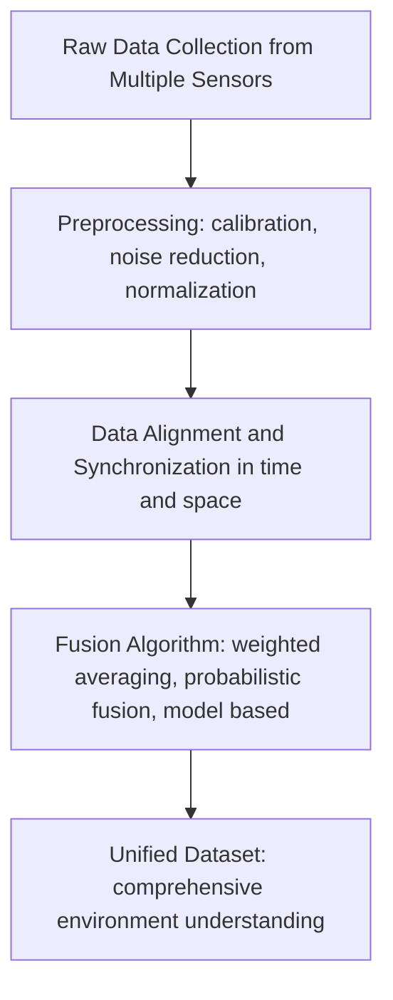

# Lecture 10: CV Sensors and Sensor Fusion

*Lecturer: Stephin Rachel Thomas*
*Date: April 02, 2026*

## Machine Vision Pipeline Overview

Machine vision follows three main steps:

1. **Image acquisition**: capturing the image or video using sensors.
2. **Image processing**: processing the captured data.
3. **Decision making**: making a decision based on the processed outcome.

> **Key idea**: Machine vision is about teaching machines to see the world. To train them, we need to capture images and videos using sensors or cameras.

**Computer vision**: the field that enables machines to interpret and understand the world through digital images.

---

## Image Acquisition and the Role of Sensors

The first phase of machine vision is image acquisition, which requires devices that help us capture images or video. This is where sensors come in.

**Sensors**: devices used to capture visual data from the environment. They convert physical data (such as light) into electronic signals, similar to how human eyes work.

### Analogy: Human Eyes vs. Sensors

When light is reflected or transmitted, human eyes convert it into signals that the brain can process. Sensors perform the same function for machines, converting physical signals into electronic data that computers can interpret.

### Why Multiple Sensor Types Matter

Different types of sensors capture different data. Each sensor has its own specialty and focuses on specific features of the environment. The data one sensor gives differs from what another sensor provides, so together they contribute to a more complete understanding of the machine.

> **Course note**: We will learn about the different types of sensors, where each sensor can be used, and how we can combine them to build a unified dataset that helps us train our models better.

### Main Sensor Types Covered

1. Optical sensors
2. Depth sensors
3. Thermal imaging sensors
4. LiDAR (Light Detection and Ranging)
5. Radar (Radio Detection and Ranging)

---

## Optical Sensors

**Optical sensors**: devices that convert light rays into electronic signals, similar to how human eyes work. They are fundamental for capturing images and videos.

Optical sensors are the primary step in acquisition, and they play a crucial role because they help us capture vision data. They vary in type and function.

### Types of Optical Sensors

- **Photodiodes**: very simple sensors with limited capabilities.
- **CCD (Charged Coupled Device)**: complex, high quality imaging sensor.
- **CMOS (Complementary Metal Oxide Semiconductor)**: complex, widely used in modern cameras.

Both CCD and CMOS are very popular and used in cameras. They help capture detailed images and focus on different features.

### Applications of Optical Sensors

Applications span various fields, ranging from simple to advanced:

- **Medical imaging**: diagnostic techniques like x-ray scanning.
- **Industrial inspection**: part and quality checks.
- **Security surveillance**.
- **Environmental monitoring**.

These sensors help expand a machine's task from recognizing faces to inspecting products.

### CCD vs. CMOS Comparison

| Feature | CCD | CMOS |
|---------|-----|------|
| **Image quality** | Higher, produces higher quality images with less noise | Previously noisier, improved significantly over the years, now comparable to CCDs in many aspects and preferred by many cameras |
| **Light sensitivity** | More sensitive, better for low light conditions | Less sensitive, more noise in low light conditions, not ideal for night photography |
| **Power consumption** | Higher, more complex, can lead to shorter battery life | More power efficient, longer battery life |
| **Cost** | Typically more expensive to manufacture | Cheaper to manufacture |
| **Shutter type** | Global shutter (captures entire image at once), reducing motion artifacts | Rolling shutter (captures image line by line), potentially causing motion artifacts like skew and wobble |

> **Note on rolling shutter issues**: Since CMOS captures line by line, moving objects can appear skewed or wobbly. The image will not be as clean as one from CCD.

**Typical CCD use cases**: professional cameras, scientific imaging, applications requiring very high image quality.

---

## Depth Sensors

**Depth sensors**: sensors that measure the distance from the sensor to an object, giving a 3D representation of the scene.

### Intuition

When an object is closer to the camera, it appears bigger, and an object far away appears smaller. Depth sensors measure this distance explicitly, unlike traditional cameras that capture flat 2D images. This gives us the third dimension, which is crucial for understanding the size, shape, and position of objects in the scene.

### Technologies Used in Depth Sensors

1. **Structured Light**: projects a pattern onto the scene and analyzes the deformation of that pattern. When the pattern deforms over an object, we can analyze the object's shape.
2. **Time of Flight (ToF)**: measures the time taken for emitted light to return to the sensor. By measuring that time, it can calculate the distance.

### Applications of Depth Sensors

- **Augmented Reality (AR)**: depth sensors enable interactive experiences by accurately mapping virtual objects onto the real world, more accurately than any other sensor type.
- **Autonomous vehicles**: depth sensors are critical for obstacle detection and navigation (per slides).
- 3D scanning, gesture recognition, robotics *(added)*.

### Example of Depth Sensor Output *(reconstructed example)*

A depth map visualizes distance as pixel intensity or color:

```
Closer object  ->  Brighter / warmer color
Farther object ->  Darker / cooler color
```

---

## Thermal Imaging Sensors

**Thermal imaging sensors**: sensors that detect infrared radiation emitted by objects with a temperature above absolute zero. The variations in temperature are used to form the image.

### Key Property

Any object with a temperature above absolute zero radiates infrared radiation. Thermal sensors detect this radiation and map the variations in temperature to form an image, where each pixel reflects the object's temperature. These images show temperature differences and allow the visualization of **heat signatures**.

### Main Advantage

Thermal sensors work in low visibility scenarios. They can operate in conditions with smoke, fog, or complete darkness (nighttime), because they detect temperature variations rather than visible light.

### Applications of Thermal Sensors

1. **Security**: detecting intruders in complete darkness.
2. **Firefighting**: firefighters can navigate through smoke and identify hotspots, reaching their targets easily.
3. **Healthcare**: monitoring blood flow and detecting fever. Thermal scanning lets you know a person's temperature without physical contact, unlike a contact thermometer.
4. **Industrial maintenance**: identifying overheated components and machinery.

---

## LiDAR (Light Detection and Ranging)

**LiDAR**: a sensor that emits pulsed laser beams into the scene and measures the distance between the sensor and objects, building a 3D map of the environment.

### How LiDAR Works

1. The sensor emits pulsed laser beams into the scene.
2. The beams travel, hit objects, and reflect back.
3. The sensor measures the time taken for the beam to return.
4. Based on this time, the distance to the object is calculated.
5. The collected distances form a 3D point cloud map of the environment.

> **Key property**: LiDAR has a high resolution mode used for generating high resolution 3D maps, suitable for applications that need very accurate 3D data.

### Applications of LiDAR

1. **Autonomous vehicles**: provides critical information for obstacle detection and navigation.
2. **Geospatial science**: used for mapping and surveying, such as surveying forests or distinguishing between vegetation and urban areas.
3. **Archaeological research**: reveals structures and features hidden beneath vegetation and soil.
4. **Atmospheric research**: measures densities of various particles and gases in the atmosphere.

### LiDAR Distance Formula *(reconstructed equation)*

$$
d = \frac{c \cdot t}{2}
$$

Where:
- $d$ is the distance to the object.
- $c$ is the speed of light.
- $t$ is the round trip time of the laser pulse.
- The factor of 2 accounts for the fact that light travels to the object and back.

---

## Radar (Radio Detection and Ranging)

**Radar**: a sensor that uses radio waves to measure distance, speed, and other characteristics of moving objects.

### How Radar Works

The same technique as LiDAR applies, but with radio waves instead of laser beams:

1. The sensor emits radio waves.
2. The waves reflect off objects.
3. The sensor measures the time taken for waves to return.
4. Distance is calculated based on this time.
5. Additionally, frequency shift (Doppler effect) allows the sensor to measure the speed of moving objects.

### Advantages of Radar

1. **Works in bad weather**: radar can penetrate fog, heavy rain, and dust, where cameras and LiDAR struggle.
2. **Nighttime operation**: unlike cameras that rely on light, radar works effectively in complete darkness.
3. **Long range**: radar can detect objects at greater distances compared to some optical sensors, useful for early warning systems that alert you when an object is approaching from far away.
4. **Speed measurement**: radar can measure the speed of moving objects, supporting traffic monitoring and autonomous driving.

### Applications of Radar

- **Autonomous vehicles**: radar is indispensable because autonomous vehicles need to make decisions even when environmental conditions are bad. They must detect obstacles and measure the speed of approaching cars. Used for adaptive cruise control and collision avoidance.
- **Traffic monitoring**.
- **Early warning systems**.

> **Important**: By combining radar with other sensors, we can enhance the robustness and safety of autonomous vehicles.

### Radar Doppler Speed Formula *(reconstructed equation)*

$$
v = \frac{c \cdot \Delta f}{2 f_0}
$$

Where:
- $v$ is the relative speed of the object.
- $\Delta f$ is the frequency shift of the returning wave.
- $f_0$ is the transmitted frequency.
- $c$ is the speed of light.

---

## Why We Need Sensor Fusion

Each sensor focuses on specific aspects and captures specific characteristics. The disadvantage of relying on a single sensor type is that we only get accurate data for that particular focus area.

### Real-World Motivation

In autonomous vehicles, we should be able to:

- Identify the speed of approaching objects.
- Detect objects regardless of environmental conditions.

We cannot rely on only one sensor. We need to use multiple sensors in our system. This leads to the concept of sensor fusion.

---

## Sensor Fusion

**Sensor fusion**: the process of combining data from multiple sensors to improve the accuracy and reliability of decision making.

### Core Principle

Information about an object from one sensor might be accurate or not, but we can confirm its accuracy by getting similar information from other sensors. Data from a single sensor might be limited, but when combined with additional sources, a more comprehensive understanding of the environment can be achieved.

### Example

If you only capture data from thermal sensors, they give you only temperature differences and related information. For a complete picture, we also need other sensors. Combining their outputs builds a more comprehensive understanding of the environment.

### Coverage Visualization *(reconstructed explanation)*

```
Camera     -> color, texture, high resolution 2D
LiDAR      -> 3D point cloud, accurate distance
Radar      -> speed, all weather, long range
Thermal    -> temperature, low visibility
           ----------------------------------
Fusion     -> Comprehensive environment model
```

The union of all captured data provides complete coverage, not redundant coverage. This is not about duplication, but about filling gaps where individual sensors are weak.

> **Key distinction (from slides)**: This is **not system redundancy**. It is a **union, not an intersection**.

### Single Sensor Analysis Dimensions

When evaluating what a single sensor can capture, each sensor (camera, thermal, radar, LiDAR) must be assessed across these dimensions:

- **Capture rate**.
- **Data resolution**.
- **Signal interference**.
- **Adverse weather** performance.
- **Low light conditions** performance.
- **Visual obstruction** handling.
- **Object contour** capture.
- **Object classification** capability.
- **Traffic sign classification**.
- **Color detection**.
- **Distance detection**.
- **Velocity detection**.

No single sensor scores highly on every dimension. Fusion exists to combine each sensor's strengths into one system that covers all dimensions.

### Fusion Techniques

Fusion techniques vary from simple to complex:

- **Simple methods**: averaging.
- **Advanced algorithms**: Kalman filters.
- **Learning based methods**: neural networks, which can even predict features.

> **Critical application note**: In scenarios like autonomous vehicles, if sensors are not working properly, it affects the safety of people. The reliability of the decision directly depends on the reliability of the sensor output.

Sensor fusion is essential in applications where decision making relies on precise and robust data, such as **autonomous vehicles, robotics, and advanced surveillance systems**.

---

## Single Sensor vs. Multi-Sensor Analysis

We do not need multi-sensor fusion all the time. It depends on how critical the system is.

### Single Sensor Analysis

- Uses data from one type of sensor (camera, radar, or LiDAR alone).
- Focuses on a specific, narrow set of data points.
- Each sensor focuses on a specific feature.
- **Examples of data**: temperature, pressure, light intensity.
- **Advantages**: straightforward, simple, cost effective, provides focused accuracy for one element.
- **Use case**: non critical systems.

### Multi-Sensor Analysis (Sensor Fusion)

Combines data from different sensors to create a comprehensive understanding.

Key benefits:

1. **Redundancy**: overlapping data from multiple sensors increases reliability and reduces the impact of individual sensor errors. If one sensor has an error, others compensate for it.
2. **Complementary data**: different sensor types provide complementary datasets that enhance overall quality.
3. **Resilience**: the system becomes more robust and can handle errors or failures in individual sensors.

> **Redundancy in sensor fusion is helpful**, not wasteful. It ensures data from one sensor is correct by cross checking with duplicate data from other sensors.

### Comparison Table *(added for clarity)*

| Aspect | Single Sensor | Multi-Sensor (Fusion) |
|--------|---------------|-----------------------|
| Complexity | Low | High |
| Cost | Low | Higher |
| Accuracy | Focused, narrow | Comprehensive |
| Reliability | Lower, single point of failure | Higher, redundant |
| Use case | Non critical systems | Safety critical (autonomous vehicles, medical) |

---

## Sensor Trade-offs

Each sensor type has strengths and weaknesses. The main idea of sensor fusion is that one sensor can compensate for another wherever one is lacking.

| Sensor | Strengths | Weaknesses |
|--------|-----------|------------|
| **Camera** | High resolution, colorful perspective across field of view (FOV), cost effective | Sensitive to heavy rain, fog, snowfall, lighting conditions, and distance to object. Not suitable for low light |
| **LiDAR** | Full 360 degree 3D point cloud, highly accurate, long distance range | Expensive, sparse data (struggles with smaller objects), mechanical limitations, affected by weather |
| **Radar** | Provides distance info, small, lightweight, affordable, less susceptible to mechanical failures | Low accuracy and resolution compared to LiDAR, multiple radar interference, not 360 degrees |
| **Thermal** | Very robust against different lighting and weather conditions, penetrates fog, works at night, accurate long range perception | Lower resolution compared to visible cameras, difficult to operate in areas with little variance between foreground and background |

---

## Challenges of Sensor Fusion

Sensor fusion is not easy. Several challenges arise because we are combining data from different sensors.

### 1. Data Variation

Each sensor captures data in different formats, quality, update rates, and resolutions. Integrating them into a unified representation is complex.

### 2. Timing and Synchronization

Precise alignment of data streams is required. Timestamps should match across sensors. If any aspect does not match, the fused data will have errors.

### 3. Computational Demands

Collecting data from multiple sensors produces an immense volume of data. Processing it requires substantial computational capacity and efficient algorithms.

### 4. Security and Privacy Concerns

Sensors collect sensitive information, especially in surveillance setups, which can intrude on human rights.

> **Summary of challenges**: variation in data formats, timing and synchronization issues, high computational resource needs, and security and privacy concerns.

---

## Sensor Fusion Data Pipeline

The effectiveness of sensor fusion relies on how well we integrate and process the data. The pipeline follows these stages:



### Stage 1: Data Collection

Collect raw data from multiple sensors simultaneously.

### Stage 2: Preprocessing

Clean the data from each sensor to enhance quality and compatibility. Techniques include:

- **Calibration**: correcting sensor measurements to a known reference.
- **Noise reduction**: filtering out random errors.
- **Normalization**: scaling data to a common range.

### Stage 3: Data Alignment and Synchronization

Ensure data streams are accurately merged in time and space. Data must align both in time (same moment) and space (same coordinate frame).

### Stage 4: Fusion Algorithm

The actual fusion happens here. Fusion algorithms integrate the preprocessed data using strategies like:

- **Weighted averaging**.
- **Probabilistic fusion** (e.g., Kalman filters, Bayesian methods).
- **Complex model based approaches** (e.g., neural networks).

### Stage 5: Unified Dataset

The final output is a unified dataset that provides a more accurate and comprehensive understanding of the environment than any single sensor could achieve.

---

## Real-World Applications of Sensor Fusion

Sensor fusion is pivotal in enhancing the intelligence and autonomy of various sectors.

### 1. Autonomous Driving

Integrates data from:

- Cameras.
- Radars.
- LiDAR.
- Ultrasonic sensors.

These together create a comprehensive model of the surroundings, which is crucial for safe navigation.

#### Sensors in Autonomous Vehicles (e.g., Tesla)

Different types of sensors are placed at different locations on the car to capture data for specific uses. The lecturer emphasized that some perform **short range proximity detection**, some **long range detection**, some are **dedicated to parking assistance**, and some **detect the speed of vehicles approaching or passing**.

##### Sensor to Function Mapping

| Sensor | Functions |
|--------|-----------|
| **Long-Range Radar** | Adaptive Cruise Control, Emergency Braking, Pedestrian Detection |
| **LiDAR** | Collision Avoidance, Environment Mapping |
| **Camera** | Traffic Sign Recognition, Lane Departure Warning, Park Assist, Surround View, Digital Side Mirror, Rear View Mirror |
| **Short/Medium-Range Radar** | Cross Traffic Alert, Blind Spot Detection, Rear Collision Warning, Park Assistance |

> **Note**: The lecturer mentioned that cameras support multiple driver assistance functions including cross traffic alert (where you get alerted if a pedestrian is crossing) and parking assistance. The slide breakdown above gives the full distribution across all sensor types.

##### Combined 360 Degree Coverage

The array of sensors (camera, LiDAR, radar, and ultrasonic) together covers the 360 degree view of the surroundings. This fused data is used to:

- Accurately detect and classify objects.
- Predict the behavior of other road users.
- Plan safe paths through complex environments.
- Build a comprehensive understanding of the environment.

> **Safety benefit**: Even in rainy, foggy, or adverse conditions, autonomous vehicles can navigate safely. The fusion process not only increases redundancy and reliability, but also enhances the vehicle's ability to make decisions in uncertain conditions.

Sensor fusion is a very important part of autonomous vehicles, helping them navigate safely and paving the way for safer, more efficient autonomous transportation systems.

### 2. Mobile Devices (Smartphones)

Smartphones are small, yet they contain many sensors, each with a unique purpose. The full sensor suite typically includes:

- **Proximity sensor**.
- **Pressure sensor**.
- **Light sensor**.
- **Ambient Temperature sensor**.
- **Humidity sensor**.
- **Accelerometer**: motion.
- **Gyroscope**: angular velocity and orientation.
- **Magnetic Field sensor (Magnetometer)**: compass heading.
- **Gravity sensor**: direction of gravity.
- **Linear Acceleration sensor**: motion with gravity removed.
- **Rotation Vector sensor**: device orientation in 3D space.
- **Orientation sensor**: legacy orientation data.

Some focus on orientation, some on light, gravity, or magnetic field. All focus on a unique perspective.

The fusion of data from accelerometers, gyroscopes, and magnetometers improves location tracking and orientation, helping with:

- GPS accuracy.
- Orientation (widely used when playing games).
- GPS based navigation.
- **Augmented reality** experiences, where fused motion and orientation data let virtual content track the physical world correctly.

### 3. Robotics

In robotics, machines interact with humans and objects, performing tasks with higher precision and adaptability. Modern robots are used in many areas, including robotic surgery in healthcare.

Robots combine:

- **Tactile data**: features we can feel by touch.
- **Visual data**: what the robot can see.
- **Auditory data**: what the robot can hear.

This combination allows robots to navigate complex environments and interact with objects and people. To train them, we need to collect tactile, visual, and auditory data together, essentially a replica of the environment.

### 4. Drones

Drones integrate data from GPS, inertial sensors, and cameras to enable precise navigation and stability, critical for applications from **aerial photography to search and rescue missions**. Drones can sense objects in adverse conditions, making them useful for complex missions.

#### Typical Drone Sensor Suite

- **High Resolution Camera**: primary visual capture.
- **Camera Mount (gimbal)**: stabilizes the camera during flight.
- **GPS**: absolute position tracking.
- **Laser Range Finder**: distance measurement.
- **Optical Flow Sensor**: tracks motion over the ground for hover stability.
- **Real Time FPV Camera**: first person view stream to the operator.
- **Flotation**: recovery on water landings.

### 5. Other Applications

- Manufacturing.
- Healthcare.
- Services.

---

## Future Trends in Sensor Technology

Advancements should focus on three main areas: sensor accuracy, efficiency, and integration capabilities. Additionally, the algorithms used for fusion should be improved.

### 1. Neuromorphic Sensors

Sensors that mimic the human eye. They provide significant improvements in processing speed and power efficiency.

### 2. Quantum Sensors

Provide unprecedented sensitivity and precision. Useful for safe navigation and imaging.

### 3. AI and Machine Learning Integration

Integration of AI and machine learning techniques directly into sensor hardware. This enables **edge computing** for real time data processing.

### Leading Future Applications

- Autonomous vehicles.
- Robotics.
- Environmental monitoring.
- Healthcare diagnostics.

---

## Challenges and Ethical Considerations

As sensor technologies become more prevalent, several ethical challenges arise.

### 1. Privacy

Increased surveillance capabilities can intrude on individual rights.

### 2. Data Security

Sensors collect data from many aspects, and some of it is sensitive. We need to protect this data from cyber attacks and threats.

### 3. Accountability of Automated Systems

Since decision making is increasingly handed off to automated systems, biases become risky. Even one error can have serious consequences. There are always questions about who is accountable when an automated system makes a wrong decision.

> **Ethical takeaway**: Addressing these challenges requires a balanced approach combining technical advancement with ethical guidelines and **regulatory frameworks** to ensure the responsible use of sensor technologies. Never use biased data for training your models. Machine vision should be ethical. We should keep in mind the challenges in data privacy and security and have ethical policies when making AI systems, so we can avoid biases. Our aim is to make everybody's life easier.

---

## Conclusion

The integration of advanced sensors and sensor fusion technologies is crucial for the future. Sensor fusion has already become part of our daily lives, from smartphones to cars.

Innovation in sensor technology, coupled with advancements in AI and machine learning, promises to:

- Unlock new possibilities across many applications.
- Improve quality of life.
- Expand computer vision across nearly all industries.

By fostering collaboration between technologists and policy makers, we can ensure that advancements in computer vision and sensor fusion contribute positively to humanity, enhancing safety, efficiency, and quality of life.

---

## Course Revision Summary

The following topics have been covered across the course so far.

### Week 1: Introduction to Machine Vision

- What is Machine Vision? (teaching the machine to see the world).
- Applications: healthcare, part inspection, automated systems, smart farming, surveillance, and all the areas where machine vision is applied (also read async material).
- Basic workflow: acquisition, processing, decision making.

### Week 2: Image Processing

- Why image processing is needed in machine vision.
- Key stages of image processing.
- **Canny edge detection**.
- Different types of image processing techniques (blurring, sharpening).

### Week 3: Segmentation and Feature Detection

- **Segmentation**: one of the toughest tasks in machine vision.
- **Global thresholding** and **adaptive thresholding**.
- **Contour object detection**: gives an enclosed path around an object.
- **SURF, SIFT, and ORB detectors**.
- **Feature matching**.

### Week 4: Image Classification and CNN Basics

- Traditional methods vs. neural networks for image classification.
- **Limitation of ANN for image classification**: ANN requires every pixel of the image as input, which is computationally expensive, which is why CNNs were introduced to focus on important features.
- **CNN architecture**.
- **CNN layers**: convolutional, pooling, fully connected, batch normalization.
- **Performance evaluation metrics**: ROC curve. The closer the curve is to the top left, the better. Below the diagonal means it is not good.

### Week 5: CNN Training and Design

- **Data augmentation**: a technique to expand the dataset.
- **Designing CNN architecture** and things to keep in mind.
- **Activation functions**.
- **Loss functions**.
- **Back propagation**.
- **Best practices for training CNN**.
- **Overfitting solutions**.

### Week 7: PyTorch

- What is PyTorch?
- **Key features** of PyTorch.
- **PyTorch vs. TensorFlow**.
- **Core components**.
- **Tensor**.
- **Neural network module**.
- **Building a simple neural network** in PyTorch.
- **Best practices** in PyTorch.

### Week 8: Object Detection

- **Limitations of traditional object detection**: sliding windows, two stage detectors.
- **Object detection vs. classification**.
- **Detection head** and its types.
- **SSD vs. YOLO**.
- **Challenges in object detection**.

### Week 9: Object Tracking

- **Object tracking vs. object detection**.
- **Single vs. multiple object tracking** (SOT vs. MOT).
- **Single stage vs. multi stage object trackers**:
  - Single stage: identification and tracking happen together.
  - Multi stage: identification and tracking happen separately.
- **Applications of multiple object tracking**.
- **ByteTrack** case study.
- **Tools for MOT development**.

### Week 10: Sensors and Sensor Fusion (Today)

- **Single sensor vs. multi sensor analysis**.
- **Sensor fusion** (the most important concept of the week).
- **Applications of sensor fusion**: smartphones, autonomous vehicles, robotics, drones, and more.
- **Types of sensors and trade-offs**: optical, depth, thermal, LiDAR, radar.
- **CCD vs. CMOS** comparison.

> **Course note**: You should be able to explain what sensor fusion is and the importance of sensor fusion. You have seen how it is used in smartphones, autonomous vehicles, and more.
