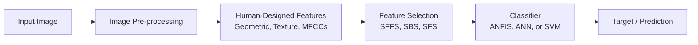
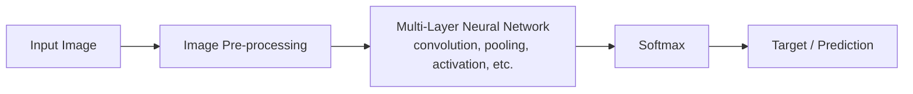
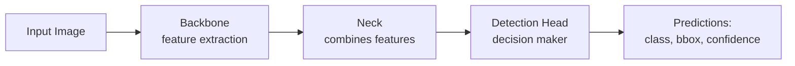
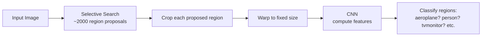
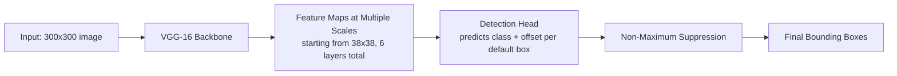

# Lecture 8: Object Detection Fundamentals

**Instructor**: Stephin Rachel Thomas
**Date**: March 19, 2026

## Topics
1. Introduction to Object Detection
2. The Evolution of Object Detection
3. Sliding Window Method (Traditional)
4. Limitations of Traditional Object Detection
5. Why Deep Learning for Object Detection
6. Traditional vs Deep Learning Pipelines
7. Backbone, Neck, and Detection Head
8. Classification vs Detection Models
9. Anchor-Based vs Anchorless Detection Heads
10. Real-World and Industry Applications
11. R-CNN (Region-Based CNN)
12. Bounding Box Regression in R-CNN
13. Intersection over Union (IoU)
14. SSD (Single Shot Detector)
15. YOLO (You Only Look Once)
16. Challenges in Object Detection
17. Future Perspectives
18. Conclusion and Key Takeaways

---

## Introduction to Object Detection

**Object detection** is a crucial aspect of computer vision, where the goal is to **identify and locate objects** in images or videos.

It is a step beyond image classification by not only **categorizing the objects** but also indicating **their location and scale within the scene**.

### Bounding Box Representation

Bounding boxes are represented by **corner coordinates**:

- `(x1, y1)`: top-left corner.
- `(x2, y2)`: bottom-right corner.
- Plus a **class label** (e.g., Person, Dog).

> **Note**: An alternative common representation uses **center coordinates plus width and height** `(cx, cy, w, h)`. R-CNN uses this center-based form for its regression formulas, as we will see later.

### Common Applications

Common applications include:

- Surveillance.
- Autonomous vehicles.
- Facial recognition.

### Detector Outputs

A detector takes an input image and produces **three outputs**:

1. **Bounding boxes** (where).
2. **Classes** (what).
3. **Score / Probability** (how confident).

---

## The Evolution of Object Detection

The field of object detection has transitioned from **manual feature extraction and simple classifiers** to **sophisticated deep learning models**.

### Early Methods

Early methods like **template matching** and **feature-based approaches** were limited by:

- **Rigidity**.
- Inability to handle variations in **scale**, **viewpoint**, and **illumination**.

### The Deep Learning Shift

The advent of deep learning brought about a paradigm shift, leveraging neural networks to **automatically learn features directly from data**, eliminating the need for hand-crafted feature extractors.

---

## Sliding Window Method (Traditional)

The sliding window approach was one of the popular traditional techniques for object detection before deep learning.

### Multi-Scale Processing (Image Pyramid)

We take the image at **multiple scales** and perform the same detection operation across all of them. The same image is processed at different resolutions so the system can find objects of varying sizes. This stack of resized images is called an **image pyramid**, and the technique is described as **sliding window with image pyramid**.

> **Key issue**: This is computationally very expensive because we traverse the entire image, take each part, and pass it into the classifier.

### The Core Concept: Feature Extraction (Descriptors)

The main concept behind the sliding window method was **feature extraction**, also called the **descriptor**.

**Descriptor**: a representation that gives information about the object and defines the characteristics of the object present in the image.

Descriptors were crucial for the sliding window method. Two popular descriptors were used:

- **SIFT (Scale-Invariant Feature Transform)**: identifies and describes **local features** in images, **invariant to scaling and rotation**, making it effective for matching different images of the same object.
- **HOG (Histogram of Oriented Gradients)**: captures the **structure of objects** by aggregating **local gradient directions or edge orientations**. Detects objects even when they appear in different orientations or scales.

### The Sliding Window Pipeline

The full traditional pipeline using a sliding window worked as follows:

1. Take a window of a chosen aspect ratio and size.
2. Slide the window across the input image.
3. For each window position, extract the image patch under the window.
4. Pass the patch through feature extraction (SIFT, HOG).
5. Apply an **SVM (Support Vector Machine)** classifier to label whether that window contains the object.
6. Repeat across **different aspect ratios** of the window.
7. Repeat across **different sizes** of the sliding window.

> **Course note**: This was not a simple task, it was a complex task, but it was one of the techniques used in the past.

### Pseudocode for the Sliding Window *(reconstructed example)*

```python
for scale in image_scales:
    resized_image = resize(image, scale)
    for aspect_ratio in window_aspect_ratios:
        for window_size in window_sizes:
            for (x, y) in slide_positions(resized_image, window_size):
                patch = crop(resized_image, x, y, window_size, aspect_ratio)
                features = extract_features(patch)  # SIFT or HOG
                label = svm_classifier.predict(features)
                if label == "object":
                    record_detection(x, y, window_size, scale)
```

This nested-loop structure is exactly why the method is computationally heavy.

---

## Limitations of Traditional Object Detection

The sliding window and other traditional methods had several major limitations:

1. **Scale variations**: if the object appeared at a different scale, the system was not able to recognize it properly. For example, the same image of a dog appearing at different scales could not be detected reliably.
2. **Lighting conditions**: if the input image did not have enough lighting, the system struggled.
3. **Manual classifier development**: we had to develop our own classifier algorithms manually.
4. **Poor adaptability**: the adaptability was not promising.
5. **Computational inefficiency**: another major limitation was the heavy computational cost.

> All these issues show that the sliding window method and other traditional methods struggled significantly with detecting objects. That is why we needed advanced techniques, and that is how we ended up using deep learning techniques in object detection.

---

## Why Deep Learning for Object Detection

In deep learning, the popular models are **neural networks**. There are convolutional networks, artificial neural networks, and many other types, but **CNNs** were especially popular because they limit the issues we saw in traditional machine vision problems, such as orientation issues and high computational resource usage.

### CNN Advantages over Traditional Methods

- **Selective feature extraction**: the convolution operation extracts only the features needed. We don't use all the pixels in the image for processing, we use only what we need.
- **Complex pattern learning**: CNNs can learn even complex patterns. This improves detection accuracy.
- **Multi-object handling**: no matter how many objects are present in the same scene, the CNN is able to identify each object and label it with the proper class.

### Quick CNN Refresher *(added)*

A CNN typically alternates between:

- **Convolution layers** that learn local filters (edge detectors, texture detectors).
- **Activation functions** like ReLU that introduce non-linearity.
- **Pooling layers** that reduce spatial size and add scale tolerance.
- **Fully connected** or **detection** layers at the end that output class scores or bounding box coordinates.

This is the foundation that the rest of the lecture builds on.

---

## Traditional vs Deep Learning Pipelines

### Traditional Pipeline

The traditional pipeline uses **three different systems** that must be integrated together.



- **Step 1**: Preprocessing of the input image.
- **Step 2**: A human-designed system extracts features such as **geometric** features, **textures**, shapes, or **MFCCs**.
- **Step 3**: The output goes to a **feature selection** system which picks the **prominent features**. Common feature selection algorithms:
  - **SFFS** (Sequential Floating Forward Selection).
  - **SBS** (Sequential Backward Selection).
  - **SFS** (Sequential Forward Selection).
- **Step 4**: The selected features go to a classifier such as **ANFIS**, **ANN**, or **SVM**.
- **Step 5**: Final target prediction.

> Because three different systems need to be integrated, the architecture is complex and sometimes forces compromises.

### Deep Learning Pipeline

The deep learning pipeline is a **single system**. There are no separate stages, just a single architecture that performs the detection.



- It is a single framework, but it has **multiple layers** that perform specific operations.
- A **softmax** layer typically converts the final activations into class probabilities.
- Deep learning techniques do the same thing as the traditional pipeline, but with **less complexity**.

### Side-by-Side Comparison *(added)*

| Aspect | Traditional Pipeline | Deep Learning Pipeline |
|---|---|---|
| Number of systems | 3 (extractor, selector, classifier) | 1 (single network) |
| Feature design | Hand-engineered (SIFT, HOG, MFCC) | Learned automatically |
| Integration effort | High, multiple modules glued together | None, end-to-end |
| Adaptability to new data | Poor | Strong, retrain end to end |
| Typical accuracy | Lower | Higher |
| Multi-object scenes | Difficult | Native support |

---

## Backbone, Neck, and Detection Head

The typical architecture for object detection in deep learning has three main components.



### Hierarchical Feature Learning

The layers of a CNN automatically learn to detect **edges**, **textures**, and eventually **complex patterns** **as the network deepens**. This **hierarchical feature extraction** enables the model to learn a robust representation of objects, making it adept at handling variations in **appearance and viewpoint**. Even if the object appears at a different scale or orientation, the model is still able to detect it.

### Backbone

The **backbone** extracts the features present in the image. It uses **pretrained models** such as:

- **VGG**
- **ResNet**
- **ImageNet-based models**

> **Choosing the backbone is very important.** The backbone should be good, only then will you get all the relevant features needed for detection. If the backbone is not good, you will not get good features, and the prediction will likely be wrong.

### Neck

The **neck** is a layer that **combines the features** extracted by the backbone for prediction. It prepares a richer feature representation that the detection head can use.

### Detection Head

The **detection head** is the **decision-maker** of the detection system. It is responsible for predicting:

1. **What object is present** (the class).
2. **The probability** for each class.
3. **The bounding box coordinates** (where the object is).
4. Sometimes a **confidence score**.

The detection head can be of different types:

- **Anchor-based**
- **Anchorless**

### Example Deep Learning Detectors

- **RPN (Region Proposal Network)**.
- **Faster R-CNN** (advanced version of region proposal approach).
- **YOLO (You Only Look Once)**, a grid-based approach.

These use different strategies, but the overall architecture is the same: a backbone that extracts features, a neck that combines them, and a detection head that produces the final decision (class, bounding box, confidence).

---

## Classification vs Detection Models

The outputs of these two model types differ significantly.

### Classification Model

A **classification model** tells you **what** object is present.

- **Input**: an image.
- **Output**: a class label (e.g., "cat") and a probability distribution over classes.

### Detection Model

A **detection model** tells you **what** and **where** the object is present.

- **Input**: an image, possibly with multiple objects.
- **Output**: for each detected object, a label (e.g., "cat", "dog"), a **bounding box** that encloses it, and often a **confidence score**.

### Worked Example

If you pass an image of a single cat through an image classifier, the output is just the class: "cat".

If you pass an image with multiple cats and a dog through an object detector, the output shows a **box around each object** along with its label, e.g., one box labeled "cat" and another labeled "dog".

#### Output Format Comparison

**Classification output** (single class string):

```
"Cat"
```

**Detection output** (list of objects, each with label and bounding box):

```json
[
  { "label": "Cat", "bbox": [20, 30, 50, 100] },
  { "label": "Dog", "bbox": [100, 25, 40, 80] }
]
```

The `bbox` array typically encodes either `[x1, y1, x2, y2]` corner coordinates or `[x, y, w, h]` center plus size, depending on the detector convention.

### Outputs Comparison Table

| Output Component | Classification Model | Detection Model |
|---|---|---|
| Class label | Yes | Yes (per object) |
| Class probability | Yes (distribution over classes) | Yes (per object) |
| Bounding box coordinates | No | Yes |
| Confidence score | Implicit (softmax probability) | Yes, often explicit |

### Why Bounding Boxes Matter

This distinction is crucial because the model can **localize multiple objects and their scales** within a single image, offering a more detailed understanding of the scene. The bounding box helps you locate exactly where each object is, even if there are multiple objects in the same scene.

> Example: the cat is at one location and the dog is present maybe 15 pixels to the right. You see the coordinates and get an idea of where exactly each object is positioned.

The confidence score indicates how accurate the bounding box and class label are, or how well the object in the bounding box matches the predicted class.

---

## Anchor-Based vs Anchorless Detection Heads

The detection head can be one of two main types.

### Anchor-Based Detection

In **anchor-based** detection, we provide some **predefined bounding boxes** (called **anchors**) during training.

#### Ground Truth

When you train the model, you know exactly where the bounding box should be. That is the **ground truth**, the actual coordinates of the object in the image.

#### How Anchors Work

- We supply predefined boxes at **different scales** and **different aspect ratios**.
- During training, these predefined boxes are **adjusted to match the ground truth**.
- After training, the model adjusts predicted values to best match the ground truth.

#### Per-Anchor Predictions

For each anchor, the detection head predicts:

- **loc** (location offset): $\Delta(c_x, c_y, w, h)$, the adjustment to the anchor's center coordinates and size.
- **conf** (class confidences): $(c_1, c_2, \ldots, c_p)$, the probability for each of the $p$ classes.

#### Multi-Scale Anchors on Feature Maps

Anchors are tiled across **feature maps at multiple scales** (for example, an 8×8 feature map for larger objects and a 4×4 feature map for even larger objects, or finer maps like 38×38 for small objects). Each cell of each feature map gets its own set of anchors with different aspect ratios.

#### Visualization *(reconstructed)*

```
Ground Truth Boxes:                  Predefined Anchors:
+-------------+                       +---+   +-------+
|     cat     |                       |   |   |       |
+-------------+                       +---+   +-------+
              +-------+                       +---------+
              |  dog  |                       |         |
              +-------+                       +---------+

Training: shift and resize each anchor so it matches the ground truth box.
```

#### Example: Faster R-CNN

**Faster R-CNN** generates **region proposals based on these anchors**. The model knows the object is in some area near the anchor and adjusts the anchor values to fit the object.

### Anchorless Detection

In the **anchorless** approach, we do not have any anchors or predefined bounding boxes during training. Instead, we **directly predict the corners or centers of objects**. This approach **simplifies the detection pipeline** and can **reduce computational complexity**.

- You are not creating a bounding box around the object.
- You predict just the **center** or the **corner**.

#### Examples

- **CornerNet**: predicts corners of objects.
- **CenterNet**: predicts the center of objects.

> **Course note**: Browse the architectures of CornerNet and CenterNet for examples of anchorless detection heads.

> **Caveat from slides**: Anchorless methods **might require more sophisticated training strategies** to achieve the precision offered by anchor-based methods. The accuracy is typically lower than anchor-based, but the pipeline is simpler.

### Trade-offs

| Aspect | Anchor-Based | Anchorless |
|---|---|---|
| Predefined boxes | Yes, multiple aspect ratios and sizes | No |
| Training task | Adjust anchors to ground truth | Predict center or corner directly |
| Computational complexity | Higher (more boxes to handle) | Lower |
| Accuracy | Higher | Lower than anchor-based |
| Example models | Faster R-CNN, SSD, YOLO | CornerNet, CenterNet |

> **Key takeaway**: Anchor-based methods give better accuracy than anchorless ones, but anchorless methods are computationally less complex.

---

## Real-World and Industry Applications

Object detection appears in many parts of daily life and industry.

### Daily Life Examples

- **Face recognition**: unlocking phones, photo tagging.
- **Food apps**: identifying dishes from photos.
- **Image-based recommendations**: suggesting similar products from a photo.
- **Autonomous vehicles**: detecting pedestrians, cars, signs.
- **Retail shops**: automated checkout, customer analytics.
- **Healthcare**: scan analysis.

### Healthcare

The technology is now advanced enough to make a decision after looking at a scan and produce predictions, such as identifying a **tumor**. These are real-world scenarios where object detection helps diagnose diseases.

### Retail

Used for **inventory management**. If a shelf is empty, the system can notify the inventory manager that the shelf needs to be restocked.

### Automobiles

For **pedestrian crossings**, pedestrians are detected and the vehicle acts accordingly.

### Industrial Use Cases

- **Surveillance**: monitoring and detection, including in defense mechanisms for identifying threats.
- **Agriculture**: crop analysis to distinguish between good and bad crops, and **yield prediction** depending on climatic change.
- **Manufacturing**: quality checks. Cameras or systems check the quality of objects and pass or fail them based on quality.

> These use cases highlight the **versatility of object detection**. It is widely used in our daily lives and in industry applications.

---

## R-CNN (Region-Based CNN)

R-CNN is one of the early deep learning detection methods. It is not as great as today's technology (the **Transformer** is the most popular today, even more popular than CNNs), but R-CNN is an important step that improved on the sliding window method.

> **Course note**: Transformers were touched on in a previous lecture and are very popular now. Today we focus on R-CNN, SSD, and YOLO.

> **Where R-CNN sits**: R-CNN is a network that improved on the sliding window method, but it is **not as great as YOLO or SSD**. It is something **intermediate** between the old traditional methods and the modern single-stage detectors.

### The R-CNN Family Evolution

The development of R-CNN and its successors brought advancements in object detection in **both accuracy and speed**. Each model improved on the previous one because the algorithm was refined and modern techniques were incorporated.

| Model | Improvement Focus |
|---|---|
| **R-CNN** | First region-based CNN approach. Replaces exhaustive sliding window with ~2000 region proposals from selective search. |
| **Fast R-CNN** | Improvement over R-CNN in speed and accuracy. |
| **Faster R-CNN** | Further improvement over Fast R-CNN, integrating the region proposal step. Anchor-based. |

> **Each variant is better than its predecessor.** By integrating modern techniques, the algorithm was improved to provide real-time speed.

### How R-CNN Improves on Sliding Window

In the sliding window method, we have to process many predefined targets across the entire image, which is exhaustive.

**R-CNN solves the exhaustive search** by proposing bounding boxes and passing these extracted boxes to an **image classifier** (for example, **ImageNet**-pretrained CNN). It does not traverse the whole image, it just focuses on some regions. That is why it is named **Region-Based CNN**.

The proposals are produced by the **selective search** algorithm.

### The R-CNN Pipeline (Regions with CNN Features)

The full pipeline name on the slide is **"Regions with CNN features"**, which is also what the R-CNN acronym originally stood for.



1. **Input image**.
2. **Extract region proposals** using **selective search**, a hand-engineered algorithm that gives around **2000 (~2k)** region proposals.
3. **Compute CNN features**: take one of the proposed regions, crop it from the input image, **warp** it into a **fixed size** (because the CNN expects a fixed input size), then pass it through the CNN.
4. **Classify regions**: the CNN outputs class probabilities. If the object is not there, it gives a low probability. Otherwise, it produces a probability matching the class it belongs to.

> Example decision sequence from the slide: "**Aeroplane? No. Person? Yes. tvmonitor? No.**" The image is classified as a person.

### Computational Cost

We need to do this **2000 times**, once for each region proposal. So 2000 different regions of the image pass through the CNN.

> It is still high, but **less exhaustive** than the sliding window method.

### Selective Search Pseudocode *(reconstructed example)*

```python
proposals = selective_search(image)  # ~2000 candidate regions
predictions = []
for region in proposals:
    patch = crop(image, region)
    warped = resize(patch, fixed_size=(224, 224))
    features = cnn.extract_features(warped)
    class_probs = classifier(features)
    if class_probs.max() > threshold:
        predictions.append((region, class_probs.argmax(), class_probs.max()))
```

---

## Bounding Box Regression in R-CNN

During training, the **ground truth** is known. We know the actual bounding box coordinates, and we need to produce an output prediction that matches.

### The Offset Idea

For each region proposal, the algorithm produces some **offset** that adjusts the proposal toward the ground truth.

- **Proposal coordinates**: $P_x, P_y, P_h, P_w$ (center x, center y, height, width of the proposal).
- **Offsets**: $t_x, t_y, t_h, t_w$ (the adjustment values learned by the model).
- **Goal**: adjust the proposal by adding the offset so the result matches the ground truth.

### R-CNN Bounding Box Regression Formulas (from slides)

The slides define the variables as:

- **Region proposal**: $(p_x, p_y, p_h, p_w)$ from selective search.
- **Transform** (learned by the model): $(t_x, t_y, t_h, t_w)$.
- **Output** (final bounding box): $(b_x, b_y, b_h, b_w)$.

#### Translation (linear, relative to proposal size)

$$
b_x = p_x + p_w \, t_w \quad \text{(Horizontal translation)}
$$

$$
b_y = p_y + p_h \, t_h \quad \text{(Vertical translation)}
$$

#### Log-space Scale Transform

$$
b_w = p_w \, \exp(t_w) \quad \text{(Horizontal scale)}
$$

$$
b_h = p_h \, \exp(t_h) \quad \text{(Vertical scale)}
$$

> **Note on notation**: As written on the slide, both translation and scale terms use $t_w$ and $t_h$, which differs from the original R-CNN paper convention (which uses separate $t_x, t_y$ for translation and $t_w, t_h$ for scale). The standard formulation is:
>
> $\hat{G}_x = p_x + p_w \, t_x$, $\hat{G}_y = p_y + p_h \, t_y$, $\hat{G}_w = p_w \exp(t_w)$, $\hat{G}_h = p_h \exp(t_h)$.

> **In summary**: You know the actual ground truth value. You get a proposal. You make adjustments via the offset (translation plus log-space scale) to match the proposal with the ground truth. That is how bounding boxes are calculated in R-CNN.

---

## Intersection over Union (IoU)

At the end of the model, you get a number of bounding box predictions. You need to determine which one is the best prediction for the final output.

### Definition

**IoU (Intersection over Union)** is computed as the **size of the intersection** divided by the **size of the union** of the predicted box and the ground truth box.

$$
\text{IoU} = \frac{\text{Area of Intersection}}{\text{Area of Union}}
$$

> **Slide caveat**: The Week 8 slide writes the formula as $\text{IoU} = \dfrac{\text{Size of Union}}{\text{Size of Prediction Box}}$, which is **not the standard definition** and is almost certainly a typo. The lecturer described it correctly in class as "size of the intersection divided by the size of the union," which matches the standard formula above. Use the standard formula.

### Visualization *(reconstructed)*

```
Green = ground truth box around the car
Red   = predicted box

      +---------------+
      |  Ground Truth |
      |   +-----------+-------+
      |   |  Overlap  |       |
      +---+-----------+       |
          |     Predicted     |
          +-------------------+

Intersection = overlap area
Union        = total area covered by either box
IoU          = Intersection / Union
```

### Decision Rule

| IoU Value | Interpretation |
|---|---|
| > 0.5 | Considered a **good** bounding box |
| Higher than 0.5 | The higher, the better the prediction |
| < 0.5 | Discarded as not a good bounding box |

> **IoU is a measure of overlap.** The higher the IoU, the better the prediction.

### Worked Example *(additional example)*

Suppose the ground truth box has area 100 and the predicted box has area 80, and the overlap is 60.

- Intersection = 60
- Union = 100 + 80 - 60 = 120
- IoU = 60 / 120 = 0.5

This is right at the threshold, so this prediction is borderline acceptable.

---

## SSD and YOLO: Single-Stage Detectors

Both **SSD** and **YOLO** are **single-stage detectors**. They do not need multiple iterations over the image. They are **much faster than R-CNN**.

> They represent a leap in the object detection paradigm and focus mainly on **speed** and **efficiency**. Both are also **anchor-based**.

### Key Differences Between SSD and YOLO

- **SSD**: uses **multiple feature maps** which are then used for making decisions.
- **YOLO**: divides the input image into **different grids**, and for each grid makes a prediction.
- Both have **high accuracy and speed** compared to the previous methods.

### Why Single-Stage Is Faster

R-CNN-style methods process the image many times (one CNN pass per region proposal). SSD and YOLO **pass the image only once** through the network and make the prediction. They enable **real-time detection**, so they are very useful for applications that cannot compromise on processing time.

---

## SSD (Single Shot Detector)

The full name from the slides is **Single Shot MultiBox Detector**.

### Architecture (from slides)



- **Input size**: **300×300** image.
- **Backbone**: **VGG-16** network for feature extraction.
- **Feature maps**: extracted at **multiple scales starting from 38×38**.
- **Number of feature map layers used for detection**: **6**.
- **Total predictions per image**: **8732** (across all default boxes on all feature maps).
- **Output**: object detections after **Non-Max Suppression**.

### Multi-Scale Feature Maps

SSD uses multiple feature maps at different scales, which helps detect objects at different scales.

- **Initial layers** of SSD detect **smaller objects**.
- **Deeper layers** detect **bigger and more complex objects**.

The feature extraction captures both **fine** and **broad** features in the image, so it can detect smaller, bigger, or complex patterns. Even if the object appears at different scales, it can be detected.

### Default Boxes (Anchors)

Since SSD is anchor-based, we have **predefined bounding boxes in different aspect ratios**, called **default boxes**.

- For each default box, the model predicts the **offset to the ground truth**.
- We have predefined bounding boxes and add some offset to make them match the ground truth.
- Training adjusts these offsets so the prediction closely matches the ground truth.

### Non-Maximum Suppression (NMS)

We use **non-maximum suppression** because we get a number of proposals, and we take only the **most confident bounding box**.

### Output

The bounding box is given with:

1. **Coordinate values** of the box.
2. **Class label**.
3. **Confidence score** indicating how accurate that bounding box is and how confident the model is that the object belongs to a particular class.

> The box with the **highest confidence score** is used as the final prediction.

### Why SSD Is Fast

SSD, as the name indicates, is a **single-shot method**. It does not have multiple stages, it is just a single-stage method. Because of that, it is very fast.

### NMS Pseudocode *(reconstructed example)*

```python
def non_max_suppression(boxes, scores, iou_threshold=0.5):
    keep = []
    indices = sorted(range(len(scores)), key=lambda i: scores[i], reverse=True)
    while indices:
        best = indices.pop(0)
        keep.append(best)
        indices = [i for i in indices if iou(boxes[best], boxes[i]) < iou_threshold]
    return keep
```

---

## YOLO (You Only Look Once)

**YOLO** means **You Only Look Once**. You do not have to look more than once, it is a **single stage**. It does not require multiple iterations, just **one forward pass**.

> You give the input image, it passes once through the network, and you get the prediction. That is YOLO.

### Architecture (from slides)

- **Input size**: **448×448** image.
- **Architecture**: a custom YOLO architecture with **1024-depth feature maps** organized as a **7×7 grid**.
- **Output**: fully connected layers produce a **7×7×30 output tensor** (per-cell predictions).
- **Detections per class**: **98**, then filtered by Non-Maximum Suppression.
- **Reported performance**: **63.4 mAP** at **45 FPS**.

### SSD vs YOLO Side by Side

| Aspect | SSD | YOLO |
|---|---|---|
| Input size | 300×300 | 448×448 |
| Backbone | VGG-16 | Custom YOLO architecture |
| Feature maps | Multiple scales, 6 layers, starting 38×38 | Single 7×7 grid, 1024 deep |
| Total predictions | 8732 | 98 per class |
| Output | Class + offset per default box | 7×7×30 tensor |
| Reported speed | Real-time | 45 FPS |
| Final filter | Non-Max Suppression | Non-Max Suppression |

### How YOLO Divides the Image

YOLO divides the input image into a **grid of cells** (the slide example uses a **7×7 grid**). For each grid cell, the model makes a prediction. This is the difference between YOLO and SSD: YOLO is grid-based with a single grid resolution, SSD uses multi-scale feature maps with default boxes.

### Per-Cell Predictions

Each grid cell is responsible for predicting:

- A **fixed number of bounding boxes**.
- Their **corresponding confidence scores**.
- **Class probabilities**.

If a grid cell does not contain any object, the probability indicates **background**.

### Confidence Score

The confidence score for each bounding box indicates:

1. The **likelihood of an object being present**.
2. The **accuracy of the bounding box**.

It tells you how confident the bounding box is that there is an object belonging to a particular class.

### Worked Example

For each grid cell, the model predicts probabilities. For example:

| Class | Probability |
|---|---|
| cat | 0.8 |
| dog | 0.05 |
| car | 0.02 |
| background | 0.13 |

Based on this prediction, you get the bounding box coordinates, the object class (cat), and the probability for each class.

### Final Selection

Similar to SSD, YOLO also uses **non-maximum suppression**. The box with the **highest confidence score** is taken as the final detection.

### Visual Layout *(reconstructed example)*

```
+----+----+----+----+
| .  | .  | .  | .  |    Image divided into a grid of cells.
+----+----+----+----+    Each cell predicts:
| .  |CAT |CAT | .  |      - bounding boxes
+----+----+----+----+      - confidence scores
| .  |CAT |DOG | .  |      - class probabilities
+----+----+----+----+
| .  | .  | .  | .  |
+----+----+----+----+
```

---

## Challenges in Object Detection

Object detection still faces a number of significant challenges.

1. **Real-time processing**: many real-time applications need a very fast response. The computational complexity must be minimum, requiring better algorithms or models.
2. **Detecting small objects**: small objects in the scene are hard to detect.
3. **Detecting occluded objects**: if there is overlapping, with one object on top of another causing occlusion, it is very hard for the model to detect those objects.
4. **Varying lighting conditions**: input images with varying lighting are challenging.
5. **Balancing precision and recall**: especially in a crowded scene, balancing these two is a performance issue.
6. **Computational resource requirements**: significant compute and memory may be required.

> **Summary**: The main challenges include resource requirements and the condition of the input image, such as occlusion and varying lighting.

### Quick Definitions *(added)*

- **Precision**: of the objects we predicted, how many were correct.
- **Recall**: of the objects that exist, how many did we find.
- A model that predicts very few boxes might be highly precise but have low recall. A model that predicts many boxes might have high recall but low precision.

---

## Future Perspectives

Object detection can be combined with other AI or popular technologies:

- **Augmented Reality (AR)**.
- **Internet of Things (IoT)**: a lot of sensors are now being used in appliances, and object detection can be applied in many of those examples.
- **Edge computing**: development of **low-power, high-performance models** is essential for running detection on edge devices (phones, embedded systems, drones) rather than in the cloud.
- **Explainable AI (XAI)**: making the model's reasoning interpretable so users can trust and audit predictions.
- **Reinforcement learning**: incorporating object detection with AI or reinforcement learning can produce better systems that **understand context and interactions within a scene**.

> There are many combinations we could explore for building better systems that improve people's lives.

---

## Conclusion and Key Takeaways

### What We Covered

1. **Object detection** means detecting objects present in an image or video.
2. **Traditional methods like sliding window** were tedious because we needed to traverse a number of regions. Each patch had to be classified, which is computationally heavy.
3. **Limitations** of traditional methods motivated **advanced deep learning techniques**.
4. **R-CNN (Region-Based CNN)** proposes some regions rather than going through the entire image. We just focus on some regions.
5. **SSD and YOLO** are both **single-stage** and very fast. They do not iterate over the same image multiple times.

### The Key Takeaway: Robust Feature Extraction

> The most important concept in object detection is **feature extraction**. If you do not extract the important features, you will not make a good detection and may make a wrong prediction.

For example: if you see a cat, the model might say it is a dog because you did not extract important features like the **shape of the ears** or the **nose**.

### Architecture Recap

The standard deep learning detection architecture has three components:

1. **Backbone**: where feature extraction happens. Choose a good backbone (VGG, ResNet, ImageNet-based).
2. **Neck**: combines the features.
3. **Detection head**: makes the decision. Can be:
   - **Anchor-based**: predefined bounding boxes adjusted to match the ground truth (better accuracy).
   - **Anchorless**: directly compute the center or the corner of the object (less complex, lower accuracy).

### Outstanding Challenges

There are many challenges in object detection because of the type of input and the requirements of real-time applications. We need **lightweight methods** that provide **faster and more accurate results**.

### One-Sentence Summary *(added)*

Object detection has evolved from computationally expensive hand-engineered pipelines (sliding window with SIFT, HOG, SVM) to single-network deep learning models (R-CNN, SSD, YOLO) that learn features automatically and detect both **what** and **where** objects are in a single forward pass.
