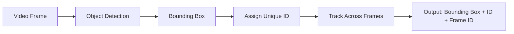
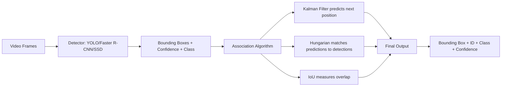
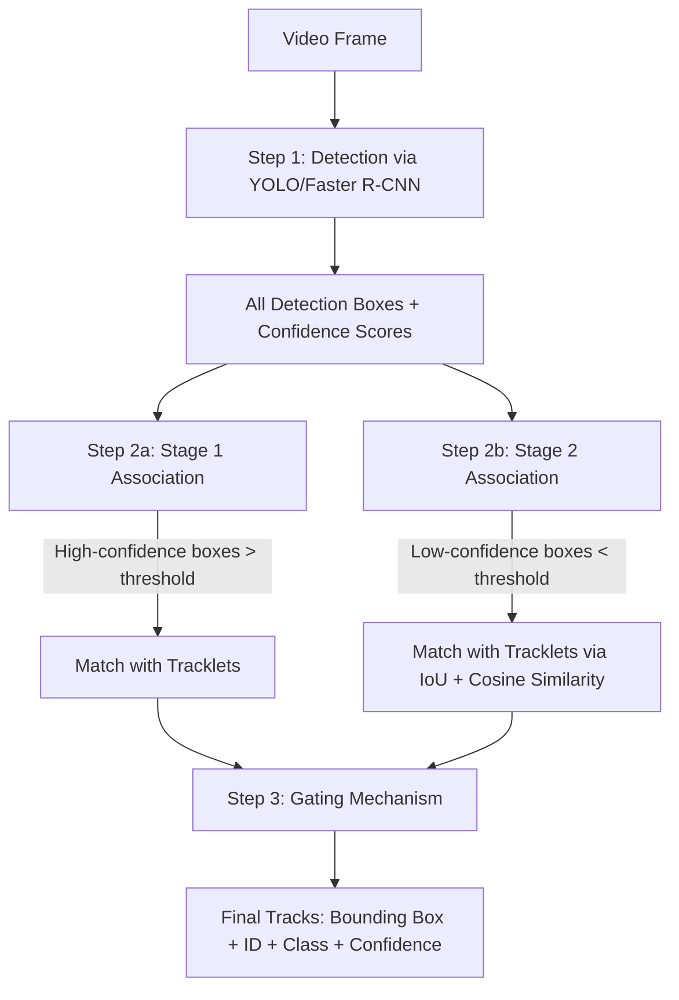
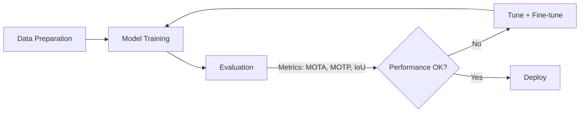

# Lecture 9: Object Tracking

*Instructor: Stephin Rachel Thomas*
*Date: March 26, 2026*

---

## What is Object Tracking?

**Object tracking** is a **deep learning process** where the algorithm tracks the movement of an object. In other words, it is the task of **estimating or predicting the positions and other relevant information of moving objects in a video**.

It is a fundamental task in computer vision, alongside classification and detection. It involves the identification and tracking of an object across video frames. The algorithm identifies the object and then tracks that object across different frames of the video.

### Historical Context: Object Tracking During World War II

During **World War II**, the development of **radar (Radio Detection and Ranging)** revolutionized the ability to detect and track enemy aircraft and ships. This was one of the earliest forms of **automated object tracking**.

### Example Applications
- **Surveillance** for security
- **Traffic monitoring**
- **Sports analytics**, where object tracking supports decision making and provides insights by tracking player movements

---

## The Three Main Steps of Object Tracking

Object tracking is done in three main steps:

1. **Object Detection**: Detect the object present in the image or video. After detection, we get a bounding box around that object. For example, object detection identifies a football in an image and creates a bounding box around the ball.
2. **ID Assignment**: The algorithm assigns a unique ID to the detected object (for example, ID 1 is assigned to that object).
3. **Tracking**: Track the detected object as it moves through frames. A video is made up of multiple frames, and in each frame, this ID or this object is being tracked.

> **Key idea**: Detect the object, assign an ID, then track it across multiple frames of the video.



*(reconstructed diagram)*

---

## Tracking vs. Detection

| Aspect | Object Detection | Object Tracking |
|--------|------------------|-----------------|
| What it does | Tells where exactly the object is present in an image | Estimates or predicts the position of a target object in each consecutive frame |
| Input | Single frame or image | Consecutive frames of a video |
| Handles occlusion | No, only works if target object is visible | Yes, trained to track trajectory despite occlusions |
| Prediction | No prediction, only detection | Can predict position of object in the next frame |
| Scope | Single frame | Multiple frames |

**Key point**: Detection works on images or a single frame. Tracking runs on consecutive frames and can both detect and predict the position of the object in the next frame. If an object is hidden by interference or another object, detection alone cannot identify it in the frame, but tracking is designed to handle such situations.

> **Important nuance**: Object tracking estimates or predicts the position of a target in each consecutive frame **once the initial position of the target object is defined**. Tracking requires an initial seed, detection does not.

---

## Challenges in Object Tracking

The input for tracking is **video**, not just images, so it is more complex than detection. The challenges differ from those in object detection.

### Primary Challenges

1. **Moving objects**: Human motion is sometimes slow and sometimes rapid. Depending on how fast it is, tracking becomes very difficult. For example, people moving very fast in a stadium make it very hard for a computer to keep track of them.
2. **Rapid object movements**
3. **Changes in size (scale variation)**: When an object is closer to the camera, it appears bigger. As it moves farther away, it appears smaller.
4. **Shape changes (deformation)**
5. **Occlusions**: If a person is hidden by another, it is hard to keep tracking them.
6. **Varying lighting conditions**
7. **Real-time processing**: Object tracking needs fast responses for real-time applications, and giving that response with high accuracy is not an easy task.
8. **Identity consistency over time**: As some objects move farther away, the system may lose the ID, and IDs may switch between people walking together.
9. **Crowded scenes**: As objects fade away from the camera, it becomes very hard to keep tracking each of them, especially in a crowded scene.

### Specific Visual Challenges

- **Illumination**: Changes in lighting make it hard to track a person when part of a face is more highlighted than another part.
- **Occlusion**: One person's face is hidden by another, so the system struggles to identify and track that person.
- **Deformation**: The shape of the object is not normal.
- **Noise corruption**: Video is affected by noise.
- **Out-of-plane rotation**: A person or object is rotated out of the camera plane.
- **Motion blurring**: Fast-moving objects have a lot of blur, and it is hard for the system to keep track of each person in the image.

---

## Types of Object Tracking

### Single Object Tracking (SOT)

Focuses on monitoring the movement of a **single object** within the video. Other objects present in the frame are not considered.

**Challenges in SOT**:
- Maintaining the identity of the object despite changing appearance, scale, and occlusion.
- The object can be occluded by another object.
- The object may appear at different scales. For example, when a ball approaches, it appears bigger, and when it moves away, it appears smaller.
- If there are two similar objects (such as two balls), the appearance might not exactly match, so the system has to identify the particular one. Algorithms exist to handle this.

**Techniques range from**:
- Simple bounding box tracking
- More sophisticated methods involving feature extraction, like in CNNs
- Motion prediction

### Multiple Object Tracking (MOT)

Focuses on many objects at the same time, simultaneously tracking multiple objects present in the video. MOT systems simultaneously track several objects, **managing their identities, and understanding interactions among them**. MOT extends the principles of single object tracking to multiple objects.

**Example**: In a video with multiple cars, the system can detect every car present and assign a specific ID to each car.

**Challenges in MOT**:
- Managing identities of similar-looking objects while maintaining a unique ID for each. IDs cannot change or be swapped between objects.
- Particularly challenging in crowded scenes.
- Occlusions where one object is hidden by another.
- Similar appearances: if two similar objects are in the video, it is very challenging for the system to give unique IDs to each.

### Comparison: SOT vs. MOT

| Feature | Single Object Tracking | Multiple Object Tracking |
|---------|------------------------|---------------------------|
| Focus | Only one object | Multiple objects simultaneously |
| Complexity | Lower | Higher |
| Main challenge | Object motion, appearance change | Motion, interactions, identity management, similar appearances |
| Accuracy | Easier to achieve | Achieving 100% accuracy is not simple |
| Algorithms | Simpler | Sophisticated algorithms required |

**Key point**: MOT requires sophisticated algorithms to distinguish and maintain the identity of each object across frames.

> **Shared challenge**: The main challenge with **both** SOT and MOT is managing **object motion and interactions**, especially in MOT where multiple objects interact with each other. At that time, it is very hard for the system to maintain identities. **Similar appearances** are another challenge common to both.

### Complexity Factors in MOT

1. **Dynamic object count**: The number of objects in the video is not constant and dynamically changes. Some people enter the scene, some leave, so the number keeps changing.
2. **Varying object size** and **non-linear motion**: People do not always move in a straight line, they can move in any direction.
3. **Environmental conditions**.
4. **Appearance and disappearance**: The tracker must detect new objects entering the scene and handle objects that disappear.
5. **Reappearance handling**: When an object leaves the scene and reappears, the system should identify that object with the same ID assigned earlier. It should not treat it as a new object.

### Re-Identification (ReID)

**Re-identification (ReID)**: A technique used so that when an object reappears, the same ID is assigned to it. Without ReID, when an object leaves and reappears, it would be treated as a new object, and the continuity of tracking across frames would be lost.

- The system stores information about each object.
- When the object reappears, the system matches it to previously stored data.
- The tracker must handle new object appearances, disappearances, maintain consistent tracking across frames, and ensure accurate identity assignment.
- Three people walking together should not be treated as a single person. The system should assign different IDs to each person even if they walk closely.

---

## Traditional Methods for Object Tracking

Traditional methods helped with object tracking to some extent, but they were not great, so more sophisticated methods were needed.

### Background Subtraction

One traditional approach:

1. Feed the system training frames along with the background.
2. Subtract the background from each frame, leaving only the object.
3. Apply a threshold to produce the output mask.

### Background Subtraction Pipeline (from slides)

```
Input Stream → Background Subtraction (with Background Model) → Threshold → Output Masks
```

*(reconstructed formulation)*

$$\text{Mask}(x, y) = \begin{cases} 1 & \text{if } |I_t(x,y) - B(x,y)| > T \\ 0 & \text{otherwise} \end{cases}$$

where $I_t(x,y)$ is the current frame, $B(x,y)$ is the background model, and $T$ is the threshold.

### Other Traditional Techniques

- **Optical flow**
- **Frame differencing**

### Limitations of Traditional Methods

- Relied on **handcrafted feature extraction** methods.
- Suitable only for scenarios with **limited object movement and minimal occlusion**.
- Struggled in **complex dynamic environments** where the background is changing or the object is moving fast.
- Because of these limits, more advanced tracking methods had to be developed, leading to deep learning techniques for MOT.

*(additional example)* A simple background subtraction in OpenCV:

```python
import cv2

cap = cv2.VideoCapture('video.mp4')
backSub = cv2.createBackgroundSubtractorMOG2()

while True:
    ret, frame = cap.read()
    if not ret:
        break
    fgMask = backSub.apply(frame)
    cv2.imshow('Foreground Mask', fgMask)
    if cv2.waitKey(30) & 0xFF == ord('q'):
        break

cap.release()
cv2.destroyAllWindows()
```

---

## Deep Learning-Based MOT

The advent of deep learning revolutionized MOT by providing **robust feature extraction, object recognition, and motion prediction capabilities**. Deep learning-based trackers use **Convolutional Neural Networks (CNNs)** to automatically learn feature representations directly from data. As a result, trackers become more robust and can still track objects even with occlusion, orientation differences, and lighting variations. These models handle complex object interactions and variations in appearance more effectively than traditional methods.

### Advantages of Deep Learning for MOT

- **Automatic hierarchical feature learning**: CNNs can automatically learn rich features hierarchically, providing superior object recognition and tracking.
- **Scale handling**: Even if the same object appears at different scales in different frames, they can still match it.
- **Partial occlusion handling**: Even with partial occlusion by another object, they can still handle it.
- **Complex motion patterns**: Handled to some extent.
- **Accuracy and robustness**: Deep learning methods give more accurate, robust results than traditional methods.

> **Key takeaway**: With the introduction of CNNs, much better systems were developed that overcome the limitations of traditional methods.

---

## Types of Trackers by Architecture

Beyond SOT vs. MOT, trackers are classified by architecture into **single-stage** and **two-stage** trackers.

### Framework Diagrams (from slides)

**(a) Two-stage MOT framework**:
```
Detection → ReID → features
```

**(b) Classic one-shot (single-stage) MOT framework**:
```
CNN → {Detection head, ReID head}
```

The two-stage framework processes detection and re-identification in sequence. The one-shot framework uses a single CNN backbone that branches into both a detection head and a ReID head.

### Single-Stage Trackers

In a single-stage tracker, a **single stage performs both detection and tracking simultaneously**.

Recall the three main steps of object tracking:
1. Detection
2. Assigning a unique ID
3. Tracking

In a single-stage tracker, detection and tracking both happen together. The CNN takes the input and produces both detection and ID simultaneously. Re-identification also happens: if an object leaves and reappears, it can be given the same ID it had earlier.

**Output**: Bounding box, object ID, and frame ID.

**Advantages**:
- **High speed** since detection and tracking happen simultaneously.
- Useful for **real-time applications**.

**Drawbacks**:
- Accuracy is compromised. Accuracy is not that great in such systems.

**Example**: **DeepSORT**
- Designed for speed and efficiency.
- Output: object class, unique ID, and location of the object in each frame.
- Everything obtained in a **single network pass** (hence single-stage).
- Suitable for real-time tracking.
- Struggles with **small or partially occluded objects**.
- Often requires **fine-tuning** for specific tracking scenarios.

### Two-Stage Trackers

In a two-stage tracker, detection and tracking happen in **two different phases**, not simultaneously.

1. **Stage 1: Detection**: Detect objects in each frame.
2. **Stage 2: Association**: Use those detections to track (associate) objects across frames over time.

**Drawbacks**:
- **Computationally intensive**.
- Not as fast as single-stage trackers because tracking happens after detecting all the objects.

**Advantages**:
- **Higher accuracy** than single-stage trackers.
- Especially useful for **crowded or complex scenes**.
- Even with very crowded input, accuracy is much higher.

**Examples**: **ByteTrack** and **OC-SORT**. ByteTrack was introduced recently.

A two-stage tracker first uses a CNN-based detector to detect objects in each frame, then uses an **association algorithm** to predict the position of the object in the next frame. Techniques include:
- **Kalman filter**
- **Hungarian algorithm**

> **Course note**: Reading material about how the Kalman filter works will be shared, so you can read through it in detail.

### Comparison: Single-Stage vs. Two-Stage

| Feature | Single-Stage | Two-Stage |
|---------|--------------|-----------|
| Workflow | Detection + tracking simultaneously | Detection first, then association |
| Speed | High (real-time friendly) | Slower |
| Accuracy | Lower | Higher |
| Best for | Edge devices, real-time apps | Crowded, complex, occluded scenes |
| Examples | DeepSORT | ByteTrack, OC-SORT |

### Which is Better?

There is **no single correct answer**. It depends on your use case:
- **High speed needed** (for example, edge device applications): use **single-stage**. Edge devices require fast responses and cannot wait.
- **Higher accuracy needed**, can compromise on speed: choose **two-stage MOT trackers**.
- **Crowded environments or occlusion**: **two-stage** MOT trackers are better because they detect objects more accurately in complex scenarios.

> **Course focus**: For this course, we focus mostly on multiple object tracking because most complex scenarios require it. For edge devices, we focus mostly on single-stage trackers. Single object tracking focuses only on a single object, but in most cases, we need to track multiple objects.

---

## Deep Learning Models for Object Detection in MOT

In MOT, deep learning models for object detection play a crucial role. The **first step** of MOT is object detection.

### Common Detectors

- **Faster R-CNN**
- **YOLO**
- **SSD**

These provide robust and accurate object detection.

> **Important**: Carefully select the detection model, because only if you can detect all the objects present in the video frame can you track them. Make sure the object detection model is a good choice. It is the first step in tracking.

### How They Differ

| Detector | Approach |
|----------|----------|
| **Faster R-CNN** | Uses **region proposals** for more accurate localization |
| **YOLO** | Divides the image into grids and predicts bounding boxes and class probabilities directly for each grid, enabling faster processing |
| **SSD** | Predicts bounding boxes and class probabilities directly from the image, enabling faster processing |

The approaches differ, but the idea is that they all perform object detection.

---

## Association Algorithms (Tracking Stage)

After detection, we need **association algorithms** to track objects across frames. If an object is present in one frame but not in the next, we can predict its location in upcoming frames.

In two-stage trackers, after detecting objects, box association algorithms perform the tracking.

### Common Association Techniques

- **Hungarian algorithm**: Matches predictions with detected objects. Given a row of detected objects, it looks for the best match with the prediction from the next frame.
- **Kalman filter**: Predicts the position of the object in the next frame.
- **IoU (Intersection over Union)**: Measures how much a prediction overlaps with the ground truth. The higher the overlap, the better.

$$\text{IoU} = \frac{\text{Area of Overlap}}{\text{Area of Union}}$$

*(reconstructed formula)*

These techniques associate detections across frames based on **spatial and appearance similarities**, using both **appearance and motion cues**. Even with multiple objects, each object is identified and the system checks where it appears in upcoming frames. Based on motion pattern or trajectory, the system predicts where the object will be next.

### Role in Handling Challenges

Association algorithms handle:
- Occlusion
- Updating identity
- Variations across frames

### Pipeline Summary



*(reconstructed pipeline)*

All these algorithms work together to perform association. After detection, we have association. Finally, we get better detections with **bounding box coordinates, ID, class, and confidence score**.

---

## ByteTrack in Detail

> **Course note**: You can use ByteTrack for your project if you want.

**ByteTrack** stands out as a unique, innovative approach in MOT. It is one of the popular two-stage trackers. It is designed to handle complex scenarios with high accuracy, even occlusion or crowded scenes, while maintaining real-time performance. It is not as fast as single-stage trackers, but it maintains real-time performance.

### Key Features

- Combines a **high-performance detector** (like YOLO) with the **ByteTrack association algorithm**.
- Manages object identities even in crowded scenes.
- Handles occlusion and crowded input video to some extent.
- Demonstrated remarkable results in tracking multiple objects in challenging environments.

### What Makes ByteTrack Unique

ByteTrack is a multiple object tracking algorithm that enhances tracking accuracy by **associating every detection box, including those with low detection scores**. It considers both high-confidence and low-confidence detection boxes.

### Step 1: Object Detection

ByteTrack takes each video frame and uses a detection model like **YOLO** or **Faster R-CNN** to detect objects.

**Output**: Bounding boxes with associated confidence scores, coordinates, and class labels.

### Step 2: Data Association (the core of ByteTrack)

This is where tracking happens. Detected objects are associated across frames. Data association uses **two stages**.

#### Stage 1: High-Confidence Detections

- Focus on **high-confidence detection boxes** above a certain threshold (for example, 0.5). The threshold depends on the application and is configurable.
- Match these boxes with existing **tracklets**.

**Tracklets**: Short sequences of frames where an object has been consistently detected. The coordinates of this object across all these frames are known.

- **Advantage**: Match the most reliable detections to the right tracklets.

#### Stage 2: Low-Confidence Detections

- Focus on **low-confidence detection boxes** below the threshold.
- Give importance to low-confidence boxes.
- **Purpose**: Recover true objects that might have been missed in stage 1. Ensure important objects are not missed.
- Matched with tracklets based on **similarity**:
  - **IoU (Intersection over Union)**
  - **Appearance features**, using **cosine similarity** from deep learning.

$$\text{cosine similarity} = \frac{\mathbf{a} \cdot \mathbf{b}}{\|\mathbf{a}\| \|\mathbf{b}\|}$$

*(reconstructed formula for appearance similarity)*

> **Key takeaway**: Data association happens in two stages. Stage 1 focuses on high-confidence boxes. Stage 2 focuses on low-confidence boxes. This ensures that important objects are not missed.

### Step 3: Gating Mechanism

After detection and association, the **gating mechanism filters out redundant or duplicate detections**, ensuring only relevant detections are considered for tracking. This is the stage where redundant detections are filtered out.

### ByteTrack Pipeline



*(reconstructed pipeline)*

### Performance

By considering all detections, ByteTrack achieves **high tracking accuracy and robustness** because all relevant objects are detected. It is useful for applications like surveillance, autonomous driving, and sports analytics.

ByteTrack's methodology combines deep learning-based detection (using YOLO or Faster R-CNN) with an **efficient association strategy**. It leverages the strength of YOLO as a detector plus an innovative association that is fast and robust.

In the example frame, tracklets are first identified from high-confidence detection boxes (ignoring low-confidence ones temporarily). In the next stage, low-confidence detections are added so that all relevant objects are covered.

In performance evaluations, ByteTrack has demonstrated **superior tracking accuracy** compared to other models and outperforms many existing methods on **standard MOT benchmarks**.

### ByteTrack Frame-by-Frame Visualization (from slides)

Across consecutive frames ($t_1 \rightarrow t_2 \rightarrow t_3$):

| Step | Description |
|------|-------------|
| **(a)** | Detection boxes produced with confidence scores for each frame |
| **(b)** | Tracklets formed by associating high-score detection boxes across frames |
| **(c)** | Refined tracklets after the second-stage low-score association recovers missed objects |

*(additional example)* Basic ByteTrack usage with a YOLO detector:

```python
from ultralytics import YOLO

model = YOLO('yolov8n.pt')
results = model.track(source='video.mp4', tracker='bytetrack.yaml', show=True)

for result in results:
    boxes = result.boxes
    for box in boxes:
        track_id = int(box.id) if box.id is not None else -1
        cls = int(box.cls)
        conf = float(box.conf)
        xyxy = box.xyxy.tolist()
        print(f"ID: {track_id}, Class: {cls}, Conf: {conf:.2f}, BBox: {xyxy}")
```

---

## Application Scenarios for MOT

MOT has a wide range of applications:

1. **Urban traffic management**: Vehicle and pedestrian tracking for safety and flow optimization. Can be used in **autonomous vehicles**.
2. **Retail**: Analyze customer behavior and store traffic.
   - **COVID example**: Stores allowed only a specific number of people inside, so by tracking people entering and leaving, they counted the number of people inside and let people in accordingly.
3. **Sports analytics**: Used in competitions to track player movements and the movement of the ball or target.
4. **Surveillance systems**: Monitoring and security.
5. **Other real-world applications**: Real-time traffic management, border checks, subways.

---

## Current Challenges and Limitations

Despite advancements in MOT with sophisticated algorithms like ByteTrack, YOLO, and combinations of techniques, MOT still faces challenges.

- **Dense crowds and frequent occlusions**: Still a challenge. Although MOT handles them to some extent, dynamic environments with heavy crowds and occlusion remain hard.
- **Differentiating similar-looking objects**: When two objects look like the same person, the system struggles to distinguish them.
- **Accurate long-term tracking**: Objects may come in, leave, and reappear. This is why **re-identification** is useful: when an object reappears, it should be identified with the same ID as before, not as a new object.
- **Computational demands**: Processing high-resolution videos is significant. The input is video, not images. With HD or high-resolution video, significant computational capacity is needed for real-time processing.
- **Diverse datasets**: Unlike image data, video data, especially with annotations, is not easily available. For **supervised learning**, annotated datasets are needed where each object in the video is labeled for training. Providing such annotated datasets, and diverse data, is a challenge.

> **Key takeaway**: Addressing these challenges is crucial for progress in MOT technologies, especially with video, where significant computational capacity is needed.

---

## Future Trends

- **Integration with other AI technologies** like deep learning and **reinforcement learning** for more sophisticated tracking.
- **Low-latency, high-accuracy models** suitable for **edge computing**. Systems must be both fast and accurate, without compromising one for the other.
- **Semi-supervised and unsupervised learning** techniques to reduce dependency on large annotated datasets, since providing annotated data is not easy.
- **Integration with drones and autonomous vehicles**: This is already happening and is a key area for future development.

---

## Tools for MOT Development

### Deep Learning Backbones for Object Detection

- **TensorFlow**
- **PyTorch**

Both offer extensive libraries and functionalities for detectors.

### Tracking Toolkits

- **DeepSORT**
- **FairMOT**

These toolkits provide pre-built tracking models and algorithms.

### Data Annotation Tools

- **CVAT**
- **LabelBox**

Essential for preparing training datasets with accurate bounding box annotations.

### Evaluation and Benchmarking

- **MOTChallenge**
- **VOT (Visual Object Tracking)**

Popular platforms offering datasets and metrics to assess tracker performance.

### Other Tools

- **NVIDIA DeepStream**: Used for real-time streaming analytics.
- **OpenCV**: Used for general computer vision tasks and can be integrated into MOT systems for pre-processing and feature extraction. Data can be prepared using OpenCV or other tools.

> **Course note**: You have used OpenCV in your lab.

---

## Hands-On Techniques for MOT

### Step 1: Data Preparation

A critical step in MOT, as in any machine learning task for classification, detection, or tracking. Without good data, accuracy will not be high.

- **Collecting and annotating video data**: Ensure a variety of scenarios and object types are represented. A diverse dataset representing different real-world situations is needed so the model can handle real-world conditions.
- **Unbiased data**: If biased data is fed, the model behaves accordingly and will not react correctly in other scenarios. Always have a diverse, unbiased dataset for training.
- **Data augmentation**: Expand the dataset with techniques like:
  - Random cropping
  - Scaling
  - Flipping vertically or horizontally
  - As seen earlier, from a single image of a cat, hundreds of images can be generated by resizing, cropping, or flipping vertically or horizontally. The same applies to object tracking.
- **Preprocessing**: Includes normalization and format conversion. Sometimes format conversion is needed to match the format expected by the model. These are essential for preparing data for deep learning models.

### Step 2: Model Training

Once data is prepared, model training is the next step.

- **Select the right architecture**:
  - For **single-stage trackers**: select the right architecture for the end-to-end tracker.
  - For **two-stage trackers**: select the best object detector (for example, YOLO or Faster R-CNN).
- **Hyperparameter tuning**: Critical for optimal performance. Hyperparameters include:
  - Learning rate
  - Batch size
  - Number of epochs

  Set them initially, then tune them.

- **Transfer learning**:
  - Many algorithms already exist in this area, so you can transfer from those established models and adapt them to your application.
  - Using pre-trained models significantly improves training efficiency and accuracy, especially with limited data.
  - A large dataset is not required to train your model if you use a pre-trained model that was trained on many different scenarios. That knowledge can be transferred to your application.
  - For **two-stage trackers**, hyperparameters must also be tuned for **box association**. Tuning happens in both detection and association.

### Step 3: Evaluation and Tuning

The last step. You cannot simply develop a system and trust it. You need to make sure it performs well on real-world inputs.

**Metrics for evaluating MOT models**:

| Metric | Meaning |
|--------|---------|
| **MOTA** | Multiple Object Tracking Accuracy |
| **MOTP** | Multiple Object Tracking Precision |
| **IoU** | Intersection over Union |

These metrics help measure the performance of your MOT model.

- **Cross-validation** and **analyzing failure cases**: Important. Learn from failure cases to understand model performance and further tune the model.
- **Continuous tuning**: Based on results, keep tuning and updating the model. When encountering new scenarios or new data, fine-tune the system for a more robust solution.

### Overall Workflow



*(reconstructed workflow)*

---

## Conclusion

Multiple Object Tracking remains a **dynamic and challenging field in computer vision**, with significant advancements driven by deep learning. The future of MOT includes further integration with AI, improvement in real-time tracking capabilities, and broader applications across various industries.

- **Object tracking** tracks objects across consecutive frames of the video.
- Two types by target count:
  - **Single object tracking**: Focuses on only one object.
  - **Multiple object tracking**: Tracks multiple objects simultaneously.
- Two types by architecture:
  - **Single-stage**: Detection and tracking happen simultaneously.
  - **Two-stage**: Detection first, then tracking. Two different phases.
- **Traditional methods** like background subtraction were not that great, so better methods were needed.
- **CNN-based networks** learn patterns from data and handle complexities like orientation variations and difficult scenarios to some extent.
- **ByteTrack** is an example of a two-stage tracker. It uses a deep learning detection model and a tracking algorithm that considers **both low-confidence and high-confidence detection boxes** to associate detected objects across multiple frames.
- Tools for MOT development and evaluation metrics have been covered.
- Ongoing research and development continue to push the boundaries, paving the way for innovative applications.

---

## Project Notes

> **Course note**: For your project, if you are not going with option A and you are choosing your own project, make sure you include **tracking**, with **video as the input**. Do not do only classification or object detection, because that is too simple for this project. You have already done classification and detection, so you need to go beyond that. Use video and do some real-time tracking. For the demo, you can show the system tracking a person or object in the room.

---

## Next Week's Topics

- What are sensors?
- Different types of sensors
- Sensor Fusion
