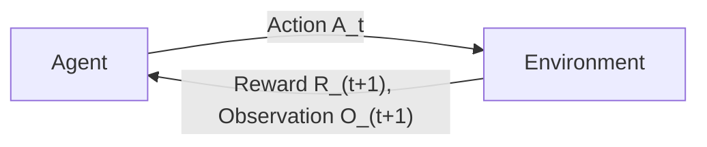

# Lecture 1: Introduction to Reinforcement Learning

## Core RL Concepts Overview

This lecture introduces five key reinforcement learning (RL) terms that form the foundation of the course:

1. **Agent & Environment**
2. **Reward**
3. **Policy**
4. **Value Function** (two kinds: V and Q)
5. **Model**

> **Exam note**: You will need to draw the Agent-Environment interaction diagram on a midterm or final. It appears in the textbook and the slides.

---

## The Agent-Environment Interaction

### The Fundamental Distinction

In reinforcement learning there is always an **agent-environment distinction**. The agent is not part of the environment. It is separate from the environment in our model.

### The Interaction Loop

The agent-environment interaction follows a repeating cycle:

1. The agent is in some **state** (or receives an **observation**) at time $t$.
2. The agent selects an **action** $A_t$ to perform on the environment.
3. The environment responds with a **new observation** $O_{t+1}$ (new state) and a **reward** $R_{t+1}$.
4. This new observation and reward become the input for the next time step $t+1$.
5. The cycle repeats: $t \to t+1 \to t+2 \to t+3 \to \ldots$


*(reconstructed diagram)*

> **Key point**: The RL algorithm operates **inside the agent**. The environment is external.

**Floor world example**: Imagine the floor is the environment and you are the agent. You might perform the action of stepping forward. Now you are in a new state on the floor and you receive a reward. You take another step, get another state and reward, and so on.

### Episodes, Not Epochs

- One full run of this cycle is called an **episode**.
- We do **not** call it an epoch. That would be wrong. An epoch is a term from supervised learning. In RL we use "episode."
- An episode runs until **termination**, but it does not have to terminate. It can go on forever.

**Thermostat example**: A thermostat is a simple RL problem. When the temperature is below the set point (e.g. 70°F / 21°C), it turns on the heat. When the temperature rises above it, it turns off the heat. A thermostat never says "I'm finished." It goes on forever, until you demolish the building or unplug it. There is nothing wrong with an episode that lasts forever. This is one reason we will need a **discount factor** (covered later).

### Multiple Agents

Having multiple agents in one environment that interact with each other is possible in theory, but more complicated. The other agents effectively become part of the environment. For this course, we keep it simple: **one agent, one environment**.

### Observation vs. State

- The **environment state** contains everything going on in the environment.
- The **observation** (or agent state) is only the part visible to the agent.
- Some things in the environment may not be available to the agent at all.
- For now, we can treat the observation as the state.

**Floor analogy**: When walking on a tiled floor, the agent can see its position (the tiles), but not the concrete underneath. Maybe the concrete weakens as you step, but the agent is unaware of that hidden part of the environment state.

---

## Reward

### Definition

**Reward ($R_t$)**: A **scalar** number the agent receives after performing a single action at time step $t$.

Key properties:
- It is a **scalar**, not a vector. All competing factors in a decision get distilled into a single number.
- It can be **negative**. Negative rewards are very useful for situations where you want the agent to accomplish something in the fewest steps or shortest time, because the agent will optimize to minimize total negative reward (i.e., the shortest sequence of actions).
- At each time step there is a reward that indicates how well the agent is doing.

**Dinner vs. studying example**: If you are deciding between going out for dinner with your spouse or staying home to study, each choice yields a different reward. But it is a scalar value, not a vector like (−1 for not going out, +1 for studying). Everything is distilled into one single number. In the human analogy, the scalar reward is like your feeling of well being, the dopamine in your brain that makes you feel good.

### Reward vs. Value (Key Distinction)

| | Reward | Value |
|---|---|---|
| **What it represents** | What you get from a **single action** | Expected **cumulative total reward** from current state to the end |
| **Type** | Scalar, received at one time step | Function of state (or state and action) |
| **Scope** | Immediate | Forward looking |

**Investment analogy**: When you invest money, the first action is a big penalty (you give money away, so your bank account drops). That is a large negative immediate reward. But later, you get even more money back. In the end, it was worth it to undergo that temporary pain because the total cumulative reward is higher. So being in a "high value state" does not mean every immediate reward will be positive. You may accept short term penalties for long term gain.

### The Reward Hypothesis

> **Reward Hypothesis**: All goals can be described by the maximization of expected cumulative reward.

- It says "expected" because in general, probabilities may be involved. In the deterministic case, it simply becomes maximization of cumulative reward.
- This is a **hypothesis**, never proven or disproven, but it is central to RL: we are always trying to maximize reward.
- The reward can be received **along the way** (at every step) or it might come **at the end** of the episode.

> **Exam note**: You might be asked about the reward hypothesis on a test, possibly as a multiple choice question or a written answer.

**"Letting the child win" counterargument**: If you are playing chess with a child, you might let them win. This seems to contradict reward maximization, but it does not. Your goal in that scenario is to let the child win, so you receive high reward for achieving that goal. The reward does not need to correspond exactly to a game score.

**Reward hacking**: In practice, there are issues like **reward hacking**, where the agent figures out how to increase its reward without actually advancing in the task (e.g., exploiting a bug in a video game's scoring). This means whoever set up the RL problem didn't think carefully enough about the reward structure. It does not disprove the hypothesis. It just means the reward was poorly designed.

### Negative Rewards and Shortest Paths

- The reward does not have to be positive.
- If you want the shortest path (to save time, gasoline, etc.), the reward per step is typically negative (e.g., $-1$ per step).
- The agent's goal becomes minimizing total negative reward, which is equivalent to taking the fewest steps.
- The agent may need to accept small negative rewards in the short term to maximize total reward.

> **Course note**: In Lab 1 (Q-learning lab), the reward is already chosen for you (minus one per step). In the Cliff Walking problem, the reward is also dictated. You don't have to design the reward yourself for Lab 1.

### Planning Without Knowing All Rewards

In general RL, the agent does **not** know the full dynamics of the environment in advance. It has to learn by interacting with the environment. Dynamic programming is a family of algorithms for policy improvement that specifically requires knowing the whole environment and all rewards. But in methods like Q-learning, the agent starts knowing nothing and learns through experience.

> **Course note**: Dynamic programming will be covered later in the course.

---

## Policy

### Definition

**Policy ($\pi$)**: A function that maps states to actions. It tells the agent what action to take in each state.

**Deterministic case** (the focus of this course):

$$\pi(s) = a$$

Given state $s$, the policy outputs a specific action $a$.

**General (stochastic) case**: The policy gives a **probability distribution** over actions:

$$\pi(a \mid s) = P(A_t = a \mid S_t = s)$$

For example, when in state $s$: do action $a_1$ 20% of the time, do action $a_2$ 80% of the time. Like all probability distributions, the probabilities must sum to one.

In this course, we mostly deal with the deterministic case because it is easier to understand: plug in a state, get an action.

### Floor World Example

Suppose the agent is on a floor and can perform three actions: turn right, turn left, or step forward.

- **A simple (non-optimal) policy**: always step forward, no matter what state you are in.
  - The agent steps forward into a new state, then steps forward again, and again.
  - When it reaches the wall (the end of the grid world), stepping forward no longer changes the state. But the policy still says "step forward," so the agent keeps trying and the state never changes.
  - This episode goes on forever. That is not a problem for RL. The thermostat goes on forever too.
  - This policy is clearly not optimal because it does not maximize reward.

> An episode can keep going even if the state stops changing. The state not changing does not mean the episode ends. An episode lasting forever does not mean RL is broken.

---

## Value Function

### Definition

**Value function**: Tells you how good it is to be in a given state. It is the **expected cumulative total reward** from the current state to the end of the episode.

$$V(s) = \mathbb{E}\left[\sum_{k=0}^{\infty} \gamma^k R_{t+k+1} \mid S_t = s \right]$$
*(reconstructed, formal definition with discount factor $\gamma$)*

In the deterministic simplification used in this course: the value of being in state $s$ is simply the total reward you will accumulate from $s$ to the end of the episode.

If the episode never ends, the total reward could be infinite, which is a problem. The solution is the **discount factor** $\gamma$ (covered later).

### Nondeterministic Complexity

In the nondeterministic case, the expressions look much more complex because:
1. There are **probabilities of different actions** happening.
2. Given a specific action, there is a **probability distribution over resulting states**.

In the deterministic case (our focus), performing the same action in the same state always leads to the same next state.

### Two Types of Value Function

| | State Value Function $V(s)$ | Action Value Function $Q(s, a)$ |
|---|---|---|
| **Input** | State only | State **and** action |
| **Question it answers** | "I'm in state $s$. What's my expected total future reward?" | "I'm in state $s$ and I take action $a$. What's my expected total future reward?" |
| **Notation** | $V(s)$ or $V^\pi(s)$ for a specific policy $\pi$ | $Q(s, a)$ or $Q^\pi(s, a)$ for a specific policy $\pi$ |

- $V$ does not specify which action gets taken.
- $Q$ specifies both the state and the action.

> **Key insight**: The value function depends on which policy is being followed. A different policy implies different values for the same states. This is why we write $V^\pi(s)$ with the policy $\pi$ as a superscript.

### Value Function and Policy Interaction

The value function and the policy interact with each other:
- If you change the policy, the values of the states change.
- If you know the values, you can improve the policy.

**Atari example**: When DeepMind's agent plays Atari games, the value goes up and down rapidly as the game proceeds, even though it is collecting rewards. This is because value represents the expected **future** reward from the current state. If something good is about to happen, the value is elevated. After that good thing happens, the reward is now "behind you," and the value may drop. So the value function can oscillate.

> The value function gives you the total expected reward going forward, **not counting** whatever reward was accumulated before the current state.

---

## Model

### Definition

**Model**: A representation of the environment that the agent can use to reason and make predictions. In the context of RL, a model is something inside the agent that it can use for **planning**.

Examples of models from previous courses (CST8503, Knowledge Representation):
- Blocks World
- Coffee kitchen world
- Monkey and Bananas World

### Model in RL Context

When we talk about a "model" in RL, we mean the agent has some internal representation it can use to:
- Predict what will happen if it takes a certain action.
- Figure out what action to do next without actually performing actions in the real environment.

This is fundamentally different from randomly trying actions and seeing what happens.

**Blocks World example**: The agent uses a Prolog model of the Blocks World environment. The agent can do planning using Prolog's logical inference to figure out what sequence of actions will achieve the goal, rather than blindly trying random actions.

> **Course note**: We are going to train a robot to stack blocks using a Blocks World model from last semester, turning that model into an RL environment.

### Models and Planning

If you have a model of the environment, you can use it for **planning**: reasoning ahead of time about the consequences of actions.

> **From Sutton, p. 7**: "Models are used for planning, by which we mean any way of deciding on a course of action by considering possible future situations before they are actually experienced."

There are two kinds of model (from David Silver's lecture):
- **Transition model**: Predicts the **next state** given the current state and action.
- **Reward model**: Predicts the **next reward** given the current state and action.

Not all RL problems include a model. For example, in the grid worlds used in Lab 1 (Q-learning), there is no model. The agent has no way of predicting what the environment will do. It must actually perform actions and learn from the responses.

---

## Goal of Reinforcement Learning

The goal is for the agent to **learn a policy that maximizes the cumulative reward**. Not to reach a specific state per se, but to maximize reward. A terminal state (like a finish line) is just a means to that end: the assumption is that reaching it quickly yields a high reward.

---

## Reinforcement Learning as the Third Type of Machine Learning

RL is the **third type of machine learning**, alongside supervised and unsupervised learning.

| | Supervised Learning | Unsupervised Learning | Reinforcement Learning |
|---|---|---|---|
| **Data** | Labelled | Unlabelled | No labels. Scalar reward + sequence of observations |
| **Feedback** | Correct answer provided | No feedback | Scalar reward signal (delayed, sparse) |
| **Goal** | Learn input-output mapping | Find structure | Learn a policy that maximizes cumulative reward |

RL is **not** the same as supervised or unsupervised learning. There are no labels on data. It is just a stream of observations and scalar rewards, and the agent uses RL algorithms to learn how to achieve its goals efficiently.

### Markov Decision Process (MDP) Foundation

RL is based on the **Markov Decision Process (MDP)**.

David Silver's lecture series builds MDPs step by step:
1. **Markov Chains**: chains of states
2. **Markov Reward Processes (MRP)**: Markov chains + rewards
3. **Markov Decision Processes (MDP)**: MRP + actions

All situations that we look at in this course are going to be MDPs. The reason we can say this with confidence will become clear when we look at the definition of MDP.

> **Course note**: David Silver gives an entire lecture (Lecture 2 in his series) on MDPs. If you are really interested in MDPs, refer to that lecture. We will not go through MDPs in the same depth he does. We will look for the intuition rather than doing all the detailed math.

---

## History, State, and the Markov Property

### History

**History ($H_t$)**: The complete sequence of observations, rewards, and actions up to time step $t$.

$$H_t = R_1, O_1, A_1, R_2, O_2, A_2, \ldots, R_t, O_t, A_t$$
*(from slides)*

The time series of rewards, observations, and actions is the **data** for reinforcement learning. The agent picks the next action based on the information contained in the history. Processing the whole history is cumbersome, so we use the concept of **state** as a more compact summary.

### State as a Function of History

**State ($S_t$)**: A summary of the information from the history that is used to determine what happens next.

$$S_t = f(H_t)$$

The state is a function of the history. The practitioner decides what that function is, i.e., what information to include in the state.

### Environment State vs. Agent State

- **Environment state ($S_t^e$)**: Everything going on in the environment. It is whatever information is used internally to determine the next observation and reward. Not usually directly accessible by the agent.
- **Agent state ($S_t^a$)**: The part of the environment that the agent can see and keeps track of. It is used to select the next action. The programmer decides the function: $S_t^a = f(H_t)$ for some function $f$ of the programmer's choosing.

### The Markov Property

**Markov Property**: The probability of each possible next state and reward depends **only on the immediately preceding state and action**, not on any earlier history.

$$P(S_{t+1}, R_{t+1} \mid S_t, A_t) = P(S_{t+1}, R_{t+1} \mid S_1, A_1, S_2, A_2, \ldots, S_t, A_t)$$
*(reconstructed)*

Intuitively: **the future depends only on the present, not on the past**. If you know the current state, you have all the information you need. You do not need to look further back.

### Constant Velocity Particle Example

Consider a particle moving at constant velocity.

- **State = position only**: Is this Markov? **No.** If all you know is the position at time $t$, you cannot predict the position at $t+1$ because you don't know the direction or speed. You would have to look into the past (multiple previous positions) to figure out the trajectory, which breaks the Markov property.
- **State = position + velocity**: Is this Markov? **Yes.** If you know both position and velocity (speed and direction), you can predict exactly where the particle will be next. No need to look at any prior history.

> **Key takeaway**: What constitutes a Markov state depends on how you define the state. The practitioner chooses the state representation to ensure the Markov property holds.

### DeepMind Atari Example

DeepMind trained an RL agent to play Atari video games better than any human. The critical design question: what is the state?

- A video game runs at approximately **60 frames per second**.
- **One frame alone is not Markov**: Consider a shooting game where a target is moving across the screen and you have a gun to aim and shoot. A single frame shows the target's position but not its direction or speed. You cannot predict the future from one frame alone (just like the particle with position only).
- **Solution**: Use the **last four frames** as the state. This sliding window of four frames captures enough motion information (position and implied velocity) to satisfy the Markov property.
- With 60 fps and groups of 4 frames, the agent processes **15 states per second (15 Hz)**. This means the agent's effective reaction time is $\frac{1}{15}$ of a second.
- Training took approximately **3 to 4 days per game**.

*(additional example)*: Consider a game of Pong. A single frame shows the ball at position $(x, y)$, but you don't know which direction it is moving. With four consecutive frames, you can infer direction and speed, making the state Markov.

### The Whole History Is Always Markov

In the worst case, we could define the state to be the **entire history** of everything the agent has seen. This is always Markov, since it contains all information. However, this is not desirable because it is not manageable or efficient. The goal is to find a **compact state representation** that is still Markov.

Mathematically, if we define $S_t = H_t$, then $f(H_t) = H_t$. The function of the history is the history itself. This is a fixed point. It works, but we want something more efficient.

> **Key takeaway**: The programmer decides what the state is. It is a design choice, not something you derive from the math. You should choose the smallest, most efficient representation that still satisfies the Markov property.

> **From slides**: The environment state $S_t^e$ is always Markov. The full history $H_t$ is always Markov. It is always possible to come up with a Markov state, but we want to identify Markov states that are efficient and have less redundancy.

### Helicopter Markov State (from slides)

A more complex example of choosing a Markov state: for a helicopter, the state must include **position, velocity, angular velocity, angular position, and wind velocity**. All of these components together form a Markov state. Any subset would be insufficient.

### Rat Example (from David Silver's Lecture)

A rat receives a sequence of stimuli:
- **Sequence 1**: Light, Light, Lever, Bell → Electrocuted
- **Sequence 2**: Bell, Light, Lever, Lever → Cheese
- **Sequence 3**: Light, Lever, Light → ???

Is the outcome cheese or electrocution? The answer depends on how you define the state:
- If the state is **only the last stimulus** (Light): the rat was electrocuted after Light in Sequence 1, so the prediction would be electrocution.
- If the state is the **full sequence of stimuli**: the answer could be different because the full sequences don't match.

This illustrates that choosing the state is up to the RL practitioner. It is situation dependent. Depending on the choice of $f(H_t)$, the answer could be electrocution, cheese, or **unknown**.

---

## Agent Components

An RL agent may include one or more of:

1. **Policy** ($\pi$): maps states to actions
2. **Value function** ($V$ or $Q$): estimates expected future reward
3. **Model**: internal representation of the environment for planning

These components interact: a different policy implies different state values, and knowing state values can be used to improve the policy.

### Taxonomy of Agent Types

| Agent Type | Policy | Value Function | Model |
|---|---|---|---|
| **Value based** | No explicit policy | Yes | Maybe |
| **Policy based** | Yes | No | Maybe |
| **Actor Critic** | Yes (actor) | Yes (critic) | Maybe |
| **Model free** | Maybe | Maybe | No |
| **Model based** | Maybe | Maybe | Yes |

- **Value based**: The agent chooses actions based solely on the value function.
- **Policy based**: The agent chooses actions based solely on the policy, never consulting a value function.
- **Actor Critic**: The policy (actor) picks actions, and the value function (critic) evaluates whether those actions are good.
- **Model free**: The agent has a policy and/or value function, but no internal model of the environment.
- **Model based**: The agent has an internal model it can use for planning.

---

## Learning vs. Planning

- **Planning**: You already have a model of the environment (e.g., a Prolog Blocks World). You use it to reason about the best actions without interacting with the real environment. No learning is needed because you, the human, wrote down the model.
- **Learning**: The agent does not have a model. It must interact with the environment, observe rewards, and gradually improve its policy through experience.

---

## Exploration vs. Exploitation

**Exploitation**: Always choose the action you currently believe is best (e.g., always going to your favourite restaurant because it is good).

**Exploration**: Sometimes choose a different, possibly suboptimal action to discover whether something better exists (e.g., randomly trying a new restaurant. It might be better, it might be worse, but you learn something new).

RL algorithms must balance exploration and exploitation. Too much exploitation means the agent may never discover a better strategy. Too much exploration means the agent wastes time on suboptimal actions.

---

## Prediction vs. Control

| | Prediction | Control |
|---|---|---|
| **Goal** | Evaluate future reward (estimate the value function for a given policy) | Optimize the policy to increase reward |

---

## Q-Learning Preview

> **Q&A: Q-learning is one specific RL algorithm.** Reinforcement learning is the broader framework: anytime you have the agent-environment loop following a Markov decision process (agent performs an action, environment responds with a scalar reward and an observation). Q-learning is one of many solutions within that framework.

> **Course note**: In David Silver's course, Q-learning begins in **Lecture 6**. He takes six lectures to build up all the math behind it. This course jumps directly to Q-learning.

### What is Q-Learning?

**Q-learning**: The process of learning the **action value function** $Q(s, a)$, specifically the **optimal** action value function $Q^{*}(s, a)$.

- $Q^{*}(s, a)$ is the value function when the agent follows the **optimal policy** $\pi^{*}$.
- The star ($*$) means optimized: the value function is as good as it can get.
- The Q value depends on what policy you are following. Under the optimal policy, you get $Q^{*}$.

### The Bellman Equation

The **Bellman equation** is used to update the Q function table. It is the mathematical foundation behind Q-learning.

For the optimal action value function: *(reconstructed)*

$$Q^{*}(s, a) = \mathbb{E}\left[R_{t+1} + \gamma \max_{a'} Q^{*}(S_{t+1}, a') \mid S_t = s, A_t = a\right]$$

This says: the optimal Q value for taking action $a$ in state $s$ equals the expected immediate reward $R_{t+1}$ plus the discounted value of the best possible action from the next state.

> **Course note**: You have already used the Bellman equation in Lab 1.

### Q-Table and Grid Worlds

**Grid worlds** are convenient because all states are explicitly laid out. For example, a 4×5 grid world has 20 states. The agent moves from square to square, typically up, down, left, or right (no diagonal moves).

The **Q-table** stores the learned $Q(s, a)$ values:
- For each state, there is a row of values for each possible action (up, down, left, right).
- This results in a **3-dimensional array** in Python: the grid dimensions (rows × columns) plus one layer per action (4 actions).

**Example structure for a 4×5 grid with 4 actions:** *(reconstructed)*

```python
import numpy as np

# Q-table: rows x columns x actions
# 4 rows, 5 columns, 4 actions (up, down, left, right)
Q = np.zeros((4, 5, 4))

# Accessing Q-value for state at row 2, col 3, action "up" (index 0)
q_value = Q[2, 3, 0]
```

---

## Key People in Reinforcement Learning

| Person | Role |
|---|---|
| **Richard Sutton** | "Godfather" of RL. University of Alberta. Co-founder of the Edmonton office of DeepMind. Co-author of the standard RL textbook. |
| **Andrew Barto** | University of Massachusetts at Amherst. Sutton's PhD advisor. Co-author of the standard RL textbook. |
| **David Silver** | University of Alberta PhD graduate, now at Google DeepMind and University College London. Created a free RL lecture series (10 lectures). Led the AlphaGo project. |
| **Demis Hassabis** | Co-founder of DeepMind. David Silver's boss. Prominent in RL and AI. |
| **Fan Hui** | European Go champion. First professional player to lose to AlphaGo. Appears in the AlphaGo documentary before the Lee Sedol match. |

> When studying RL via YouTube videos or other resources, content from Sutton, Silver, or Hassabis can be trusted as authoritative.

### David Silver's RL Course

David Silver offers a free 10 lecture RL course online. The lectures cover:
1. Introduction to RL
2. Markov Decision Processes (detailed)
3. Planning by Dynamic Programming
4. Model-Free Prediction
5. Model-Free Control
6. Value Function Approximation (Q-learning starts here)
7. Policy Gradient Methods
8. Integrating Learning and Planning
9. Exploration and Exploitation
10. Classic Games (Case Study)

*(reconstructed from lecture references)*

---

## RL Across Disciplines

Reinforcement learning spans many fields of human endeavour. Each discipline uses different terminology for what is essentially the same framework:

| Discipline | What They Call It |
|---|---|
| **Engineering** | Optimal control |
| **Computer Science** | Reinforcement learning (one of three forms of ML) |
| **Neuroscience** | Reward system |
| **Psychology** | Classical conditioning |
| **Economics** | Bounded rationality |
| **Mathematics** | Operations research |

RL can be applied to almost anything, including **protein folding**, financial optimization, and game playing.

---

## Real World RL Examples

### Stanford Helicopter

A radio controlled helicopter was trained with RL at Stanford:
- Training was done **offline in a simulator** using a physics based model of the helicopter world (wind speed, gravity, momentum, etc.).
- The helicopter learned to take off, fly, and perform fancy manoeuvres like a tic-toc flip (flipping onto its back).
- The model was not logic based like Prolog models. It was a physics based simulation.

### AlphaGo

- **AlphaGo** is a computer program developed by DeepMind that used RL (among other techniques) to play the board game **Go**.- The AlphaGo documentary begins with **Demis Hassabis** (co-founder of DeepMind). After **Fan Hui** (the European Go champion whom AlphaGo defeated first), we see **David Silver**.- **Go** is played on a **19×19 board** where two players (black and white) place stones, trying to encircle the opponent's stones.
- AlphaGo played a famous match against **Lee Sedol**, one of the top Go players in the world. A Chinese player was rated even higher than Lee Sedol, but the documented match against Lee Sedol (shown at approximately the 30 minute mark in the free AlphaGo documentary on YouTube) was a landmark moment for AI.

> **Recommended viewing**: The AlphaGo documentary is available free on YouTube. It is both entertaining and informative about the role of RL in modern AI.

### Tetris (from slides)

Tetris has also been tackled with RL. See: [CBC Tetris RL segment](https://www.cbc.ca/player/play/2296942659841)

---

## Summary of Key Terms

| Term | Definition |
|---|---|
| **Agent** | The learner/decision maker that interacts with the environment |
| **Environment** | Everything outside the agent that it interacts with |
| **State ($S_t$)** | A summary of information used to determine what happens next |
| **Action ($A_t$)** | What the agent does at time step $t$ |
| **Reward ($R_t$)** | A scalar signal received after each action |
| **Episode** | One complete run of the agent-environment interaction loop |
| **Policy ($\pi$)** | A function mapping states to actions |
| **State Value Function ($V(s)$)** | Expected cumulative reward from state $s$ to the end |
| **Action Value Function ($Q(s,a)$)** | Expected cumulative reward from state $s$ after taking action $a$ |
| **Model** | An internal representation the agent uses for planning |
| **Markov Property** | The next state depends only on the current state and action, not on prior history |
| **MDP** | Markov Decision Process, the formal framework underlying RL |
| **Bellman Equation** | Recursive equation relating the value of a state to the values of successor states |
| **Q-learning** | An algorithm for learning the optimal action value function $Q^{*}$ |
| **Discount Factor ($\gamma$)** | A factor that reduces the weight of future rewards (covered later) |
| **Exploration** | Trying new, possibly suboptimal actions to discover better strategies |
| **Exploitation** | Choosing the currently best known action |

---

## Self-Test Questions (from slides)

1. What is the **Markov Property**?
2. What are the possible **components** in an RL agent?
3. What is a **policy** in the context of RL?
4. What is a **value function** in the context of RL?
5. What is a **model** in the context of RL?
