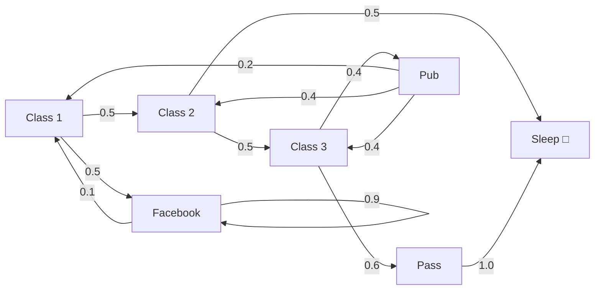

# Lecture 2: Markov Decision Processes and Q Learning

## Markov Chains (Markov Processes)

A **Markov chain** (also called a **Markov process**) is a chain of states where one state leads to another state according to transition probabilities. There are no actions and no rewards in a basic Markov chain.

### Example: Two State Markov Chain

Consider a Markov chain with two states, A and E:
- From state A, there is a 40% probability of transitioning to state E and a 60% probability of staying in A.
- Samples from this chain would look like: A, A, E, E, E, E, E, A.

Each sample is just one possible sequence of transitions given the probabilities. There are many possible samples.

### Building Up to MDPs

The progression from simple to complex is:

| Mathematical Object | Components | New Addition |
|---|---|---|
| **Markov Process** (Markov Chain) | States, transition probabilities | (base) |
| **Markov Reward Process** (MRP) | States, transitions, rewards, discount factor | Rewards |
| **Markov Decision Process** (MDP) | States, transitions, rewards, discount factor, actions | Actions |

Each of these can be represented as a mathematical **tuple**, similar to how a Turing machine in computer science is represented as a tuple. In this course, diagrams are used instead of formal tuple notation.

---

## The Markov Property

> **Key definition**: The **Markov property** states that the future is independent of the past given the present. The probabilities of transitioning to the next state depend only on the current state, not on any states before it.

In other words, the present state determines the future. We do not have to look into the past beyond the current state to talk about the future.

### Markov Property in Grid Worlds

In a 5 by 5 grid world (as in Lab 1), each state is Markov because when the agent is in a given cell, it can go left, right, up, or down, and the outcome depends only on where it is now and what action it takes. It does not depend on which of the possible previous states it came from. There are up to nine possible previous states for any interior cell (including staying in place via a no op action), but none of that history matters.

---

## Histories and State Representation

In reinforcement learning, a **history** is the full sequence of actions, rewards, and observations from the beginning of an episode. For example: action, reward, observation, action, reward, observation, and so on.

When studying Markov problems, we examine our state and want it to satisfy the Markov property. If the current observation alone is not sufficient (not Markov), we can include more of the history to make it Markov. For example, consider the current screen in Space Invaders, where invaders are coming down and the player has a gun at the bottom. If that single screen is not Markov (not enough information to determine the future), then including more history (e.g., previous frames) can make the state Markov.

### DeepMind's Atari Example

In DeepMind's solution to Atari video games, agents learned to play better than any human using reinforcement learning. They chose the **last four frames** of the game as the state representation, and that was sufficient to be Markov, because nothing before the fourth frame back mattered.

In the worst case, if needed, the entire history from the beginning of the episode can be included to satisfy the Markov property. For Atari at 60 frames per second, this would be unwieldy. Choosing the last four frames was a practical decision found through experimentation.

> **Key point**: There is often no single correct approach to defining the state. It involves tradeoffs, and the sweet spot is often found by trial and error. You try some hyperparameters, check if convergence is fast enough, and tweak from there.

---

## David Silver's MDP Lecture

> **Course note**: The lecture references David Silver's Reinforcement Learning lecture on Markov Decision Processes (Lecture 2 in his RL series). Silver's course is used as a resource for foundational concepts, though this course does not go to the same level of mathematical detail.

Timestamps from the slides for Silver's Lecture 2 *(from slide 2)*:
- Markov Processes: 6:25 (chains of Markov states)
- Markov Reward Processes: 13:00 (chains of Markov states with reward)
- Bellman Equation: 29:10
- Markov Decision Processes: 43:00 (add actions)
- Policy: 46:25

Silver's lecture layers on complexity step by step:
1. Start with a **Markov process** (Markov chain)
2. Add **rewards** to get a **Markov reward process**
3. Add **actions** to get a **Markov decision process**

The goal is to develop a formalism for MDPs. In the previous lecture, agents and environments were introduced. The agent is the algorithm (the "brain" being built), and it interacts with some world (a real world for a robot, a trading environment for a trading agent, a factory floor, etc.). The MDP provides a formal description of that environment. The interaction loop *(from slide 8, Figure 3.1 in Sutton)*:

1. The agent performs action $A_t$ which affects the environment
2. The environment enters a resulting state
3. The agent receives the new state $S_{t+1}$ and a scalar reward $R_{t+1}$

### Fully Observable Environments

MDPs start with the assumption that the environment is **fully observable**: the agent is told the complete state. All relevant information is presented, nothing is hidden. The current state completely characterizes the process. Almost all reinforcement learning problems can be formalized as an MDP.

---

## Markov Chain Example: The Student

David Silver's student Markov chain has the following states and transition probabilities:



- **Sleep** is the **terminal state**, represented by a square box. In the terminal state, the agent always transitions back to itself with reward zero.
- From Facebook, there is a 0.9 probability of staying on Facebook (continuing to scroll).
- The probabilities leaving any state always sum to 1.

Sample trajectories:
- Class 1 → Class 2 → Class 3 → Pass → Sleep
- Class 1 → Class 2 → Sleep

### Start States

There is no symbol in the diagram indicating a start state. The Markov chain is represented as a transition matrix that simply calculates transitions between states. You can technically start at any state. If you started in the Facebook state, the trajectory would likely be Facebook, Facebook, Facebook many times before transitioning elsewhere (only a 10% chance of leaving each step).

### The A/E State Example

Returning to the two state chain with states A and E:
- When in E, there is a 30% chance the next state is E and a 70% chance it is A.
- Even though 30% is low, it is possible to get E ten times in a row. Over large numbers of transitions, the breakdown will approach 30% E and 70% A (law of large numbers).

---

## Markov Reward Process

A **Markov reward process** is a Markov process with value judgements added. It answers: how good is it to be in a particular state?

Formally, an MRP adds two components to a Markov process:
- **Reward function $R$**: tells us how much immediate reward we get from being in a given state. This is just the reward at one step. If we are at time $t$ in state $s$, at time $t+1$ we receive this reward.
- **Discount factor $\gamma$**: used to discount future rewards (discussed below).

The MRP is represented as a tuple *(reconstructed)*:

$$\langle S, P, R, \gamma \rangle$$

where $S$ is the state space, $P$ is the transition matrix, $R$ is the reward function, and $\gamma$ is the discount factor.

What we care about is maximizing the **cumulative sum** of rewards over time.

### Student MRP Rewards

Adding rewards to the student Markov chain:

| State | Reward |
|---|---|
| Class 1, 2, 3 | $-2$ each (you don't enjoy class) |
| Pass | $+10$ (big payoff for finishing) |
| Facebook | $-1$ per step |
| Pub | $+1$ (beer tastes good) |

Different people would correspond to different Markov reward processes, because different people have different probabilities of going to class versus going to the pub.

---

## The Bellman Equation for MRP

The **Bellman equation** describes the **value** of being in a certain state. The value of state $s$ is the expected return starting from that state.

$$V(s) = \mathbb{E}[G_t \mid S_t = s]$$

### Discounting

The return $G_t$ uses a discount factor $\gamma$ (between 0 and 1) to weight future rewards *(reconstructed)*:

$$G_t = R_{t+1} + \gamma R_{t+2} + \gamma^2 R_{t+3} + \dots$$

This can be written recursively *(from slide 14)*:

$$G_t = R_{t+1} + \gamma \, G_{t+1}$$

The immediate reward is taken in full, and future rewards are discounted more and more. As $\gamma$ approaches 1, the agent becomes more **farsighted**, taking future rewards into account more strongly *(from slide 14)*. Setting $\gamma = 1$ is possible, but the main reason for discounting is to **prevent returns from going to infinity**, especially when the process never terminates. Without discounting, the undiscounted return $G_t = R_{t+1} + R_{t+2} + \dots + R_T$ blows up for continuing tasks.

**Episodic vs. continuing tasks** *(from slide 13)*:
- **Episodic tasks** have a terminal state (a single play of a game, a run through a maze, making a cup of coffee). The time step of termination $T$ is a random variable that varies from episode to episode. The terminal state is also called an **absorbing state**: it always transitions to itself with a reward of 0.
- **Continuing tasks** never finish ($T = \infty$), such as controlling a power plant or a home thermostat. Discounting is essential for these.

### Expectation and the Law of Large Numbers

**Expectation** appears throughout these equations. Intuitively, the expected value appeals to the **law of large numbers**: over many trials, the average converges to the expected value.

**Die rolling example**: What is the expected value of rolling a fair six sided die?

$$\mathbb{E}[X] = \frac{1}{6}(1) + \frac{1}{6}(2) + \frac{1}{6}(3) + \frac{1}{6}(4) + \frac{1}{6}(5) + \frac{1}{6}(6) = 3.5$$

The expected value is 3.5, even though you can never actually roll 3.5. Over many rolls, the average approaches 3.5. Note that 3 is **not** the middle of the distribution between 1 and 6. The middle is 3.5.

> **Course note**: Probability notation will not be tested, because the course focuses on practical reinforcement learning. The Bellman equation is used directly (as in the Lab 1 code), not derived from scratch.

### Bellman Equation Intuition

The Bellman equation decomposes into *(reconstructed)*:

$$V(s) = R_{s} + \gamma \sum_{s' \in S} P_{ss'} V(s')$$

> **Key intuition**: The value of the state I am in equals my **immediate reward** plus the **discounted value of the next state**. This is visible directly in the Q learning update step: there is an immediate reward plus a future value function.

---

## Markov Decision Process (MDP)

The **MDP** adds **actions** to the Markov reward process. This is the formalism actually used in reinforcement learning. In the MRP, there was no agency. States transitioned randomly according to probabilities and the process just happened. In an MDP, the agent makes decisions.

Formally, an MDP extends the MRP tuple with an action space $A$ *(reconstructed)*:

$$\langle S, A, P, R, \gamma \rangle$$

### Student MDP

In David Silver's student MDP, the transitions are now labeled with **actions** (shown in red in the lecture slides). For example:
- In a class state, the agent can choose **study** (go to the next class, reward $-2$) or **Facebook** (go to the Facebook state, reward $-1$).
- Studying has less immediate reward (less "feel good"), but eventually leads to the $+10$ payoff.

### Grid World as an MDP

In a grid world, each state transitions to another state based on the chosen action. Each transition follows the pattern: **state, action, reward, new state**. For example, from square $(3,3)$, choosing "down" leads to $(3,4)$.

**Coordinate conventions**: Different sources use different conventions for axes and directions. In images, $y$ typically increases downward and $x$ increases to the right. So $y=0$ is at the top, and the further down you go, the bigger $y$ gets. In this course's grid worlds, $y$ increases as you go down:
- Down from $(3,3)$ → $(3,4)$
- Down from $(3,4)$ → $(3,5)$

### Nondeterminism in MDPs

In general MDPs, state transitions can be **nondeterministic**. In Silver's example, taking the "pub" action from a certain state gives:
- 40% chance of ending up in one state
- 40% chance of another state
- 20% chance of a third state

In the grid worlds used in this course, actions are **deterministic**: choosing "down" leads to exactly one state with 100% probability.

Similarly, policies in general MDPs are **stochastic** (a probability distribution over actions). In this course's grid worlds, the policy is treated as a **deterministic function** that always outputs a single action.

---

## Optimal Policy and Optimal Value Function

### Optimal Policy

The **optimal policy** is the one that maximizes the cumulative reward for the episode.

In the student MDP, the optimal policy is to always choose "study." Choosing Facebook or the pub artificially lowers the total reward, whereas always studying eventually reaches the $+10$ payoff.

Optimal policies are not always easy to characterize. In general, they depend on the state.

### Policy Definition

A **policy** $\pi$ is a distribution over actions given states *(reconstructed)*:

$$\pi(a \mid s) = P[A_t = a \mid S_t = s]$$

If in state $s$, the policy gives the probability of taking each possible action. For example: choose class 2 with probability 0.9, choose Facebook with probability 0.1. The policy is something the agent controls, and making it stochastic allows for exploration.

A **deterministic policy** is the special case where the mapping goes directly from states to actions *(from slide 16)*:

$$\pi(s) = a$$

### Value Function Under a Policy

The value function is **subscripted by the policy** being followed:

$$V_\pi(s) = \mathbb{E}_\pi[G_t \mid S_t = s]$$

$V_\pi(s)$ tells us how good it is to be in state $s$ if following policy $\pi$. Different policies yield different values for the same state.

The **action-value function** gives the expected return when starting in state $s$, taking action $a$, and then following policy $\pi$ *(from slide 17)*:

$$q_\pi(s, a) = \mathbb{E}_\pi[G_t \mid S_t = s, A_t = a]$$

$\mathbb{E}_\pi[\cdot]$ denotes the expected value of a random variable given that the agent follows policy $\pi$, and $t$ is any time step.

### Suboptimal Policies

Not all agents follow optimal policies. The football analogy: a player who bets against their own team and then plays poorly is following a suboptimal policy on purpose. In RL, the normal assumption is that we are trying to find the optimal policy.

### Optimal Q Function (Q*)

The **optimal value function** is achieved by following the optimal policy. $Q^*$ is the optimal action value function *(reconstructed)*:

$$Q^*(s, a) = \max_\pi Q_\pi(s, a)$$

$Q$ takes in a state $s$ and action $a$ and returns the expected return $G_t$ from taking that action in that state. This is what Labs 1 and 2 are trying to find.

> **Key relationship**: The optimal policy and optimal value function are interrelated. A better estimate of the value function leads to a better policy, which in turn improves the value function. They improve iteratively together.

---

## The Bellman Optimality Equation for Q*

The optimal Q function satisfies *(reconstructed)*:

$$Q^*(s, a) = R(s, a) + \gamma \max_{a'} Q^*(s', a')$$

The optimal Q value is the **immediate reward** from taking action $a$, plus the **discounted maximum Q value** achievable from the next state $s'$. The $\max$ operator is the optimizing function, selecting the best possible next action.

### Why Q Tables Cannot Solve Go

For the cliff walking grid world, Q learning works well because the state and action spaces are small and countable. For Go, there are far too many states to enumerate. Instead of a Q table, a **neural network** is used to **approximate** Q. This is called **value function approximation** and is covered later in the course.

The same applies to **continuous action spaces**. For example, turning a steering wheel to exactly $\pi$ radians or exactly $1.333...$ radians. There are infinitely many possible actions, so enumeration is impossible.

> **Course note**: For now, the course focuses on Q learning in discrete, concrete worlds where states can be counted and actions are deterministic. Value function approximation with neural networks comes later.

---

## Q Learning: The Bellman Equation in Code

### Simplified Form (No Step Size)

The simplified Q learning update (as seen in the code) is *(reconstructed)*:

```python
Q[s][a] = reward + gamma * max(Q[s_prime])
```

This is the Bellman equation in Python syntax instead of math notation. However, it is simplified because there is no step size parameter.

### Full Form with Step Size (Page 132 of Sutton & Barto)

The full Q learning update with step size $\alpha$ *(reconstructed)*:

$$Q(S, A) \leftarrow Q(S, A) + \alpha \left[ R + \gamma \max_{a'} Q(S', a') - Q(S, A) \right]$$

```python
Q[s][a] = Q[s][a] + alpha * (reward + gamma * max(Q[s_prime]) - Q[s][a])
```

When $\alpha = 1$, the $Q(S,A)$ terms cancel and we get exactly the simplified form.

### Step Size Intuition

The step size controls how much of the old value is retained:
- The term $Q(S,A) + \alpha[\dots - Q(S,A)]$ keeps a portion of the old value.
- If $\alpha = 1$: none of the old value is kept. The Q entry is completely overwritten with the new value.
- If $\alpha < 1$: some of the old value persists, and the new value is blended in. This provides smoother, more stable learning.

> **Course note**: The one thing the Lab 1/Lab 2 code does not do is explicitly set the terminal state Q table entries to zero. Other than that, the code matches the textbook algorithm.

---

## Off Policy vs. On Policy Learning

### Temporal Difference (TD) Learning

Q learning is a form of **temporal difference learning**. TD learning only needs **one step of difference** to learn (called **TD(0)**). This contrasts with Monte Carlo methods, which require waiting until the end of an episode.

**TD($\lambda$)** uses some number of steps of difference before learning. When it is just one step, that is TD(0), and Q learning falls in this category.

### Q Learning is Off Policy

Q learning is **off policy**. The agent follows an **epsilon greedy policy** (mostly greedy, with occasional random exploration), but the Q table is updated using the **maximum Q value** for the next state, not the action that the policy would actually choose.

The policy says: look at epsilon, generate a random number, and compare. That is the behavior policy. But the Q table update always takes the max, which corresponds to learning the **optimal policy** regardless of what action was actually taken. The update involves no randomness.

### SARSA is On Policy

**SARSA** (State, Action, Reward, State, Action) looks very similar to Q learning, except the next action $A'$ used in the update is **chosen according to the policy**, not by taking the max.

| Feature | Q Learning (Off Policy) | SARSA (On Policy) |
|---|---|---|
| Update rule | $R + \gamma \max_{a'} Q(S', a')$ | $R + \gamma Q(S', A')$ where $A'$ is chosen by policy |
| What it learns | Optimal policy | The policy it is actually following |
| Next action selection | Takes the max Q value | Chooses $A'$ according to the epsilon greedy policy |

*(reconstructed)* The Q learning update:
$$Q(S, A) \leftarrow Q(S, A) + \alpha \left[ R + \gamma \max_{a'} Q(S', a') - Q(S, A) \right]$$

The SARSA update:
$$Q(S, A) \leftarrow Q(S, A) + \alpha \left[ R + \gamma Q(S', A') - Q(S, A) \right]$$

SARSA pseudocode from the Sutton textbook *(from slide 6)*:

```
Algorithm parameters: step size alpha in (0, 1], small epsilon > 0
Initialize Q(s,a) for all s in S+, a in A(s), arbitrarily except that Q(terminal, .) = 0

Loop for each episode:
    Initialize S
    Choose A from S using policy derived from Q (e.g., epsilon-greedy)
    Loop for each step of episode:
        Take action A, observe R, S_prime
        Choose A_prime from S_prime using policy derived from Q (e.g., epsilon-greedy)
        Q(S, A) = Q(S, A) + alpha * (R + gamma * Q(S_prime, A_prime) - Q(S, A))
        S = S_prime; A = A_prime;
    until S is terminal
```

The difference between SARSA and Q learning is magnified if epsilon = 1 (totally random policy) *(from slide 7)*:
- SARSA updates the Q table using the value of the **random action** actually chosen
- Q learning updates the Q table using the action with **max value**, regardless of what was chosen

### Cliff Walking: The Classic Illustration

The cliff walking example (page 132 of Sutton & Barto) perfectly illustrates the difference:

- **Q learning (red path)**: Learns the **optimal path** right along the edge of the cliff. 13 steps. It ignores the possibility that the epsilon greedy policy might randomly step off the cliff.
- **SARSA (blue path)**: Learns a **safe path** far from the cliff. It takes into account that random exploration actions might send the agent over the cliff ($-100$ penalty), so it stays away.

**Why does SARSA take the safe path?** When the agent is on the optimal path near the cliff, a random action downward means falling off the cliff ($-100$). SARSA learns according to the policy it is following, which includes random actions. So SARSA learns: "if you're going to occasionally do something random, get away from the cliff." Up on the blue line, a random downward step is still safe.

**Decaying epsilon**: The Q learning algorithm uses a decaying epsilon, so over time there is less and less chance of a random action. After about 30 episodes, the agent converges to the optimal path and takes it every time.

### Epsilon Greedy

The **epsilon greedy** policy:
- With probability $1 - \epsilon$: choose the action with the highest Q value (exploit).
- With probability $\epsilon$: choose a random action (explore).

In code *(from slide 7)*:

```python
# act randomly sometimes to allow exploration
if np.random.uniform() < epsilon:
    action = env.action_space.sample()
# otherwise select max action in Qtable (act greedy)
else:
    action = qtable[state].index(max(qtable[state]))
```

The random number used is **uniformly distributed** between 0 and 1 (not a normal distribution). Every value between 0 and 1 is equally likely.

---

## Textbook Overview (Sutton & Barto)

### Chapter 2: Bandits

The **bandit problem** is an MDP with only **one state**. There is some number of levers (actions), and pulling any lever keeps you in the same state but gives a reward.

Bandits illustrate **exploitation vs. exploration**:
- **Exploitation**: Keep pulling the lever you know gives good rewards.
- **Exploration**: Occasionally try a different lever to see if something better exists.

**Lever example**: If a lever gives \$1 every pull, that is good. Keep pulling. But occasionally try another lever. Maybe it gives \$100. Now you have a new favorite. But maybe there is a million dollar lever you will never find without exploring.

**Restaurant analogy**: You always go to the same restaurant because you know it is good (exploitation). Every once in a while, you try something different to see if there is something better (exploration). This is the same tradeoff seen in epsilon greedy.

### Chapter 4: Dynamic Programming

Dynamic programming covers:
- **Policy evaluation**: Given a policy, calculate the values it produces.
- **Policy improvement**: Use the value function to choose a better policy. With a better policy, the values improve further, giving an even better policy. This iterates until convergence at the optimal policy.
- **Policy iteration** and **value iteration**: Algorithms implementing this cycle.

A key mathematical result: **there is always at least one optimal policy**. If 100 policies all yield exactly the same (highest) value, they are all optimal. You can pick any one of them.

> **Course note**: The course skipped dynamic programming initially to jump straight into Q learning, but will revisit it later. It should feel natural by then because the concepts (policy evaluation, policy improvement) relate directly to what has already been practiced.

### Chapter 5: Monte Carlo Methods

**Monte Carlo methods** are similar to Q learning, except learning does not happen until the episode is finished. The agent goes through the entire episode, records the trajectory, and only then updates the tables by working backwards.

This differs from TD learning, which can learn from a single step of experience without waiting for the episode to end.

### Chapter 6: Temporal Difference Learning

This is where the course currently is. Q learning is **off policy TD control** (specifically TD(0)). The agent optimizes the cliff walk to consistently achieve $-13$ reward (the optimal path), rather than $-126$ or worse. The code that was run in the labs is from a Medium site and is an implementation of this algorithm.

---

## Visualizing the Q Table

Discussion questions posed in the slides *(from slide 5)*:
- Why does the CliffWalking example converge on the shortest path?
- How does the reward (besides cliff) affect the eventual path? (Negative reward? Zero reward? Positive reward?)
- How does the initialization of the Q table affect convergence? (Randomized? Initialize to zero?)
- Do we set the action values of the terminal state to zero?

In grid worlds, there is a similarity in structure between the Q table and the grid world itself, which means we can animate the learning of the Q function directly on the grid.

### Graphical Representation

To visualize Q learning in the cliff walking environment, each state in the grid is displayed with **four numbers** representing the Q values for each action:

```
        ┌─────────┐
        │   up    │
        │         │
        │left  right│
        │         │
        │  down   │
        └─────────┘
```

*(added)* For example, in a state near the cliff after convergence:
```
        ┌──────────────┐
        │   -1.11      │
        │              │
        │-1.110  -1.10 │
        │              │
        │   -100       │
        └──────────────┘
```

The down action has value $-100$ (leads to the cliff), while the other three actions have values very close to $-1$.

### Setup

The visualization is done as a **Jupyter notebook**. It uses the Q learning code adapted with **Matplotlib** to show a color coded representation of the Q table. The color scale runs from purple ($-100$) to yellow ($+100$). Values near zero or $-1$ appear as a similar color since they are in the middle of that range.

### Learning Progression

The Q table is initialized with values from 0 to 100.

- **Episode 1**: The agent falls off the cliff many times. Each visited state gets its action values updated to roughly $-1$. Actions leading to the cliff get updated to $-100$. Lots of learning happens in the first episode.
- **Episode 2**: Fewer cliff falls. The agent seeks the smallest magnitude negative numbers and avoids the $-100$ actions.
- **Episode 4 to 6**: The agent improves. **Cliff cells never get updated** because the agent is never actually on the cliff. When the agent chooses "down" near the cliff, it lands on the cliff and gets sent back to the start. The cliff cells themselves are never occupied, so their Q values remain at the initial values. They are not even necessary in the Q table.
- **Episode ~30**: Convergence. The agent consistently follows the optimal path.

### Converged Q Table Analysis

After convergence, the numbers in each state are very close. For example, in a state along the optimal path, the "right" action might have value $-1.10$ while "up" has $-1.110$ and "left" has $-1.11$. The difference between $-1.02$ and $-1.1$ determines the direction. The agent picks the maximum (least negative), which sends it rightward along the optimal path.

### The Gradient Effect

> **Key insight**: The terminal state has a value of zero, which is higher than any other state's value (since all others are negative). This zero value **filters back** along the optimal pathway, fading as it goes. It creates a gradient: $-1.0$ near the goal, $-1.02$ a bit further, $-1.1$ even further. This gradient pulls the agent toward the terminal state. Simultaneously, there is another gradient keeping the agent away from the cliff (actions toward the cliff have value $-100$). The combination of these two gradients defines the optimal path.

The agent learns these gradients because it starts off random. Once it reaches the terminal state even once, it updates the nearby values to reflect the zero reward, and those values propagate outward. The agent then tends to follow this gradient more and more frequently.

At some point, epsilon decays to be so small that the agent no longer takes random actions and simply follows the Q table.
