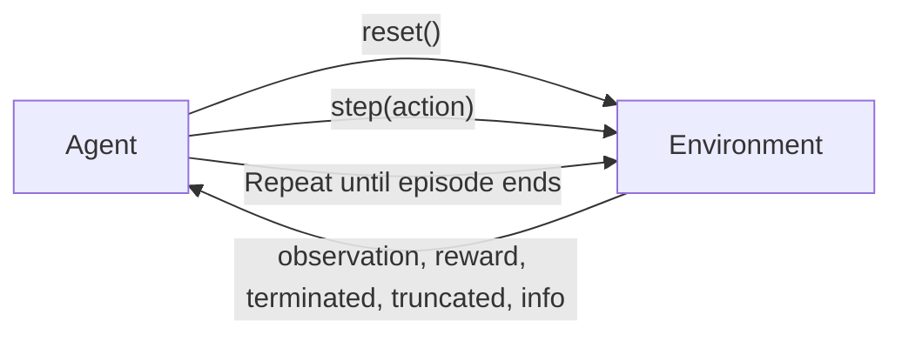

# Lecture 3: Gymnasium Environments and Blocks World

## Course Roadmap: Simulators and Assignments

Simple environments like grid worlds are useful for learning, but once we move into nontrivial worlds, we need simulators. For example, if you wanted to apply RL to the stock market, you would need a stock market simulator, and there isn't one. But there is a simulator for the iRobot Create 3.

### Create 3 Simulation

The **Amazon Small House** is a Gazebo simulation of a small house containing a Create 3 robot. In **Lab 3**, we run this simulation and see the house with a simulated Create 3 on the floor. All of the ROS 2 commands work on this simulated robot. The simulated Create 3 subscribes to `cmd_vel` and responds to ROS 2 commands just like a real robot would.

The turtle simulator (used earlier) is similar to a Create 3 but is not a Create 3.

### Lab and Assignment Progression

| Lab/Assignment | Focus |
|---|---|
| Lab 1 | Basic Q-learning agent with a homemade environment (no Gymnasium) |
| Lab 2 | Upgrade to Gymnasium Cliff Walking environment, introduce Stable Baselines 3 |
| Lab 3 | Create 3 simulation in Gazebo with ROS 2 |
| Assignment 1 | Q-learning on a Blocks World Gymnasium environment (Prolog) |
| Assignment 2 | Training the Create 3 |

> **Course note**: Assignment 1 is Blocks World as a Gymnasium environment. Assignment 2 will be training the Create 3. These are the major milestones.

---

## Agents, Environments, and Algorithms

### The Key Insight: Agents Are Interchangeable with Environments

**Agents are the implementation of algorithms.** We call it a "Q-learning agent" or a "PPO agent." The critical idea is that agents and environments can be mixed and matched:

- A Q-learning agent can run on the Taxi environment
- The same Q-learning agent can run on Cliff Walking
- The same Q-learning agent can run on Blocks World
- A PPO agent can also run on any of these environments

The Q-learning agent from Lab 1 transfers essentially unchanged to the Gymnasium version in Lab 2. In Lab 1, the agent was named the "Lab 2 Q-learning agent" for convenience, since it gets copied forward into Lab 2 with minimal changes. Then the same agent can be pointed at a completely new environment (Blocks World) for Assignment 1.

### Cliff Walking as a Standard Gymnasium Environment

Cliff Walking (`CliffWalking-v0`) is a standard Gymnasium environment. You could run your Q-learning algorithm on the official Gymnasium version instead of our custom one. The official version uses different colors (green squares, an elf character) compared to our Lab 2 Pygame version. We built our own to prove we could do it and to learn the internals.

---

## The Agent-Environment Interaction Loop



The agent creates an instance of the environment, resets it, and begins executing actions. This cycle continues until the end of the episode, then a new episode begins. The **coding** of the environment is done by the programmer. The agent does not code the environment. It only interacts with it.

### What the Agent Needs from the Environment

Early in its execution, the agent instantiates the environment and then builds the **Q-table**. To build the Q-table, the agent must know:

1. **How many states** the environment has
2. **How many actions** are available
3. **What type** the states and actions are

The Q-table shape is determined by these two numbers:

| Environment | States | Actions | Q-table Shape |
|---|---|---|---|
| Cliff Walking | 48 (numbered 0 to 47) | 4 (up, down, left, right) | 48 x 4 |
| Blocks World (3-digit) | ~120 configurations | ~90 possible moves | 120 x 90 |
| Blocks World (6-digit) | ~14,400 (120 x 120) | ~90 possible moves | 14,400 x 90 |
| Generic example | 4 states, 100 actions | | 4 x 100 |
| Generic example | 100 states, 4 actions | | 100 x 4 |

The algorithm figures out the Q-table shape after it creates the environment by querying `env.observation_space.n` and `env.action_space.n`.

In Q-learning, states are just numbered. The agent knows its states as 0 to 47. Actions are 0, 1, 2, 3. The agent does not initially know what these actions do. It starts executing actions and learns the Q-table through experience.

---

## Gymnasium: Migration from OpenAI Gym

**Gymnasium** is the successor to **OpenAI Gym**. Gym is the old library. Gymnasium is the new version that everyone uses now, but the `gym` name is preserved through an import trick.

### Import Convention

```python
import gymnasium as gym
from gymnasium import spaces
```

**Important**: After the imports are complete, `gymnasium` is referred to as `gym` throughout the code. However, during the import statements themselves, you must use the full name `gymnasium`:

```python
# CORRECT
import gymnasium as gym
from gymnasium import spaces

# WRONG - this imports from the OLD gym library, not gymnasium
import gymnasium as gym
from gym import spaces  # BUG: gets old gym's spaces
```

The renaming only takes effect after all imports are done. Before the imports are finished, you still have to import from `gymnasium`.

### Migration Changes from Gym to Gymnasium

#### 1. Seed Parameter in `reset()`

The `reset()` method now takes a `seed` parameter. All randomness in RL (random target states, random action selection) is pseudo-random. A pseudo-random number generator takes a seed, and the same seed always produces the same sequence of random numbers.

This enables **reproducibility**: if you train for a day and get a result, you can come back a year later, use the same seed, and get the same result because the randomness starts from the same place.

> **Course note**: There is an upcoming hybrid activity (tutorial on practical aspects of RL) where the presenter will demonstrate that **even just changing the seed**, without changing any hyperparameters, can change results by a wide margin. Reproducibility matters.

```python
# Reset with a seed for reproducibility (reconstructed)
observation, info = env.reset(seed=42)
```

#### 2. Truncated Return Value in `step()`

| Version | `step()` returns |
|---|---|
| Old Gym | 4 values: `observation, reward, done, info` |
| Gymnasium | 5 values: `observation, reward, terminated, truncated, info` |

**Truncated** means an early, non-standard end to the episode.

**Example**: A race car on a track. The episode goal is to cross the finish line. If the car goes off the track and cannot recover, that is a **truncated** episode. The agent still learned a little bit, but the episode came to a non-standard end. The "real" end is crossing the finish line, which would be **terminated**.

**Cliff Walking nuance**: It is tempting to say falling off the cliff (reward of -100) is the same as going off the racetrack. But on page 132 of the textbook, the Cliff Walking example says nothing about ending the episode when the agent falls off the cliff. It just goes back to start and continues the episode. We only **terminate** when we reach the goal state. Using truncated for falling off the cliff would not change much for Labs 1 or 2, but strictly speaking, Cliff Walking only uses terminated (reaching the goal).

```python
# Gymnasium step (reconstructed)
observation, reward, terminated, truncated, info = env.step(action)

if terminated or truncated:
    observation, info = env.reset()
```

---

## The Gymnasium Environment Interface

A Gymnasium environment is like a Java interface: it defines a set of methods that every environment must implement.

> **Course note**: "What are three methods in the Gymnasium interface?" would be a good test question. The answer: `step`, `reset`, and either `render` or `close`.

### Core Methods

| Method | Purpose | Notes |
|---|---|---|
| `__init__` | Constructor. Sets up render mode, size, observation space, action space | Called by `gym.make()` or direct instantiation. The default `size=5` in the starter environment comes from the 5x5 grid world we copy |
| `reset()` | Returns the environment to a starting state | In grid worlds: moves agent to start. In Blocks World: resets all blocks to an initial configuration. Could randomize the starting state each episode |
| `step(action)` | Agent performs an action on the environment | The most important method. Returns observation, reward, terminated, truncated, info |
| `render()` | Displays the environment visually for humans | Gymnasium environments typically use Pygame |
| `close()` | Shuts down the environment | In Blocks World: shuts down the Prolog interpreter so it does not hang around in the background |

### Reset in Blocks World

In grid worlds, `reset()` is simple: move the character to the start position. In Blocks World, `reset()` puts all blocks into a starting configuration. This does not have to be the same starting configuration every time. We could arrange for:
- A random starting state
- A random target state
- The agent's job is to get from the random start to the random target

Both the starting state and target can be chosen randomly at the beginning of each episode.

### Close in Blocks World

With Blocks World, the environment starts a **Prolog interpreter** when created. The `close()` method shuts down that Prolog interpreter. Without this, the Prolog process would hang around in the background after the Python program exits.

---

## Observation Spaces and Action Spaces

In addition to the methods above, a Gymnasium environment must define its **observation space** and **action space** as attributes.

### Fundamental Space Types

| Space | Description | Example |
|---|---|---|
| `spaces.Box` | Continuous values with a low and high bound per dimension | Agent position as (x, y) where x, y range from 0 to 4 |
| `spaces.Discrete` | A fixed number of integer states, numbered 0 to n-1 | 4 actions: {0, 1, 2, 3} |
| `spaces.MultiBinary` | Binary arrays of a certain shape | |
| `spaces.MultiDiscrete` | Multiple discrete variables | |
| Dict (dictionary) | A dictionary mapping names to other spaces | `{"agent": Box(...), "target": Box(...)}` |

Every space has a `sample()` method that picks a random element from that space.

```python
# Box space: agent position in a 5x5 grid (reconstructed)
self.observation_space = spaces.Dict({
    "agent": spaces.Box(low=0, high=4, shape=(2,), dtype=int),
    "target": spaces.Box(low=0, high=4, shape=(2,), dtype=int),
})

# Discrete space: 4 actions
self.action_space = spaces.Discrete(4)
```

### Starter Environment: 5x5 Grid World (Dictionary Observation)

The starter Gymnasium environment (which we copy and modify) uses a **5 by 5 grid world**. It represents observations as a **dictionary** with two keys:
- **agent**: a Box containing a tuple of two ints (x, y), ranging from 0 to 4
- **target**: a Box containing a tuple of two ints (x, y), ranging from 0 to 4

The action space is `Discrete(4)` for actions 0, 1, 2, 3.

### Adapting to Cliff Walking (12 x 4)

When adapting the starter environment to Cliff Walking:
- We **drop the target** from the observation (Cliff Walking does not have a visible target in the observation)
- The dimensions change from 5 by 5 to **12 by 4** (12 columns, 4 rows)
- One number ranges from 0 to 3, the other from 0 to 11

> **Course note**: Adapting the observation space from 5 by 5 to 12 by 4 is one of the tasks in Lab 2 that requires careful thinking. The changes are described in the lab document.

### Adapting to Blocks World (Discrete Observation)

For Assignment 1, we do not use a dictionary observation. Instead, we use a simple **Discrete space** where states are numbered integers.

```python
# Blocks World observation space (reconstructed)
# Version 1: 3-digit states only (~120 states)
self.observation_space = spaces.Discrete(120)

# Version 2: 6-digit states (current + target, ~120^2 = 14,400 states)
self.observation_space = spaces.Discrete(120 * 120)
```

A dictionary converts between the three-digit string representation (like "C24") and the integer state number. Code is provided to convert in both directions.

### Querying Spaces from the Agent

```python
# In the agent, after creating the environment (reconstructed)
env = gym.make("blocks_world/BlocksWorld-v0", render_mode="human")

n_states = env.observation_space.n    # e.g., 120
n_actions = env.action_space.n        # e.g., 90

# Build Q-table with the right shape
Q_table = np.zeros((n_states, n_actions))
```

The environment **defines** the observation space and action space. The agent **looks them up** after creating the environment. `spaces.Discrete` has an `n` attribute that gives the number of elements.

---

## Stable Baselines 3

**Stable Baselines 3** is a library that implements standard reinforcement learning algorithms in an open and verifiable way. "Baseline" means these are the baseline, standard RL algorithms you will probably be using.

> **Course note**: Stable Baselines 3 will be studied over the coming weeks. For now, take it as a collection of standard RL algorithms. Textbook-style reading is available for Stable Baselines 3. We will not learn the nitty gritty of all the Stable Baselines algorithms, but we will be able to apply them by the time the course is done.

### Available Algorithms

Two algorithms relevant so far:
- **DQN** (Deep Q-Network): the algorithm used for playing Atari video games
- **PPO** (Proximal Policy Optimization): another standard algorithm

### DQN and PPO on Blocks World: Expected Poor Performance

For Assignment 1, DQN and PPO will not work well on Blocks World. They will work in principle, but the agent will get stuck or produce unsatisfying results. This is because neural network based algorithms want observations in a specific form:

- **Q-learning** is happy with raw integer states (state 0, state 1, ..., state 47)
- **DQN/PPO** want **normalized vectors** or **raster images** (e.g., an RGB screenshot of the game screen). A single integer from 0 to 47 is not suitable input for a neural network

> **Course note**: Later in the course, we will learn how to make DQN and PPO perform better by reformatting the observations.

### Policies: MultiInputPolicy vs. MlpPolicy

| Policy | When to Use | Observation Type |
|---|---|---|
| `MultiInputPolicy` | Dictionary observation spaces (e.g., `{"agent": ..., "target": ...}`) | Dictionary of spaces |
| `MlpPolicy` | Flat, numeric observation spaces (e.g., `Discrete(120)`) | Single numbers or vectors |

**MLP** stands for **multilayer perceptron**, which is a deep learning architecture. For Assignment 1 with a Discrete observation space, we use `MlpPolicy`.

```python
# DQN with MultiInputPolicy (dictionary observations) (reconstructed)
from stable_baselines3 import DQN
model = DQN("MultiInputPolicy", env)

# DQN with MlpPolicy (flat observations) (reconstructed)
model = DQN("MlpPolicy", env)
```

### Training and Saving Models

The Stable Baselines workflow has two phases: **training** and **operating**.

```python
from stable_baselines3 import DQN

# Phase 1: Train
env = gym.make("blocks_world/BlocksWorld-v0")
model = DQN("MlpPolicy", env)
model.learn(total_timesteps=10_000)

# Save the trained model to a file
model.save("dqn_blocks_world")

# (Optional) Delete and reload to prove persistence works
del model
model = DQN.load("dqn_blocks_world")

# Phase 2: Operate (predict actions using the trained model)
obs, info = env.reset()
for _ in range(1000):
    action, _ = model.predict(obs)
    obs, reward, terminated, truncated, info = env.step(action)
    if terminated or truncated:
        obs, info = env.reset()
```

*(reconstructed from lecture description)*

After training, the model (containing hyperparameters and learned weights) is saved to a file. This allows restoring training results instantly the next time you run without retraining.

PPO is exactly the same workflow, just replacing `DQN` with `PPO`.

---

## Agent Types (Review)

From the introduction to RL, agents can have different combinations of components:

| Agent Type | Value Function | Policy | Model of Environment |
|---|---|---|---|
| Value-based | Yes | Implicit (derived from value function) | No |
| Policy-based | No | Yes (explicit) | No |
| Actor-Critic | Yes | Yes | No |
| Model-based | Varies | Varies | Yes |

In Assignment 1, our agent has **no model of the environment**. However, the environment itself is based on a Prolog model. We could, in theory, give the agent the model. With a perfect model, the agent could simply plan: figure out the optimal sequence of actions and execute them. It would always know exactly how to reach the target state. But we are deliberately not giving it a model, so it has to learn through trial and error.

> The Blocks World problem has already been solved by Prolog, which can stack blocks perfectly without any RL. We are applying Q-learning to Blocks World as a **learning exercise**, not because Q-learning is the best approach.

---

## Assignment 1: Blocks World

### Overview

Assignment 1 turns the Blocks World from CST8503 (Lab 5, last semester) into a Gymnasium environment. Instead of walking in a grid world, the robot stacks blocks. How are we going to take Prolog Blocks World and turn it into a Python Gymnasium environment? Turns out it's not difficult. It's not difficult for programmers.

Prolog is an important skill. Avoiding Prolog would be like a programmer avoiding databases. You might be able to do it, but it makes your career harder.

> **Course note**: You do not need to do any Prolog programming. The Prolog code is given to you. You just need to run it. If you did not take CST8503 or did not pass it, that is fine. The Prolog is provided, and communication with Prolog happens through SWI-Prolog's Python integration.

### State Representation

There are **three blocks** (A, B, C) and **four places** on the table (1, 2, 3, 4) where blocks can sit. Blocks can also be stacked on top of each other. A configuration is represented as a **three-digit string** where each digit tells you where a block is:

- Position 1: where A is (a block name or a place number)
- Position 2: where B is
- Position 3: where C is

**Example**:

```
Current state: C24
  - A is on C
  - B is on place 2
  - C is on place 4

Target state: 12B
  - A is on place 1
  - B is on place 2
  - C is on B
```

There are approximately **120** valid block configurations.

### Two Versions of Assignment 1

| Version | State Format | Number of States | What Agent Knows |
|---|---|---|---|
| Version 1 (3-digit) | Current state only | ~120 | Only the current block configuration. Stumbles upon the target accidentally |
| Version 2 (6-digit) | Current state + target | ~14,400 (120 x 120) | Both current configuration and target. Can learn directed strategies |

Because the current state and target state use the same representation (both are block configurations numbered 0 to 120), they are uniform. There is not much benefit from splitting them into separate parts of the observation. So in Version 1, we ignore the target entirely. The agent generates a random state and stacks blocks until it accidentally matches the target. In Version 2, the target is included as part of the observation, so the agent can learn to reach specific targets.

### State-to-Number Conversion

Q-learning wants integer state numbers, not strings. A **dictionary** is used to convert between the string representation (e.g., "C24") and an integer (e.g., state 99). Code is provided to convert in both directions.

```python
# Conceptual conversion (reconstructed)
state_to_number = {"111": 0, "112": 1, ..., "C24": 99, ...}
number_to_state = {v: k for k, v in state_to_number.items()}
```

### Q-table Dimensions

| Version | States | Actions | Q-table Size | Training Time |
|---|---|---|---|---|
| 3-digit | ~120 | ~90 | ~10,800 entries | Faster |
| 6-digit | ~14,400 | ~90 | ~1,296,000 entries | Much longer |

### Project Structure

The copier command for Assignment 1 generates this folder structure:

```
<student-id>/
└── blocks_world/
    ├── pyproject.toml
    └── blocks_world/
        └── environments/
            └── ...
```

Your student ID is the **alphabetic** login you use for wireless, not your student number. Those are different things.

This is the same structure as Lab 2.

### Using the Blocks World Environment

```python
# Old way (Lab 1, no Gymnasium)
env = CliffWalkingEnvironment()

# New way (Gymnasium)
import gymnasium as gym
env = gym.make("blocks_world/BlocksWorld-v0", render_mode="human")
```

With `render_mode="human"`, the Pygame window will display both the target state and the current block configuration.

> **Course note**: Your main work in Assignment 1 will be dealing with **observation spaces and action spaces**, and matching up your agent to your environment. Through this process you will become very familiar with the Gymnasium environment interface.

---

## Prolog Integration for Blocks World

The Blocks World Prolog from Lab 5 (CST8503) needs new predicates to work as a Gymnasium environment. The original Prolog had no concept of stepping, resetting, or enumerating states and actions.

### Code as Data

In AI languages like **Lisp** and **Prolog**, code and data are the same thing. You cannot tell the difference between data and code. This property enables Prolog's `assert` and `retract` operations, which modify the program while it is running.

> Using `assert` and `retract` is **non-logical**. Adding or removing statements from the knowledge base during execution breaks the pure logic programming model. But it is necessary for simulating a dynamic environment.

### Reset Predicate

The `reset` predicate uses `retractall` and `assert` to reset the Blocks World to an initial state.

```prolog
% Reset: retract all current state facts and assert the initial state
% (reconstructed)
reset :-
    retractall(on(_, _)),
    assert(on(a, 1)),
    assert(on(b, 2)),
    assert(on(c, 3)).
```

*(reconstructed)*

This deletes all current `on/2` facts and asserts a standard starting configuration. Retract all removes the old statements, and assert adds new ones.

### State Enumeration Predicate

This predicate generates all valid three-digit state codes. It is given to you for Assignment 1.

**How it works**: For each of the three blocks, determine where it can be. Each block can be on a block or on a place, subject to constraints:

1. **No self-stacking**: A block cannot be on itself (A ≠ a, B ≠ b, C ≠ c, where capitals are variables and lowercase are atoms)
2. **No co-location**: Two blocks cannot be in the same place (A ≠ B, B ≠ C, A ≠ C)
3. **Grounded**: The configuration must be grounded, meaning at least one block must be sitting on the table (on a place, not on another block). A legal configuration has **no cycles**.

```prolog
% State enumeration (reconstructed from lecture description)
state(State) :-
    (block(A) ; place(A)), A \= a,
    (block(B) ; place(B)), B \= b,
    (block(C) ; place(C)), C \= c,
    A \= B, B \= C, A \= C,
    grounded(A, B, C), !,
    atomic_list_concat([A, B, C], State).

grounded(A, B, C) :-
    legal(A, B, C),
    (place(A) ; place(B) ; place(C)).
```

*(reconstructed from lecture description. The actual code given for Assignment 1 may differ.)*

> The power of Prolog is evident here. Generating all valid configurations with these constraints is concise in Prolog. Doing the same in Python would be significantly more complex. "Do this in Python and then tell me Prolog is useless."

> **Course note**: The state enumeration Prolog code is given to you. You will **not** be asked how it works on a test or in a lab demonstration.

### Prolog Cut

The state enumeration code uses `cut` (`!`). The general rule about cut is: **avoid it if you can, because it is non-logical.** But the person who wrote this code knew what they were doing. The same caution applies to `assert` and `retract`: do not use them unless you understand the consequences.

### Actions Predicate

The actions predicate enumerates **all possible actions**, whether they are currently valid or not.

```prolog
% Action enumeration (reconstructed from lecture description)
action(move(A, B, C)) :-
    block(A),
    (block(B) ; place(B)),
    (block(C) ; place(C)),
    A \= B, A \= C, B \= C.
```

*(reconstructed)*

An action has the form `move(A, B, C)` with three arguments:
- A must be a block (the block being moved)
- B and C can be a block or a place
- All three must be different

### Current State Predicate

The current state is read from the asserted `on/2` facts. A is on its initial position, B is on its initial position, C is on its initial position. These three values are concatenated into a three-digit string.

### Step Predicate

The step predicate is non-logical. It:

1. Takes an action of the form `move(Block, From, To)`
2. Checks that the move is possible
3. Figures out where A, B, and C will be **after** the action
4. **Retracts** the current positions (removes old `on/2` facts)
5. **Asserts** the new positions (adds updated `on/2` facts)

In summary: determine where the blocks would go after the action, then put them there.

> **Course note**: All of this Prolog code needs to be added to the Lab 5 solution from CST8503 last semester. Once added, the Blocks World can be used as a Python Gymnasium environment.

---

## Rendering with Pygame

The Pygame display code is **given to you** for Assignment 1. The rendering module is `screen.py`, which handles drawing the block images.

Three block images are provided (one per block). `screen.py` knows how to position them on the canvas to show the current block configuration and the target configuration.

You do not need to program the rendering. Pygame is not the focus of this course. Two reference URLs are provided for optional reading on Pygame basics (drawing and blitting on the canvas). In Lab 2, the Pygame code is already set up. You only need to modify it to change the grid shape from 5x5 to 12x4.

> Adapting existing solutions to be slightly different for your current needs is a very common programmer activity.

---

## Resources Mentioned

Several reference sites were mentioned in this lecture:

- **Q-learning resource**: The same URL from Lab 1, identifiable by the two red dice at the top of the page
- **Custom Gymnasium environment guide**: Explains how to create a custom environment by copying a simple starter environment and modifying it
- **Pygame references**: Two optional URLs for textbook-style reading on Pygame basics (drawing and blitting on the canvas). Not required, since Pygame code is provided
- **Stable Baselines 3 documentation**: Textbook-style reading for Stable Baselines 3 algorithms

---

## Q-table Visualization

A Q-table animation was demonstrated, showing the Q-table overlaid on the grid as the agent explores. Each cell in the grid corresponds to a state, and the Q-table values are visualized as the agent learns.

For Blocks World, a similar animation is possible but would be less intuitive. In a grid world, states are spatially adjacent (next to each other on the grid), so the visualization is easy to follow. In Blocks World, a single step could jump from one block configuration to a completely different one, making the animation harder to follow.

> **Course note**: Changing hyperparameters (without changing the algorithm) affects Q-learning performance. This will be explored further in the next lecture.

---

## Key Takeaways

1. **Agents and environments are interchangeable.** The same Q-learning agent works on Cliff Walking, Taxi, and Blocks World. You just point it at a different environment.
2. **Gymnasium is the successor to OpenAI Gym.** Use `import gymnasium as gym` and `from gymnasium import spaces`.
3. **Every Gymnasium environment implements**: `__init__`, `reset`, `step`, `render`, `close`, plus defines `observation_space` and `action_space`.
4. **Blocks World states** are represented as three-digit strings (e.g., "C24") converted to integers via a dictionary.
5. **Assignment 1 has two versions**: 3-digit states (~120 states) and 6-digit states (~14,400 states). The 6-digit version takes much longer to train.
6. **DQN and PPO will not work well** on integer-only observations. Neural networks prefer normalized vectors or image inputs. This will be addressed later.
7. **Prolog's `assert` and `retract`** are non-logical but necessary for simulating a dynamic environment with reset and step operations.

> **Course note**: There is a written quiz next week, mostly covering reinforcement learning concepts from previous lectures.
