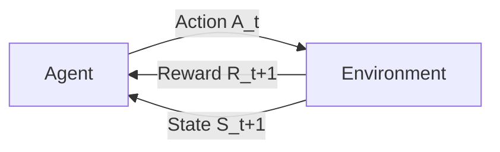

# Lecture 7: Midterm Review and DQN Training Results

## Midterm Coverage

> **Course note**: The midterm covers everything discussed so far: Q learning fundamentals, Gymnasium, Stable Baselines 3, and the core RL concepts. You will **not** be asked to derive the Bellman equation on the midterm.

Topics on the midterm *(from slide 3)*:
- **Reinforcement Learning Fundamentals**
- **Basic Q Learning with basic "homemade" environment class**
- **Gymnasium custom environment, Pygame rendering**
- **Q learning with Gymnasium CliffWalking**
- **Q learning deep dive**
- **Stable Baselines 3**
- David Silver's YouTube course is a resource but is not followed closely because it delves deep into math and derivations and never touches Gymnasium or Stable Baselines

---

## Step Size vs. Learning Rate

In supervised learning, we use the term **learning rate**. In reinforcement learning, the equivalent concept is called **step size** (denoted $\alpha$). Similarly, supervised learning uses **epochs** while RL uses **episodes**. Sutton uses these distinct terms deliberately as part of establishing RL as a distinct, third form of machine learning (not supervised, not unsupervised). The two pairs of concepts are related but not identical.

> **Key point**: RL terminology intentionally differs from supervised learning terminology. This reflects Sutton's effort to establish RL as its own discipline. Saying "epochs" in RL is incorrect. The correct term is "episodes."

---

## The Q in Q Learning

**Q** stands for the **action value function**. It is specifically about learning **value**, where value means the expected return (total expected future rewards) starting from a given state and taking a given action.

Why we care about the value function: the value function tells the agent about the reward for taking an action. If you base your policy on an optimal value function, you will take the optimal path.

### Optimal Control

**Optimal control** is the process of picking the action that takes the agent along the **optimal path** where reward is maximized.

**Bang bang control** analogy: Consider controlling a thermostat. When it is colder than the set temperature, you turn the furnace on. When the temperature goes above the set temperature, you turn it off. The temperature oscillates around the set point. Optimal control tries to keep the temperature right at the set temperature. This is fundamentally what RL is doing.

> **Course note**: The cliff walking game and optimal control are on the midterm. In cliff walking, the agent navigates a grid world toward a target while avoiding the cliff. The optimal path is the one that maximizes reward.

---

## Value Functions: Q(s, a) vs. V(s)

Both are value functions. **Value** means the total expected future rewards starting from a state. The formal word for "total expected future rewards" is **return**.

| Function | Name | Parameters | What It Measures |
|----------|------|------------|------------------|
| $Q(s, a)$ | **Action value function** | State $s$, Action $a$ | Expected return from state $s$ after taking action $a$ |
| $V(s)$ | **State value function** | State $s$ only | Expected return from state $s$ under a given policy |

The return $G_t$ is defined as the sum of discounted future rewards *(reconstructed)*:

$$G_t = R_{t+1} + \gamma R_{t+2} + \gamma^2 R_{t+3} + \dots = \sum_{k=0}^{\infty} \gamma^k R_{t+k+1}$$

where $\gamma$ is the discount factor and $R$ is the reward at each timestep.

---

## Policy

**Policy** ($\pi$): a mapping from state to action. In the simplest (deterministic) view, the policy tells the agent exactly which action to take in each state. More generally, a policy is a set of probabilities over actions for each state.

In our Q learning code, we implement the policy as **epsilon greedy**:

```python
# Epsilon-greedy policy (reconstructed)
if random.random() < epsilon:
    action = env.action_space.sample()  # explore: random action
else:
    action = np.argmax(Q_table[state])  # exploit: best known action
```

- **Epsilon** ($\epsilon$) is small, representing the fraction of time the agent picks a random action (exploration)
- The rest of the time, the agent picks the action with the highest Q value (exploitation)

### Interaction Between Policy and Value Function

- If you have the **optimal policy**, you will end up with **optimal values**
- If you have an **optimal value function** and base your policy on it, you will have an **optimal policy**
- The goal of Q learning is to learn the optimal value function, which gives us the optimal policy

---

## Q Learning Agent Structure

> **Key insight**: Once we implemented the Q learning agent in lab one, it basically stayed the same for lab one, lab two, and assignment one. The agent code barely changes across different environments.

### What the Agent Needs from the Environment

1. **Observation space**: the set of all possible states (e.g., 0 to 48 for cliff walking)
2. **Action space**: the set of all possible actions (e.g., 4 actions for cliff walking: up, down, left, right. In blocks world, actions go from 0 to 119)
3. **Q table**: created from the full knowledge of observation space and action space

For Q learning to work, we must fully know the action space and observation space. We don't need to know what distinguishes the states in detail, just that they exist as numbered indices.

### Required Environment Methods

Every Gymnasium environment must provide these methods to the agent:

| Method | Purpose |
|--------|---------|
| `reset()` | Initialize/reset the environment to a starting state |
| `step(action)` | Take an action, return next state, reward, done, info |
| `render()` | Display the environment visually |
| `close()` | Clean up resources |

### Agent Loop Skeleton

```python
# Q learning agent skeleton (reconstructed)
Q_table = initialize_q_table(observation_space, action_space)

for episode in range(num_episodes):
    state = env.reset()
    done = False
    while not done:
        action = select_action(state, Q_table, epsilon)  # policy
        next_state, reward, done, info = env.step(action)
        learn_from_step(Q_table, state, action, reward, next_state)  # Q update
        state = next_state
```

The only parts that change when the environment changes are the **observation space** and **action space**. The learning from step is standard Q learning.

---

## The Agent-Environment Interaction Diagram

> **Course note**: You need to be able to draw this diagram on the midterm. Think through the logic rather than just memorizing it.



The cycle:
1. The agent observes a state $S_t$
2. The agent selects an action $A_t$
3. The environment responds with a reward $R_{t+1}$ and a new state $S_{t+1}$
4. The agent selects the next action, and the cycle continues

This is the fundamental loop of all reinforcement learning.

---

## History, State, and Observation

**History** ($H_t$): the entire sequence of rewards, observations, and actions up to time $t$.

$$H_t = (S_0, A_0, R_1, S_1, A_1, R_2, \dots, S_t)$$

**State**: a function of the history. Different choices for this function:
- **Degenerate case**: the state IS the entire history (needed when you must make it Markov by including everything)
- **Ideal case** (what we usually use): the state is just the most recent observation, the last state in the history

**Observation**: the agent's view of the state. The agent may not see everything about the environment. Internal implementation details of the environment are hidden from the agent.

---

## The Markov Property

**Markov property**: a state is Markov if the probability of transitioning to the next state depends **only on the current state**, not on any previous states.

$$P(S_{t+1} | S_t) = P(S_{t+1} | S_1, S_2, \dots, S_t)$$

In plain terms: "The future depends only on the present, not on how we got here."

If **all states** in a sequence satisfy the Markov property, we have a **Markov chain**.

### Common Misconception

A quiz answer stated "the Markov property means the future state is dependent on the preceding states and from the initial state." This is **wrong**. The future state depends **only on the immediately previous state**, not on any states before that and not on the initial state.

### What If a State Is Not Markov?

If you discover your state representation is not Markov, you can usually **redefine the state** to make it Markov:
- Include previous states within the current state representation
- In the degenerate case, include the entire history in the state (this always works but may be impractical)
- For example, in the helicopter control problem, researchers made the state Markov by adding velocity information to the state representation

> **Practical tip** (from Robin, an industry practitioner): If your RL algorithm is having trouble converging, check that your states are actually Markov. Trying to learn with non-Markov states is a common source of failure.

**Block stacking example**: In our blocks world, the current block configuration is a Markov state. It does not matter how we arrived at that configuration. We just need to know the current arrangement and the target to decide what to do next.

One interesting edge case: in quantum mechanics, you cannot simultaneously measure velocity and position (Heisenberg uncertainty principle), which seems to prevent a Markov formulation. But apparently **quantum Markov chains** exist, suggesting there is always a way to find a Markov formulation, even if it is awkward and messy.

The entire mathematical basis for RL, including value function approximation, is built on **Markov Decision Processes (MDPs)**, which require Markov states. Non-Markov RL is discussed in later chapters of Sutton's textbook but is outside the scope of this course.

---

## Agent Components: Policy, Value Function, Model

An RL agent may include one or more of the following:

| Component | Description | Our Q Learning Agent |
|-----------|-------------|---------------------|
| **Policy** ($\pi$) | Mapping from states to actions | Epsilon greedy code |
| **Value Function** ($Q$ or $V$) | Expected return from states/actions | Q table |
| **Model** | Internal representation of how the environment works, used for planning | **Not present** |

### Models and Prolog

A **model** gives the agent knowledge about the environment, enabling **planning** (deciding on a course of action by reasoning ahead).

In the blocks world:
- The **environment** contains a Prolog model that determines what happens when an action is taken
- The **agent** has only a Q table and no model

**What if we gave the agent a Prolog model?**
1. The agent would know what **legal actions** are (by querying the model)
2. The agent could **plan**: take a target state and compute the action sequence to achieve it
3. Prolog would spit out the exact action sequence to reach the goal (as done in lab five)

> **Key insight**: If the agent has a complete Prolog model of the environment, it can plan directly to the goal and does not need reinforcement learning at all. This reveals the power of planning with logical models.

**Limitation of planning**: When the dimensionality gets out of hand, planning takes longer than the age of the universe. But for smaller tasks, you could at the very least use the model to see what actions are possible.

### Realistic Use of Models

In practice, the model is **simpler** than the actual environment. It would be cheating to give the agent a perfect copy of the environment. A realistic scenario:
- A **real world simulator** serves as the environment (e.g., a kitchen simulator)
- A **simplified Prolog model** of that world is given to the agent
- The agent uses the model for reasoning in concert with its value function and policy
- Reinforcement learning still drives the actual learning

**Sim-to-real transfer with models**: You might train an agent on a simplified Prolog model of a world, then keeping the agent the same, let it loose on the **real world** that you were modeling and see how it performs. For example, a company has a process that works a certain way. You come up with a Prolog model of that process, train your agent on it, and then deploy to the real environment. This is not guaranteed to work well and is an active research area.

**Agent-generated models**: An open research question is whether an agent could explore an environment and create its own model, deciding what fluents (state variables) to use to represent its interaction with the environment.

> A model does not have to be a logical model in Prolog. It could be any representation that gives the agent knowledge about the environment, including an LLM. But with Prolog, we have a **full** model where we can plan directly to the goal.

### Agent Taxonomy

Agents can be categorized by which components they have:

| Category | Components |
|----------|-----------|
| Value-based agent | Value function only (no explicit policy) |
| Policy-based agent | Policy only (no value function) |
| Actor-critic agent | Both policy and value function |
| Model-based agent | Includes a model (enables planning) |
| Model-free agent | No model (learns purely from experience) |

*(categories reconstructed from standard RL taxonomy)*

Planning is one of the key sub-problems in RL that arises when an agent has a model.

---

## RL as a Third Form of Machine Learning

Reinforcement learning is **not** supervised learning and **not** unsupervised learning. It is a distinct, third form of machine learning.

| Aspect | Supervised Learning | Unsupervised Learning | Reinforcement Learning |
|--------|--------------------|-----------------------|----------------------|
| Signal | Labeled examples | No labels | Scalar reward signal |
| Goal | Predict correct output | Find structure/patterns | Maximize cumulative reward |
| Feedback | Immediate, per example | None | Delayed, evaluative |

*(comparison table added for clarity)*

**Sutton's perspective**: Sutton has argued that LLMs are not the complete answer because they don't have goals, and that reinforcement learning is the answer because that is how humans learn. RL could be increasing in prominence in the future. It is already present in ChatGPT via **RLHF (Reinforcement Learning from Human Feedback)**, which is one of the controversies in AI because companies hire people in developing countries and do not pay them well for the painstaking work of providing human feedback.

---

## Scalar Reward Signal

The reward in RL is always a **scalar** (a single number), not a vector. This is sufficient because:
- The return is defined as a sum of rewards, which produces a scalar
- The value function outputs a scalar
- All of RL, including protein folding, works with a scalar reward signal

### The Reward Hypothesis

> **Course note**: There is a multiple choice question about the reward hypothesis on the midterm.

**Reward hypothesis**: All goals can be described as the **maximization of expected cumulative reward**.

Common wrong answers to watch for:
- ~~Minimized number of steps~~ (wrong)
- ~~Minimized reward~~ (wrong)
- ~~Maximized immediate reward~~ (wrong, this is the greedy approach)

The correct answer is: **maximized expected cumulative reward**.

### Why Not Be Greedy?

Being **greedy** means always choosing the action with the highest immediate reward. This is problematic because sometimes we need to take a short-term penalty to reach a more valuable state. Analogy: studying for two hours is a penalty, but you end up in a valuable state (having learned the material).

---

## Q Learning: Reward Design Discussion

### What Happens with Different Reward Schemes in Cliff Walking?

**Why does our CliffWalking example converge on the shortest path?** Because with $-1$ reward per step, every extra step is penalized. The agent learns to minimize the number of steps (while avoiding the $-100$ cliff), which produces the shortest safe path.

**Why does Sarsa converge on a different path?** *(from slides)* Sarsa is an **on-policy** algorithm, meaning it updates based on the action it actually takes next (including exploratory actions). Because the epsilon greedy policy occasionally takes random actions, Sarsa learns to stay away from the cliff edge to avoid the risk of a random step into the cliff. Q learning is **off-policy** and updates based on the best possible next action, so it learns the optimal (shortest) path right along the cliff edge.

| Reward Scheme | Effect |
|---------------|--------|
| $-1$ per step, $-100$ for cliff (current) | Agent learns to find shortest safe path because each step costs something |
| $0$ per step, $-100$ for cliff | Agent has trouble learning. Zero reward means no cost to taking a step, so the Q table barely changes. The Bellman equation update relies on the reward signal. |
| $+1$ per step, $-100$ for cliff | Agent is encouraged to wander forever, collecting $+1$ reward at each step instead of reaching the goal |

> **Key insight**: The reward signal design is critical. With zero step reward, the agent effectively learns nothing because the Q table does not change. With positive step reward, the agent is incentivized to never terminate the episode.

---

## Q Table Initialization

The Q learning algorithm says: **initialize Q with arbitrary values, except terminal states must equal zero**.

```
Initialize Q(s, a) arbitrarily for all s, a
Set Q(terminal, a) = 0 for all a
```

Why terminal states must be zero:
1. $Q(s, a)$ represents the **expected future reward** from state $s$
2. At a terminal state, there is no future, so the expected future reward is **zero**
3. These values never get updated during learning (they are already correct)
4. They do get **used** when the algorithm looks ahead to compute the max Q value for updating the previous state

> **Note**: The starter code in this course does not set terminal state values to zero and calls episodes "epochs." Both of these deviate from the standard Q learning algorithm.

In cliff walking, it does not matter much whether we initialize the terminal state to zero, but it is best practice because that is what the algorithm specifies.

---

## The Q Learning Update Rule (Bellman Equation)

> **Course note**: You may be asked to write down the Q table update in Python syntax and explain each variable. This question is worth significant marks.

The Q learning update rule:

$$Q(s, a) \leftarrow Q(s, a) + \alpha \left[ r + \gamma \max_{a'} Q(s', a') - Q(s, a) \right]$$

This can be rewritten as:

$$Q(s, a) \leftarrow (1 - \alpha) \cdot Q(s, a) + \alpha \left[ r + \gamma \max_{a'} Q(s', a') \right]$$

In Python *(exact syntax from slides)*:

```python
qtable[state][action] = qtable[state][action] + alpha * (reward + gamma * max(qtable[next_state]) - qtable[state][action])
```

| Variable | Meaning *(from slides)* |
|----------|---------|
| `qtable` | The table of action-values implementing the action-value function |
| `state` | The current state |
| `action` | The current action |
| `alpha` ($\alpha$) | Step size |
| `reward` | Reward received from taking action in state |
| `gamma` ($\gamma$) | Discount factor |
| `next_state` | The state resulting from taking action in state |

### Understanding the Step Size ($\alpha$)

The step size determines how much of the old Q value to keep vs. how much to update:

| $\alpha$ value | Behavior |
|------------|----------|
| $\alpha = 1$ | Throw away old Q value entirely. Only use new information. Maximum learning speed. The terms $(1 - \alpha) \cdot Q(s,a)$ disappear. |
| $\alpha = 0.5$ | Keep half the old value, take half the new value |
| $\alpha$ close to 0 | Learn very slowly, mostly keeping old values |

---

## Gymnasium

Two acceptable definitions for "What is Gymnasium?" *(from slides)*:

> **Gymnasium** is an **API standard for reinforcement learning with a diverse collection of reference environments**.

Or:

> Gymnasium is a **framework for creating Reinforcement Learning environments with a standard interface** such that various RL algorithms/agents can be applied to the environment in a standard way.

Install with `pip install gymnasium`.

Features:
- Provides **reference environments** (cart pole, cliff walking, and many more)
- Provides **wrappers** for modifying environments without altering the code directly

### Gymnasium Wrappers

From the Gymnasium docs *(on slides)*: "Wrappers are a convenient way to modify an existing environment without having to alter the underlying code directly. In order to wrap an environment, you must first initialize a base environment. Then you can pass this environment along with (possibly optional) parameters to the wrapper's constructor."

**Blocks world wrapper example**: The blocks world Python environment uses tuple actions `(block, destination)`. DQN requires actions to be a single integer (discrete space). A wrapper solves this:

```python
# Discrete action wrapper for blocks world (reconstructed)
class DiscreteActionWrapper(gym.ActionWrapper):
    def action(self, action):
        # Convert integer action to (block, destination) tuple
        block = action // num_positions
        destination = action % num_positions
        return (block, destination)
```

The wrapper does two things:
1. Translates the tuple action space into a simple **discrete action space** for the agent
2. Converts **integer actions** from the agent back into **tuples** for the environment

---

## Stable Baselines 3

Definition *(from slides)*:

> **Stable Baselines 3** is a set of **reliable** Reinforcement Learning algorithm implementations that includes features such as vectorized environments and callbacks.

Algorithms available include:
- **DQN** (Deep Q Network): uses a neural network to approximate the Q function
- **PPO** (Proximal Policy Optimization): a policy gradient method

Both DQN and PPO are used for **value function approximation**, which is needed when the state space is too large for a Q table.

### Q Learning vs. DQN

| Aspect | Q Learning | DQN |
|--------|-----------|-----|
| Value function | Exact (stored in Q table) | Approximated (stored in neural network) |
| State space | Must be small enough for a table | Can handle very large state spaces |
| Update | Direct Q table update | Train the neural network |
| Algorithm | Largely the same underlying logic | Largely the same underlying logic |

In Q learning, we deal with the real, exact value function in a Q table. But if there are $10^{60}$ states, we cannot make a Q table that big. Instead, we use a **neural network** to approximate the value function. The algorithm is quite similar after that: where we would have updated a Q table in Q learning, in DQN we train the neural network.

### Key Features of Stable Baselines 3

> **Course note**: If asked "what are two features of Stable Baselines 3?" know these.

1. **Vectorized environments**: running the algorithm on several copies of the environment at the same time
2. **Callbacks**: giving the programmer mechanisms to run custom code to do monitoring, auto saving, model manipulation, progress bars, etc.

---

## 6x6 Blocks World DQN Training Results

> **Key framing**: Real reinforcement learning is not just plugging Q learning into cliff walking and solving it, then moving on to cart pole with PPO and solving that. Real RL is dealing with **hard, unsolved problems** where convergence is not guaranteed. The 6x6 blocks world is a harder problem that demonstrates this reality. Even protein folding is this kind of hard RL problem.

### Setup

- Environment: blocks world with **6 blocks and 6 positions**
- Algorithm: **DQN** (Q learning cannot handle this because the state space is the **product** of current configurations multiplied by target configurations, resulting in a number far too large for a Q table)
- **200 step limit per episode**: after 200 steps, the episode ends and a new target is assigned
  - This is better for learning because it prevents the agent from spending millions of steps on a single episode just moving blocks back and forth
  - It forces exposure to many different target configurations

The code uses the **discrete action wrapper** to convert tuple actions to integers and back.

### Training Results (DQN run 14)

**Episode length**:
- From 0 to ~600 million steps: every episode was cut off at 200 (the agent could not solve any target within 200 steps)
- Gradually, premature cutoffs became less frequent
- Eventually, the agent always finished episodes before 200 steps by matching the target

**Reward**:
- 0 to 200 million steps: very low reward (minus thousands), but learning was happening
- Improvement became harder over time, with some regression
- Average reward settled around $-1000$, still quite low
- More work needed for reliable 6x6 performance

> **Course note**: You will not have to train a 6x6 blocks world in an assignment or lab. This demonstration is to show more realistic RL challenges. When block configurations are small enough, use Q learning. When there are too many states, use DQN.

### TensorBoard

**TensorBoard** provides the ability to **compare different training runs**. In the demo, DQN run 14 (blue) was compared with DQN run 13 (different color), which was cut off early but showed similar behavior.

### Random Seeds

To **reproduce a training curve exactly**, you must control the **random seed**. You need to start with exactly the same pseudo-random state. If you get a good result without controlling the seed, you cannot reproduce it, which is frustrating. Always set the random seed when you need reproducibility.

```python
# Setting random seed for reproducibility (reconstructed)
import numpy as np
import torch

seed = 42
np.random.seed(seed)
torch.manual_seed(seed)
env.reset(seed=seed)
```

---

## RL Applications in the Real World

| Application | Details |
|-------------|---------|
| **AlphaGo** | Computer vs. human Go. The AlphaGo movie shows the real development team at work during standup meetings. |
| **ANYmal robot** | Quadruped robot learns locomotion via RL. Starts by thrashing legs randomly. When it accidentally steps forward, big reward. Eventually learns to walk. |
| **Robotic Rubik's Cube** | RL agent solves a Rubik's Cube using a robotic hand. Actions are finger movements (e.g., "move this thumb a certain way"), not abstract cube rotations like "twist this side." There is an interesting **abstraction gap** between low-level finger angle movements and high-level reasoning about which color goes to which side. The details of how they set up that problem formulation are unknown but represent the kind of challenge advanced RL practitioners grapple with. |
| **Protein folding** | Solved using RL with a scalar reward signal. |
| **Cart pole** | Balancing a pole by moving left/right. Can be solved by optimal control without RL. |
| **Helicopters and drones** | Existed before RL was applied to them, solved by classical control theory. |

> RL is most valuable for problems where classical control theory is insufficient, such as high-dimensional or complex tasks.

---

## Looking Ahead

> **Course note**: After the midterm (in two weeks), the course will explore putting the **Create 3** robot into a **Gazebo** simulator and training it with reinforcement learning on simple tasks like cart pole. Gazebo is a simulator for RL environments.
