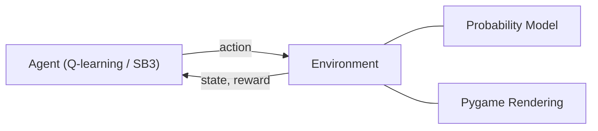
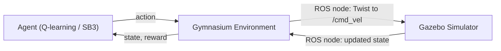
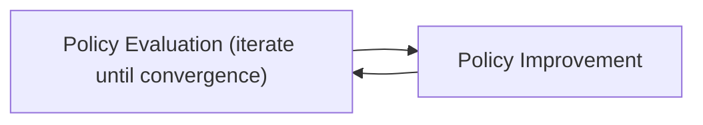

# Lecture 8: Gazebo, RViz, Dynamic Programming, and Monte Carlo

## New Tools in the Toolbox

The course has been using **Gymnasium** and **Stable Baselines 3** for reinforcement learning. This lecture introduces two new tools for working with the iRobot Create 3 in simulation:

| Tool | Purpose |
|------|---------|
| **Gazebo** | A 3D robotics simulator that models physics, sensors, and environments |
| **RViz** | A robot visualization tool for inspecting sensor data, topics, and robot state in ROS 2 |
| **Gymnasium** | RL environment API (already in use) |
| **Stable Baselines 3** | RL algorithm library (already in use) |

---

## Gazebo Simulator

### What Gazebo Does

Gazebo simulates robots in 3D environments with physics. When you launch Gazebo by itself, the default environment is a **warehouse**. The Ignition Gazebo version of the Create 3 simulator would place a Create 3 on the warehouse floor, but you can also load custom worlds such as the **Amazon Small House**.

### Gazebo Features

- A variety of **simulation plugins** are available, including physics engines, sensor models, and humanoid robot simulators
- The Create 3 does not require advanced physics features. It has mass but no flailing limbs and does not need to worry about balance or falling over
- More complex simulations (humanoid robots, quadruped robots that can fall over) are possible but not needed for this course
- Gazebo can simulate **actors** (moving objects or characters in the scene, such as a red ball moving back and forth or a person walking)

### Can You Use a Different Simulator?

A student asked whether Unreal Engine or Unity could be used instead of Gazebo. The simulation of the Create 3 has been built specifically for Gazebo. It may be portable to other simulators, but there would likely be porting work and adjustments required. For the course labs, Gazebo is the expected tool.

---

## Classic vs. Modern Gazebo

The Gazebo naming history is confusing because two distinct versions exist, and the newer one has been renamed multiple times.

| Version | Also Known As | Key Identifier |
|---------|--------------|----------------|
| **Classic Gazebo** | Gazebo 11 | The "11" or "classic" label |
| **Modern Gazebo** | Ignition Gazebo, Ignition Fortress, Ignition Harmonic, Gazebo Sim | No version number, or names like "Fortress," "Harmonic" |

- The **new** version of Gazebo originally launched as **Ignition Gazebo**
- Various releases of the new version were named **Fortress**, **Harmonic**, etc.
- Ignition Gazebo has since been renamed to just **Gazebo** (or **Gazebo Sim** to be specific)
- This creates confusion because "Gazebo" now refers to the new version, while the old version is "Gazebo 11" or "Classic Gazebo"

> **Course note**: Lab 3 uses **Classic Gazebo (Gazebo 11)** because the Amazon Small House world has not been ported to the new version of Gazebo yet. The Amazon Small House is the key environment we need, and it dictates the use of Classic Gazebo and the Humble version of ROS 2.

### Version Compatibility Table

| Ubuntu Version | ROS 2 Version | Gazebo Support | Create 3 Firmware |
|----------------|---------------|----------------|-------------------|
| **22.04** | **Humble** | Classic Gazebo 11 (supported), Modern Gazebo (supported) | Iron |
| **24.04** | **Jazzy** | Modern Gazebo only (Classic **not** supported) | Iron (compatible) |

- **Iron** is the firmware on the Create 3. It is one version behind Jazzy but is compatible with Jazzy
- If using Jazzy ROS 2, you can communicate with an Iron Create 3
- The course Create 3 robots are running on **Humble**, which is another reason to stay on Humble. However, this alone is not a hard constraint because Iron firmware is compatible with Jazzy
- The deciding factor is the **Amazon Small House**, which only works with Classic Gazebo. Classic Gazebo is not available on 24.04, so the course stays on **22.04 / Humble**

> **Course note**: Versions matter. 22.04 corresponds to Humble, 24.04 corresponds to Jazzy. You cannot run Classic Gazebo on 24.04. The labs are designed to use the correct versions.

---

## ROS Integration with Gazebo

### How the Integration Works

Gazebo has built-in **ROS integration** (both ROS 1 and ROS 2). When a Create 3 is simulated in Gazebo, the ROS 2 code written last semester will **just work**. The simulated Create 3 publishes and subscribes to the same ROS 2 topics as the real robot.

**Example**: If you put a Create 3 into Gazebo and then launch the AISD Vision module (which looks for a hand through the laptop camera), the simulated Create 3 will start receiving those Twist messages because of the ROS integration. It will react to those Twist messages inside the simulator, just as the real Create 3 reacts in the real world.

Running `ros2 topic list` on a system with a simulated Create 3 shows all the same topics (including `/cmd_vel`) that would appear with a real Create 3 attached *(added)*:

```bash
# List all ROS 2 topics from the simulated Create 3
ros2 topic list
```

The key insight is that there is no networking needed when running the simulation. The simulated Create 3 runs on the same laptop, so all ROS 2 communication stays local.

### Network Considerations (Real Create 3)

When working with a **real** Create 3 and the loaner laptop:

- The Create 3 and the loaner laptop sit on a **192.168.186.0/24** subnet (up to 256 hosts, but only two are present: the Create 3 and the laptop)
- Your personal laptop may connect via Wi-Fi to a Wi-Fi access point to reach the loaner laptop
- By default, ROS 2 messages broadcast over **both Wi-Fi and wired networks**

**The classroom problem**: In a room with 20 loaner laptops and 20 Create 3 robots, all broadcasting ROS 2 messages to `/cmd_vel`, any Create 3 can receive commands from any laptop. This generates massive confusion.

**Solutions**:
- Restrict ROS 2 communication to just the local subnet
- The simplest approach: **disable Wi-Fi temporarily** when working in the classroom

In your home, this is not a problem because there are no other ROS 2 nodes on the network.

---

## Reinforcement Learning Pipeline with the Create 3

### Current Pipeline (Before RL)

The existing pipeline from last semester connects these modules:

```mermaid
graph LR
    A[Image Publisher] -->|images| B[Hands Module]
    B -->|messages| C[Move Module]
    C -->|Twist messages| D[/cmd_vel]
    D --> E[Create 3 Moves]
```
*(reconstructed diagram)*

1. **Image Publisher** publishes camera images
2. **Hands Module** analyzes the images (detects hand gestures)
3. **Move Module** produces movement commands
4. **`/cmd_vel`** receives Twist messages
5. **Create 3** executes the movement

This entire pipeline was built before any reinforcement learning. The robot follows the finger through explicit control, not learning.

### Framing It as an RL Problem

To make the Create 3 **learn** to follow a finger instead of being explicitly programmed:

- **Environment**: whatever the image publisher sees (pictures of walls, the Amazon Small House, a hand, etc.)
- **Agent**: the modules that process observations and select actions
- **Reward**: not yet defined. A reward signal must be added
- **Step duration**: when a move command is issued, it takes time to complete. The next action should not be sent until the current one finishes

### Why Use a Simulator for RL?

There are several reasons to train in simulation rather than the real world:

1. **Speed**: you can simulate many training episodes much faster than real time
2. **Safety**: a real robot flailing randomly during early training could damage itself. In the simulator, collisions are not a problem
3. **Practicality**: training the Create 3 to follow a finger requires someone to physically provide the finger for every training episode. Simulating the finger removes this bottleneck
4. **Sim-to-real transfer**: the fundamental assumption is that a model trained in the simulator can be transferred to the real robot, and the real robot benefits from all the simulated training. It does smart things instead of random things

> Anton Raffin demonstrated real-world training with a quadruped robot that started by flailing its legs. This works if the robot will not damage itself, but it is not always feasible. A simulator is the general solution.

### Assignment 1 Architecture vs. Gazebo Architecture

**Assignment 1** (completed):


*(reconstructed diagram)*

- The **agent** runs Q-learning or a Stable Baselines 3 algorithm (DQN, PPO, etc.) and picks actions
- The **probability model** governs how the environment responds to actions
- **Pygame** handles rendering. If rendering is removed, the RL loop still works
- The only thing that changes between environments is the **environment ID**

**New architecture with ROS 2 and Gazebo**:


*(reconstructed diagram)*

- The **agent** stays the same (Q-learning, DQN, PPO do not change)
- The **Gymnasium environment** now contains a **ROS node** that communicates with another ROS node inside Gazebo
- When an action comes in, the environment sends it to `/cmd_vel`, which the simulated Create 3 picks up
- Once the Create 3 finishes moving, the environment receives the updated state

### Synchronization Between Agent and Simulator

With normal ROS 2 nodes, you call `spin()` and the node runs indefinitely until killed. For RL, this does not work because the agent and environment must be synchronized step by step.

The solution is to use **`spin_once()`** instead of `spin()`. The environment keeps calling `spin_once()` until the Create 3 finishes its current action (e.g., finishes turning). This ensures the simulation advances one step at a time, matching the RL loop's step structure.

```python
# Conceptual example of synchronized stepping (added)
import rclpy

rclpy.init()
node = rclpy.create_node('rl_env_node')

# Instead of rclpy.spin(node), use spin_once in a loop:
while not action_complete:
    rclpy.spin_once(node, timeout_sec=0.1)
    # Check if the Create 3 has finished executing the action
```

> **Key insight**: We are not starting up the world and letting it spin forever. We are carefully spinning it one step at a time to handle the synchronization between the RL agent and the Gazebo simulator.

---

## Setting Up the Create 3 Simulator

### Repository and Branch Selection

The **Create 3 Simulator** is a GitHub repository. The default branch is **Jazzy**, which is too new for our purposes.

How to tell you are on the wrong branch:
- The prerequisites mention Jazzy
- It only supports Gazebo Harmonic (the new Gazebo)
- There is no mention of Classic Gazebo

**Solution**: Select the **Humble** branch, or when cloning, check out the Humble branch:

```bash
# Clone and check out the Humble branch (reconstructed)
git clone https://github.com/iRobotEducation/create3_sim.git
cd create3_sim
git checkout humble
```

### Installation Steps

1. **Install VCS tool** (if not present):
   ```bash
   pip install vcstool
   ```

2. **Install Gazebo 11** (Classic Gazebo):
   ```bash
   # The lab document provides the specific command
   sudo apt install gazebo11 libgazebo11-dev
   ```
   *(reconstructed, refer to lab document for exact command)*

3. **Install dependencies** (will feel familiar from CST 8504):
   ```bash
   # From your workspace root
   rosdep install --from-paths src --ignore-src -r -y
   ```
   A common issue: this command may fail and tell you to run `rosdep init` and `sudo rosdep update` first. After running those, **come back and run the dependency installation again**, because it did not complete successfully the first time. This is confusing because the dependency installation takes a long time, and you may forget to re-run it.

4. **Build the workspace**:
   ```bash
   # Export the ignition version (works for both Classic and Modern)
   export IGNITION_VERSION=fortress
   
   # Build
   colcon build
   ```

5. **Install the Amazon Small House** (Classic Gazebo only):
   ```bash
   # Clone the AWS Small House repository, then build it
   # Refer to the lab document for the exact repository URL and commands
   ```

### Workspace Structure

The Create 3 simulation goes in a **separate workspace** from your existing ROS 2 workspace. If you already have a ROS 2 workspace with your AISD Vision modules, create a new one for the Create 3 simulator:

```
~/create3_ws/          # New, separate workspace
├── src/
│   ├── create3_sim/   # Create 3 simulator repository
│   └── aws_small_house/ # Amazon Small House world
├── build/
├── install/
└── log/
```
*(reconstructed)*

This keeps the simulation workspace independent from your existing code.

---

## Demo: Create 3 in the Amazon Small House

### Launching the Environment

After building the workspace, source the setup and launch:

```bash
source install/setup.bash
# Launch command provided by the Create 3 Simulator
# (use the launch file that brings up the Small House world)
```

This launches both **RViz** and **Gazebo** simultaneously, handled by the Create 3 Simulator's launch files.

### What You See

**In RViz**:
- The Create 3 robot is visualized
- A red rectangle represents the camera that has been added to the robot
- You can add camera feed displays using the **Add** button at the bottom

**In Gazebo**:
- The Amazon Small House world with furniture (kitchen table, chairs, chandelier, pictures on walls, tiled floors)
- The Create 3 robot sitting on its dock
- In the demo, actors were present (a red ball moving back and forth, a person walking around), but these are added later as part of the assignment. In Lab 3, it is just the Create 3 in the Small House

**Perspective controls** in Gazebo allow you to view from above, rotate, and explore the environment.

### Camera View

Initially, the Create 3 sits on its dock facing a wall. The camera view in RViz shows:
- A white wall
- The tiled floor
- A small black nub at the bottom of the frame (the top of the dock)

### Undocking and Exploring

To see more of the house, undock the Create 3 using the ROS 2 action command:

```bash
# Undock the Create 3 (from the Create 3 docs: software examples > actuators > command line > docking)
ros2 action send_goal /undock irobot_create_msgs/action/Undock {}
```
*(reconstructed from Create 3 documentation)*

After undocking, the Create 3 pulls out of the dock and turns around. The camera feed in RViz shows the house interior: pictures on the wall, the table and chairs, and (in the demo) the red ball actor.

You can cross-reference the **Gazebo top-down view** with the **RViz camera feed** to confirm they show the same scene. For example, looking at the Gazebo overhead perspective, the Create 3 is facing a certain direction. In RViz, the camera feed shows what is in that direction (e.g., the chair on the right appears in both views). This illustrates how the two tools complement each other: Gazebo gives you the god's-eye view of the simulation, while RViz shows you what the robot's sensors actually perceive.

### Driving and Colliding

You can drive the Create 3 forward using Twist messages:

```bash
# Drive forward (example: publish a linear velocity)
ros2 topic pub /cmd_vel geometry_msgs/msg/Twist "{linear: {x: 0.5}, angular: {z: 0.0}}"
```
*(reconstructed)*

In the demo, driving the Create 3 five metres forward caused it to collide with a chair. This illustrates **why you use a simulator**: in simulation, collisions cause no damage.

### Infrared and Docking

- The dock emits an **infrared beam** that the Create 3 uses to locate the dock
- This appears as blue lines in the Gazebo visualization
- To dock, rotate the Create 3 to face the dock (e.g., rotate 1.57 radians for a quarter turn) and issue the dock command
- The Create 3 will zero in on the infrared signal and dock itself

> **Course note**: The end of Lab 3 is reaching this state: a Create 3 in the Amazon Small House that you can drive around. This is the first step towards doing reinforcement learning in this simulated environment. The actors (red ball, walking person) come later as part of the assignment.

---

## Adding a Camera to the Create 3

The camera is added using robot description file formats. The code to do this is provided.

### File Formats

| Format | Full Name | Purpose | Used By |
|--------|-----------|---------|---------|
| **URDF** | Unified Robot Description Format | Describes robot structure, joints, sensors | ROS ecosystem |
| **SDF** | Simulation Description Format | Describes simulation elements for Gazebo | Gazebo |
| **Xacro** | XML Macro Language | Macro system to simplify and template URDF/SDF files | Both |

- Both URDF and SDF are **XML-based** languages
- URDF files are written using **Xacro** macros (file extension `.xacro`)
- The **build process** converts URDF/Xacro into SDF for Gazebo to consume

> **Course note**: The course does not go into URDF details, but there is extensive documentation available for both URDF and RViz. For now, the key skill is knowing how to add the camera. There is much more that these tools can do.

### Credit

Amazon and **iRobot** created the Gazebo Create 3 simulation and the Amazon Small House world. iRobot is going into bankruptcy protection, but their contributions to this simulation ecosystem remain valuable.

---

## Dynamic Programming

> **Course note**: Dynamic programming is covered in chapters 4 and 5 of the textbook. These chapters were skipped earlier and are now revisited. Understanding these terms is important for the quiz: **policy evaluation**, **policy improvement**, **policy iteration**, and **value iteration**.

### What Is Dynamic Programming?

**Dynamic programming (DP)** is a **collection of algorithms** for solving reinforcement learning problems. It is not a single algorithm. These algorithms are similar to what we have already been doing but with one critical difference: **DP requires full knowledge of the environment**.

Key characteristics that distinguish DP from Q-learning:

| Feature | Dynamic Programming | Q-learning |
|---------|-------------------|------------|
| Environment knowledge | **Full** (all states, transitions, rewards known) | **Partial** (learns from experience) |
| Update method | **Full sweep** of all states at once | **Incremental** updates along episode paths |
| Agent explores? | No. The algorithm computes over the entire state space | Yes. An agent takes actions and observes results |
| Model requirement | Requires a **perfect model** of the environment | **Model-free** (bootstraps from experience) |

> **Key insight**: With dynamic programming, there is no little agent scurrying around in the world. Instead, an algorithm sweeps the entire world all at once. For every state, we can look up the reward without having to try it. This is why DP requires full knowledge of the environment.

### Policy Evaluation

**Policy evaluation** computes the **state value function** $V_\pi(s)$ for an arbitrary (not necessarily optimal) policy $\pi$.

**Process**:
1. Start with arbitrary values for all states
2. For every state, compute the expected value by following the policy and applying the **Bellman equation**
3. Repeat this full sweep until the differences between iterations become small (convergence)

The Bellman equation used for iterative policy evaluation *(reconstructed)*:

$$V_{k+1}(s) = \sum_{a} \pi(a|s) \sum_{s', r} p(s', r | s, a) \left[ r + \gamma V_k(s') \right]$$

where:
- $\pi(a|s)$ is the probability of taking action $a$ in state $s$ under policy $\pi$
- $p(s', r | s, a)$ is the transition probability (known in DP)
- $\gamma$ is the discount factor
- $V_k(s')$ is the value of the next state from the previous iteration

**Example**: Suppose the policy is "always go up." Policy evaluation would compute, for every state in the grid, what the expected return is if the agent always goes up. After enough iterations of the Bellman equation across all states, the values converge and you know the value function for that policy. You have **evaluated** that policy.

### Policy Improvement

**Policy improvement** takes a value function and produces a **better policy** by making the policy **greedy** with respect to the value function.

$$\pi'(s) = \arg\max_{a} \sum_{s', r} p(s', r | s, a) \left[ r + \gamma V_\pi(s') \right]$$
*(reconstructed)*

If we make the policy greedy with respect to the current value function, the resulting policy is guaranteed to be at least as good as (and usually better than) the previous one.

### Policy Iteration

**Policy iteration** alternates between policy evaluation and policy improvement:

1. **Evaluate** the current policy (run the Bellman equation to convergence)
2. **Improve** the policy (make it greedy with respect to the new value function)
3. Repeat steps 1 and 2


*(reconstructed diagram)*

**Drawback**: Each cycle requires a **full policy evaluation**, which means iterating the Bellman equation across all states until convergence. This is computationally expensive. Then you improve, then you do the full evaluation again, then improve again, and so on. Policy iteration eventually converges to the **optimal policy**.

### Value Iteration

**Value iteration** is very similar to policy iteration but more efficient. Instead of running policy evaluation to full convergence, it performs **only one iteration** of the Bellman update before making the policy greedy.

$$V_{k+1}(s) = \max_{a} \sum_{s', r} p(s', r | s, a) \left[ r + \gamma V_k(s') \right]$$
*(reconstructed)*

Notice this combines the evaluation and improvement into a single update by taking the $\max$ over actions directly.

**Process**:
1. Do **one sweep** of the Bellman update across all states (not until convergence)
2. Make the policy greedy with respect to the results
3. Do another single sweep
4. Make the policy greedy again
5. Repeat

### Summary of DP Algorithms

| Algorithm | What It Does | Convergence |
|-----------|-------------|-------------|
| **Policy Evaluation** | Computes $V_\pi(s)$ for a given policy $\pi$ by iterating the Bellman equation until convergence | Converges to the true value function for $\pi$ |
| **Policy Improvement** | Creates a better policy by making it greedy w.r.t. the current value function | One step (no iteration) |
| **Policy Iteration** | Alternates full policy evaluation and improvement | Converges to optimal policy (slower per cycle) |
| **Value Iteration** | Alternates single-step evaluation and improvement | Converges to optimal policy (faster per cycle) |

> **Key insight**: Policy iteration does **all** of the evaluation until convergence, then improves. Value iteration does **one** evaluation step, then improves. Both converge to the optimal policy, but value iteration avoids the cost of full convergence at each step.

### Visualization: Cliff Walking with DP

A Jupyter notebook is available in the slides area on Brightspace that demonstrates dynamic programming applied to **cliff walking**. When run, it prints out a **series of tables** showing the policy and values at each iteration.

> **Course note**: There is a Jupyter notebook for DP on Brightspace in the slides area.

**How the visualization works**:

1. **Initial state**: The policy assigns equal probability to all directions for every state. We can see the whole world at once because DP has full knowledge
2. **After one sweep**: The policy begins to change. Changes emanate from the **terminal state** outward
3. **Subsequent iterations**: Each iteration, the region of updated values grows. Changes on the edges of the updated region affect neighboring states in the next iteration
4. **Final policy**: After convergence, the policy shows the optimal direction for every state. For example, "if you are in this square, go up" or "if you are here, it does not matter whether you go left or right"

This contrasts with Q-learning, where updates happen **along episode paths** (updating cells as the agent moves, then starting a new episode on a possibly different path). DP does a **whole sweep of the world** each iteration.

*(additional example)*: Imagine a 4x4 grid world. Q-learning would have an agent walk through the grid, updating Q-values for the specific states it visits. DP would compute new values for all 16 states simultaneously in each iteration, like filling in an entire spreadsheet at once rather than cell by cell.

---

## Dynamic Programming vs. Q-Learning

| Aspect | Dynamic Programming | Q-Learning |
|--------|-------------------|------------|
| Knowledge required | Full model of environment (all transitions and rewards) | No model needed (learns from experience) |
| Update strategy | Full sweep of all states each iteration | Updates one state-action pair per step |
| Agent interaction | No agent. Pure computation over known dynamics | Agent actively explores the environment |
| Practical use | Not practical when the environment is unknown | Works in real-world and simulated environments |
| Theoretical relationship | Foundation that Q-learning builds upon | Bootstraps, estimating values from partial information |

> **Key insight**: We would not use dynamic programming in practice for our work because we rarely have full knowledge of the environment. But the theory of Q-learning is based on dynamic programming. Understanding DP helps you understand why Q-learning works.

---

## Monte Carlo Methods (Preview)

Monte Carlo methods will be covered in detail next lecture. The key idea:

- **No learning happens during an episode**. The agent runs an entire episode from start to finish
- After the episode ends, the agent **backtracks** through the episode and learns from the outcomes
- This is fundamentally different from Q-learning (which updates during the episode) and from dynamic programming (which does not use episodes at all)

> **Course note**: Monte Carlo methods will be covered in the next lecture.
