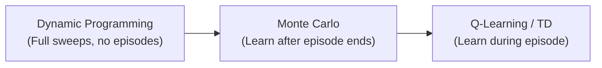

# Lecture 9: Dynamic Programming, Monte Carlo, Off-Policy vs On-Policy, and DQN Blocks World

## Policy and Value Function Relationship

The policy and the value function are very closely linked in Q-learning. If we change the policy, then the value functions change in general. In Q-learning, the policy involves the Q-function, so it is sort of like a recursion.

In our Q-learning code, the epsilon-greedy policy selects the action with the highest value in the Q-table (the greedy part). The Q-table **is** the Q-function. So the policy depends on the value function, and the value function is updated based on experiences gathered under that policy.

> This tight coupling between policy and value function is not an accident. It is a direct result of the ideas from dynamic programming and Monte Carlo that lead to Q-learning.

### Any Policy Can Be Evaluated

A policy does not have to be good. "Always go up" is a valid policy. It is not the optimal policy, but it could be evaluated. To evaluate it, we would do a sweep of the world and see what the value functions end up being given that policy.

The reason we do not spend time on arbitrary policies is that we are automatically interested in the **optimal policy**:
- The best policy gives us the best value functions
- If we have an optimal value function, it is easy to decide the best action: just pick the action that maximizes the value
- Q-learning does both simultaneously: it updates the Q-table **and** uses the Q-table to select actions, performing policy/value iteration on the fly

> **Course note**: You will get multiple choice questions about these statements. There will be four or five similar statements and you need to pick the correct one. You need to know these well enough to distinguish the distractors.

---

## QUIZ STUDY GUIDE: Dynamic Programming and Monte Carlo

> **Course note**: The in-class quiz next week is based on the definitions below. The questions are **multiple choice** with four or five **very similar statements** as options. You must pick the correct one. The distractors are deliberately close in wording, so you need to know these definitions precisely enough to tell them apart. The quiz covers the DP family (slide 17) plus Monte Carlo.

The following table is the core material. Study it until you can reproduce it from memory and spot a wrong word in any row.

| Concept | Definition (precise wording matters) |
|---------|--------------------------------------|
| **Dynamic Programming** | A collection of algorithms to compute optimal policies **given a perfect model** of the environment |
| **Policy Evaluation** | Compute the state-value function $v$ for an arbitrary policy. **Iteratively** use the Bellman Equation to update the value function. **Keep doing this** until differences from the previous iteration are "small." |
| **Policy Improvement** | Make the policy **greedy** with respect to the new value function |
| **Policy Iteration** | Iterate policy evaluation and policy improvement. Drawback: each of its iterations involves a full policy evaluation. |
| **Value Iteration** | Like Policy Iteration, **but** Policy Evaluation is stopped after **one** iteration |
| **Monte Carlo** | Does **not** require a model. Based on **averaging sample returns**. Complete an episode, then record returns. All episodes **must terminate**. |
| **Exploring Starts** | Begin each episode in a random state with a random action. Cannot be used with real environments. |
| **Epsilon-soft** | Policies with a nonzero probability of selecting **all** actions in each state |
| **Epsilon-greedy** | An example of an epsilon-soft policy: either random (probability $\epsilon$) or greedy (probability $1 - \epsilon$) |

Key distinctions to watch for in distractors:
- **Policy Iteration** does full evaluation (many sweeps). **Value Iteration** does only **one** sweep of evaluation. This is the only difference.
- **DP** requires a perfect model. **MC** does not (it learns from sample episodes).
- **MC** learns **after** the episode ends. **Q-learning** learns **during** the episode.
- **MC** does not bootstrap. **Q-learning** and **DP** do bootstrap.
- **Exploring starts** cannot be used with real environments. **Epsilon-greedy** is the alternative.

---

## Dynamic Programming (DP)

**Dynamic programming** is not one algorithm. It is a **family of algorithms** used to compute optimal policies **given a perfect model** of the environment (i.e., DP requires knowing the results of actions in advance).

The name comes from Richard Bellman:
- **"Dynamic"** refers to the fact that the policy can change as the algorithms run
- **"Programming"** refers to the policy itself (what action to take in each state), not programming in the software sense (not C, Python, etc.)
- Bellman chose the name because "dynamic" sounded nice, and in his era everyone was already talking about "programming"

### Policy Evaluation

**Policy evaluation**: compute the state-value function $v$ for an arbitrary policy. **Iteratively** follow the policy, use the **Bellman Equation** to update the value function, and **keep doing this** until differences from the previous iteration are "small."

With dynamic programming, we do not need to run episodes and follow paths. Instead, we do a **complete sweep through the entire state space**.

#### The In-Place Update Concern

There is an ambiguity: if the policy depends on the value function, then as we update values during a sweep, we might also be changing the policy mid-sweep.

Two approaches:
1. **Two-copy approach**: keep a static copy of the old value function. Evaluate the policy using the old copy. Build a new value table. When the sweep finishes, swap the new one in.
2. **In-place approach**: update the single value table as you go, even though the policy might shift during the sweep.

The Q-value table can be pictured similarly to the grid world itself. With the two-copy approach, we have the old table and build a new one, then swap.

**Key result**: it turns out it does not matter which approach you use. Both converge to the same optimal value function and optimal policy. The practical experience is that you converge to the same thing anyway.

However, you must keep iterating. When you change the value function, the policy (which is based on the value function) also changes. You keep sweeping until there are no more changes in the value function.

### Policy Improvement

After policy evaluation converges (the value function stops changing), there is a profound step: **make the policy greedy with respect to the new value function**. This can make the policy much better all in one go, but it will not necessarily make it optimal yet.

### Policy Iteration

**Policy iteration**: repeatedly alternate between:
1. **Policy evaluation** (sweep until values converge)
2. **Policy improvement** (make policy greedy w.r.t. new values)

Stop when the policy does not change more than a given threshold. This process finds the optimal policy.

**Drawback** *(from slide 17)*: each iteration of policy iteration involves a full policy evaluation, which itself requires many sweeps until convergence. This makes it computationally expensive.

- The optimal policy is denoted $\pi^*$
- If we have $\pi^*$, we get optimal value functions $V^*$ and $Q^*$

### Value Iteration

**Value iteration** is the same as policy iteration, except we do only **one** iteration of policy evaluation before doing policy improvement.

| Method | Policy Evaluation | Policy Improvement |
|--------|------------------|--------------------|
| **Policy Iteration** | Sweep until value function converges (many iterations) | Then improve policy. Repeat both until stable. |
| **Value Iteration** | Do **one** sweep only | Then improve policy. Repeat both until stable. |

> The difference is just one word: policy iteration does full evaluation, value iteration does one iteration of evaluation.

### Connection to Q-learning

After looking at value iteration, the lecturer asks: "Does this seem anything like Q-learning at all?" The connection: value iteration does **one** sweep of evaluation and then improves the policy. Q-learning takes this even further by updating the value after **one step** and immediately using that updated value. Q-learning is essentially doing value iteration on the fly, one transition at a time, rather than sweeping through the entire state space.

> **Resource** *(from slide 18)*: `dynamic.ipynb` on Brightspace implements iterative value iteration on Cliff Walking.

### DP Visualization (Cliff Walking Demo)

Dynamic programming does not have an agent running around. It performs sweeps through the entire world:
- After the first sweep, only states near the terminal state have meaningful values
- With more sweeps, the "attractiveness" of the terminal state fans out backward through the grid
- Four arrows in all directions at a cell means there is no preference between actions yet
- The region of informed policy grows with each sweep until it stops changing
- Once it converges, the result is a complete optimal policy for every state

### Policy vs. Q-Table

A **policy** shows one arrow per state (the best action to take). A **Q-table** shows **four values per state** (one for each action). The policy is derived from the Q-table by picking the max, but they are not the same thing.

*(reconstructed visualization)*

```
Policy (one arrow per cell):       Q-Table (four values per cell):
┌───┬───┬───┐                      ┌─────────────┬─────────────┐
│ → │ → │ ↓ │                      │ U:-5 D:-8   │ U:-3 D:-6   │
│   │   │   │                      │ L:-7 R:-2   │ L:-5 R:-1   │
├───┼───┼───┤                      ├─────────────┼─────────────┤
│ ↑ │ → │ ↓ │                      │ U:-2 D:-9   │ U:-4 D:-7   │
│   │   │   │                      │ L:-6 R:-3   │ L:-8 R:-2   │
└───┴───┴───┘                      └─────────────┴─────────────┘
```

---

## Monte Carlo (MC) Methods

Dynamic Programming required knowing the model in advance (the results of actions). Monte Carlo methods do **not** require a model. Instead, MC methods are based on **averaging sample returns**: complete an episode and afterwards, record the returns such that returns are averaged over time *(from slide 19)*.

### How Monte Carlo Differs from Q-learning

Monte Carlo would **not** be updating the Q-table during the episode like Q-learning would. It gets to the **end** of the episode, and that is when it backs up and updates the Q-table with the information that it learns.

The process:
1. Run a complete episode from start to termination
2. When the episode ends, **back up** from the terminal state
3. Update Q-values using accumulated rewards from the episode
4. Start a new episode, which explores more of the world
5. Repeat

Monte Carlo is getting closer to Q-learning in the sense that it uses the same kind of **Bellman equation** to do the updates. The difference is just **how** and **when** it updates.

### Major Limitation: Episodes Must Terminate

All episodes **must terminate** for Monte Carlo to work. You cannot do Monte Carlo unless the episode terminates, because the termination of the episode is when the learning starts (you back up from there).

### Information Propagation: MC vs. Q-learning

With Q-learning, meaningful direction does not appear until the agent reaches the target state. The target state is special: it has zeros for all four action values, which are greater than the initial negative values everywhere else. As soon as the agent reaches the terminal state:
- The nearby cells (especially the one the agent came from) start pointing toward the terminal state
- With more episodes and updates, the "attractiveness" spans outward from the terminal state

Monte Carlo behaves similarly: it does not even begin learning until it reaches the terminal state, then it starts backing up.

**The advantage of Q-learning (bootstrapping)**: Q-learning bootstraps, meaning it does not wait until the end of the episode to learn. It can learn about the cliff even before reaching the terminal state for the first time. This is one of the **big disadvantages of Monte Carlo**: it cannot learn anything until the episode terminates.

> In Q-learning, the agent learns **during** the episode. In Monte Carlo, the agent learns **after** the episode.

### First Visit vs. Every Visit Methods

When an episode has **cycles** (the agent revisits a state), there are two approaches for backing up:

| Method | Behavior |
|--------|----------|
| **First Visit MC** | Back up only to the **first** time a state was visited. Update the value for that cell using returns from the first visit onward. |
| **Every Visit MC** | Average the returns from **every** time the agent visited that state during the episode. |

> **Course note**: You will not be asked about the calculation details of first visit vs. every visit. You just need to understand that the distinction exists and what it means conceptually.

### Ensuring Full State Coverage

In some grid worlds, there might be a massive reward (e.g., one billion dollars) hidden somewhere. To guarantee finding it, we need every state and every action in every state to be tried.

#### Exploring Starts

**Exploring starts**: every time an episode begins, start in a **random state** and take a **random action**. If done an infinite number of times, you are guaranteed to visit every action in every state.

**Drawback**: this is not how real environments work. In Cliff Walking, we always start at the fixed start position. Environments generally do not allow random starting positions.

#### Epsilon-Soft and Epsilon-Greedy Policies

When we cannot use exploring starts (because the environment has a fixed start), we instead use policies that have built-in randomness:

- **Epsilon-soft policy**: any policy where there is a non-zero probability of selecting **every** action in every state (some minimum randomness everywhere)
- **Epsilon-greedy policy**: a specific type of epsilon-soft policy where the agent either takes a **random** action (with probability $\epsilon$) or takes the **greedy** action (with probability $1 - \epsilon$)

The epsilon-greedy policy used in Q-learning *(reconstructed)*:

```python
def epsilon_greedy(state, Q_table, epsilon):
    if random.random() < epsilon:
        action = env.action_space.sample()    # random action (explore)
    else:
        action = np.argmax(Q_table[state])    # greedy action (exploit)
    return action
```

How it works:
1. Pick a random number between 0 and 1
2. Compare it to epsilon (a small number)
3. If the random number < epsilon: pick a random action (degree of randomness)
4. Otherwise: pick the greedy action (maximize current value table)

Because epsilon is small, most of the time the agent is greedy. But with enough steps, even a small epsilon guarantees that as the number of steps goes to infinity, every state-action pair is visited.

> This is how Monte Carlo can also guarantee finding the "billion dollars" without using exploring starts, and it is the same mechanism used in Q-learning.

### Monte Carlo Backup Process

After the episode ends, the agent backs up and updates the Q-table just until the **first change**. It only makes one change each time it backs up. As it backs up, it encounters values that match what is already stored, and when it reaches a new value, it updates and stops.

### Monte Carlo Demo (Cliff Walking)

> **Resource** *(from slide 21)*: `monte_carlo.ipynb` on Brightspace implements the algorithm on Page 111 of the Sutton & Barto textbook.

The Monte Carlo algorithm (from Sutton & Barto page 111) on the Cliff Walking world:
- Initializes the Q-table to zeros
- Maintains a separate table for weighted averaging
- Visually similar to Q-learning heading toward the goal, but the key difference: the **numbers do not change until the agent comes back** from the terminal state
- Every time the agent reaches the terminal state, it backs up and learns a little bit
- With an epsilon-greedy policy and infinite episodes, it will visit every state

**Monte Carlo is not as good as Q-learning** because Q-learning is the next step in the progression. With Q-learning, the agent starts learning and exploring right from the beginning of the first episode. In Q-learning, values change **during** the episode. With enough episodes, it converges on the optimal policy.

---

## Comparing the Three Methods



*(added)*

| Feature | Dynamic Programming | Monte Carlo | Q-Learning |
|---------|-------------------|-------------|------------|
| Requires model of environment? | Yes, requires a **perfect model** (knows results of actions in advance) | No, learns from **sample returns** | No, learns from **sample transitions** |
| When does learning happen? | After complete sweep of all states | After episode terminates | During the episode (every step) |
| Bootstrapping? | Yes | No | Yes |
| Episodes must terminate? | N/A (no episodes) | Yes | No |
| Visualization | Attractiveness fans out from goal over sweeps | Agent runs, then backs up from terminal state | Agent learns as it goes, values change in real time |

---

## Off-Policy vs. On-Policy

### Q-Learning is Off-Policy

Q-learning is an **off-policy** algorithm. The reason: the learning update uses the **max** value (the greedy/optimal action), but the agent **follows** the epsilon-greedy policy (which includes random actions).

- **What it learns**: the optimal policy (always take the best action)
- **What it follows**: epsilon-greedy (sometimes random)
- It is learning **one** policy while following a **different** policy

This is how Q-learning can learn optimal behavior while still exploring. The optimal policy will hug the cliff (shortest path), but the exploration gives the agent the ability to discover rare high-reward states.

### SARSA is On-Policy

**SARSA** (State, Action, Reward, State', Action') is an **on-policy** algorithm. It learns the policy that it is actually following.

The critical difference is **A-prime** ($A'$). In SARSA, the update does not use **max**. Instead, it **chooses the next action using the epsilon-greedy policy** and uses that value in the update. So it is using the same policy that it is improving.

The update equations *(reconstructed)*:

**Q-learning (off-policy)**:
$$Q(S, A) \leftarrow Q(S, A) + \alpha \left[ R + \gamma \max_{a} Q(S', a) - Q(S, A) \right]$$

**SARSA (on-policy)**:
$$Q(S, A) \leftarrow Q(S, A) + \alpha \left[ R + \gamma Q(S', A') - Q(S, A) \right]$$

where $A'$ is the action chosen by the current epsilon-greedy policy (not the max).

### Cliff Walking Behavior Difference

| Algorithm | Learned Path | Why |
|-----------|-------------|-----|
| **Q-learning** (off-policy) | The **red path**, hugging the cliff as close as possible | It learns the optimal policy (shortest path), regardless of the exploration policy it follows |
| **SARSA** (on-policy) | The **safe path**, staying far from the cliff | It learns the epsilon-greedy policy. Since epsilon can cause random actions, it learns to stay away from the cliff to avoid randomly falling off |

- With Q-learning, you learn the optimal path but **pay the price** if a rare random action sends you off the cliff
- With SARSA, the agent learns to keep its distance because it knows its own policy includes randomness

> **Course note**: The quiz next week will have lots of multiple choice questions based on the dynamic programming family of algorithms and Monte Carlo. Know the text on the slides well enough to distinguish distractors.

---

## DQN Training on Blocks World

### Training Results

A DQN was trained on a **6 by 6 Blocks World** (6 table positions, 6 blocks), which produces a very large action space. A Python Blocks World gymnasium environment is available on Brightspace.

Results across approximately three runs:
- **Episode length**: starts at 200 (the max cap), gradually decreases to below 200 as the agent improves
- **Reward mean**: goes from -15,000 up to around -1,000 and is still increasing
- On a **Mac Studio with 64 GB RAM**: the process gets killed at ~750 million steps due to memory usage
- On an **RTX 4070 machine**: same memory issue after many episodes
- A 5x5 configuration run got above zero reward before being killed
- One run lasted almost **5 days** before being killed

> The training is heartbreaking because the agent gets killed right as it is starting to actually learn.

### TensorBoard Monitoring

**TensorBoard** is set up in the CST 8509 Blocks World code to log training metrics:

```bash
# Launch TensorBoard to monitor training (reconstructed)
tensorboard --logdir logs
```

This starts a web interface at `localhost:6006` where you can view episode length, reward curves, and other metrics in real time while training progresses.

The DQN setup involves tuning many hyperparameters (batch size, learning rate, etc.) to try to get better training curves.

### Why DQN Fails: Too Many Actions

The DQN struggles because the action space is enormous. For example, in a configuration with blocks stacked as A, B, C, D, E, F, actions like "move B from position E to position X" are still valid actions in the action space, even though they are **physically impossible** in the current state. The agent gets penalized for impossible actions but must still learn they are impossible.

> A PPO paper states: "Q-learning with function approximation fails on many simple problems and is poorly understood."

The diagnosis: DQN has way too many actions to function effectively.

### Action Masking with PPO

**Action masking** restricts the set of actions the agent can consider to only the **valid** ones in the current state. This is intuitive: if a child is in front of physical blocks, it is obvious which blocks can be picked up (only the ones on top).

For the Blocks World, if blocks are stacked as [D on C on B on A], then the only valid actions are moving D (the top block). All other "move" actions are impossible and should not be considered.

Action masking with PPO is an enhancement from the **Stable Baselines 3 contrib** package (`sb3_contrib`). The implementation returns the observation plus a **one-hot encoded vector** indicating which actions are possible in the current state.

Valid Blocks World configurations to try: 6x6, 7x7, 8x8, or even 8x3 (8 blocks, 3 table slots).

> The lesson from this "failed" DQN experiment: reinforcement learning is about trying things, failing, analyzing why you failed, and trying something new. You try a few things, you fail, you analyze why you fail. The hypothesis is too many actions, and the next step is action masking with PPO.

---

## Gazebo, ROS 2, and the RL Toolbox

*(from slides 3 through 16)*

### RL Toolbox

The course builds up an RL toolbox piece by piece:

| Tool | Role |
|------|------|
| **Gymnasium** | Environments (step, reset, observation/action spaces) |
| **Stable Baselines 3** | Algorithm implementations / agents (DQN, PPO, etc.) |
| **Gazebo** | Simulation (physics, robots, worlds) |
| **RViz** | Robot Visualization (sensor data, maps, robot state) |

### What is Gazebo?

**Gazebo** is a robot simulator:
- Simulates environments and robots
- Plugin-based physics, rendering, and GUI libraries
- ROS integration (the Gazebo version of Create 3 publishes on ROS 2 topics)

**Gazebo versions** can be confusing. There are two choices:
- **Classic Gazebo** (version 11, also called Gazebo11 or Gazebo-11). This is what the course uses for Lab 4.
- **Ignition Gazebo** (versions Fortress, Harmonic, etc.). Ignition Gazebo has been renamed to just "Gazebo" (also called Gazebo Sim).

To install Classic Gazebo 11 on Ubuntu 22.04 *(from slide 5)*:
```bash
sudo apt update && sudo apt upgrade
curl -sSL http://get.gazebosim.org | sh
```

### Why Gazebo is Important for RL

When applying RL to a physical robot like the Create 3, two problems arise:
- **Tirelessness**: who will interact with the robot during training? Training can take days. A human moving their hand around for 3 days would get tired.
- **Safety**: during early training, the robot tries dangerous or random actions. A physical robot could get hurt or cause damage.

**Answer**: if both the person/hand and the robot are simulated, they cannot get tired or hurt. Gazebo can simulate the robot, the person/hand, and the entire environment.

### Physical vs. Simulated Create 3 Architecture

**Physical setup (from CST 8504)**:
- Your Laptop (WiFi) → Loaner Laptop (Ubuntu 22.04, ROS 2 Humble, camera/speaker/mic, wired at 192.168.186.3) → Physical Create 3 (192.168.186.2)
- The robot is a collection of ROS 2 nodes communicating over the network
- The "thinking part" (your code) runs on the loaner laptop, the "wheels/moving part" is the physical robot

**Simulated setup (this course)**:
- Everything runs on the laptop. Gazebo replaces the physical Create 3.
- ROS 2 nodes communicate locally (not over the network)
- Lab 4 involves adding a **virtual Gazebo camera** that sees the Gazebo world (replacing the physical laptop camera)

### RL Architecture with Virtual Create 3

*(from slide 12)*

```
┌─────────────────────────────────────────────────────────┐
│  Loaner Laptop (ROS 2 Nodes Communicating)              │
│                                                         │
│  ┌──────────────┐    A_t    ┌─────────────────────┐     │  ┌──────────┐
│  │ Agent:       │ ────────→ │                     │     │  │ Gazebo   │
│  │ Q-Learning   │           │   Gymnasium          │ ←──┼──│          │
│  │ or SB3:      │ ← R_t ── │   Environment        │     │  │ Create 3 │
│  │ DQN/PPO/...  │ ← S_t ── │                     │ ──→ │  │          │
│  └──────────────┘           └─────────────────────┘     │  └──────────┘
└─────────────────────────────────────────────────────────┘
```

The Gymnasium environment sits between the agent and Gazebo. The agent sends actions ($A_t$), and receives states ($S_t$) and rewards ($R_t$) from the environment. The environment communicates with the simulated Create 3 inside Gazebo through ROS 2 topics.

### RL Component Mapping for Create 3

*(from slide 6)*

| RL Concept | Create 3 Implementation |
|------------|------------------------|
| **Environment** | Image publisher (camera feed), recording publisher |
| **Agent** | Hands Module, Move Module |
| **Actions** | Twist messages from the Move Module |
| **Reward** | Needs a reward generator (must be careful with step duration, moving targets, etc.) |

### Adding a Camera to Create 3: URDF, SDF, Xacro

*(from slide 14)*

Three file formats are relevant for describing robots and simulation objects:

| Format | Description |
|--------|-------------|
| **URDF** (Unified Robotic Description Format) | File format used in ROS and for the Create 3 simulator. The build process converts it to SDF. |
| **SDF** (Simulation Description Format) | Newer format created specifically for Gazebo. Intended to address shortcomings of URDF. |
| **Xacro** | XML macro language that can generate both URDF and SDF (since both are XML-based). |

### ROS 2 and Gazebo Integration

**ROS** (Robot Operating System, both ROS 1 and ROS 2) is a set of software libraries and tools for building robot applications. Gazebo supports ROS integration. The Gazebo version of the Create 3 publishes on the same ROS 2 topics as the physical robot, so the same code works with both.

**RViz** is a graphical interface for viewing robot, sensor data, maps, and more.

### iRobot Create 3 Simulator

- **iRobot** has already done the work of creating the Gazebo simulated Create 3
- **AWS** has already done the work of creating the Gazebo **AWS small house world**

---

## Assignment 2: Create 3 Red Ball Gymnasium Environment

### Overview

The assignment sets up a gymnasium environment for PPO or DQN training on a **simulated Create 3** robot (or a real one if connected). The environment is called **Create Red Ball v0**.

### Four Stages

1. **Bare bones gymnasium environment**: all pieces connected (observation space, action space, step, reset), but a null/placeholder environment. The step function returns results, but no real learning yet.
2. **Finish the gymnasium environment**: implement meaningful observations and actions.
3. **Implement agents**: train with DQN and/or PPO.
4. **Fine tune**: adjust the environment based on training results from stage 3.

### ROS 2 Node Integration: spin_once vs. spin

In CST 8504, ROS 2 nodes were launched with a `__main__` block that called `rclpy.init()`, created a node, and called `spin()` to keep it running indefinitely.

**This gymnasium environment is different.** There is no `__main__` method. Instead:

```python
# In the gymnasium environment constructor (reconstructed)
import rclpy
from rclpy.node import Node

class CreateRedBallEnv(gymnasium.Env):
    def __init__(self):
        super().__init__()
        rclpy.init()
        self.red_ball = RedBall()  # This is a ROS 2 node
        # Do NOT call rclpy.spin(self.red_ball)
```

- `spin()` puts the node into a continuous loop and blocks forever. That is **not** what we want.
- Instead, use `spin_once()` in the **step method**. Issue an action, call `spin_once()` until the action completes, then observe the result.

```python
# In the step method (reconstructed)
def step(self, action):
    # Issue the action (e.g., publish a twist message)
    self.publish_action(action)

    # Spin once until the action completes
    rclpy.spin_once(self.red_ball)

    # Get observation (e.g., where is the red ball on screen?)
    observation = self.get_observation()
    reward = self.compute_reward(observation)
    terminated = ...
    return observation, reward, terminated, False, {}
```

The gymnasium environment node communicates with all the Create 3 nodes (command velocity, battery status, etc.) through standard ROS 2 pub/sub. The step method issues an action through this node.

### Observation Design (Markov Property)

The observation must satisfy the **Markov property**: from a single observation, it must be possible in principle to determine the right action.

Observation options:
| Option | Description | Markov? |
|--------|-------------|---------|
| Raw camera image | Full image from simulated camera | Contains all info, but high-dimensional |
| Real number [0, 1] | 0 = left edge, 1 = right edge, 0.5 = center | Position only, no direction info |
| Pixel value [0, 640] | Horizontal pixel position of red ball | Position only, no direction info |

**Important consideration**: with `spin_once`, when we observe the red ball, it may be moving left, moving right, or stationary (stopped). A single position reading does not tell us the **direction** of motion. This is a potential Markov property violation to think about.

### Action Design

Multiple action representations are possible:

| Option | Type | Description |
|--------|------|-------------|
| Float twist | Continuous | Translates directly into a twist message. Rotate left or right by some amount. |
| Discrete {-1, 0, +1} | Discrete | -1 = rotate left, 0 = stay, +1 = rotate right |
| Integer [0, 640] | Discrete | 320 = centered (no rotation), 0 = large left rotation, 640 = large right rotation |

These trade-offs are part of the assignment design work.

> This environment is simple enough that you **could** just calculate the correct action directly (no RL needed), similar to CartPole. The point is to go through the full RL process to learn reinforcement learning.

### Episode Resetting

The Create 3 publishes a topic indicating whether it is moving. When it stops moving, we can capture the position and return the observation.

### Rendering

- **Human rendering**: Gazebo (the simulator) runs visually, acting as the rendering display
- **Headless mode**: run Gazebo without displaying anything on screen (`render_mode=None`). This saves computational resources during training. The agent can still monitor the simulated camera feed even in headless mode.

### Development Environment Options

- **Lowest common denominator**: local laptop
- **WSL2 + Docker Desktop**: Ubuntu 22.04 in WSL2, GUI displays naturally over Docker Desktop
- **Dockerfile**: the ultimate solution for environment management. Pins Python versions, library versions, ROS versions, and all system dependencies.

> **Course note**: A future lab may walk through setting up a Dockerfile for this workflow.

### File Structure

```
algonquin_user_id/       # Use Algonquin user ID, NOT student number
├── asd_examples/
│   ├── __init__.py
│   └── envs/
│       └── create3_red_ball.py
```

The gymnasium environment needs: observation space, action space, `reset()`, `step()`, and `render()` (can be a no-op initially).

---

## Lab 4: Gazebo Actors and Red Ball Detection

The lab involves adding **actors** into the Gazebo simulation using XML. A tutorial provides XML code for actors, including a human actor that walks around the environment.

The **red ball** (the travelling red ball actor) is defined with specific coloring in XML, making it red and round, which makes it very easy to detect.

**Circle detection code is provided** in the lab for identifying the red ball in camera images. The lab gives you the red ball actor setup, and Assignment 2 builds the gymnasium environment on top of it.
