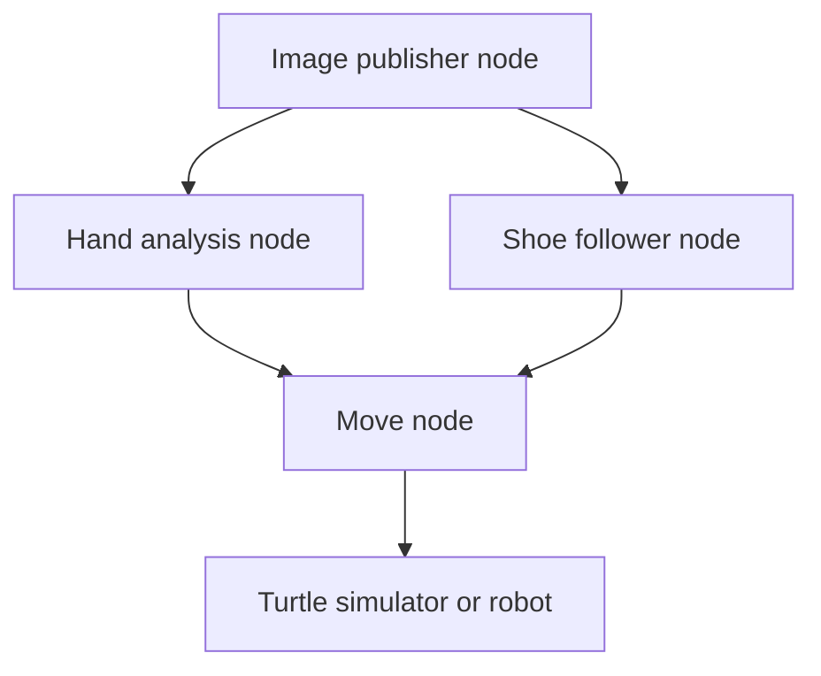
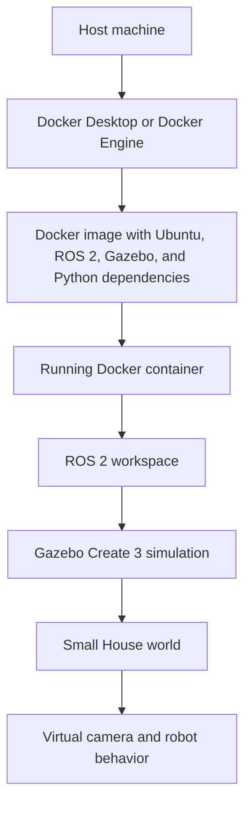

# Lecture 10: Docker for ROS 2, Gazebo, and Assignment 2

## Opening Demonstration: Robot Vision in Docker

The lecture began with a demonstration of a robot vision system that had been extended from earlier hand and voice commands to include a shoe follower.

**Shoe follower**: a vision based behavior where the robot detects shoes and attempts to follow the person wearing them.

The lecturer explained that the system should theoretically follow him around as he walks. It was connected to the wireless network at his house, but it could not work properly in the classroom because the required network connectivity was unavailable.

The earlier system could already follow hand commands. In the demonstration, it could still recognize the hand command for "stay." The new shoe following behavior did not run successfully in class because the process depended on networking that was not working in that environment.

The Docker container used for the robot demonstration was intentionally minimal. It was built to run robot software, not to be a general development environment. The lecturer noted that it did not include text editors or even `ping`, but it did include `cat`, which was enough to show the launcher file contents.

> **Course note**: This demonstration was meant to connect last semester's ROS node work with this lecture's Docker based workflow.

---

## Assignment 2 Folder and ROS 2 Packages

The Assignment 2 folder contains reinforcement learning and robotics components:

- DQN material
- PPO material
- A ROS 2 or Gymnasium package for the Gymnasium environment

The lecturer showed that ROS 2 was not installed natively in the classroom environment. Instead of installing ROS 2 directly on the laptop, he brought up a Docker image and ran a shell inside the container.

### Running a Shell in a Container

The command being demonstrated used Docker to run an interactive terminal inside a container.

**Interactive terminal**: a shell session where the user can type commands and see output as if they were logged into a normal Linux terminal.

The key idea was:

```bash
docker run -it <image-or-container> bash
```

*(reconstructed example)*

In this kind of command:

- `docker run` starts a container from an image
- `-i` keeps standard input open
- `-t` allocates a pseudo terminal
- `bash` starts a shell inside the container

When the lecturer entered the Docker container, he was already inside a ROS 2 workspace. That workspace had already been built.

### ROS 2 Distribution Inside and Outside Docker

The lecturer emphasized that the Docker container and the host laptop can run different Linux and ROS 2 versions:

| Location | Environment |
|---|---|
| Inside the Docker container | ROS 2 Humble, Ubuntu 22.04 based environment |
| Outside the Docker container on the laptop | ROS 2 Jazzy, Ubuntu 24.04 based environment |

This matters because Docker allows the project to run in a known environment regardless of the host system. The host might be Ubuntu 24.04, Ubuntu 22.04, or Windows with WSL 2.

The lecturer also noted that after entering the container, ROS 2 commands were no longer missing. The host machine did not have ROS 2 available, but the container did.

---

## Why Docker Is Different From a Virtual Machine

Docker gives a Linux environment that is similar to a virtual machine from the user's point of view, but it is lighter weight.

**Virtual machine**: an isolated machine environment that runs its own operating system kernel and system services.

**Docker container**: an isolated user space environment that uses the host machine's kernel but provides its own tools, libraries, configuration, and filesystem layers.

The lecturer compared Docker to VMware or VirtualBox:

| Feature | Virtual Machine | Docker Container |
|---|---|---|
| Kernel | Runs its own kernel | Uses the host kernel |
| Weight | Heavier | Lighter |
| Environment isolation | Full machine isolation | Process and filesystem isolation |
| Common course use | Last semester's VM setup | Current ROS 2 and assignment workflow |

The important reasoning chain is:

1. ROS 2 and robotics packages depend heavily on operating system version, Python version, and library versions.
2. Installing everything directly on the laptop can produce conflicts across workspaces and system installs.
3. Docker allows the course to define one controlled Linux environment.
4. That same Docker image can run on different host systems.
5. This reduces problems caused by mismatched Python virtual environments, ROS distributions, and system packages.

---

## Launching ROS 2 Nodes From a Docker Container

The lecturer showed that inside the Docker container, ROS 2 commands were available. They were not available natively on the host machine.

The intended command pattern was:

```bash
ros2 launch <package-name> <launch-file>
```

*(reconstructed command pattern)*

The transcript referred verbally to launching the AISD Vision package with a script launch file, and the lecturer noted that tab completion worked inside the container.

**Launch file**: a ROS 2 file that starts one or more nodes together.

The lecturer noted that students were not required to use launchers last semester, but this demonstration used one. The launcher would bring up all of the nodes related to the vision system:

- Image publisher node
- Hand analysis node
- Shoe follower node
- Movement node
- Turtle simulator

The purpose of the launcher is to start a whole ROS 2 system with one command instead of manually starting each node in separate terminals.

### Vision Node Pipeline



*(added)*

Because the classroom networking was not working, the full shoe follower did not behave as expected. The lecturer said that with network connectivity, the system would behave like last semester's ROS nodes running natively on the laptop.

---

## Why the Course Is Moving Toward Docker

The main problem Docker solves is the misery of Python virtual environments across:

- Multiple workspaces
- System Python installs
- ROS 2 dependencies
- Pip packages
- Different Ubuntu and ROS versions

The lecturer explained that moving to Ubuntu 24.04 and newer Create 3 firmware changes the installation situation. With Ubuntu 24.04, students cannot rely on the old workflow of installing everything directly on the laptop, such as running `pip install tensorflow` directly into the system environment.

The lecturer specifically contrasted older Humble based setups with newer Iron firmware on the Create 3. The old native install approach does not transfer cleanly to the newer 24.04 situation.

**Professional Docker workflow**: define the complete runtime environment in Docker, then run the same image across many machines.

Docker can handle:

- ROS 2
- Gazebo
- Python virtual environments
- System dependencies
- Different host operating systems
- Windows WSL 2 environments

> **Key takeaway**: Docker is being used because it gives a repeatable environment for ROS 2, Gazebo, Python, and assignment dependencies.

---

## Docker Terminology

### Docker Image

**Docker image**: an immutable template used to create containers.

The lecturer emphasized that an image cannot be changed directly. If the image needs to change, it is rebuilt. The old image can be discarded and replaced with a new one.

The slide deck defines an image as a read only executable package that includes everything needed to run an application:

- Code
- Runtime
- Libraries
- Environment variables
- Configuration files

Docker images are layered. Each instruction in a Dockerfile can create a new layer. When the Dockerfile changes, Docker can reuse cached layers that came before the changed instruction. Only the changed layer and the layers after it need to be rebuilt.

This is important because large installs such as TensorFlow, CUDA, ROS packages, or Gazebo can take a long time. If those steps are placed in earlier stable layers, later source code changes may rebuild more quickly.

### Dockerfile

**Dockerfile**: a script containing build instructions for creating a Docker image.

A Dockerfile tells Docker:

- What base image to start from
- What system packages to install
- What files to copy into the image
- What commands to run during the build
- What command the container should run by default

### Docker Container

**Docker container**: a running instance of a Docker image.

Containers are mutable while they run because each container has a thin writable layer on top of the read only image. For example, if you run commands inside a container, the shell history may be saved inside that container. If you stop and remove the container, then start a fresh one, that history is gone.

Each container is isolated with its own filesystem, network stack, and process space, even when multiple containers are created from the same image.

The lecturer described containers as ephemeral in this sense. They are not meant to be the permanent source of truth for your work unless you deliberately mount persistent storage.

### Persistent Volumes

**Persistent volume**: a mapping between a host folder and a folder inside the container.

Volumes allow files created or changed inside the container to be written to the host filesystem. This is how source code on the laptop can appear inside the container.

Example volume idea:

```yaml
volumes:
  - .:/ros2_ws/src/AISD
```

*(reconstructed example)*

This means:

- `.` is the current directory on the host
- `/ros2_ws/src/AISD` is the directory inside the container
- Changes made inside the mounted directory are really changes to host files

---

## Docker Hub and Base Images

Images are stored on disk locally, but they can also be stored in a central repository such as Docker Hub.

**Docker Hub**: a central registry for Docker images.

The course workflow uses Docker Hub because students can start from existing ROS images instead of installing ROS from scratch.

The lecturer highlighted this base image:

```dockerfile
FROM osrf/ros:humble-desktop
```

*(added)*

**OSRF**: Open Source Robotics Foundation, the organization that provides official ROS related Docker images.

This base image gives:

- Ubuntu 22.04
- ROS 2 Humble
- ROS desktop tools
- A prepared base for adding course packages

If students started from plain Ubuntu, they would need to install ROS 2 themselves. Starting from an OSRF image saves significant setup work.

---

## Dockerfile Keywords

The key Dockerfile concepts from the lecture were:

- `FROM`
- `RUN`
- `COPY`
- `ARG`
- `CMD`

### FROM

**FROM**: the Dockerfile instruction that selects the base image.

`FROM` is the bottom layer of the image. Everything else is built on top of it.

For the assignment, students are interested in an OSRF Humble image because Assignment 2 uses ROS 2 Humble.

Example:

```dockerfile
FROM osrf/ros:humble-desktop
```

*(added)*

The lecturer also showed a different Dockerfile built for Jazzy and a Jetson ARM machine. That file was not the assignment solution. It used ROS Jazzy and ARM related choices because it targeted a different machine.

> **Course note**: Do not copy the lecturer's Jetson Jazzy Dockerfile as the assignment solution. It was shown to explain Dockerfile structure, not to provide the exact answer.

### ARG

**ARG**: a Dockerfile build time variable.

The slide deck listed `ARG` with the Dockerfile basics. It is often used to parameterize a build, such as selecting the ROS distribution.

Example:

```dockerfile
ARG ROS_DISTRO=humble
FROM osrf/ros:${ROS_DISTRO}-desktop
```

*(added from slide concept)*

### RUN

**RUN**: the Dockerfile instruction that executes a command inside the image at build time.

The lecturer showed `RUN` commands being used for:

- `apt-get update`
- `apt-get install`
- `pip install`
- Writing setup lines into `.bashrc`
- Running `rosdep update`
- Running `rosdep install`
- Building the ROS 2 workspace
- Creating directories needed by packages

Example apt pattern:

```dockerfile
RUN apt-get update && apt-get install -y \
    python3-pip \
    python3-venv \
    && rm -rf /var/lib/apt/lists/*
```

*(reconstructed example)*

The lecturer explained the `&&` operator:

**`&&`**: a shell operator meaning "run the next command only if the previous command succeeded."

**`||`**: a shell operator meaning "run the next command only if the previous command failed."

This is like Boolean AND logic:

1. Run `apt-get update`.
2. If it succeeds, run `apt-get install`.
3. If that succeeds, remove package list files.
4. If any earlier command fails, the later commands do not run.

This is useful in Dockerfiles because a failed dependency install should stop the build immediately.

The lecturer contrasted this with Boolean OR logic. With `||`, commands are tried until one succeeds. With `&&`, every command in the chain must succeed for the full command sequence to succeed.

The final cleanup step removes files under `/var/lib/apt/lists/`. These files contain package lists downloaded by `apt-get update`. They are not needed inside the final image because they can be downloaded again later. Removing them keeps the Docker image smaller.

### COPY

**COPY**: the Dockerfile instruction that copies files or directories from the host machine into the image.

The lecturer described using `COPY` for:

- Source code
- Package directories
- Configuration files
- Patches
- Assets
- Camera related files

Example:

```dockerfile
COPY . /ros2_ws/src/AISD
```

*(reconstructed example)*

Files copied with `COPY` become part of the image. If you change those files inside the container, those changes do not automatically change the host files. That is different from a volume mount.

This distinction is important:

| Mechanism | Where the files live | What happens when they change inside the container |
|---|---|---|
| `COPY` | Inside the image layer | Host files do not change |
| Volume mount | Host filesystem, visible inside the container | Host files change too |

### CMD

**CMD**: the Dockerfile instruction that defines the default command the container runs.

The lecturer explained that `CMD` controls the container entry behavior.

Examples:

```dockerfile
CMD ["bash"]
```

*(added)*

```dockerfile
CMD ["sleep", "infinity"]
```

*(added)*

If `CMD` runs `bash`, the container starts a shell. If it runs a ROS 2 launch command, the container can automatically start the robot system. If it runs a short command like `ls`, the container will exit after that command finishes.

The lecturer used `bash` or `sleep infinity` in examples because he wanted the container to stay up so he could enter it and run commands manually.

The slide deck also notes that `CMD` can be overridden when starting a container:

```bash
docker run <image> <my-command>
docker compose run <service> <my-command>
```

*(added from slide concept)*

---

## Python Virtual Environments Inside Docker

The lecturer showed a Dockerfile that created a Python virtual environment in:

```text
/opt/ROSDM
```

The purpose was to avoid conflicts between central Python installs and project specific Python packages.

**Python virtual environment**: an isolated Python package environment where pip installs go into the virtual environment rather than the system Python install.

The reasoning was:

1. ROS and Python packages often have strict version compatibility requirements.
2. `pip install` normally installs packages into the active environment or central Python install.
3. `apt install` installs system packages into the root filesystem.
4. To avoid incompatible package versions, the Docker image can create and activate one controlled virtual environment.
5. Specific package versions can then be installed into that environment.

### Pip Versions and Compatibility

The lecturer gave examples from his own Dockerfile where package versions were carefully chosen:

- NumPy needed a compatible version on Humble in his robotics environment.
- MediaPipe version `0.10.14` was chosen because it was the last version that included the older solutions API needed by the shoe follower.
- DepthAI packages were included only because his Jetson setup used a depth sensing binocular camera.

> **Course note**: The DepthAI material does not apply to Assignment 2. It was part of the lecturer's own robot and camera setup.

The lecturer emphasized that `rosdep` is useful when it works, but sometimes package dependencies do not resolve to compatible versions. In those cases, preinstalling known compatible pip packages and skipping selected rosdep keys can avoid version problems.

### Rosdep

**rosdep**: a ROS dependency tool that installs system dependencies required by ROS packages.

The Dockerfile demonstrated a pattern like:

```bash
rosdep update
rosdep install --from-paths src --ignore-src -r -y
```

*(added)*

The lecturer's Dockerfile also skipped some keys because those dependencies had already been installed with specific compatible versions.

---

## Building the ROS 2 Workspace in Docker

The lecturer showed a Dockerfile that copied project files into the container, installed dependencies, then built the workspace.

Typical ROS 2 build pattern:

```bash
source /opt/ros/humble/setup.bash
colcon build --symlink-install
```

*(added)*

**colcon**: the standard build tool for ROS 2 workspaces.

**Symlink install**: a build mode where installed files are symlinked back to the source or build outputs, which can make development faster and more convenient.

The lecturer also mentioned that required directories such as recording and model directories had to be created. The Dockerfile can create those directories automatically so they are not forgotten.

---

## Bash Setup Inside the Container

The lecturer showed that the Dockerfile wrote setup commands into `.bashrc`.

**`.bashrc`**: a shell startup file that runs whenever a new interactive Bash shell starts.

The Dockerfile added commands so that every new shell would automatically:

- Source the ROS underlay
- Source the workspace overlay
- Activate the Python virtual environment

Example:

```bash
source /opt/ros/humble/setup.bash
source /ros2_ws/install/setup.bash
source /opt/ROSDM/bin/activate
```

*(reconstructed example)*

The lecturer clarified that putting a command into `.bashrc` does not execute it during the Docker image build. It arranges for the command to run later when a shell starts.

---

## Docker Compose

**Docker Compose**: a configuration tool for defining and running Docker containers, networks, volumes, environment variables, and related settings.

The lecturer compared Docker Compose to Kubernetes on a smaller scale. Kubernetes is container orchestration at a larger production scale. Docker Compose is a convenient local orchestration tool.

The lecturer said students do not have to use Docker Compose to use Docker, but he finds it convenient and considers it the modern way to work.

In the lecture examples, Docker Compose files gave services names such as `gui_demo` or `ros_sim`. The lecturer noted that students do not need to memorize those names. They can look in the Compose file to see what service name to use.

Common command:

```bash
docker compose up -d
```

*(added)*

In this command:

- `docker compose up` creates and starts the services defined in the Compose file
- `-d` runs the services in detached mode

**Detached mode**: the container runs in the background and the terminal prompt returns.

### Executing a Shell in a Running Compose Service

The lecturer repeatedly used this pattern:

```bash
docker compose exec -it <service-name> bash
```

*(added)*

This executes a command inside an existing running service container. Unlike `docker compose run`, it does not create a new container.

The `-it` flags combine:

- `-i`, interactive standard input stays open
- `-t`, TTY allocation gives a normal terminal style interface

The slide deck notes that newer Docker Compose versions often allocate this interactive terminal behavior by default, but `-it` is frequently included for clarity and compatibility.

The placeholder is the service name from `docker-compose.yml`, not necessarily the explicit `container_name`.

For example:

```bash
docker compose exec -it gui-demo bash
```

*(reconstructed example)*

---

## Docker Compose for ROS 2 and Gazebo

ROS 2 in Docker often needs:

- DDS discovery support
- Host networking
- GPU access
- X11 passthrough for graphical applications
- Device passthrough for hardware devices
- Volume mounts for source code

The lecturer said that on Linux or WSL 2 with Docker Desktop, these are usually handled by entries in the Docker Compose file.

### Compose Concepts

| Compose entry | Purpose |
|---|---|
| `services` | Defines one or more containers |
| `image` | Names the image to use or build |
| `container_name` | Gives the running container a name |
| `environment` | Sets environment variables |
| `volumes` | Maps host directories into the container |
| `network_mode` | Controls networking behavior |
| `ipc` | Shares inter process communication settings when needed |
| `privileged` | Gives broader access to host devices |
| `stdin_open` | Keeps standard input open |
| `tty` | Allocates a terminal |

The slide deck also notes that Compose can simplify builds with multiple arguments, define devices, and support SSH agent forwarding for private repositories.

Example ROS style Compose file:

```yaml
services:
  ros_sim:
    build:
      context: .
      args:
        - ROS_DISTRO=${ROS_DISTRO:-humble}
    image: cst8509-ros-sim
    container_name: ros_sim
    network_mode: host
    ipc: host
    environment:
      - DISPLAY=${DISPLAY}
      - QT_X11_NO_MITSHM=1
      - RMW_IMPLEMENTATION=rmw_fastrtps_cpp
      - ROS_DOMAIN_ID=${ROS_DOMAIN_ID:-0}
      - IGNITION_VERSION=${IGNITION_VERSION:-fortress}
      - GZ_VERSION=${GZ_VERSION:-harmonic}
      - NVIDIA_VISIBLE_DEVICES=all
      - NVIDIA_DRIVER_CAPABILITIES=all
    volumes:
      - .:/ros2_ws/src/AISD
      - /tmp/.X11-unix:/tmp/.X11-unix
      - /dev:/dev
    privileged: true
    stdin_open: true
    tty: true
    command: sleep infinity
```

*(reconstructed example)*

The exact assignment file may differ, but this captures the ideas discussed in lecture.

---

## GUI Passthrough and X11

The lecturer demonstrated GUI passthrough with `xeyes`.

**X11**: a windowing system used by many Linux graphical applications.

**X11 passthrough**: a setup where a graphical program runs inside the container but displays on the host system.

In the demonstration:

1. The Dockerfile installed X11 apps.
2. Docker Compose connected the container to the host display.
3. The lecturer entered the container with `docker compose exec`.
4. He ran `xeyes`.
5. The `xeyes` window appeared on the host machine.

For Lab 5 and Assignment 2, the graphical applications will not be `xeyes`. They will be Gazebo and RViz.

### Example xeyes Dockerfile

```dockerfile
FROM ubuntu:24.04

ENV DEBIAN_FRONTEND=noninteractive

RUN apt-get update && apt-get install -y \
    sudo \
    x11-apps \
    && rm -rf /var/lib/apt/lists/*

RUN useradd -ms /bin/bash student
USER student
WORKDIR /home/student

CMD ["sleep", "infinity"]
```

*(reconstructed example)*

### Example xeyes Compose File

```yaml
services:
  gui_demo:
    build: .
    container_name: gui_demo
    environment:
      - DISPLAY=${DISPLAY}
    volumes:
      - /tmp/.X11-unix:/tmp/.X11-unix
    network_mode: host
    stdin_open: true
    tty: true
```

*(reconstructed example)*

The lecturer noted that this demonstration showed a program running inside the container and displaying on Windows through the Linux and Docker setup.

---

## Cameras, Devices, and Assignment 2

The Compose file can include device mappings for hardware such as cameras.

The lecturer explained that cameras are more complicated under Windows Subsystem for Linux because WSL 2 does not provide USB passthrough by default. A physical laptop camera may not be visible inside the container unless extra setup is done.

For Assignment 2, students do not need to use the laptop camera. They use a virtual camera inside the simulated AWS Small House world. Because the camera is virtual and part of the simulation, this issue should not block the assignment.

> **Course note**: Assignment 2 uses a virtual camera in simulation, not the laptop's physical webcam.

---

## Working With Multiple Terminals in One Container

The lecturer explained that a running Docker container can be accessed from multiple terminal windows.

This is similar to native ROS development:

1. Start the simulation in one terminal.
2. Open another terminal.
3. Enter the same Docker container.
4. Run another ROS command, such as an undocking command.

The important point is that both terminals must be inside the container. Students should not run one command at the native host prompt and another at the container prompt unless the instructions specifically call for that.

> **Key takeaway**: For the assignment workflow, be aware of whether your prompt is the host prompt or the container prompt.

---

## Windows Setup With WSL 2 and Docker Desktop

The lecturer described the Windows setup process.

### Terminals and Shells on Windows

The lecturer briefly distinguished terminals from shells.

**Terminal**: the program window that lets a user interact with a command line.

**Shell**: the command interpreter running inside the terminal.

On Windows, examples include PowerShell and Command Prompt. In the lecturer's explanation, PowerShell is effectively a terminal experience running the PowerShell interpreter. In Unix like systems, the distinction is usually clearer: a terminal program opens, then a shell such as Bash or Zsh runs inside it.

### WSL 2

**WSL 2**: Windows Subsystem for Linux version 2, which allows Linux distributions to run on Windows.

On modern Windows 11, WSL can be installed from a PowerShell terminal:

```powershell
wsl --install
```

*(added)*

Students can also list available Linux distributions:

```powershell
wsl --list --online
```

*(added)*

They can list installed distributions:

```powershell
wsl --list --verbose
```

*(added)*

They can install a specific distribution:

```powershell
wsl --install -d Ubuntu-22.04
```

*(added)*

The lecturer noted that Ubuntu is usually the default distribution, but defaults can change over time. Students may need to choose a specific version if the assignment environment depends on it.

### Docker Desktop on Windows

For Windows, students should install Docker Desktop. Docker Desktop can connect to WSL 2.

The relevant Docker Desktop setting is the WSL 2 based engine. When Docker Desktop is running, the Docker command becomes available inside WSL 2. If Docker Desktop is shut down, the Docker command may disappear from the WSL 2 environment.

Docker Desktop manages hidden WSL 2 distributions named `docker-desktop` and `docker-desktop-data`. These run the actual Docker Engine. Docker Desktop then injects the Docker CLI and Docker Compose into the Ubuntu WSL 2 instance through symlinks, so they appear to be installed there.

Docker Desktop can place symlinks into the WSL 2 environment so Docker commands in Linux coordinate with the Docker Desktop service on Windows.

### Windows and Linux Filesystems

The lecturer explained that WSL 2 can access both:

- The Linux filesystem
- The Windows filesystem

The Windows C drive is mounted under:

```text
/mnt/c
```

For example, Windows user folders can be reached through paths under:

```text
/mnt/c/Users
```

The lecturer emphasized that Windows and Linux filesystems are separate, but WSL 2 makes it possible to access both.

---

## Linux Docker Installation

On a native Linux machine, students should follow Docker's official Ubuntu installation instructions from docker.com.

This is different from the Windows workflow. In Windows with WSL 2, students install Docker Desktop. On native Linux, they install Docker Engine directly.

The lecturer mentioned a command that adds the user to the Docker group.

```bash
sudo usermod -aG docker $USER
```

*(added)*

**Docker group**: a privileged Linux group whose members can run Docker commands without using `sudo`.

The lecturer explained that this command is not enough by itself to immediately make Docker available to the current shell session. The user must log out and log back in so the new group membership is applied.

Docker is privileged because starting containers can grant significant access to the host system.

---

## Lab 5 and AI Assistance

The lecturer said Lab 5 explicitly allows students to use AI. The lab provides a prompt template to fill in.

At the start of the Docker slide section, the lecturer described the slide deck as quickly assembled and not visually branded. The purpose of the slides was to cover the Docker points students needed, not to provide a polished presentation.

The lecturer identified a possible problem:

1. A student prompts an AI model.
2. The model produces a perfect Dockerfile.
3. The student runs it.
4. It works immediately.
5. The student learns less because they did not have to investigate any issues.

The lecturer's hope is different:

1. Students prompt an AI model.
2. They get a Dockerfile.
3. They run into issues.
4. They investigate those issues.
5. The AI helps explain what is wrong and how Docker works.
6. The student can still ask the lecturer for help in the lab.

> **Course note**: AI use is permitted for Lab 5, but the learning goal is to understand the Docker issues and fixes, not just to generate a file blindly.

---

## Debugging Docker, ROS 2, and Gazebo

The lecturer gave one of the most important developer habits:

> **Key takeaway**: Find out what the error message is.

When a program is not working, an experienced developer will ask:

- What do the logs say?
- What is the error message?
- Where did it fail?

For Assignment 2, students may launch a Create 3 simulator in Gazebo with a Small House world. The output may contain many `info` lines and possibly warnings. If an `error` line appears, that is the first thing to investigate.

The lecturer suggested asking an AI model a specific debugging question such as:

```text
This is launching a Create 3 simulator in Gazebo with a Small House world and getting this error: <paste error>. What could explain that?
```

*(reconstructed example)*

An AI model may suggest:

- A missing dependency
- A configuration issue
- A package version mismatch
- A missing environment variable
- A problem in the launch file

The lecturer warned students not to ignore error messages. Those messages are critical if the Create 3 simulator is still in a broken state.

---

## Docker Build Time and Layer Caching

The lecturer's Docker image took a long time to build because it was the first time on that machine. It needed to download large packages such as TensorFlow and CUDA related components.

The benefit of Docker layer caching appears after the first build:

1. Expensive base dependencies are downloaded and installed once.
2. Docker caches those layers.
3. Later source code changes happen in later layers.
4. Rebuilds can reuse earlier expensive layers.
5. The second and later builds are often faster.

This is why Dockerfile ordering matters. Stable and expensive dependency steps should generally come before frequently changing source code steps.

---

## Summary of Core Commands

| Command | Purpose |
|---|---|
| `docker run -it <image> bash` | Start a container and open an interactive shell |
| `docker compose up -d` | Start Compose services in the background |
| `docker compose exec <service> bash` | Open a shell inside an already running service container |
| `ros2 launch <package> <launch-file>` | Launch ROS 2 nodes from a launch file |
| `colcon build --symlink-install` | Build a ROS 2 workspace |
| `wsl --install` | Install WSL on Windows |
| `sudo usermod -aG docker $USER` | Add a Linux user to the Docker group |

---

## High Level Workflow for Assignment 2



*(added)*

The intended development flow is:

1. Build or start the Docker environment.
2. Enter the running container.
3. Work at the container prompt.
4. Launch ROS 2 or Gazebo commands from inside the container.
5. Watch the logs carefully.
6. Investigate warnings and errors.
7. Use AI and lab support to understand and fix issues.

> **Final takeaway**: Docker gives the class a repeatable robotics environment. The point is not to memorize every Dockerfile line, but to understand images, containers, Dockerfile layers, Compose services, volume mounts, GUI passthrough, and how to read logs when ROS 2 or Gazebo fails.
