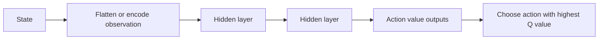
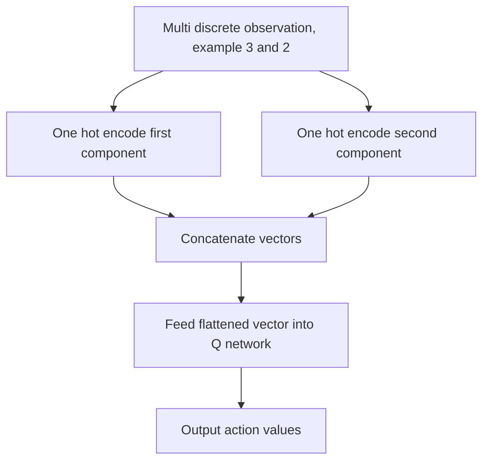
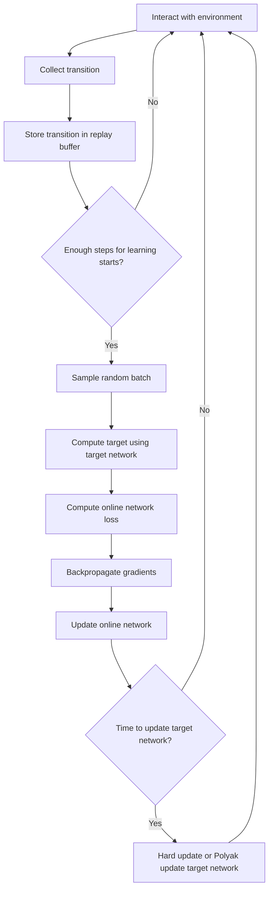
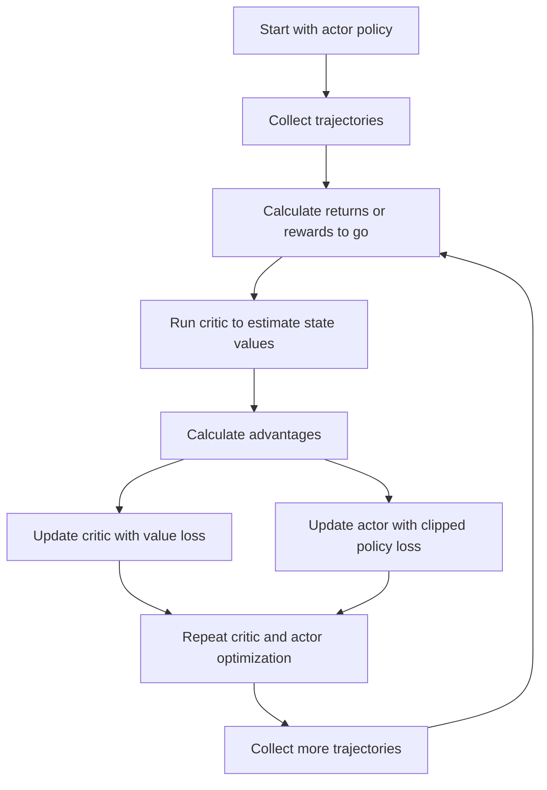
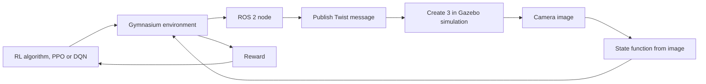

# Lecture 11: Value Function Approximation, DQN, PPO, and Gazebo Actors

## Discount Factor and the Q Learning Update

The lecture began by returning to the Q learning update equation and the meaning of its main parameters.

**Step size**: the learning rate parameter that controls how much of a new estimate is incorporated into the current value estimate.

**Gamma**: the discount factor. It controls how much future rewards contribute to the current return.

The return from time $t$ is the current reward plus discounted future rewards:

$$
G_t = R_{t+1} + \gamma R_{t+2} + \gamma^2 R_{t+3} + \gamma^3 R_{t+4} + \cdots
$$

Because $\gamma < 1$, rewards further in the future count less than immediate rewards.

The lecture emphasized two reasons for using gamma:

* **Mathematical convergence**: if an episode does not end, the discounted infinite sum can still converge to a finite value. Without discounting, the return could become infinite, which is not useful mathematically.
* **Uncertainty about the future**: immediate rewards are more certain than rewards far in the future. Since future rewards are less certain, they are weighted less heavily.

> **Key takeaway**: Gamma makes infinite horizon returns manageable and also reflects the idea that distant future rewards are less certain than immediate rewards.

### Q Learning Update

The Q learning update used throughout the course can be written as:

$$
Q(S_t, A_t) \leftarrow Q(S_t, A_t) + \alpha \left[R_{t+1} + \gamma \max_a Q(S_{t+1}, a) - Q(S_t, A_t)\right]
$$

Where:

* $Q(S_t, A_t)$ is the current estimate for the state action pair.
* $\alpha$ is the step size.
* $R_{t+1}$ is the reward after taking action $A_t$ in state $S_t$.
* $\gamma$ is the discount factor.
* $\max_a Q(S_{t+1}, a)$ is the best estimated action value in the next state.
* The expression in brackets is the temporal difference error.

This update is closely related to value iteration, but it is applied from sampled experience rather than from a full known model of the environment.

The lecturer described this as being a little like value iteration one episode at a time.

> **Course note**: The Q learning update slide was presented as a recurring anchor for the course. The value function approximation topic was tied back to this same learning step.

---

## Q Learning Compared With Value Iteration and Monte Carlo

The lecturer compared Q learning to earlier methods.

| Method | What it needs | When it learns | Main point from lecture |
|---|---|---|---|
| Value iteration | A known model of how the environment behaves | During sweeps over the known environment | Requires knowing the environment dynamics in advance |
| Monte Carlo | Complete episodes | After returns can be calculated from episodes | Waits for episode outcomes |
| Q learning | Sampled interaction with the environment | Right away, from each transition | Does not require knowing the environment dynamics in advance |

The advantage of Q learning over value iteration is that Q learning does not require knowing what the environment will do in advance. Value iteration does require that knowledge.

The advantage of Q learning over Monte Carlo is that Q learning starts learning immediately. It does not need to wait until the end of an episode.

The lecturer connected this to exploration:

* Training depends on the agent visiting the relevant states.
* A valuable reward could be hidden somewhere in the environment.
* Even if the agent already performs reasonably well, it might miss a much better outcome if it never explores the important state.

The lecture used the example of a possible billion dollar reward hidden in one square. The agent might be good at getting a reward like negative 13, but that does not mean it has found the best possible behavior.

---

## Why Value Function Approximation Is Needed

The course had used Q tables for simpler environments, but realistic problems do not remain small enough for tabular methods.

**Q table**: a table containing an estimated value for each state action pair.

The lecturer noted that when building a Q learning agent, one of the first steps is usually to instantiate a Q table. This works only when the state and action spaces are small enough.

Tabular Q learning becomes infeasible when:

* The state space is very large.
* The action space is very large.
* The action space is continuous.
* The number of possible state action pairs is too large to store in memory.

The lecture gave several examples:

* Cliff walking is simple enough for tabular Q learning.
* A three block, four position world is already more difficult.
* A six block, six position world becomes much harder.
* The class PPO attempt for a six by six block stacking world with action masking was still running and was not doing very well.
* Go has around $10^{170}$ possible states, which is far beyond what can be stored in a normal Q table.

> **Course note**: The lecturer suggested that the difficulty of the six by six block stacking problem helps explain why there is no standard block stacking world solution in Gymnasium.

### Quantum Computing Digression

The lecture briefly addressed a possible misconception about quantum computing.

Quantum computing is not simply a way to store or represent an enormous table of states such as $10^{170}$ Go states. It uses quantum mechanics to help with a narrow subset of problems.

The example given was factoring large numbers:

* Certain quantum algorithms can take advantage of superposition and quantum effects.
* Factoring large numbers is important because modern cryptography relies on the difficulty of that task.
* If quantum computers become practical for this purpose, systems based on vulnerable encryption algorithms will need to migrate.
* Bitcoin was mentioned as an example of a distributed system that would face a difficult migration problem because nobody centrally controls it.

This was a digression, but the main point was that quantum computing does not remove the need for value function approximation in ordinary reinforcement learning.

---

## Value Function Approximation

**Value function approximation**: using a parameterized function, often a neural network, to approximate a value function that is too large or impossible to represent exactly in a table.

Instead of storing a complete value function or action value function in a table, we approximate it with a function:

$$
\hat{v}(s, w) \approx v(s)
$$

For action values:

$$
\hat{q}(s, a, w) \approx q(s, a)
$$

Where:

* $s$ is the state.
* $a$ is the action.
* $w$ represents the weights of the neural network.
* The function output approximates what the table would have returned.

The lecturer described the quick answer:

* Instead of using a value function table, approximate the value function with a neural network.
* The network has weights.
* The network takes a state as input.
* The network returns an estimated value or action values.
* The weights are updated through learning.

The lecture emphasized that this is an approximation. In realistic problems, the true Q function may never be perfectly represented. The Q network is not expected to give a perfect answer for every possible state.

---

## DQN, Deep Q Network

**DQN**: Deep Q Network, a Q learning method where a neural network replaces the Q table.

In ordinary Q learning, the agent learns an action value function $Q$. In DQN, the agent uses a neural network to approximate that function.

The major change is:

| Tabular Q learning | DQN |
|---|---|
| Stores values in a Q table | Stores knowledge in neural network weights |
| Updates one table cell directly | Trains a neural network from examples |
| Works for small discrete spaces | Can handle much larger state spaces |
| The update is simple table assignment | The update requires loss functions, batches, and backpropagation |

Training a deep neural network is not as simple as updating one cell in a table. The network needs many examples before it learns the pattern.

### DQN Network Input and Output

The Q network receives the state as input and outputs one action value for each possible action.

For example, if the environment has eight actions, the network outputs eight values:

$$
Q(s, 0), Q(s, 1), Q(s, 2), Q(s, 3), Q(s, 4), Q(s, 5), Q(s, 6), Q(s, 7)
$$

The lecturer described a board example:

* A state such as 88 is fed into the neural network.
* The state propagates through hidden layers.
* The output layer produces action values.
* If there are eight actions, there are eight output values.
* The agent can choose the action with the highest output value.

Example output:

| Action | Estimated action value |
|---|---:|
| 0 | 17 |
| 1 | 13 |
| 2 | negative 1 |
| 3 | 2 |
| 4 | 3 |
| 5 | 7 |
| 6 | 6 |
| 7 | not specified in transcript |

The policy implied by the Q network is:

$$
\pi(s) = \arg\max_a Q(s, a)
$$

### Basic DQN Diagram



*(added)*

---

## Flattening Discrete and Multi Discrete Observations

The lecture discussed how observations can be converted into vectors for a neural network.

**Discrete space**: a space containing a single integer from a fixed range. For example, a discrete space of size 80 contains values from 0 to 79.

**Multi discrete space**: a space containing multiple discrete values. For example, a multi discrete space with dimensions 80 and 40 contains two values. The first is from 0 to 79, and the second is from 0 to 39.

Neural networks need vector input, so these observations must be flattened or encoded.

### One Hot Encoding

**One hot vector**: a vector where one position is 1 and all other positions are 0.

For a discrete value of 3 in a space of size 8, the one hot representation is:

$$
[0, 0, 0, 1, 0, 0, 0, 0]
$$

*(reconstructed example)*

For a multi discrete observation such as $(3, 2)$:

* The value 3 is represented with a one hot vector for the first discrete range.
* The value 2 is represented with a one hot vector for the second discrete range.
* The two vectors are concatenated or flattened into one input vector.

For example, if the first component has 8 possible values and the second has 4 possible values:

$$
3 \rightarrow [0, 0, 0, 1, 0, 0, 0, 0]
$$

$$
2 \rightarrow [0, 0, 1, 0]
$$

Flattened representation:

$$
[0, 0, 0, 1, 0, 0, 0, 0, 0, 0, 1, 0]
$$

*(reconstructed example)*

### Flattening Pipeline



*(added)*

---

## Online Network and Target Network in DQN

DQN commonly uses two networks with the same structure:

* The **online network**.
* The **target network**.

**Online network**: the network actively updated by gradient descent during training.

**Target network**: a lagged copy of the online network used to produce more stable target Q values.

The lecturer compared this to earlier dynamic programming ideas. In policy evaluation or value iteration, values may be updated while other updates are still using them. Sometimes it is useful to keep an older copy of the value function and use that copy consistently while updating the new one.

The target network was described as a stabilizer. The lecturer compared this stabilizing role to the way a step size or learning rate prevents updates from changing too abruptly.

In DQN:

* The online network is changed by training.
* The target network is held steady for a while.
* The target network provides target Q values.
* Every so often, the online network weights are copied or partially copied into the target network.

### Why Two Networks Are Used

If the same network is used to generate the target and update itself, the target keeps moving. The network is trying to chase a value that changes as the network changes.

The lecturer used the analogy of a dog chasing a squirrel:

* The dog represents the learning network.
* The squirrel represents the target.
* If the squirrel keeps moving every time the dog moves, the dog may never get closer in a stable way.
* Freezing the squirrel for a while gives the dog a stable target.
* Later, the squirrel is allowed to move, which corresponds to updating the target network.

> **Key takeaway**: The target network stabilizes DQN by keeping the target values fixed for a period of training.

### Hard Updates and Polyak Updates

Older or simpler DQN implementations often use hard target updates.

**Hard target update**: directly copy all online network weights into the target network.

$$
\theta_{\text{target}} \leftarrow \theta_{\text{online}}
$$

Modern implementations may use a parameter called $\tau$ for Polyak updating.

**Polyak update**: slowly move the target network weights toward the online network weights.

$$
\theta_{\text{target}} \leftarrow \tau \theta_{\text{online}} + (1 - \tau)\theta_{\text{target}}
$$

The lecturer connected this to step size:

* With step size 1, the old value is thrown away and fully replaced by the new value.
* With a smaller step size, part of the old value is kept.
* Polyak updating keeps most of the old target network and moves it slowly toward the online network.

This helps reduce oscillation.

**Oscillation**: a training pattern where a value becomes too low, then is overcorrected too high, then is overcorrected too low again, instead of converging.

---

## DQN Loss Function

DQN trains the online network to reduce the difference between:

* A target value based on reward and the target network.
* The online network's current estimate for the action that was actually taken.

The target is:

$$
y = r + \gamma \max_{a'} Q_{\text{target}}(s', a')
$$

If terminal states are included explicitly, the common version is:

$$
y = r + \gamma (1 - d)\max_{a'} Q_{\text{target}}(s', a')
$$

Where $d = 1$ if the transition ends the episode and $d = 0$ otherwise.

*(added)*

The online estimate is:

$$
Q_{\text{online}}(s, a)
$$

The mean squared error loss is:

$$
L = \left(y - Q_{\text{online}}(s, a)\right)^2
$$

For a batch of transitions:

$$
L = \frac{1}{N}\sum_{i=1}^{N}\left(r_i + \gamma \max_{a'} Q_{\text{target}}(s'_i, a') - Q_{\text{online}}(s_i, a_i)\right)^2
$$

The goal is to make this loss close to zero.

The lecturer emphasized that this is very similar to the Bellman style updates used throughout the course. The same structure appears:

* Reward.
* Gamma, which is set by the user.
* Old value.
* New value.
* A difference between the current estimate and a better target.

---

## Replay Buffer and DQN Training

**Replay buffer**: a memory store of transitions collected from interaction with the environment.

A transition typically contains:

$$
(s, a, r, s', d)
$$

Where:

* $s$ is the current state.
* $a$ is the action taken.
* $r$ is the reward received.
* $s'$ is the next state.
* $d$ indicates whether the episode ended.

DQN does not usually begin training immediately. It first interacts with the environment and fills the replay buffer.

The lecture mentioned the `learning_starts` parameter:

* It may be set to something like 1,000 or 2,000 steps.
* The agent fills the buffer during this period.
* Training begins only after enough transitions have been collected.

Training is then performed on random batches from the replay buffer.

This differs from tabular Q learning:

| Tabular Q learning | DQN with replay buffer |
|---|---|
| Learns in the same order as interactions occur | Learns from random sampled batches |
| Updates one Q table entry at a time | Updates neural network weights from batches |
| Uses the latest transition directly | Stores transitions and reuses them |

The lecture stated that by default, training is done after every four interactions, after the initial `learning_starts` period.

### DQN Training Loop



*(added)*

### Minimal DQN Setup in Stable Baselines3

The lecturer referred to SB3 defaults such as two 64 node hidden layers and ReLU activations. A minimal example is:

```python
from stable_baselines3 import DQN

model = DQN(
    "MlpPolicy",
    env,
    learning_starts=1000,
    train_freq=4,
    gamma=0.99,
    verbose=1,
)

model.learn(total_timesteps=50_000)
```

*(added)*

To parameterize the network architecture in SB3:

```python
from stable_baselines3 import DQN

policy_kwargs = {
    "net_arch": [128, 128],
}

model = DQN(
    "MlpPolicy",
    env,
    policy_kwargs=policy_kwargs,
    learning_starts=1000,
    train_freq=4,
    verbose=1,
)
```

*(added)*

---

## Backpropagation in DQN

The lecture reviewed the basic idea of backpropagation.

**Backpropagation**: the process of propagating loss gradients backward through a neural network to adjust weights in a direction that reduces error.

The network is a function:

* It receives input.
* It produces output.
* The output has an error relative to the desired target.
* Partial derivatives describe how each weight contributes to the output error.
* The training algorithm adjusts the weights so that the next output is closer to the target.

The lecturer described this as the important mechanism that makes machine learning work. Backpropagation was associated with Geoffrey Hinton, who helped popularize or rediscover it.

In DQN, backpropagation is used to tweak the online network weights so that the estimated Q value moves closer to the Bellman target.

---

## DQN Architecture Is Not Fixed

A student asked whether the DQN network must be fully connected.

The answer was no.

The lecture emphasized:

* Value function approximation is a large topic in reinforcement learning.
* DQN is one example.
* The shown architecture was a default, not the only possible structure.
* SB3 defaults include a 64 node hidden layer followed by another 64 node hidden layer with ReLU activation.
* Other structures, such as 128 and 128, can be used.
* SB3 allows parameterization of these choices.

This means DQN can use different neural network structures depending on the observation type and problem. For example, image observations may use convolutional networks rather than only fully connected layers.

*(additional example)*

---

## PPO, Proximal Policy Optimization

After DQN, the lecture moved to PPO.

**PPO**: Proximal Policy Optimization, an actor critic reinforcement learning algorithm that uses value function approximation and clipped policy updates.

The lecturer used PPO as a second example of value function approximation. PPO works quite differently from DQN, but it still uses neural networks and still includes a value function approximation component.

The lecture referenced a video that walks through PPO in multiple steps:

* Steps one through seven explain the main process.
* Step eight repeats steps six and seven.
* Step nine repeats steps three through eight.

> **Course note**: The lecturer said students would not be asked to draw the full PPO diagram on a test. The purpose was to see how value function approximation algorithms can work.

---

## Actor Critic Structure in PPO

PPO uses two main networks:

* The **actor network**.
* The **critic network**.

**Actor network**: a policy network that receives a state and outputs action probabilities.

**Critic network**: a value network that receives a state and outputs the value of that state.

For the actor:

$$
s \rightarrow \pi(a \mid s)
$$

For the critic:

$$
s \rightarrow V(s)
$$

The actor decides how likely each action is. The critic estimates how good the current state is.

This resembles policy iteration:

* A policy is used to collect behavior.
* A value function evaluates how good states or actions are.
* The value information helps improve the policy.
* The improved policy then produces new behavior.

> **Key takeaway**: In actor critic methods, the actor chooses actions and the critic judges how good the situation is.

---

## PPO Example With Cliff Walking

The video example discussed in class used a simplified cliff walking world.

The lecturer described the starting state as state 7. The actor network initially outputs equal probabilities for four actions:

$$
[0.25, 0.25, 0.25, 0.25]
$$

This represents an uninformed initial policy:

* Each of the four actions is equally likely.
* The agent has not yet learned which actions are good.
* Some trajectories may immediately go right off the cliff.
* Other trajectories may go up or move in other directions.

The agent collects a batch of trajectories. For each trajectory, it calculates returns.

The video called these values "rewards to go." The lecturer noted that the course has called them returns.

**Return**: the future cumulative discounted reward from a time step onward.

**Reward to go**: another name for the return from a particular time step onward.

The lecturer also related this idea to $Q$, because reward to go is the cumulative future reward associated with what happens after an action is taken.

The reward to go can be written:

$$
G_t = R_t + \gamma R_{t+1} + \gamma^2 R_{t+2} + \cdots
$$

The lecturer pointed out that the initial critic output may be meaningless. In the example, the value network produced something like negative 50 because the starting weights were not trained yet.

The data collected includes:

* The rewards from actions that were taken.
* The values or returns calculated from trajectories.
* The log probabilities of the actions that were taken.

The log probabilities matter because they appear later in the PPO actor loss.

---

## PPO Advantage

**Advantage**: a measure of how much better or worse an action outcome was compared with the value currently expected for that state.

A simple version is:

$$
A_t = G_t - V(s_t)
$$

Where:

* $G_t$ is the return or reward to go.
* $V(s_t)$ is the critic's current value estimate for the state.

The lecturer described the intuition:

* If the action produces a better result than the critic expected, the action has a positive advantage.
* If it produces a worse result than expected, the advantage is lower or negative.
* All sampled actions can be assigned advantages, but some advantages are worse than others.

The advantage gives the actor information about which actions should become more or less likely.

---

## PPO Critic Update

The critic is trained by minimizing the difference between its predicted values and the observed returns.

The critic loss can be represented as:

$$
L_{\text{critic}} = \sum_t \left(G_t - V(s_t)\right)^2
$$

Or as a mean squared error:

$$
L_{\text{critic}} = \frac{1}{N}\sum_{t=1}^{N}\left(G_t - V(s_t)\right)^2
$$

The lecture described this as summing squared differences:

* Difference between the return and the critic output for one sample.
* Difference between the return and the critic output for another sample.
* Difference between the return and the critic output for another sample.
* Square the differences.
* Sum them to produce the loss.
* Use backpropagation to move the critic output toward meaningful values.

In the example, this process would move the critic's meaningless negative 50 estimate closer to a useful value.

---

## PPO Actor Update and Clipping

The actor network is updated with a clipped loss function.

**Clipping in PPO**: limiting how much the policy update can change the action probabilities at one time.

The lecturer emphasized that clipping is used for stability:

* It keeps updates from changing too quickly.
* It reduces the chance of oscillation.
* It is similar in spirit to keeping the dog and squirrel problem under control.
* The update is limited so the policy does not jump too far in one training step.

A common PPO clipped objective is:

$$
L_{\text{actor}} =
\mathbb{E}_t
\left[
\min
\left(
r_t(\theta) A_t,
\text{clip}(r_t(\theta), 1 - \epsilon, 1 + \epsilon)A_t
\right)
\right]
$$

Where:

$$
r_t(\theta) =
\frac{\pi_\theta(a_t \mid s_t)}
{\pi_{\theta_{\text{old}}}(a_t \mid s_t)}
$$

*(added)*

The lecture did not require memorizing the full equation. The important idea is that PPO updates the actor while preventing the policy from changing too much at once.

After calculating the actor loss:

* Backpropagation propagates gradients through the actor network.
* The actor weights are adjusted.
* When state 7 is fed in again, the action probabilities should be more meaningful than the original uniform probabilities.

---

## PPO Training Flow

The lecture summarized the PPO process as a repeated loop.



*(added)*

The steps discussed in class were:

1. Start with a policy, represented by the actor network.
2. Feed a state into the actor and get action probabilities.
3. Collect a batch of trajectories.
4. Calculate returns or rewards to go.
5. Calculate advantages by comparing observed returns against critic values.
6. Update the critic by minimizing value loss.
7. Update the actor with the clipped PPO loss.
8. Repeat steps six and seven.
9. Repeat the broader loop from trajectory collection onward.

The lecturer connected this back to policy improvement. PPO has a policy network and a value network interacting with each other. That is why it is an actor critic method.

---

## DQN and PPO as Value Function Approximation Examples

DQN and PPO both use value function approximation, but they use it differently.

| Feature | DQN | PPO |
|---|---|---|
| Main category | Value based method | Actor critic policy optimization method |
| Policy representation | Usually chooses argmax over Q values | Actor network outputs action probabilities |
| Value approximation | Q network approximates action values | Critic network approximates state values |
| Main stabilizer discussed | Target network and replay buffer | Clipped policy updates |
| Data usage | Random batches from replay buffer | Batches of trajectories |
| Relation to course topics | Extends Q learning | Resembles policy iteration and policy improvement |

The lecture used these algorithms to tie modern deep reinforcement learning back to earlier course concepts:

* Bellman updates.
* Q learning.
* Value functions.
* Policy improvement.
* Temporal difference learning.
* Function approximation.

> **Course note**: The lecturer described value function approximation as an important topic and a good place to end the course because it connects much of the course material.

---

## Gazebo Actors

The final part of the lecture shifted from DQN and PPO to Gazebo actors and Assignment 2 context.

The lecturer opened a Gazebo actor tutorial from a URL on the slide. The transcript did not capture the exact URL, but the tutorial was on the classic Gazebo site.

### Classic Gazebo and New Gazebo

The lecturer clarified the difference between:

* `classic.gazebosim.org`, the older Gazebo site.
* `gazebosim.org`, the newer GazeboSim site.

The Amazon house environment used in the course belongs to the older Gazebo ecosystem. The lecturer said that using older Gazebo is acceptable for the course. It does not have a fatal flaw that should crash laptops. If a laptop is crashing, the cause is likely something else.

### Gazebo Actors and Links

**Gazebo actor**: an animated entity in a Gazebo simulation.

The tutorial showed a human actor model with links such as:

* Upper arm.
* Lower arm.
* Hand.

The lecturer mentioned that RViz can show all the links in a robot.

Actor animation can involve:

* Translation.
* Rotation.
* Combinations of translations and rotations.

The human actors were described as mostly a curiosity for the class. The practical goal was to create something that is easy to detect and move around.

---

## Red Ball Actor for Assignment Work

The lecturer recommended using a red ball because:

* It is easy to detect.
* It can be moved around.
* It is simpler than a humanoid actor.
* It is suitable for a reinforcement learning setup where the robot needs to perceive and respond to a target.

The tutorial's actor could be adapted:

* Replace the model with a sphere.
* Make the sphere red.
* Define a trajectory.
* Place the XML into the house simulation.

> **Course note**: The lecturer wanted students to use something easy to identify, such as a red ball, rather than spending effort on a complicated human actor.

### Actor Trajectory

The tutorial trajectory traced a square pattern with waypoints such as:

* $(1, -1)$
* $(-1, -1)$
* $(-1, 1)$
* $(1, 1)$
* $(1, -1)$

The lecturer explained that these points trace out a square.

For the assignment, this can be flattened into a back and forth path. The goal is an easily identified actor that moves back and forth in the small house.

**Waypoint time**: the timestamp assigned to a trajectory waypoint. The timestamp governs the order of the trajectory, not the position of the XML element in the file.

The lecturer explained that if time zero is moved between time two and time three in the XML, it is still time zero. It still happens first because the timestamp determines the order.

### Simplified Back and Forth Trajectory

```xml
<trajectory id="0" type="walking">
  <waypoint>
    <time>0</time>
    <pose>1 -1 0 0 0 0</pose>
  </waypoint>
  <waypoint>
    <time>2</time>
    <pose>1 1 0 0 0 0</pose>
  </waypoint>
  <waypoint>
    <time>4</time>
    <pose>1 -1 0 0 0 0</pose>
  </waypoint>
</trajectory>
```

*(reconstructed example)*

This example goes from $(1, -1)$ to $(1, 1)$ and then back to $(1, -1)$.

The lecturer noted that the tutorial trajectory contains more waypoints than are needed for the small house.

> **Course note**: Adding a humanoid actor to a small house was left as an exercise.

---

## Assignment 2 Reinforcement Learning Setup

The lecture connected Gazebo actors back to Assignment 2.

In Assignment 2, students create a Gymnasium environment that uses a ROS 2 node.

The workflow described was:

1. The Gymnasium environment receives an action from the reinforcement learning agent.
2. A ROS 2 node publishes a `Twist` message based on that action.
3. The robot moves in the simulated room.
4. The environment receives observations, including information derived from the camera picture.
5. The environment calculates a reward.
6. The reinforcement learning algorithm uses the state, action, and reward to train.

### Assignment 2 Pipeline



*(added)*

The state is some function of the camera picture. The transcript did not specify the exact state representation, but the goal is to use perception from the simulated room as the observation signal.

The lecturer suggested applying PPO to train the Create 3 robot in this setup. With a red ball moving back and forth, the task should be feasible.

---

## Dockerization and Course Context

The lecture briefly returned to Assignment 2 demonstrations and Dockerization.

Students who had already demonstrated Assignment 2 may have already handled many of these pieces. The lecturer asked whether anyone had Assignment 2 dockerized yet.

The broader learning value of the assignment was not only solving a simple reinforcement learning task. The lecturer emphasized the value of the journey:

* Getting used to the Linux command line.
* Building a Gymnasium environment.
* Connecting reinforcement learning with ROS 2.
* Publishing robot motion commands.
* Using camera based observations.
* Running in Gazebo.
* Potentially containerizing the setup with Docker.

> **Course note**: If students end up working in reinforcement learning, they will need to dig deeper into many of these areas. The course has only touched on them.

---

## Final Exam Context

At the end of the lecture, the lecturer acknowledged that some of the math is difficult.

The dynamic programming quiz was mentioned specifically:

* It may have been hard the first time.
* Seeing similar material again on the final exam should make it less difficult.

> **Course note**: Dynamic programming and the math behind the updates remain relevant for the final exam.

---

## Summary of Main Ideas

* Gamma discounts future rewards so infinite horizon returns can converge and uncertain future rewards count less.
* Q learning learns from interaction without needing a full model of the environment.
* Q learning starts learning immediately, unlike Monte Carlo methods that depend on completed returns.
* Tabular Q learning becomes infeasible when state or action spaces become very large.
* Value function approximation replaces explicit tables with parameterized functions such as neural networks.
* DQN replaces the Q table with a Q network.
* DQN outputs one action value per action.
* DQN uses replay buffers, random batches, an online network, and a target network.
* Target networks reduce instability by preventing the learning target from moving too quickly.
* Polyak updating slowly moves target weights toward online weights.
* PPO is an actor critic method.
* PPO uses an actor network for action probabilities and a critic network for state values.
* PPO calculates advantages to decide whether actions were better or worse than expected.
* PPO uses clipping to keep policy updates stable.
* Gazebo actors can be used to create moving objects in a simulated environment.
* A red ball actor is a practical target because it is easy to detect.
* Assignment 2 connects Gymnasium, ROS 2, Twist messages, Gazebo, camera observations, and reinforcement learning.
