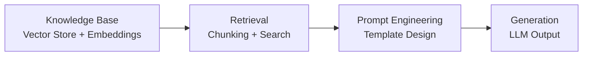

# Lecture 1: Evaluating Generative AI Applications

## Why Evaluate Holistically?

In retrieval augmented generation (RAG), the quality of the final output depends on many factors:

- **Knowledge base construction**: what embedding model you used, the chunk size, and the chunking mechanism
- **Retrieval quality**: how well the system retrieves relevant documents for a given query
- **Generation quality**: which LLM you use, what temperature setting you use, and how the prompt template is designed

> **Key idea**: You need to evaluate the system holistically, not just the final output.

When developing in a lab or R&D environment, teams tend to focus only on accuracy using clean, curated benchmark data sets. But real world data is messy. It can have missing values, noise, and distributional differences. A system that performs well on benchmarks may fail in production.

---

## Reasons for Holistic Evaluation

### 1. Output Quality
Measure output using business relevant metrics such as precision, recall, or domain specific quality scores. The quality must meet business requirements, not just technical benchmarks.

### 2. Bias and Fairness Detection
LLMs and ML models in general can exhibit **algorithmic bias**. For example, a loan processing agent might look at a person's name and zip code and infer a racial profile, then assign a higher default probability based on that. It is mathematically proven that you cannot fully eliminate bias, but you must detect and mitigate it.

### 3. Monitoring and Model Drift
Data distributions change over time. For example, a customer support LLM may start receiving questions about a new product release that it has no knowledge of, because it was not trained on that data and the knowledge base has not been updated. This is a **data distribution shift**, and without monitoring, the system will silently degrade.

### 4. Regulatory Compliance
Users could accidentally input personally identifiable information (PII) or other sensitive data into a prompt. The LLM must not use or reveal such information. Strict regulatory compliance requirements apply, especially in customer facing applications.

### 5. Security and Reverse Engineering
Attackers can attempt to reverse engineer prompts, models, and even training data. Once someone knows which model is being used, they know how to attack it. Different models have different vulnerabilities. You cannot eliminate these threats entirely, only mitigate them through proper safeguards.

### 6. Model Improvement
You cannot improve what you do not measure. Without knowing your current precision, accuracy, or summarization quality, there is no baseline to improve against.

### 7. Building Trust
People do not trust AI right away. People started liking ChatGPT because it started giving good answers, and trust was built over time. To build trust with end users, you need to consistently demonstrate high quality output.

### 8. Real World Performance
Lab performance on curated data sets does not guarantee real world performance. You need to measure the actual impact of the model on production data.

### 9. Preventing Harmful Outputs
Customer facing LLMs must not produce rude, hostile, or inappropriate responses. **Guardrails** are used to prevent this:

1. **Input guardrails**: sanitize and filter incoming queries to block harmful or out of scope requests
2. **Output guardrails**: filter generated responses before they reach the user

Even with guardrails, some harmful input can slip through. You are not just testing the LLM. You are testing the entire system, including the guardrails.

### 10. Deployment Considerations
Infrastructure matters. Latency is critical. If a RAG application takes more than 3 to 5 seconds, or a customer support agent takes more than a minute, users will not tolerate it.

---

## Common LLM Failure Modes

### Hallucination
LLMs can make up citations, references, and article titles. In the earlier days, models did not have search capabilities, so hallucination was common. Now most commercial LLMs have integrated search, which reduces (but does not eliminate) this problem. For applications involving reports, references, or legal cases, hallucination is especially dangerous.

### Performance Drift
Models do not know about new trends, new products, or recent events (such as a new cyber attack) unless they are retrained or updated with new knowledge. Without updates, they will produce outdated information.

### Emergent Unintended Behaviors
Research by Anthropic has shown that LLMs can exhibit deceptive behaviors:

- LLMs may say one thing externally but "think" something different internally
- When asked to explain a calculation step by step (e.g., 4 × 8 = 32), the model will produce a logical looking explanation, but internally it approximates the answer in its own way rather than following the steps it describes
- These are **emergent unintended behaviors** that researchers are increasingly discovering

---

## Evaluating a RAG System: Component by Component

A RAG pipeline has multiple components, and each needs separate evaluation:


*(reconstructed diagram)*

| Component | What to Evaluate |
|---|---|
| Vector Store | Quality of embeddings, storage, and indexing |
| Chunking and Embedding | Chunk size, overlap, embedding model choice |
| Prompt Engineering | Template design, context injection |
| Generation | Output quality, faithfulness, relevance |

### The Subjectivity Challenge

Many LLM use cases produce output that is inherently subjective. Summarization, story generation, and marketing content do not have a single correct answer. There is no clear ground truth to compare against, unlike classification tasks (fraud vs. not fraud, cat vs. dog). This makes evaluation fundamentally harder.

---

## Evaluation Paradigms

| Paradigm | Description |
|---|---|
| **Human Evaluation** | Traditionally considered the gold standard, but has limitations (see below) |
| **Automatic Metrics** | Algorithmic measures like ROUGE, BLEU, METEOR, BERTScore |
| **Adversarial Testing** | Probing the model to infer training data, testing robustness to input perturbations |
| **User Feedback** | Direct feedback from real users in production |
| **A/B Testing** | Comparing two different LLMs (e.g., GPT 4 vs. LLaMA 3) on quality and latency |
| **Benchmarking** | Evaluating on standard benchmark data sets (SAT problems, NLP tasks, science problems) |

---

## Evaluation Across the SDLC

**SSDLC** stands for **Secure Software Development Life Cycle**. Evaluation should not happen only at the end. It is a mindset that must be incorporated at every stage.

| SDLC Stage | Evaluation Activity |
|---|---|
| **Requirements** | Define evaluation metrics and acceptance criteria upfront. For example, if you are building a plant disease detection system, when you deliver the prototype, the customer will test it and accept or reject it based on some measurement. You need to define that measurement in your requirements, not on deployment day. |
| **Data Collection** | Ensure data is not biased. Check for fairness issues in the training data, because biased data leads to biased models |
| **Development** | Use automatic metrics (ROUGE, etc.) during development iterations |
| **Testing** | Extensive evaluation on a held out test set not seen during training |
| **Deployment** | Measure real world performance on production data |
| **Post Deployment** | Continuously monitor metrics month over month to detect performance degradation |

> **Key idea**: Evaluation is just as important as development and optimization. Think about it at every stage of the lifecycle.

---

## Reference Based Evaluation Metrics

**Reference based evaluation** compares the output of your generative AI application against reference data created by humans or expert LLMs.

### ROUGE (Recall Oriented Understudy for Gisting Evaluation)

- Originally developed for **summarization** evaluation, even before LLMs existed
- Measures the **recall** of n-grams: of the n-grams in the **reference** summary, how many also appear in the **generated** summary?
- It is the overlap of word sequences between the machine generated summary and the reference summary

$$\text{ROUGE Recall} = \frac{\text{Number of overlapping n-grams}}{\text{Total n-grams in reference summary}}$$
*(reconstructed formula)*

### BLEU (Bilingual Evaluation Understudy)

- Originally developed for **machine translation**, but can be used for summarization
- Measures **precision** of n-grams: of the n-grams in the **generated** summary, how many also appear in the **reference** summary?

$$\text{BLEU Precision} = \frac{\text{Number of overlapping n-grams}}{\text{Total n-grams in generated summary}}$$
*(reconstructed formula)*

> **Key distinction**: ROUGE is recall oriented (what fraction of the reference was captured). BLEU is precision oriented (what fraction of the generated output is valid).

### Limitation of ROUGE and BLEU

Both metrics rely on **exact n-gram matching**. If the generated summary uses a synonym or a different word form (e.g., "run" vs. "running"), neither ROUGE nor BLEU will recognize the match. They are not sensitive to semantic similarity.

### METEOR (Metric for Evaluation of Translation with Explicit Ordering)

- Addresses the limitations of ROUGE and BLEU by accounting for **synonymy** and **stemming**
- Recognizes that "run" and "running" are related, or that a synonym should count as a match
- May call external libraries such as **NLTK** (Natural Language Toolkit) to look up synonyms

### Key Property of These Metrics

ROUGE, BLEU, METEOR, and related metrics like coverage and compression ratio are all **deterministic functions**. They do not require an LLM. They take two inputs (reference and generated text) and compute a score using a formula in a Python function.

### Additional Metrics

- **Coverage**: how much of the important content from the source is included in the summary
- **Compression Ratio**: the size of the original text versus the size of the summary

### BERTScore (Model Based)

- **BERT** (Bidirectional Encoder Representations from Transformers) was the first transformer based language model, invented by Google
- BERTScore creates vector representations of the reference and generated summaries, then measures the **cosine similarity** between them *(added)*
- Unlike the previous metrics, BERTScore captures **semantic similarity**, not just surface level n-gram overlap
- BERTScore **requires a model**. The other metrics do not.

| Metric | Type | What It Measures | Handles Synonyms? |
|---|---|---|---|
| ROUGE | Deterministic | Recall (n-gram overlap) | No |
| BLEU | Deterministic | Precision (n-gram overlap) | No |
| METEOR | Deterministic | Recall + Precision with stemming/synonymy | Yes |
| BERTScore | Model based | Semantic similarity via embeddings | Yes |

---

## Reference Free Evaluation

When you do not have reference data, as is common with customer service chatbots, creative writing, or conversational AI, you cannot use ROUGE, BLEU, or similar metrics. Questions like "how helpful is the agent?" or "how fluent is the language?" or "how coherent is the response?" are subjective and have no easy ground truth.

### LLM as a Judge

Use a more powerful LLM to evaluate the output of your application's LLM. You provide the judge with the input, the generated output, evaluation criteria (rubrics), and ask it to score and explain its reasoning.

> **Important**: If you just tell the LLM to evaluate without giving detailed rubrics, it will not do a good job. You must define exactly what each score level means.

---

## Exercise: Computing ROUGE Score

### Data Set: CNN/DailyMail

- Created by journalists from CNN and the DailyMail over approximately 10 years
- Contains ~287,000 news articles with human written editorial summaries
- Available on Hugging Face
- Downloaded and scaled down to 100 samples each for train, validation, and test splits. For the exercise, only 10 samples from the training set are used.

### Code Walkthrough

Setting up the OpenAI client:

```python
from openai import OpenAI

client = OpenAI(api_key="YOUR_API_KEY")

def get_gpt_response(prompt, model="gpt-4.1-mini"):
    response = client.chat.completions.create(
        model=model,
        messages=[{"role": "user", "content": prompt}]
    )
    return response.choices[0].message.content
```
*(reconstructed code)*

Generating a summarization prompt:

```python
def generate_summarization_prompt(article_text, summary_length=100):
    return f"Summarize the following article in about {summary_length} words:\n\n{article_text}"
```
*(reconstructed code)*

Loading and accessing the dataset (the `"article"` field contains the article text, and the `"highlights"` field contains the human written summary):

```python
# After loading the CNN/DailyMail training data:
article_text = df_train["article"].iloc[0]     # first article
reference_summary = df_train["highlights"].iloc[0]  # corresponding human summary
```
*(reconstructed code)*

Computing the ROUGE score (deterministic, no LLM needed):

```python
from rouge_score import rouge_scorer

def compute_rouge(reference, generated):
    scorer = rouge_scorer.RougeScorer(['rouge1', 'rougeL'], use_stemmer=True)
    scores = scorer.score(reference, generated)
    return scores
```
*(reconstructed code)*

### Example Results

Using the first article from the CNN/DailyMail training data (a story about a woman in the Northwest Highlands of Scotland testing negative for Ebola):

- **Reference summary**: "A woman in the Scottish Highlands tests negative, government says. Healthcare worker diagnosed with the virus was moved to a London hospital. She was working as a volunteer nurse. A suspected third Ebola case is being tested in the southwest of England."
- **Model used for generation**: GPT 3.5 Turbo (cheaper model for summarization)

| Metric | Score |
|---|---|
| Recall | 68% |
| Precision | 24% |
| F1 (Harmonic Mean) | 36% |

### Why the Score Difference?

- The generated summary included details not in the reference (e.g., "Royal Free Hospital in London"), making it longer
- Different summary lengths directly impact scores because longer text has more n-grams, changing the overlap ratio
- **Important**: you should standardize both summaries to similar lengths before computing scores

---

## Is Human Evaluation Really the Gold Standard?

A recent paper from the **University of Edinburgh** challenges the assumption that human evaluation is always the gold standard. Key findings:

1. **LLM assertiveness fools humans**: when LLMs produce well worded, detailed, assertive responses, humans tend to perceive them as more accurate, even when they are not
2. **Authority bias**: when an LLM says "this was said by a scientist" or cites an authority, humans tend to believe it without verification
3. **Individual preferences and biases**: human evaluators bring their own biases to the evaluation
4. **Cost at scale**: human evaluation at enterprise scale is not cost effective

### Advantages of LLM as a Judge over Human Evaluation

| Dimension | Human Evaluation | LLM as a Judge |
|---|---|---|
| **Scalability** | Limited (expensive per evaluation) | Can evaluate thousands of outputs per day |
| **Cost** | ~$100/hour per evaluator | Cents to a few dollars per evaluation |
| **Domain Adaptation** | Hard to retrain humans for new domains | Easy to adjust prompts or provide new knowledge sources |
| **Complex Scenarios** | Limited by human reading speed and fatigue | Can process large amounts of legal, medical, or technical text |
| **Consistency** | Varies by individual | More consistent (though not perfect) |

For very complex scenarios, like healthcare or legal matters, an LLM judge can sometimes be more useful than a human judge because it can process and reason over large volumes of detailed text, if prompted correctly.

> **Course note**: The lecturer recommends reading the University of Edinburgh paper on how humans get fooled by LLMs.

### Example Use Case: Customer Service Chatbot Evaluation

When evaluating a customer service chatbot, you might want to measure:

- Is the response **friendly** in tone?
- Does it address the customer's **underlying concern**, not just the surface question?
- Is the tone **professional**, or is it speaking too casually?
- Does it handle **cultural nuances**? For example, a chatbot developed in the US and deployed in the Middle East or Asia must respect different cultural norms around politeness and communication style.
- Does it likely lead to **customer satisfaction** at the end of the interaction?

These are all subjective questions with no single correct answer, making LLM as a judge a very good option.

---

## Three Types of LLM as a Judge Evaluation

### Type 1: Single Output Scoring Without a Reference

The LLM assigns a score based on predefined criteria, without any reference answer.

**Example**: evaluating a customer service chatbot response.

- **Output**: "I understand your frustration with the delayed delivery. Our team is working on your order and you will receive a tracking number within 24 hours."

**Rubric**:

| Score | Criteria |
|---|---|
| 1 | Unprofessional or dismissive |
| 2 | Professional but incomplete solution |
| 3 | Professional, empathetic, and provides clear resolution |

> **Important rule**: Never tell an LLM to give a score between 0 and 100. It cannot meaningfully distinguish between a 50 and a 73. Always use a **discrete scale** with clear criteria for each level, just like a rubric.

**Best for**: straightforward evaluation where quality can be assessed without any reference.

### Type 2: Single Output Scoring With a Reference

The LLM compares the generated output against a known reference answer.

**Example**: evaluating factual accuracy.

- **Question**: What does the Environmental Protection Act of 2024 mandate?
- **Generated output**: "The new environmental law requires companies to reduce carbon emissions by 30% by 2030."
- **Reference answer**: "The Environmental Protection Act of 2024 mandates a 30% reduction in carbon emissions for companies with over 500 employees by 2030, with annual progress reports required."

The generated answer is missing the key detail that the law only applies to companies with over 500 employees.

**Rubric**:

| Score | Criteria |
|---|---|
| 1 | Inaccurate information |
| 2 | Partially accurate but missing key details |
| 3 | Accurate but incomplete |
| 4 | Complete and accurate match with reference |

In this case, the answer would likely receive a **2 or 3**, because it captures the main point but misses the company size requirement.

### Type 3: Pairwise Comparison

The LLM compares two outputs and determines which one is better.

**Example**: comparing two product descriptions.

- **Response A**: "Our wireless headphones offer 20 hour battery life and noise cancellation."
- **Response B**: "Experience uninterrupted music with our wireless headphones featuring 20 hour battery life, advanced noise cancellation, and comfortable memory foam ear cushions."

Response B is clearly better because it covers more features and benefits while maintaining clarity and engagement.

**Best for**: relative quality assessment and comparative scenarios.

### Comparison of the Three Approaches

| Dimension | Single Output (No Ref) | Single Output (With Ref) | Pairwise Comparison |
|---|---|---|---|
| **Best Use Case** | Simple, independent tasks | Complex tasks needing context | Relative quality assessment |
| **Scalability** | Scales well | Scales well | Scales poorly (pairs grow exponentially) |
| **Implementation** | Easy | Moderate | More difficult |
| **Consistency** | Less consistent | Moderate | More consistent |
| **Explainability** | Lower | Moderate | Higher (better explanations) |
| **Robustness to LLM Updates** | Scores may shift if LLM changes | Scores may shift | More stable (comparing two things relatively) |

### When to Use LLM as a Judge vs. Deterministic Metrics

- **Use LLM as a Judge** when: output is subjective, evaluation requires contextual understanding, multiple aspects need to be evaluated together, or traditional metrics cannot capture qualitative aspects
- **Use deterministic metrics** when: you have ground truth and want precision, accuracy, or recall

---

## Exercise: Multidimensional Summarization Evaluation with LLM as a Judge

Based on a paper from a Canadian university on summarization evaluation, six dimensions of summary quality are evaluated. Note that this is a **reference-free** evaluation: the LLM judge compares the generated summary against the **original article text**, not against a reference summary.

### The Six Evaluation Dimensions

| Dimension | Definition |
|---|---|
| **Coherence** | How logically and seamlessly the ideas flow in the summary compared to the original text |
| **Completeness** | How well the summary captures all the important points of the text |
| **Conciseness** | How effectively the summary conveys essential information without unnecessary details |
| **Consistency** | Whether the summary aligns with the facts in the original text without introducing contradictions (i.e., checking for hallucination) |
| **Readability** | How easy it is to read and understand the summary |
| **Syntax** | The grammatical correctness and sentence structure of the summary |

### Prompt Design

Each dimension gets its own evaluation prompt. For example, the coherence prompt:

```
You are an expert language model tasked with evaluating the coherence of a summary.
Coherence measures how logically and seamlessly the ideas flow in the summary
compared to the original text. Please provide a score between 0 and 5.
Use chain of thought reasoning to explain your evaluation before arriving
at the final score. The final output should be a score and a reason.
```
*(reconstructed from lecture)*

> **Note from the lecturer**: The paper uses a 0 to 5 scale, but ideally you should define more specifically what each score level means.

### Example Results (Ebola Article Summary, GPT 4.1 as Judge)

| Dimension | Score | Key Reasoning |
|---|---|---|
| **Coherence** | 9/10 | Logically flows from one idea to the next. Minor details (flights, hospital setup, volunteer nurse name) omitted but do not hurt coherence |
| **Completeness** | 8.5/10 | Captured most key points. Missing details: Pauline Cafferkey's travel route (via Casablanca and London Heathrow to Glasgow), military aircraft used for transfer |
| **Conciseness** | Good | Effectively condenses key points, but could have included woman's travel to Africa, British military ambulance involvement, public hotline, volunteer deployment background |
| **Consistency** | 9.8/10 | Summary accurately captures the main facts without introducing contradictions |
| **Readability** | 8.5/10 | Easy to read and understand |
| **Syntax** | 9/10 | Grammatically correct sentence structure |

### Model Sensitivity

Changing the model from GPT 4.1 to GPT 4.1 mini, with the same text and same prompt, produces **different scores**. This demonstrates that evaluation results are sensitive to the choice of judge model.

> **Best practice**: Always use a stronger model for judgment compared to the model used for generation.

---

## Alignment with Business Metrics

Having the highest possible score on every dimension is not always the goal. Different businesses prioritize different dimensions:

- Some clients may prioritize **readability** over depth of reasoning
- Others may prioritize **factual correctness** over readability
- Cost and latency reduction may be more important than perfect scores

> **Key takeaway**: Ask the client which metrics matter most. Align your evaluation priorities with business needs, not just technical perfection.
