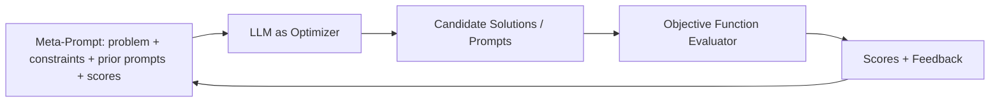
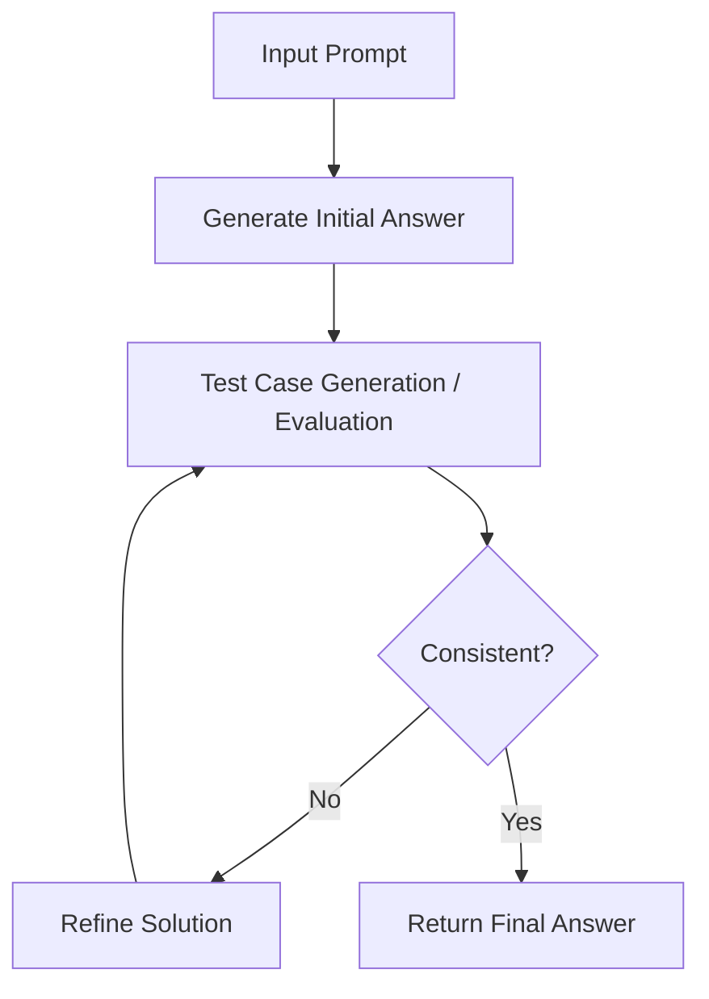
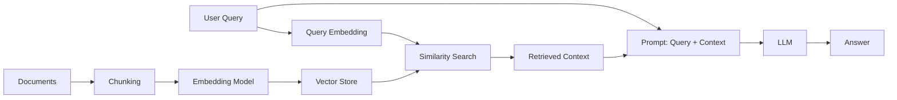
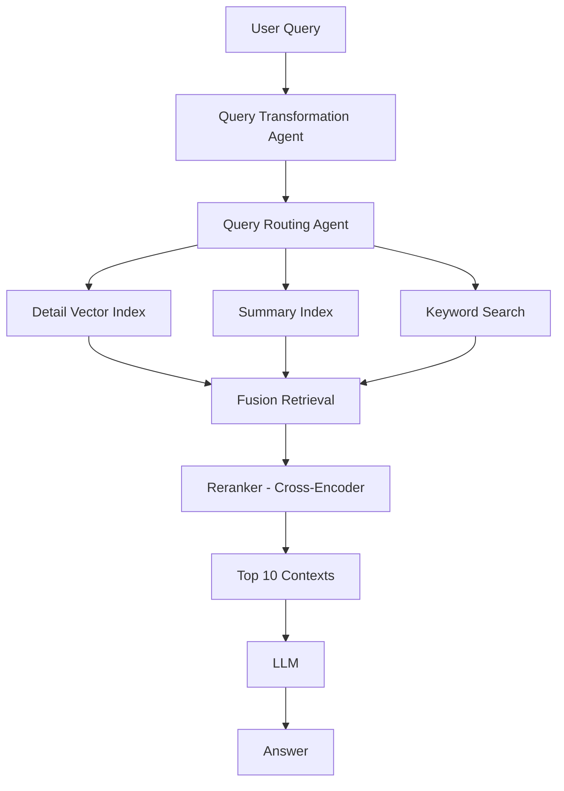
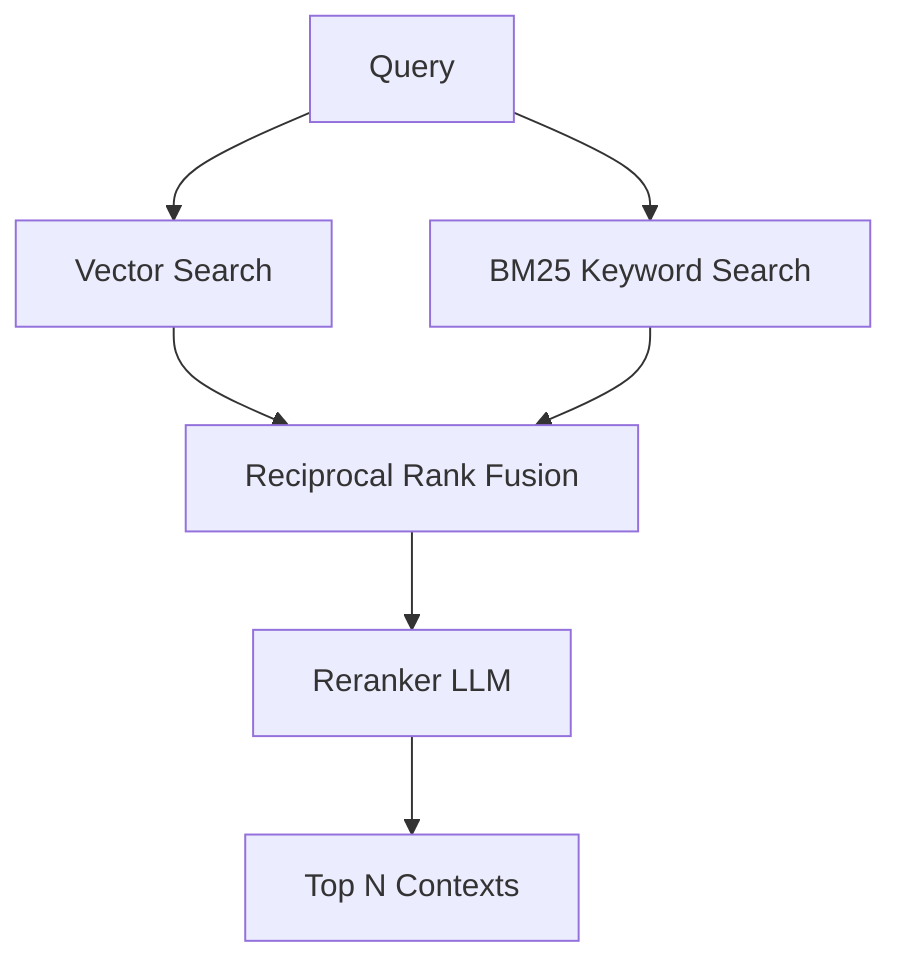

# Lecture 11: Advanced Prompt Engineering and Retrieval Augmented Generation (RAG)

**Course**: CST8510 Artificial Intelligence Software Development, Week 11
**Lecturer**: Dr. Hari M Koduvely

This lecture covers two major topics. The first half explores advanced prompt optimization techniques that improve LLM answer quality beyond basic prompting. The second half introduces Retrieval Augmented Generation (RAG), including agentic RAG architectures, chunking strategies, reranking, and fine-tuning of embeddings.

> **Primary source**: Most of the content is based on the article *Beyond Fine-tuning Approaches in LLM Optimization* by Superwise, plus the paper *Large Language Models as Optimizers* and *Advanced RAG Techniques: an Illustrated Overview*.

---

## Part 1: Prompt Optimization

### 1. "Opt-Out" Confidence Thresholding

Before diving into specific techniques, the lecture introduces the core design idea: if the LLM is not confident in its answer, it should have a graceful way to **opt out** rather than guessing. There are two ways to realize this.

#### Implicit Approach

The LLM performs its own self-confidence evaluation and routes low-confidence cases to one of:

- **Human support** (a live agent).
- A **general LLM** (fallback to a larger or more capable model).
- A user-friendly **"I don't know"** message.

#### Explicit Approach

A rule-based threshold computed from multiple samples (self-consistency). Two concrete measures can be used:

- **Uncertainty**: the proportion of answers that are unique (singletons across the sampled outputs).
- **Token likelihood**: the cumulative token probability of an LLM output.

#### Example System Prompt: Virtual Air Travel Agent

The lecture uses a virtual air travel agent as the running example. The full system prompt illustrates how "opt-out" is baked into the prompt:

```text
SYSTEM:
I want you to act as a virtual air travel agent with expertise in customer
support that receives, as input, customer requests for information and
assistance pertaining to the end-to-end airport experience. Please
categorize each request into one of the following categories:

- Flight Bookings: Requests for flight bookings, cancellations,
  modifications, or upgrades
- Flight Information: Requests for flight details, live schedule information,
  boarding times, safety protocol, and other flight procedures
- Flight Resources: Requests to track or identify baggage, locate
  transportation services post-flight, or find available curbside and
  parking locations and resources pre-flight

For example, a user request of "I'm noticing some heavy rain in my area.
Should I expect any delays for my flight that departs in 2 hours?" would
receive a Flight Information label.

Please only provide the request label in your response. If you are unsure
of the proper label to assign based on the context above, please label the
request with Human Support so the customer can get directed to a live agent.
```

#### Prompt Components Annotated

The lecturer annotated each piece of the prompt to show good structure:

| Component | Example from Prompt |
|-----------|---------------------|
| **Persona introduction** | "I want you to act as a virtual air travel agent..." |
| **Capability articulation** | "...receives, as input, customer requests..." |
| **Definition of scope** | The three category definitions |
| **Placeholder for multi-shot** | The "for example" section |
| **Output specification with "opt-out"** | The final sentence routing to Human Support |

> **Key takeaway**: A production-grade prompt should always include an opt-out route so the model can gracefully defer rather than guess.

---

### 2. Self-Consistency (Majority Voting)

**Self-consistency**: a technique that improves the consistency of an LLM system without altering its architecture. You send the same prompt multiple times, sample a **diverse set of reasoning paths**, and marginalize them to select a final answer.

#### Motivating Contrast: Chain-of-Thought (Single Path) vs Self-Consistency

First, consider a **single-path chain-of-thought** response to a flight problem:

**User prompt**: *"I'm flying from BNA to ATL. If I need to land by 1 PM local time, by what time should my flight leave?"*

**Single CoT answer**:

> "If you need to land by 1 PM, you should consider the following: 1:00 PM (desired arrival time) minus 1 hour (flight time) equals 12:00 PM. ... So: 12:00 PM minus 30 minutes equals 11:30 AM."
>
> **The answer is 11:30 AM.**

Now compare this against a self-consistency approach.

#### Self-Consistency Setup

The system prompt explicitly asks for step-by-step reasoning and includes a similar worked example:

```text
SYSTEM:
You are a calculator. Take the computational process step by step.

Q: I have a flight from MSP to MIA departing at 9 AM local time.
   What's my expected arrival time?
A: Start with the expected flight time: 3 hours and 30 minutes.
   Add the flight time to the departure time: 9 AM + 3 hours + 30 minutes
   = 12:30 PM. Account for any time zone changes: 12:30 PM + 1 hour = 1:30 PM.
```

#### Sample Diverse Reasoning Paths

Running the same user prompt multiple times produces different reasoning paths:

1. "The flight from Nashville (BNA) to Atlanta (ATL) typically takes around 1 hour [...] you would need to depart from Nashville no later than **11 AM CST** to account for the 1-hour flight time."
2. "To answer this question, we need to consider two main factors: the flight duration and the time difference between the two locations [...] you should aim to take off from Nashville at least 1 hour before, so around **12 PM local time**."
3. "Flight Duration: The average flight duration from BNA to ATL is approximately 1 hour [...] aim for a flight that leaves around **11 AM local time** from BNA to ensure you land in ATL by 1 PM."

The second answer (12 PM) failed to account for the time zone difference correctly. Reasoning paths 1 and 3 both arrive at 11 AM.

After marginalizing out the reasoning paths to aggregate final answers:

> **The self-consistency answer is 11 AM.**

Note how this differs from the single-path CoT answer of 11:30 AM. Self-consistency eliminates the one-off reasoning error.

#### Key Properties of Self-Consistency

- Running the query three or five times and taking the majority gives a more reliable output than a single query.
- This technique is a kind of **litmus test**. It only applies when the answer is a simple single number, word, or short phrase (e.g., "11 AM" or "12 PM").
- It does not work for open-ended responses like essays, code, or long explanations, because two long answers rarely match exactly.

> **Key takeaway**: Self-consistency is a majority-vote scheme that reduces randomness in LLM outputs, but it only works when answers can be cleanly compared for equality.

---

### 3. Uncertainty Thresholding with Self-Consistency

Even with majority voting, the correct answer only appears roughly one-third to 60 percent of the time in many cases. To reach higher confidence (for example, 90 percent), you layer a **threshold** on top of self-consistency.

#### The Pipeline

```text
Chain-of-Thought Prompt  →  Diversified Reasoning Paths  →
Uncertainty Threshold Application  →  Reasoning Path Selection
```

#### The Algorithm

1. Run the same query multiple times (e.g., 5 or 10 times).
2. Collect all unique outputs.
3. Count how many times each unique output occurred.
4. Compute the proportion of each unique output.
5. Apply a decision rule based on a chosen threshold.

#### Worked Example: Sample Outputs

Five sampled outputs from the flight query:

- "...11 AM CST..."
- "...12 PM local time..."
- "...11 AM local time..."
- "...12:30 PM CST..."
- "...11 AM CST..."

Three outputs cluster on **11 AM** after normalization. Two are singletons (12 PM and 12:30 PM).

#### Decision Logic

The slide's framing uses the **unique output proportion** (the fraction of singleton/one-off outputs):

- If **Unique Output Proportion < 0.5**, return the majority answer → **11 AM**.
- Otherwise, return **"I don't know"** and route to one of:
  - A **general LLM** (larger/stronger fallback).
  - **Human support**.
  - A **user-friendly message**.

#### Formal Decision Rule *(reconstructed)*

Let $u$ be the unique output proportion and $\tau$ the chosen threshold.

$$
\text{output} = \begin{cases} \text{majority answer} & \text{if } u < \tau \\ \text{"I do not know"} & \text{otherwise} \end{cases}
$$

The threshold depends on your comfort with risk. A lower threshold means stricter rejection, producing fewer answers but with higher confidence in those answers.

This technique is called **uncertainty thresholding with self-consistency**. It goes one step beyond plain self-consistency by adding a confidence requirement on the level of agreement across samples.

> **Key takeaway**: Uncertainty thresholding combines self-consistency with an explicit confidence gate, and wires the "I don't know" branch to a well-defined fallback route.

---

### 4. Active Prompting

**Active prompting**: a technique that uses feedback from uncertain answers to dynamically grow a pool of few-shot learning examples that the prompt draws from.

#### The Iterative Loop

The full active-prompting loop is a 7-step cycle:

1. **Sample of prospective new shots** (automated or human-engineered candidate examples).
2. **Diverse answers**: run CoT with self-consistency on these shots.
3. **Uncertainty threshold application**: identify which shots produce uncertain answers.
4. **Top-N most uncertain shots**: pick the hardest examples.
5. **Add to shot set** (insert them into the LLM context as few-shot examples, with correct answers manually supplied).
6. **Shot set evaluation**: check token constraints, bias-variance tradeoffs, completeness, etc.
7. **Loop back to step 1**.

#### Why It Helps

The LLM is effectively being taught on the very questions where it struggles. By feeding the model correct demonstrations of its weakest question types, subsequent queries of that type have a higher chance of producing the correct answer. You do not need to include every collected example in every prompt. You can sample from the growing pool.

> **Key takeaway**: Active prompting dynamically learns with the feedback and improves the prompting. This is the third major technique for optimizing prompting.

#### Minimal Example of Active Prompt Structure *(reconstructed example)*

```text
You are a helpful assistant. Here are examples of similar problems:

Example 1:
Q: I am flying from BNA to ATL. I need to land at 1 PM local time in Atlanta.
   By what time should my flight leave?
A: Atlanta is in Eastern Time, Nashville is in Central Time (1 hour behind).
   Landing at 1 PM Eastern corresponds to 12 PM Nashville local time.
   Flight time is about 1 hour. Therefore, depart Nashville at 11 AM local time.

Now answer the following question:
Q: {new question}
```

---

### 5. OPRO: Optimization by PROmpting

**OPRO (Optimization by PROmpting)** is a simple yet effective technique that employs LLMs themselves as optimizers. The optimization task is described in natural language. The LLM generates new solutions based on the problem description and previously found solutions. This iterative process converges to an optimal solution.

> **Reference**: *Large Language Models as Optimizers* (paper). This result comes from a published paper, not an anecdote.

#### How OPRO Works

Three components make up the OPRO loop:

| Component | Role |
|-----------|------|
| **Meta-Prompt** | Input to the LLM containing the problem description, solution constraints, and previously evaluated solutions with their corresponding scores |
| **LLM as Optimizer** | Generates new candidate solutions based on the information in the meta-prompt |
| **Objective Function Evaluator** | Evaluates the new solutions and provides feedback to the LLM, which is then used to refine the meta-prompt for the next optimization step |

#### Pipeline Diagram *(reconstructed)*



The Evaluator can be another LLM acting as a judge, or a human in the loop (feasible only for small candidate sets).

#### Real-World Example: GSM8K Prompt Optimization

The **GSM8K dataset** is a grade-school math dataset containing 8,000 questions. Researchers used OPRO to find better prompt prefixes. The discovered prompts and their scores:

| Prompt | Score |
|--------|-------|
| **Take a deep breath and work on this problem step-by-step.** | **80.2** |
| Break this down. | 79.9 |
| A little bit of arithmetic and a logical approach will help us quickly arrive at the solution to this problem. | 78.5 |
| Let's combine our numerical command and clear thinking to quickly and accurately decipher the answer. | 74.5 |

The winning prompt was itself generated by an LLM through the OPRO procedure, not by a human.

> **Why it works**: The effectiveness is not because of "take a deep breath" (LLMs do not breathe). The performance gain comes from **"step-by-step"**, which acts like a chain-of-thought instruction. It prompts the LLM to break down the problem and reason sequentially.

#### When OPRO Is Useful

OPRO works well for small, well-defined optimization problems that can be described in natural language:

- Small convex optimization problems.
- Small instances of traveling salesman problems (not large-city versions, which remain intractable).

You cannot solve a large-city traveling salesman problem with an LLM. But small instances described in words can be solved.

---

### 6. Reflexion (Self-Evaluation and Self-Reflection)

**Reflexion**: a family of techniques where the LLM performs its own sanity check on an answer before returning it, or refines based on feedback. The paper that introduced this (attributed to Google in the lecture) predates modern reasoning models.

#### Why Reflexion Matters

As humans, we always sanity-check our work. We solve a problem, then before submitting the exam, we go through it and verify correctness. Without Reflexion, an LLM's first generation just produces the next token, then the next, with no real reasoning process. When the LLM reflects, it takes the generated answer and does significantly more reasoning to verify correctness.

#### Use Cases for Reflexion

Reflexion is for scenarios where ground truth is out of reach, but you want a feedback loop that iteratively approaches high-confidence outputs. Key benefits:

1. **Correction of errors**, especially for multi-step reasoning or code generation tasks.
2. **Improvement of output quality**, especially for requirement satisfaction.
3. **Boost in contextual understanding** through evaluation of interpretations.

#### Two Core Approaches

| Type | Trigger | Mechanism |
|------|---------|-----------|
| **Feedback-Driven Reflexion** | Negative user feedback (e.g., thumbs up/down in chat UI) | LLM revises answer based on user's verdict |
| **Implicit Reflexion** | No external trigger, applied on all requests before front-end delivery | LLM inspects output internally for errors before returning |

#### Reflexion Pipeline

```text
Task  →  Proposed Solution  →  Internal Tests  →  Self-Reflection  →  Refined Solution
                                      ↑
                              Test Generation
```

The LLM generates an initial answer, generates internal test cases, runs them, and if inconsistencies are found (for example between input and output), refines the solution and re-tests. The loop continues until the solution is consistent.

#### Human Analogy (from the lecturer)

> When you write a letter or a poem, you do not think much. It is a creative process where you just write whatever comes to mind. Then you put on your rational mind, reread it, check the grammar, and look for ways to improve. That is the same pattern an LLM uses when reflecting.

#### Implicit Reflexion Process Diagram



In the lecturer's original slide, the self-reflection stages (evaluate, test, refine) were highlighted in pink boxes.

> **Course note**: This paper came out before the era of reasoning models. Reasoning models like DeepSeek and similar later systems always perform this kind of self-verification internally, producing multiple answers. The "thinking mode" in Gemini and similar systems performs something close to implicit Reflexion automatically.

---

#### Example: Feedback-Driven Reflexion

**User prompt**: *"My flight has been delayed. Where can I go for more information on my flight's status?"*

**Initial response (labeled poor)**:

> "I'm sorry to hear that! For more details on your flight, please visit our Flight Status page."

This response was flagged as poor. Depending on **which kind** of fault the user reported, a different self-reflection layer is triggered.

#### Feedback-Driven Self-Reflection Layer: Two Label Types

The prompt template has two branches depending on the user's label:

| User Label | Hidden Instruction Sent to LLM |
|------------|--------------------------------|
| **General (poor)** | *"Please modify the **relevance** of your previous response to the customer's request for up-to-date flight status information. Offer a more **specific and helpful** solution."* |
| **Specific (incomplete)** | *"Please modify the [**completeness**, accuracy, helpfulness, specificity] of your previous response to the customer's request for up-to-date flight status information. Offer a more [**complete**, accurate, helpful, specific] solutions."* |

#### Refined Response (after feedback)

> "I'm sorry to hear that! For more information on your delayed flight, please consider consulting one of the following resources:
>
> 1. **Airport Website**: Please visit our Flight Status page for real-time information about flight status, delays, and any changes to the schedule.
> 2. **Airline Kiosk**: Ask an airport representative for updated flight details before entering a security checkpoint.
> 3. **Airport Information Screens**: Your airport will display real-time flight information on departure and arrival screens located throughout the terminals."

The revised answer is substantially more specific. The improvement happened because the user provided the feedback that the initial response was not good.

A practical design suggestion from the lecturer: add a follow-up prompt like **"was this feedback helpful or not?"** If the user says **no for both** the initial and the revised response, keep both of those poor responses and insert them into the prompt, then retry. This drives further refinement until the user is satisfied.

---

#### Example: Implicit Reflexion

The user asks the same question: *"My flight has been delayed. Where can I go for more information on my flight's status?"*

**Initial response**: same as before, "I'm sorry to hear that! For more details on your flight, please visit our Flight Status page."

A **hidden self-reflection layer** is inserted into the instruction set, evaluated internally before delivery:

> *"Evaluate the **relevance** of your previous response to the customer's issue of intermittent internet connection. Offer a more specific and helpful solution **if necessary**."*

> **Note**: The "intermittent internet connection" phrasing in the hidden instruction is templated and does not literally match this flight delay scenario. This illustrates that hidden instructions are often generic prompts designed to trigger re-evaluation regardless of the specific user query.

The LLM produces the same **refined response** as the feedback-driven example (airport website, airline kiosk, airport information screens), but does so **without external feedback**. The reflection happens entirely within the LLM before the front-end sees the result.

---

### Summary of Prompt Optimization Techniques

| Technique | What It Does | Requirement |
|-----------|--------------|-------------|
| **Fallback / opt-out instruction** | Tell the LLM to say "I do not know" if unsure, route to human/general LLM | Basic, always available |
| **Self-consistency** | Send query multiple times, take majority answer across reasoning paths | Answer must be a single word or number |
| **Uncertainty thresholding** | Only accept majority answer if unique-output proportion is below threshold | High-confidence applications |
| **Active prompting** | Iteratively feed the hardest uncertain cases back as labeled few-shot examples | Feedback loop and growing example pool |
| **OPRO** | Use LLM itself as optimizer, evaluator scores prompts, iterate | Suitable for small optimization problems |
| **Feedback-driven Reflexion** | User feedback (thumbs up/down, general vs specific labels) triggers LLM self-revision | User feedback channel |
| **Implicit Reflexion** | LLM evaluates its own answer via a hidden instruction before delivery | Hidden instruction layer |

> **Course note**: Prompt engineering has become almost a profession of its own. Companies are now hiring separate people just for prompt engineering. Even though reasoning LLMs (with chain of thought built in) have improved, these techniques still matter for the many non-reasoning models in widespread use (standard GPTs, Geminis, etc.). As a general engineer, you should know all of these.

---

## Part 2: Retrieval Augmented Generation (RAG)

### Naive RAG

The baseline RAG architecture everyone should already know.

#### Pipeline

```text
query  →  Embedding model  →  Vector Store Index  →  Database  →  context  →  LLM  →  answer
```

The query also flows directly to the LLM alongside the retrieved context.

#### Simple RAG Pipeline Diagram *(reconstructed)*



#### Minimal Python-Style Illustration *(added)*

```python
chunks = split_into_chunks(documents)
embeddings = [embed(chunk) for chunk in chunks]
vector_store.add(embeddings, chunks)

def answer(query):
    q_emb = embed(query)
    context = vector_store.similarity_search(q_emb, top_k=10)
    prompt = f"Context: {context}\n\nQuestion: {query}"
    return llm.generate(prompt)
```

#### Problems with Naive RAG

- The main issue is **how you vectorize your data**.
- The answer may not be contained in a single chunk. To mitigate this, chunks are often created with overlap, but this is imperfect.
- The query and the answers are **not always semantically close**. Many valid answers share similarity with each other but not obviously with the query.
- As a result, naive RAG does not always give good **recall** and **precision**.

There are roughly **20 different kinds of RAG** being explored in the literature. Even the lecturer does not know them all. This lecture covers the common principles.

---

### Advanced (Agentic) RAG

**Agentic RAG** is a fancy term for a RAG pipeline where agents improve the pipeline at various stages. The advanced pipeline adds several new components.

#### Advanced RAG Pipeline

```text
query  →  [Agents: Query Transformation  →  Query Routing]
      →  [Fusion Retrieval]  →  [DB Storage]  →  [Reranking Postprocessing]
      →  retrieved context  →  LLM  →  answer
```

The DB Storage sits atop both a **Vector Store Index** and a **Summary Index**. The query also flows directly to the LLM alongside the retrieved context.

#### Query Transformation (Rewriting)

Sometimes a query is unclear or poorly phrased. If you **repurpose**, **reformulate**, or **reformat** the question, both you (and the LLM) can understand and answer it better.

An agent produces:

- A **transformed query**.
- A **list of queries** (potentially multiple variants).
- A **tool choice** (which downstream retrieval path to use).

> **Key takeaway**: Rewriting is very, very important. The lecturer's own experiments have consistently found that rewriting always helps.

**Tradeoff**: Rewriting increases latency for the traditional RAG pipeline. If latency is critical, you may skip this step.

#### Query Routing

You can send the query to:

- **Multiple vector stores**.
- **Multiple LLMs**.
- A decision point between **vector search** and **keyword search**.

An agent inspects the query and decides which retrieval mechanism best fits this particular query.

#### Multiple Indexes: Detail vs Summary

For large document collections (like a book), you can maintain two kinds of indexes.

| Index Type | What It Contains | When to Use |
|------------|------------------|-------------|
| **Detail (Vector Store) index** | Each chunk of the source converted to a vector | Fine-grained factual questions |
| **Summary index** | A high-level summary of each paragraph or chapter | Big-picture or overview questions |

For some queries, the summary view is enough. For others, you need the detail. For still others, a keyword search may be better. The agent decides.

> **Key takeaway**: You can have one agent that does query transformation and another that does query routing.

#### Agentic RAG Architecture *(reconstructed)*



Each agent has its own internal LLM assistant, which is what allows it to make routing and transformation decisions.

---

### Improvement in Chunking

Chunking strategy has a huge impact on RAG quality. There is an evolution from basic to semantic.

#### 1. Character Splitting (Size-Based)

- Chunking text into equally sized documents based on character or token length.
- Example: if the embedding model's context length is **512 tokens**, chunk roughly to that size with an **overlap (stride) of ~128 tokens** (one-third to one-fourth of the chunk size).

**Failure modes**:

- **Multiple topics in one chunk**: boundaries fall inside a semantically unified passage.
- **One topic in multiple chunks**: a single coherent topic is split across several chunks.

#### 2. Unstructured Chunking

**Unstructured chunking** (content-aware): uses syntactical rules to identify natural text objects and assigns one chunk per object.

- Example rule: each paragraph or heading section becomes its own chunk.
- **Benefit**: Assigning one chunk to each text object produces semantically consistent documents of varying lengths.
- **Drawback**: Syntactical similarity plus proximity does not always equal semantic similarity.

#### 3. Semantic Chunking (Contextual Compression)

This is the modern approach and is considered one of the very important steps for good RAG.

**Process**:

1. Split the document into sentences.
2. Create an embedding for each sentence.
3. Perform **semantic clustering** on sentence embeddings, grouping sentences that are semantically close.
4. Each cluster becomes a chunk (and is re-indexed).

**Enhancement**: Instead of single sentences, use a window of two sentences when computing embeddings.

- **Benefit**: Semantically tight chunks ensure minimal loss. Built-in **contextual compression** minimizes unneeded noise sent to the LLM.
- **Drawback**: Contextual richness of the original corpus structure is lost. Compute cost increases.

> **Key takeaway**: Semantic chunking leads to better retrieval and more semantically coherent answers. It is one of the three pillars the lecturer always recommends in RAG architecture.

#### Chunking Strategy Comparison

| Strategy | Boundary Rule | Pros | Cons |
|----------|---------------|------|------|
| Character splitting | Token/character count (e.g., 512) with ~128 overlap | Simple, fast | Multiple topics per chunk, one topic split across chunks |
| Unstructured (syntactical) | Natural objects like paragraphs | Semantically consistent, variable length | Syntax does not always match semantics |
| Semantic | Cluster sentences by embedding similarity | High semantic coherence, contextual compression | Loses corpus-level structure, higher compute |

---

### Extending the Context Window: Sentence Window Retrieval

After retrieving the best-matching sentence, you **extend the window** by including some sentences from before and after, then send the broader context to the LLM.

#### Example from the Slides

**Query**: *"Why is A23a moving?"*

**Retrieval returns the matching sentence in bold, surrounded by context**:

> The largest iceberg, A23a, is a massive ice shelf that calved from the Antarctic coastline in 1986 and was grounded in the Weddell Sea for over 30 years. It spans about 1,500 square miles, making it more than twice the size of Greater London and about three times the size of New York City. It is approximately 400 meters (1,312 feet) thick, making it a true colossus of ice.
>
> **Recently, A23a has broken free from the ocean floor and is now drifting in the open sea, heading towards the South Atlantic on a path known as "iceberg alley."**
>
> If it reaches South Georgia, it could disrupt the foraging routes of seals, penguins, and other seabirds, preventing them from feeding their young properly. There are also concerns that it could cause disruptions to shipping if it heads toward South Africa, potentially leading to collisions and other hazards for maritime traffic. A23a's movement is being closely monitored, as it could have significant impacts on the environment and human activities.

The **extended context** (the full passage, not just the single sentence match) is passed to the LLM.

> **Caveat**: The lecturer noted this may make the overall prompt noisier, and its effectiveness is uncertain. The final LLM context becomes larger, which may not always be beneficial.

---

### Fusion Retrieval / Hybrid Search

**Hybrid search** (also called **fusion retrieval**): combine vector search with keyword search, then use **Reciprocal Rank Fusion (RRF)** to merge the two ranked lists.

#### Pipeline

```text
query + Documents  →  Vector Index  →  Top-k results

query + Documents  →  Sparse n-grams index (BM25)  →  Top-k results

Both top-k result sets  →  Reciprocal Rank Fusion (RRF)  →  Top-n  →  LLM  →  answer
```

#### Why Hybrid Search Works

Some content is not captured well by embedding similarity. The lecturer's example is cybersecurity:

- Rare tool names.
- Rare processes used for cyber attacks.

These do not surface reliably in vector similarity search because the embeddings may not encode their rarity or specificity well. But they are exactly the kind of **rare keywords** that a keyword search (BM25) catches.

Hybrid search merges the strengths of both:

- **Vector search**: captures semantic similarity.
- **Keyword search (BM25)**: captures exact terms and rare tokens.
- **Reciprocal Rank Fusion**: combines the ranked lists from both retrievers.
- **Reranker**: optional further step to order by joint query-document relevance.

> **Class discussion note**: The lecturer connected this cybersecurity rare-keyword argument to a related point raised earlier by a student (PJ) in class, reinforcing that keyword search complements vector search for domain-specific or rare terminology.

#### Hybrid Search Pipeline *(reconstructed)*



---

### Reranking

#### The Problem with Simple Similarity Search

When you query a vector store, results come back in a particular order based on **cosine similarity** between the query embedding and each chunk embedding. But this may not produce the best priority.

> Cosine similarity treats the query and the document as **two independent vectors** and only looks at their geometric distance. It never actually compares the query and document together to check semantic relevance.

#### The Solution: Reranker

A **reranker LLM** takes the originally ranked list of answers as input, inspects the query and each answer **together**, decides whether the relevance is high or low, and produces a new ranking.

**Two-stage retrieval pipeline**:

1. Initial retrieval with **bi-encoders** returns the top 100 chunks.
2. Pass those to a **cross-encoder reranker**.
3. Take the reranker's top 10 as final context.

#### Bi-Encoders vs Cross-Encoders

| Model Type | How It Processes Input | Where Used |
|------------|------------------------|------------|
| **Bi-encoder** | Encodes query and document separately, compares via cosine similarity | Initial retrieval in RAG |
| **Cross-encoder** | Encodes query and document together, uses reasoning to decide relevance | Reranking |

> **Key takeaway**: Cross-encoder models are called "cross" encoders because they consume both the query and the document together when deciding the ranking, using reasoning over the pair rather than just geometric proximity.

#### Relevance Scoring Models

- **BERT-based rerankers** / cross-encoder models.
- Considers both the query and the retrieved result **together**.
- **BM25** is the classic traditional ranking algorithm, considering term frequency and document length. It is also used as the keyword retriever in hybrid search.

#### Tradeoffs of Reranking

- **Improves quality of retrieval significantly**.
- **Increases latency** (two-stage processing).
- **Additional computational cost**.

#### Minimal Cross-Encoder Usage Example *(added)*

```python
from sentence_transformers import CrossEncoder

reranker = CrossEncoder("cross-encoder/ms-marco-MiniLM-L-6-v2")

query = "When should my flight leave?"
candidate_chunks = ["...top 100 chunks from similarity search..."]

scores = reranker.predict([(query, chunk) for chunk in candidate_chunks])
reranked = [c for _, c in sorted(zip(scores, candidate_chunks), reverse=True)][:10]
```

---

### Fine-Tuning the Embedding Model

The final improvement option covered in the lecture.

#### Background on Embedding Models

- Embedding models are trained using **standard dataset corpora**.
- They are **smaller** than typical LLMs, typically **less than 1 billion parameters**.
- Because of their size, they do not have very deep knowledge of every domain and may not capture deep semantic relationships in a specialized document set.

#### The Fine-Tuning Option

You can fine-tune the embedding model on your own domain data to specialize it.

> **Cost comparison**: Fine-tuning the embedding model is **more cost effective than fine-tuning the LLM itself**, because embedding models are much smaller (under 1B parameters).

#### Lecturer's Recommendation

> **Course note**: Fine-tuning the embedding is **not generally recommended** unless you have:
>
> 1. A lot of training data.
> 2. A genuine need to specialize to a specific domain.
> 3. Already tried all other RAG improvements (rewriting, semantic chunking, reranking, hybrid search) and still need more quality.

Embedding fine-tuning is very sensitive to:

- The **quality** of the training data.
- The **quantity** of training data.

For most teams, the effort is not worth the marginal gain unless all other techniques have been exhausted.

---

### Key Architectural Recommendations

Based on the lecturer's experience, every production RAG pipeline should include:

1. **Rewriting (query transformation)**: always helps.
2. **Semantic (or contextual) chunking**: always helps.
3. **Hybrid search**: always helps.

> **Key takeaway**: Keep these three things in your RAG architecture.

**Tradeoff warning**: Rewriting increases latency. If latency is critical in your application, you may drop it. But hybrid search should almost always be included since its cost is modest.

> **Course note**: All slides in this lecture are linked to external papers and articles. Follow the links for more detail.

---

### Summary of RAG Improvements

| Improvement | What It Does | Recommendation |
|-------------|--------------|----------------|
| **Query rewriting** | Reformulates unclear queries | Strongly recommended, accept latency cost |
| **Query routing** | Chooses between indexes and search types | Useful with multiple data sources |
| **Multiple indexes** (detail + summary) | Enables different query granularities | Useful for large corpora |
| **Sentence window retrieval** | Extends context around retrieved match | Optional, may add noise |
| **Semantic chunking** | Clusters sentences by embedding similarity | Strongly recommended |
| **Hybrid search** (vector + BM25 + RRF) | Combines keyword and vector retrieval | Strongly recommended |
| **Reranking (cross-encoder)** | Reorders top-100 with joint query-document reasoning | Strongly recommended, accept latency cost |
| **Embedding fine-tuning** | Specializes embedding model to a domain | Last resort only, but cheaper than LLM fine-tuning |

---

## Summary of Today's Learning

The lecture concluded with a three-part recap:

1. **Different prompt optimization methods**: self-consistency, uncertainty thresholding, active prompting, OPRO.
2. **Reflection methods**: self-driven (implicit) and feedback-driven Reflexion.
3. **Improving RAG through**:
   - Better chunking (semantic > unstructured > character splitting).
   - Reranking with cross-encoders.
   - Fine-tuning embedding models (last resort).

> **Course note**: Next week's class will cover **fine-tuning** in depth as its own standalone topic.

---

## References

- **Beyond Fine-tuning Approaches in LLM Optimization** by Superwise (primary source for prompt optimization and Reflexion content).
- **Large Language Models as Optimizers** (OPRO paper).
- **Advanced RAG Techniques: an Illustrated Overview** (RAG architecture content).
- **Relevance Revolution: how Re-ranking Transforms Rag Systems** (reranking deep dive).
- *Reflexion: An Iterative Approach to LLM Problem Solving* at promptengineering.org.
- *RAG Isn't So Easy: Why LLM Apps Are Challenging and How Unstructured Can Help* at medium.com/unstructured-io.
- *Text Splitting / Chunking for RAG Applications* at medium.com (Hadi Azouni).
