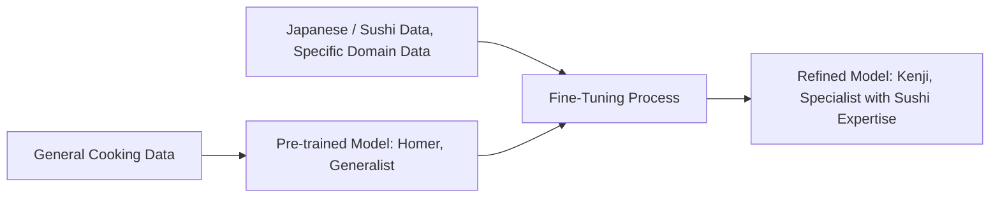
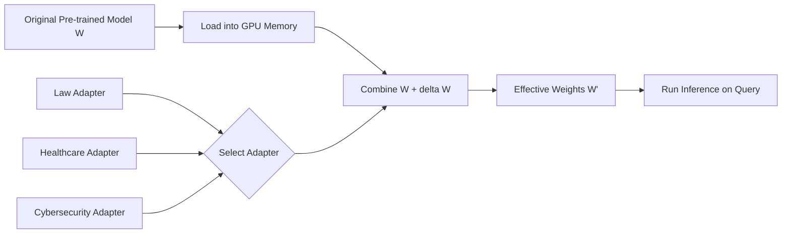
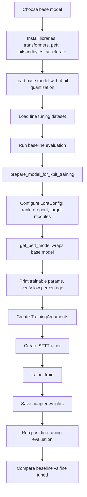

# Lecture 12: LLM Fine Tuning

**CST8510 Week 12, Dr. Hari M Koduvely**

## Course Context

This is the final lecture of the course. In previous sessions we covered:

1. **Prompt optimization**
2. **RAG** (Retrieval Augmented Generation)
3. **Instruction tuning**

Today's topic is **LLM fine tuning**, followed by a code walkthrough that students can copy to Google Colab and run.

> **Course note**: The instructor mentioned that the code demo may not fully execute during class because training takes time. Students should run the code at home to gain hands-on experience. If you know RAG fine tuning and LoRA fine tuning, you pretty much know GenAI.

### Summary of Today's Learning (from slides)

- What is fine tuning LLMs
- When to and when not to fine tune
- LoRA and PEFT
- Colab implementation of LLaMA fine tuning using cybersecurity data

---

## What is LLM Fine Tuning

**Fine tuning** is the process of tuning a broad general-purpose LLM to perform exceptionally well on a specific domain or task.

**Foundation models** (also called **base models**) are pre-trained on a vast amount of general data so they can handle generic tasks like question answering and creating embeddings. However, they fail miserably when asked very domain-specific questions. Fine tuning closes that gap.

### The Sushi Chef Analogy

> **Key analogy**: A **home cook** versus a **sushi chef**. A home cook knows how to cook a variety of foods but not to expert level. A sushi chef knows only one thing to cook, and that one thing is very tasty.

The slides personify this analogy with two characters:

| Character | Role | Knows | Can Make |
|-----------|------|-------|----------|
| **Homer (the Home Cook)** | Pre-trained LLM, generalist | Basic cooking, general knowledge such as language, grammar, common facts | Steak, Soup, Pasta, Tacos |
| **Kenji (the Sushi Chef)** | Fine-tuned LLM, specialist | One cuisine deeply, domain-specific knowledge of sushi | Delicate Omakase |

- **Pre-trained LLM** = home cook (broad but shallow)
- **Fine-tuned LLM** = sushi chef (narrow but deep)

Fine tuning is the process of converting a general model into a specialist.

### Fine Tuning Pipeline in the Cooking Analogy *(from slides)*



> **Slide takeaway**: From general knowledge to specialized expertise through targeted data and training.

### Why it is Called "Fine" Tuning and Not "Training"

| Aspect | Training (from scratch) | Fine Tuning |
|--------|------------------------|-------------|
| Duration | Days or longer | Hours |
| Hardware | Large GPU clusters | Often a single small GPU |
| Data size | ~1 million tokens or more of input text | Small dataset |
| Parameters touched | All parameters updated | Only some layers tuned |
| Purpose | Build a general model | Adapt to a specific domain (healthcare, fintech, cybersecurity) or task (classification) |

---

## When to Fine Tune

The instructor listed six scenarios where fine tuning is the right choice.

### 1. Complex Specialized Tasks

When the LLM must perform a complex task like finding vulnerabilities in code, or writing code like a highly specialized expert software developer.

### 2. Cost and Latency Optimization

You may want to reduce cost by using a small LLM instead of a costly large one. But a small LLM may not summarize domain or organization-specific text well. You fine tune so that the smaller model matches the task efficiency and performance of a bigger LLM. This saves computational power.

### 3. Critical Applications Requiring Accuracy and Reliability

Some domains require extreme reliability:

- **Healthcare**
- **Aerospace**
- **OT systems** (operational technology, *added clarification*)
- **Law**

In these domains, accuracy matters even for general questions, not just classification. You do not want hallucination. You do not want made up references. For example, in law, accuracy and reliability are paramount, and fine tuning helps enforce that.

### 4. Tone and Style Adjustment

When you want the LLM to respond to customer queries in a specific way, for example:

- More **empathetic**
- More **factual**
- More **tolerant** to customer prompts

Some brands have a specific style of engagement. A luxury brand, for instance, speaks to customers a certain way in marketing material. Tone, style, and behavior must be adjusted when generating automated responses using the LLM.

### 5. Enforced Output Format

When you need the LLM to respond in a particular format such as JSON. In the old days, if you asked a small LLM to give output in structured JSON format with no text before or after, it would fail 80% of the time, or produce messy JSON 30% of the time. These days you can pass parameters to the invoke function to enforce it, but not all LLMs (particularly small LLMs) support that option. Fine tuning helps enforce a particular output format.

### 6. Domain Adaptation

When you want the model to have detailed knowledge of a specific domain such as cybersecurity, healthcare, law, or fintech. You can do RAG, but sometimes RAG is not enough, so domain adaptation through fine tuning becomes another option.

---

## What to Do Before Fine Tuning

Fine tuning is expensive and should be a last resort. Before fine tuning, try these techniques (covered in previous lectures). The slides group them into two families.

### Prompt Engineering

1. **Few-shot learning examples**
2. **Chain-of-Thought prompting**
3. **Self-consistent and threshold-based prompting**
4. **Prompt optimization using OPRO**
5. **Fallback strategies**

### Advanced Retrieval Augmented Generation (RAG)

1. **Semantic chunking** (chunk documents by meaning, not fixed size)
2. **Query transformation** (rewrite or expand the user query before retrieval)
3. **Fusion retrieval** (combine results from multiple retrievers)
4. **Re-ranking of retrieved context** (rank candidate chunks by relevance before feeding to the LLM)

> **Important clarification**: Fine tuning is **not** an alternative to these techniques. It is **AND**, not **OR**. Even after applying all these techniques, you may still need to fine tune. Sometimes you do all of the above AND fine tune together. It is not complementary in the sense of "if one fails, switch to the other." You often need both.

---

## When NOT to Fine Tune

Training an LLM is expensive. You do not want to train it every week or every day. The instructor gave four situations where fine tuning is the wrong choice.

### 1. Rapidly Changing Data Distributions

If your dataset is changing very frequently, fine tuning becomes impractical.

> **Example from the lecturer**: Stock market data. If you want your LLM to reason about stock market scenarios, do not use fine tuning, because stock market data changes constantly. Recent geopolitical events shift the stock distribution. It is not good to fine tune when data distribution changes quickly.

### 2. Simple Tasks

If the task is not very complex (like simple binary classification or simple multi-label classification), fine tuning may not improve accuracy much. Few-shot examples might be just as effective and less expensive.

### 3. Poor Quality Training Data

> **Garbage in, garbage out**. The quality of training data is paramount. Do not fine tune on bad data.

Even if you did all prompt optimization and RAG, and the application is critical enough to require fine tuning, poor data quality will still produce a poor fine-tuned model.

### 4. Data with Personally Identifiable Information (PII)

If your data contains PII or privacy-related information, do not fine tune directly. It is very hard to erase sensitive information once it is baked into a model through fine tuning. Always **mask** such data before fine tuning.

---

## Summary of Fine Tuning Decision Criteria

> **Course note**: The instructor repeated these for students who came in late. These are the scenarios when you **should** fine tune:
>
> 1. LLM must perform complex tasks
> 2. Cost and latency must be optimized
> 3. Critical applications where accuracy and reliability matter
> 4. You want to adjust tone and style for your brand
> 5. You want to enforce a particular output structure
> 6. You want to adapt the LLM to a specific domain (healthcare, fintech, law, cybersecurity)

---

## Different Ways of Fine Tuning

### Full Fine Tuning

You have some data, for example to adapt to the legal domain. You can train on top of the pre-trained model, updating every parameter.

**Problems with full fine tuning:**

1. **Catastrophic forgetting**: Whatever the LLM learned before can completely fail. If you do full fine tuning with only new data (without including the old pre-trained dataset), most of the time the model forgets what was there before, because the weights get overwritten.
2. **Very expensive**: Full fine tuning of a large model can cost thousands of dollars.

> **Key insight**: If you combine the old pre-trained dataset with the new dataset and do full fine tuning, it is fine. If you fine tune only on the new dataset and update all parameters, catastrophic forgetting happens.

#### Catastrophic Forgetting Illustration *(reconstructed example)*

```text
Before fine tuning:
  LLM knows: general knowledge, math, coding, law (shallow), healthcare (shallow), ...

After full fine tuning on legal data only (no base data):
  LLM knows: law (deep)
  LLM has lost: general knowledge, math, coding, healthcare, ...

After full fine tuning on legal data + original pre-training data:
  LLM knows: law (deep), general knowledge, math, coding, healthcare, ...
```

### Low-Rank Adaptation (LoRA) with Adapters

Instead of full fine tuning, people use **adapters** through a method called **low-rank adaptation**.

**Slide definition of LoRA:**

- Freezes the original model weights.
- Weights in selected layers are updated using small, trainable "adapter" modules.
- Only the adapters are trained, which is more memory and computationally efficient.
- Adapters can be switched easily to adapt to different domains or tasks.

#### How LoRA Works Conceptually

Think of your pre-trained model parameters as a tensor:

- Each **layer** is one row.
- Each **neuron weight** in a layer is like a column.
- Parameters are multi-dimensional, so it is really a tensor, but you can think of it as a matrix.

In LoRA:

1. **Freeze** the original model weights **W**. Do not touch them.
2. Select only some layers (or some neurons in those layers) to train.
3. The updated weight is defined by the equation below.

#### The LoRA Equation

$$W' = W + \Delta W$$

Where:

- $W$ is the original weight matrix (frozen, never modified)
- $\Delta W$ is the update matrix
- $W'$ is the effective weight used at inference time

#### Matrix Factorization: The Rank Trick

> **From the lecturer**: "The original matrix is D by D." In this simplified square case, the weight matrix has the same number of input and output dimensions. The same factorization idea applies to non-square matrices too.

Any matrix $\Delta W$ can be factorized as the product of two lower-rank matrices:

$$\Delta W = A \times B$$

Where if $\Delta W$ has size $m \times n$ (in the lecturer's example, $m = n = D$):

- $A$ is a tall matrix of size $m \times k$
- $B$ is a thin matrix of size $k \times n$
- $k$ is the **rank**, chosen to be small

If $k$ is small, then $A$ and $B$ together have far fewer parameters than $\Delta W$.

$$W' = W + A \cdot B, \quad A \in \mathbb{R}^{m \times k}, \quad B \in \mathbb{R}^{k \times n}, \quad k \ll \min(m, n)$$

#### Parameter Count Savings *(additional example)*

| Matrix | Dimensions | Parameters |
|--------|-----------|-----------|
| $W$ (original) | $1000 \times 1000$ | $1{,}000{,}000$ |
| $\Delta W$ if full | $1000 \times 1000$ | $1{,}000{,}000$ |
| $A$ with rank $k=8$ | $1000 \times 8$ | $8{,}000$ |
| $B$ with rank $k=8$ | $8 \times 1000$ | $8{,}000$ |
| $A \cdot B$ (total LoRA params) | N/A | $16{,}000$ |

With $k=8$, you train ~1.6% of the original parameter count for that layer.

#### Loading Adapters at Inference Time

You train only the small matrices $A$ and $B$. You keep that $\Delta W$ separately. At the time of loading the model into memory, you compute $W + \Delta W$ and use that as the effective weight. The original weights remain untouched on disk.

#### Before and After Fine Tuning *(from slides)*

**Before Fine Tuning (general knowledge)**

- Base LLM $W_{orig}$ with **billions of parameters**.
- Knowledge drawn from diverse datasets and common language.
- Original frozen weights $W_{orig}$ of size $d \times d$.
- Produces general responses for a wide range of questions, such as writing poetry, explaining history, summarizing news.

**LoRA Fine Tuning Process (specialized training)**

- Training process applied with a new, domain-specific dataset, for example **medical texts**.

**After Fine Tuning (specialized and general knowledge)**

- Original frozen $W_{orig}$ of size $d \times d$ combined with a small task-specific **LoRA adapter**.
- Generates custom task-specific responses with domain-specific terms.
- Formula recap: $W_{new} = W_{orig} + (A \times B)$
- Produces a fine-tuned, domain-specific LLM, for example one for **medical diagnosis** or **code generation**.

#### Fine Tuning Comparison *(from slides)*

| Approach | Mechanism | Cost and Outcome |
|----------|-----------|------------------|
| **Traditional Fine Tuning** | Update all parameters | High cost |
| **LoRA Fine Tuning** | Add low-rank matrices | Low cost, fused, specialized model |

#### Component Summary *(slide table)*

| Component | Function | Update Status | Size (Parameters) |
|-----------|----------|---------------|-------------------|
| **Base LLM** | Core knowledge (generalist) | **FROZEN** | **Billions** |
| **LoRA Adapter** | New tasks / domain skill (specialist) | **Updatable** | **Millions** (very small fraction) |

### Multiple Adapters for Multiple Domains

> **Key advantage**: You can keep different adapters for different domains. The same LLM can be fine tuned to produce:
>
> - An adapter for **law**
> - An adapter for **healthcare**
> - An adapter for **fintech**
> - An adapter for **cybersecurity**

Fine tuning means generating the adapters. Depending on the application, you switch adapters. The original model is loaded once, then the relevant adapter is added on top to form the effective weights for inference.

#### Adapter Switching Pipeline *(added)*



### Size and Hardware Advantages

- **Adapters are small**, on the order of **a few MB**, not GB.
- **Original model is large**, typically GB in size.
- Adapters are very easy to store and distribute.

You can create adapters with small datasets, maybe 10,000 to 1,000,000 examples, and finish in a couple of hours on a small GPU.

> **Clarification from lecturer**: "Not a small GPU" in terms of fitting everything into memory, because you still need to load the whole model. For a 3 billion parameter model, you need about **24 GB** of memory, but that still fits on a single GPU. You do not need a new computer.

### Illustrative Metaphor: The Book

> The original model is like a **big book**. You keep that as-is, not adding to it. The adapter is a **small book on top of the big book**. You can keep different small books for different domains, and at inference time you attach the relevant small book to the big one.

### Student Question: Which Layers to Tune

**Q**: "Do we have to change specific weights, or how do we choose which weights to keep and which to change? Does it matter which layer you choose?"

**A**: Yes, it matters. There is no single answer, but:

- For **classification tasks**, you typically fine tune the **last few layers**.
- Different applications suit different layer selections.
- The layer choice is itself a **tunable hyperparameter**.

---

## Fine Tuning Libraries

Several libraries exist for fine tuning LLMs. The instructor emphasized that there are **many options**, each with tradeoffs.

### Simple Comparison (from lecture commentary)

| Library | Speed | Control | GPU Requirement | Difficulty |
|---------|-------|---------|-----------------|------------|
| **Unsloth** | Very fast | Low (simple drop-and-load) | Single GPU | Easy |
| **Axolotl** | Medium | Medium to high | Varies | Medium |
| **LLaMA-Factory** | Medium | High | Varies | Medium |
| **PEFT (HuggingFace)** | Medium | Good balance | Single GPU OK | Moderate |
| **HuggingFace (full)** | Varies | Full configuration | Large memory, multi-GPU | High |

### Detailed Framework Comparison *(from slides)*

| Feature | Unsloth | Axolotl | LLaMA-Factory | HF PEFT |
|---------|---------|---------|---------------|---------|
| **Primary Goal** | Raw speed, low VRAM | Reproducibility, scaling | Ease of use, all-in-one | Core logic, integration |
| **Interface** | Python, no-code Studio | YAML config | Web UI (LlamaBoard) | Python API |
| **Best Hardware** | Single GPU (consumer) | Multi-GPU (H100 or A100 clusters) | Flexible | Any |
| **Difficulty** | Low (Studio) to Medium | High | Low | Medium to High |
| **Multi-GPU?** | Yes (Pro/Enterprise) | Native, best | Yes | Yes |

**Acronyms**:

- **PEFT** = Parameter-Efficient Fine Tuning
- **HF** = HuggingFace

### Popular Choice: PEFT + HuggingFace

Most practitioners use HuggingFace's Parameter-Efficient Fine Tuning library because:

- Models from the HuggingFace Hub can be downloaded directly and fine tuned using PEFT.
- There is a clean Python API.
- It runs on a single GPU for reasonably sized models.
- Difficulty is manageable.

This is what today's code walkthrough uses.

---

## Workout Example Using Colab

**Topic of the code demo (from slides)**: Fine-tuning a LLaMA model with cybersecurity domain data.

## Code Walkthrough: Fine Tuning with PEFT and QLoRA

The demo runs in **Google Colab**. VS Code also has a Colab extension that lets you edit Colab notebooks from VS Code.

> **How to get your own copy of the notebook**: Open the shared notebook, then use **File, Save a copy** (or **Save As**), and give it a different name. You will then be editing your own version.

### Step 1: Install Required Libraries

The libraries depend on whether you use CPU or GPU. For GPU in Colab (Tesla T4 with 14 GB), the model must be **quantized** to fit. We use 4-bit quantization through the `bitsandbytes` library.

```python
# Install core libraries (added example)
!pip install transformers
!pip install peft
!pip install bitsandbytes
!pip install accelerate
!pip install datasets
!pip install trl
```

> **Why quantization**: Even a 3B model cannot run on a T4 GPU as-is. We use a variant called **QLoRA** (Quantized LoRA) which further quantizes the frozen base model to 4-bit precision, saving memory.

### Step 2: Import Libraries

```python
# Reconstructed imports for PEFT fine tuning
import os
import torch
from transformers import (
    AutoTokenizer,
    AutoModelForCausalLM,
    BitsAndBytesConfig,
    TrainingArguments,
    DataCollatorForLanguageModeling,
)
from peft import (
    LoraConfig,
    get_peft_model,
    prepare_model_for_kbit_training,
)
from datasets import load_dataset
from trl import SFTTrainer
```

### Step 3: Model Options

The instructor listed multiple base models and reported estimated GPU memory usage for each:

| Model | Parameters | Notes |
|-------|-----------|-------|
| **Microsoft Phi** | 2.1B | Ideal for this demo, reasonable memory |
| **TinyLlama** | 1.1B | Small and fast |
| **LLaMA 3.2** | 3B | Hard to run, quality not good enough |
| **LLaMA (today's choice)** | 1B | Bigger model used in the demo |

```python
# Model selection (reconstructed)
MODEL_OPTIONS = {
    "phi": "microsoft/phi-2",            # 2.1B parameters
    "tinyllama": "TinyLlama/TinyLlama-1.1B-Chat-v1.0",
    "llama_3b": "meta-llama/Llama-3.2-3B",
    "llama_1b": "meta-llama/Llama-3.2-1B",
}

MODEL_ID = MODEL_OPTIONS["llama_1b"]
```

### Step 4: Load the Dataset

The demo uses a cybersecurity dataset on HuggingFace called **Security Attacks MITRE**.

> **What is MITRE?** MITRE is a framework used as a standard in cybersecurity. It catalogs different attack tactics and techniques. Cybersecurity professionals use it to tag attacks and perform threat investigation, mapping attacks to standard techniques and methodologies. LLMs are typically not trained deeply on MITRE, which makes it a good fine-tuning target.

**Dataset stats:**

- **345** training samples
- **26** validation samples

**Example entry:**

> **Prompt**: "Multiple failed login attempts with different passwords for users in an online enterprise application. Log file shows failed login attempts in an IT environment which are also different."
>
> **Expected response**: "This appears to be MITRE technique **T1110.001**, which is password guessing."

Given an attack scenario, the fine tuned LLM should respond with the correct MITRE technique identifier.

```python
# Load dataset (reconstructed, exact HF path not stated by lecturer)
from datasets import load_dataset

# Replace with the actual Security Attacks MITRE dataset path from HuggingFace
dataset = load_dataset("<hf_user>/security-attacks-MITRE")
train_ds = dataset["train"]
val_ds = dataset["validation"]

print(f"Train samples: {len(train_ds)}")
print(f"Validation samples: {len(val_ds)}")
```

### Step 5: Download the Base Model (Gated Models)

> **Important practical note**: LLaMA models on HuggingFace are **gated**. You cannot just download them. You must:
>
> 1. Fill out a questionnaire stating your research purpose.
> 2. Submit it to the maintainer.
> 3. Wait one to two days for approval.
> 4. Use your **HuggingFace API key** (stored as a Colab secret via the key icon in the left sidebar) so HuggingFace knows you have access.

The lecturer showed that accessing from a new IP can trigger suspicion even with a correct API key, blocking the download temporarily.

```python
# Reconstructed: load model with 4-bit quantization (QLoRA)
from transformers import BitsAndBytesConfig

bnb_config = BitsAndBytesConfig(
    load_in_4bit=True,
    bnb_4bit_quant_type="nf4",
    bnb_4bit_compute_dtype=torch.float16,
    bnb_4bit_use_double_quant=True,
)

tokenizer = AutoTokenizer.from_pretrained(MODEL_ID, token=os.environ["HF_TOKEN"])
model = AutoModelForCausalLM.from_pretrained(
    MODEL_ID,
    quantization_config=bnb_config,
    device_map="auto",
    token=os.environ["HF_TOKEN"],
)
```

### Step 6: Baseline Evaluation Before Fine Tuning

Before you fine tune, measure how well the base model performs on your task. This is the **baseline** you want to beat.

> **Course note**: Always run a baseline evaluation. If you do not, you cannot prove that fine tuning actually improved anything.

```python
# Baseline evaluation (reconstructed)
def evaluate_model(model, tokenizer, dataset, num_samples=10):
    results = []
    for example in dataset.select(range(num_samples)):
        prompt = example["instruction"]
        inputs = tokenizer(prompt, return_tensors="pt").to(model.device)
        with torch.no_grad():
            output = model.generate(**inputs, max_new_tokens=100)
        response = tokenizer.decode(output[0], skip_special_tokens=True)
        results.append({
            "prompt": prompt,
            "expected": example["output"],
            "predicted": response,
        })
    return results

baseline_results = evaluate_model(model, tokenizer, val_ds)
```

**Example baseline output from the demo**:

> User says: "Data uploaded to the cloud storage..."
> Model output (baseline): generic, not technique-specific.
> Expected output: a specific MITRE technique ID.

### Step 7: Configure LoRA (The Main Step)

This is the heart of the fine tuning process. Two main actions:

1. Prepare the model for k-bit training.
2. Configure LoRA parameters.

```python
# Prepare model for 4-bit fine tuning
model = prepare_model_for_kbit_training(model)

# LoRA configuration
lora_config = LoraConfig(
    r=16,                        # rank, width of the low-rank matrices
    lora_alpha=32,               # scaling factor
    target_modules=["q_proj", "v_proj"],  # which layers to adapt
    lora_dropout=0.05,           # dropout rate on LoRA weights
    bias="none",
    task_type="CAUSAL_LM",       # causal language modeling task
)

model = get_peft_model(model, lora_config)
model.print_trainable_parameters()
```

**LoRA configuration parameters explained:**

- **Rank (`r`)**: The size of the vectors, the width of the low-rank matrices. Smaller rank means fewer trainable parameters.
- **LoRA dropout**: Randomly sets a fraction of weights to zero during training to prevent overfitting.
- **Task type**: For text generation, this is `CAUSAL_LM`.
- **Target modules**: Which layers receive adapters (typically attention projection layers).

### Step 8: Print Trainable Parameters

After calling `get_peft_model`, you see how many parameters actually train.

**Results from the demo (as stated by the lecturer):**

| Model | Total Params (reported) | Trainable (LoRA) | Percentage (reported) |
|-------|------------------------:|-----------------:|----------------------:|
| LLaMA 1B | ~1 billion | ~1.4 million | **~0.14%** |
| TinyLlama (second run) | ~672 million (post-quantization accounting) | ~2.25 million | **~0.2%** (rough) |

Only about 0.14% to 0.2% of parameters are trained. The resulting adapter is much, much smaller than the original model.

> **Note on numbers**: The lecturer read these figures off the screen during the live demo, so the exact trainable count and percentages are approximate. What matters is the order of magnitude, a fraction of one percent of total parameters.

### Step 9: Prepare Dataset for Fine Tuning

HuggingFace provides a `Dataset` class. You need to create mini-batches and supply them to the trainer.

```python
# Tokenize and prepare dataset (reconstructed)
def format_prompt(example):
    return {
        "text": f"### Instruction:\n{example['instruction']}\n\n### Response:\n{example['output']}"
    }

train_formatted = train_ds.map(format_prompt)
val_formatted = val_ds.map(format_prompt)
```

### Step 10: Training Arguments

For QLoRA fine tuning, use the `TrainingArguments` class.

```python
training_args = TrainingArguments(
    output_dir="./lora-mitre-ckpt",
    num_train_epochs=10,
    per_device_train_batch_size=4,
    gradient_accumulation_steps=4,     # accumulate gradients over 4 steps
    learning_rate=2e-4,
    logging_steps=10,
    evaluation_strategy="steps",
    eval_steps=50,
    save_strategy="steps",
    save_steps=100,
    fp16=True,
)
```

**Key parameters explained:**

- **`num_train_epochs`**: How many times to pass through the data.
- **`per_device_train_batch_size`**: How many examples per GPU per step.
- **`gradient_accumulation_steps`**: After this many steps, gradients are accumulated and a weight update happens. This effectively increases batch size without increasing memory.
- **`evaluation_strategy`**: When to run validation (every N steps, every epoch, etc.).

### Step 11: Create the Trainer and Train

```python
from trl import SFTTrainer

trainer = SFTTrainer(
    model=model,
    train_dataset=train_formatted,
    eval_dataset=val_formatted,
    args=training_args,
    tokenizer=tokenizer,
    dataset_text_field="text",
    max_seq_length=512,
)

trainer.train()
```

> **Important**: The training loop itself is the standard HuggingFace training loop. What makes it a LoRA fine tuning is the `model` object, which was wrapped by `get_peft_model`. That wrapper ensures that only the LoRA parameters receive gradient updates, while the base model weights remain frozen.

### Step 12: Post-Fine-Tuning Evaluation

After training, run the same evaluation on the same prompts and compare.

```python
post_results = evaluate_model(model, tokenizer, val_ds)

# Side-by-side comparison (added)
for baseline, post in zip(baseline_results, post_results):
    print("Prompt:     ", baseline["prompt"])
    print("Expected:   ", baseline["expected"])
    print("Baseline:   ", baseline["predicted"])
    print("Fine tuned: ", post["predicted"])
    print("-" * 60)
```

> **Live demo result**: The improvement was modest. The lecturer noted that this is expected because:
>
> 1. The model itself is small (TinyLlama 1.1B or LLaMA 1B).
> 2. The dataset is small (345 training samples).
> 3. Only 10 epochs were run.
>
> For illustration purposes only. At home, students should try a bigger dataset and a bigger model.

---

## Summary Pipeline of PEFT Fine Tuning *(added)*



---

## Key Equations Summary *(reconstructed)*

| Concept | Formula |
|---------|---------|
| LoRA weight update | $W' = W + \Delta W$ |
| Low-rank factorization | $\Delta W = A \cdot B$ with $A \in \mathbb{R}^{m \times k}$, $B \in \mathbb{R}^{k \times n}$ |
| Effective LoRA weights | $W' = W + A \cdot B$ |
| Trainable params (per matrix) | $m \cdot k + k \cdot n$ instead of $m \cdot n$ |

---

## Student Discussion Points

**Instructor asked the class:**

- Have you done any fine tuning in your projects?
- Have you covered this in your LLM course?
- Have you covered PEFT and LoRA in the NLP course?

**Student response**: "We have fine-tuned DistilBERT."

**Instructor's reply**: That is typically **full fine tuning** rather than LoRA. Full fine tuning of small models like DistilBERT is common in classroom exercises, but LoRA and QLoRA are what you use for modern large LLMs.

---

## Final Takeaways

> **Course note, instructor's closing**: "Same code as RAG" in terms of structure, and "it's a good thing to do and get that experience." If you know RAG fine tuning and LoRA fine tuning, you pretty much know GenAI.

1. Fine tuning converts a general LLM into a domain specialist (home cook to sushi chef).
2. Fine tune for complex tasks, cost reduction, critical reliability, tone, structured output, or domain adaptation.
3. Do not fine tune for rapidly changing data, simple tasks, bad data, or PII-laden data.
4. Always try prompt optimization and RAG first, and use fine tuning in addition, not as a replacement.
5. Prefer **LoRA** (or **QLoRA** for memory savings) over full fine tuning to avoid catastrophic forgetting and to save cost.
6. LoRA decomposes weight updates into small low-rank matrices, producing small adapters (MB, not GB).
7. Different adapters can be swapped for different domains on top of the same base model.
8. **PEFT** with HuggingFace is the most popular library combination.
9. Always measure baseline performance before fine tuning, then compare.
10. Data quality is paramount. Garbage in, garbage out.

> **Action item for students**: Run the notebook at home on Google Colab. Try the LLaMA 1B model (3B will not fit on T4). If you have access to TPU, you can run larger models. Pick a different dataset and a bigger dataset, pick a different model, and experiment. It is a good complement to the RAG experience from earlier lectures.
