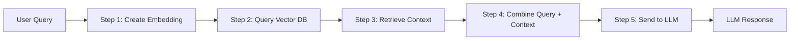

# Lecture 2: LLM Evaluation Frameworks and Observability

## Recap: LLM Evaluation and the LLM as a Judge Approach

When you evaluate an LLM application, you must evaluate **every component** individually, because each component's degradation can cause the end result to be different.

A lot of LLM use cases are **very subjective**. For example, evaluating a chatbot generated response for a customer involves assessing the response quality, how informative it is, and the tone. You cannot create a single standard metric to measure all of these things. The typical solution is to use **a more powerful LLM** as a judge to evaluate the output.

### Three Modes of LLM as a Judge

| Mode | Description |
|------|-------------|
| **Without reference** | The judge LLM evaluates the output based only on the task criteria, with no ground truth answer provided |
| **With reference** | The judge LLM compares the output against a provided reference (ground truth) answer |
| **Comparison** | The judge LLM compares two or more outputs and selects the better one |

This method is not free of issues. To mitigate problems:
- Provide the template with **proper rubrics** and **proper instructions**
- Ask for a score on an **individual scale** (not a holistic one)
- For each value on the scale, **explicitly define the criteria**

### Biases in LLM Evaluation

1. **Self-preference bias**: LLMs tend to prefer text generated by a similar class of LLMs. For example, if you are using GPT as a judge, it may prefer text generated by GPT-4 compared to Gemini, because the language, word choices, and style depend on the training data, hyperparameters, and alignment method used.

2. **Authority bias**: If you include references to well known people (say, a famous scientist) inside your text, the LLM will give it preference, just like humans. It has a bias towards authority.

To address these biases, there are specific criteria and techniques to follow. If you take care of all of that, LLM as a judge is a very good method. Running it **multiple times** and using **different prompts** makes it even more robust. You can also ask the LLM to do **self reflection** to improve the results.

---

## Today's Lecture: Two Aspects of Evaluation

There are two aspects to evaluation of LLM applications:

1. **Collecting data** about what the LLM is doing (observability)
2. **Evaluating** the collected data using frameworks (G-Eval, RAGAS, DeepEval)

When you build an LLM application like a RAG system, you know the input and the final answer, but you need to see **what happened in between**. For example: what was the LLM thinking during self reflection? What contexts were retrieved from the vector database? To evaluate each component, you need to log these intermediate values somewhere. If you want to do an **offline evaluation**, you need a way to capture all of this. This is called **observability**.

Evaluation frameworks like **G-Eval** and **RAGAS** are open source frameworks that come with pre-built metrics (ROUGE, BLEU, METEOR, and many more). You do not have to write your own metric. You just provide the input and output and call the library functions.

---

## Observability

### What Is Observability?

**Observability** means understanding a software system by looking at its **inputs, outputs, and intermediate components** rather than going into the code to examine the logic. It involves collecting logs and metadata to understand the system's behavior without needing to know the implementation details.

Observability is useful to **diagnose and resolve issues**. You need to know the high level architecture, but you do not need to know the details of each component.

You implement observability at **every functional level** inside the application. At each level, you capture input and output. This helps figure out where a problem is, though you may still need further logging to identify the root cause.

### Why Observability Matters Today

Modern software architectures are built as **microservices**. When you send a request to the application, it goes through a path: it calls one service, gets something, calls an API, gets something else, then sends that output to an LLM, and so on. It is a distributed system. Observability traces the **entire route** of the request and collects data (metadata) from each point.

### Telemetry Data

**Telemetry** is the type of data emitted for observability, just like images and text are types of data. Telemetry data extends the concept of logs into four categories:

1. **Traces**: the complete path of a request through the system
2. **Spans**: details of what happened during a single operation within a trace
3. **Metrics**: numerical measurements of system behavior
4. **Logs**: textual records of events

For generative AI applications, the most important type of telemetry is **traces**.

---

## Traces and Spans

### RAG Application Example

**RAG** stands for **Retrieval Augmented Generation**.

Consider a cybersecurity RAG application. The knowledge base contains information from the **MITRE ATT&CK framework**, which is a universal knowledge base about all known attack techniques. The data is already vectorized and stored in a vector database.

A user asks: *"I am a cybersecurity administrator. What does MITRE say about SQL injection?"*

The RAG flow processes this request in the following steps:


*(reconstructed diagram)*

1. The query is converted into an **embedding**
2. The embedding is used to **query the vector database**
3. Relevant **context** is retrieved from the database
4. The original query and the retrieved context are **combined**
5. The combined input is sent to the **LLM**, which generates a response

### What Is a Trace?

A **trace** is created when you send one request. It captures the **entire path** of what happens during the processing of that request. Each trace has a unique **trace ID**.

For example, the query *"What are the best places to visit in Paris?"* generates a trace. That trace ID captures everything that happened, from the embedding step all the way to the LLM response.

### What Are Spans?

**Spans** are the individual operations within a trace. Each span records what happened during one specific step. For a RAG application, spans would include: the embedding conversion, the vector database query, combining context with the query, the LLM call, and so on. A single trace may consist of **six or more spans**.

### Hierarchy: Sessions, Traces, and Spans

```
Session
  |
  |--- Trace 1 (one user request)
  |       |--- Span 1 (embedding operation)
  |       |--- Span 2 (vector DB query)
  |       |--- Span 3 (context retrieval)
  |       |--- Span 4 (combine query + context)
  |       |--- Span 5 (LLM call)
  |       |--- Span 6 (response formatting)
  |
  |--- Trace 2 (another user request)
          |--- Span 1 ...
          |--- Span 2 ...
```
*(reconstructed diagram)*

- A **session** contains multiple traces (e.g., a user asking 10 different questions in one day)
- Each **trace** corresponds to one request and contains multiple spans
- Each **span** corresponds to one operation within a request

---

## OpenTelemetry

**OpenTelemetry** is the most common **open source industry standard** for instrumenting observability. It defines how telemetry data is structured and collected.

### Instrumentation Methods

There are three ways to instrument your application with OpenTelemetry:

| Method | Description | Pros | Cons |
|--------|-------------|------|------|
| **SDK based (manual)** | Manually add tracing code to each function | Maximum control, fine granularity | Very laborious, vendor lock-in (changing to another standard means changing all the code) |
| **Auto-instrumentation** | Uses monkey patching to dynamically wrap functions at execution time | Minimal code changes, just add a decorator at the top of the function | Can create conflicts with other logging libraries |
| **Proxy based** | Route the application through a third party server that extracts telemetry from inputs and outputs | No code modification needed *(added)* | Adds a network hop, depends on third party server *(added)* |

### How Auto-instrumentation Works

Auto-instrumentation uses **monkey patching**. At execution time, it dynamically creates a **wrapper** around the original function. The wrapper calls the original logic **and** emits the trace.

For example, if you are using the OpenAI chat completion API, auto-instrumentation wraps that API call. Inside the wrapper, it still calls the original OpenAI API, plus it emits a trace. All you need is a **single decorator** line at the top of the function.

### Structure of a Trace

Each trace and span contains specific fields:

| Field | Description |
|-------|-------------|
| **Trace ID** | Unique identifier for the entire trace (shared by all spans in the trace) |
| **Span ID** | Unique identifier for this specific span |
| **Parent ID** | The span ID of the parent operation (empty for the first span) |
| **Status** | Whether the operation was successful or failed |
| **Attributes** | Custom key-value pairs you want to log (IP address, port, host, etc.) |
| **Events** | Notable events that occurred during the operation |

Parent IDs are how spans are **linked together** into a tree. The first (root) span has no parent ID. Each subsequent span references the span ID of the operation that **called** it as its parent. This means multiple spans can share the same parent if they are all called from the same function (forming a tree, not a linear chain).

### Agent Tracing Example: Fibonacci

An agent is asked to compute a Fibonacci number. If you instrument the agent, you can see the trace in a **dashboard**. The dashboard shows the trace with different spans. The trace shows the step by step process:

1. The agent understands the query
2. It identifies the tool to call (a Python function)
3. It defines the Fibonacci function
4. It executes the function
5. It returns the result

Each of these steps is a **span** within the trace, with full operation details.

---

## Hands-on: Manual Tracing with OpenTelemetry

### Setup

```python
# Installation (added)
# pip install opentelemetry-api opentelemetry-sdk

from opentelemetry import trace
from opentelemetry.sdk.trace import TracerProvider
from opentelemetry.sdk.trace.export import SimpleSpanProcessor, ConsoleSpanExporter

# Initialize the tracer provider
provider = TracerProvider()
provider.add_span_processor(SimpleSpanProcessor(ConsoleSpanExporter()))
trace.set_tracer_provider(provider)

tracer = trace.get_tracer("my-tracer")
```
*(reconstructed example)*

### Instrumented Functions

Three functions are defined: `say_hello` calls both `format_string` and `print_greeting`.

```python
def format_string(name):
    with tracer.start_as_current_span("format") as span:
        formatted = f"Hello, {name}!"
        span.set_attribute("original_string", name)
        span.set_attribute("formatted_string", formatted)
        span.add_event("format_complete")
        return formatted

def print_greeting(greeting):
    with tracer.start_as_current_span("print") as span:
        print(greeting)
        span.add_event("print_called")

def say_hello(name):
    with tracer.start_as_current_span("say_hello") as span:
        span.set_attribute("name", name)
        formatted = format_string(name)
        print_greeting(formatted)

# Call the function
say_hello("world")
```
*(reconstructed example)*

### Understanding the Trace Output

Running `say_hello("world")` produces **three spans**:

| Span Name | Trace ID | Span ID | Parent ID | Details |
|-----------|----------|---------|-----------|---------|
| `say_hello` | `0x...08` | `995EA` | *(none, root span)* | attribute: `name = "world"` |
| `format` | `0x...08` | `994...` | `995EA` | attributes: original and formatted strings, event: `format_complete` |
| `print` | `0x...08` | *(unique)* | `995EA` | event: `print_called` |

Key observations:
- All three spans share the **same trace ID** because they belong to the same trace
- Each span has a **different span ID**
- Both `format` and `print` have the **same parent ID** (the span ID of `say_hello`), because both are called from `say_hello`, not from each other
- The root span (`say_hello`) has **no parent ID** because it is the starting span

If you want to capture the LLM response, thinking process, parameters, or anything else, all of that can be collected through traces and sent to a **dashboard for visualization**.

---

## Observability Frameworks and Platforms

### Open Source Frameworks

| Framework | Built on OpenTelemetry? | Notes |
|-----------|------------------------|-------|
| **Phoenix** (by Arize) | Yes, fully | No third party converters needed |
| **LangFuse** | Yes | Open source, supports OpenTelemetry standard |
| **LangSmith** | Not natively | Provided by LangChain. Best for LangGraph based agents. Can use third party libraries to convert to OpenTelemetry format |
| **MLflow** | Yes | Provided by Databricks. Easy export if building on Databricks |
| **Weights and Biases** | Yes | Open source platform, no third party converters needed |

The choice depends on what **agent framework** you are building with and what **visualization dashboard** you want to use.

### Why You Need This

1. **Debugging**: Most agents work in simple scenarios but break in real production scenarios. Observability lets you look at traces and find out what is happening.

2. **Security**: None of the agents are secured by default. If you deploy an agent without security, somebody will hack it and your enterprise will suffer damage. Traces help you detect **prompt injection** and **jailbreaking** attempts by examining what happened during the request.

> **Course note**: The lecturer emphasized that understanding observability is critical because all students will be building agents in their projects, and all agents need debugging and security.

### Cloud Platform Support

All major cloud platforms (AWS, GCP, Azure) support the **OpenTelemetry standard**.

#### AWS: CloudWatch vs. CloudTrail

| Service | What It Captures |
|---------|-----------------|
| **CloudTrail** | **User actions** on AWS resources: creating an agent, renaming an agent, setting agent permissions, etc. |
| **CloudWatch** | **What happens inside** an agent: queries, responses, RAG operations, trace IDs, spans |

There is some overlap between the two: some application operations will also get captured in CloudTrail, but the detail of what happened is mainly captured in CloudWatch.

#### Creating Agents on AWS

There are two main approaches:

1. **Using the AWS UI**: Go to the Amazon console and create the agent through the UI. Basic metrics are captured automatically.
2. **Using a framework (LangGraph, CrewAI, etc.)**: Build the agent locally, then deploy on Amazon using **Amazon Agent Core**. In this case, you need to code the instrumentation yourself.

Even without any custom instrumentation:
- **CloudTrail** will capture that you created an agent
- **CloudWatch** will capture some basic information

For example, suppose you want to create a **multi-agent system**. You still want minimum visibility. CloudTrail will capture that you created the agents, but it will not capture what happened during the agent execution. There are certain metrics Amazon automatically captures by default, but for **detailed traces with all spans**, you need to add instrumentation (auto-instrumentation or manual).

---

## Evaluation Frameworks

Everything covered so far has been about **how to capture the logs** so that you can do evaluation. The following frameworks are what actually **perform the evaluation**.

### G-Eval

**G-Eval** is a framework from **Microsoft Research** that extends and standardizes the LLM as a judge method.

#### The Problem G-Eval Solves

With a basic LLM as a judge approach, you define a rubric (e.g., 1 = coherent but not complete, 2 = coherent and complete) and get an integer score. But:
- You want a **continuous numerical score**, not just an integer
- You want **well-defined evaluation steps** every time

#### How G-Eval Works

G-Eval adds two things on top of basic LLM as a judge:

##### 1. Automatic Chain of Thought Steps

Given a task and evaluation criteria, G-Eval automatically generates step by step evaluation instructions for the LLM judge.

**Example**: Rating a summary of a news article:

1. Read the news article and identify the main topic and three key points
2. Read the summary and compare it to the news article. Check whether the summary covers the main topic and three key points, and if it presents them in a clear order
3. Based on this, assign a score on a scale of 1 to 10, where 1 is the lowest and 10 is the highest

These chain of thought steps are **generated by the framework**, not written manually.

##### 2. Token Probability Weighted Scoring

When the LLM outputs a score (say "1"), it does not just produce "1". If the temperature is not zero, the model produces **all tokens with certain probabilities**. This is how generative models work for next token prediction. "1" might be the maximum probability token, but "2", "3", "4", "5" all have some probability too.

G-Eval retrieves **all token probabilities** from the API response, then computes a **weighted average**:

$$\text{G-Eval Score} = \sum_{s=1}^{S} s \cdot P(s)$$

Where $s$ is the score value and $P(s)$ is the token probability of that score. *(added)*

**Why this matters**: If you run the same evaluation 10 times with temperature 0.2, maybe 8 times it gives 1, once it gives 2, once it gives 3. You do not know the confidence. The weighted average gives a **more robust continuous score** that reflects the LLM's actual confidence in each score value.

---

### RAGAS

**RAGAS** (Retrieval Augmented Generation Assessment) is an evaluation framework from a UK university, designed specifically for evaluating RAG applications. It defines three metrics.

#### Position Bias in LLMs

Before diving into the metrics, an important note: the **order of the context matters**. LLMs give more importance to the beginning of the context. If the context is very long, relevant information might get **lost in the middle**. To mitigate this, you can change the order of the context or make the context smaller.

#### Metric 1: Faithfulness

**Faithfulness** measures whether the information in the generated answer can be **supported by the retrieved context**. It is essentially a **hallucination check**.

**How it works**:
1. Extract individual **statements** from the generated answer
2. For each statement, verify whether it is **supported by the context**
3. Calculate the fraction of supported statements

$$\text{Faithfulness} = \frac{\text{Number of statements supported by context}}{\text{Total number of statements in the answer}}$$

**Example**: If the answer has 5 sentences and 4 of them can be verified against the context, then:

$$\text{Faithfulness} = \frac{4}{5} = 0.8$$

#### Metric 2: Answer Relevance

**Answer Relevance** measures whether the generated response **directly addresses the question**. This is not about hallucination, but about whether the answer is relevant to what was asked.

**How it works** (an inverse process):
1. Take the final answer and **generate possible questions** that could have produced this answer
2. Calculate the **similarity** between each generated question and the **original question**
3. The average similarity is the answer relevance score

$$\text{Answer Relevance} = \frac{1}{N} \sum_{i=1}^{N} \text{sim}(q_i, q_{\text{original}})$$

Where $q_i$ are the generated questions and $q_{\text{original}}$ is the original user question. *(added)*

**Intuition**: If the answer is truly relevant, then most questions generated from it should be very similar to the original question.

#### Metric 3: Context Precision

**Context Precision** measures how relevant the **retrieved context** is for answering the question. This is about **retrieval quality**.

**How it works**:
1. Break the context into individual **sentences**
2. For each sentence, check if it is **relevant for answering the question**
3. Calculate the fraction of relevant sentences

$$\text{Context Precision} = \frac{\text{Number of context sentences relevant to the question}}{\text{Total number of context sentences}}$$

**Example**: If the context has 10 sentences and only 1 is relevant for answering the question, then:

$$\text{Context Precision} = \frac{1}{10} = 0.1$$

This means the retrieval is generating a lot of **noise**. To fix this, you can either **return fewer results** or **re-vectorize** to get better context.

#### What If the LLM Generates a Correct Answer Without Using the Context?

These RAGAS metrics are designed for situations where the LLM **does not already know the information** in the context. For example, company internal documents.

- If the LLM generates a correct answer from its own knowledge (not from the context), the **faithfulness** metric will be low because the answer statements will not be verifiable against the retrieved context. The answer may be correct, but faithfulness specifically measures whether it is grounded in the provided context.
- Separately, if most of the retrieved context sentences are not relevant to the question, the **context precision** metric will be low, indicating that the retrieval is generating noise. To fix this, you either return fewer results or re-vectorize to get better context.

#### Summary of RAGAS Metrics

| Metric | Compares | Purpose |
|--------|----------|---------|
| **Faithfulness** | Answer vs. Context | Detects hallucination (is the answer supported by the context?) |
| **Answer Relevance** | Answer vs. Question | Checks relevance (does the answer address what was asked?) |
| **Context Precision** | Context vs. Question | Evaluates retrieval quality (is the retrieved context useful?) |

---

### DeepEval: A Practical Evaluation Library

**DeepEval** is a Python open source library that combines the G-Eval and RAGAS metrics (plus **30+ additional LLM evaluation metrics**) into a single plug and play framework.

#### Features

- **G-Eval metrics** and **RAGAS metrics** built in
- **Synthetic data generation** for testing
- **Red teaming** capabilities
- **Jailbreak detection**
- **Safety and toxicity** evaluation
- **Multi-hop context** metrics for complex RAG pipelines
- Additional metrics like MAES

> **Course note**: The lecturer expects all students to do some level of evaluation in their LLM application projects using DeepEval or a similar framework. Evaluation quality will be assessed during the final prototype presentations. Not properly doing evaluation will result in reduced credit.

#### Example: Rubric-based Evaluation

DeepEval supports defining structured rubrics for evaluation. For example, evaluating a chat session summary:

| Score | Criteria |
|-------|----------|
| 0 | The summary does not cover any of the key points |
| 1 | The summary covers some key points |
| 2 | The summary has all the key points but in the wrong order |
| 3 | The summary has all key points in the correct order |

```python
# Example DeepEval usage (reconstructed example)
from deepeval.metrics import GEval
from deepeval.test_case import LLMTestCase

test_case = LLMTestCase(
    input="Summarize the customer support chat session",
    actual_output="The customer asked about return policy...",
)

metric = GEval(
    name="Summary Quality",
    criteria="Evaluate if the summary covers all key findings in order",
    evaluation_steps=[
        "Check if all key points from the session are present",
        "Verify the points are in chronological order",
        "Assign a score from 0-3 based on the rubric"
    ],
    evaluation_params=[
        "input",
        "actual_output"
    ]
)

metric.measure(test_case)
print(metric.score)
```

#### Structured Evaluation

Beyond plain text rubrics, DeepEval allows you to define more **structured evaluation criteria** with logical flow, conditions, and intermediate scores. For example, you can define: first check if all three required sections are present, then check if the conclusions follow logically, then assign scores based on combinations of these conditions. *(additional example)*

> **Course note**: The lecturer strongly encourages going through the provided notebooks and running them. If you do not have any AI API keys, you can use **Ollama** with a **Gemma** model locally as a free alternative. Number one, evaluation must be implemented in the project. Number two, understanding evaluation is critical because all students will be working on generative AI applications in the future, and evaluation will be very important.
