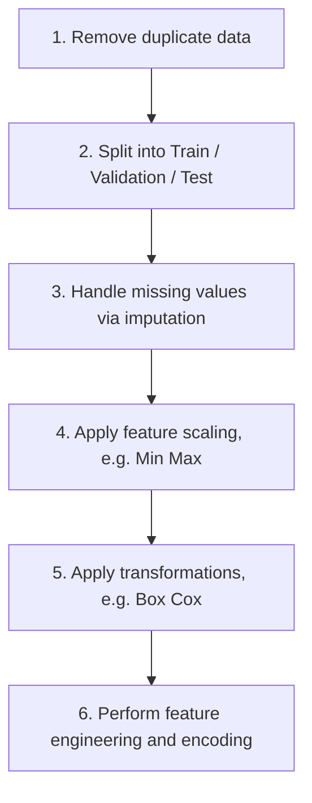

# Lecture 3: Feature Engineering, Missing Values, Data Leakage, and Feature Selection

> **Course context**: This lecture builds on MLOps topics covered in Term 1 (Course 1), which included **Data Engineering** (data sources, data formats, data models, modes of dataflow) and **Training Data Generation** (data labelling, sampling techniques) *(from slides)*.

## Deep Learning and Automatic Feature Extraction

> **Key analogy from slides**: Features are like **signals**. Feature engineering is like **separating signals from noise**. Deep learning algorithms are capable of learning features themselves, but classical ML algorithms require manual creation of useful features.

Deep learning models automatically create internal feature representations during training. In a deep convolutional neural network, for example:

1. The early layers learn low level features such as edges and corners
2. Deeper layers combine these into higher order, more abstract representations
3. The model itself learns these generalizations as part of training, without manual feature engineering

This automatic feature extraction is one of the biggest advantages of deep learning. It applies to:

- **Image data**: convolutional layers learn visual features automatically
- **Audio data**: similar layered feature extraction
- **Text data**: transformer models and embeddings learn contextual representations

### Traditional Text Feature Engineering

Before modern deep learning, people manually engineered text features:

- Created **bigrams** and **trigrams** (sequences of 2 or 3 words)
- Used **synonym replacement** to normalize vocabulary
- Applied stop word removal, stemming, and lemmatization

Today, with transformer models and embeddings, you simply tokenize the text and use an embedding representation. For example, for sentiment analysis, you can use a pretrained model with embeddings and it will do the job without manual feature creation.

---

## Why Feature Engineering Still Matters

Despite the power of embeddings and deep learning, manual feature engineering is still essential in many real world scenarios.

### Explainability Requirements

Many industries are legally required to explain model decisions:

- **Insurance and financial institutions**: when a mortgage loan or credit application is rejected, you must explain why. A deep learning model may not provide sufficient explainability.
- **Cybersecurity**: analysts need to explain to stakeholders why a particular user or transaction was flagged as suspicious. You need interpretable features, not a black box.

> **Key idea**: A lot of industries, including research, avoid deep learning models in various domains because of the explainability requirement.

### Structured and Log Data

Deep learning's automatic feature creation does not work well with structured data like:

- **Log data** from software, IoT devices, and endpoint agents: these contain many fields, nested fields, and require understanding the schema, making transformations, and doing aggregations
- **Finance and healthcare data**: these domains require careful feature engineering because of regulatory, structural, and domain specific reasons

> **Key idea**: Just because embedding models exist does not mean they are used everywhere. Feature engineering remains critical in many domains.

---

## Traditional Text Preprocessing Pipeline

This section describes the traditional approach to text feature engineering, which is still useful to understand even though modern methods have largely replaced it.

### Step by Step Process

Given an original sentence like `"I have a dog. He's sleeping."`, the full pipeline from the slides is:

| Step | Description | Example Result |
|------|-------------|----------------|
| 1. Stop word removal | Remove common words that carry no information (e.g., "a") | `"I have dog. He's sleeping."` |
| 2. Lemmatization | Reduce words to their root/base form | `"I have dog. He's sleep."` |
| 3. Contraction expansion | Expand contractions to full forms | `"I have dog. He is sleep."` |
| 4. Punctuation removal | Remove punctuation marks | `"I have dog He is sleep"` |
| 5. Lowercasing | Convert all text to lowercase | `"i have dog he is sleep"` |
| 6. Tokenization | Split text into individual tokens | `["i", "have", "dog", "he", "is", "sleep"]` |
| 7. N-gram generation | Create bigrams, trigrams, etc. | `["i have", "have dog", "dog he", "he is", "is sleep", ...]` |

**Stop words** are words like "a", "the", "is" that appear in almost every text. They are not informative and do not carry discriminative information, so removing them reduces noise.

**Lemmatization** reduces different forms of the same word to a common root. For example, "sleeping", "slept", and "sleep" all map to "sleep". This is important because without it, the model would treat each form as a completely different word.

### Limitation: Loss of Context

A student raised an important point: after preprocessing, the pronoun "he" in "I have a dog, he is sweet" becomes ambiguous. You cannot tell if "he" refers to the dog or someone else. This is a fundamental limitation of bag of words style processing, which does not capture contextual relationships.

### The Modern Approach

Today, the standard approach is:

1. **Tokenization** remains the standard first step
2. Instead of stop word removal and lemmatization, convert tokens directly to **embeddings** (numerical vector representations)

Embeddings are superior because they capture contextual and semantic understanding that traditional bag of words approaches cannot.

> **Note**: The library **FastText** from Meta still uses the traditional text classification approach and is useful when you need very fast text classification.

```python
# Traditional text preprocessing with NLTK (reconstructed example)
import nltk
from nltk.corpus import stopwords
from nltk.stem import WordNetLemmatizer

nltk.download('stopwords')
nltk.download('wordnet')

text = "I have a dog he is sleeping"
tokens = text.lower().split()

stop_words = set(stopwords.words('english'))
filtered = [w for w in tokens if w not in stop_words]

lemmatizer = WordNetLemmatizer()
lemmatized = [lemmatizer.lemmatize(w, pos='v') for w in filtered]
print(lemmatized)  # ['dog', 'sleep']
```
*(reconstructed example)*

---

## Missing Values

Before building a model, you often need to handle missing values. This is a very important preprocessing step.

### Sources of Missing Data

Missing values arise in many scenarios:

- **Surveys**: people may not fill in all fields because they do not want to share certain information
- **IoT device logs and endpoint agent logs**: these are collected locally and pushed to the cloud when the buffer is full. Sometimes logs are sampled (not all sent), or data does not transfer fully over the network
- **Customer data**: various fields may be incomplete for many reasons

### Sample Dataset with Missing Values

The slides show a dataset illustrating various types of missingness *(from slides)*:

| ID | Age | Gender | Annual Income | Marital Status | Num. Children | Job |
|----|-----|--------|---------------|----------------|---------------|-----|
| 1 | | A | 150,000 | | 1 | Engineer |
| 2 | 27 | B | 50,000 | | | Teacher |
| 3 | | A | 100,000 | Married | 2 | |
| 4 | 40 | B | | | 2 | Engineer |
| 5 | 35 | B | | Single | 0 | Doctor |
| 6 | | A | 50,000 | | 0 | Teacher |
| 7 | 33 | B | 60,000 | Single | | Teacher |
| 8 | 20 | B | 10,000 | | | Student |

### Three Types of Missing Values

| Type | Abbreviation | Definition | Depends On | Difficulty |
|------|-------------|------------|------------|------------|
| Missing Completely at Random | MCAR | The probability of a value being missing is **unrelated** to both **observed** and **unobserved** data | Nothing | Least problematic |
| Missing at Random | MAR | The probability of a value being missing is **related to other observed variables** in the dataset, but **not** to the value of the missing data itself | Other observed variables | Moderate |
| Missing Not at Random | MNAR | The probability of a value being missing is **related to the unobserved (missing) data itself** | The missing value itself | Most challenging |

### Examples

**MCAR**: In a survey, respondents accidentally skip a question about their favourite colour due to a printing error on some forms. The printing error has nothing to do with the person's age, gender, or any other variable. It is completely random.

**MAR**: In a medical study, younger participants are more likely to not report their income. The missingness of income is related to another observed variable (age), not to the income value itself. Younger people do not report their income regardless of whether it is low or high.

**MNAR**: In a survey, people with severe depression are less likely to answer questions about their mental status. The probability of the value being missing depends on the value of that field itself.

> **Quick memory rule**:
> - Missing value depends on **nothing** = MCAR
> - Missing value depends on **another variable** = MAR
> - Missing value depends on **its own value** = MNAR

### Handling Each Type

| Type | Effect on Analysis | Recommended Methods |
|------|-------------------|-------------------|
| MCAR | No bias is introduced. The missingness is pure randomness. Can be safely ignored under many standard analyses, though it reduces statistical power. | Simple deletion or basic imputation (mean, median) |
| MAR | Bias can be corrected using statistical methods that incorporate the observed variable causing the missingness. | **Multiple imputation** or **maximum likelihood** methods, which model the observed relationships |
| MNAR | Introduces **systematic bias** that **cannot be corrected** using just the available data. Most challenging type. | **Bayesian models**, **pattern-mixture models**, or **sensitivity analyses**. Advanced modeling or strong assumptions are needed. |

### Additional Examples of MAR

The relationship between missingness and observed variables does not need to be perfect. It can be partial. For example, one gender may be less likely to disclose their age. The correlation between gender and missing age values does not need to be a perfect relationship. As long as there is some correlation between a missing data point and an observed variable, you classify it as MAR.

Similarly, someone with a certain illness may choose not to disclose their medical status in a healthcare survey, such as their blood pressure. The missingness of medical status is related to the observed variable (having a disease), making it MAR.

### Handling Missing Values

#### 1. Deletion

- **Column deletion**: remove the entire column (feature) that has missing values
- **Row deletion**: remove specific rows with missing values (e.g., row 1, row 3, row 6)

Deletion is easy to implement but **can lead to accuracy loss** *(from slides)*.

**When to use**: Row deletion is acceptable only if you have very few missing rows. In any good dataset, there are usually far more rows than columns. Deleting rows should almost never be done because it reduces your sample size. Deleting columns is also risky because you lose an entire feature.

#### 2. Imputation

Replace missing values with estimated values:

- **Mean or median** for numerical data
- **Mode** for categorical data
- **Interpolation** (e.g., **KNN imputation**) for ordered/time series data or multivariate imputation

**Problem 1: Bias**. Imputation can introduce bias. For example, if most recorded incomes are around $50,000 and only one is $10,000, replacing missing income values with the mean will bias them toward $50,000. The actual missing values might have been $5,000.

**Problem 2: Data leakage**. When you impute using statistics (like the mean) computed from the entire dataset and then split into train/test, information from training data leaks into the test data. The test data should be completely independent of the training data, but imputation before splitting creates a dependency between them. This can cause the model to overfit.

> **Critical rule**: Always split your data into train, validation, and test **first**, then perform imputation **separately within each split**. Never impute before splitting.

```python
# Correct order: split first, then impute (reconstructed example)
from sklearn.model_selection import train_test_split
from sklearn.impute import SimpleImputer
import numpy as np

X_train, X_test, y_train, y_test = train_test_split(X, y, test_size=0.2)

# Fit imputer on training data ONLY
imputer = SimpleImputer(strategy='mean')
X_train = imputer.fit_transform(X_train)

# Transform test data using training statistics
X_test = imputer.transform(X_test)
```
*(reconstructed example)*

---

## Feature Scaling

Feature scaling is important because different features can have vastly different ranges, and models treat all numbers equally without understanding that ranges differ.

### Why Scaling Matters

Consider three features:

| Feature | Typical Range |
|---------|---------------|
| Age | 0 to ~100 |
| Income | A few thousand to hundreds of thousands |
| Number of children | 0 to ~9 (single digits) |

When you pass these to a regression or classification model, the model does not understand that age naturally falls between 0 and 100 while income goes up to hundreds of thousands. It treats everything as a number. This mismatch in ranges causes larger errors in the estimation of model parameters.

> **Key idea**: It is ideal to make all numerical features fall in the same range.

### Min Max Scaling

Converts features to the [0, 1] range:

$$X_{scaled} = \frac{X - X_{min}}{X_{max} - X_{min}}$$

This transformation ensures that every feature's values fall between 0 and 1.

### Categorical Feature Encoding

For categorical features, use **one hot encoding** or other encoding methods to convert categories into numerical representations.

```python
# Min-max scaling and one-hot encoding (reconstructed example)
from sklearn.preprocessing import MinMaxScaler, OneHotEncoder

scaler = MinMaxScaler()
X_train_scaled = scaler.fit_transform(X_train_numerical)
X_test_scaled = scaler.transform(X_test_numerical)

encoder = OneHotEncoder(sparse_output=False)
X_train_cat = encoder.fit_transform(X_train_categorical)
X_test_cat = encoder.transform(X_test_categorical)
```
*(reconstructed example)*

### Box Cox Transformation

Many models assume that variables (or at least the noise) follow a normal distribution, particularly in regression problems. If you see a skewed distribution, you can apply a **Box Cox transformation** to bring it closer to a Gaussian (normal) distribution.

$$X_{transformed} = \begin{cases} \frac{X^\lambda - 1}{\lambda} & \text{if } \lambda \neq 0 \\ \ln(X) & \text{if } \lambda = 0 \end{cases}$$

*(added)*

> **Important**: Like imputation, Box Cox transformations should be done **after** splitting. You should not do the Box Cox transformation on the full dataset and then split into train and test, because the transformation creates a dependency between the values.

### Bucketing (Discretization)

**Discretization** (also called **quantization** or **binning**) is the process of converting continuous features to discrete features by creating buckets (ranges).

For example, instead of using raw age values, create age buckets *(from slides)*:

| Bucket | Range |
|--------|-------|
| 0 to 10 | Children |
| 10 to 18 | Teenagers |
| 18 to 30 | Young Adults |
| 30 to 50 | Adults |
| 50 to 65 | Older Adults |
| 65 to 80 | Seniors |
| 80+ | Elderly |

You need to be careful when choosing the value of the boundaries. **Use histogram plots** to visualize the distribution and determine appropriate bucket boundaries *(from slides)*.

**Why bucketing helps**: Age is technically an integer, and in a population, you do not see a smooth distribution. You might see only one or two cases for children aged 1, 2, or 3, a lot of cases around ages 30 to 50, and fewer cases above 60 or 70. By converting into buckets, you reduce the noise and make the distribution smoother. This is better for modeling than using raw continuous values.

### High Cardinality Features

Some categorical features can have a very large number of unique values. Additionally, **new values can appear in the production scenario that were unseen during training** *(from slides)*. Examples:

- **IP addresses**: practically infinite
- **Zip codes**: thousands of possible values
- **Brand names**: many possible values, with new brands appearing over time

If you keep these as raw categorical features, they are not useful for modeling. The solution is to convert them into **embeddings**, which reduce the cardinality while preserving semantic information.

---

## Word Embeddings

### What Is an Embedding?

An **embedding** is a learned numerical vector of a fixed size that represents a word (or any discrete item). Embeddings preserve semantic relationships: words with similar meanings have vectors that are close together in the embedding space.

### Semantic Properties

For example, each word gets a 7 dimensional vector where each dimension captures a semantic feature *(from slides)*:

| Word | living being | feline | human | gender | royalty | verb | plural |
|------|-------------|--------|-------|--------|---------|------|--------|
| cat | 0.6 | 0.9 | 0.1 | 0.4 | -0.7 | -0.3 | -0.2 |
| kitten | 0.5 | 0.8 | -0.1 | 0.2 | -0.6 | -0.5 | -0.1 |
| dog | 0.7 | -0.1 | 0.4 | 0.3 | -0.4 | -0.1 | -0.3 |
| houses | -0.8 | -0.4 | -0.5 | 0.1 | -0.9 | 0.3 | 0.8 |

The key property is:

- "cat" and "kitten" will have very similar vectors (close together)
- "cat" and "houses" will have very different vectors (far apart)

When these high dimensional vectors are reduced to 2D for visualization, you can see that "cat", "kitten", and "dog" cluster together while "houses" is far away *(from slides)*.

The algorithm that creates embeddings is constructed so that words similar in meaning will have mathematically similar vectors.

### The Classic Analogy: Arithmetic with Embeddings

One of the most famous properties of embeddings is that they capture relational analogies through vector arithmetic:

$$\vec{king} - \vec{man} + \vec{woman} \approx \vec{queen}$$

The difference between "man" and "king" is approximately the same as the difference between "woman" and "queen". This shows that embeddings capture structured semantic relationships.

### From Word Embeddings to Sentence Embeddings

A word embedding converts a single word into a fixed size vector. To represent an entire sentence:

1. Compute the embedding for each word in the sentence
2. Combine them using **pooling**:
   - **Average pooling**: take the mean of all word vectors
   - **Max pooling**: take the element wise maximum across all word vectors
3. The result is a single vector representing the entire sentence

You could also concatenate all word vectors, but this produces a very large vector that varies in length with sentence length, so pooling is preferred.

> **Key idea**: Embeddings are today the most used representation of words as features. The reason is they preserve semantic relationships. If your model was trained with "dog" in the vocabulary, at inference time when it encounters "kitten," it understands they are semantically related. But "house" would be very different. The lecturer noted there is a good article on Medium for learning more about word embeddings.

### Embedding Models: Evolution

#### Word2Vec (Google, ~2013)

The first major embedding model. It uses a small neural network trained on one of two tasks:

| Variant | Task | Description |
|---------|------|-------------|
| **CBOW** (Continuous Bag of Words) | Predict center word from surrounding words | Given the words around a target word, predict the target |
| **Skip gram** | Predict surrounding words from center word | Given a word, predict the words around it |

The embedding comes from the **hidden layer** of this neural network. The architecture is: input layer, hidden layer, output layer. The hidden layer's weights become the word embeddings.

```
Input Layer  -->  Hidden Layer (= embedding)  -->  Output Layer
(context words)    (numerical vector)           (predicted word)
```
*(reconstructed diagram)*

#### GloVe (Stanford)

**GloVe** (Global Vectors for Word Representation) is an improvement over Word2Vec, developed at Stanford. It uses global word co occurrence statistics from a corpus to learn embeddings.

#### Sentence Transformers

**Sentence Transformers** produce embeddings for entire sentences rather than individual words. They are designed to capture the meaning of complete sentences in a single vector, making them ideal for tasks like semantic search and sentence similarity *(from slides)*.

#### BERT (Google)

**BERT** (Bidirectional Encoder Representations from Transformers) is a transformer based model that can also be used for creating embeddings:

1. Train BERT on your data (or use a pretrained version)
2. Do **not** take the final layer (which is typically a logistic/softmax layer that converts to class probabilities)
3. Take the **second to last layer**, which is a numerical representation layer. This gives you the embedding.

> **Why not the last layer?** The last layer of BERT converts internal representations into probabilities for various classes. It is a classification layer. The layer just before it contains the rich numerical representation that serves as the embedding.

### Modern Embedding Models on Hugging Face

Today, you can download open source embedding models from **Hugging Face**, just like you download LLM models (Llama, etc.):

- There is a dedicated tab for embedding models on Hugging Face
- There is a **leaderboard** for comparing embedding models
- Popular models include **Snowflake** and **Qwen** from Alibaba
- The **MTEB** (Massive Text Embedding Benchmark) ranks embedding models

### Choosing Embedding Dimensions

Embedding models come in various sizes:

| Dimension Range | Guidance |
|----------------|----------|
| < 1,000 | Good for most tasks, lighter computational cost |
| ~4,096 | Very large, used for complex tasks but expensive |

> **Key idea**: If you use higher dimensional embeddings when your problem does not require it, your computational cost and memory requirements increase unnecessarily. Choose the smallest dimension that works for your task.

---

## Data Leakage

**Data leakage** is defined as training an ML model using information not expected to be available during prediction *(from slides)*. This is one of the most important pitfalls in machine learning.

### Why It Matters

When you train a model, you must split data into training, validation, and test sets. The validation and test data must not contain any information that is part of the training set. If they do, your model will appear to perform very well during development but will fail in production.

> **From the lecturer's experience**: "It's happened to me many times that we did this, but at the end of the day, you see the model is doing very good, you don't expect it to do that well, and when you test it in production, the performance is going down. That is partly because there is data leakage."

### Causes of Data Leakage

#### 1. Feature Leakage

Caused by a feature which is a **duplicate or proxy of the target variable** *(from slides)*. This happens when one feature is an aggregate or derivative of another feature used as a target or closely related to the target.

**Example**: You have a model that predicts yearly salary. You also have monthly salary as a feature. Since yearly salary is an aggregation of monthly salary, using monthly salary as an input variable leaks information about the target.

#### 2. Sample Leakage

**Duplicate samples between train and test datasets** *(from slides)*. If the dataset contains duplicate records and you split randomly, one copy may end up in training and the other in the test set. The model has effectively "seen" the test data during training.

#### 3. Non i.i.d. Data (Temporal Leakage)

Caused by **splitting a time series dataset randomly** *(from slides)*. Time series data violates the **i.i.d. assumption** (identically and independently distributed). There is always a dependency between observations across time.

**Correct approach for time series**:

```
|------- Training -------|----- Validation -----|------ Test ------|
      Past data             Middle window           Future data
```
*(reconstructed diagram)*

Never do random splitting with time series data. Always split based on time:
1. Use data up to time $t_1$ for training
2. Use data from $t_1$ to $t_2$ for validation
3. Use data from $t_2$ onward for testing

If you split time series data randomly, the samples are not independent, and you create data leakage.

#### 4. Imputation Before Splitting

As discussed earlier, imputing missing values before splitting creates dependencies between training and test data.

#### 5. Group Leakage

Occurs when related data points (belonging to the same group or entity) end up in both training and test sets. For example, multiple records from the same patient appearing in both splits *(from slides)*.

### Detecting Data Leakage

1. **Unusually high correlation**: Measure the correlation between each feature and the target. If some features are suspiciously highly correlated, investigate whether there is leakage.

2. **Autocorrelation** (for temporal data): Compute the correlation between $X(t)$ and $X(t + \tau)$ for various lag values $\tau$. If you see high autocorrelation, identify the time scale within which the correlation exists.

$$\rho(\tau) = \text{Corr}(X_t, X_{t+\tau})$$

*(added)*

---

## Correct Preprocessing Order

The order of operations matters. Do things in this sequence:


*(reconstructed diagram)*

> **Common causes of data leakage** *(from slides)*:
> - Filling in missing data before splitting
> - Not removing duplicates before splitting
> - Scaling before splitting
> - Splitting time-correlated data randomly instead of by time
> - Group leakage

> **Critical rules**:
> 1. Remove duplicates **before** splitting
> 2. Split **before** imputing
> 3. Split **before** scaling or transforming (Box Cox, standard scaling, normalization)
> 4. Fit scalers/transformers on training data only, then apply to validation/test

---

## Feature Selection

### Why Not Keep All Features?

Even though more features mean more signals, too many features cause problems:

1. **Overfitting**: From linear algebra, when the number of features (columns) exceeds the number of observations (rows), you cannot get a good solution. More features than data leads to overfitting.
2. **Data leakage**: More features increase the chances of data leakage *(from slides)*.
3. **Memory**: Features must be stored in memory. Too many features require more computational resources.
4. **Latency**: At inference time, the model must fetch and compute with all features. More features increase latency.
5. **Data requirements**: More features require more training data to learn meaningful patterns.

> **Key idea**: You want to keep an optimal number of features for your model. Select the best features, do not keep all of them.

### Two Criteria for Keeping a Feature

1. **Importance**: Does the feature improve model performance (accuracy, F1, etc.) during development? Build the model with and without the feature. If the difference is substantial, keep it.
2. **Generalizability**: Does the feature help the model generalize to unseen data? A feature might help during training/validation but hurt on unseen test data. You need features that also help the model perform well in production, where data distributions may be different.

### Methods of Feature Selection

#### Forward and Backward Selection

**Forward selection** (start small, add features):

1. Start with 1 feature, train a model
2. From the remaining features, add each one individually and evaluate
3. Keep the one that improves performance the most (now you have 2 features)
4. Repeat with the remaining features
5. Stop when adding more features no longer improves performance

**Backward selection** (start full, remove features):

1. Start with all features
2. Remove each feature one at a time and evaluate
3. Remove the feature whose absence hurts performance the least
4. Repeat until you reach the desired number of features

#### Feature Interactions

When considering feature interactions (combinations of two or more features), the number of possible combinations is combinatorially explosive ($N!$ for $N$ features). In practice:

- **Domain knowledge** is crucial for knowing which interactions to try
- Previous testing and models in production can inform which variables matter
- **First order interactions** (pairs) are generally less important than individual features
- **Third order and higher interactions** are even less important
- Interactions beyond second order rarely contribute meaningfully

#### Entropy Based Method

Compute the entropy difference between including and excluding each feature in the model. Rank features by their entropy contribution and select the top ones.

#### Shapley Values (SHAP)

The most commonly used method for feature importance. **Shapley values** are a concept borrowed from **cooperative game theory (1950s)**, invented by **Lloyd Shapley**. In ML, the implementation is known as **SHAP (SHapley Additive exPlanations)** *(from slides)*.

**Core idea**: Think of each prediction as a cooperative game where all features work together (as "players") to produce the prediction. Shapley values are used for **fairly attributing a player's contribution to the end result of a game** *(from slides)*. They are computed by **perturbing values of input features and measuring how it changes the model prediction**. The Shapley value of a given feature is the **average marginal contribution** to the overall model score *(from slides)*.

The Shapley value for feature $i$ is:

$$\phi_i = \sum_{S \subseteq N \setminus \{i\}} \frac{|S|!(|N|-|S|-1)!}{|N|!} \left[ f(S \cup \{i\}) - f(S) \right]$$

where $N$ is the set of all features, $S$ is a subset not containing feature $i$, and $f(S)$ is the model's prediction using only features in $S$.

*(added)*

### Two Levels of Shapley Value Analysis

| Level | Purpose | When Used |
|-------|---------|-----------|
| **Global** (model level) | Identify which features are most important for the overall model | During model development, for feature selection |
| **Local** (prediction level) | Identify which features contributed most to a specific prediction | In production, for explaining individual decisions |

**Example: Credit Scoring Model**

At the **global level**: After building a credit scoring model, compute Shapley values for all features. The SHAP summary plot shows:

- Each feature's importance (high or low)
- Whether each feature contributes toward the positive or negative class
- Features are sorted by overall importance

You can set a **cutoff**: keep features above the cutoff, drop features below it.

At the **local level**: When scoring a specific customer for a loan application, look at the Shapley values for that particular prediction. For example:
- Feature A has a SHAP value of 4.98 (strongly pushes toward rejection)
- Feature B has a SHAP value of -2.0 (pushes toward approval, but weaker)
- These values tell you **what caused the loan rejection** for that specific customer

### Interpreting SHAP Summary Plots

The slides show two types of SHAP plots side by side *(from slides)*:

**Global Feature Importance Plot** (SHAP summary plot):

- Each row is a feature (e.g., LSTAT, RM, DIS, AGE, CRIM, NOX, PTRATIO, TAX, B)
- Color indicates feature value (low vs. high)
- Position on the x axis indicates the SHAP value (negative = supports negative class, positive = supports positive class)
- Features are sorted by overall importance from top to bottom

**Single Prediction Waterfall Plot**:

- Shows how each feature contributed to one specific prediction
- Example from the slides: for a prediction of $f(x) = 24.019$ with a base value of $E[f(X)] = 22.533$:
  - LSTAT = 4.98 contributed +5.79 (largest positive push)
  - RM = 6.575 contributed -2.17 (pushed prediction down)
  - NOX = 0.538 contributed -0.73
  - Other features contributed smaller amounts

### Credit Scoring Example (from the Notebook)

For a credit scoring dataset, the Shapley values revealed that the **most important feature** was the difference between the first payment date and the first due date. This is the gap between when you are supposed to pay your credit card bill and when you actually paid it.

Other important features included:
- GPS latitude/longitude
- State
- Account creation date
- Due day of the week
- Age

> **Practical takeaway from the lecturer**: "That tells you that you should pay your credit card bills on time."

> **Course note**: The lecturer recommended accessing a provided notebook ("Google Colab Notebook: Credit Risk Score Prediction"), making a personal copy, and running it as an exercise to better understand Shapley values.

---

## Feature Generalization

An ML model should make accurate predictions on **unseen data**. Measuring the generalization capability of features is more difficult than measuring importance *(from slides)*.

Two factors to consider for feature generalization:

1. **Feature coverage**: Does the feature have enough representation across different scenarios in the training data? Features with poor coverage may not generalize well.
2. **Distribution of feature values**: Is the distribution of feature values in training data representative of what the model will see in production? If the distributions differ significantly, the feature may not generalize.

---

## PCA vs. Feature Selection

A student asked whether **PCA** (Principal Component Analysis) can be used for feature selection. The answer:

- PCA is a type of **dimensionality reduction**, not exactly the same as feature selection
- PCA assumes **linear relationships** between features. If your data has nonlinear dependencies, PCA will not capture them well
- PCA components are **not easily interpretable** (they are linear combinations of original features, not the features themselves)
- You can use PCA first for dimensionality reduction, then apply feature selection on top of the PCA components. But they are separate approaches.

---

## Best Practices Summary

1. **Split data by time** into train/valid/test splits instead of doing it randomly *(from slides)*.
2. **Oversample after splitting**. If you need to oversample, do it after the train/test split.
3. **Scale and normalize after splitting** to avoid data leakage *(from slides)*.
4. **Use statistics from the train split only**, instead of the entire data, to scale your features and handle missing values *(from slides)*.
5. **Transform after splitting**. Box Cox and other transformations should be applied within each split separately.
6. **Understand your data**. Know how your data is generated, collected, and processed. **Involve domain experts if possible** *(from slides)*.
7. **Keep data lineage**. Track your data versions. Data versioning is as important as model versioning, because you may need to trace back why a model failed based on the transformations applied to its training data.
8. **Understand feature importance** to your model *(from slides)*.
9. **Use features that generalize well** *(from slides)*.
10. **Remove unused features**. If features are no longer useful in your model, remove them. Keeping unused features risks them going out of distribution.
