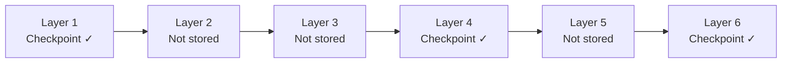
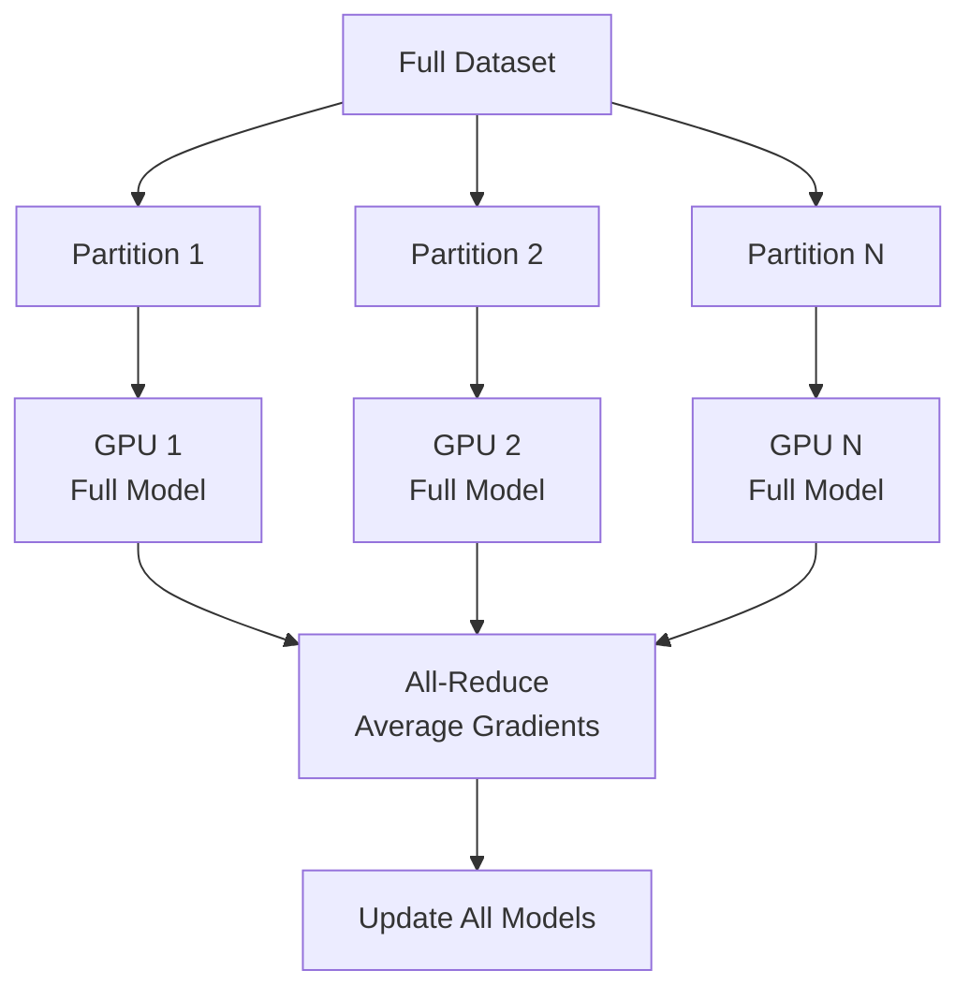
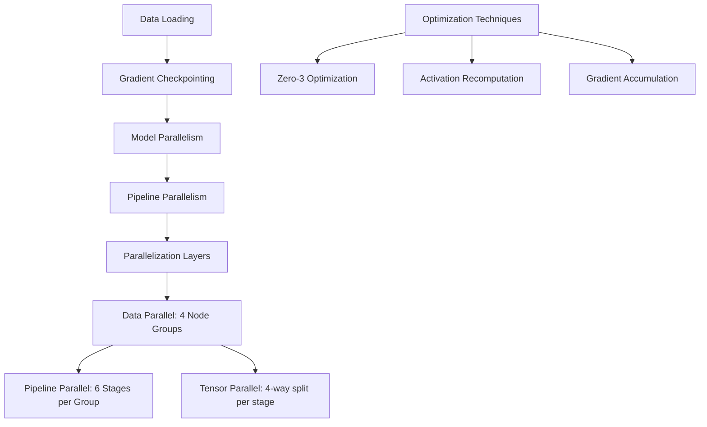
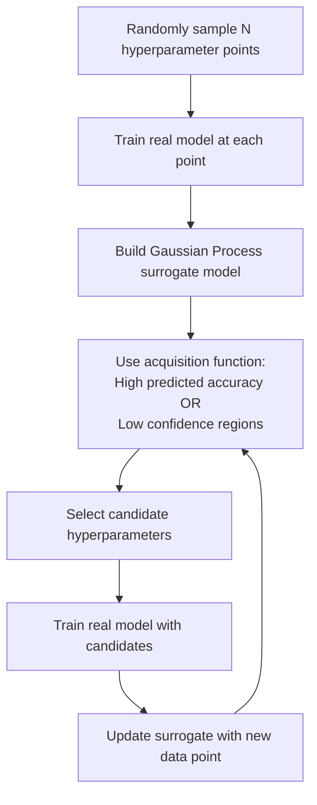
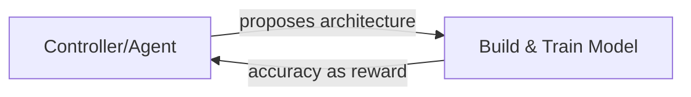

# Lecture 4: Choosing the Right ML Algorithm, Distributed Training, and AutoML

> **Course note**: This lecture continues the series progression: data sources → data engineering pipeline → (previous class topics) → today: how to choose the right ML algorithm, distributed training, and AutoML.

## Choosing the Right ML Algorithm

The slides present this as **six tips** for choosing the right ML algorithm, with the overarching goal of **avoiding human biases** in selecting models.

### Tip 1: Do Not Use Only State of the Art (SOTA) Models

A common instinct is to reach for the latest and greatest model, state of the art. People do this for two natural reasons: (1) they want to apply that existing architecture to their problem, and (2) they want to get experience with it. But often that is not the right way of doing it.

**Why you should not start with the state of the art:**

1. **Benchmark vs. real data mismatch**: State of the art models are published with results on standard benchmark data sets that are clean and well documented. Real world data is messy, and these models may not perform as well on your specific data. You need to evaluate that yourself.

2. **Computational cost**: State of the art models are more complex. They require more computational resources to train and for inference. They could also cause higher latency. From both an accuracy and an efficiency point of view, they may not be optimal.

> **Key principle**: Do not just start with the state of the art model. Instead, find the least complex and most efficient model for your data set through experiments.

### Tip 2: Start with the Simplest Models

**Start with the simplest model.** Simple models offer several advantages beyond just being quick to build:

- They are easy to **comprehend and explain** the predictions *(from slides)*
- They are easy to **deploy** *(from slides)*
- **Early deployment** helps in many validations *(from slides)*
- Simple models help you **debug more complex models** later *(from slides)*
- They give a **baseline** to compare more complex models against

**Why a baseline matters:**

- If a simple classification model only gives **60% accuracy**, it is very unlikely that a complex model will reach your target (e.g., 95%). Your data just does not support it. Go back and get more data.
- If a simple model gives **80 to 90% accuracy**, there is hope to improve. You can then investigate which features are useful and which indicate good predictions.

**What simple models reveal:**

- **Linear regression** (for continuous variables) and **logistic regression** (for classification) help you understand which features are important.
- They create a solid baseline above which you can measure the improvement from more complex models.

**Choosing a baseline model by domain:**

| Domain | Suggested Baseline |
|---|---|
| Tabular data (regression) | Linear regression |
| Tabular data (classification) | Logistic regression |
| Computer vision | Small convolutional network |
| Language/NLP | Simple transformer model |

> **Key takeaway**: Creating a baseline model pipeline is very important. It will not take much time, but it gives you a reference point and can be reused for many purposes.

---

### Tip 3: Evaluate Performance at Different Time Points (Learning Curves)

After building a baseline, you need to evaluate whether the problem is data quality, data quantity, or model complexity. **Learning curves** help you figure this out.

**How to construct a learning curve:**

1. Take your full data set (e.g., 1 million records).
2. Create training data sets of different sizes: 1,000, 5,000, 10,000, 50,000, 100,000 records.
3. For each size, split into training and validation sets.
4. Train a model on each size.
5. Compute evaluation metrics (e.g., accuracy) on **both** the training data and the validation data.
6. Plot both scores against training set size.

*(reconstructed example)*

```python
from sklearn.model_selection import learning_curve
import matplotlib.pyplot as plt
import numpy as np

train_sizes, train_scores, val_scores = learning_curve(
    estimator=model,
    X=X, y=y,
    train_sizes=np.linspace(0.1, 1.0, 10),
    cv=5,
    scoring='accuracy'
)

plt.plot(train_sizes, train_scores.mean(axis=1), 'r-', label='Training score')
plt.plot(train_sizes, val_scores.mean(axis=1), 'g-', label='Validation score')
plt.xlabel('Training set size')
plt.ylabel('Accuracy')
plt.legend()
plt.title('Learning Curve')
plt.show()
```

**Why the training accuracy (red curve) goes down:**

With very few data points, any model can fit through all of them perfectly. The model finds an optimal point that passes through every data point. As the data size increases, the model can no longer fit every point perfectly. It finds an approximation, so training accuracy decreases slightly.

**Why the validation accuracy (green curve) goes up:**

With a small training set, the model has not seen enough of the data distribution. The validation set is diverse and may be far from what the model learned. As training data increases, the model generalizes better because it has seen more representative data points. Validation accuracy improves.

**Interpreting the gap between curves:**

| Observation | What it means | What to do |
|---|---|---|
| Large gap between training and validation scores | Model is overfitting | Increase training data |
| Small gap, but both scores are low (e.g., ~85%) | Model has high bias (underfitting) | Try a more complex model |
| Small gap, both scores are high | Good fit | Model is working well |
| Validation score close to 1.0 but large gap | Overfitting but promising model | Add more training data to close the gap |

**Example from lecture (two models compared):**

The slide shows learning curves for a **Naive Bayes** model (left) and an **SVM with RBF kernel, γ = 0.001** (right). Source: scikit-learn. *(from slides)*

- **Left curve (Naive Bayes)**: Gap is small, but accuracy plateaus around 85% even beyond 400 samples. The model is not useful because its maximum achievable accuracy is too low.
- **Right curve (SVM RBF)**: Cross validation score reaches close to 1.0. It is overfitting (red curve on top), but there is hope that adding more training data will reduce the gap and improve validation accuracy.

> **Practical note**: You can plot learning curves easily using scikit-learn's `learning_curve` function. You do not need to write any custom code.

**Additional observations about learning curves:**

- Sometimes the curve can zigzag. This typically happens if the model gets stuck in a local optimum. Averaging over many runs smooths this out.
- It is possible to get a better score on test data than training data. This is counterintuitive but can happen, meaning the model performs better on unseen data than on what it was trained on.

---

### Tip 4: Evaluate Trade-offs

These factors are not typically taught in theory courses, which only focus on accuracy. But as an **MLOps engineer** or **ML deployment engineer**, they directly affect your organization's bottom line.

The slides list three specific trade-offs to evaluate:

#### 4a. False Positive vs. False Negative Trade-off

In real scenarios, the costs of different error types are not the same.

**Credit card fraud detection example:**

| Error Type | What happens | Consequence |
|---|---|---|
| **False Positive** (flagging a legitimate transaction) | Analyst has to investigate | Wasted analyst time, but manageable |
| **False Negative** (missing a fraudulent transaction) | Fraud goes through | Chargebacks, customer complaints, lost money |

**Medical diagnosis example (cancer detection):**

| Error Type | What happens | Consequence |
|---|---|---|
| **False Positive** (diagnosing cancer when none exists) | Patient gets a confirmation test | Additional cost and stress, but correctable |
| **False Negative** (missing actual cancer) | No treatment given | Patient could lose their life |

> **Key takeaway**: You need to use metrics that are sensitive to these asymmetric costs. Accuracy alone is not sufficient because it is not sensitive to these imbalances.

*(added)* Metrics to consider include **precision**, **recall**, **F1 score**, and **AUC-ROC**, which give a more nuanced view of false positive and false negative rates.

#### 4b. Accuracy vs. Computational Cost

A logistic regression model at 90% accuracy versus a deep learning model at 92 to 95% accuracy that is 5 to 10 times more computationally expensive. Is 2% improvement worth 5x the cost?

**It depends on the business context:**

- **Low volume scenario**: The 2% improvement may not justify the cost.
- **High volume scenario (e.g., ad click through rate prediction)**: Even a 0.1% improvement makes a huge revenue difference when you are showing millions of ads per day. Here, switching to a more expensive model makes sense.

#### 4c. Latency vs. Accuracy

Deep learning models are more accurate but take more time to produce a response, and then the customer cannot use the product effectively. For real time applications, latency matters as much as accuracy.

> **The three factors to keep in mind when choosing a model in production:**
> 1. Cost of false positives vs. false negatives
> 2. Accuracy vs. computational cost
> 3. Latency

### Tip 5: Understand Your Model's Assumptions

All models are some approximations of reality.

> **"All models are wrong, but some are useful."** - George Box, 1976 *(from slides)*

Different models make different assumptions about the data. You should verify whether those assumptions are valid for your data set before selecting a model.

**Common model assumptions** *(from slides)*:

- **Normality**: Data follows a normal distribution
- **IID**: Data points are independent and identically distributed
- **Smoothness**: The underlying function changes smoothly
- **Tractability**: The model can be computed in reasonable time
- **Boundaries**: Decision boundaries have a particular shape (linear, etc.)
- **Conditional independence**: Features are independent given the class (e.g., Naive Bayes)

---

### Tip 6: Use an Algorithm Cheat Sheet

| Algorithm Family | Algorithms | Key Characteristics |
|---|---|---|
| **Linear models** | Linear regression, Logistic regression, Lasso, Ridge | Simple, interpretable. Lasso and Ridge add regularization to reduce overfitting while remaining linear models. |
| **Tree based models** | Decision trees, Random forest, XGBoost, Gradient boosted trees | Handle noise, feature correlation, overfitting/underfitting well. Go-to choice for most tabular problems today. |
| **Clustering** | Various clustering methods | Unsupervised grouping of data |

**Why tree based models are popular today:**

- They handle noise in the data well.
- They handle correlation between different variables.
- They manage overfitting and underfitting scenarios naturally.
- They are not necessarily the best everywhere, but they are a strong default choice.

**Why Lasso and Ridge are useful:**

- They add regularization to linear models.
- They reduce overfitting while keeping the model simple and interpretable.

**Why random forests excel:**

- They handle most data types without special preprocessing.
- They incorporate **feature selection automatically** because each tree in the ensemble uses a random subset of features. This means you do not need to do manual feature selection (feature selection was discussed in the previous class).
- At the end, they use voting (classification) or averaging (regression) to aggregate predictions.

> **Summary**: There is no recipe for choosing the right algorithm. The process is: start with a simple baseline model, plot learning curves, evaluate practical tradeoffs, and experiment.

**Discussion question from slides:** Imagine you're working with a large dataset that has a mix of numeric and categorical data, and your goal is to predict a continuous outcome. Which machine learning algorithms would you consider and why?

> **Answer** *(from slides)*: Algorithms like **Random Forest** or **Gradient Boosting Machines (GBM)** are suitable as they handle mixed data types well and are good for regression tasks. They can also handle large datasets effectively.

---

## Distributed Training

### Why Distributed Training is Needed

Classical ML models are not very memory intensive and typically fit on a CPU. But deep neural networks with tens or hundreds of layers require very large memory and may not fit into a single GPU. Distributed training becomes necessary when the training data or model does not fit into memory.

**Examples of when distributed training is needed** *(from slides)*:

- **Large Language Models** (GPT, LaMDA, etc.)
- **Medical Images** (CT Scans, MRI Images)
- **Genomic Sequences**

**Preprocessing steps** also require parallel computation. Tools like **Apache Spark** and **Hadoop** are used for this. *(from slides)*

**Memory calculation example (LLaMA 7B):**

- 7 billion parameters
- At 16 bit precision: each parameter = 2 bytes
- Model size: ~12 GB just for parameters
- During training, the optimizer keeps a copy of all parameters (gradients, optimizer states), roughly **doubling** the memory requirement
- A standard 24 GB GPU is **not sufficient** for even a 7B parameter model
- Today's standard: **H100 GPUs** with ~80 GB of memory

### Gradient Checkpointing

Before distributing across machines, there is a simpler technique to reduce memory usage on a single GPU.

**How standard backpropagation uses memory:**

1. During the **forward pass**, you compute intermediate values at each layer.
2. You **store all intermediate values** in memory.
3. During the **backward pass**, you use these stored values to compute gradients.
4. You update parameters using: $\theta_{new} = \theta_{old} - \eta \cdot \nabla L$ *(reconstructed)*

This storage of all intermediate values is what consumes so much memory.

**How gradient checkpointing works:**

1. Mark a subset of neural network activations as **checkpoints** and store them in memory after the forward pass.
2. During the forward pass, **only store values at checkpoint nodes**. Checkpoint nodes are recomputed at most once and are stored in memory only until no longer required. *(from slides)*
3. During the backward pass, if you need the value at a non-checkpoint node, **recompute it** by running a partial forward pass starting from the nearest checkpoint.
4. For feed-forward networks, the optimal strategy is to mark every $\sqrt{n}$-th node as a checkpoint (where n is the number of layers). *(from slides)*


*(reconstructed diagram)*

**Tradeoff:**

| Metric | Without checkpointing | With checkpointing |
|---|---|---|
| Memory usage | Baseline | ~10x reduction (can train 10x larger models) |
| Computation time | Baseline | ~20% increase |

> **Key insight**: A 20% increase in computation time is a very acceptable tradeoff for being able to train models 10 times larger on the same hardware.

---

### Parallelization Strategies

When gradient checkpointing is not enough and you need to distribute across multiple machines, there are three conceptual approaches (plus a fourth, more advanced one).

#### 1. Data Parallelism

**How it works:**

1. Split the data into N partitions (one per GPU).
2. Keep the **same copy of the full model** on every GPU.
3. Each GPU does a forward pass and backward pass on its partition.
4. Accumulate gradients from all GPUs via a **reduction** operation (e.g., averaging).
5. Use the reduced gradient to update the model on all GPUs.


*(reconstructed diagram)*

**Disadvantages:**

- **Memory**: Every GPU must hold the **full model**. If the model does not fit in memory, data parallelism alone does not help.
- **Straggler problem**: You must wait for all GPUs to finish before doing the reduction. The slowest GPU determines the speed.

**Synchronous vs. Asynchronous mode:**

| Mode | Behavior | Advantage | Disadvantage |
|---|---|---|---|
| **Synchronous** | Waits for all N machines to finish | Consistent gradient updates | Straggler problem, wastes compute. Grows with number of machines. Can be reduced using load balancing and dynamic allocation of resources. |
| **Asynchronous** | Machines update independently | No waiting | **Gradient staleness** problem: weights change based on gradients from just one machine. |

**Gradient staleness in async mode** *(from slides)*: When the number of parameters is large, gradient updates tend to be sparse (each update only affects a small fraction of all parameters). In this scenario, gradient staleness becomes less of a problem because different machines are likely updating different parameters.

**Why 50% GPU utilization is typical:**

- Kernel overhead
- Data loading and swapping between memory and storage
- Network communication (receiving data from other nodes)

These factors cause some machines to slow down unpredictably. **Load balancing** is critical: ensure all machines have equal free memory and compute available. As an ML engineer, this is part of your job.

#### 2. Model Parallelism

**How it works:**

1. Split the **model** across machines (not the data).
2. GPU 0 gets layers 1 to 10, GPU 1 gets layers 11 to 20, and so on.
3. Data flows through the machines sequentially during the forward pass.

**Disadvantage:** Sequential dependency. Each machine must wait for the previous one to finish before it can start. This creates idle time.

#### 3. Pipeline Parallelism

**How it works:**

Pipeline parallelism combines data and model parallelism. The model is split across machines (like model parallelism), but multiple data batches are processed in a pipeline fashion:

1. GPU 0 processes batch 1 through its layers.
2. Once done, GPU 0 starts on batch 2, while GPU 1 processes batch 1 through its layers.
3. Eventually, all GPUs are working on different batches simultaneously.

**Advantages over pure approaches:**

- More optimized than pure data parallelism or pure model parallelism.
- Each machine works on a portion of the data **and** a portion of the model.

**Remaining disadvantage:**

- There is still some slack (idle time) because later stages must wait for earlier stages to finish. The sequential dependency is smaller than in pure model parallelism, but it still exists.

#### 4. Fully Sharded Data Parallelism (FSDP)

FSDP addresses the remaining inefficiencies by rethinking how the model is distributed.

**How model parallelism splits the model (sequential):**

- GPU 0: layers 1 to 10
- GPU 1: layers 11 to 20
- GPU 2: layers 21 to 30
- This creates a **sequential dependency** in the forward pass.

**How FSDP splits the model (sharded across layers):**

- From **every layer**, sample a subset of parameters and distribute them across GPUs.
- GPU 0 gets some parameters from layer 1, some from layer 2, some from layer 3, etc.
- GPU 1 gets **different** parameters from layer 1, layer 2, layer 3, etc.
- Every GPU has parameters from **all layers**, but only a **subset** of each layer's parameters.

| Approach | How model is split | Dependency |
|---|---|---|
| Model parallelism | Layer by layer (sequential) | Sequential. GPU 1 waits for GPU 0. |
| FSDP | Random subset of parameters per layer | No sequential dependency |

**FSDP computation process:**

1. Each GPU has a subset of parameters from every layer.
2. Each GPU calculates gradients on a **microbatch** (subset of data).
3. To update a layer, the GPU needs **all** parameters for that layer.
4. It borrows the missing parameters from other GPUs via an **all-reduce** operation (only for that specific layer).
5. Once it has all parameters for one layer, it does the computation, then moves to the next layer.
6. After the reduce, scatter, and gather operations, every GPU has the sum of all gradients from all data points.

**Key advantage of FSDP:**

In data parallelism, the entire model must fit on each GPU. In FSDP, each GPU only holds a **subset** of parameters from each layer. The memory requirement per GPU is **much smaller**. After the collective operations, the result is mathematically equivalent. It just reorders the computation.

> **Key insight**: FSDP is a very clever reordering of how gradients are computed and shared. It achieves the same result as data parallelism but with dramatically lower per-GPU memory requirements.

**Origin and tools:**

- Invented by **Facebook AI Research (FAIR)**
- Open source library: **FairScale**
- Also available natively in **PyTorch** (`torch.distributed.fsdp`)

**3D Parallelism**: Today's state of the art for large model training combines multiple forms of parallelism (data, model/tensor, and pipeline) simultaneously. This is called **3D parallelism**.

#### Use Case: Training Llama 2 70B Model *(from slides)*

The slides show a complete memory management strategy for training a 70 billion parameter model:


*(reconstructed from slide diagram)*

### Distributed Model Training with PyTorch *(from slides)*

PyTorch provides two main approaches for distributed training:

| Approach | How it works | Memory per GPU |
|---|---|---|
| **Distributed Data Parallel (DDP)** | Each process/worker owns a **replica** of the model and processes a batch of data. Model weights and optimizer states are **replicated** across all workers. Uses **all-reduce** to sum up gradients. | Full model on each GPU |
| **Fully Sharded Data Parallel (FSDP)** | Model parameters, optimizer states, **and gradients** are all **sharded** across GPUs. This makes training of very large models feasible. | Only a shard per GPU |

> **Course note**: The lecturer encouraged students to experiment with FSDP using the available libraries (FairScale, PyTorch distributed).

> **Exercise** *(from slides)*: Use the code provided with the lecture notes to train a Neural Network Classification model using FSDP on the GPU Cluster.

**References from slides:**

- FSDP Blog from Meta
- FairScale Open-Source Library
- FSDP Tutorial from PyTorch

---

## AutoML

**AutoML** refers to the process of automating the end-to-end process of applying ML to real-world problems. *(from slides)*

The reason a lot of companies like Google and Microsoft push AutoML is because it requires a lot of computation. It is not cheap. They make money from the cloud compute that data scientists spend on it.

AutoML comes in two varieties:

| Type | Also called | What is automated |
|---|---|---|
| **Soft AutoML** | Hyperparameter tuning | Architecture is fixed. Only hyperparameters are optimized. |
| **Hard AutoML** | Neural Architecture Search (NAS) | The architecture itself (layers, neurons, activation functions, loss functions) is searched. Also includes **learned optimizers**. *(from slides)* |

### Hyperparameters

**Hyperparameters** are parameters that cannot be learned from data by minimizing the loss function. They must be set before training begins and are tuned by building models with different values, evaluating on a cross validation set, and selecting the best.

Examples of hyperparameters *(added)*:

- Learning rate
- Number of trees in a random forest
- Regularization strength (C in SVM, alpha in Lasso/Ridge)
- Number of layers/neurons in a neural network
- Batch size

> Hyperparameter tuning is the **final step** of model development, done through an automated process.

**Popular ML frameworks with built-in tuners** *(from slides)*:

- **Auto-sklearn**: Automated machine learning toolkit based on scikit-learn
- **Keras Tuner**: Hyperparameter tuning for Keras models

### Hyperparameter Tuning Methods

#### 1. Grid Search

**How it works:**

1. Define a set of values for each hyperparameter.
2. Create a grid of all possible combinations.
3. Train and evaluate a model at **every point** in the grid.

*(reconstructed example)*

```python
from sklearn.model_selection import GridSearchCV

param_grid = {
    'C': [0.1, 1, 10],
    'kernel': ['linear', 'rbf'],
    'gamma': [0.01, 0.1, 1]
}

grid_search = GridSearchCV(estimator=svm_model, param_grid=param_grid, cv=5)
grid_search.fit(X_train, y_train)
print(grid_search.best_params_)
```

**Problem:** The number of combinations grows **exponentially** with the number of hyperparameters. With 3 hyperparameters each having 10 values, that is $10^3 = 1000$ evaluations.

> **Practical rule**: Grid search is almost never used in practice unless you have only one or two hyperparameters.

#### 2. Random Search

**How it works:**

1. Define a range or distribution for each hyperparameter.
2. **Randomly sample** points from the hyperparameter space.
3. Train and evaluate at each sampled point.
4. Keep track of the best performing combination.
5. Repeat with more random samples if needed.

*(reconstructed example)*

```python
from sklearn.model_selection import RandomizedSearchCV
from scipy.stats import uniform, randint

param_distributions = {
    'C': uniform(0.1, 100),
    'kernel': ['linear', 'rbf'],
    'gamma': uniform(0.001, 1)
}

random_search = RandomizedSearchCV(
    estimator=svm_model,
    param_distributions=param_distributions,
    n_iter=50,
    cv=5
)
random_search.fit(X_train, y_train)
print(random_search.best_params_)
```

**Advantage:** Cost is **linear**. Each iteration evaluates only one set of parameters. You can keep searching as long as you want.

| Method | Cost scaling | When to use |
|---|---|---|
| Grid Search | Exponential ($O(v^k)$ where v = values, k = hyperparameters) | 1 to 2 hyperparameters only |
| Random Search | Linear ($O(n)$ where n = number of samples) | 3+ hyperparameters |

#### 3. Bayesian Optimization

Bayesian optimization builds a **surrogate model** (a model of the model) that predicts which hyperparameter values will give the best accuracy.

**How it works:**

1. **Initialize**: Randomly sample N points from the hyperparameter space. Train the actual model at each point and record the accuracy.
2. **Build surrogate**: Use these (hyperparameter, accuracy) pairs as training data for a **Gaussian process** model. This surrogate predicts both the **expected accuracy** and the **confidence interval** for any hyperparameter combination.
3. **Acquisition function** (exploration vs. exploitation):
   - **Exploit**: Check regions where predicted accuracy is **high**.
   - **Explore**: Check regions where confidence is **low** (unexplored areas that could contain good values).
4. **Evaluate**: Take the most promising candidate, train the real model, and get the actual accuracy.
5. **Update**: Add this new data point to the surrogate model's training data.
6. **Repeat** steps 3 to 5.


*(reconstructed diagram)*

**The Gaussian process gives two outputs:**

1. **Predicted accuracy**: $\mu(\mathbf{x})$ for hyperparameter vector $\mathbf{x}$
2. **Confidence interval**: $\sigma(\mathbf{x})$, the uncertainty of the prediction

*(added)*

The acquisition function balances exploration and exploitation. A common choice is **Expected Improvement (EI)**:

$$EI(\mathbf{x}) = \mathbb{E}[\max(f(\mathbf{x}) - f(\mathbf{x}^+), 0)]$$

where $f(\mathbf{x}^+)$ is the best observed value so far.

**Key advantage:** Bayesian optimization converges to good hyperparameter values within about **10 to 12 iterations**, because the Gaussian process is a simple surrogate model. You are doing meta-model optimization.

> **Current standard**: Bayesian optimization is what is used in practice today for hyperparameter tuning of SVMs, random forests, gradient boosted trees, and other models.

*(reconstructed example)*

```python
from skopt import BayesSearchCV
from skopt.space import Real, Categorical

search_spaces = {
    'C': Real(0.1, 100, prior='log-uniform'),
    'kernel': Categorical(['linear', 'rbf']),
    'gamma': Real(1e-4, 1, prior='log-uniform')
}

bayes_search = BayesSearchCV(
    estimator=svm_model,
    search_spaces=search_spaces,
    n_iter=20,
    cv=5
)
bayes_search.fit(X_train, y_train)
print(bayes_search.best_params_)
```

| Method | Iterations needed | Intelligence | Best for |
|---|---|---|---|
| Grid Search | Exponential | None (brute force) | 1 to 2 parameters |
| Random Search | Linear (many) | None (random) | 3+ parameters, quick baseline |
| Bayesian Optimization | ~10 to 12 | Guided by surrogate model | Any number of parameters, production tuning |

---

### Neural Architecture Search (NAS)

NAS is the "hard" version of AutoML. Instead of tuning hyperparameters for a fixed architecture, it searches for the best architecture itself.

#### Three Components of NAS

1. **Search space**: A library of NN components. *(from slides)* The set of all possible building blocks:
   - Number of layers
   - Types of convolutional operations (e.g., 3x3, 5x5 convolution)
   - **Pooling layers** *(from slides)*
   - Connection types (e.g., **skip connections**, dense connections) *(from slides)*
   - Activation functions (e.g., ReLU, sigmoid, tanh)

2. **Search strategy**: How to explore the search space.
   - **Exploration**: Try novel architectures *(from slides)*
   - **Exploitation**: Tweak proven architectures *(from slides)*

3. **Performance estimation strategy**: Measures how good the performance is using **k-fold cross validation**. *(from slides)*

#### Search Strategies

The general principle is **exploration and exploitation**:

- **80% exploitation**: Experiment within architectural families that are known to work well for the problem. For example, for object detection, vary kernel sizes, connection patterns, and configurations within convolutional architectures.
- **20% exploration**: Try completely different architectures. For an image classification task, try a recurrent network or an LSTM instead of the expected CNN.

There are three main search strategy methods:

##### 1. Reinforcement Learning Based

**How it works:**

1. A **controller model** (usually an **RNN or a Transformer model**) acts as an RL agent. *(from slides)*
2. The agent **proposes** a model architecture, suggesting a model description as a **"string"**. *(from slides)*
3. The proposed architecture is actually **built and trained**.
4. The **performance** (e.g., accuracy) is given back to the agent as a **reward**.
5. After receiving the reward, the controller suggests a new model. The RL agent optimizes **long-term cumulative rewards**. *(from slides)*
6. Repeating this several times results in a highly optimized model description from the controller.


*(reconstructed diagram)*

**Example: NASNet**

- Neural architecture search for image classification.
- Beat human designed models on **ImageNet**. *(from slides)*
- Cost: **800 GPUs running for four months**. Possible, but extremely expensive.

##### 2. Evolutionary Methods

**How it works:**

Applies principles of biological evolution, such as **mutation, crossover, and selection**, to evolve network architectures over time. *(from slides)*

1. Start with a population of **random model architectures**.
2. **Evaluate** each architecture's performance.
3. **Kill** (discard) all models having performance **lower than a threshold**. *(from slides)*
4. **Mutate** (tweak) the good models: change the number of layers, number of neurons in each layer, or other structural elements.
5. **Repeat** the selection and mutation process.

**Example: AmoebaNet**

- Used evolutionary search for architecture discovery.
- Proved that "evolution" could find **high-performing architectures that human intuition might never have considered**. *(from slides)*
- Also computationally expensive because every iteration requires building and training multiple models.

##### 3. Differentiable / Gradient Based Methods (DARTS)

**How it works:**

Instead of treating the search as a series of separate guesses, DARTS turns the architecture into a single, massive mathematical equation. *(from slides)*

1. Create a **"Supernet"** where every possible path exists at once with different weights. *(from slides)*
2. Assign a learnable **architecture parameter** ($\alpha_i$) to each candidate operation. $\alpha_i$ represents the "strength" of that operation. *(from slides)*
3. The weights are parameterized using a **softmax function** so that all candidate weights always add up to 100%:

$$\bar{o}(x) = \sum_{i \in \text{Candidates}} \frac{\exp(\alpha_i)}{\sum_j \exp(\alpha_j)} \cdot o_i(x)$$

Where $o_i(x)$ is the actual mathematical operation (the "candidate") and $\alpha_i$ is the learnable architecture parameter. *(from slides)*

4. Using **gradient descent**, the model slowly "turns down the volume" on bad paths and "turns up the volume" on good paths. *(from slides)*
5. The final architecture is determined by the operations with the highest $\alpha$ values.

The key insight is that by making the architecture selection differentiable, you can use standard gradient based optimization instead of expensive trial and error.

| NAS Method | Approach | Compute Cost | Time |
|---|---|---|---|
| RL Based (NASNet) | Controller proposes, reward signal | Very high | ~4 months on 800 GPUs |
| Evolutionary (AmoebaNet) | Mutation + crossover + selection | Very high | Thousands of GPU-hours |
| Differentiable (DARTS) | Gradient descent on architecture weights | Low | Reduced to **a few hours** *(from slides)* |

> **Current state**: Differentiable methods are the most popular way of doing neural architecture search today. Instead of running for four months on hundreds of GPUs, you can do it in a few hours. The computational savings are enormous.

> **Course note**: The lecturer recommended reading external material that explains how differentiable NAS works in detail, and mentioned that a code example may be shown in a future class.
