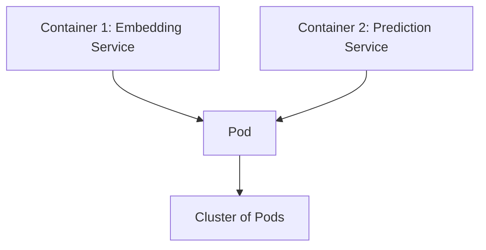
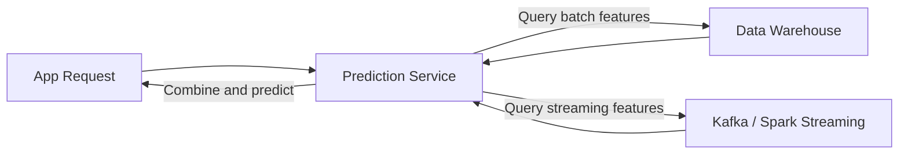

# Lecture 5: ML Model Deployment, Scaling, and Model Compression

> **Course note**: This lecture continues the series progression: data sources → data engineering pipeline → feature engineering → model selection → training → **today: model deployment**. The next topic will be model fine-tuning.

## Common Misconceptions About ML Deployment

Before getting into the details of deployment, there are several myths and misunderstandings that people commonly have about deploying ML models in production.

### Myth 1: Organizations Only Have a Few ML Models

People assume that because ML models are expensive to train and deploy, organizations will only have a handful of them. This is wrong.

**Uber example**: For any single ride on Uber, hundreds of ML models make inferences. Models are used for:

- Ride demand prediction
- Driver availability
- Estimated time of arrival
- Dynamic pricing based on demand
- Fraudulent transaction detection (e.g., stolen credit cards)
- Customer churn prediction

Companies like Uber have **200+ ML models** running at all times. The ML engineering team handles training, infrastructure, scaling, monitoring, and much more.

### Myth 2: Model Performance Stays Stable After Deployment

Model performance can degrade over time because the data distribution keeps changing.

**Uber seasonal example**: There is more demand in winter than in summer. Travel times differ due to snow and road conditions. A model trained during summer will not work well during winter. These shifts need to be tracked periodically, and the model must be updated based on recent data.

> **Key difference**: This is what makes ML software fundamentally different from standard software. Standard software does not degrade just because the world around it changes, but ML models do.

### How Often Should You Retrain?

The retraining frequency depends on three factors:

1. **How critical the decision is**
2. **The application domain**
3. **How frequently the data distribution changes**

Retraining frequency can range from **every 10 minutes to days and months**, depending on the use case.

**High retraining frequency** is needed for models:
- Deployed in real-time systems
- Used for critical decisions (e.g., fraud detection, medical diagnosis)
- Used in applications where data is changing rapidly

**Low retraining frequency** is acceptable for models:
- Used in less critical applications (e.g., product recommendations, website personalization)
- Used in applications where data is relatively stable (e.g., standard NLP, image recognition)

| Criticality | Example | Retraining Frequency |
|---|---|---|
| Low | Customer sentiment prediction | Can tolerate some degradation, retrain less often |
| High | Credit card fraud detection | Must retrain very frequently |
| High | Medical diagnosis | Must retrain frequently |

**Why fraud detection demands frequent updates**: Fraudsters constantly adapt their tactics. They start with small transactions to test the waters, then make large fraudulent transactions. If the model is not updated, they exploit the gap for maximum damage.

**Stable vs. shifting data sets**:

| Data Type | Shift Level | Example |
|---|---|---|
| Standard text classification | Very stable | Classifying topics (sports, arts) |
| Image classification | Very stable | Classifying bird species |
| Sentiment analysis on social media | Shifting | Twitter sentiment, news trends |
| Financial transactions | Shifting | Credit card fraud patterns |

If the data set is very stable and the use case is not critical, you do not need to retrain frequently.

### Myth 3: Only Big Companies Need to Worry About Scaling

People think only companies like Google and Facebook deal with scaling problems. This is completely wrong.

You can have a startup with 100+ employees but products serving millions of customers. Examples: OpenAI, Slack. **ChatGPT** was just one application from a startup, but it immediately had five million users. Scaling demands depend entirely on the demand for the service, not the size of the company.

---

## Scaling Strategies

### Vertical Scaling vs. Horizontal Scaling

| Aspect | Vertical Scaling | Horizontal Scaling |
|---|---|---|
| What it means | Increase the capacity of a single machine (more RAM, faster CPU/GPU) | Add more machines |
| Complexity | Simple, no load balancing needed | Complex, requires load balancing |
| When to use | Feature set is small, workload fits on one machine | When vertical scaling is not enough |
| Example | Credit card fraud detection on a 64 GB server handling 1,000 to 10,000 transactions/second | High-traffic web services |

**Credit card fraud example**: A single server with 64 GB RAM can handle thousands of transactions per second with multi-threading. During peak seasons like Black Friday, you may only need to double the memory or speed of that single server rather than deploying additional machines.

In many cases, you may need **both**: increase the machine configuration (GPU memory, CPU speed) **and** add more machines. This is called **Hybrid Scaling**.

### Auto-scaling

*(from slides)*

**Auto-scaling**: The number of machines is automatically adjusted based on the load. This is done using cloud services such as **AWS Auto Scaling groups** or **Kubernetes Horizontal Pod Autoscaler (HPA)**.

### Microservices Architecture

Modern ML deployments use **microservices** rather than VM-level deployments.

**Structure (from smallest to largest):**

*(reconstructed diagram)*



- **Container**: Has just enough software, computing, and networking to run one small service (e.g., creating an embedding)
- **Pod**: Groups multiple containers that share memory, networking, and authentication
- **Cluster**: Many pods working together

**Kubernetes** has become the standard for container management and orchestration. VM-level deployment is no longer the norm. In microservices, each service can be scaled independently using **service meshes** such as **Istio** or **Linkerd** *(from slides)*.

---

## Batch Prediction vs. Online Prediction

This is one of the most important architectural decisions in ML deployment.

### Feature Types

| Feature Type | Description | Example |
|---|---|---|
| **Batch features** | Computed on a regular interval as a batch job | Average ride price over the last 7 days |
| **Streaming/Online features** | Computed in real time from current data | Current demand, current IP address, current purchase amount |

### Three Prediction Architectures

#### 1. Batch Prediction (also called Asynchronous Prediction)

Everything is precomputed on a schedule.

*(reconstructed diagram)*


**How it works:**
1. Historical data lives in the data warehouse (e.g., **Snowflake**, **BigQuery**, **S3**)
2. A batch job computes features and stores them in a feature store
3. The model runs predictions using those features and stores results
4. When the app requests predictions (e.g., "recommended movies for user X"), it just queries the precomputed prediction table

**Best example: Recommendation systems.** Netflix and Amazon generate recommendations via batch processes, typically once a day. When you log in, they fetch your precomputed recommendations. However, modern systems like Netflix also add real-time recommendations based on what you just watched, combining batch and online approaches.

#### 2. Online Prediction Using Only Batch Features (also called Synchronous Prediction)

Online predictions are generated and returned as soon as requests arrive. Requests are sent to the prediction service via **RESTful APIs** *(from slides)*.

*(reconstructed diagram)*


**How it works:**
1. The app sends a prediction request
2. The prediction service queries precomputed batch features from the feature store
3. The model makes a prediction using those features and returns it in real time

#### 3. Online Prediction Using Both Batch and Streaming Features

*(reconstructed diagram)*



**How it works:**
1. The app sends a prediction request
2. Simultaneously, streaming features are fetched from platforms like **Kafka** or **Spark Streaming**
3. Batch features are fetched from the data warehouse
4. The prediction service combines both feature types, makes a prediction, and returns it

**Credit card fraud detection example**: At transaction time, the system gathers the user identity, purchase amount, IP address, and store information (all streaming features). It may also use batch features like historical spending patterns. The prediction is made entirely in real time. This must be online because imagine if every day they had to keep scoring everybody's credit score in batch. It is not worth it. The prediction only needs to happen at the moment the credit card is used, taking the current context into account.

**Uber ride pricing example**: The price depends on the current context (current demand is a streaming feature), but it also uses batch features (average price over the last 7 days). This is online prediction using both batch and streaming features.

### Batch vs. Online Prediction: Trade-offs

| Aspect | Batch Prediction | Online/Streaming Prediction |
|---|---|---|
| **Latency** | None (precomputed) | Must be under 100ms typically |
| **Waste** | High (predictions computed for users who may never log in) | None (only computed on request) |
| **Current context** | Misses it (e.g., trending movies, sudden demand) | Captures it fully |
| **Accuracy** | May be stale | Higher, because it uses real-time context |
| **Input** | Need to know the input in advance | Input is available with the request |
| **Infrastructure** | Simpler, can be scheduled | Complex, requires low-latency infrastructure |
| **Cost efficiency** | Batch processing can be parallelized efficiently | Requires more computational infrastructure |
| **Feature types** | Batch features only | Can use both batch and streaming features |

> **Key takeaway**: The choice depends entirely on the use case. Recommendation systems typically use batch prediction. Fraud detection and real-time pricing require online prediction. These concepts are not very theoretical, but as an ML engineer, you need to be aware of them.

---

## Reducing Inference Latency

There are three approaches to reducing latency:

### 1. Code Optimization

Improve latency through better code:
- Proper parallelization and multi-threading
- Using the correct data structures
- Using recursive algorithms instead of loops where appropriate

### 2. Hardware Upgrades

Use faster CPUs or GPUs. This is the "low-hanging fruit" but can be expensive.

### 3. Model Compression

Even with optimized code, the model itself must process each request through a full forward pass. Compressing the model reduces this cost.

**Why compressed models are faster**: Instead of using 32 bits per weight (standard), you use fewer bits (16, 8, or even 4). A 4-bit representation reduces memory by almost one-eighth compared to 32-bit. This means:
- You can load a model on much smaller hardware
- A bigger model can fit on the same hardware
- Models can be deployed on **edge devices** like laptops

**Ollama example**: Ollama runs LLMs on your laptop by using a C++ based backend and loading compressed versions of models. This is why you can run large language models locally.

> **Resource**: The website "Awesome Open Source" lists many open-source projects (168 currently) focused on model compression: https://awesomeopensource.com/projects/model-compression

---

## Four Model Compression Techniques

### 1. Low-Rank Factorization

**Core idea**: Replace large tensors (weight matrices) with products of smaller matrices.

**How it works in CNNs**: Convolution filters are tensors with dimensions $H \times W \times C$. You can replace these with smaller filters by reducing the depth.

**Mathematical basis** *(reconstructed formula)*: Any large matrix can be decomposed into a product of smaller matrices:

$$A_{M \times N} \approx B_{M \times K} \cdot C_{K \times N}$$

where $K \ll M$ and $K \ll N$.

**AlexNet/SqueezeNet example**: AlexNet, the pioneering deep learning model created by Geoffrey Hinton and others, used large 3x3 convolution filters. **SqueezeNet** replaced these with 1x1 depthwise convolution filters using low-rank factorization, achieving similar accuracy on the **ImageNet** dataset:
- **Parameter reduction**: ~50% compared to AlexNet
- **Performance degradation**: only ~5%

> This is the idea behind **LoRA** (Low-Rank Adaptation), which is widely used today for efficient fine-tuning of large models.

### 2. Knowledge Distillation

**Core idea**: Use a large "teacher" model to train a smaller "student" model, rather than training the small model directly on raw data. This is similar to transfer learning.

**The teacher-student analogy**: When a teacher explains a concept to a student, they abstract and summarize the key ideas. The student learns concepts more efficiently from the teacher than by reading raw textbooks alone. Similarly, a large model "distills" its knowledge into a smaller model.

**Why it works better than direct training**:

Every model has a **capacity limit**. This can be seen via a **learning curve**, which plots accuracy against training data size. The curve saturates at some point, meaning the model stops learning. A 3 billion parameter model, when trained on a massive data set (e.g., 3 trillion tokens), will saturate after processing only a fraction of the data (perhaps one-tenth). It simply cannot absorb everything.

The solution:
1. Train a large model (e.g., Gemini) on the full data set. The large model has the capacity to learn from all of it.
2. Sample from the large model's outputs (e.g., 100 billion samples).
3. Train the smaller model on these samples.

Because the large model's samples **abstract the concepts** from the original data, the small model learns more effectively than it would from raw data directly.

**Benefits of knowledge distillation** *(from slides)*:
- **Transfer learning**: Leverages knowledge from a pre-trained larger model
- **Regularization**: The teacher's soft outputs act as a regularizer, reducing overfitting
- **Learning from intermediate representations**: The student can learn from the teacher's internal layers, not just final outputs
- **Improved generalization**: The student model learns abstracted concepts, not raw data noise

The teacher also filters out duplicated data and noise. The student does not learn from the noise.

**How knowledge is transferred**: Both architecture and data are involved. The student model takes a subset of the teacher's architecture (some layers), but the model weights cannot transfer directly because the student has fewer parameters. The most important element is that the **teacher labels the training data** for the student.

#### BERT to DistilBERT: A Classic Example

| Property | BERT | DistilBERT |
|---|---|---|
| Type | Teacher model | Student model |
| Transformer layers | 2x more | Half |
| Parameters | ~110M | ~66M (~40% size reduction) |
| NLU capability retained | Baseline | 97% |
| Speed | Baseline | 60% faster |
| Created by | Google | Hugging Face (via knowledge distillation from BERT) |

**BERT** (Bidirectional Encoder Representations from Transformers) was the first well-known transformer-based model, produced by Google. It became the workhorse for NLP but was heavy and difficult to deploy. **DistilBERT** was produced through teacher-student training, sacrificing only 3% accuracy for more than 50% size reduction and 60% speed improvement.

#### Modern Examples of Knowledge Distillation

| Teacher Model | Student Model |
|---|---|
| Llama 405B | Smaller Llama 3 models |
| Gemini | Gemma |
| GPT-4 | Many open-source models |

Knowledge distillation has become the standard approach for producing smaller, deployable models.

*(added)* Example of knowledge distillation in PyTorch:

```python
import torch
import torch.nn.functional as F

def distillation_loss(student_logits, teacher_logits, labels, temperature=3.0, alpha=0.5):
    """
    Combines soft targets from the teacher with hard targets (true labels).
    """
    soft_loss = F.kl_div(
        F.log_softmax(student_logits / temperature, dim=1),
        F.softmax(teacher_logits / temperature, dim=1),
        reduction='batchmean'
    ) * (temperature ** 2)

    hard_loss = F.cross_entropy(student_logits, labels)

    return alpha * soft_loss + (1 - alpha) * hard_loss
```

### 3. Pruning

**Core idea**: Remove (zero out) unnecessary weights from a neural network, inspired by pruning in decision trees.

#### Origin: Decision Tree Pruning

Decision trees work by repeatedly splitting the data set based on the feature that gives the best **entropy reduction**:

1. Start with the full data set at the root node
2. For each feature (e.g., age, gender, income, medical status), evaluate which split gives the best entropy reduction
3. Split on the best feature (e.g., age)
4. Repeat for each resulting subset until leaf nodes contain only one class

**The problem**: Decision trees overfit. To fix this, you **prune** by removing some leaf nodes.

#### Neural Network Pruning

The same idea applies to neural networks:

1. Train the model normally using backpropagation
2. Identify the smallest weights (those contributing least to the output)
3. Set those weights to zero

**Results**: You can reduce the number of non-zero parameters by up to **90%** and still not lose much accuracy. This makes the neural network more **sparse**, requiring less storage space. This works because neural networks are highly **overparameterized**: with nonlinear functions and a large number of parameters, they typically overfit considerably.

> Pruning and batch normalization are two common techniques used to reduce overfitting in neural networks.

*(added)* Example of basic magnitude pruning in PyTorch:

```python
import torch.nn.utils.prune as prune

# Prune 40% of the smallest weights in a linear layer
prune.l1_unstructured(model.fc1, name='weight', amount=0.4)

# Make pruning permanent (remove the mask)
prune.remove(model.fc1, 'weight')
```

### 4. Quantization

**Core idea**: Use lower-precision number representations for model weights. This is the **most commonly used** model compression method.

| Precision | Bits | Name | Typical Use |
|---|---|---|---|
| Single precision | 32 | FP32 | Standard training |
| Half precision | 16 | FP16/BF16 | Modern training default |
| Fixed point integer | 8 | INT8 | Post-training inference |
| Low precision | 4 | INT4 | Aggressive compression for inference |

**Concrete example** *(from slides)*: A model with 100M parameters at FP32 (32 bits each) takes up **400 MB**. Using 16-bit representation halves this to 200 MB. Using 8-bit reduces it further to 100 MB.

Models are typically trained using half precision (FP16) these days. At inference time, you can further reduce to 8 bits or even 4 bits without sacrificing much accuracy.

**Risks of quantization**: Can lead to **rounding errors** and **division by zero** due to the reduced precision *(from slides)*.

**Hardware support for low-precision training and inference** *(from slides)*:
- **NVIDIA Tensor Cores**: Support mixed precision training (FP16/FP32)
- **Google TPUs**: Support 16-bit **Brain Floating Point Format (bfloat16)**
- **Fixed point (8-bit) training**: Still not widely available
- **Fixed point inference on edge devices**: Available via **TensorFlow Lite** and **PyTorch Mobile**

*(added)* Example of dynamic quantization in PyTorch:

```python
import torch

# One-liner: quantize all linear layers from FP32 to INT8
quantized_model = torch.quantization.quantize_dynamic(
    model,
    {torch.nn.Linear},
    dtype=torch.qint8
)
```

### Summary: Four Compression Techniques

| Technique | What It Does | Typical Savings | Trade-off |
|---|---|---|---|
| Low-Rank Factorization | Decomposes large weight matrices into products of smaller ones | ~50% parameter reduction | ~5% accuracy loss |
| Knowledge Distillation | Trains a small model using outputs from a large model | >50% size reduction | ~1 to 3% accuracy loss |
| Pruning | Zeros out smallest weights | Up to 90% parameter reduction | Minimal accuracy loss |
| Quantization | Reduces bit-width of weights (32→16→8→4) | Up to 8x memory reduction | Minimal accuracy loss |

---

## Case Study: Roblox, Scaling BERT on CPU

### Background

**Roblox** is a platform to empower imagination, where developers anywhere can create engaging experiences played around the world. With tens of millions of unique experiences and a large, diverse community, their messaging system is used more than **2 billion times every day**. All of these messages need to be classified for content safety (filtering unwanted content).

**Objective**: **Text classification** and **Named Entity Recognition (NER)** for content safety.

**Prior history**: Roblox had spent years optimizing rules and classical ML models to maintain best-in-class text classification performance. With their very first BERT attempt, they saw **double digit improvements** in accuracy. However, vanilla BERT ran at only about **one inference per second** on the command line, far too slow for production.

**Challenge**: Achieve low latency and high throughput at massive scale. In production, they handle tens of thousands of requests simultaneously, each arriving independently with its own distinct characteristics. They are limited to tens of milliseconds per request to meet internal SLAs.

**Benchmark metrics** *(from slides)*:
- **Latency**: The median time it takes to serve one request
- **Throughput**: The number of requests served in one second

All benchmarks used a single server with **36 Intel Xeon Scalable Processor cores** for consistent comparison.

**Key decision**: Use **CPUs** for inference instead of GPUs to reduce cost, while using GPUs only for training. GPUs were expensive, added hardware management complexity, and the odds that next year's ML trend would change directions made the investment risky. Roblox had a decade of experience managing Intel CPU clusters and homogeneous CPU workloads, giving them confidence and efficiency using almost every last bit of their CPU hardware.

**GPU vs CPU comparison** *(from slides)*:
- For inference, GPUs scale best in **batch mode**, not for individual real-time requests
- Cost economics of inference on CPU was better than GPU
- **3,000 inferences per second** on an Intel Xeon Scalable 36-core server
- **400 to 500 inferences per second** on a cost-equivalent **Tesla V100 GPU**

### The Five Optimizations (from the Roblox Engineering Talk by Kit and Wok Lee)

Their guiding principle: **"Less is more."** They made things faster by making them smaller.

#### Optimization 1: Thread Tuning

**Problem**: PyTorch has multi-threading turned on by default. Within each process, the PyTorch model attempted to use multiple cores to handle even a single inference request. This resulted in stagnation when too many of these workers were running at once on the same machine.

**Solution**: Set the number of threads to one.

```python
import torch

class BertModelInference:
    def __init__(self, model_path, do_quantize=False):
        # Omitting code that loads the Bert model, for clarity
        torch.set_num_threads(1)
```

*(from slides)*

**Analogy from Wok Lee**: It is easier for runners (processes) to finish a race if they each stick to one lane, rather than trying to run in multiple lanes at once.

> **Important**: This should be the first thing you do before running any benchmarks when scaling on CPU.

#### Optimization 2: Smaller Model (BERT → DistilBERT)

Replace BERT with DistilBERT. DistilBERT is a student model trained via knowledge distillation from BERT base. It has half the transformer layers and nearly half the parameters. This swap is very easy to do with the Hugging Face library.

- **Accuracy sacrifice**: ~1% (measured in precision recall AUC)
- **Speed gain**: ~2x

#### Optimization 3: Smaller Inputs (Fixed Shape → Dynamic Shape)

**Problem**: They were zero-padding input vectors to a fixed length of **128 tokens** so they could batch inputs together.

**Solution**: Use batch size of one with dynamic (variable-length) inputs. This eliminates zero-padding entirely.

Since it is a real-time application processing individual requests, batch size of one is the natural choice.

#### Optimization 4: Smaller Weights (Quantization)

Apply **dynamic quantization** to convert FP32 weights to INT8 after training. This was the **biggest single optimization**, and the biggest part of why they achieved a 30x improvement over the baseline.

```python
quantized_model = torch.quantization.quantize_dynamic(
    model, {torch.nn.Linear}, dtype=torch.qint8
)
```

*(reconstructed example)*

Under the hood, all linear layers are replaced with dynamic quantized linear layers that perform operations in INT8.

#### Optimization 5: Caching

If many text inputs are identical, cache the model's responses. Some classifiers saw throughput increase by **over 2x** from caching alone.

### Results Summary

| Configuration | Avg Latency | Throughput (msgs/sec) | Change |
|---|---|---|---|
| Vanilla BERT, fixed shape | 330 ms | < 100 | Baseline |
| DistilBERT, fixed shape | 171 ms | 185 | ~2x improvement |
| DistilBERT, dynamic shape | 69 ms | 369 | ~2x improvement |
| DistilBERT, dynamic shape, INT8 quantized | 10 ms | 3,015 | ~10x improvement |

**Total improvement: over 30x** (not including caching gains). All on a 36-core Intel Xeon Scalable CPU machine.

### Key Takeaways from the Roblox Case Study

1. **CPU inference is feasible and economical** for real-time deep learning applications. GPUs are not always necessary for inference.
2. **The key to scaling is making things smaller**: smaller models, smaller inputs, smaller weights.
3. **Many of these optimizations are easy to implement**, often just one-liners in PyTorch.
4. **The GPU vs. CPU decision**: GPUs add hardware management complexity and cost. If your team has deep CPU infrastructure experience, leveraging it for inference can be the better choice.

> **Key insight from Roblox**: Do not naively extrapolate lab results into production impact. As they put it, they had made the mistake of "celebrating spreadsheet data science results with executives only to have engineering teams balk when 50,000 lines of IPython notebook code are tossed over the fence." Spreadsheet results are meaningless until verified under real production constraints (latency SLAs, concurrent requests, cost budgets).

> **Course note**: The Roblox case study video is a home assignment. Watch it at: https://www.youtube.com/watch?v=Nw77sEAn_Js (Databricks channel: "How We Scaled Bert To Serve 1+ Billion Daily Requests on CPU").

> **Source**: Slides and architecture diagrams are from *Designing Machine Learning Systems*, O'Reilly.
