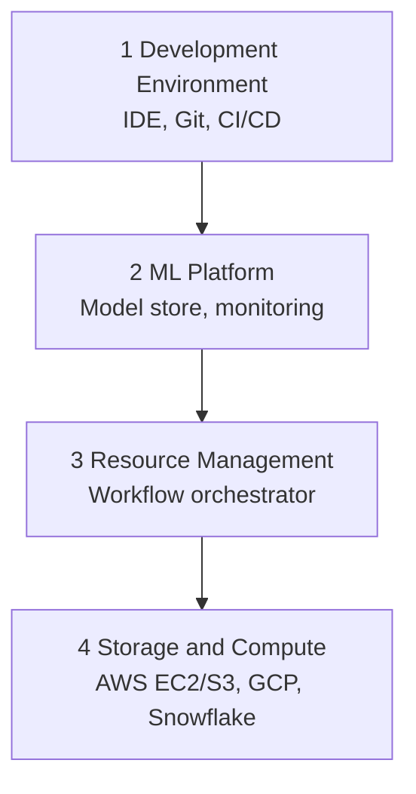
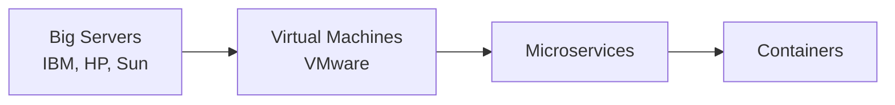
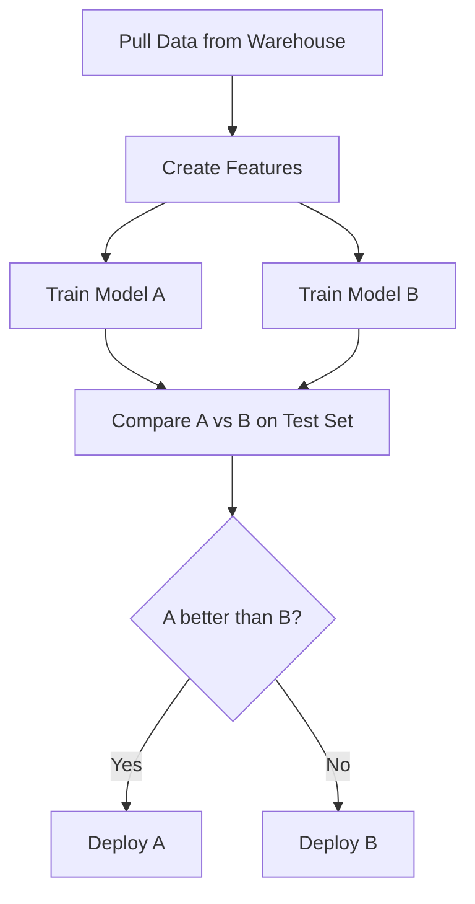
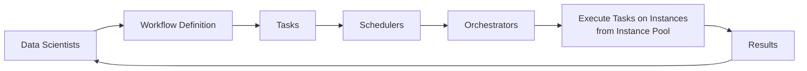

# Lecture 9: ML Infrastructure

**Course**: CST8510 Artificial Intelligence Software Development, Week 9
**Instructor**: Dr. Hari M Koduvely

## 1. Overview: Infrastructure Depends on the Business

Infrastructure requirements depend heavily on the type of company and the kind of service being provided. The size and complexity of infrastructure scales with the nature of the business.

> **Key takeaway**: There is no one size fits all infrastructure. The requirement depends on what type of company you are working in and what kind of service you provide.

### 1.1 A Spectrum of Scenarios

**Single application (basic scenario)**:
- Many apps live on phones, desktops, or the App Store.
- Behind the scenes, a service runs on AWS, Facebook, or Slack.
- The app sends a request to a backend, and the backend returns a response.
- This is the simplest case.

**Single website**:
- A website can be deployed on a single connection.
- You do not need a really big processor.
- Minimum stack: one root machine, one root server, one database.
- Load balancing can be added to this basic setup.

**Multi service companies (Uber, Netflix)**:
- Multiple services run concurrently, such as payment, backend supply, supplier management, and warehouse management.
- E commerce is a very common scenario with many services running.

**Highly specialized (Amazon)**:
- Amazon sits at the high end of complexity.
- **Historical note**: Amazon is the company that started the whole concept of **service oriented architecture (SOA)**.

**Middle ground (banks)**:
- A bank has multiple services but is not as complex as Amazon.
- **Core banking service** typically runs on mainframes and legacy infrastructure.
- **Ancillary services** (online banking, personal support) can run on the cloud through separate services.

### 1.2 Infrastructure Investment vs Production Scale

As production scale grows, the required infrastructure investment grows along with it. The slides frame this as three broad tiers:

| Production Scale | Infrastructure Investment |
|---|---|
| One simple ML app | **No infra needed** |
| Multiple common apps | **Generalized infra** |
| Serving millions of requests per hour | **Highly specialized infra** |

### 1.3 Multi Cloud as the Default

When we say "cloud," it is not necessarily a single cloud these days. No single cloud fits every purpose, so organizations commonly adopt **multi cloud** options.

---

## 2. The Four Layer Infrastructure Stack

Infrastructure is viewed as a stack with four layers, from the lowest (hardware) to the highest (developer experience).

> **Reading direction matters**:
> - Reading from **bottom to top**, the layers become **more important to data scientists**.
> - Reading from **top to bottom**, the layers become **more commoditized**.



### 2.1 Layer 1: Storage and Compute (Lowest)
- Layer where data is **collected and stored**, and where ML workloads are run.
- Includes bare machines, Snowflake, Google Cloud, Amazon Web Services (including AWS EC2 and S3).
- This layer is the **most commoditized**. There is not much difference between cloud providers.
- Cloud providers offer the same type of distribution.

### 2.2 Layer 2: Resource Management / Workflow Orchestrator
- Schedules and orchestrates ML workloads.
- Handles databases and deployments.
- A deployment spins off many pods on a user interface and involves many containers and pods.
- Common tools: **Airflow**, **Kubeflow**, **Kubernetes**.
- **Kubernetes** is the canonical orchestrator framework.

### 2.3 Layer 3: ML Platform
- Shared set of tools for ML deployment. Includes **model stores, feature stores, and monitoring tools**.
- Examples: **Amazon SageMaker**, **AzureML Studio**, **GCP Vertex AI**, **MLFlow**.
- Allows a developer to build a model and deploy it at an endpoint using simple commands, quickly, without much code.
- Responsibilities handled automatically by the platform:
  - Resource provisioning and management (whether underlying server architecture or a virtual private cloud).
  - Automatic cleanup after shutdown (deletes infrastructure, frees space).
  - Building, observability, and logging.
  - Storing models, versioning models, and storing features.

### 2.4 Layer 4: Development Environment (Top)
- Layer where **code is written**, **experiments are run**, and interaction with the production environment happens.
- IDE: notebook (Jupyter), VS Code, PyCharm, IntelliJ, or similar.
- **Versioning software**: Git, DVC, Weights and Biases.
- **CI/CD pipeline** with GitLab, GitHub, or Jenkins: runs the code, tests the code, deploys the code.
- Includes the concepts of **staging** and **production** environments (which are separate from each other).

### 2.5 Build vs Buy for the ML Platform

> **Course note**: Using a managed ML platform comes with a cost. Not every company goes for SageMaker.

| Approach | Who Uses It | Pros | Cons |
|---|---|---|---|
| Managed platform (SageMaker, Vertex AI, AzureML) | Startups with little time | Quick to push products, minimal ops work | Expensive. Charges on top of GPU usage. |
| DIY (MLflow, custom orchestration) | Large companies with legacy software and services | Full control, fits existing systems | Requires building and maintaining the platform |

Startups typically burn money on managed platforms because they just want to push out a new product. Big companies with legacy software typically build their own ML platform.

---

## 3. Storage and Compute Layer in Detail

### 3.1 Storage
- Layer where data is stored and collected.
- At the end of the day, storage is still storage.
- At the basic level, storage can be on:
  - **Hard Disk Drive (HDD)**
  - **Solid State Drive (SSD)**
- The storage layer is **completely commoditized** and has moved to the cloud.
- The point is that each storage type has to be used for the right purpose.

### 3.2 Compute Layer

- The compute layer refers to all the compute resources available.
- The amount of compute resources available determines the **scalability of ML workloads**.
- Because of virtualization, the compute layer consists of **virtual instances** full of CPUs and GPUs.
- The compute layer can usually be sliced into smaller compute units to be used concurrently:
  1. **Threads**
  2. **Containers**
  3. **Pods**

> Containers and pods are an important concept to learn. That is what everybody is using.

### 3.3 Compute Metrics

Compute units are characterized by two main metrics:

| Metric | Units | Meaning |
|---|---|---|
| **Memory** | GB | How much memory the unit has |
| **Speed** | FLOPS (floating point operations per second) | How fast it runs an operation |

**Compute Utilization** is defined as:

$$\text{Compute Utilization} = \frac{\text{FLOPS a job can run}}{\text{FLOPS the compute unit is capable of handling}}$$

### 3.4 Defining an Instance

When provisioning compute, you define an instance. Instance names look like "GXL" with some number, for example.

Instance specs typically include:
- **Memory**: for example, 24 GB or 48 GB.
- **Clock speed**: for example, 5 GHz.
- **Cores**: 4 cores, 8 cores, 16 cores, etc. These are multi core systems.
- Common combinations: "8 core 24 GB," "16 core 48 GB."

> **Note**: Clock speed varies across AMD, Intel, and other chips. Not every clock speed is the same across manufacturers.

### 3.5 The 50 Percent Rule for Compute Capacity

A critical and often overlooked point:

> **Key insight**: Though you say you have a certain computing capacity, you cannot achieve 100% of it. Practically, one can only achieve utilization around **50%**.

Why:
- **System overhead** always exists.
- Data moves between memory and disk.
- **Garbage collection** runs in the background.
- Many operating system tasks run in parallel.
- **Networking** consumes resources too.

**Result**: Your computing program can at most achieve roughly **50%** of your allocation. The rest is used for managing the system.

> **Course note**: This is something to keep in mind when planning the division of resources for workloads.

### 3.6 Cloud Spending and "Cloud Repatriation"

- Cloud spending accounts for approximately **50% of the cost of revenue** of public software companies (analysis by **a16z** venture capital).
- Because of this, some companies are doing **"cloud repatriation"** (moving workloads from cloud back on prem).

**Enterprise spending trend from 2010 to 2020**:

| Category | 2010 | 2020 | Trend |
|---|---|---|---|
| **Data center hardware and software** | ~$75B to $95B per year | ~$75B to $95B per year | Relatively flat |
| **Cloud infrastructure services** | Near $0 | Over $125B | Grew rapidly |

By 2020, cloud infrastructure services spending **exceeded** data center hardware and software spending. This is the macro trend that the shift toward hybrid and multi cloud setups sits on top of.

---

## 4. Storage Trends: From Cloud Back to Hybrid

Storage is an old topic but is possibly the next frontier of the internet.

### 4.1 The Reversal of the Cloud Migration
- People went from enterprise private on prem data centers to cloud.
- Now the direction is reversing somewhat.
- **Reasons for the reversal**:
  1. Cloud is becoming expensive.
  2. Cloud is not particularly durable.
- **Result**: People are moving to hybrid data center, cloud, or multi cloud setups.

### 4.2 Cloud Provider Lock In Tactic

> Cloud provider tactic: you can store as much data as you want, and they will charge less. But the moment you start sending this data to another cloud, they will charge.

Because of this, organizations develop strategies for which clouds to keep data in. Moving data between clouds is going to be difficult.

### 4.3 Strategic Decisions

Where to store data depends on:
- Your business.
- Your cost.
- How critical your application is.

> **Course note**: No serious business makes these decisions without many discussions before settling on a strategy.

---

## 5. Development Environment

> Development will probably be more involved. We will talk about that in the future.

The development environment is where:
- Code is written.
- Experiments are conducted.
- Interaction with the production environment happens.

### 5.1 Components of the Dev Environment

| Component | Examples |
|---|---|
| **IDE** | Jupyter Notebook, VS Code, PyCharm |
| **Versioning software** | Git, DVC (Data Version Control), Weights and Biases |
| **CI/CD** | Jenkins, GitLab, GitHub Actions |

### 5.2 Versioning and Experiment Tracking

| Tool | Purpose |
|---|---|
| **Git** | Source code version control |
| **DVC** (Data Version Control) | Data versioning |
| **Weights and Biases** | Versioning models and tracking experiments |

### 5.3 DevOps and Supporting Tools

The DevOps cycle includes:
- **Continuous Integration (CI)**
- **Continuous Deployment (CD)**
- **Continuous Testing**

Supporting tools:
- **Jira** for issue tracking.
- Various **aggregation tools**.

> Most business people don't know these. They just want to get into the first step. But at the end of the day, it's not enough to get it out. You have to get into detail. For example, if you want to get into analytics, it's a very complex platform to learn and master.

### 5.4 Notebooks: More Than an IDE

**Traditional use**: In school, notebooks are mainly used for experiments.

**Production use**: Some companies like **Netflix** have taken different approaches and are using notebooks for production. Data scientists can directly deploy notebooks to production.

**Notebooks are more than just IDEs**. They can include:
- Images.
- Documentation in LaTeX.
- Other artifacts like tables.

**Why notebooks are popular**:
- Mix of code and documentation.
- You can write code (for example, Python) that runs.
- You can also document, store, and search.
- Ideal for experimentation.

### 5.5 Notebooks Are Stateful

A defining property of notebooks from the slides:

> Notebooks are **stateful**.

What this means:
- They **retain state after a run is completed**.
- If a program fails, one can restart from where it failed.
- Ideal for doing experiments with large datasets.
- **Order of execution of the cells is important to keep track of.**

**Data scientists love them, ML engineers hate them**:
- You cannot do proper testing.
- You cannot do proper debugging.
- Execution can be inconsistent: you may execute a cell, later change variables somewhere down the line, then come back and execute it, leaving the notebook in an inconsistent state.

### 5.6 Frameworks Extending Notebooks

Frameworks trying to extend notebooks into more standard IDE workflows:

| Tool | Purpose |
|---|---|
| **Papermill** | Spawning multiple notebooks with different parameter sets |
| **Commuter** | A notebook hub for viewing, finding, and sharing notebooks within an organization |
| **nbdev** | A library to write documentation and tests in the same place |

These try to bring notebooks closer to tools like **VS Code** and **JupyterLab**.

### 5.7 The Hybrid Workflow (Lecturer's Approach)

The lecturer described a personal workflow that blends notebooks and plain Python:
1. Create plain code, for example a class, in a separate `.py` file.
2. Run that code from the notebook cell with the exclamation mark (`!`) command.
3. **Python magic** makes this possible.
4. This way you are sort of using both worlds: code stays in a separate file, and the Python file runs from the cell.

```python
# (reconstructed example) Running a separate script from a notebook cell
!python train_model.py --epochs 10

# Alternatively, using Python magic without the exclamation mark
%run train_model.py
```

The lecturer notes a preference to avoid the exclamation mark, which is why `%run` or other magic alternatives are used instead.

---

## 6. Containers and Docker

### 6.1 Why Containers Exist

**From the production side** (slides framing):
- Production workloads are spread out on **multiple instances**.
- The number of instances **changes dynamically** based on demand for predictions.
- When a new instance is created, you need to install all dependencies using a list of predefined instructions.
- **Container technology is used for this purpose.**

**From the developer side** (lecture framing):
Containers came because people faced a lot of challenges with deployment:
- Developers could not test everything in their development environment.
- When handed off to production engineers, deployments broke in the production environment.
- There were many reasons for deployment difficulty.
- People wanted to **standardize** the basic system.

The solution: the **Docker container**.

### 6.2 The Miniaturization Progression

Computing infrastructure went through progressive miniaturization:



1. **Big servers era**: Everybody ran all applications on big servers (IBM, HP, Sun). Companies had all their applications running on those.
2. **Virtual machines era**: Cloud and VMware enabled virtualization. VMs are small, can be built up, shut down, and provisioned quickly. Some part of an application would run on a VM.
3. **Microservice architecture**: Each application would have some kind of machine that could run it.
4. **Containers**: Further miniaturization. You do not need so many things to run one application. One application may need only a few libraries and some compute components. Package only that much.

### 6.3 Definition of a Container

> **Docker container**: a lightweight, standalone, executable software package.

It includes everything needed to run a piece of software: **code, runtime, system tools, libraries, and settings**. For a Python application, all libraries required to run the Python code plus all dependencies are packaged into this smaller unit.

Containers **isolate software from its environment**, ensuring that it works consistently across different systems.

**Images vs containers**:
- Docker containers are **built from images**.
- Images are **templates** containing the application's code, runtime, and other dependencies.
- The image is the static recipe, the container is the running instance.

### 6.4 Solving the Python Library Version Problem

Python came with many open source libraries, and this caused a large compatibility problem:

**The reasoning chain**:
1. Python has so many open source libraries available.
2. People started using them widely.
3. These libraries come in different versions.
4. An application runs with specific versions, for example certain versions of NumPy or Pandas.
5. A new application may not be compatible with those specific versions.
6. Conflicts always arise.
7. **Conflict management became huge because of version overlapping.**
8. Docker containers solved this because each container can have its own version.

> A Docker container is a kind of software environment ensuring that what I develop and what works for me always works. That software always behaves the same way.

### 6.5 The Image and Portability

Another problem solved by containers: handing work to production engineers.

The flow:
1. You take the image from your laptop or development environment.
2. You give it to production engineers.
3. They test it on the production environment.
4. Once Docker is installed on both sides, the image moves over directly.
5. It **exactly packages** the information needed to run.
6. It abstracts the topic and makes it easy to move your images from one environment to another.
7. It runs without any confusion.

> That is the biggest advantage of Docker.

### 6.6 Benefits of Docker Containers

| Benefit | Explanation |
|---|---|
| **Portability** | Containers can run on any system with Docker installed, regardless of the underlying infrastructure. If Docker is installed on Windows and you created an image, and the same Docker version is installed elsewhere, you can port the image without worry. |
| **Consistency** | Containers ensure that applications behave the same way in development, testing, and production. This is the biggest issue containers solve. |
| **Isolation** | Containers run in their own environment, minimizing conflicts with other applications or system components (for example, the Python library version conflicts). |
| **Scalability** | Containers can be easily scaled up or down, making it simpler to manage application loads and resources. After you create an image, you upload it to a container registry like **Docker Hub**. People can search for it, download the image, and deploy multiple instances. |
| **Version control and sharing** | Docker images can be versioned and shared through repositories like **Docker Hub**, enabling collaboration and easy updates. You can apply access control and make images searchable. |

### 6.7 The Dockerfile

> Containers are not the basic unit that we use in production. The basic unit we use in production is the **Dockerfile**.

A Dockerfile is the recipe used to build a Docker image. (Later in the lecture, the lecturer also describes **pods** as the basic deployable unit in production, so treat the Dockerfile as the basic unit of **definition** and the pod as the basic unit of **deployment**.)

**Example scenario from the slides**: Build an image that

1. Downloads the latest PyTorch base image.
2. Clones NVIDIA's apex repository on GitHub, navigates to the newly created `apex` folder, and installs apex (with C++ and CUDA extensions).
3. Sets `fancy-nlp-project` as the working directory.
4. Clones Hugging Face's `transformers` repository on GitHub, navigates into the `transformers` folder, and installs transformers.

```dockerfile
FROM pytorch/pytorch:latest
RUN git clone https://github.com/NVIDIA/apex
RUN cd apex && \
    python3 setup.py install && \
    pip install -v --no-cache-dir --global-option="--cpp_ext" \
    --global-option="--cuda_ext" ./

WORKDIR /fancy-nlp-project
RUN git clone https://github.com/huggingface/transformers.git && \
    cd transformers && \
    python3 -m pip install --no-cache-dir .
```

**Syntax explanation**:
- `FROM`: specifies the base image (here, PyTorch).
- `RUN`: executes a shell command inside the image during build. Multiple commands can be chained with `&&` and line continuations with `\`.
- `WORKDIR`: creates a working directory and changes into it for subsequent commands.

> These are running scripts, like the running scripts we built on Linux before. It's the same kind of language. You have to use one way of setting up these scripts.

> **Course note**: One suggestion is to dockerize the projects that you want to play with as practice.

---

## 7. Pods

### 7.1 Why Containers Are Not the Production Unit

> Containers are not the basic unit required in production. Those are called **pods**.

### 7.2 Definition

**Pod**: a group of one or more containers, with shared storage and network, and a specification for how to run the containers. It is the **smallest deployable unit of computing** that can be created and managed in Kubernetes.

Properties of a pod:
- Contains one or more containers.
- Share the same storage in the pod.
- Share the same IP address and port space.
- Can find each other via **localhost**.
- Can share a mounted volume (shared storage).
- Come with **instructions on how to run each of the containers** inside the pod.

**Atomic unit of scaling**: In Kubernetes, the pod is the atomic unit of scaling. When you scale an application up or down, you are actually increasing or decreasing the number of pods.

**Use case**: Pods are used when there is a need for a few containers to work together very closely as a single cohesive unit of service.

### 7.3 Why Pods Are the Unit in Kubernetes

The reason pods are used in Kubernetes (not containers directly) is that **every application typically has a microservice architecture**. Applications depend on more than one service.

**Example**: A small e commerce company has:
- A payment service.
- An authentication service.
- A subscription service.

Each service needs its own version of software and its own independent dependencies. So:
1. Package each service into a container.
2. Take all the containers that depend on each other to run the whole service.
3. They share the same IP, the same network, the same storage.
4. Put them into one pod.
5. Deploy that pod.

> A pod is a group of containers which are dependent on each other to run a service.

### 7.4 Scaling with Pods

> **Key takeaway**: When you scale an application on a platform, you are not scaling the container. You are scaling the pods.

- The pod is the **basic, smallest interactive unit** used to scale the application.
- You can have multiple pods.
- Pods serve multiple microservices that provide services.

*(reconstructed example) A minimal Kubernetes pod manifest illustrating multi container grouping:*

```yaml
apiVersion: v1
kind: Pod
metadata:
  name: ecommerce-pod
spec:
  containers:
    - name: payment
      image: company/payment:1.0
    - name: auth
      image: company/auth:1.2
    - name: subscription
      image: company/subscription:0.9
  volumes:
    - name: shared-data
      emptyDir: {}
```

---

## 8. Resource Management: Cron, Schedulers, Orchestrators

### 8.1 Why Resource Management Matters

| Era | Resource Situation | Focus |
|---|---|---|
| **Pre cloud** | Resources were limited | Maximizing resource utilization |
| **Cloud** | Resources are effectively unlimited | Using resources cost effectively |

**Two characteristics of ML workflows** that influence resource management:
1. **Repetitiveness** (the same workflow runs many times).
2. **Dependencies** (steps depend on earlier steps).

### 8.2 The Historical Context

> **Anecdote from the lecturer**: Long back, when I was looking for a PhD, Linux just came. We were starting to use Linux, and what you would see back then were mainframes, VAXes, and Unix workstations. At that time, computers were shared. Every department would have one computer, so you had to be able to run things scheduled. The way you use it is to set a time.

This scheduling mechanism is **cron**.

### 8.3 Cron

- **Cron**: scheduling repetitive jobs to run at fixed times.
- Good for running something every day at a fixed time.
- **Limitation of cron**: It cannot handle dependencies between the jobs it runs. It cannot run multiple dependent tasks.

```bash
# (additional example) Basic cron entry: run a script every day at 2 AM
0 2 * * * /usr/bin/python3 /home/user/daily_job.py
```

### 8.4 Schedulers

**Schedulers** are cron programs that can handle dependencies.

Key properties:
- Take in the **DAG** of a workflow and schedule each step accordingly.
- Tend to leverage **queues** to keep track of jobs.
- Need to be aware of the resources **available** and the resources **needed** to run each job.

**Example ML pipeline with dependencies**:
1. Pull data from a data warehouse.
2. Create features.
3. Train model A on the extracted features.
4. Train model B on the extracted features.
5. Compare A to B on a test set.
6. If A is better than B, deploy A. If B is better than A, deploy B.

If you want to execute this workflow every day, every week, or once a week, cron cannot handle it because each step is separated by dependencies.

> Schedulers take this whole workflow as a task and execute each step with that task. They create a **DAG (directed acyclic graph)** of blocks. Schedulers can handle one workflow with different entities.



### 8.5 Example Scheduler: Slurm

**Slurm** is a scheduler you can use. Jobs are submitted with `SBATCH` directives.

`SBATCH` specifies:
- Job name.
- Job type.
- How much CPU can be allocated to the job.
- How much memory can be allocated.
- Time window.

```bash
#!/bin/bash
#SBATCH -J JobName
#SBATCH --time=11:00:00          # When to start the job
#SBATCH --mem-per-cpu=4096       # Memory, in MB, to be allocated per CPU
#SBATCH --cpus-per-task=4        # Number of cores per task
```

### 8.6 Orchestrators

Schedulers schedule the job to execute, but they **cannot create the underlying resources**. They only allocate resources that already exist.

> **Key distinction**:
> - **Schedulers**: concerned with **when** to run the jobs and **what resources are needed** to run those jobs.
> - **Orchestrators**: concerned with **where to get the resources** and **how to create resources**.

**Orchestrator responsibilities**:
- Do the virtualization.
- Create containers.
- Create pods.
- Scale up and down dynamically.
- Dynamically increase or decrease the number of instances in the available instance pool.
- If a scheduler says we need more machines, orchestrators can create more pods.
- Deal with the whole structure of the infrastructure.

**Kubernetes** is the most well known orchestrator today. It is actually more powerful than just the high level idea presented here.

### 8.7 Scheduler vs Orchestrator Summary

| Aspect | Scheduler | Orchestrator |
|---|---|---|
| Primary concern | When to run jobs and what resources are needed | Where to get those resources |
| Level of abstraction | **Job type**: DAGs, priority queues, user level quotas | **Lower level**: machines, instances, clusters, service level grouping, replication |
| Action | Allocates existing resources to jobs | Creates, scales, and manages resources |
| Example | Slurm | Kubernetes |
| Can spin up new machines? | No | Yes |
| Handles dependencies? | Yes (between job steps) | Yes (between infrastructure components) |

---

## 9. Workflow Management

### 9.1 The Workflow Management Flow

Workflow management tools allow you to specify your workflows as **DAGs**. Workflows can be defined using either **code (Python)** or **configuration files (YAML)**. Once a workflow is defined, the underlying scheduler usually works with an orchestrator to allocate resources to run the workflow.



### 9.2 Airflow

- One of the **first** workflow management tools.
- Developed at **Airbnb** and open sourced.
- Contains a **huge library of operators**.
- Easy to use with different cloud providers, databases, and storage options.
- Uses **DAGs** as the primary abstraction.

**Airflow drawbacks**:
- **Monolithic**: Airflow packages the entire workflow into one container.
- **Not parameterized**: Airflow's DAGs cannot accept parameters at runtime. You have to restart.
- If you want to run the same ML model with different learning rates, you have to create different workflows.
- **Airflow DAGs are static**: it cannot automatically create new steps at runtime as needed. You cannot modify the DAG.
- Once you create the DAG in Airflow, you have to run it or recreate it. You cannot edit or patch it.
- To change the learning method or other parameters, you need to create a different instance of that workflow.

### 9.3 Argo and Prefect

The next generation of workflow orchestrators, **Argo** and **Prefect**, address Airflow's limitations:
- You can edit your workflow.
- You can pass task parameters.
- You can dynamically modify behavior.

> **Course note**: Some of your projects may require Argo.

### 9.4 Framework Comparison

| Framework | Origin | Language | DAG Flexibility | Parameters at Runtime |
|---|---|---|---|---|
| **Airflow** | Airbnb | Python / YAML | Static DAG, must recreate | Not supported cleanly |
| **Argo** | CNCF | YAML | Flexible, editable | Yes |
| **Prefect** | Prefect | Python | Flexible, editable | Yes |

*(reconstructed example) A minimal Airflow DAG to illustrate the static structure:*

```python
from airflow import DAG
from airflow.operators.python import PythonOperator
from datetime import datetime

with DAG("ml_pipeline", start_date=datetime(2026, 1, 1), schedule="@daily") as dag:
    pull = PythonOperator(task_id="pull_data", python_callable=pull_data)
    features = PythonOperator(task_id="make_features", python_callable=make_features)
    train_a = PythonOperator(task_id="train_a", python_callable=train_model_a)
    train_b = PythonOperator(task_id="train_b", python_callable=train_model_b)
    compare = PythonOperator(task_id="compare", python_callable=compare_models)

    pull >> features >> [train_a, train_b] >> compare
```

---

## 10. The ML Platform

### 10.1 What Is an ML Platform

- ML Platform is a relatively new concept, like MLOps itself.
- **No universal standard definition** exists.
- The **shared set of tools for ML deployment** together make up the ML platform.
- Most important components:
  1. **Model Deployment**
  2. **Model Store**
  3. **Feature Store**

### 10.2 Evaluation Criteria for ML Platform Tools

Two important criteria for evaluating component tools:

**Criterion 1: Cloud compatibility**
- Does the tool work with your cloud provider, or does it allow you to use it on your own data center?
- You need to run and serve models from a compute layer, and usually tools only support integration with a handful of cloud providers.

**Criterion 2: Open source vs managed service**

| Aspect | Open Source | Managed Service |
|---|---|---|
| Hosting | Hosted by your own engineers | Hosted by the provider |
| Data security and privacy | Less of a concern (you control it) | May not comply with your data storage and privacy regulations |
| Engineering resources | More Eng resources required | Less Eng resources required |
| Cost | Generally cheaper | Could be more expensive |

### 10.3 Managed Services vs DIY: The Cost Tradeoff

> **Course note**: If you go for a managed service, you have to pay more. Think about the need, the cost, the service. You can use open source. There are open source platforms that are quite good.

#### 10.3.1 Advantage of Managed Services

> The main advantage is that, once you create a model, you can just click a button. It will create it, deploy it, and give you an endpoint. Just wait, and then you get an endpoint. Then that endpoint can be queried. That's how you get your prediction. That makes life very easy. If you don't want it, you just delete it.

Workflow contrast:

| DevOps (DIY) | Managed Services |
|---|---|
| Write a Dockerfile | Click a button |
| Build an image | Auto built |
| Write DevOps steps | Handled automatically |
| Deploy it manually | One click deploy |
| Manage your own infrastructure | Infrastructure abstracted away |

#### 10.3.2 The Cost Structure of Managed Services

**Things you still have to worry about**:
- What service you are using and what you are not using.
- Shut down instances you are not using, otherwise they will keep charging.

**Things managed services handle**:
- Latency. You do not have to worry about latency.
- **Serverless billing**: the only time you are charged is when there is an action.

**Contrast with self managed instances**:
- Running your own instance on a physical instance means 24 hours of charges.
- There is a constant charge whether or not you are using it.

> So there are a lot of advantages to this, but it is a kind of tradeoff.

### 10.4 Component 1: Model Deployment

A **deployment service** helps in both pushing models and their dependencies to production and exposing them as **endpoints**.

> Deployment is the **most mature** among all ML platform components.

**Tools by provider**:

| Category | Tool |
|---|---|
| **AWS** | SageMaker |
| **Azure** | AzureML |
| **GCP** | VertexAI |
| **Startups / open source** | MLFlow Models, Seldon, Cortex, Ray Serve |

### 10.5 Component 2: Model Store

A **model store** is a component of an ML platform that manages model artifacts.

#### 10.5.1 Why a Model Store Is More Than Just Storing a Binary

> To help with debugging and maintenance, it is not sufficient to store the model object alone.

**Information about each model that should be stored**:

| Artifact | Description |
|---|---|
| **Model Definition** | Loss function, number of layers of the neural network, number of parameters in each layer |
| **Model Parameters** | Actual values of the model parameters after training |
| **Featurize and Predict functions** | The code that turns raw inputs into predictions |
| **Dependencies** | Python packages required |
| **Data** | Pointers to data storage |
| **Model Generation Code** | Pointers to the GitHub repo used to build the model |
| **Experiment artifacts** | Loss curves, performance metrics |
| **Tags** | Arbitrary labels for search and organization |

#### 10.5.2 Capabilities

- **Store models and their versions**.
- **Track experiments**. Create different models. Each model is versioned. Each experiment run on that model version is stored.
- **Re run with new data**. You can go back, put in new data, and run again.
- **Rollback**. Go back with your whole version if something goes wrong with the new version.
- **Logs inspection**. Check your logs if you need to go back and fix the problem.
- **Metrics and training curves**. Training curves are stored directly to the dashboard, which makes it easy to see whether the model is converging or whether it can be improved.

### 10.6 Component 3: Feature Store

A **feature store** is another piece of the ML platform, dealing with features used by multiple ML models.

#### 10.6.1 Why a Feature Store Is Needed

Three problems a feature store solves:
1. **Feature management**
2. **Feature computation**
3. **Feature consistency** (the same feature definition used by training and inference)

**Example from a ride sharing company**: There are passenger features, driver features, and other feature sets. Different ML models often use the **same features**. Without a feature store, each model team would rebuild the same features.

#### 10.6.2 How a Feature Store Works

1. Create a **set of features** once.
2. Store them in a shared location.
3. Keep updating those features independently.
4. Any ML model can query that feature from the feature table and use it.
5. You do not have to worry about updating those features yourself. That is done independently by the feature developers.

#### 10.6.3 The Implementation (Simpler Than It Sounds)

> Again, it's ultimately some SQL statements.

Three things a feature store handles:
1. A **data pipeline** to compute those features.
2. **Tables** where features are stored and published.
3. **Metadata tables** that answer: "if I want a particular feature, which table should I use?"

*(reconstructed example) A simplified feature lookup:*

```sql
-- Fetch passenger features for a model at inference time
SELECT passenger_id, lifetime_trips, avg_fare, churn_score
FROM feature_store.passenger_features
WHERE passenger_id = :id
  AND as_of_date = CURRENT_DATE
```

#### 10.6.4 Batch vs Online (Streaming) Features

| Type | Typical Storage | Notes |
|---|---|---|
| **Batch features** | Stored in tables | Traditional approach. Safe and common. |
| **Streaming (online) features** | Typically not stored | They produce a lot of issues. |
| **Modern hybrid stores** | Both | Online features are continuously computed. They keep updating every machine learning model under certain conditions. |

> Typically what you store are batch features. But these days there are feature stores that can store both online and batch.

#### 10.6.5 Popular Feature Store Tools

| Tool | Strengths | Weaknesses |
|---|---|---|
| **Feast** | Strong in creating **batch features** | Weak in creating **streaming features** |
| **Tecton** | Capable of storing **both online and batch features** | Requires **deep integration** |

---

## 11. Summary: Key Concepts from This Lecture

The slides framed the learning goals of the lecture as:
- Different **layers of ML infrastructure**.
- **Scheduling and orchestration** of different ML tasks.
- **ML resource management**.
- Important **components of the ML platform**.

Expanded into the topics covered:

1. **Infrastructure depends on the business**: a single app is very different from Amazon or a bank. Investment scales with production scale.
2. **The four layer stack** (bottom to top): storage and compute, resource management, ML platform, development environment. Bottom is more commoditized, top is more important to data scientists.
3. **Storage and compute realities**: the 50% utilization rule (Compute Utilization = FLOPS used / FLOPS available), HDD vs SSD, multi core CPU/GPU instances.
4. **Cloud spending trends**: cloud now exceeds data center spending, but some companies are doing **cloud repatriation**.
5. **Storage trends**: hybrid and multi cloud are replacing single cloud strategies.
6. **Notebooks**: stateful, retain state across runs, ideal for experimentation. Papermill, Commuter, nbdev extend them.
7. **Containers**: lightweight executable packages solving environment and version conflicts, built from images.
8. **Pods**: the smallest deployable unit in Kubernetes, grouping dependent containers, the atomic unit of scaling.
9. **Cron vs schedulers vs orchestrators**: the progression from simple time based jobs to full infrastructure management. Schedulers handle DAGs and queues, orchestrators handle instances and replication.
10. **Workflow frameworks**: Airflow (monolithic, static DAGs), Argo and Prefect (flexible, parameterizable).
11. **ML Platform components**: Model Deployment (most mature), Model Store, Feature Store.
12. **Model store**: stores not just the model binary but definitions, parameters, dependencies, data pointers, generation code, experiment artifacts, and tags.
13. **Feature store**: shared features for multiple models, handles management, computation, and consistency. Feast (batch strong) vs Tecton (batch and online).
14. **Managed services vs DIY**: cost and convenience tradeoff, especially relevant for startups vs large enterprises.

> **Final course note**: These are all high level concepts, but they are important. The idea of workflow, the idea of schedulers, what is a container, what is a pod, what are the different components of the ML platform (feature store, model store, experimental tracking) are some of the issues you need to understand.
